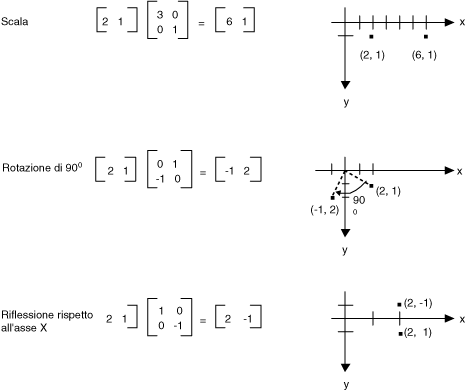
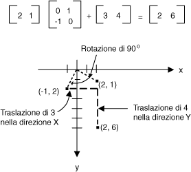
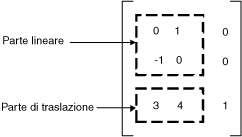

# Rappresentazione tramite matrici delle trasformazioni
Una matrice m×n è costituita da un insieme di numeri ordinati in righe m e colonne n.  Nell'immagine seguente vengono mostrate alcune matrici.  
  
   
  
 È possibile sommare due matrici con le stesse dimensioni effettuando la somma degli elementi corrispondenti.  Nell'esempio seguente viene mostrata la somma di due matrici.  
  
   
  
 È possibile moltiplicare una matrice m×n per una matrice n×p. Si otterrà una matrice m×p.  È necessario che il numero di colonne della prima matrice corrisponda al numero di righe della seconda matrice.  È ad esempio possibile moltiplicare una matrice 4×2 per una matrice 2×3, in modo da ottenere una matrice 4×3.  
  
 I punti su un piano e le righe e le colonne di una matrice possono essere considerati come vettori.  Ad esempio \(2, 5\) è un vettore con due componenti e \(3, 7, 1\) un vettore con tre componenti.  Il prodotto scalare di due vettori viene definito come segue:  
  
 \(a, b\) • \(c, d\) \= ac \+ bd  
  
 \(a, b, c\) • \(d, e, f\) \= ad \+ be \+ cf  
  
 Il prodotto scalare di \(2, 3\) e \(5, 4\) ad esempio è pari a \(2\)\(5\) \+ \(3\)\(4\) \= 22.  Il prodotto scalare di \(2, 5, 1\) e \(4, 3, 1\) è pari a \(2\)\(4\) \+ \(5\)\(3\) \+ \(1\)\(1\) \= 24.  Si noti che il prodotto scalare di due vettori è un numero, non un vettore.  Si noti inoltre che è possibile calcolare il prodotto scalare solo se i due vettori hanno lo stesso numero di componenti.  
  
 Si ponga A\(i, j\) come voce della matrice A nella ima riga e nella jma colonna.  A\(3, 2\) ad esempio è la voce della matrice A nella 3a riga e nella 2a colonna.  Si supponga che A, B e C siano matrici e che AB \= C.  Le voci di C vengono calcolate come segue.  
  
 C\(i, j\) \= \(riga i di A\) • \(colonna j di B\)  
  
 Nell'immagine seguente vengono riportati svariati esempi di moltiplicazione di matrici.  
  
   
  
 Se si considera un punto del piano come matrice 1x2, è possibile trasformare tale punto moltiplicandolo per una matrice 2x2.  Nell'immagine seguente vengono mostrate svariate trasformazioni applicate al punto \(2, 1\).  
  
   
  
 Tutte le trasformazioni mostrate nell'immagine precedente sono trasformazioni lineari.  Determinati tipi di trasformazioni, quale la traslazione, non sono lineari. Non è quindi possibile esprimerle come moltiplicazione per una matrice 2x2.  Si supponga che si desideri partire dal punto \(2, 1\), ruotarlo di 90 gradi, traslarlo di 3 unità nella direzione x e di 4 unità nella direzione y.  È possibile ottenere questo risultato tramite una moltiplicazione di matrici seguita da una somma di matrici.  
  
   
  
 Una trasformazione lineare \(moltiplicazione per una matrice 2x2\) seguita da una traslazione \(aggiunta di una matrice 1x2\) viene definita trasformazione affine.  In alternativa alla memorizzazione di una trasformazione affine in una coppia di matrici \(una per la parte lineare e una per la traslazione\), è possibile memorizzare l'intera trasformazione in una matrice 3x3.  Perché questa operazione sia possibile, è necessario memorizzare un punto del piano in una matrice 1x3 specificando una terza coordinata fittizia.  Si imposta di solito ogni terza coordinata come equivalente a 1.  Il punto \(2, 1\) ad esempio viene rappresentato dalla matrice \[2 1 1\].  Nell'immagine seguente viene mostrata una trasformazione affine \(rotazione di 90 gradi; traslazione di 3 unità nella direzione x e 4 unità nella direzione y\) espressa come moltiplicazione per una singola matrice 3x3.  
  
   
  
 Il punto \(2, 1\) dell'esempio precedente è associato al punto \(2, 6\).  Si noti che la terza colonna della matrice 3x3 contiene i numeri 0, 0, 1.  Questi valori saranno sempre utilizzati per la matrice 3x3 di una trasformazione affine.  I numeri più importanti sono i sei numeri contenuti nelle colonne 1 e 2.  La porzione 2x2 superiore sinistra della matrice rappresenta la parte lineare della trasformazione e le prime due voci della 3a riga rappresentano la traslazione.  
  
   
  
 In [!INCLUDE[ndptecgdiplus](../../../../includes/ndptecgdiplus-md.md)] è possibile memorizzare una trasformazione affine in un oggetto <xref:System.Drawing.Drawing2D.Matrix>.  Poiché la terza colonna di una matrice che rappresenta una trasformazione affine contiene sempre i valori \(0, 0, 1\), quando si costruisce un oggetto <xref:System.Drawing.Drawing2D.Matrix> è necessario specificare solo i sei numeri contenuti nelle prime due colonne.  L'istruzione `Matrix myMatrix = new Matrix(0, 1, -1, 0, 3, 4)` consente di costruire la matrice mostrata nell'immagine precedente.  
  
## Trasformazioni composte  
 Una trasformazione composta è costituita da una sequenza di trasformazioni, una di seguito all'altra.  Si prendano in considerazione le matrici e le trasformazioni riportate nell'elenco seguente:  
  
|||  
|-|-|  
|Matrice A|Ruotare di 90 gradi|  
|Matrice B|Ridimensionare per un fattore di 2 nella direzione x|  
|Matrice C|Traslare di 3 unità nella direzione y|  
  
 Se si parte dal punto \(2, 1\) \- rappresentato dalla matrice \[2 1 1\] \- e si moltiplica per A, poi per B, quindi per C, il punto \(2, 1\) subirà le tre trasformazioni nell'ordine specificato.  
  
 \[2 1 1\]ABC \= \[\-2 5 1\]  
  
 Anziché memorizzare le tre parti della trasformazione composta in tre matrici distinte, è possibile moltiplicare A, B e C contemporaneamente per ottenere una singola matrice 3x3 in cui memorizzare l'intera trasformazione composta.  Si supponga che ABC \= D.  Un punto moltiplicato per D darà quindi lo stesso risultato di un punto moltiplicato per A, poi per B, quindi per C.  
  
 \[2 1 1\]D \= \[\-2 5 1\]  
  
 Nell'immagine seguente vengono mostrate le matrici A, B, C e D.  
  
   
  
 La possibilità di formare la matrice di una trasformazione composta tramite la moltiplicazione delle matrici di trasformazione individuali implica che è possibile memorizzare in un singolo oggetto <xref:System.Drawing.Drawing2D.Matrix> qualunque sequenza di trasformazioni affini.  
  
> [!CAUTION]
>  L'ordine di una trasformazione composta è importante.  La rotazione seguita dal ridimensionamento e infine dalla traslazione non fornisce in genere lo stesso risultato del ridimensionamento seguito dalla rotazione e infine dalla traslazione.  Analogamente, l'ordine di moltiplicazione delle matrici è essenziale.  ABC non corrisponde generalmente a BAC.  
  
 Nella classe <xref:System.Drawing.Drawing2D.Matrix> sono disponibili svariati metodi per la compilazione di una trasformazione composta: <xref:System.Drawing.Drawing2D.Matrix.Multiply%2A>, <xref:System.Drawing.Drawing2D.Matrix.Rotate%2A>, <xref:System.Drawing.Drawing2D.Matrix.RotateAt%2A>, <xref:System.Drawing.Drawing2D.Matrix.Scale%2A>, <xref:System.Drawing.Drawing2D.Matrix.Shear%2A> e <xref:System.Drawing.Drawing2D.Matrix.Translate%2A>.  L'esempio seguente consente di creare la matrice di una trasformazione composta che esegue prima di tutto una rotazione di 30 gradi, quindi un ridimensionamento con fattore 2 nella direzione y e infine una traslazione di 5 unità nella direzione x:  
  
 [!code-csharp[System.Drawing.CoordinateSystems#11](../../../../samples/snippets/csharp/VS_Snippets_Winforms/System.Drawing.CoordinateSystems/CS/Class1.cs#11)]
 [!code-vb[System.Drawing.CoordinateSystems#11](../../../../samples/snippets/visualbasic/VS_Snippets_Winforms/System.Drawing.CoordinateSystems/VB/Class1.vb#11)]  
  
 Nell'immagine seguente viene mostrata la matrice.  
  
   
  
## Vedere anche  
 [Sistemi di coordinate e trasformazioni](../../../../docs/framework/winforms/advanced/coordinate-systems-and-transformations.md)   
 [Utilizzo di trasformazioni nel codice gestito GDI\+](../../../../docs/framework/winforms/advanced/using-transformations-in-managed-gdi.md)