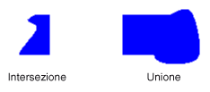

# Regioni in GDI+
Una regione è una parte dell'area di visualizzazione di una periferica di output.  Le regioni possono essere semplici \(un singolo rettangolo\) o complesse \(una combinazione di poligoni e curve chiuse\).  Nell'immagine seguente vengono mostrate due regioni: una creata da un rettangolo e l'altra creata da un percorso.  
  
   
  
## Utilizzo delle regioni  
 Le regioni vengono spesso utilizzate per la definizione dell'area di visualizzazione e per l'hit testing.  La definizione dell'area di visualizzazione implica la delimitazione dell'area di disegno a una determinata regione dell'area di visualizzazione, solitamente la regione che è necessario aggiornare.  Il controllo effettuato tramite l'hit testing consente stabilire se il cursore si trova in una determinata regione della schermata nel momento in cui si preme un pulsante del mouse.  
  
 È possibile creare una regione basandosi su un rettangolo o un percorso  e persino creare regioni complesse tramite la combinazione di regioni esistenti.  Nella classe <xref:System.Drawing.Region> sono disponibili i seguenti metodi per la combinazione di regioni: <xref:System.Drawing.Region.Intersect%2A>, <xref:System.Drawing.Region.Union%2A>, <xref:System.Drawing.Region.Xor%2A>, <xref:System.Drawing.Region.Exclude%2A> e <xref:System.Drawing.Region.Complement%2A>.  
  
 L'intersezione tra due regioni costituisce l'insieme di tutti i punti appartenenti a entrambe le regioni.  L'unione è costituita dall'insieme di tutti i punti appartenenti a una o all'altra regione o a entrambe.  Il complemento di una regione è costituito dall'insieme di tutti i punti non inclusi nella regione.  Nell'immagine seguente vengono illustrate l'intersezione e l'unione delle due regioni mostrate nell'immagine precedente.  
  
   
  
 Il metodo <xref:System.Drawing.Region.Xor%2A>, applicato a una coppia di regioni, consente di creare una regione contenente tutti i punti appartenenti a una o all'altra regione, ma non a entrambe.  Il metodo <xref:System.Drawing.Region.Exclude%2A>, applicato a una coppia di regioni, genera una regione contenente tutti i punti inclusi nella prima regione ma non nella seconda.  Nell'immagine seguente vengono mostrate le regioni risultanti dall'applicazione dei metodi <xref:System.Drawing.Region.Xor%2A> e <xref:System.Drawing.Region.Exclude%2A> alle due regioni illustrate all'inizio dell'argomento.  
  
   
  
 Per riempire una regione, sono necessari un oggetto <xref:System.Drawing.Graphics>, un oggetto <xref:System.Drawing.Brush> e un oggetto <xref:System.Drawing.Region>.  L'oggetto <xref:System.Drawing.Graphics> fornisce il metodo <xref:System.Drawing.Graphics.FillRegion%2A> e nell'oggetto <xref:System.Drawing.Brush> vengono memorizzati gli attributi del riempimento, quali il colore o il motivo.  L'esempio seguente consente di riempire una regione con un colore a tinta unita.  
  
 [!code-csharp[LinesCurvesAndShapes#61](../../../../samples/snippets/csharp/VS_Snippets_Winforms/LinesCurvesAndShapes/CS/Class1.cs#61)]
 [!code-vb[LinesCurvesAndShapes#61](../../../../samples/snippets/visualbasic/VS_Snippets_Winforms/LinesCurvesAndShapes/VB/Class1.vb#61)]  
  
## Vedere anche  
 <xref:System.Drawing.Region?displayProperty=fullName>   
 [Linee, curve e forme](../../../../docs/framework/winforms/advanced/lines-curves-and-shapes.md)   
 [Utilizzo delle regioni](../../../../docs/framework/winforms/advanced/using-regions.md)