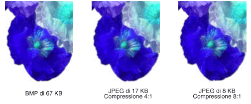

# Tipi di bitmap
Una bitmap è costituita da una matrice di bit che consentono di specificare il colore di ogni pixel in una matrice rettangolare di pixel.  Il numero di colori che è possibile assegnare a ogni pixel è determinato dal numero di bit destinati al singolo pixel.  Se ad esempio ogni pixel è rappresentato da 4 bit, sarà possibile assegnare a un dato pixel uno dei 16 colori diversi disponibili \(2^4 \= 16\).  Nella tabella seguente vengono riportati alcuni esempi relativi al numero di colori che è possibile assegnare a un pixel rappresentato da un dato numero di bit.  
  
|Bit per pixel|Numero di colori che è possibile assegnare al pixel|  
|-------------------|---------------------------------------------------------|  
|1|2^1 \= 2|  
|2|2^2 \= 4|  
|4|2^4 \= 16|  
|8|2^8 \= 256|  
|16|2^16 \= 65,536|  
|24|2^24 \= 16,777,216|  
  
 Nei file su disco in cui vengono memorizzate le bitmap sono solitamente presenti uno o più blocchi di informazioni, in cui vengono memorizzate informazioni quali il numero di bit per pixel, il numero di pixel in ogni riga e il numero di righe della matrice.  È possibile che in tali file sia presente anche una tabella dei colori, definita a volte come tavolozza dei colori.  Una tabella dei colori consente di associare i valori numerici della bitmap a colori specifici.  Nell'immagine seguente viene mostrata un'immagine ingrandita, oltre alla relativa bitmap e tabella dei colori.  Ogni pixel è rappresentato da un numero a 4 bit: Nella tabella dei colori sono quindi disponibili 2^4 \= 16 colori.  Ogni colore della tabella è rappresentato da un numero a 24 bit: 8 bit per il rosso, 8 bit per il verde e 8 bit per il blu.  I numeri vengono mostrati in formato esadecimale \(base 16\): A \= 10, B \= 11, C \= 12, D \= 13, E \= 14, F \= 15.  
  
   
  
 Si osservi il pixel nella riga 3 della colonna 5 dell'immagine.  Il numero corrispondente nella bitmap è 1.  Nella tabella dei colori il valore 1 rappresenta il rosso, quindi il pixel è rosso.  Tutte le voci presenti nella prima riga della bitmap sono pari a 3.  Nella tabella dei colori il valore 3 rappresenta il blu, quindi tutti i pixel della prima riga dell'immagine sono blu.  
  
> [!NOTE]
>  Alcune bitmap vengono memorizzate in formato capovolto. I numeri della prima riga della bitmap corrispondono ai pixel dell'ultima riga dell'immagine.  
  
 Una bitmap i cui indici sono memorizzati in una tabella dei colori viene definita bitmap indicizzata con tavolozza.  Per alcune bitmap la tabella dei colori non è necessaria.  Se ad esempio in una bitmap vengono utilizzati 24 bit per pixel, è possibile memorizzare i colori stessi anziché memorizzare gli indici in una tabella dei colori.  Nell'immagine seguente viene mostrata una bitmap in cui vengono memorizzati direttamente i colori \(24 bit per pixel\), anziché utilizzare una tabella dei colori.  Viene inoltre mostrato un ingrandimento dell'immagine corrispondente.  Nella bitmap FFFFFF rappresenta il bianco, FF0000 rappresenta il rosso, 00FF00 rappresenta il verde e 0000FF rappresenta il blu.  
  
   
  
## Formati di file grafici  
 Sono disponibili molti formati standard per il salvataggio delle bitmap nei file su disco.  [!INCLUDE[ndptecgdiplus](../../../../includes/ndptecgdiplus-md.md)] supporta i formati di file grafici descritti nei paragrafi seguenti.  
  
### BMP  
 BMP è un formato standard utilizzato da Windows per la memorizzazione di immagini indipendenti da periferiche e da applicazioni.  Il numero di bit per pixel \(1, 4, 8, 15, 24, 32 o 64\) per un dato file BMP viene specificato nell'intestazione del file.  I file BMP con 24 bit per pixel sono molto comuni.  I file BMP non sono solitamente compressi, quindi non se ne consiglia l'utilizzo per trasferimenti tramite Internet.  
  
### GIF \(Graphics Interchange Format\)  
 Il formato GIF viene solitamente utilizzato per immagini visualizzate nelle pagine Web.  Tale formato risulta ottimale per disegni costituiti da linee, per immagini con blocchi di colore a tinta unita e immagini con colori ben definiti e distinti.  I file GIF sono compressi, ma il processo di compressione non comporta alcuna perdita di informazioni: un'immagine decompressa corrisponde esattamente all'immagine originale.  In un file GIF è possibile impostare un colore come trasparente. L'immagine assumerà quindi il colore di sfondo della pagina Web in cui viene visualizzata.  Memorizzando una sequenza di immagini GIF in un unico file, sarà possibile creare un GIF animato.  Nei file GIF è possibile memorizzare al massimo 8 bit per pixel, quindi il limite massimo di colori disponibili è 256.  
  
### JPEG \(Joint Photographic Experts Group\)  
 JPEG è uno schema di compressione particolarmente adatto a immagini reali, quali immagini digitalizzate.  Il processo di compressione comporta la perdita di alcune informazioni, ma tale perdita è solitamente impercettibile per l'occhio umano.  Nei file JPEG è possibile memorizzare 24 bit per pixel, quindi tali file consentono la visualizzazione di 16 milioni di colori.  I file JPEG non supportano la trasparenza o le animazioni.  
  
 Il livello di compressione delle immagini JPEG è configurabile, ma i livelli di compressione più elevati \(file di dimensioni più ridotte\) comportano una maggiore perdita di informazioni.  Un fattore di compressione pari a 20:1 consente di ottenere un'immagine difficilmente distinguibile dall'originale.  Nell'immagine seguente vengono mostrate un'immagine BMP e due immagini JPEG create tramite la compressione dell'immagine BMP.  Il fattore di compressione della prima immagine JPEG è pari a 4:1 e quello della seconda immagine JPEG è pari a 8:1.  
  
   
  
 La compressione JPEG non è consigliabile per disegni composti da linee, blocchi di colore a tinta unita e colori ben definiti e distinti.  Nell'immagine seguente viene mostrata un'immagine BMP insieme a due immagini JPEG e un'immagine GIF.  Le immagini JPEG e GIF sono state create tramite la compressione dell'immagine BMP.  Il fattore di compressione è pari a 4:1 per l'immagine GIF, 4:1 per l'immagine JPEG più piccola e 8:3 per l'immagine JPEG più grande.  Si noti che nell'immagine GIF sono state conservate le distinzioni nette tra i colori lungo le linee, mentre nelle immagini JPEG tali margini tendono a risultare sfumati.  
  
   
  
 JPEG è uno schema di compressione, non un formato di file.  JFIF \(JPEG File Interchange Format\) è un formato di file solitamente utilizzato per la memorizzazione e il trasferimento di immagini compresse in base allo schema JPEG.  Per i file JFIF visualizzati dai browser Web viene utilizzata l'estensione JPG.  
  
### EXIF \(Exchangeable Image File\)  
 EXIF è un formato utilizzato per immagini acquisite con fotocamere digitali.  In un file EXIF è contenuta un'immagine compressa in base alle specifiche JPEG,  oltre a informazioni relative alla fotografia \(data in cui è stata scattata, velocità dell'otturatore, esposizione e così via\) e informazioni relative alla fotocamera \(produttore, modello e così via\).  
  
### PNG \(Portable Network Graphics\)  
 Il formato PNG consente di usufruire di molti dei vantaggi offerti dal formato GIF, ma fornisce anche ulteriori funzionalità rispetto a tale formato.  Analogamente ai file GIF, i file PNG vengono compressi senza alcuna perdita di informazioni.  È possibile memorizzare nei file PNG colori con 8, 24 o 48 bit per pixel e scale di grigi con 1, 2, 4, 8 o 16 bit per pixel.  I file GIF consentono di memorizzare solo 1, 2, 4 o 8 bit per pixel.  È inoltre possibile memorizzare in un file PNG anche un valore alfa per ogni pixel, che consente di specificare il livello di fusione del colore di tale pixel con il colore dello sfondo.  
  
 Il formato PNG rappresenta un miglioramento della capacità del formato GIF di visualizzare progressivamente un'immagine, ovvero di visualizzare approssimazioni sempre migliori di un'immagine mentre viene trasmessa attraverso una connessione di rete.  È possibile memorizzare nei file PNG informazioni relative alla correzione gamma e alla correzione dei colori, in modo da consentire il rendering accurato delle immagini su svariate periferiche di visualizzazione.  
  
### TIFF \(Tag Image File Format\)  
 TIFF è un formato di file flessibile ed adattabile, supportato da una vasta gamma di piattaforme e di applicazioni per l'elaborazione di immagini.  È possibile memorizzare nei file TIFF immagini con un numero arbitrario di bit per pixel ed è consentito l'utilizzo di svariati algoritmi di compressione.  In un unico file TIFF a più pagine è possibile memorizzare più immagini.  Le informazioni relative all'immagine \(marca dello scanner, computer host, tipo di compressione, orientamento, campioni per pixel è così via\) possono essere memorizzate nel file e riordinate tramite tag.  L'approvazione e l'aggiunta di nuovi tag consentono di estendere il formato TIFF in base alle necessità.  
  
## Vedere anche  
 <xref:System.Drawing.Image?displayProperty=fullName>   
 <xref:System.Drawing.Bitmap?displayProperty=fullName>   
 <xref:System.Drawing.Imaging.PixelFormat?displayProperty=fullName>   
 [Immagini, bitmap e metafile](../../../../docs/framework/winforms/advanced/images-bitmaps-and-metafiles.md)   
 [Utilizzo di immagini, bitmap, icone e metafile](../../../../docs/framework/winforms/advanced/working-with-images-bitmaps-icons-and-metafiles.md)