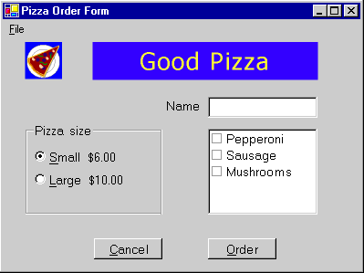

# Procedura dettagliata: creazione di un&#39;applicazione Windows ad Accesso facilitato
La creazione di un'applicazione accessibile ha risvolti importanti per l'azienda.  Molti governi hanno norme relative all'accessibilità per l'acquisto del software.  Il logo Certified for Windows include requisiti di accessibilità.  È stato stimato che solo negli Stati Uniti risiedono 30 milioni di persone,  molte delle quali potenziali clienti, interessate all'accessibilità del software.  
  
 Questa procedura dettagliata illustra i cinque requisiti di accessibilità per il logo Certified for Windows.  In base a questi requisiti, un'applicazione accessibile deve:  
  
-   Supportare le impostazioni di dimensioni, tipi di caratteri, colori e input del Pannello di controllo.  La barra dei menu, la barra del titolo, i bordi e la barra di stato verranno ridimensionati automaticamente quando l'utente modifica le impostazioni del Pannello di controllo.  In questa applicazione non sono necessarie altre modifiche ai controlli o al codice.  
  
-   Supportare la modalità contrasto elevato.  
  
-   Fornire l'accesso da tastiera documentato a tutte le funzionalità.  
  
-   Esporre la posizione dello stato attivo della tastiera a livello visivo o di programmazione.  
  
-   Evitare di comunicare informazioni importanti solo tramite segnali acustici.  
  
 Per altre informazioni, vedere [Risorse per la progettazione di applicazioni accessibili](../Topic/Resources%20for%20Designing%20Accessible%20Applications.md).  
  
 Per informazioni sul supporto di diversi layout di tastiera, vedere [Suggerimenti per lo sviluppo di applicazioni internazionali](../../../../docs/standard/globalization-localization/best-practices-for-developing-world-ready-apps.md).  
  
## Creazione del progetto  
 Questa procedura dettagliata crea l'interfaccia utente per un'applicazione che accetta ordini di pizza.  È costituita da un oggetto <xref:System.Windows.Forms.TextBox> per il nome del cliente, un gruppo di <xref:System.Windows.Forms.RadioButton> per selezionare la dimensione della pizza, un oggetto <xref:System.Windows.Forms.CheckedListBox> per selezionare i condimenti, due pulsanti con etichetta Order e Cancel e un menu con un comando Exit.  
  
 L'utente immette il nome del cliente, la dimensione della pizza e gli ingredienti desiderati.  Quando l'utente fa clic sul pulsante Order, in una finestra di messaggio vengono visualizzati un riepilogo dell'ordine e il costo. I controlli vengono cancellati e sono pronti per l'ordine successivo.  Quando l'utente fa clic sul pulsante Cancel, i controlli vengono cancellati e sono pronti per l'ordine successivo.  Quando l'utente fa clic sulla voce di menu Exit, il programma si chiude.  
  
 In questa procedura dettagliata l'elemento importante non è il codice per un sistema di ordini di vendita al dettaglio, ma l'accessibilità dell'interfaccia utente.  La procedura dettagliata illustra le funzionalità di accessibilità di diversi controlli usati di frequente, tra cui pulsanti, pulsanti di opzione, caselle di testo ed etichette.  
  
#### Per iniziare a creare l'applicazione  
  
-   Creare una nuova applicazione Windows in [!INCLUDE[vbprvb](../../../../includes/vbprvb-md.md)] o [!INCLUDE[csprcs](../../../../includes/csprcs-md.md)].  Assegnare il nome PizzaOrder al progetto.  Per i dettagli, vedere [Creazione di nuove soluzioni e progetti](../Topic/Creating%20Solutions%20and%20Projects.md).  
  
## Aggiunta dei controlli al form  
 Quando si aggiungono i controlli a un form, tenere presenti le linee guida seguenti per creare un'applicazione accessibile:  
  
-   Impostare le proprietà <xref:System.Windows.Forms.Control.AccessibleDescription%2A> e <xref:System.Windows.Forms.Control.AccessibleName%2A>.  In questo esempio, l'impostazione predefinita per <xref:System.Windows.Forms.Control.AccessibleRole%2A> è sufficiente.  Per altre informazioni sulle proprietà di accessibilità, vedere [Aggiunta di informazioni per l'Accesso facilitato ai controlli in un Windows Form](../../../../docs/framework/winforms/controls/providing-accessibility-information-for-controls-on-a-windows-form.md).  
  
-   Impostare le dimensioni del carattere su 10 o più punti.  
  
    > [!NOTE]
    >  Se all'inizio si impostano le dimensioni del carattere del form su 10, tutti i controlli aggiunti successivamente al form avranno dimensioni del carattere pari a 10.  
  
-   Assicurarsi che tutti i controlli etichetta che descrivono un controllo TextBox precedano immediatamente il controllo TextBox nell'ordine di tabulazione.  
  
-   Aggiungere un tasto di scelta, usando il carattere "&", alla proprietà <xref:System.Windows.Forms.Control.Text%2A> di ogni controllo accessibile all'utente.  
  
-   Aggiungere un tasto di scelta, usando il carattere "&", alla proprietà <xref:System.Windows.Forms.Control.Text%2A> dell'etichetta che precede un controllo accessibile all'utente.  Impostare la proprietà <xref:System.Windows.Forms.Label.UseMnemonic%2A> delle etichette su `true`, in modo che lo stato attivo venga impostato sul controllo successivo nell'ordine di tabulazione quando l'utente preme il tasto di scelta.  
  
-   Aggiungere tasti di scelta a tutte le voci di menu.  
  
#### Per rendere accessibile l'applicazione Windows  
  
-   Aggiungere i controlli al form e impostare le proprietà come descritto di seguito.  Vedere l'immagine alla fine della tabella per un modello di come disporre i controlli nel form.  
  
    |Oggetto|Proprietà|Valore|  
    |-------------|---------------|------------|  
    |Form1|AccessibleDescription|Order form|  
    ||AccessibleName|Order form|  
    ||Dimensione carattere|10|  
    ||Testo|Pizza Order Form|  
    |PictureBox|Nome|logo|  
    ||AccessibleDescription|A slice of pizza|  
    ||AccessibleName|Company logo|  
    ||Immagine|Un'icona o una bitmap|  
    |Etichetta|Nome|companyLabel|  
    ||Testo|Good Pizza|  
    ||TabIndex|1|  
    ||AccessibleDescription|Company name|  
    ||AccessibleName|Company name|  
    ||Backcolor|Blu|  
    ||Forecolor|Giallo|  
    ||Dimensione carattere|18|  
    |Etichetta|Nome|customerLabel|  
    ||Testo|&Name|  
    ||TabIndex|2|  
    ||AccessibleDescription|Customer name label|  
    ||AccessibleName|Customer name label|  
    ||UseMnemonic|True|  
    |TextBox|Nome|customerName|  
    ||Testo|\(nessuno\)|  
    ||TabIndex|3|  
    ||AccessibleDescription|Customer name|  
    ||AccessibleName|Customer name|  
    |GroupBox|Nome|sizeOptions|  
    ||AccessibleDescription|Pizza size options|  
    ||AccessibleName|Pizza size options|  
    ||Testo|Pizza size|  
    ||TabIndex|4|  
    |RadioButton|Nome|smallPizza|  
    ||Testo|&Small $6.00|  
    ||Selezionato|True|  
    ||TabIndex|0|  
    ||AccessibleDescription|Small pizza|  
    ||AccessibleName|Small pizza|  
    |RadioButton|Nome|largePizza|  
    ||Testo|&Large $10.00|  
    ||TabIndex|1|  
    ||AccessibleDescription|Large pizza|  
    ||AccessibleName|Large pizza|  
    |Etichetta|Nome|toppingsLabel|  
    ||Testo|&Toppings \($0.75 each\)|  
    ||TabIndex|5|  
    ||AccessibleDescription|Toppings label|  
    ||AccessibleName|Toppings label|  
    ||UseMnemonic|True|  
    |CheckedListBox|Nome|toppings|  
    ||TabIndex|6|  
    ||AccessibleDescription|Available toppings|  
    ||AccessibleName|Available toppings|  
    ||Elementi|Pepperoni, Sausage, Mushrooms|  
    |Pulsante|Nome|order|  
    ||Testo|&Ordina|  
    ||TabIndex|7|  
    ||AccessibleDescription|Total the order|  
    ||AccessibleName|Total order|  
    |Pulsante|Nome|cancel|  
    ||Testo|An&nulla|  
    ||TabIndex|8|  
    ||AccessibleDescription|Cancel the order|  
    ||AccessibleName|Cancel order|  
    |MainMenu|Nome|theMainMenu|  
    |MenuItem|Nome|fileCommands|  
    ||Testo|&File|  
    |MenuItem|Nome|exitApp|  
    ||Testo|&Esci|  
  
       
Il form sarà simile al seguente:  
  
## Supporto della modalità contrasto elevato  
 La modalità contrasto elevato è un'impostazione di sistema di Windows che migliora la leggibilità usando colori a contrasto e dimensioni del carattere che agevolano gli utenti con problemi di vista.  La proprietà [SystemInformation.HighContrast Property](frlrfSystemWindowsFormsSystemInformationClassHighContrastTopic) permette di determinare se la modalità contrasto elevato è impostata.  
  
 Se SystemInformation.HighContrast è `true`, l'applicazione dovrebbe:  
  
-   Visualizzare tutti gli elementi dell'interfaccia utente con la combinazione colori di sistema.  
  
-   Comunicare tramite segnali visivi o acustici tutte le informazioni comunicate mediante il colore.  Ad esempio, se determinati elementi elenco vengono evidenziati usando un tipo di carattere rosso, è possibile aggiungere al tipo di carattere anche il grassetto, in modo che l'utente veda un segnale non basato sul colore, indicante che gli elementi sono evidenziati.  
  
-   Evitare di inserire immagini o motivi dietro il testo.  
  
 All'avvio l'applicazione dovrebbe controllare l'impostazione di <xref:System.Windows.Forms.SystemInformation.HighContrast%2A> e rispondere all'evento di sistema <xref:Microsoft.Win32.SystemEvents.UserPreferenceChanged>.  L'evento <xref:Microsoft.Win32.SystemEvents.UserPreferenceChanged> viene generato ogni volta che il valore di <xref:System.Windows.Forms.SystemInformation.HighContrast%2A> cambia.  
  
 Nell'applicazione, l'unico elemento che non usa le impostazioni di sistema per il colore è `lblCompanyName`.  La classe [SystemColors Class](frlrfSystemDrawingSystemColorsClassTopic) viene usata per sostituire le impostazioni colore dell'etichetta con i colori di sistema selezionati dall'utente.  
  
#### Per abilitare la modalità contrasto elevato in modo efficace  
  
1.  Creare un metodo per impostare i colori dell'etichetta sui colori di sistema.  
  
    ```  
    ' Visual Basic  
    Private Sub SetColorScheme()  
       If SystemInformation.HighContrast Then  
          companyLabel.BackColor = SystemColors.Window  
          companyLabel.ForeColor = SystemColors.WindowText  
       Else  
          companyLabel.BackColor = Color.Blue  
          companyLabel.ForeColor = Color.Yellow  
       End If  
    End Sub  
  
    // C#  
    private void SetColorScheme()  
    {  
       if (SystemInformation.HighContrast)  
       {  
          companyLabel.BackColor = SystemColors.Window;  
          companyLabel.ForeColor = SystemColors.WindowText;  
       }  
       else  
       {  
          companyLabel.BackColor = Color.Blue;  
          companyLabel.ForeColor = Color.Yellow;  
       }  
    }  
    ```  
  
2.  Chiamare la routine `SetColorScheme` nel costruttore del form \(`Public Sub New()` in Visual Basic e `public class Form1` in Visual C\#\).  Per accedere al costruttore in Visual Basic, sarà necessario espandere l'area con l'etichetta **Codice generato da Progettazione Windows Form**.  
  
    ```  
    ' Visual Basic   
    Public Sub New()  
       MyBase.New()  
       InitializeComponent()  
       SetColorScheme()  
    End Sub  
  
    // C#  
    public Form1()  
    {  
       InitializeComponent();  
       SetColorScheme();  
    }  
    ```  
  
3.  Creare una routine evento, con la firma appropriata, per rispondere all'evento <xref:Microsoft.Win32.SystemEvents.UserPreferenceChanged>.  
  
    ```  
    ' Visual Basic  
    Protected Sub UserPreferenceChanged(ByVal sender As Object, _  
    ByVal e As Microsoft.Win32.UserPreferenceChangedEventArgs)  
       SetColorScheme()  
    End Sub  
  
    // C#  
    public void UserPreferenceChanged(object sender,   
    Microsoft.Win32.UserPreferenceChangedEventArgs e)  
    {  
       SetColorScheme();  
    }  
    ```  
  
4.  Aggiungere il codice al costruttore del form, dopo la chiamata a `InitializeComponents`, per associare la routine evento all'evento di sistema.  Questo metodo chiama la routine `SetColorScheme` .  
  
    ```  
    ' Visual Basic  
    Public Sub New()  
       MyBase.New()  
       InitializeComponent()  
       SetColorScheme()  
       AddHandler Microsoft.Win32.SystemEvents.UserPreferenceChanged, _  
          AddressOf Me.UserPreferenceChanged  
    End Sub  
  
    // C#  
    public Form1()  
    {  
       InitializeComponent();  
       SetColorScheme();  
       Microsoft.Win32.SystemEvents.UserPreferenceChanged   
          += new Microsoft.Win32.UserPreferenceChangedEventHandler(  
          this.UserPreferenceChanged);  
    }  
    ```  
  
5.  Aggiungere il codice al metodo <xref:System.Windows.Forms.Control.Dispose%2A> del form, prima della chiamata al metodo <xref:System.Windows.Forms.Control.Dispose%2A> della classe base, per rilasciare l'evento quando l'applicazione si chiude.  Per accedere al metodo <xref:System.Windows.Forms.Control.Dispose%2A> in Visual Basic, sarà necessario espandere l'area con l'etichetta Codice generato da Progettazione Windows Form.  
  
    > [!NOTE]
    >  Il codice dell'evento di sistema esegue un thread separato dall'applicazione principale.  Se non si rilascia l'evento, il codice associato all'evento verrà eseguito anche dopo la chiusura del programma.  
  
    ```  
    ' Visual Basic  
    Protected Overloads Overrides Sub Dispose(ByVal disposing As Boolean)  
       If disposing Then  
          If Not (components Is Nothing) Then  
             components.Dispose()  
          End If  
       End If  
       RemoveHandler Microsoft.Win32.SystemEvents.UserPreferenceChanged, _  
          AddressOf Me.UserPreferenceChanged  
       MyBase.Dispose(disposing)  
    End Sub  
  
    // C#  
    protected override void Dispose( bool disposing )  
    {  
       if( disposing )  
       {  
          if (components != null)   
          {  
             components.Dispose();  
          }  
       }  
       Microsoft.Win32.SystemEvents.UserPreferenceChanged   
          -= new Microsoft.Win32.UserPreferenceChangedEventHandler(  
          this.UserPreferenceChanged);  
       base.Dispose( disposing );  
    }  
    ```  
  
6.  Premere F5 per eseguire l'applicazione.  
  
## Comunicazione di informazioni importanti con mezzi diversi dai segnali acustici.  
 In questa applicazione, nessuna informazione viene comunicata solo mediante segnali acustici.  Se si usano i segnagli acustici nell'applicazione, è necessario comunicare le informazioni anche con altri mezzi.  
  
#### Per fornire informazioni con mezzi diversi dai segnali acustici  
  
1.  Far lampeggiare la barra del titolo usando la funzione FlashWindow dell'API Windows.  Per un esempio di come chiamare le funzioni dell'API Windows, vedere [Procedura dettagliata: Chiamata delle API di Windows](../Topic/Walkthrough:%20Calling%20Windows%20APIs%20\(Visual%20Basic\).md).  
  
    > [!NOTE]
    >  L'utente potrebbe aver abilitato il servizio Segnali visivi di Windows, che farà lampeggiare la finestra anche quando i suoni di sistema vengono riprodotti tramite l'altoparlante predefinito del computer.  
  
2.  Visualizzare le informazioni importanti in una finestra non modale in modo che l'utente rispondere a esse.  
  
3.  Visualizzare una finestra di messaggio che acquisisce lo stato attivo della tastiera.  Evitare questo metodo se è possibile che l'utente stia digitando.  
  
4.  Visualizzare un indicatore di stato nell'area di notifica dello stato della barra delle applicazioni.  Per i dettagli, vedere [Aggiunta di icone alla barra delle applicazioni mediante il componente NotifyIcon di Windows Form](../../../../docs/framework/winforms/controls/app-icons-to-the-taskbar-with-wf-notifyicon.md).  
  
## Verifica dell'applicazione  
 Prima di distribuire l'applicazione, è consigliabile testare le funzionalità di accessibilità implementate.  
  
#### Per testare le funzionalità di accessibilità  
  
1.  Per testare l'accesso tramite tastiera, scollegare il mouse ed esplorare l'interfaccia utente per ogni funzionalità solo con la tastiera.  Assicurarsi che tutte le attività possano essere eseguite solo con la tastiera.  
  
2.  Per testare il supporto del contrasto elevato, scegliere l'icona Accesso facilitato nel Pannello di controllo.  Fare clic sulla scheda Schermo e selezionare la casella di controllo Usa Contrasto elevato.  Spostarsi tra tutti gli elementi dell'interfaccia utente per verificare che siano state applicate le modifiche al colore e al tipo di carattere.  Assicurarsi anche non siano state inserite immagini o motivi dietro il testo.  
  
    > [!NOTE]
    >  Windows NT 4 non dispone dell'icona Accesso facilitato nel Pannello di controllo.  Quindi questa procedura per cambiare l'impostazione SystemInformation.HighContrast non funziona in Windows NT 4.  
  
3.  Per testare l'accessibilità di un'applicazione, sono facilmente disponibili altri strumenti.  
  
4.  Per testare l'esposizione dello stato attivo della tastiera, eseguire Lente di ingrandimento.  Per aprirla, fare clic sul menu **Start**, scegliere **Programmi**, **Accessori**, **Accessibilità**, quindi fare clic su **Lente di ingrandimento**.  Spostarsi nell'interfaccia utente usando sia il mouse che il tasto TAB.  Assicurarsi che tutti gli spostamenti vengano registrati correttamente in **Lente di ingrandimento**.  
  
5.  Per testare l'esposizione degli elementi dello schermo, eseguire Controlla e usare sia il mouse che il tasto TAB per raggiungere ogni elemento.  Assicurarsi che le informazioni presentate nei campi Nome, Stato, Ruolo, Posizione e Valore della finestra Controlla abbiano senso per l'utente per ogni oggetto dell'interfaccia utente.