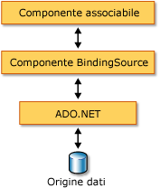

# Cenni preliminari sul componente BindingSource
Il componente <xref:System.Windows.Forms.BindingSource> è progettato per semplificare il processo di associazione di controlli a un'origine dati sottostante.  Il componente <xref:System.Windows.Forms.BindingSource> funge da canale e da origine dati per altri controlli a cui associarli.  Fornisce un'astrazione della connessione dati del form passando i comandi all'elenco dei dati sottostante.  Inoltre, è possibile aggiungervi dati direttamente, in modo che il componente stesso funga da origine dati.  
  
## Componente BindingSource come intermediario  
 Il componente <xref:System.Windows.Forms.BindingSource> funge da origine dati per alcuni o tutti i controlli nel form.  In Visual Studio, <xref:System.Windows.Forms.BindingSource> può essere associato a un controllo per mezzo della proprietà `DataBindings`, che è accessibile dalla finestra **Proprietà**.  Vedere anche [Procedura: associare controlli Windows Form al componente BindingSource utilizzando la finestra di progettazione](../../../../docs/framework/winforms/controls/bind-wf-controls-with-the-bindingsource.md).  
  
 È possibile associare il componente <xref:System.Windows.Forms.BindingSource> a entrambe le semplici origini dati, ad esempio una singola proprietà di un oggetto o una raccolta di base come <xref:System.Collections.ArrayList>, e origini dati complesse, ad esempio una tabella di database.  Il componente <xref:System.Windows.Forms.BindingSource> funge da intermediario che fornisce servizi di associazione e gestione valuta.  In fase di progettazione o di esecuzione, è possibile associare un componente <xref:System.Windows.Forms.BindingSource> a un'origine dati complessi impostando le relative proprietà <xref:System.Windows.Forms.BindingSource.DataSource%2A> e <xref:System.Windows.Forms.BindingSource.DataMember%2A> sul database e sulla tabella, rispettivamente.  La figura seguente illustra il punto in cui il componente <xref:System.Windows.Forms.BindingSource> si inserisce nell'architettura di associazione di dati esistente.  
  
   
  
> [!NOTE]
>  In fase di progettazione, alcune azioni, ad esempio il trascinamento di una tabella di database da una finestra dei dati in un form vuoto, comporta la creazione del componente <xref:System.Windows.Forms.BindingSource>, la sua associazione all'origine dati sottostante e l'aggiunta dei controlli con supporto dati in un'unica operazione.  Vedere anche [Associazione di controlli Windows Form ai dati in Visual Studio](../Topic/Bind%20Windows%20Forms%20controls%20to%20data%20in%20Visual%20Studio.md).  
  
## Componente BindingSource come origine dati  
 Se si avvia l'aggiunta di elementi al componente <xref:System.Windows.Forms.BindingSource> senza prima specificare un elenco a cui associarlo, il componente funge da origine dati list\-style e accetta tali elementi aggiunti.  
  
 Inoltre, è possibile scrivere codice per fornire funzionalità "AddNew" personalizzate per mezzo dell'evento <xref:System.Windows.Forms.BindingSource.AddingNew>, che viene generato quando il metodo <xref:System.Windows.Forms.BindingSource.AddNew%2A> viene chiamato prima dell'elemento da aggiungere all'elenco.  Per altre informazioni, vedere [Architettura del componente BindingSource](../../../../docs/framework/winforms/controls/bindingsource-component-architecture.md).  
  
## Navigazione  
 Per gli utenti che devono passare i dati in un form, il componente <xref:System.Windows.Forms.BindingNavigator> consente di esplorare e modificare i dati in coordinamento con un componente <xref:System.Windows.Forms.BindingSource>.  Per altre informazioni, vedere [Controllo BindingNavigator](../../../../docs/framework/winforms/controls/bindingnavigator-control-windows-forms.md).  
  
## Modifica dei dati  
 L'oggetto <xref:System.Windows.Forms.BindingSource> agisce come <xref:System.Windows.Forms.CurrencyManager> per tutte le associazioni e può, pertanto, fornire l'accesso alle informazioni su valuta e posizione relativamente all'origine dati.  La tabella seguente illustra i membri che il componente <xref:System.Windows.Forms.BindingSource> fornisce per l'accesso e la modifica dei dati sottostanti.  
  
|Membro|Descrizione|  
|------------|-----------------|  
|Proprietà <xref:System.Windows.Forms.BindingSource.Current%2A>|Ottiene l'elemento corrente dell'origine dati.|  
|Proprietà <xref:System.Windows.Forms.BindingSource.Position%2A>|Ottiene o imposta la posizione corrente nell'elenco sottostante.|  
|Proprietà <xref:System.Windows.Forms.BindingSource.List%2A>|Ottiene l'elenco che è la valutazione di <xref:System.Windows.Forms.BindingSource.DataSource%2A> e <xref:System.Windows.Forms.BindingSource.DataMember%2A>.  Se <xref:System.Windows.Forms.BindingSource.DataMember%2A> non è impostato, restituisce l'elenco specificato da <xref:System.Windows.Forms.BindingSource.DataSource%2A>.|  
|Metodo <xref:System.Windows.Forms.BindingSource.Insert%2A>|Inserisce un elemento nell'elenco in corrispondenza dell'indice specificato.|  
|Metodo <xref:System.Windows.Forms.BindingSource.RemoveCurrent%2A>|Rimuove l'elemento corrente dall'elenco.|  
|Metodo <xref:System.Windows.Forms.BindingSource.EndEdit%2A>|Applica le modifiche in sospeso all'origine dati sottostante.|  
|Metodo <xref:System.Windows.Forms.BindingSource.CancelEdit%2A>|Annulla l'operazione di modifica corrente.|  
|Metodo <xref:System.Windows.Forms.BindingSource.AddNew%2A>|Aggiunge un nuovo elemento all'elenco sottostante.  Se l'origine dati implementa <xref:System.ComponentModel.IBindingList> e restituisce un elemento dall'evento <xref:System.Windows.Forms.BindingSource.AddingNew>, aggiunge tale elemento.  In caso contrario, la richiesta viene passata a metodo <xref:System.ComponentModel.IBindingList.AddNew%2A> dell'elenco.  Se l'elenco sottostante non è un <xref:System.ComponentModel.IBindingList>, l'elemento viene creato automaticamente tramite il costruttore pubblico predefinito.|  
  
## Ordinamento e filtro  
 In genere, l'utente lavora con una visualizzazione ordinata o filtrata dell'origine dati.  La tabella seguente illustra i membri forniti dall'origine dati del componente <xref:System.Windows.Forms.BindingSource>.  
  
|Membro|Descrizione|  
|------------|-----------------|  
|Proprietà <xref:System.Windows.Forms.BindingSource.Sort%2A>|Se l'origine dati è un <xref:System.ComponentModel.IBindingList>, ottiene o imposta un nome di colonna usato per l'ordinamento e il criterio di ordinamento.  Se l'origine dati è un <xref:System.ComponentModel.IBindingListView> e supporta l'ordinamento avanzato, ottiene più nomi di colonna usati per l'ordinamento e il criterio di ordinamento|  
|Proprietà <xref:System.Windows.Forms.BindingSource.Filter%2A>|Se l'origine dati è un <xref:System.ComponentModel.IBindingListView>, ottiene o imposta l'espressione usata per filtrare le righe da visualizzare.|  
  
## Vedere anche  
 <xref:System.Windows.Forms.BindingSource>   
 <xref:System.Windows.Forms.BindingNavigator>   
 [Architettura del componente BindingSource](../../../../docs/framework/winforms/controls/bindingsource-component-architecture.md)   
 [Il componente BindingSource](../../../../docs/framework/winforms/controls/bindingsource-component.md)   
 [Controllo BindingNavigator](../../../../docs/framework/winforms/controls/bindingnavigator-control-windows-forms.md)   
 [Associazione ai dati di Windows Form](../../../../docs/framework/winforms/windows-forms-data-binding.md)   
 [Controlli da utilizzare in Windows Form](../../../../docs/framework/winforms/controls/controls-to-use-on-windows-forms.md)