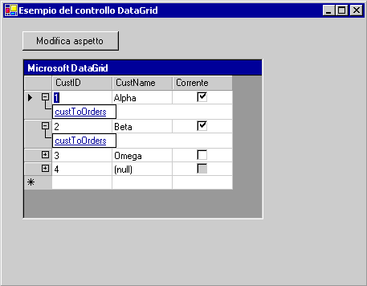

# Cenni preliminari sul controllo DataGrid (Windows Form)
> [!NOTE]
>  Il <xref:System.Windows.Forms.DataGridView> controllo sostituisce e aggiunge funzionalità per il <xref:System.Windows.Forms.DataGrid> controllo, tuttavia, il <xref:System.Windows.Forms.DataGrid> controllo viene mantenuto per compatibilità con le versioni precedenti e per uso futuro, se si sceglie. Per ulteriori informazioni, vedere [differenze tra il Windows Form controlli DataGridView e DataGrid](../../../../docs/framework/winforms/controls/differences-between-the-windows-forms-datagridview-and-datagrid-controls.md).  
  
 Windows Form <xref:System.Windows.Forms.DataGrid> controllo Visualizza i dati in una serie di righe e colonne. Il caso più semplice è quando la griglia è associata a un'origine dati con una singola tabella che non contiene relazioni. In questo caso, i dati vengono visualizzati in semplici righe e colonne, come in un foglio di calcolo. Per ulteriori informazioni sull'associazione dei dati ad altri controlli, vedere [Data Binding e Windows Form](../../../../docs/framework/winforms/data-binding-and-windows-forms.md).  
  
 Se il <xref:System.Windows.Forms.DataGrid> è associato a dati con più tabelle correlate e se è abilitata l'esplorazione della griglia, la griglia visualizzerà degli espansori in ogni riga. Con un espansore, l'utente può spostarsi da una tabella padre a una tabella figlio. Facendo clic su un nodo, viene visualizzata la tabella figlio e, facendo clic su un pulsante Indietro, viene visualizzata la tabella padre originale. In questo modo, nella griglia vengono visualizzate le relazioni gerarchiche tra le tabelle.  
  
 La schermata seguente mostra un DataGrid associato a dati con più tabelle.  
  
   
DataGrid associato a dati con più tabelle  
  
 Il <xref:System.Windows.Forms.DataGrid> può fornire un'interfaccia utente per un set di dati, la navigazione tra tabelle correlate e funzionalità avanzate di formattazione e modifica.  
  
 La visualizzazione e la manipolazione dei dati sono funzioni distinte: il controllo gestisce l'interfaccia utente, mentre gli aggiornamenti dei dati vengono gestiti dall'architettura di data binding di Windows Form e dai provider di dati di [!INCLUDE[dnprdnshort](../../../../includes/dnprdnshort-md.md)]. Quindi più controlli associati alla stessa origine dati resteranno sincronizzati.  
  
> [!NOTE]
>  Se si ha familiarità con il controllo DataGrid in Visual Basic 6.0, sono disponibili alcune differenze significative nel Windows Form <xref:System.Windows.Forms.DataGrid> controllo.  
  
 Quando la griglia è associata a un <xref:System.Data.DataSet>, le colonne e righe vengono automaticamente create, formattate e compilate. Per altre informazioni, vedere [Data Binding and Windows Forms](../../../../docs/framework/winforms/data-binding-and-windows-forms.md). Dopo la generazione del <xref:System.Windows.Forms.DataGrid> controllo, è possibile aggiungere, eliminare, riorganizzare e formattare le colonne e le righe in base alle proprie esigenze.  
  
## Data binding al controllo  
 Per il <xref:System.Windows.Forms.DataGrid> di controllo per l'uso, deve essere associato a un'origine dati tramite il <xref:System.Windows.Forms.DataGrid.DataSource%2A> e <xref:System.Windows.Forms.DataGrid.DataMember%2A> proprietà in fase di progettazione o <xref:System.Windows.Forms.DataGrid.SetDataBinding%2A> metodo in fase di esecuzione. Questo binding associa il <xref:System.Windows.Forms.DataGrid> a un oggetto di un'istanza di origine dati, ad esempio un <xref:System.Data.DataSet> o <xref:System.Data.DataTable>). Il <xref:System.Windows.Forms.DataGrid> controllo Mostra i risultati delle azioni eseguite sui dati. La maggior parte delle operazioni relative ai dati non vengono eseguite tramite il <xref:System.Windows.Forms.DataGrid> , ma tramite l'origine dati.  
  
 Se i dati in set di dati associato vengono aggiornati con qualsiasi meccanismo, il <xref:System.Windows.Forms.DataGrid> controllo riflette le modifiche. Se la griglia dei dati e stili di tabella e gli stili di colonna dispongono di `ReadOnly` impostata su `false`, i dati nel set di dati possono essere aggiornati tramite il <xref:System.Windows.Forms.DataGrid> controllo.  
  
 Può essere visualizzata solo una tabella di <xref:System.Windows.Forms.DataGrid> alla volta. Se viene definita una relazione padre-figlio tra tabelle, l'utente può spostarsi tra le tabelle correlate per selezionare la tabella da visualizzare nella <xref:System.Windows.Forms.DataGrid> controllo. Per informazioni sull'associazione di un <xref:System.Windows.Forms.DataGrid> il controllo a un [!INCLUDE[vstecado](../../../../includes/vstecado-md.md)] un'origine dati in fase di progettazione o fase di esecuzione, vedere [procedura: associare il controllo DataGrid Windows Form a un'origine dati](../../../../docs/framework/winforms/controls/how-to-bind-the-windows-forms-datagrid-control-to-a-data-source.md).  
  
 Origini dati valide per il <xref:System.Windows.Forms.DataGrid> includono:  
  
-   <xref:System.Data.DataTable> (classe)  
  
-   <xref:System.Data.DataView> (classe)  
  
-   <xref:System.Data.DataSet> (classe)  
  
-   <xref:System.Data.DataViewManager> (classe)  
  
 Se l'origine è un set di dati, il set di dati potrebbe essere un oggetto nel form o un oggetto passato al form da un servizio Web XML. È possibile eseguire il binding sia a set di dati tipizzati che non tipizzati.  
  
 È anche possibile associare un <xref:System.Windows.Forms.DataGrid> controllo ad altre strutture se gli oggetti nella struttura, ad esempio gli elementi in una matrice, espongono proprietà pubbliche. La griglia visualizzerà tutte le proprietà pubbliche degli elementi nella struttura. Ad esempio, se associa il <xref:System.Windows.Forms.DataGrid> oggetti di controllo in una matrice del cliente, la griglia visualizzerà tutte le proprietà pubbliche di questi oggetti customer. In alcuni casi, ciò significa che, anche se è possibile eseguire il binding alla struttura, la struttura associata risultante potrebbe non avere utilità pratica. Ad esempio, è possibile eseguire il binding a una matrice di Integer, ma, poiché il tipo di dati `Integer` non supporta una proprietà pubblica, la griglia non può visualizzare i dati.  
  
 È possibile eseguire il binding alle seguenti strutture se gli elementi espongono proprietà pubbliche:  
  
-   Qualsiasi componente che implementa il <xref:System.Collections.IList> interfaccia. incluse le matrici unidimensionali.  
  
-   Qualsiasi componente che implementa il <xref:System.ComponentModel.IListSource> interfaccia.  
  
-   Qualsiasi componente che implementa il <xref:System.ComponentModel.IBindingList> interfaccia.  
  
 Per ulteriori informazioni sulle possibili origini dati, vedere [origini dati supportate da Windows Form](../../../../docs/framework/winforms/data-sources-supported-by-windows-forms.md).  
  
## Visualizzazione della griglia  
 Un utilizzo comune del <xref:System.Windows.Forms.DataGrid> controllo consiste nel visualizzare una singola tabella di dati da un set di dati. Tuttavia, il controllo può anche essere usato per visualizzare più tabelle, incluse le tabelle correlate. La visualizzazione della griglia viene regolata automaticamente in base all'origine dati. La tabella seguente illustra che cosa viene visualizzato a seconda della configurazione.  
  
|Contenuto del set di dati|Elementi visualizzati|  
|--------------------------|-----------------------|  
|Una sola tabella.|La tabella viene visualizzata in una griglia.|  
|Più tabelle.|La griglia può mostrare una visualizzazione albero in cui gli utenti possono spostarsi per trovare la tabella che vogliono visualizzare.|  
|Più tabelle correlate.|La griglia può mostrare una visualizzazione albero con cui selezionare le tabelle oppure è possibile specificare che la griglia mostri la tabella padre. I record nella tabella padre consentono agli utenti di passare alle righe figlio correlate.|  
  
> [!NOTE]
>  Tabelle in un set di dati vengono correlate mediante un <xref:System.Data.DataRelation>.  Vedere anche [HYPERLINK "http://msdn.microsoft.com/library/dbwcse3d (110)" relazioni nei DataSet](http://msdn.microsoft.com/library/dbwcse3d\(v=vs.110\)) o [relazioni nei DataSet](http://msdn.microsoft.com/library/dbwcse3d\(v=vs.120\)).  
  
 Quando il <xref:System.Windows.Forms.DataGrid> controllo viene visualizzata una tabella e <xref:System.Windows.Forms.DataGrid.AllowSorting%2A> è impostata su `true`, dati possono essere riordinati facendo clic sulle intestazioni di colonna. L'utente può inoltre aggiungere righe e modificare le celle.  
  
 Le relazioni tra un set di tabelle vengono visualizzate per gli utenti usando una struttura di navigazione padre/figlio. Le tabelle padre sono il livello più elevato di dati e le tabelle figlio sono le tabelle di dati derivate dai singoli elenchi delle tabelle padre. Gli espansori vengono visualizzati in ogni riga padre che contiene una tabella figlio. Facendo clic su un espansore, viene generato un elenco di collegamenti Web alle tabelle figlio. Quando l'utente seleziona un collegamento, viene visualizzata la tabella figlio. Fare clic sull'icona di visualizzazione righe padre () è possibile nascondere le informazioni relative alla tabella padre o ripristinarle se l'utente siano state precedentemente nascoste. L'utente può fare clic su un pulsante Indietro per tornare alla tabella visualizzata in precedenza.  
  
## Colonne e righe  
 Il <xref:System.Windows.Forms.DataGrid> è costituito da una raccolta di <xref:System.Windows.Forms.DataGridTableStyle> gli oggetti contenuti nel <xref:System.Windows.Forms.DataGrid> del controllo <xref:System.Windows.Forms.DataGrid.TableStyles%2A> proprietà. Uno stile tabella può contenere un insieme di <xref:System.Windows.Forms.DataGridColumnStyle> gli oggetti contenuti nel <xref:System.Windows.Forms.DataGridTableStyle.GridColumnStyles%2A> proprietà di <xref:System.Windows.Forms.DataGridTableStyle>... È possibile modificare il <xref:System.Windows.Forms.DataGrid.TableStyles%2A> e <xref:System.Windows.Forms.DataGridTableStyle.GridColumnStyles%2A> proprietà usando gli editor della raccolta tramiti il **proprietà** finestra.  
  
 Qualsiasi <xref:System.Windows.Forms.DataGridTableStyle> associato il <xref:System.Windows.Forms.DataGrid> controllo è possibile accedere tramite il <xref:System.Windows.Forms.GridTableStylesCollection>. Il <xref:System.Windows.Forms.GridTableStylesCollection> possono essere modificate nella finestra di progettazione con il <xref:System.Windows.Forms.DataGridTableStyle> editor della raccolta o a livello di codice tramite il <xref:System.Windows.Forms.DataGrid> del controllo <xref:System.Windows.Forms.DataGrid.TableStyles%2A> proprietà.  
  
   
La figura seguente mostra gli oggetti inclusi nel controllo DataGrid.  
  
 Gli stili di tabella e colonna vengono sincronizzati con <xref:System.Data.DataTable> oggetti e <xref:System.Data.DataColumn> oggetti impostando i `MappingName` proprietà appropriata <xref:System.Data.DataTable.TableName%2A> e <xref:System.Data.DataColumn.ColumnName%2A> proprietà. Quando un <xref:System.Windows.Forms.DataGridTableStyle> che non contiene alcuna colonna stili viene aggiunto a un <xref:System.Windows.Forms.DataGrid> controllo associato a un'origine dati valida e <xref:System.Windows.Forms.DataGridTableStyle.MappingName%2A> proprietà dello stile tabella è impostata su un valore valido <xref:System.Data.DataTable.TableName%2A> , una raccolta di <xref:System.Windows.Forms.DataGridColumnStyle> creati per lo stile di tabella. Per ogni <xref:System.Data.DataColumn> nel <xref:System.Data.DataTable.Columns%2A> raccolta del <xref:System.Data.DataTable>, un corrispondente <xref:System.Windows.Forms.DataGridColumnStyle> viene aggiunto al <xref:System.Windows.Forms.GridColumnStylesCollection>. <xref:System.Windows.Forms.GridColumnStylesCollection> avviene tramite il <xref:System.Windows.Forms.DataGridTableStyle.GridColumnStyles%2A> di proprietà di <xref:System.Windows.Forms.DataGridTableStyle>. Le colonne possono essere aggiunti o eliminate dalla griglia applicando il <xref:System.Windows.Forms.GridColumnStylesCollection.Add%2A> o <xref:System.Windows.Forms.GridColumnStylesCollection.Remove%2A> metodo il <xref:System.Windows.Forms.GridColumnStylesCollection>. Per ulteriori informazioni, vedere [procedura: aggiungere tabelle e colonne al controllo DataGrid Windows Form](../../../../docs/framework/winforms/controls/how-to-add-tables-and-columns-to-the-windows-forms-datagrid-control.md) e [procedura: eliminare o nascondere colonne nel controllo DataGrid Windows Form](../../../../docs/framework/winforms/controls/how-to-delete-or-hide-columns-in-the-windows-forms-datagrid-control.md).  
  
 Una raccolta di tipi di colonna estende la <xref:System.Windows.Forms.DataGridColumnStyle> classe con funzionalità di modifica e formattazione RTF. Tutti i tipi di colonna ereditano dal <xref:System.Windows.Forms.DataGridColumnStyle> classe di base. La classe creata dipende il <xref:System.Data.DataColumn.DataType%2A> proprietà del <xref:System.Data.DataColumn> da cui il <xref:System.Web.UI.WebControls.DataGridColumn> è basato. Ad esempio, un <xref:System.Data.DataColumn> con relativo <xref:System.Data.DataColumn.DataType%2A> impostata su <xref:System.Boolean> verrà associato il <xref:System.Windows.Forms.DataGridBoolColumn>. La tabella seguente descrive ciascuno di questi tipi di colonna.  
  
|Tipo di colonna|Descrizione|  
|-----------------|-----------------|  
|<xref:System.Windows.Forms.DataGridTextBoxColumn>|Accetta e visualizza i dati come stringhe formattate o non formattate. Funzionalità di modifica sono uguali a quelli per la modifica dei dati in un semplice <xref:System.Windows.Forms.TextBox>. Eredita da <xref:System.Windows.Forms.DataGridColumnStyle>.|  
|<xref:System.Windows.Forms.DataGridBoolColumn>|Accetta e visualizza `true`, `false` e i valori null. Eredita da <xref:System.Windows.Forms.DataGridColumnStyle>.|  
  
 Facendo doppio clic sul bordo destro di una colonna, la colonna viene ridimensionata per poter visualizzare la didascalia completa e la voce più lunga.  
  
## Stili di tabella e stili colonna  
 Non appena il formato predefinito di aver stabilito la <xref:System.Windows.Forms.DataGrid> controllo, è possibile personalizzare i colori che verranno usati quando vengono visualizzate determinate tabelle all'interno della griglia di dati.  
  
 Questo avviene tramite la creazione di istanze di <xref:System.Windows.Forms.DataGridTableStyle> (classe). Gli stili tabella specificano la formattazione di determinate tabelle, è diversa da quella predefinita di <xref:System.Windows.Forms.DataGrid> controllo stesso. Per ogni tabella può essere definito un solo stile per volta.  
  
 In alcuni casi, è preferibile che l'aspetto di una colonna specifica sia diverso da quello delle altre colonne di una particolare tabella dati. È possibile creare un set personalizzato di stili di colonna utilizzando il <xref:System.Windows.Forms.DataGridTableStyle.GridColumnStyles%2A> proprietà.  
  
 Gli stili colonna sono correlati alle colonne in un set di dati proprio come gli stili tabella sono correlati alle tabelle di dati. Come per ogni tabella può essere definito un solo uno stile per volta, anche per ogni colonna può essere definito un solo stile, in un particolare stile tabella. Questa relazione è definita della colonna <xref:System.Windows.Forms.DataGridColumnStyle.MappingName%2A> proprietà.  
  
 Se è stato creato uno stile tabella senza aggiungervi stili di colonna, [!INCLUDE[vsprvs](../../../../includes/vsprvs-md.md)] aggiungerà gli stili colonna predefiniti quando il form e la griglia vengono creati in fase di esecuzione. Tuttavia, se è stato creato uno stile tabella a cui sono stati aggiunti degli stili colonna, [!INCLUDE[vsprvs](../../../../includes/vsprvs-md.md)] non creerà alcuno stile colonna. Inoltre, sarà necessario definire stili colonna a cui assegnare il nome di mapping per visualizzare nella griglia le colonne desiderate.  
  
 Poiché, per specificare le colonne incluse nella griglia dati, è necessario assegnare uno stile colonna e alle colonne non è stato assegnato alcuno stile colonna, è possibile includere nel set di dati le colonne di dati non visualizzate nella griglia. Tuttavia, poiché la colonna di dati è inclusa nel set di dati, è possibile modificare a livello di codice i dati non visualizzati.  
  
> [!NOTE]
>  In generale, creare gli stili colonna e aggiungerli alla raccolta di stili colonna prima di aggiungere gli stili tabella alla raccolta di stili tabella. Quando si aggiunge uno stile tabella vuoto alla raccolta, gli stili colonna vengono generati automaticamente. Di conseguenza, verrà generata un'eccezione se si tenta di aggiungere nuovi stili di colonna con duplicato <xref:System.Windows.Forms.DataGridColumnStyle.MappingName%2A> valori alla raccolta di stili di colonna.  
>   
>  In alcuni casi, è preferibile perfezionare una sola colonna tra tante. Ad esempio, il set di dati contiene 50 colonne e ne servono solo 49. In questo caso, è più semplice importare tutte le 50 colonne e rimuoverne una a livello di codice, invece di aggiungere una per una le 49 colonne desiderate a livello di codice.  
  
## Formattazione  
 Formattazione che può essere applicato per la <xref:System.Windows.Forms.DataGrid> controllo include gli stili di bordo, gli stili delle linee della griglia, i tipi di carattere, le proprietà delle didascalie, l'allineamento dei dati e alternanza dei colori di sfondo righe. Per ulteriori informazioni, vedere [procedura: formattare il controllo DataGrid Windows Form](../../../../docs/framework/winforms/controls/how-to-format-the-windows-forms-datagrid-control.md).  
  
## Eventi  
 Oltre ai normali eventi di controllo, ad esempio <xref:System.Windows.Forms.Control.MouseDown>, <xref:System.Windows.Forms.Control.Enter>, e <xref:System.Windows.Forms.DataGrid.Scroll>, <xref:System.Windows.Forms.DataGrid> controllo supporta gli eventi associati alla modifica e alla navigazione all'interno della griglia. Il <xref:System.Windows.Forms.DataGrid.CurrentCell%2A> proprietà determina quale cella viene selezionata. Il <xref:System.Windows.Forms.DataGrid.CurrentCellChanged> evento viene generato quando l'utente passa a una nuova cella. Quando l'utente passa a una nuova tabella mediante le relazioni padre/figlio, il <xref:System.Windows.Forms.DataGrid.Navigate> viene generato l'evento. Il <xref:System.Windows.Forms.DataGrid.BackButtonClick> evento viene generato quando l'utente fa clic sul pulsante indietro quando l'utente visualizza una tabella figlio e <xref:System.Windows.Forms.DataGrid.ShowParentDetailsButtonClick> evento viene generato quando si fa clic sull'icona di visualizzazione di righe padre.  
  
## Vedere anche  
 [Controllo DataGrid](../../../../docs/framework/winforms/controls/datagrid-control-windows-forms.md)   
 [Procedura: associare il controllo DataGrid Windows Form a un'origine dati](../../../../docs/framework/winforms/controls/how-to-bind-the-windows-forms-datagrid-control-to-a-data-source.md)   
 [Procedura: aggiungere tabelle e colonne al Windows Form controllo DataGrid](../../../../docs/framework/winforms/controls/how-to-add-tables-and-columns-to-the-windows-forms-datagrid-control.md)   
 [Procedura: eliminare o nascondere le colonne nel Windows Form controllo DataGrid](../../../../docs/framework/winforms/controls/how-to-delete-or-hide-columns-in-the-windows-forms-datagrid-control.md)   
 [Procedura: formattare il controllo DataGrid Windows Form](../../../../docs/framework/winforms/controls/how-to-format-the-windows-forms-datagrid-control.md)