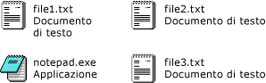

# Procedura: abilitare la visualizzazione affiancata in un controllo ListView Windows Form mediante la finestra di progettazione
La funzione di visualizzazione affiancata del controllo <xref:System.Windows.Forms.ListView> consente di ottenere un equilibrio visivo tra informazioni in formato grafico e informazioni in formato testo.  Le informazioni in formato testo visualizzate per un elemento nella visualizzazione affiancata corrispondono alle informazioni di colonna definite per la visualizzazione dei dettagli.  La visualizzazione affiancata agisce in combinazione con le funzioni di raggruppamento o di segno di inserimento nel controllo <xref:System.Windows.Forms.ListView>.  
  
 La visualizzazione affiancata utilizza un'icona 32 x 32 e alcune righe di testo, come illustrato nella seguente immagine.  
  
   
  
 Le proprietà e i metodi della visualizzazione affiancata consentono di specificare i campi di colonna da visualizzare per ciascun elemento, nonché di controllare collettivamente le dimensioni e l'aspetto di tutti gli elementi all'interno di una finestra di visualizzazione affiancata.  Per motivi di chiarezza, la prima riga di testo di una finestra affiancata corrisponde sempre al nome dell'elemento e non può essere modificata.  
  
 Nella seguente procedura è richiesto un progetto **Applicazione Windows** con un form contenente un controllo <xref:System.Windows.Forms.ListView>.  Per informazioni sull'impostazione di tali progetti, vedere [How to: Create a Windows Application Project](http://msdn.microsoft.com/it-it/b2f93fed-c635-4705-8d0e-cf079a264efa) e [Procedura: aggiungere controlli a un Windows Form](../../../../docs/framework/winforms/controls/how-to-add-controls-to-windows-forms.md).  
  
> [!NOTE]
>  La visualizzazione affiancata è disponibile solo in [!INCLUDE[WinXpFamily](../../../../includes/winxpfamily-md.md)] quando il metodo <xref:System.Windows.Forms.Application.EnableVisualStyles%2A?displayProperty=fullName> viene chiamato dall'applicazione.  Nei sistemi operativi precedenti, qualsiasi codice correlato alla visualizzazione affiancata non ha alcun effetto e il controllo <xref:System.Windows.Forms.ListView> viene rappresentato nella visualizzazione a icone grandi.  Per ulteriori informazioni, vedere <xref:System.Windows.Forms.ListView.View%2A?displayProperty=fullName>.  
>   
>  È possibile che le finestre di dialogo e i comandi di menu visualizzati siano diversi da quelli descritti nella Guida a seconda delle impostazioni attive o dell'edizione del programma.  Per modificare le impostazioni, scegliere **Importa\/esporta impostazioni** dal menu **Strumenti**.  Per ulteriori informazioni, vedere [Customizing Development Settings in Visual Studio](http://msdn.microsoft.com/it-it/22c4debb-4e31-47a8-8f19-16f328d7dcd3).  
  
### Per impostare la visualizzazione affiancata nella finestra di progettazione  
  
1.  Selezionare il controllo <xref:System.Windows.Forms.ListView> nel form.  
  
2.  Nella finestra **Proprietà** selezionare la proprietà <xref:System.Windows.Forms.ListView.View%2A> e scegliere **Affianca**.  
  
## Vedere anche  
 <xref:System.Windows.Forms.ListView.TileSize%2A>   
 [Windows XP Features and Windows Forms Controls](http://msdn.microsoft.com/it-it/bc7fab94-fce9-4bf1-a8ad-a5837c91c3c0)   
 [Cenni preliminari sul controllo ListView](../../../../docs/framework/winforms/controls/listview-control-overview-windows-forms.md)