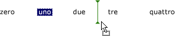

# Procedura: visualizzare un segno di inserimento in un controllo ListView per Windows Form
Il segno di inserimento nel controllo <xref:System.Windows.Forms.ListView> indica agli utenti il punto in cui verranno inseriti gli elementi trascinati.  Quando un utente trascina un elemento in un punto intermedio tra due elementi, il segno di inserimento indica la nuova posizione prevista dell'elemento.  
  
> [!NOTE]
>  La funzionalità del segno di inserimento è disponibile solo in [!INCLUDE[WinXpFamily](../../../../includes/winxpfamily-md.md)] quando l'applicazione chiama il metodo <xref:System.Windows.Forms.Application.EnableVisualStyles%2A?displayProperty=fullName>.  Nei sistemi operativi precedenti, qualsiasi codice relativo al segno di inserimento non ha alcun effetto e il segno di inserimento non verrà visualizzato.  Per altre informazioni, vedere <xref:System.Windows.Forms.ListViewInsertionMark>.  
  
 L'immagine seguente mostra un segno di inserimento:  
  
   
  
 L'esempio di codice seguente illustra l'uso di questa funzionalità.  
  
## Esempio  
 [!code-cpp[System.Windows.Forms.ListView.InsertionMark#1](../../../../samples/snippets/cpp/VS_Snippets_Winforms/System.Windows.Forms.ListView.InsertionMark/CPP/listviewinsertionmarkexample.cpp#1)]
 [!code-csharp[System.Windows.Forms.ListView.InsertionMark#1](../../../../samples/snippets/csharp/VS_Snippets_Winforms/System.Windows.Forms.ListView.InsertionMark/CS/listviewinsertionmarkexample.cs#1)]
 [!code-vb[System.Windows.Forms.ListView.InsertionMark#1](../../../../samples/snippets/visualbasic/VS_Snippets_Winforms/System.Windows.Forms.ListView.InsertionMark/VB/listviewinsertionmarkexample.vb#1)]  
  
## Compilazione del codice  
 L'esempio presenta i requisiti seguenti:  
  
-   Riferimenti agli assembly System e System.Windows.Forms.  
  
 Per informazioni sulla compilazione di questo esempio dalla riga di comando per [!INCLUDE[vbprvb](../../../../includes/vbprvb-md.md)] o [!INCLUDE[csprcs](../../../../includes/csprcs-md.md)], vedere [Compilazione dalla riga di comando](../Topic/Building%20from%20the%20Command%20Line%20\(Visual%20Basic\).md) o [Compilazione dalla riga di comando con csc.exe](../../../../ocs/csharp/language-reference/compiler-options/command-line-building-with-csc-exe.md).  È anche possibile compilare questo esempio in [!INCLUDE[vsprvs](../../../../includes/vsprvs-md.md)] incollando il codice in un nuovo progetto.  Vedere anche [Procedura: Compilare ed eseguire un esempio di codice Windows Form completo tramite Visual Studio](http://msdn.microsoft.com/library/Bb129228\(v=vs.110\)).  
  
## Vedere anche  
 <xref:System.Windows.Forms.ListView>   
 <xref:System.Windows.Forms.ListView.InsertionMark%2A?displayProperty=fullName>   
 <xref:System.Windows.Forms.ListViewInsertionMark>   
 [Controllo ListView](../../../../docs/framework/winforms/controls/listview-control-windows-forms.md)   
 [Cenni preliminari sul controllo ListView](../../../../docs/framework/winforms/controls/listview-control-overview-windows-forms.md)   
 [Windows XP Features and Windows Forms Controls](http://msdn.microsoft.com/it-it/bc7fab94-fce9-4bf1-a8ad-a5837c91c3c0)   
 [Walkthrough: Performing a Drag\-and\-Drop Operation in Windows Forms](../../../../docs/framework/winforms/advanced/walkthrough-performing-a-drag-and-drop-operation-in-windows-forms.md)