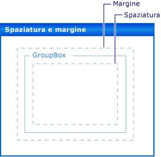

# Procedura dettagliata: disposizione di controlli Windows Form utilizzando spaziatura, margini e la propriet&#224; AutoSize
Per molte applicazioni è estremamente importante la sistemazione precisa dei controlli nel form.  A tale scopo, **Progettazione Windows Form** offre diversi strumenti di layout.  Tre importanti proprietà presenti in tutti i controlli Windows Form sono <xref:System.Windows.Forms.Control.Margin%2A>, <xref:System.Windows.Forms.Control.Padding%2A> e <xref:System.Windows.Forms.Control.AutoSize%2A>.  
  
 La proprietà <xref:System.Windows.Forms.Control.Margin%2A> consente di definire lo spazio intorno al controllo per mantenere gli altri controlli a una specifica distanza dai bordi del controllo.  
  
 La proprietà <xref:System.Windows.Forms.Control.Padding%2A> consente di definire lo spazio all'interno di un controllo per mantenere il contenuto del controllo, ad esempio il valore della proprietà <xref:System.Windows.Forms.Control.Text%2A>, a una specifica distanza dai bordi del controllo.  
  
 Nell'illustrazione che segue sono visibili le proprietà <xref:System.Windows.Forms.Control.Padding%2A> e <xref:System.Windows.Forms.Control.Margin%2A> in un controllo.  
  
   
  
 La proprietà <xref:System.Windows.Forms.Control.AutoSize%2A> indica a un controllo di eseguire automaticamente il ridimensionamento in base al contenuto.  Il ridimensionamento non verrà eseguito per un valore inferiore a quello originale della proprietà <xref:System.Windows.Forms.Control.Size%2A> e verrà tenuto in considerazione il valore della proprietà <xref:System.Windows.Forms.Control.Padding%2A>.  
  
 Di seguito vengono elencate le attività illustrate nella procedura dettagliata:  
  
-   Creazione di un progetto Windows Form  
  
-   Impostazione dei margini dei controlli  
  
-   Impostazione della spaziatura interna dei controlli  
  
-   Ridimensionamento automatico dei controlli  
  
 Al termine, si saranno acquisite le informazioni circa il ruolo delle importanti funzionalità di layout.  
  
> [!NOTE]
>  È possibile che le finestre di dialogo e i comandi di menu visualizzati siano diversi da quelli descritti nella Guida a seconda delle impostazioni attive o dell'edizione del programma.  Per modificare le impostazioni, scegliere **Importa\/esporta impostazioni** dal menu **Strumenti**.  Per ulteriori informazioni, vedere [Customizing Development Settings in Visual Studio](http://msdn.microsoft.com/it-it/22c4debb-4e31-47a8-8f19-16f328d7dcd3).  
  
## Prerequisiti  
 Per completare questa procedura dettagliata, è necessario disporre di quanto segue:  
  
-   Disporre di autorizzazioni sufficienti per creare ed eseguire progetti di applicazioni Windows Form nel computer dove è installato Visual Studio.  
  
## Creazione del progetto  
 Il primo passaggio indica come creare il progetto e impostare il form.  
  
#### Per creare il progetto  
  
1.  Creare un progetto **Applicazione Windows** denominato `LayoutExample`.  Per ulteriori informazioni, vedere [How to: Create a Windows Application Project](http://msdn.microsoft.com/it-it/b2f93fed-c635-4705-8d0e-cf079a264efa).  
  
2.  Selezionare il form in **Progettazione Windows Form**.  
  
## Impostazione dei margini dei controlli  
 Tramite la proprietà <xref:System.Windows.Forms.Control.Margin%2A> è possibile impostare la distanza predefinita tra i controlli.  Quando si sposta un controllo vicino ad un altro controllo, verrà visualizzata una guida di allineamento che indica i margini per i due controlli.  Inoltre, il controllo che si sta spostando viene bloccato in posizione alla distanza definita dai margini.  
  
#### Per disporre i controlli nel form utilizzando la proprietà per margini  
  
1.  Trascinare due controlli <xref:System.Windows.Forms.Button> dalla **Casella degli strumenti** nel form.  
  
2.  Selezionare uno dei controlli <xref:System.Windows.Forms.Button> e spostarlo accanto all'altro fino quasi a farli toccare.  
  
     Si osservi la guida di allineamento che viene visualizzata tra i controlli  indicante la distanza calcolata dalla somma dei valori <xref:System.Windows.Forms.Control.Margin%2A> dei due controlli.  Il controllo che si sta spostando si blocca in posizione a tale distanza.  Per informazioni dettagliate, vedere [Procedura dettagliata: disposizione dei controlli in Windows Form utilizzando guide di allineamento](../../../../docs/framework/winforms/controls/walkthrough-arranging-controls-on-windows-forms-using-snaplines.md).  
  
3.  Modificare la proprietà <xref:System.Windows.Forms.Control.Margin%2A> di uno dei controlli espandendo la voce <xref:System.Windows.Forms.Control.Margin%2A> nella finestra **Proprietà** e impostando la proprietà <xref:System.Windows.Forms.Padding.All%2A> su 20.  
  
4.  Selezionare uno dei controlli <xref:System.Windows.Forms.Button> e spostarlo accanto all'altro.  
  
     La guida di allineamento che definisce la somma dei valori dei margini diventa più lunga e il controllo si blocca a una distanza maggiore dall'altro controllo.  
  
5.  Modificare la proprietà <xref:System.Windows.Forms.Control.Margin%2A> del controllo selezionato espandendo la voce <xref:System.Windows.Forms.Control.Margin%2A> nella finestra **Proprietà** e impostando la proprietà <xref:System.Windows.Forms.Padding.Top%2A> su 5.  
  
6.  Spostare il controllo selezionato sotto l'altro controllo e osservare che la guida di allineamento è più breve.  Spostare il controllo selezionato a sinistra dell'altro controllo e osservare che la guida di allineamento mantiene il valore ottenuto al passaggio 4.  
  
7.  È possibile impostare ogni aspetto della proprietà <xref:System.Windows.Forms.Control.Margin%2A>, <xref:System.Windows.Forms.Padding.Left%2A>, <xref:System.Windows.Forms.Padding.Top%2A>, <xref:System.Windows.Forms.Padding.Right%2A>, <xref:System.Windows.Forms.Padding.Bottom%2A>, su differenti valori oppure è possibile impostarli tutti su uno stesso valore con la proprietà <xref:System.Windows.Forms.Padding.All%2A>.  
  
## Impostazione della spaziatura interna dei controlli  
 Per ottenere esattamente il layout necessario per l'applicazione, spesso i controlli contengono controlli figlio.  Per specificare la vicinanza del bordo del controllo figlio al bordo del controllo padre, utilizzare la proprietà <xref:System.Windows.Forms.Control.Padding%2A> del controllo padre insieme alla proprietà <xref:System.Windows.Forms.Control.Margin%2A> del controllo figlio.  La proprietà <xref:System.Windows.Forms.Control.Padding%2A> viene anche utilizzata per controllare la vicinanza del contenuto di un controllo, ad esempio la proprietà <xref:System.Windows.Forms.Control.Text%2A> di un controllo <xref:System.Windows.Forms.Button>, ai bordi.  
  
#### Per disporre i controlli nel form utilizzando la spaziatura interna  
  
1.  Trascinare un controllo <xref:System.Windows.Forms.Button> dalla **Casella degli strumenti** al form.  
  
2.  Modificare il valore della proprietà <xref:System.Windows.Forms.Control.AutoSize%2A> del controllo <xref:System.Windows.Forms.Button> su `true`.  
  
3.  Modificare la proprietà <xref:System.Windows.Forms.Control.Padding%2A> espandendo la voce <xref:System.Windows.Forms.Control.Padding%2A> nella finestra **Proprietà** e impostando la proprietà <xref:System.Windows.Forms.Padding.All%2A> su 5.  
  
     Il controllo si espande per fornire lo spazio per la nuova spaziatura interna.  
  
4.  Trascinare un controllo <xref:System.Windows.Forms.GroupBox> dalla **Casella degli strumenti** al form.  Trascinare un controllo <xref:System.Windows.Forms.Button> dalla **Casella degli strumenti** nel controllo <xref:System.Windows.Forms.GroupBox>.  Posizionare il controllo <xref:System.Windows.Forms.Button> in modo da allinearlo all'angolo inferiore destro del controllo <xref:System.Windows.Forms.GroupBox>.  
  
     Quando il controllo <xref:System.Windows.Forms.Button> si avvicina ai bordi inferiore e destro del controllo <xref:System.Windows.Forms.GroupBox> vengono visualizzate le guide di allineamento.  Tali guide di allineamento corrispondono alla proprietà <xref:System.Windows.Forms.Control.Margin%2A> di <xref:System.Windows.Forms.Button>.  
  
5.  Modificare il valore della proprietà <xref:System.Windows.Forms.Control.Padding%2A> del controllo <xref:System.Windows.Forms.GroupBox> espandendo la voce <xref:System.Windows.Forms.Control.Padding%2A> nella finestra **Proprietà** e impostando la proprietà <xref:System.Windows.Forms.Padding.All%2A> su 20.  
  
6.  Selezionare il controllo <xref:System.Windows.Forms.Button> nel controllo <xref:System.Windows.Forms.GroupBox> e spostarlo verso il centro di <xref:System.Windows.Forms.GroupBox>.  
  
     Le guide di allineamento vengono visualizzate a una distanza maggiore dai bordi del controllo <xref:System.Windows.Forms.GroupBox>.  Tale distanza corrisponde alla somma della proprietà <xref:System.Windows.Forms.Control.Margin%2A> del controllo <xref:System.Windows.Forms.Button> e della proprietà <xref:System.Windows.Forms.Control.Padding%2A> del controllo <xref:System.Windows.Forms.GroupBox>.  
  
## Ridimensionamento automatico dei controlli  
 In alcune applicazioni, la dimensione di un controllo in fase di esecuzione non è uguale a quella della fase di progettazione.  Il testo di un controllo <xref:System.Windows.Forms.Button>, ad esempio, potrebbe essere ottenuto da un database e avere una lunghezza non definibile in anticipo.  
  
 Quando la proprietà <xref:System.Windows.Forms.Control.AutoSize%2A> è impostata su `true`, il controllo viene automaticamente ridimensionato in base al contenuto.  Per ulteriori informazioni, vedere [Cenni preliminari sulla proprietà AutoSize](../../../../docs/framework/winforms/controls/autosize-property-overview.md).  
  
#### Per disporre i controlli nel form utilizzando la proprietà AutoSize  
  
1.  Trascinare un controllo <xref:System.Windows.Forms.Button> dalla **Casella degli strumenti** al form.  
  
2.  Modificare il valore della proprietà <xref:System.Windows.Forms.Control.AutoSize%2A> del controllo <xref:System.Windows.Forms.Button> su `true`.  
  
3.  Modificare la proprietà <xref:System.Windows.Forms.Control.Text%2A> del controllo <xref:System.Windows.Forms.Button> su "La stringa per la proprietà Text di questo pulsante è lunga".  
  
     Eseguita la modifica, il controllo <xref:System.Windows.Forms.Button> viene ridimensionato per adattarsi al nuovo testo.  
  
4.  Trascinare un altro controllo <xref:System.Windows.Forms.Button> dalla **Casella degli strumenti** nel form.  
  
5.  Modificare la proprietà <xref:System.Windows.Forms.Control.Text%2A> del controllo <xref:System.Windows.Forms.Button> su "La stringa per la proprietà Text di questo pulsante è lunga".  
  
     Eseguita la modifica, il controllo <xref:System.Windows.Forms.Button> non verrà ridimensionato e il testo viene troncato al bordo destro del controllo.  
  
6.  Modificare la proprietà <xref:System.Windows.Forms.Control.Padding%2A> espandendo la voce <xref:System.Windows.Forms.Control.Padding%2A> nella finestra **Proprietà** e impostando la proprietà <xref:System.Windows.Forms.Padding.All%2A> su 5.  
  
     Il testo all'interno del controllo viene troncato per tutti i quattro i lati.  
  
7.  Modificare la proprietà <xref:System.Windows.Forms.Control.AutoSize%2A> del controllo <xref:System.Windows.Forms.Button> su `true`.  
  
     Il controllo <xref:System.Windows.Forms.Button> viene ridimensionato per includere l'intera stringa.  È stata inoltre aggiunta la spaziatura interna intorno al testo e il controllo <xref:System.Windows.Forms.Button> quindi si è espanso nelle quattro direzioni.  
  
8.  Trascinare un controllo <xref:System.Windows.Forms.Button> dalla **Casella degli strumenti** al form.  Posizionarlo accanto all'angolo inferiore destro del form.  
  
9. Modificare il valore della proprietà <xref:System.Windows.Forms.Control.AutoSize%2A> del controllo <xref:System.Windows.Forms.Button> su `true`.  
  
10. Impostare la proprietà <xref:System.Windows.Forms.Control.Anchor%2A> del controllo <xref:System.Windows.Forms.Button> su <xref:System.Windows.Forms.AnchorStyles>, <xref:System.Windows.Forms.AnchorStyles>.  
  
11. Modificare la proprietà <xref:System.Windows.Forms.Control.Text%2A> del controllo <xref:System.Windows.Forms.Button> su "La stringa per la proprietà Text di questo pulsante è lunga".  
  
     Eseguita la modifica, il controllo <xref:System.Windows.Forms.Button> viene ridimensionato verso sinistra.  In generale, il ridimensionamento automatico aumenta la dimensione di un controllo nella direzione opposta all'impostazione della proprietà <xref:System.Windows.Forms.Control.Anchor%2A>.  
  
## Proprietà AutoSize e AutoSizeMode  
 Alcuni controlli supportano la proprietà `AutoSizeMode` che consente di determinare in modo più capillare il ridimensionamento automatico di un controllo.  
  
#### Per utilizzare la proprietà AutoSizeMode  
  
1.  Trascinare un controllo <xref:System.Windows.Forms.Panel> dalla **Casella degli strumenti** al form.  
  
2.  Impostare il valore della proprietà <xref:System.Windows.Forms.Control.AutoSize%2A> del controllo <xref:System.Windows.Forms.Panel> su `true`.  
  
3.  Trascinare un controllo <xref:System.Windows.Forms.Button> dalla **Casella degli strumenti** nel controllo <xref:System.Windows.Forms.Panel>.  
  
4.  Posizionare il controllo <xref:System.Windows.Forms.Button> accanto all'angolo inferiore destro del controllo <xref:System.Windows.Forms.Panel>.  
  
5.  Selezionare il controllo <xref:System.Windows.Forms.Panel> e agganciare il quadratino di ridimensionamento inferiore destro.  Ridimensionare il controllo <xref:System.Windows.Forms.Panel> in modo che sia più grande e più piccolo.  
  
    > [!NOTE]
    >  È possibile ridimensionare liberamente il controllo <xref:System.Windows.Forms.Panel>, ma non è possibile renderlo più piccolo della posizione dell'angolo inferiore destro del controllo <xref:System.Windows.Forms.Button>.  Tale comportamento è specificato dal valore predefinito <xref:System.Windows.Forms.AutoSizeMode> della proprietà `AutoSizeMode`.  
  
6.  Impostare il valore della proprietà `AutoSizeMode` del controllo <xref:System.Windows.Forms.Panel> su <xref:System.Windows.Forms.AutoSizeMode>.  
  
     Il controllo <xref:System.Windows.Forms.Panel> viene ridimensionato in modo da circondare il controllo <xref:System.Windows.Forms.Button>.  Non è possibile ridimensionare il controllo <xref:System.Windows.Forms.Panel>.  
  
7.  Trascinare il controllo <xref:System.Windows.Forms.Button> verso l'angolo superiore sinistro del controllo <xref:System.Windows.Forms.Panel>.  
  
     Il controllo <xref:System.Windows.Forms.Panel> viene ridimensionato in base alla nuova posizione del controllo <xref:System.Windows.Forms.Button>.  
  
## Passaggi successivi  
 Vi sono molte altre funzionalità di layout per la disposizione dei controlli nelle applicazioni Windows Form.  Di seguito sono elencate alcune combinazioni che si potrebbero provare:  
  
-   Compilare un form utilizzando un controllo <xref:System.Windows.Forms.TableLayoutPanel>.  Per informazioni dettagliate, vedere [Procedura dettagliata: disposizione dei controlli in Windows Form utilizzando TableLayoutPanel](../../../../docs/framework/winforms/controls/walkthrough-arranging-controls-on-windows-forms-using-a-tablelayoutpanel.md).  Provare a modificare i valori della proprietà <xref:System.Windows.Forms.Control.Padding%2A> del controllo <xref:System.Windows.Forms.TableLayoutPanel> e della proprietà <xref:System.Windows.Forms.Control.Margin%2A> per i controlli figlio.  
  
-   Provare lo stesso esperimento utilizzando un controllo <xref:System.Windows.Forms.FlowLayoutPanel>.  Per informazioni dettagliate, vedere [Procedura dettagliata: disposizione dei controlli in Windows Form utilizzando FlowLayoutPanel](../../../../docs/framework/winforms/controls/walkthrough-arranging-controls-on-windows-forms-using-a-flowlayoutpanel.md).  
  
-   Provare ad ancorare i controlli figlio in un controllo <xref:System.Windows.Forms.Panel>.  La proprietà <xref:System.Windows.Forms.Control.Padding%2A> è più generica rispetto alla proprietà <xref:System.Windows.Forms.ScrollableControl.DockPadding%2A> ed è possibile provarlo inserendo un controllo figlio in un controllo <xref:System.Windows.Forms.Panel> e impostando la proprietà <xref:System.Windows.Forms.Control.Dock%2A> del controllo figlio <xref:System.Windows.Forms.DockStyle>.  Impostare la proprietà <xref:System.Windows.Forms.Control.Padding%2A> del controllo <xref:System.Windows.Forms.Panel> su differenti valori e notare l'effetto.  
  
## Vedere anche  
 <xref:System.Windows.Forms.Control.AutoSize%2A>   
 <xref:System.Windows.Forms.ScrollableControl.DockPadding%2A>   
 <xref:System.Windows.Forms.Control.Margin%2A>   
 <xref:System.Windows.Forms.Control.Padding%2A>   
 [Cenni preliminari sulla proprietà AutoSize](../../../../docs/framework/winforms/controls/autosize-property-overview.md)   
 [Procedura dettagliata: disposizione dei controlli in Windows Form utilizzando TableLayoutPanel](../../../../docs/framework/winforms/controls/walkthrough-arranging-controls-on-windows-forms-using-a-tablelayoutpanel.md)   
 [Procedura dettagliata: disposizione dei controlli in Windows Form utilizzando FlowLayoutPanel](../../../../docs/framework/winforms/controls/walkthrough-arranging-controls-on-windows-forms-using-a-flowlayoutpanel.md)   
 [Procedura dettagliata: disposizione dei controlli in Windows Form utilizzando guide di allineamento](../../../../docs/framework/winforms/controls/walkthrough-arranging-controls-on-windows-forms-using-snaplines.md)