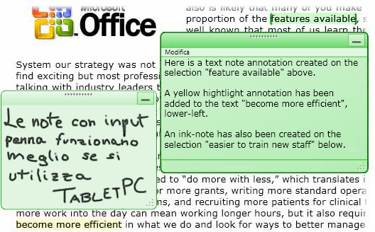
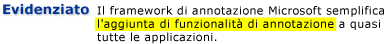
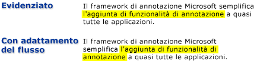

# Cenni preliminari sulle annotazioni
La scrittura di note o commenti su documenti cartacei è un'attività comune che diamo quasi per scontata.  Queste note o commenti sono "annotazioni" aggiunte a un documento per contrassegnare informazioni o evidenziare elementi di interesse a cui fare riferimento in un secondo momento.  Sebbene la scrittura di note su documenti stampati sia un'operazione semplice e comune, la capacità di aggiungere commenti personali ai documenti elettronici, se disponibile, è in genere molto limitata.  
  
 In questo argomento vengono esaminati molti tipi comuni di annotazioni, in modo specifico note di Sticky Notes ed evidenziazioni e viene descritto il modo in cui [!INCLUDE[TLA#tla_caf](../../../../includes/tlasharptla-caf-md.md)] facilita questi tipi di annotazioni nelle applicazioni tramite i controlli di visualizzazione del documento [!INCLUDE[TLA#tla_wpf](../../../../includes/tlasharptla-wpf-md.md)].  I controlli di visualizzazione del documento [!INCLUDE[TLA2#tla_wpf](../../../../includes/tla2sharptla-wpf-md.md)] che supportano le annotazioni includono <xref:System.Windows.Controls.FlowDocumentReader> e <xref:System.Windows.Controls.FlowDocumentScrollViewer>, nonché i controlli derivati da <xref:System.Windows.Controls.Primitives.DocumentViewerBase> quali <xref:System.Windows.Controls.DocumentViewer> e <xref:System.Windows.Controls.FlowDocumentPageViewer>.  
  
 [!INCLUDE[autoOutline](../Token/autoOutline_md.md)]  
  
   
## Note di Sticky Notes  
 Normalmente una nota adesiva contiene informazioni scritte su un pezzetto di carta colorata che viene successivamente "attaccato" su un documento.  Le note digitali di Sticky Notes forniscono una funzionalità simile per i documenti elettronici, ma con un'ulteriore flessibilità che consente di includere molti altri tipi di contenuto, quali un testo digitato, note scritte a mano \(ad esempio, tratti di "input penna" [!INCLUDE[TLA#tla_tpc](../../../../includes/tlasharptla-tpc-md.md)]\) o collegamenti Web.  
  
 Nell'illustrazione seguente vengono mostrati alcuni esempi di annotazioni con evidenziatore, annotazioni di testo con Sticky Note e annotazioni a penna di Sticky Notes.  
  
   
  
 Nell'esempio seguente viene descritto il metodo che è possibile utilizzare per abilitare il supporto delle annotazioni nell'applicazione.  
  
 [!code-csharp[DocViewerAnnotationsXml#DocViewXmlStartAnnotations](../../../../samples/snippets/csharp/VS_Snippets_Wpf/DocViewerAnnotationsXml/CSharp/Window1.xaml.cs#docviewxmlstartannotations)]
 [!code-vb[DocViewerAnnotationsXml#DocViewXmlStartAnnotations](../../../../samples/snippets/visualbasic/VS_Snippets_Wpf/DocViewerAnnotationsXml/visualbasic/window1.xaml.vb#docviewxmlstartannotations)]  
  
   
## Evidenziazioni  
 Quando si eseguono annotazioni su un documento cartaceo, per attirare l'attenzione su elementi di interesse si utilizzano metodi creativi, ad esempio sottolineando, evidenziando, cerchiando parole in una frase o tracciando segni o notazioni sul margine.  Le annotazioni con evidenziatore di [!INCLUDE[TLA#tla_caf](../../../../includes/tlasharptla-caf-md.md)] forniscono una funzionalità simile per annotare le informazioni visualizzate nei controlli di visualizzazione del documento [!INCLUDE[TLA2#tla_wpf](../../../../includes/tla2sharptla-wpf-md.md)].  
  
 Nell'illustrazione seguente viene mostrato un esempio di un'annotazione con evidenziatore.  
  
   
  
 In genere, gli utenti creano annotazioni selezionando innanzitutto una parte di testo o un elemento di interesse, quindi facendo clic con il pulsante destro del mouse per visualizzare un oggetto <xref:System.Windows.Controls.ContextMenu> delle opzioni di annotazione.  Nell'esempio seguente viene mostrata la sintassi [!INCLUDE[TLA#tla_xaml](../../../../includes/tlasharptla-xaml-md.md)] che è possibile utilizzare per dichiarare un oggetto <xref:System.Windows.Controls.ContextMenu> con comandi indirizzati a cui gli utenti possono accedere per creare e gestire le annotazioni.  
  
 [!code-xml[DocViewerAnnotationsXps#CreateDeleteAnnotations](../../../../samples/snippets/csharp/VS_Snippets_Wpf/DocViewerAnnotationsXps/CSharp/Window1.xaml#createdeleteannotations)]  
  
   
## Ancoraggio dei dati  
 In [!INCLUDE[TLA2#tla_caf](../../../../includes/tla2sharptla-caf-md.md)] le annotazioni vengono associate ai dati selezionati dall'utente e non solo a una posizione nella visualizzazione.  Pertanto, se la visualizzazione del documento cambia, ad esempio quando l'utente scorre o ridimensiona la finestra di visualizzazione, l'annotazione rimane nella selezione dati alla quale è associata.  Ad esempio, nell'immagine seguente viene mostrata un'annotazione effettuata dall'utente su una selezione di testo.  Quando la visualizzazione del documento cambia \(scorre, viene ridimensionata o si sposta\), l'annotazione con evidenziatore si sposta insieme alla selezione dati originale.  
  
   
  
   
## Creazione di corrispondenze tra annotazioni e oggetti annotati  
 È possibile creare corrispondenze tra annotazioni e oggetti annotati corrispondenti.  Si consideri, ad esempio, una semplice applicazione per la lettura di documenti che dispone di un riquadro dei commenti.  Il riquadro dei commenti potrebbe essere una casella di riepilogo in cui viene visualizzato il testo di un elenco di annotazioni ancorate a un documento.  Se l'utente seleziona un elemento della casella di riepilogo, nell'applicazione viene visualizzato il paragrafo del documento a cui l'oggetto di annotazione corrispondente è ancorato.  
  
 Nell'esempio seguente viene illustrato come implementare il gestore eventi di una casella di riepilogo di questo tipo che funge da riquadro dei commenti.  
  
 [!code-csharp[FlowDocumentAnnotatedViewer#Handler](../../../../samples/snippets/csharp/VS_Snippets_Wpf/FlowDocumentAnnotatedViewer/CSharp/Window1.xaml.cs#handler)]
 [!code-vb[FlowDocumentAnnotatedViewer#Handler](../../../../samples/snippets/visualbasic/VS_Snippets_Wpf/FlowDocumentAnnotatedViewer/visualbasic/window1.xaml.vb#handler)]  
  
 Un altro scenario di esempio riguarda le applicazioni che consentono lo scambio di annotazioni e di note Sticky Notes tra lettori di documenti tramite posta elettronica.  Questa funzionalità consente a tali applicazioni di far spostare il lettore alla pagina contenente l'annotazione che viene scambiata.  
  
## Vedere anche  
 <xref:System.Windows.Controls.Primitives.DocumentViewerBase>   
 <xref:System.Windows.Controls.DocumentViewer>   
 <xref:System.Windows.Controls.FlowDocumentPageViewer>   
 <xref:System.Windows.Controls.FlowDocumentScrollViewer>   
 <xref:System.Windows.Controls.FlowDocumentReader>   
 <xref:System.Windows.Annotations.IAnchorInfo>   
 [Schema annotazioni](../../../../docs/framework/wpf/advanced/annotations-schema.md)   
 [Cenni preliminari sull'oggetto ContextMenu](../../../../docs/framework/wpf/controls/contextmenu-overview.md)   
 [Cenni preliminari sull'esecuzione di comandi](../../../../docs/framework/wpf/advanced/commanding-overview.md)   
 [Cenni preliminari sui documenti dinamici](../../../../docs/framework/wpf/advanced/flow-document-overview.md)   
 [How to: Add a Command to a MenuItem](http://msdn.microsoft.com/it-it/013d68a0-5373-4a68-bd91-5de574307370)