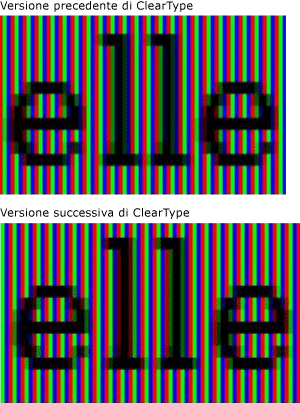
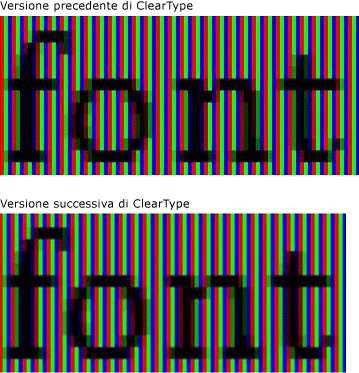
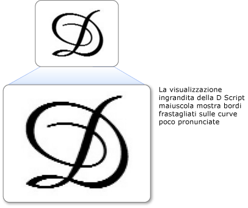
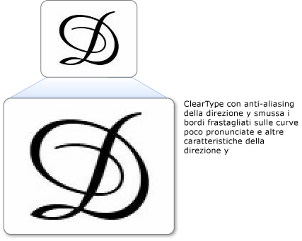

# Cenni preliminari su ClearType
In questo argomento viene fornita una panoramica della tecnologia [!INCLUDE[TLA#tla_ct](../../../../includes/tlasharptla-ct-md.md)] presente in [!INCLUDE[TLA#tla_winclient](../../../../includes/tlasharptla-winclient-md.md)].  
  
   
  
   
## Cenni preliminari sulla tecnologia  
 [!INCLUDE[TLA2#tla_ct](../../../../includes/tla2sharptla-ct-md.md)] è una tecnologia software sviluppata da [!INCLUDE[TLA#tla_ms](../../../../includes/tlasharptla-ms-md.md)] che consente di migliorare la leggibilità del testo sui display LCD \(Liquid Crystal Display\), ad esempio gli schermi di computer portatili, Pocket PC e i monitor a schermo piatto.  Il funzionamento della tecnologia [!INCLUDE[TLA2#tla_ct](../../../../includes/tla2sharptla-ct-md.md)] si basa sull'accesso a singoli elementi striscia di colore verticali in ogni pixel di uno schermo LCD.  Prima di [!INCLUDE[TLA2#tla_ct](../../../../includes/tla2sharptla-ct-md.md)] il livello di dettaglio minimo che un computer era in grado di visualizzare era pari a un solo pixel; utilizzando [!INCLUDE[TLA2#tla_ct](../../../../includes/tla2sharptla-ct-md.md)] in un monitor LCD, invece, ora è possibile visualizzare parti del testo di misura pari a una frazione di pixel di larghezza.  La risoluzione aggiuntiva aumenta la nitidezza dei piccoli dettagli nella visualizzazione del testo, rendendone più facile la lettura per periodi prolungati.  
  
 La versione di [!INCLUDE[TLA2#tla_ct](../../../../includes/tla2sharptla-ct-md.md)] disponibile in [!INCLUDE[TLA#tla_winclient](../../../../includes/tlasharptla-winclient-md.md)] è l'ultima generazione di [!INCLUDE[TLA2#tla_ct](../../../../includes/tla2sharptla-ct-md.md)] e presenta diversi miglioramenti rispetto alla versione presente in [!INCLUDE[TLA#tla_gdi](../../../../includes/tlasharptla-gdi-md.md)].  
  
   
## Posizionamento dei subpixel  
 Un miglioramento significativo rispetto alla versione precedente di [!INCLUDE[TLA2#tla_ct](../../../../includes/tla2sharptla-ct-md.md)] è relativo all'utilizzo del posizionamento dei subpixel.  A differenza dell'implementazione di [!INCLUDE[TLA2#tla_ct](../../../../includes/tla2sharptla-ct-md.md)] presente in [!INCLUDE[TLA2#tla_gdi](../../../../includes/tla2sharptla-gdi-md.md)], [!INCLUDE[TLA2#tla_ct](../../../../includes/tla2sharptla-ct-md.md)], disponibile in [!INCLUDE[TLA#tla_winclient](../../../../includes/tlasharptla-winclient-md.md)] consente di inserire i glifi all'interno del pixel e non solo nel limite iniziale del pixel.  Grazie a questa risoluzione aggiuntiva nel posizionamento dei glifi, la spaziatura e le proporzioni dei glifi risultano più precise e coerenti.  
  
 Nei due esempi seguenti viene mostrato come è possibile inserire i glifi su qualsiasi limite del subpixel se si utilizza il posizionamento dei subpixel.  Per il rendering dell'esempio a sinistra viene utilizzata la versione precedente del renderer [!INCLUDE[TLA2#tla_ct](../../../../includes/tla2sharptla-ct-md.md)] che non impiegava il posizionamento dei subpixel.  Per il rendering dell'esempio a destra viene utilizzata la nuova versione del renderer [!INCLUDE[TLA2#tla_ct](../../../../includes/tla2sharptla-ct-md.md)], che impiega il posizionamento dei subpixel.  Notare che il rendering dei caratteri **e** e **l** nell'immagine a destra è leggermente diverso in quanto ognuno ha inizio in un subpixel diverso.  Quando il testo viene visualizzato sullo schermo alla dimensione normale, questa differenza non è ben visibile a causa dell'elevato contrasto dell'immagine del glifo  e può essere notata solo grazie al sofisticato filtro colore incorporato in [!INCLUDE[TLA2#tla_ct](../../../../includes/tla2sharptla-ct-md.md)].  
  
   
Testo visualizzato con la versione precedente e quella successiva di ClearType  
  
 Nei due esempi seguenti viene confrontato l'output del renderer [!INCLUDE[TLA2#tla_ct](../../../../includes/tla2sharptla-ct-md.md)] precedente con la versione nuova del renderer [!INCLUDE[TLA2#tla_ct](../../../../includes/tla2sharptla-ct-md.md)].  Il posizionamento dei subpixel, mostrato a destra, consente di migliorare notevolmente la spaziatura dei tipi sullo schermo, specialmente alle dimensioni più piccole, in cui la differenza tra un subpixel e un pixel intero rappresenta una parte significativa della larghezza del glifo.  Notare che la spaziatura tra le lettere è più uniforme nella seconda immagine.  Il vantaggio complessivo derivante dal posizionamento dei subpixel sull'aspetto globale di una schermata di testo aumenta in modo notevole e rappresenta un'evoluzione significativa nella tecnologia [!INCLUDE[TLA2#tla_ct](../../../../includes/tla2sharptla-ct-md.md)].  
  
   
Confronto tra il testo visualizzato con la versione precedente di ClearType e quello visualizzato con la versione successiva  
  
   
## Antialiasing della direzione Y  
 Un altro miglioramento di [!INCLUDE[TLA2#tla_ct](../../../../includes/tla2sharptla-ct-md.md)] in [!INCLUDE[TLA#tla_winclient](../../../../includes/tlasharptla-winclient-md.md)] è relativo all'antialiasing della direzione y.  [!INCLUDE[TLA2#tla_ct](../../../../includes/tla2sharptla-ct-md.md)] in [!INCLUDE[TLA2#tla_gdi](../../../../includes/tla2sharptla-gdi-md.md)] senza antialiasing della direzione y fornisce una risoluzione ottimale sull'asse x, ma non sull'asse y.  Nelle parti superiori e inferiori delle curve poco pronunciate, i bordi frastagliati riducono la leggibilità.  
  
 Nell'esempio seguente viene mostrato l'effetto dell'assenza di antialiasing della direzione y.  In questo caso, i bordi frastagliati nella parte superiore e inferiore della lettera sono chiaramente visibili.  
  
   
Testo con bordi frastagliati sulle curve poco pronunciate  
  
 [!INCLUDE[TLA2#tla_ct](../../../../includes/tla2sharptla-ct-md.md)] in [!INCLUDE[TLA#tla_winclient](../../../../includes/tlasharptla-winclient-md.md)] fornisce l'antialiasing del livello della direzione y per smussare tutti i bordi frastagliati.  Tale funzionalità è particolarmente importante per migliorare la leggibilità delle lingue asiatiche, nelle quali gli ideogrammi presentano un quantità quasi uguale di curve poco pronunciate orizzontali e verticali.  
  
 Nell'esempio seguente viene mostrato l'effetto dell'assenza di antialiasing della direzione y.  In questo caso, la parte superiore e quella inferiore della lettera mostrano una curva uniforme.  
  
   
Testo con antialiasing della direzione y ClearType  
  
   
## Accelerazione hardware  
 [!INCLUDE[TLA2#tla_ct](../../../../includes/tla2sharptla-ct-md.md)] in [!INCLUDE[TLA#tla_winclient](../../../../includes/tlasharptla-winclient-md.md)] può sfruttare l'accelerazione hardware per ottenere prestazioni migliori e ridurre il carico della CPU e i requisiti della memoria di sistema.  Utilizzando i pixel shader e la memoria video di una scheda grafica, [!INCLUDE[TLA2#tla_ct](../../../../includes/tla2sharptla-ct-md.md)] consente un rendering più veloce del testo, in particolare quando si utilizza l'animazione.  
  
 [!INCLUDE[TLA2#tla_ct](../../../../includes/tla2sharptla-ct-md.md)] in [!INCLUDE[TLA#tla_winclient](../../../../includes/tlasharptla-winclient-md.md)] non modifica le impostazioni di[!INCLUDE[TLA2#tla_ct](../../../../includes/tla2sharptla-ct-md.md)] a livello di sistema.  Se si disabilita [!INCLUDE[TLA2#tla_ct](../../../../includes/tla2sharptla-ct-md.md)] in [!INCLUDE[TLA#tla_mswin](../../../../includes/tlasharptla-mswin-md.md)] l'antialiasing di [!INCLUDE[TLA#tla_winclient](../../../../includes/tlasharptla-winclient-md.md)] viene impostato sulla modalità scala di grigi. Inoltre, [!INCLUDE[TLA2#tla_ct](../../../../includes/tla2sharptla-ct-md.md)] in [!INCLUDE[TLA#tla_winclient](../../../../includes/tlasharptla-winclient-md.md)] non modifica le impostazioni di [ClearType Tuner PowerToy](http://www.microsoft.com/typography/ClearTypePowerToy.mspx).  
  
 Una delle decisioni relative alla progettazione dell'architettura di [!INCLUDE[TLA#tla_winclient](../../../../includes/tlasharptla-winclient-md.md)] consiste nel disporre di monitor DPI a risoluzione più elevata con supporto migliorato del layout indipendente dalla risoluzione, di diffusione sempre maggiore.  Come conseguenza di tale scelta, [!INCLUDE[TLA#tla_winclient](../../../../includes/tlasharptla-winclient-md.md)] non supporta il rendering del testo con antialiasing o le bitmap in alcuni tipi di carattere asiatici in quanto entrambi sono dipendenti dalla risoluzione.  
  
   
## Ulteriori informazioni  
 [Informazioni su ClearType](http://www.microsoft.com/typography/ClearTypeInfo.mspx)  
  
 [ClearType Tuner PowerToy](http://www.microsoft.com/typography/ClearTypePowerToy.mspx)  
  
## Vedere anche  
 [Impostazioni del Registro di sistema ClearType](../../../../docs/framework/wpf/advanced/cleartype-registry-settings.md)