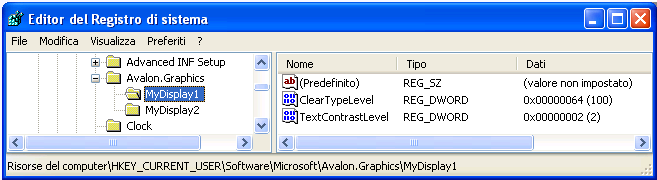

# Impostazioni del Registro di sistema ClearType
In questo argomento viene fornita una panoramica delle impostazioni del Registro di sistema [!INCLUDE[TLA#tla_ct](../../../../includes/tlasharptla-ct-md.md)] [!INCLUDE[TLA2#tla_winclient](../../../../includes/tla2sharptla-winclient-md.md)] utilizzate dalle applicazioni [!INCLUDE[TLA2#tla_winclient](../../../../includes/tla2sharptla-winclient-md.md)].  
  
   
  
   
## Cenni preliminari sulla tecnologia  
 Le applicazioni [!INCLUDE[TLA2#tla_winclient](../../../../includes/tla2sharptla-winclient-md.md)] che eseguono il rendering di testo su un dispositivo di visualizzazione utilizzano le funzionalità di [!INCLUDE[TLA2#tla_ct](../../../../includes/tla2sharptla-ct-md.md)] per offrire una migliore esperienza di lettura.  [!INCLUDE[TLA2#tla_ct](../../../../includes/tla2sharptla-ct-md.md)] è una tecnologia software sviluppata da [!INCLUDE[TLA#tla_ms](../../../../includes/tlasharptla-ms-md.md)] che consente di migliorare la leggibilità del testo sui display LCD \(Liquid Crystal Display\), ad esempio gli schermi di computer portatili, Pocket PC e i monitor a schermo piatto.  Il funzionamento della tecnologia [!INCLUDE[TLA2#tla_ct](../../../../includes/tla2sharptla-ct-md.md)] si basa sull'accesso a singoli elementi striscia di colore verticali in ogni pixel di uno schermo LCD.  Per ulteriori informazioni sulle applicazioni [!INCLUDE[TLA2#tla_ct](../../../../includes/tla2sharptla-ct-md.md)], vedere [Cenni preliminari su ClearType](../../../../docs/framework/wpf/advanced/cleartype-overview.md).  
  
 Il testo di cui viene eseguito il rendering con [!INCLUDE[TLA2#tla_ct](../../../../includes/tla2sharptla-ct-md.md)] può avere un aspetto notevolmente diverso a seconda del dispositivo di visualizzazione utilizzato.  Ad esempio, un numero limitato di monitor implementa gli elementi striscia di colore nell'ordine blu, verde, rosso anziché nell'ordine più comune rosso, verde, blu \([!INCLUDE[TLA#tla_rgb](../../../../includes/tlasharptla-rgb-md.md)]\).  
  
 Il testo di cui viene eseguito il rendering con [!INCLUDE[TLA2#tla_ct](../../../../includes/tla2sharptla-ct-md.md)] può inoltre avere un aspetto diverso se visualizzato da persone con diversi livelli di sensibilità al colore.  Alcune persone rilevano leggere differenze di colore meglio di altre.  
  
 In ognuno di questi casi, è necessario modificare le funzionalità [!INCLUDE[TLA2#tla_ct](../../../../includes/tla2sharptla-ct-md.md)] per garantire un'esperienza di lettura ottimale per ogni utente.  
  
   
## Impostazioni del Registro di sistema  
 In [!INCLUDE[TLA2#tla_winclient](../../../../includes/tla2sharptla-winclient-md.md)] vengono specificate quattro impostazioni del Registro di sistema per il controllo delle funzionalità [!INCLUDE[TLA2#tla_ct](../../../../includes/tla2sharptla-ct-md.md)]:  
  
|Impostazione|Descrizione|  
|------------------|-----------------|  
|Livello [!INCLUDE[TLA2#tla_ct](../../../../includes/tla2sharptla-ct-md.md)]|Descrive il livello di chiarezza del colore di [!INCLUDE[TLA2#tla_ct](../../../../includes/tla2sharptla-ct-md.md)].|  
|Livello di gamma|Descrive il livello della componente cromatica del pixel per un dispositivo di visualizzazione.|  
|Struttura del pixel|Descrive la disposizione dei pixel per un dispositivo di visualizzazione.|  
|Livello di contrasto del testo|Descrive il livello di contrasto per il testo visualizzato.|  
  
 È possibile accedere a queste impostazioni tramite qualsiasi utilità di configurazione esterna che consenta di fare riferimento alle impostazioni del Registro di sistema [!INCLUDE[TLA2#tla_ct](../../../../includes/tla2sharptla-ct-md.md)] [!INCLUDE[TLA2#tla_winclient](../../../../includes/tla2sharptla-winclient-md.md)] identificate.  È inoltre possibile creare o modificare tali impostazioni accedendo direttamente ai valori mediante l'editor del Registro di sistema di [!INCLUDE[TLA#tla_mswin](../../../../includes/tlasharptla-mswin-md.md)].  
  
 Se le impostazioni del Registro di sistema di [!INCLUDE[TLA2#tla_ct](../../../../includes/tla2sharptla-ct-md.md)] [!INCLUDE[TLA2#tla_winclient](../../../../includes/tla2sharptla-winclient-md.md)] non vengono impostate \(stato predefinito\), l'applicazione [!INCLUDE[TLA2#tla_winclient](../../../../includes/tla2sharptla-winclient-md.md)] esegue una query sulle informazioni dei parametri di sistema di [!INCLUDE[TLA#tla_mswin](../../../../includes/tlasharptla-mswin-md.md)] per individuare le impostazioni di anti\-aliasing caratteri.  
  
> [!NOTE]
>  Per informazioni sull'enumerazione dei nomi dei dispositivi di visualizzazione, vedere la funzione [!INCLUDE[TLA2#tla_win32](../../../../includes/tla2sharptla-win32-md.md)] `SystemParametersInfo`.  
  
   
## Livello ClearType  
 Il livello [!INCLUDE[TLA2#tla_ct](../../../../includes/tla2sharptla-ct-md.md)] consente di regolare il rendering del testo in base alla sensibilità e alla percezione dei colori di un individuo. Per alcune persone, il rendering di testo che utilizza [!INCLUDE[TLA2#tla_ct](../../../../includes/tla2sharptla-ct-md.md)] al livello più elevato non offre un'esperienza di lettura ottimale.  
  
 Il livello di [!INCLUDE[TLA2#tla_ct](../../../../includes/tla2sharptla-ct-md.md)] è un valore intero compreso tra 0 e 100.  Il livello predefinito è 100, che indica l'utilizzo in [!INCLUDE[TLA2#tla_ct](../../../../includes/tla2sharptla-ct-md.md)] della capacità massima degli elementi striscia di colore del dispositivo di visualizzazione.  Un livello [!INCLUDE[TLA2#tla_ct](../../../../includes/tla2sharptla-ct-md.md)] pari a 0 esegue il rendering del testo in scala di grigi.  L'impostazione del livello [!INCLUDE[TLA2#tla_ct](../../../../includes/tla2sharptla-ct-md.md)] su un valore medio tra 0 e 100 consente di individuare un livello intermedio adatto alla sensibilità al colore di una determinata persona.  
  
### Impostazione del Registro di sistema  
 Il percorso dell'impostazione del Registro di sistema per il livello [!INCLUDE[TLA2#tla_ct](../../../../includes/tla2sharptla-ct-md.md)] è un'impostazione del singolo utente che corrisponde al nome di uno specifico dispositivo di visualizzazione:  
  
 `HKEY_CURRENT_USER\SOFTWARE\Microsoft\Avalon.Graphics\<displayName>`  
  
 Per ogni nome di dispositivo di visualizzazione per un utente, viene definito un valore DWORD `ClearTypeLevel`.  Nella schermata riportata di seguito viene illustrata l'impostazione dell'Editor del Registro di sistema per il livello [!INCLUDE[TLA2#tla_ct](../../../../includes/tla2sharptla-ct-md.md)].  
  
   
  
> [!NOTE]
>  Nelle applicazioni [!INCLUDE[TLA2#tla_winclient](../../../../includes/tla2sharptla-winclient-md.md)] il rendering del testo può essere eseguito scegliendo tra due modalità, con e senza [!INCLUDE[TLA2#tla_ct](../../../../includes/tla2sharptla-ct-md.md)].  Quando il rendering del testo viene eseguito senza [!INCLUDE[TLA2#tla_ct](../../../../includes/tla2sharptla-ct-md.md)], viene denominato rendering in scala di grigi.  
  
   
## Livello di gamma  
 Il livello di gamma fa riferimento alla relazione non lineare tra un valore in pixel e la luminanza.  L'impostazione del livello di gamma deve corrispondere alle caratteristiche fisiche del dispositivo di visualizzazione, in caso contrario possono verificarsi distorsioni nell'output del rendering.  Ad esempio, il testo potrebbe risultare troppo largo o troppo stretto o è possibile che compaiano sbavature di colore sui bordi dei gambi verticali dei glifi.  
  
 Il livello di gamma è un valore intero compreso tra 1000 e 2200.  Il livello predefinito è 1900.  
  
### Impostazione del Registro di sistema  
 Il percorso dell'impostazione del Registro di sistema per il livello di gamma è un'impostazione del computer locale che corrisponde al nome di uno specifico dispositivo di visualizzazione:  
  
 `HKEY_LOCAL_MACHINE\SOFTWARE\Microsoft\Avalon.Graphics\<displayName>`  
  
 Per ogni nome di dispositivo di visualizzazione per un utente, viene definito un valore DWORD `GammaLevel`.  Nella schermata riportata di seguito viene illustrata l'impostazione dell'Editor del Registro di sistema per il livello di gamma.  
  
   
  
   
## Struttura del pixel  
 La struttura del pixel descrive il tipo di pixel alla base di un dispositivo di visualizzazione.  La struttura del pixel è definita come uno di tre tipi:  
  
|Type|Valore|Descrizione|  
|----------|------------|-----------------|  
|Flat|0|Il dispositivo di visualizzazione non ha struttura del pixel.  In questo caso le sorgenti di luce per ogni colore sono distribuite in modo uniforme nell'area dei pixel, condizione nota come rendering in scala di grigi.  Questo è il funzionamento di un dispositivo di visualizzazione standard.  [!INCLUDE[TLA2#tla_ct](../../../../includes/tla2sharptla-ct-md.md)] non viene mai applicato al testo di cui si esegue il rendering.|  
|RGB|1|Il dispositivo di visualizzazione dispone di pixel costituiti da tre strisce nell'ordine seguente: rosso, verde e blu.  [!INCLUDE[TLA2#tla_ct](../../../../includes/tla2sharptla-ct-md.md)] viene applicato al testo di cui si esegue il rendering.|  
|BGR|2|Il dispositivo di visualizzazione dispone di pixel costituiti da tre strisce nell'ordine seguente: blu, verde e rosso.  [!INCLUDE[TLA2#tla_ct](../../../../includes/tla2sharptla-ct-md.md)] viene applicato al testo di cui si esegue il rendering.  Si noti come l'ordine viene invertito rispetto al tipo RGB.|  
  
 La struttura dei pixel corrisponde a un valore intero compreso tra 0 e 2.  Il livello predefinito 0 rappresenta una struttura del pixel flat.  
  
> [!NOTE]
>  Per informazioni sull'enumerazione dei nomi dei dispositivi di visualizzazione, vedere la funzione [!INCLUDE[TLA2#tla_win32](../../../../includes/tla2sharptla-win32-md.md)] `EnumDisplayDevices`.  
  
### Impostazione del Registro di sistema  
 Il percorso dell'impostazione del Registro di sistema per la struttura del pixel è un'impostazione del computer locale che corrisponde al nome di uno specifico dispositivo di visualizzazione:  
  
 `HKEY_LOCAL_MACHINE\SOFTWARE\Microsoft\Avalon.Graphics\<displayName>`  
  
 Per ogni nome di dispositivo di visualizzazione per un utente, viene definito un valore DWORD `PixelStructure`.  Nella schermata riportata di seguito viene illustrata l'impostazione dell'Editor del Registro di sistema per la struttura del pixel.  
  
   
  
   
## Livello di contrasto del testo  
 Il livello di contrasto del testo consente di regolare il rendering del testo in base alle larghezze del gambo dei glifi.  Il livello di contrasto del testo è un valore intero compreso tra 0 e 6, dove il valore più grande indica una maggiore larghezza.  Il livello predefinito è 1.  
  
### Impostazione del Registro di sistema  
 Il percorso dell'impostazione del Registro di sistema per il livello di contrasto del testo è un'impostazione del singolo utente che corrisponde al nome di uno specifico dispositivo di visualizzazione:  
  
 `HKEY_CURRENT_USER\Software\Microsoft\Avalon.Graphics\<displayName>`  
  
 Per ogni nome di dispositivo di visualizzazione per un utente, viene definito un valore DWORD `TextContrastLevel`.  Nella schermata riportata di seguito viene illustrata l'impostazione dell'Editor del Registro di sistema per il livello di contrasto del testo.  
  
   
  
## Vedere anche  
 [Cenni preliminari su ClearType](../../../../docs/framework/wpf/advanced/cleartype-overview.md)   
 [Anti\-aliasing ClearType](_win32_ClearType_Antialiasing)