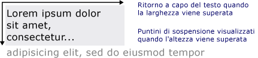

# Disegno di testo formattato
In questo argomento vengono forniti dei cenni preliminari sulle funzionalità dell'oggetto <xref:System.Windows.Media.FormattedText>.  Questo oggetto fornisce un controllo di basso livello per il disegno di testo nelle applicazioni [!INCLUDE[TLA#tla_winclient](../../../../includes/tlasharptla-winclient-md.md)].  
  
   
  
   
## Cenni preliminari sulla tecnologia  
 L'oggetto <xref:System.Windows.Media.FormattedText> consente di creare testo su più righe, in cui ogni carattere può essere formattato singolarmente.  Nell'esempio seguente viene mostrato un testo a cui sono stati applicati diversi formati.  
  
   
Testo visualizzato con il metodo FormattedText  
  
> [!NOTE]
>  Per gli sviluppatori che eseguono la migrazione dall'API [!INCLUDE[TLA#tla_win32](../../../../includes/tlasharptla-win32-md.md)], nella tabella della sezione [Migrazione Win32](#win32_migration) sono elencati i flag DrawText di [!INCLUDE[TLA#tla_win32](../../../../includes/tlasharptla-win32-md.md)] e gli elementi corrispondenti di [!INCLUDE[TLA#tla_winclient](../../../../includes/tlasharptla-winclient-md.md)].  
  
### Motivi dell'utilizzo del testo formattato  
 [!INCLUDE[TLA2#tla_winclient](../../../../includes/tla2sharptla-winclient-md.md)] include più controlli per la creazione di testo sullo schermo.  Ogni controllo è destinato a uno scenario diverso e dispone di un proprio elenco di funzionalità e limitazioni.  In genere, è opportuno utilizzare l'elemento <xref:System.Windows.Controls.TextBlock> quando è necessario un supporto limitato del testo, ad esempio una breve frase in un'[!INCLUDE[TLA#tla_ui](../../../../includes/tlasharptla-ui-md.md)].  Quando è necessario un supporto minimo del testo, è possibile utilizzare <xref:System.Windows.Controls.Label>.  Per ulteriori informazioni, vedere [Documenti in WPF](../../../../docs/framework/wpf/advanced/documents-in-wpf.md).  
  
 L'oggetto <xref:System.Windows.Media.FormattedText> fornisce più funzionalità di formattazione del testo rispetto ai controlli di testo di [!INCLUDE[TLA#tla_winclient](../../../../includes/tlasharptla-winclient-md.md)] e può essere utile nei casi in cui si desideri utilizzare il testo come elemento decorativo. Per ulteriori informazioni, vedere la sezione seguente [Conversione del testo formattato in una geometria](#converting_formatted_text).  
  
 Inoltre, l'oggetto <xref:System.Windows.Media.FormattedText> è utile per la creazione di oggetti derivati <xref:System.Windows.Media.DrawingVisual> orientati al testo.  <xref:System.Windows.Media.DrawingVisual> è una classe di disegno semplificata utilizzata per il rendering di forme, immagini o testo.  Per ulteriori informazioni, vedere [Esempio di hit test mediante DrawingVisual](http://go.microsoft.com/fwlink/?LinkID=159994) \(la pagina potrebbe essere in inglese\).  
  
   
## Utilizzo dell'oggetto FormattedText  
 Per creare un testo formattato, chiamare il costruttore <xref:System.Windows.Media.FormattedText.%23ctor%2A> per creare un oggetto <xref:System.Windows.Media.FormattedText>.  Dopo aver creato la stringa di testo formattato iniziale, è possibile applicare una gamma di stili di formattazione.  
  
 Utilizzare la proprietà <xref:System.Windows.Media.FormattedText.MaxTextWidth%2A> per specificare dei limiti in relazione alla larghezza del testo.  Il testo andrà a capo automaticamente per evitare di superare la larghezza specificata.  Utilizzare la proprietà <xref:System.Windows.Media.FormattedText.MaxTextHeight%2A> per specificare dei limiti in relazione all'altezza del testo.  Saranno visualizzati dei puntini di sospensione \("…"\) laddove il testo superi l'altezza specificata.  
  
   
Testo visualizzato con ritorno a capo automatico e puntini di sospensione  
  
 È possibile applicare vari stili di formattazione a uno o più caratteri.  Ad esempio, è possibile chiamare entrambi i metodi <xref:System.Windows.Media.FormattedText.SetFontSize%2A> e <xref:System.Windows.Media.FormattedText.SetForegroundBrush%2A> per modificare la formattazione dei primi cinque caratteri del testo.  
  
 Nel seguente esempio di codice viene creato un oggetto <xref:System.Windows.Media.FormattedText> e vengono quindi applicati al testo diversi stili di formattazione.  
  
 [!code-csharp[FormattedTextSnippets#FormattedTextSnippets1](../../../../samples/snippets/csharp/VS_Snippets_Wpf/FormattedTextSnippets/CSharp/Window1.xaml.cs#formattedtextsnippets1)]
 [!code-vb[FormattedTextSnippets#FormattedTextSnippets1](../../../../samples/snippets/visualbasic/VS_Snippets_Wpf/FormattedTextSnippets/visualbasic/window1.xaml.vb#formattedtextsnippets1)]  
  
### Unità di misura della dimensione del carattere  
 Come per altri oggetti di testo nelle applicazioni [!INCLUDE[TLA#tla_winclient](../../../../includes/tlasharptla-winclient-md.md)], l'oggetto <xref:System.Windows.Media.FormattedText> utilizza come unità di misura Device Independent Pixel.  Tuttavia, la maggior parte delle applicazioni [!INCLUDE[TLA#tla_win32](../../../../includes/tlasharptla-win32-md.md)] utilizza i punti come unità di misura.  Se si desidera utilizzare il testo visualizzato in una scala di punti nelle applicazioni [!INCLUDE[TLA#tla_winclient](../../../../includes/tlasharptla-winclient-md.md)], sarà necessario convertire i [!INCLUDE[TLA#tla_dipixel#plural](../../../../includes/tlasharptla-dipixelsharpplural-md.md)] in punti.  Nell'esempio di codice seguente viene illustrata l'esecuzione di questa conversione.  
  
 [!code-csharp[FormattedTextSnippets#FormattedTextSnippets2](../../../../samples/snippets/csharp/VS_Snippets_Wpf/FormattedTextSnippets/CSharp/Window1.xaml.cs#formattedtextsnippets2)]
 [!code-vb[FormattedTextSnippets#FormattedTextSnippets2](../../../../samples/snippets/visualbasic/VS_Snippets_Wpf/FormattedTextSnippets/visualbasic/window1.xaml.vb#formattedtextsnippets2)]  
  
   
### Conversione di testo formattato in una geometria  
 È possibile convertire il testo formattato in oggetti <xref:System.Windows.Media.Geometry>, per creare altri tipi di testo dall'aspetto accattivante.  Ad esempio, è possibile creare un oggetto <xref:System.Windows.Media.Geometry> in base alla struttura di una stringa di testo.  
  
   
Struttura di testo con pennello sfumato lineare  
  
 Negli esempi seguenti vengono illustrate varie modalità di creazione di effetti visivi interessanti tramite la modifica del tratto, del riempimento e dell'evidenziazione del testo convertito.  
  
   
Esempio di impostazione di tratto e riempimento in colori diversi  
  
   
Esempio di tratto con immagine applicato al tratto  
  
   
Esempio di tratto con immagine applicato al tratto e all'evidenziazione  
  
 Se il testo viene convertito in un oggetto <xref:System.Windows.Media.Geometry>, non costituisce più una raccolta di caratteri. Di conseguenza, non è possibile modificare i caratteri della stringa di testo.  È tuttavia possibile intervenire sull'aspetto del testo convertito modificandone le proprietà di tratto e riempimento.  Il tratto fa riferimento alla struttura del testo convertito, mentre il riempimento fa riferimento all'area all'interno della struttura del testo convertito.  Per ulteriori informazioni, vedere [Creare testo con contorni](../../../../docs/framework/wpf/advanced/how-to-create-outlined-text.md).  
  
 È possibile inoltre convertire il testo formattato in un oggetto <xref:System.Windows.Media.PathGeometry> e utilizzarlo per evidenziare il testo.  Ad esempio, all'oggetto <xref:System.Windows.Media.PathGeometry> potrebbe essere applicata un'animazione che segua la struttura del testo formattato.  
  
 Nell'esempio seguente viene illustrato un testo formattato convertito in un oggetto <xref:System.Windows.Media.PathGeometry>.  Un'ellisse animata segue il percorso dei tratti del testo dopo l'esecuzione del rendering.  
  
   
Sfera che segue la geometria del percorso del testo  
  
 Per ulteriori informazioni, vedere [How to: Create a PathGeometry Animation for Text](http://msdn.microsoft.com/it-it/29f8051e-798a-463f-a926-a099a99e9c67).  
  
 È possibile creare altri utilizzi interessanti del testo formattato dopo averlo convertito in un oggetto <xref:System.Windows.Media.PathGeometry>.  Ad esempio, è possibile ritagliare un video da visualizzare all'interno del testo.  
  
   
Video visualizzato nella geometria del percorso del testo  
  
   
## Migrazione Win32  
 Le funzionalità di <xref:System.Windows.Media.FormattedText> per la creazione del testo sono simili a quelle della funzione DrawText di [!INCLUDE[TLA#tla_win32](../../../../includes/tlasharptla-win32-md.md)].  Per gli sviluppatori che eseguono la migrazione dall'API [!INCLUDE[TLA#tla_win32](../../../../includes/tlasharptla-win32-md.md)], nella tabella riportata di seguito sono elencati i flag DrawText di [!INCLUDE[TLA#tla_win32](../../../../includes/tlasharptla-win32-md.md)] e i corrispondenti elementi di [!INCLUDE[TLA#tla_winclient](../../../../includes/tlasharptla-winclient-md.md)].  
  
|Flag DrawText|Elemento corrispondente WPF|Note|  
|-------------------|---------------------------------|----------|  
|DT\_BOTTOM|<xref:System.Windows.Media.FormattedText.Height%2A>|Utilizzare la proprietà <xref:System.Windows.Media.FormattedText.Height%2A> per calcolare una posizione 'y' di DrawText [!INCLUDE[TLA#tla_win32](../../../../includes/tlasharptla-win32-md.md)] appropriata.|  
|DT\_CALCRECT|<xref:System.Windows.Media.FormattedText.Height%2A>, <xref:System.Windows.Media.FormattedText.Width%2A>|Utilizzare le proprietà <xref:System.Windows.Media.FormattedText.Height%2A> e <xref:System.Windows.Media.FormattedText.Width%2A> per calcolare il rettangolo di output.|  
|DT\_CENTER|<xref:System.Windows.Media.FormattedText.TextAlignment%2A>|Utilizzare la proprietà <xref:System.Windows.Media.FormattedText.TextAlignment%2A> con il valore impostato su <xref:System.Windows.TextAlignment>.|  
|DT\_EDITCONTROL|Nessuno|Non obbligatoria  La larghezza dello spazio e il rendering dell'ultima riga sono uguali a quelli del controllo di modifica del framework.|  
|DT\_END\_ELLIPSIS|<xref:System.Windows.Media.FormattedText.Trimming%2A>|Utilizzare la proprietà <xref:System.Windows.Media.FormattedText.Trimming%2A> con il valore <xref:System.Windows.TextTrimming>.   Utilizzare <xref:System.Windows.TextTrimming> per ottenere DT\_END\_ELLIPSIS e i puntini di sospensione finali DT\_WORD\_ELIPSIS di [!INCLUDE[TLA#tla_win32](../../../../includes/tlasharptla-win32-md.md)]. In questo caso, vengono troncati solo i caratteri delle parole che non rientrano in una sola riga.|  
|DT\_EXPAND\_TABS|Nessuno|Non obbligatoria  Le tabulazioni vengono espanse automaticamente per consentire tabulazioni ogni 4 em, corrispondenti all'incirca a una larghezza di 8 caratteri indipendenti dalla lingua.|  
|DT\_EXTERNALLEADING|Nessuno|Non obbligatoria  L'interlinea esterna è sempre inclusa nell'interlinea.  Utilizzare la proprietà <xref:System.Windows.Media.FormattedText.LineHeight%2A> per creare un'interlinea definita dall'utente.|  
|DT\_HIDEPREFIX|Nessuno|Non supportato.  Rimuovere '&' dalla stringa prima di costruire l'oggetto <xref:System.Windows.Media.FormattedText>.|  
|DT\_LEFT|<xref:System.Windows.Media.FormattedText.TextAlignment%2A>|Impostazione predefinita per l'allineamento del testo.  Utilizzare la proprietà <xref:System.Windows.Media.FormattedText.TextAlignment%2A> con il valore impostato su <xref:System.Windows.TextAlignment>.  \(solo WPF\)|  
|DT\_MODIFYSTRING|Nessuno|Non supportato.|  
|DT\_NOCLIP|<xref:System.Windows.Media.Visual.VisualClip%2A>|Il ritaglio non viene eseguito automaticamente.  Per ritagliare il testo, utilizzare la proprietà <xref:System.Windows.Media.Visual.VisualClip%2A>.|  
|DT\_NOFULLWIDTHCHARBREAK|Nessuno|Non supportato.|  
|DT\_NOPREFIX|Nessuno|Non obbligatoria  Il carattere '&' nelle stringhe viene sempre considerato come carattere normale.|  
|DT\_PATHELLIPSIS|Nessuno|Utilizzare la proprietà <xref:System.Windows.Media.FormattedText.Trimming%2A> con il valore <xref:System.Windows.TextTrimming>.|  
|DT\_PREFIX|Nessuno|Non supportato.  Se si desidera utilizzare caratteri di sottolineatura per un testo, ad esempio un tasto di scelta rapida o un collegamento, utilizzare il metodo <xref:System.Windows.Media.FormattedText.SetTextDecorations%2A>.|  
|DT\_PREFIXONLY|Nessuno|Non supportato.|  
|DT\_RIGHT|<xref:System.Windows.Media.FormattedText.TextAlignment%2A>|Utilizzare la proprietà <xref:System.Windows.Media.FormattedText.TextAlignment%2A> con il valore impostato su <xref:System.Windows.TextAlignment>.  \(solo WPF\)|  
|DT\_RTLREADING|<xref:System.Windows.Media.FormattedText.FlowDirection%2A>|Impostare la proprietà <xref:System.Windows.Media.FormattedText.FlowDirection%2A> su <xref:System.Windows.FlowDirection>.|  
|DT\_SINGLELINE|Nessuno|Non obbligatoria  Gli oggetti <xref:System.Windows.Media.FormattedText> si comportano come un controllo a riga singola, a meno che non sia impostata la proprietà <xref:System.Windows.Media.FormattedText.MaxTextWidth%2A> o il testo non contenga un ritorno a capo\/avanzamento riga \(CR\/LF\).|  
|DT\_TABSTOP|Nessuno|Nessun supporto per le posizioni delle tabulazioni definite dall'utente.|  
|DT\_TOP|<xref:System.Windows.Media.FormattedText.Height%2A>|Non obbligatoria  Il testo è giustificato nella parte superiore per impostazione predefinita.  Gli altri valori di posizionamento verticale possono essere definiti utilizzando la proprietà <xref:System.Windows.Media.FormattedText.Height%2A> per calcolare una posizione 'y' di DrawText [!INCLUDE[TLA#tla_win32](../../../../includes/tlasharptla-win32-md.md)] appropriata.|  
|DT\_VCENTER|<xref:System.Windows.Media.FormattedText.Height%2A>|Utilizzare la proprietà <xref:System.Windows.Media.FormattedText.Height%2A> per calcolare una posizione 'y' di DrawText [!INCLUDE[TLA#tla_win32](../../../../includes/tlasharptla-win32-md.md)] appropriata.|  
|DT\_WORDBREAK|Nessuno|Non obbligatoria  Le parole vengono interrotte automaticamente con gli oggetti <xref:System.Windows.Media.FormattedText>.  Non è possibile disabilitarlo.|  
|DT\_WORD\_ELLIPSIS|<xref:System.Windows.Media.FormattedText.Trimming%2A>|Utilizzare la proprietà <xref:System.Windows.Media.FormattedText.Trimming%2A> con il valore <xref:System.Windows.TextTrimming>.|  
  
## Vedere anche  
 <xref:System.Windows.Media.FormattedText>   
 [Documenti in WPF](../../../../docs/framework/wpf/advanced/documents-in-wpf.md)   
 [Funzionalità tipografiche di WPF](../../../../docs/framework/wpf/advanced/typography-in-wpf.md)   
 [Creare testo con contorni](../../../../docs/framework/wpf/advanced/how-to-create-outlined-text.md)   
 [How to: Create a PathGeometry Animation for Text](http://msdn.microsoft.com/it-it/29f8051e-798a-463f-a926-a099a99e9c67)