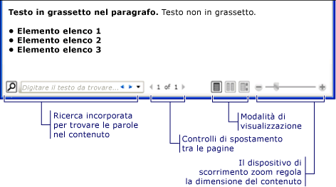
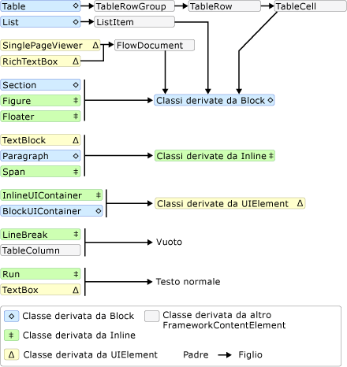
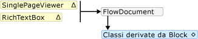
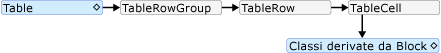
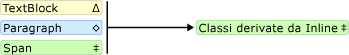

# Cenni preliminari sui documenti dinamici
I documenti dinamici sono stati progettati per ottimizzare la visualizzazione e la leggibilità.  Anziché essere impostati su un layout predefinito, questi documenti consentono di regolare e di far scorrere il contenuto in modo dinamico in base alle variabili in fase di esecuzione, ad esempio, le dimensioni della finestra, la risoluzione del dispositivo e le preferenze facoltative dell'utente.  Questi documenti offrono inoltre funzionalità avanzate del documento, quali paginazione e colonne.  In questo argomento vengono forniti i cenni preliminari sui documenti dinamici e su come crearli.  
  
   
  
   
## Definizione di documento dinamico  
 I documenti dinamici sono stati progettati per "adattare il flusso del contenuto" in base alle dimensioni della finestra, alla risoluzione del dispositivo e ad altre variabili di ambiente.  Tali documenti dispongono inoltre di numerose funzionalità incorporate tra cui la ricerca, le modalità di visualizzazione che ottimizzano la leggibilità e la possibilità di modificare le dimensioni e l'aspetto dei tipi di carattere.  I documenti dinamici sono meglio utilizzati quando la semplicità di lettura rappresenta lo scenario principale di utilizzo del documento.  I documenti statici, al contrario, sono stati progettati per avere una presentazione statica;  risultano utili quando la fedeltà del contenuto di origine è fondamentale.  Per ulteriori informazioni sui diversi tipi di documenti, vedere [Documenti in WPF](../../../../docs/framework/wpf/advanced/documents-in-wpf.md).  
  
 Nell'illustrazione riportata di seguito viene mostrato un documento dinamico di esempio visualizzato in molte finestre di dimensioni diverse.  Quando l'area di visualizzazione viene modificata, il contenuto adatta il flusso per un migliore utilizzo dello spazio disponibile.  
  
   
  
 Come mostrato nell'immagine precedente, il contenuto del flusso può contenere numerosi componenti, compresi i paragrafi, gli elenchi, le immagini, le tabelle e altro ancora.  Questi componenti corrispondono agli elementi nel markup e agli oggetti nel codice procedurale.  Queste classi verranno esaminate dettagliatamente più avanti nella sezione [Classi correlate al flusso](#flow_related_classes) di questi cenni preliminari.  Di seguito è riportato un semplice esempio di codice che crea un documento dinamico costituito da un paragrafo con del testo in grassetto e da un elenco.  
  
 [!code-xml[FlowOvwSnippets_snip#SimpleFlowExampleWholePage](../../../../samples/snippets/csharp/VS_Snippets_Wpf/FlowOvwSnippets_snip/CS/SimpleFlowExample.xaml#simpleflowexamplewholepage)]  
  
 [!code-csharp[FlowOvwSnippets_procedural_snip#SimpleFlowCodeOnlyExampleWholePage](../../../../samples/snippets/csharp/VS_Snippets_Wpf/FlowOvwSnippets_procedural_snip/CSharp/SimpleFlowExample.cs#simpleflowcodeonlyexamplewholepage)]
 [!code-vb[FlowOvwSnippets_procedural_snip#SimpleFlowCodeOnlyExampleWholePage](../../../../samples/snippets/visualbasic/VS_Snippets_Wpf/FlowOvwSnippets_procedural_snip/VisualBasic/SimpleFlowExample.vb#simpleflowcodeonlyexamplewholepage)]  
  
 Il frammento di codice sarà del tipo riportato nell'illustrazione indicata di seguito.  
  
   
  
 In questo esempio viene utilizzato il controllo <xref:System.Windows.Controls.FlowDocumentReader> per ospitare il contenuto del flusso.  Per ulteriori informazioni sui controlli che ospitano il contenuto del flusso vedere [Tipi di documenti dinamici](#flow_document_types).  Gli elementi <xref:System.Windows.Documents.Paragraph>, <xref:System.Windows.Documents.List>, <xref:System.Windows.Documents.ListItem> e <xref:System.Windows.Documents.Bold> sono utilizzati per controllare la formattazione del contenuto in base all'ordine nel markup.  L'elemento <xref:System.Windows.Documents.Bold>, ad esempio, si estende solo su parte del testo nel paragrafo; di conseguenza, solo parte del testo è in grassetto.  Se già utilizzato in precedenza, HTML risulterà familiare.  
  
 Come evidenziato nell'illustrazione sopra indicata, esistono numerose funzionalità incorporate nei documenti dinamici:  
  
-   Cerca: consente all'utente di eseguire ricerche full\-text di un intero documento.  
  
-   Modalità di visualizzazione: consente all'utente di selezionare la modalità di visualizzazione preferita, inclusa una modalità di visualizzazione a pagina singola \(una pagina per volta\), una modalità di visualizzazione a pagina doppia \(formato lettura libro\) e una modalità di visualizzazione a spostamento continuo \(infinito\).  Per ulteriori informazioni sulle modalità di visualizzazione, vedere <xref:System.Windows.Controls.FlowDocumentReaderViewingMode>.  
  
-   Controlli di navigazione tra le pagine: se la modalità di visualizzazione del documento utilizza le pagine, i controlli di navigazione tra le pagine includono un pulsante per passare alla pagina successiva \(freccia verso il basso\) o alla pagina precedente \( freccia verso l'alto\), così come indicatori del numero della pagina corrente e del numero totale di pagine.  Inoltre è possibile scorrere le pagine utilizzando i tasti di direzione della tastiera.  
  
-   Zoom: i controlli dello zoom consentono all'utente di aumentare o diminuire il livello dello zoom facendo clic sui pulsanti più o meno, rispettivamente.  I controlli dello zoom includono anche un dispositivo di scorrimento per regolare il livello dello zoom.  Per ulteriori informazioni, vedere <xref:System.Windows.Controls.FlowDocumentReader.Zoom%2A>.  
  
 Queste funzionalità possono essere modificate in base al controllo utilizzato per ospitare il contenuto del flusso.  I diversi controlli vengono descritti nella sezione seguente.  
  
   
## Tipi di documenti dinamici  
 La visualizzazione del contenuto del documento dinamico e la modalità di visualizzazione corrispondente dipendono dall'oggetto utilizzato per ospitare il contenuto del flusso.  Sono quattro i controlli che supportano la visualizzazione del contenuto del flusso: <xref:System.Windows.Controls.FlowDocumentReader>, <xref:System.Windows.Controls.FlowDocumentPageViewer>, <xref:System.Windows.Controls.RichTextBox> e <xref:System.Windows.Controls.FlowDocumentScrollViewer>.  Questi controlli vengono descritti brevemente di seguito.  
  
 **Nota: l'oggetto**  <xref:System.Windows.Documents.FlowDocument> è necessario per ospitare direttamente il contenuto del flusso in modo che tutti i controlli di visualizzazione utilizzino <xref:System.Windows.Documents.FlowDocument> per consentire l'hosting del contenuto del flusso.  
  
### Controllo FlowDocumentReader  
 <xref:System.Windows.Controls.FlowDocumentReader> include funzionalità che consentono all'utente di scegliere dinamicamente tra le varie modalità di visualizzazione, inclusa una modalità di visualizzazione a pagina singola \(una pagina per volta\), una modalità di visualizzazione a pagina doppia \(formato lettura libro\) e una modalità di visualizzazione a spostamento continuo \(infinito\).  Per ulteriori informazioni sulle modalità di visualizzazione, vedere <xref:System.Windows.Controls.FlowDocumentReaderViewingMode>.  Se la possibilità di passare dinamicamente da una modalità di visualizzazione all'altra non è necessaria, i controlli <xref:System.Windows.Controls.FlowDocumentPageViewer> e <xref:System.Windows.Controls.FlowDocumentScrollViewer> forniscono visualizzatori di contenuto del flusso più semplici che sono fissi a una modalità di visualizzazione particolare.  
  
### Controlli FlowDocumentPageViewer e FlowDocumentScrollViewer  
 Il controllo <xref:System.Windows.Controls.FlowDocumentPageViewer> visualizza il contenuto nella modalità di visualizzazione di una pagina alla volta mentre il controllo <xref:System.Windows.Controls.FlowDocumentScrollViewer> visualizza il contenuto nella modalità di scorrimento continuo.  <xref:System.Windows.Controls.FlowDocumentPageViewer> e <xref:System.Windows.Controls.FlowDocumentScrollViewer> rimangono fissi in una particolare modalità di visualizzazione.  Effettuare il confronto con il controllo <xref:System.Windows.Controls.FlowDocumentReader>, che include funzionalità che consentono all'utente di scegliere in modo dinamico tra le varie modalità di visualizzazione \(fornite dall'enumerazione <xref:System.Windows.Controls.FlowDocumentReaderViewingMode>\), a discapito di un utilizzo di risorse maggiore rispetto a <xref:System.Windows.Controls.FlowDocumentPageViewer> o <xref:System.Windows.Controls.FlowDocumentScrollViewer>.  
  
 Per impostazione predefinita, viene sempre visualizzata una barra di scorrimento verticale e diventa visibile una barra di scorrimento orizzontale, se necessario.  La UI predefinita dell'oggetto <xref:System.Windows.Controls.FlowDocumentScrollViewer> non include una barra degli strumenti; tuttavia, la proprietà <xref:System.Windows.Controls.FlowDocumentScrollViewer.IsToolBarVisible%2A> può essere utilizzata per attivare la barra degli strumenti incorporata.  
  
### RichTextBox  
 Utilizzare un oggetto <xref:System.Windows.Controls.RichTextBox> quando si desidera consentire all'utente di modificare il contenuto del flusso.  Se si desidera creare, ad esempio, un editor che consenta all'utente di modificare elementi come tabelle, formattazione di corsivo e grassetto e così via, utilizzare il controllo <xref:System.Windows.Controls.RichTextBox>.  Per ulteriori informazioni, vedere [Cenni generali sul controllo RichTextBox](../../../../docs/framework/wpf/controls/richtextbox-overview.md).  
  
 **Nota:** il comportamento del contenuto del flusso all'interno di <xref:System.Windows.Controls.RichTextBox> è leggermente diverso rispetto al comportamento del contenuto del flusso incluso in altri controlli.  Ad esempio, in un oggetto <xref:System.Windows.Controls.RichTextBox> non sono presenti colonne, pertanto non è previsto un comportamento di ridimensionamento automatico.  Inoltre, le funzionalità incorporate solite del contenuto del flusso quali la ricerca, la modalità di visualizzazione, la navigazione delle pagine e lo zoom non sono disponibili in un oggetto <xref:System.Windows.Controls.RichTextBox>.  
  
   
## Creazione di contenuto del flusso  
 Il contenuto del flusso può essere complesso, composto da vari elementi tra cui testo, immagini, tabelle e anche classi derivate <xref:System.Windows.UIElement> come i controlli.  Per comprendere la modalità di creazione di un contenuto del flusso complesso, i punti riportati di seguito sono fondamentali.  
  
-   **Classi correlate al flusso**: ogni classe utilizzata nel contenuto del flusso ha uno scopo specifico.  Inoltre, la relazione gerarchica tra le classi di flusso facilita la comprensione della modalità di utilizzo.  Ad esempio, le classi derivate dalla classe <xref:System.Windows.Documents.Block> vengono utilizzate per contenere altri oggetti mentre le classi derivate da <xref:System.Windows.Documents.Inline> contengono gli oggetti visualizzati.  
  
-   **Schema del contenuto**: un documento dinamico può richiedere un numero considerevole di elementi annidati.  Nello schema del contenuto vengono specificate le possibili relazioni padre\/figlio tra elementi.  
  
 Ognuna di queste aree verrà esaminata in maniera dettagliata nella sezioni seguenti.  
  
   
## Classi correlate al flusso  
 Nel diagramma riportato di seguito sono illustrati gli oggetti utilizzati più di frequente con il contenuto del flusso:  
  
   
  
 Ai fini del contenuto del flusso, esistono due categorie importanti:  
  
1.  **Classi derivate da Block**: definite anche "Elementi del contenuto di Block" o semplicemente "Elementi Block".  Gli elementi che ereditano dalla classe <xref:System.Windows.Documents.Block> possono essere utilizzati per raggruppare elementi in un'entità principale comune oppure applicare attributi comuni a un gruppo.  
  
2.  **Classi derivate da Inline**: definite anche "Elementi del contenuto di Inline" o semplicemente "Elementi Inline".  Gli elementi che ereditano da <xref:System.Windows.Documents.Inline> o sono contenuti in un elemento Block o in un altro elemento Inline.  Gli elementi Inline sono spesso utilizzati come contenitori diretti del contenuto che è sottoposto al rendering dello schermo.  Ad esempio, un oggetto <xref:System.Windows.Documents.Paragraph> \(elemento Block\) può contenere un oggetto <xref:System.Windows.Documents.Run> \(elemento Inline\) ma la classe <xref:System.Windows.Documents.Run> contiene in realtà il testo che è sottoposto al rendering dello schermo.  
  
 Ciascuna classe di queste due categorie è descritta brevemente di seguito.  
  
### Classi derivate da Block  
 **Paragraph**  
  
 <xref:System.Windows.Documents.Paragraph> è utilizzato solitamente per raggruppare il contenuto in un paragrafo.  L'utilizzo più semplice e più comune di Paragraph è creare un paragrafo di testo.  
  
 [!code-xml[FlowOvwSnippets_snip#ParagraphExampleWholePage](../../../../samples/snippets/csharp/VS_Snippets_Wpf/FlowOvwSnippets_snip/CS/ParagraphExample.xaml#paragraphexamplewholepage)]  
  
 [!code-csharp[FlowOvwSnippets_procedural_snip#ParagraphCodeOnlyExampleWholePage](../../../../samples/snippets/csharp/VS_Snippets_Wpf/FlowOvwSnippets_procedural_snip/CSharp/ParagraphExample.cs#paragraphcodeonlyexamplewholepage)]
 [!code-vb[FlowOvwSnippets_procedural_snip#ParagraphCodeOnlyExampleWholePage](../../../../samples/snippets/visualbasic/VS_Snippets_Wpf/FlowOvwSnippets_procedural_snip/VisualBasic/ParagraphExample.vb#paragraphcodeonlyexamplewholepage)]  
  
 È tuttavia possibile contenere anche altri elementi derivati da Inline come illustrato di seguito.  
  
 **Sezione**  
  
 <xref:System.Windows.Documents.Section> è utilizzata per contenere solo altri elementi derivati da <xref:System.Windows.Documents.Block>.  Non applica alcuna formattazione predefinita agli elementi in esso contenuti.  Tuttavia, tutti i valori di proprietà impostati su un oggetto <xref:System.Windows.Documents.Section> vengono applicati ai relativi elementi figlio.  Una sezione consente inoltre di effettuare iterazioni a livello di codice mediante la relativa raccolta figlio.  <xref:System.Windows.Documents.Section> è utilizzata in modo analogo al tag \<DIV\> in HTML.  
  
 Nell'esempio riportato di seguito, tre paragrafi sono definiti in <xref:System.Windows.Documents.Section>.  La sezione ha un valore della proprietà <xref:System.Windows.Documents.TextElement.Background%2A> equivalente a rosso, pertanto anche il colore dello sfondo dei paragrafi è rosso.  
  
 [!code-xml[FlowOvwSnippets_snip#SectionExampleWholePage](../../../../samples/snippets/csharp/VS_Snippets_Wpf/FlowOvwSnippets_snip/CS/SectionExample.xaml#sectionexamplewholepage)]  
  
 [!code-csharp[FlowOvwSnippets_procedural_snip#SectionCodeOnlyExampleWholePage](../../../../samples/snippets/csharp/VS_Snippets_Wpf/FlowOvwSnippets_procedural_snip/CSharp/SectionExample.cs#sectioncodeonlyexamplewholepage)]
 [!code-vb[FlowOvwSnippets_procedural_snip#SectionCodeOnlyExampleWholePage](../../../../samples/snippets/visualbasic/VS_Snippets_Wpf/FlowOvwSnippets_procedural_snip/VisualBasic/SectionExample.vb#sectioncodeonlyexamplewholepage)]  
  
 **BlockUIContainer**  
  
 <xref:System.Windows.Documents.BlockUIContainer> consente di incorporare gli elementi <xref:System.Windows.UIElement> \(ad esempio  <xref:System.Windows.Controls.Button>\) nel contenuto del flusso derivato da Block.  <xref:System.Windows.Documents.InlineUIContainer> \(vedere di seguito\) è utilizzata per incorporare gli elementi <xref:System.Windows.UIElement> nel contenuto del flusso derivato da Inline.  <xref:System.Windows.Documents.BlockUIContainer> e <xref:System.Windows.Documents.InlineUIContainer> sono importanti in quanto non esiste un altro modo per utilizzare un oggetto <xref:System.Windows.UIElement> nel contenuto del flusso a meno che non sia contenuto in uno di questi due elementi.  
  
 Nell'esempio riportato di seguito viene illustrato come utilizzare l'elemento <xref:System.Windows.Documents.BlockUIContainer> per ospitare gli oggetti <xref:System.Windows.UIElement> nel contenuto del flusso.  
  
 [!code-xml[SpanSnippets#_BlockUIXAML](../../../../samples/snippets/csharp/VS_Snippets_Wpf/SpanSnippets/CSharp/Window1.xaml#_blockuixaml)]  
  
 Nella figura riportata di seguito viene illustrato il rendering di questo esempio.  
  
   
  
 **Elenco**  
  
 <xref:System.Windows.Documents.List> è utilizzato per creare un elenco puntato o numerico.  Impostare la proprietà <xref:System.Windows.Documents.List.MarkerStyle%2A> su un valore di enumerazione <xref:System.Windows.TextMarkerStyle> per determinare lo stile dell'elenco.  Nell'esempio riportato di seguito viene illustrato come creare un elenco semplice.  
  
 [!code-xml[FlowOvwSnippets_snip#ListExampleWholePage](../../../../samples/snippets/csharp/VS_Snippets_Wpf/FlowOvwSnippets_snip/CS/ListExample.xaml#listexamplewholepage)]  
  
 [!code-csharp[FlowOvwSnippets_procedural_snip#ListCodeOnlyExampleWholePage](../../../../samples/snippets/csharp/VS_Snippets_Wpf/FlowOvwSnippets_procedural_snip/CSharp/ListExample.cs#listcodeonlyexamplewholepage)]
 [!code-vb[FlowOvwSnippets_procedural_snip#ListCodeOnlyExampleWholePage](../../../../samples/snippets/visualbasic/VS_Snippets_Wpf/FlowOvwSnippets_procedural_snip/VisualBasic/ListExample.vb#listcodeonlyexamplewholepage)]  
  
 **Nota:** <xref:System.Windows.Documents.List> è l'unico elemento del flusso che utilizza l'elemento <xref:System.Windows.Documents.ListItemCollection> per gestire gli elementi figlio.  
  
 **Tabella**  
  
 L'oggetto <xref:System.Windows.Documents.Table> è utilizzato per creare una tabella.  <xref:System.Windows.Documents.Table> è simile a <xref:System.Windows.Controls.Grid> ma offre maggiori funzionalità e, pertanto, richiede un sovraccarico di risorse maggiore.  Poiché <xref:System.Windows.Controls.Grid> è un oggetto <xref:System.Windows.UIElement>, non può essere utilizzato nel contenuto del flusso a meno che non sia contenuto in una classe <xref:System.Windows.Documents.BlockUIContainer> o <xref:System.Windows.Documents.InlineUIContainer>.  Per ulteriori informazioni su <xref:System.Windows.Documents.Table>, vedere [Cenni preliminari sull'elemento Table](../../../../docs/framework/wpf/advanced/table-overview.md).  
  
### Classi derivate da Inline  
 **Run**  
  
 <xref:System.Windows.Documents.Run> è utilizzata per contenere testo non formattato.  Si potrebbe presupporre che gli oggetti <xref:System.Windows.Documents.Run> vengano utilizzati ampiamente nel contenuto dinamico.  Tuttavia, nel markup non è necessario utilizzare in modo esplicito gli elementi <xref:System.Windows.Documents.Run>.  La classe <xref:System.Windows.Documents.Run> è obbligatoria quando si creano o modificano documenti dinamici mediante il codice.  Nel markup riportato di seguito, ad esempio, il primo <xref:System.Windows.Documents.Paragraph>, contrariamente al secondo, specifica l'elemento <xref:System.Windows.Documents.Run> in modo esplicito.  Entrambi i paragrafi generano output identici.  
  
 [!code-xml[FlowOvwSnippets_snip#RunExample1](../../../../samples/snippets/csharp/VS_Snippets_Wpf/FlowOvwSnippets_snip/CS/RunSnippetsExample.xaml#runexample1)]  
  
 **Nota:**  A partire da [!INCLUDE[net_v40_short](../../../../includes/net-v40-short-md.md)], la proprietà <xref:System.Windows.Documents.Run.Text%2A> dell'oggetto <xref:System.Windows.Documents.Run> è una proprietà di dipendenza.  È possibile creare l'associazione della proprietà <xref:System.Windows.Documents.Run.Text%2A> a un'origine dati, ad esempio <xref:System.Windows.Controls.TextBlock>.  La proprietà <xref:System.Windows.Documents.Run.Text%2A> supporta completamente l'associazione unidirezionale.  La proprietà <xref:System.Windows.Documents.Run.Text%2A> supporta anche l'associazione bidirezionale, a eccezione di <xref:System.Windows.Controls.RichTextBox>.  Per un esempio, vedere <xref:System.Windows.Documents.Run.Text%2A?displayProperty=fullName>.  
  
 **Span**  
  
 <xref:System.Windows.Documents.Span> raggruppa altri elementi di contenuto inline.  Nessun rendering inerente viene applicato al contenuto all'interno di un elemento <xref:System.Windows.Documents.Span>.  Tuttavia, gli elementi che ereditano dalla classe <xref:System.Windows.Documents.Span> inclusi <xref:System.Windows.Documents.Hyperlink>, <xref:System.Windows.Documents.Bold>, <xref:System.Windows.Documents.Italic> e <xref:System.Windows.Documents.Underline> applicano la formattazione al testo.  
  
 Di seguito è riportato un esempio di utilizzo di <xref:System.Windows.Documents.Span> per contenere il contenuto Inline comprendente del testo, un elemento <xref:System.Windows.Documents.Bold> e un elemento <xref:System.Windows.Controls.Button>.  
  
 [!code-xml[FlowOvwSnippets_snip#SpanExampleWholePage](../../../../samples/snippets/csharp/VS_Snippets_Wpf/FlowOvwSnippets_snip/CS/SpanExample.xaml#spanexamplewholepage)]  
  
 Nella schermata riportata di seguito viene illustrato il rendering di questo esempio.  
  
   
  
 **InlineUIContainer**  
  
 <xref:System.Windows.Documents.InlineUIContainer> consente di incorporare gli elementi <xref:System.Windows.UIElement> \(ad esempio  un controllo come <xref:System.Windows.Controls.Button>\) in un elemento di contenuto <xref:System.Windows.Documents.Inline>.  Questo elemento è l'equivalente in linea dell'oggetto <xref:System.Windows.Documents.BlockUIContainer> descritto in precedenza.  Nell'esempio riportato di seguito, l'elemento <xref:System.Windows.Documents.InlineUIContainer> viene utilizzato per inserire un elemento in linea <xref:System.Windows.Controls.Button> in un oggetto <xref:System.Windows.Documents.Paragraph>.  
  
 [!code-xml[FlowOvwSnippets_snip#InlineUIContainerExampleWholePage](../../../../samples/snippets/csharp/VS_Snippets_Wpf/FlowOvwSnippets_snip/CS/InlineUIContainerExample.xaml#inlineuicontainerexamplewholepage)]  
  
 [!code-csharp[FlowOvwSnippets_procedural_snip#InlineUIContainerCodeOnlyExampleWholePage](../../../../samples/snippets/csharp/VS_Snippets_Wpf/FlowOvwSnippets_procedural_snip/CSharp/InlineUIContainerExample.cs#inlineuicontainercodeonlyexamplewholepage)]
 [!code-vb[FlowOvwSnippets_procedural_snip#InlineUIContainerCodeOnlyExampleWholePage](../../../../samples/snippets/visualbasic/VS_Snippets_Wpf/FlowOvwSnippets_procedural_snip/VisualBasic/InlineUIContainerExample.vb#inlineuicontainercodeonlyexamplewholepage)]  
  
 **Nota:** <xref:System.Windows.Documents.InlineUIContainer> non deve essere utilizzato in modo esplicito nel markup.  Se viene omesso, verrà creato un elemento <xref:System.Windows.Documents.InlineUIContainer> in ogni caso quando viene compilato il codice.  
  
 **Figure e Floater**  
  
 <xref:System.Windows.Documents.Figure> e <xref:System.Windows.Documents.Floater> sono utilizzati per incorporare del contenuto nei documenti dinamici con proprietà di posizionamento che possono essere personalizzate senza tenere conto del flusso di contenuto principale.  Gli elementi <xref:System.Windows.Documents.Figure> o <xref:System.Windows.Documents.Floater> sono spesso utilizzati per evidenziare o accentuare parti di contenuto, per ospitare immagini di supporto o altri contenuti all'interno del flusso di contenuto principale, oppure per aggiungere un contenuto che non sia strettamente correlato, ad esempio gli annunci pubblicitari.  
  
 Nell'esempio riportato di seguito viene illustrato come incorporare un elemento <xref:System.Windows.Documents.Figure> in un paragrafo di testo.  
  
 [!code-xml[FlowOvwSnippets_snip#FigureExampleWholePage](../../../../samples/snippets/csharp/VS_Snippets_Wpf/FlowOvwSnippets_snip/CS/FigureExample.xaml#figureexamplewholepage)]  
  
 [!code-csharp[FlowOvwSnippets_procedural_snip#FigureCodeOnlyExampleWholePage](../../../../samples/snippets/csharp/VS_Snippets_Wpf/FlowOvwSnippets_procedural_snip/CSharp/FigureExample.cs#figurecodeonlyexamplewholepage)]
 [!code-vb[FlowOvwSnippets_procedural_snip#FigureCodeOnlyExampleWholePage](../../../../samples/snippets/visualbasic/VS_Snippets_Wpf/FlowOvwSnippets_procedural_snip/VisualBasic/FigureExample.vb#figurecodeonlyexamplewholepage)]  
  
 L'illustrazione seguente mostra come viene eseguito il rendering di questo esempio.  
  
   
  
 <xref:System.Windows.Documents.Figure> e <xref:System.Windows.Documents.Floater> sono per molti aspetti diversi e vengono utilizzati per scenari differenti.  
  
 **Figura:**  
  
-   Può essere posizionata: è possibile impostarne gli ancoraggi orizzontali e verticali per ancorarla in relazione alla pagina, al contenuto, alla colonna o al paragrafo.  È anche possibile utilizzare le proprietà <xref:System.Windows.Documents.Figure.HorizontalOffset%2A> e <xref:System.Windows.Documents.Figure.VerticalOffset%2A> per specificare offset arbitrari.  
  
-   È ridimensionabile a più di una colonna: è possibile impostare l'altezza e la larghezza di <xref:System.Windows.Documents.Figure> su multipli dell'altezza e della larghezza della pagina, del contenuto o della colonna.  Nel caso della pagina e del contenuto, i multipli superiori a 1 non sono consentiti.  Ad esempio, è possibile impostare la larghezza di un oggetto <xref:System.Windows.Documents.Figure> come "0,5 pagina", "0,25 contenuto" o "2 colonna".  È anche possibile impostare l'altezza e la larghezza su valori di pixel assoluti.  
  
-   Non esegue alcuna impaginazione: se il contenuto di un oggetto <xref:System.Windows.Documents.Figure> non rientra perfettamente in <xref:System.Windows.Documents.Figure>, questo eseguirà il rendering della parte di contenuto rientrante al suo interno e il resto del contenuto andrà perso.  
  
 **Floater:**  
  
-   Non può essere posizionato ed esegue il rendering ovunque vi sia uno spazio a disposizione.  Non è possibile ancorare né impostare l'offset di un oggetto <xref:System.Windows.Documents.Floater>.  
  
-   Non può essere ridimensionato a più di una colonna: per impostazione predefinita, <xref:System.Windows.Documents.Floater> viene dimensionato a una colonna.  Possiede una proprietà <xref:System.Windows.Documents.Floater.Width%2A> che può essere impostata su un valore di pixel assoluto, ma se questo valore è superiore alla larghezza di una colonna allora viene ignorato e il floater viene dimensionato a una colonna.  È possibile ridimensionarlo a una larghezza inferiore a una colonna impostando la larghezza corretta in pixel; tuttavia, poiché il ridimensionamento non è relativo alla colonna, "0,5 colonna" non è un'espressione valida per la larghezza di <xref:System.Windows.Documents.Floater>.  <xref:System.Windows.Documents.Floater> non possiede alcuna proprietà di altezza, la quale non può essere impostata e dipende dal contenuto.  
  
-   <xref:System.Windows.Documents.Floater> esegue l'impaginazione: se il contenuto nella larghezza specificata si estende per un'altezza superiore a 1 colonna, il floater spezza il contenuto e lo impagina nella colonna o pagina successiva.  
  
 <xref:System.Windows.Documents.Figure> è l'oggetto ideale nel quale inserire un contenuto autonomo di cui si desidera controllare le dimensioni e il posizionamento, essendo certi che tale contenuto rientrerà nelle dimensioni specificate.  <xref:System.Windows.Documents.Floater> è l'oggetto ideale nel quale inserire un contenuto più dinamico che scorre in modo analogo al contenuto della pagina principale, dal quale però resta separato.  
  
 **LineBreak**  
  
 <xref:System.Windows.Documents.LineBreak> determina un'interruzione di riga nel contenuto del flusso.  Nell'esempio seguente viene illustrato l'utilizzo di <xref:System.Windows.Documents.LineBreak>.  
  
 [!code-xml[FlowOvwSnippets_snip#LineBreakExampleWholePage](../../../../samples/snippets/csharp/VS_Snippets_Wpf/FlowOvwSnippets_snip/CS/LineBreakExample.xaml#linebreakexamplewholepage)]  
  
 Nella schermata riportata di seguito viene illustrato il rendering di questo esempio.  
  
   
  
### Elementi della raccolta di flusso  
 In molti degli esempi precedenti, <xref:System.Windows.Documents.BlockCollection> e <xref:System.Windows.Documents.InlineCollection> sono utilizzati per costruire il contenuto del flusso a livello di codice.  Ad esempio, per aggiungere un oggetto <xref:System.Windows.Documents.Paragraph>, utilizzare la sintassi:  
  
 `…`  
  
 `myParagraph.Inlines.Add(new Run("Some text"));`  
  
 `…`  
  
 In questo modo <xref:System.Windows.Documents.Run> viene aggiunto all'oggetto <xref:System.Windows.Documents.InlineCollection> dell'elemento <xref:System.Windows.Documents.Paragraph>.  Si ottiene lo stesso risultato dell'oggetto <xref:System.Windows.Documents.Run> implicito trovato all'interno di un elemento <xref:System.Windows.Documents.Paragraph> nel markup:  
  
 `…`  
  
 `<Paragraph>`  
  
 `Some Text`  
  
 `</Paragraph>`  
  
 `…`  
  
 Come esempio di utilizzo di <xref:System.Windows.Documents.BlockCollection>, nell'esempio riportato di seguito viene creato un nuovo oggetto <xref:System.Windows.Documents.Section> e viene utilizzato il metodo **Add** per aggiungere un nuovo elemento <xref:System.Windows.Documents.Paragraph> ai contenuti <xref:System.Windows.Documents.Section>.  
  
 [!code-csharp[FlowDocumentSnippets#_SectionBlocksAdd](../../../../samples/snippets/csharp/VS_Snippets_Wpf/FlowDocumentSnippets/CSharp/Window1.xaml.cs#_sectionblocksadd)]
 [!code-vb[FlowDocumentSnippets#_SectionBlocksAdd](../../../../samples/snippets/visualbasic/VS_Snippets_Wpf/FlowDocumentSnippets/visualbasic/window1.xaml.vb#_sectionblocksadd)]  
  
 Oltre ad aggiungere elementi a una raccolta di flusso, è anche possibile rimuoverli.  Nell'esempio riportato di seguito viene eliminato l'ultimo elemento <xref:System.Windows.Documents.Inline> di <xref:System.Windows.Documents.Span>.  
  
 [!code-csharp[SpanSnippets#_SpanInlinesRemoveLast](../../../../samples/snippets/csharp/VS_Snippets_Wpf/SpanSnippets/CSharp/Window1.xaml.cs#_spaninlinesremovelast)]
 [!code-vb[SpanSnippets#_SpanInlinesRemoveLast](../../../../samples/snippets/visualbasic/VS_Snippets_Wpf/SpanSnippets/visualbasic/window1.xaml.vb#_spaninlinesremovelast)]  
  
 Nell'esempio riportato di seguito viene cancellato tutto il contenuto \(gli elementi <xref:System.Windows.Documents.Inline>\) dall'oggetto <xref:System.Windows.Documents.Span>.  
  
 [!code-csharp[SpanSnippets#_SpanInlinesClear](../../../../samples/snippets/csharp/VS_Snippets_Wpf/SpanSnippets/CSharp/Window1.xaml.cs#_spaninlinesclear)]
 [!code-vb[SpanSnippets#_SpanInlinesClear](../../../../samples/snippets/visualbasic/VS_Snippets_Wpf/SpanSnippets/visualbasic/window1.xaml.vb#_spaninlinesclear)]  
  
 Quando si utilizza il contenuto del flusso a livello di codice, l'utilizzo di queste raccolte sarà diffuso.  
  
 L'utilizzo di un oggetto <xref:System.Windows.Documents.InlineCollection> \(Inline\) o <xref:System.Windows.Documents.BlockCollection> \(Block\) per contenere gli elementi figlio da parte di un elemento di flusso dipende dal tipo di elementi figlio \(<xref:System.Windows.Documents.Block> o <xref:System.Windows.Documents.Inline>\) contenuto dal padre.  Le regole di contenimento per gli elementi di contenuto di flusso sono riepilogate nello schema di contenuto nella sezione seguente.  
  
 **Nota:** esiste un terzo tipo di raccolta utilizzato con il contenuto di flusso, <xref:System.Windows.Documents.ListItemCollection>, ma questa raccolta viene utilizzata solo con un oggetto <xref:System.Windows.Documents.List>.  Inoltre esistono numerose raccolte utilizzate con <xref:System.Windows.Documents.Table>.  Per ulteriori informazioni, vedere [Cenni preliminari sull'elemento Table](../../../../docs/framework/wpf/advanced/table-overview.md).  
  
   
## Schema del contenuto  
 Dato il numero di elementi differenti di contenuto del flusso, può essere dominante per tenere traccia del tipo di elementi figli contenuto da un elemento.  Nel diagramma riportato di seguito sono riepilogate le regole di contenimento per gli elementi di flusso.  Le frecce rappresentano le possibili relazioni padre\/figlio.  
  
   
  
 Come è possibile osservare dal diagramma precedente, gli elementi figlio consentiti per un elemento non vengono necessariamente determinati in base a un elemento <xref:System.Windows.Documents.Block> o a un elemento <xref:System.Windows.Documents.Inline>.  Ad esempio, un oggetto <xref:System.Windows.Documents.Span> \(un elemento <xref:System.Windows.Documents.Inline>\) può possedere solo elementi figlio <xref:System.Windows.Documents.Inline> mentre un oggetto <xref:System.Windows.Documents.Figure> \(anche un elemento <xref:System.Windows.Documents.Inline>\) può possedere solo elementi figlio <xref:System.Windows.Documents.Block>.  Pertanto, un diagramma è utile a determinare rapidamente quale elemento può essere contenuto in un altro elemento.  Ad esempio, è possibile utilizzare il diagramma per determinare la modalità di costruzione del contenuto di flusso di un oggetto <xref:System.Windows.Controls.RichTextBox>.  
  
 **1.** Un oggetto <xref:System.Windows.Controls.RichTextBox> deve contenere un oggetto <xref:System.Windows.Documents.FlowDocument> che a sua volta deve includere un oggetto derivato da <xref:System.Windows.Documents.Block>.  Di seguito viene riportato il corrispondente segmento del diagramma precedente.  
  
   
  
 Pertanto, l'aspetto del markup potrebbe essere quello visualizzato di seguito.  
  
 [!code-xml[FlowOvwSnippets_snip#SchemaWalkThrough1](../../../../samples/snippets/csharp/VS_Snippets_Wpf/FlowOvwSnippets_snip/CS/MiscSnippets.xaml#schemawalkthrough1)]  
  
 **2.** In base al diagramma, è possibile scegliere tra diversi elementi <xref:System.Windows.Documents.Block>, inclusi <xref:System.Windows.Documents.Paragraph>, <xref:System.Windows.Documents.Section>, <xref:System.Windows.Documents.Table>, <xref:System.Windows.Documents.List> e <xref:System.Windows.Documents.BlockUIContainer> \(vedere le classi derivate da Block sopra riportate\).  Si supponga ad esempio di cercare un oggetto <xref:System.Windows.Documents.Table>.  In base al diagramma precedente, un oggetto <xref:System.Windows.Documents.Table> contiene un oggetto <xref:System.Windows.Documents.TableRowGroup> che include a sua volta elementi <xref:System.Windows.Documents.TableRow>, che contengono elementi <xref:System.Windows.Documents.TableCell> che includono infine un oggetto derivato da <xref:System.Windows.Documents.Block>.  Di seguito viene riportato il segmento corrispondente relativo a <xref:System.Windows.Documents.Table>, tratto dal diagramma precedente.  
  
   
  
 Di seguito il markup corrispondente.  
  
 [!code-xml[FlowOvwSnippets_snip#SchemaWalkThrough2](../../../../samples/snippets/csharp/VS_Snippets_Wpf/FlowOvwSnippets_snip/CS/MiscSnippets.xaml#schemawalkthrough2)]  
  
 **3.** Anche in questo caso, uno o più elementi <xref:System.Windows.Documents.Block> devono essere presenti in un oggetto <xref:System.Windows.Documents.TableCell>.  Per rendere più evidente l'esempio, viene inserito del testo nella cella.  A tal fine, si utilizza un oggetto <xref:System.Windows.Documents.Paragraph> con un elemento <xref:System.Windows.Documents.Run>.  Di seguito vengono riportati i segmenti corrispondenti del diagramma, che indicano che un oggetto <xref:System.Windows.Documents.Paragraph> può accettare un elemento <xref:System.Windows.Documents.Inline> e che un oggetto <xref:System.Windows.Documents.Run> \(un elemento <xref:System.Windows.Documents.Inline>\) può accettare solo il testo normale.  
  
   
  
   
  
 Di seguito viene mostrato l'intero esempio a livello di markup.  
  
 [!code-xml[FlowOvwSnippets_snip#SchemaExampleWholePage](../../../../samples/snippets/csharp/VS_Snippets_Wpf/FlowOvwSnippets_snip/CS/SchemaExample.xaml#schemaexamplewholepage)]  
  
   
## Personalizzazione del testo  
 In genere il testo è il tipo di contenuto più diffuso in un documento dinamico.  Sebbene gli oggetti illustrati in precedenza possano essere utilizzati per controllare molti aspetti della modalità di esecuzione del rendering del testo, esistono alcuni altri metodi per la personalizzazione del testo descritti in questa sezione.  
  
### Decorazioni di testo  
 Le decorazioni di testo consentono di applicare gli effetti sottolineato, linea sopra, linea di base e barrato al testo \(vedere le immagini riportate di seguito\).  Queste decorazioni vengono aggiunte mediante la proprietà <xref:System.Windows.Documents.Inline.TextDecorations%2A> esposta da un numero di oggetti comprendenti <xref:System.Windows.Documents.Inline>, <xref:System.Windows.Documents.Paragraph>, <xref:System.Windows.Controls.TextBlock>e <xref:System.Windows.Controls.TextBox>.  
  
 Nell'esempio riportato di seguito viene illustrato come impostare la proprietà <xref:System.Windows.Documents.Paragraph.TextDecorations%2A> di un oggetto <xref:System.Windows.Documents.Paragraph>.  
  
 [!code-xml[InlineSnippets#_Paragraph_TextDecXAML](../../../../samples/snippets/csharp/VS_Snippets_Wpf/InlineSnippets/CSharp/Window1.xaml#_paragraph_textdecxaml)]  
  
 [!code-csharp[InlineSnippets#_Paragraph_TextDec](../../../../samples/snippets/csharp/VS_Snippets_Wpf/InlineSnippets/CSharp/Window1.xaml.cs#_paragraph_textdec)]
 [!code-vb[InlineSnippets#_Paragraph_TextDec](../../../../samples/snippets/visualbasic/VS_Snippets_Wpf/InlineSnippets/visualbasic/window1.xaml.vb#_paragraph_textdec)]  
  
 Nella figura riportata di seguito viene illustrato il rendering di questo esempio.  
  
   
  
 Le figure seguenti mostrano come viene eseguito il rendering rispettivamente delle decorazioni **Linea sopra**, **Linea di base** e **Sottolineato**.  
  
   
  
   
  
   
  
### Opzioni tipografiche  
 La proprietà <xref:System.Windows.Documents.TextElement.Typography%2A> è esposta da gran parte del contenuto correlato al flusso inclusi <xref:System.Windows.Documents.TextElement>, <xref:System.Windows.Documents.FlowDocument>, <xref:System.Windows.Controls.TextBlock> e <xref:System.Windows.Controls.TextBox>.  Questa proprietà è utilizzata per controllare le caratteristiche o le variazioni tipografiche del testo \(ad esempio  maiuscoletto o maiuscolo, pedici e sottoscrizioni, ecc.\).  
  
 Nell'esempio riportato di seguito viene illustrato come impostare l'attributo <xref:System.Windows.Documents.TextElement.Typography%2A>, utilizzando <xref:System.Windows.Documents.Paragraph> come elemento di esempio.  
  
 [!code-xml[TextElementSnippets#_TextElement_TypogXAML](../../../../samples/snippets/csharp/VS_Snippets_Wpf/TextElementSnippets/CSharp/Window1.xaml#_textelement_typogxaml)]  
  
 Nella figura riportata di seguito viene illustrato il rendering di questo esempio.  
  
   
  
 Per contro, la figura seguente mostra come viene eseguito il rendering di tale esempio con le proprietà tipografiche predefinite.  
  
   
  
 Nell'esempio riportato di seguito viene illustrato come impostare la proprietà <xref:System.Windows.Controls.TextBox.Typography%2A> a livello di codice.  
  
 [!code-csharp[TextElementSnippets#_TextElement_Typog](../../../../samples/snippets/csharp/VS_Snippets_Wpf/TextElementSnippets/CSharp/Window1.xaml.cs#_textelement_typog)]
 [!code-vb[TextElementSnippets#_TextElement_Typog](../../../../samples/snippets/visualbasic/VS_Snippets_Wpf/TextElementSnippets/visualbasic/window1.xaml.vb#_textelement_typog)]  
  
 Per ulteriori informazioni sulla tipografia, vedere [Funzionalità tipografiche di WPF](../../../../docs/framework/wpf/advanced/typography-in-wpf.md).  
  
## Vedere anche  
 [Text](../../../../docs/framework/wpf/advanced/optimizing-performance-text.md)   
 [Funzionalità tipografiche di WPF](../../../../docs/framework/wpf/advanced/typography-in-wpf.md)   
 [Procedure relative](../../../../docs/framework/wpf/advanced/flow-content-elements-how-to-topics.md)   
 [Cenni preliminari sul modello di contenuto TextElement](../../../../docs/framework/wpf/advanced/textelement-content-model-overview.md)   
 [Cenni generali sul controllo RichTextBox](../../../../docs/framework/wpf/controls/richtextbox-overview.md)   
 [Documenti in WPF](../../../../docs/framework/wpf/advanced/documents-in-wpf.md)   
 [Cenni preliminari sull'elemento Table](../../../../docs/framework/wpf/advanced/table-overview.md)   
 [Cenni preliminari sulle annotazioni](../../../../docs/framework/wpf/advanced/annotations-overview.md)