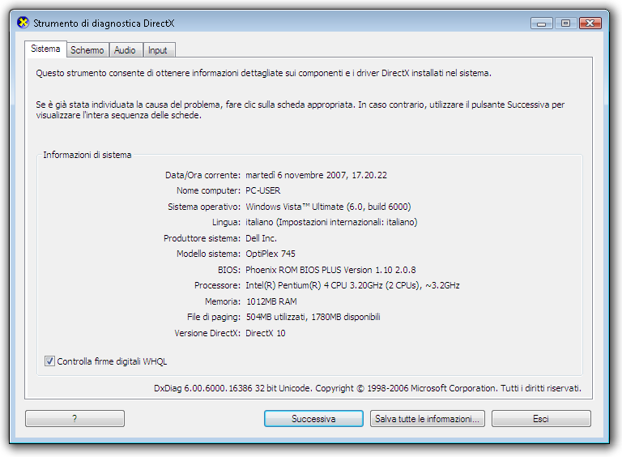

# Livelli di rendering della grafica
Un livello di rendering definisce un livello di funzionalità e prestazioni dell'hardware grafico per un dispositivo che esegue un'applicazione [!INCLUDE[TLA2#tla_winclient](../../../../includes/tla2sharptla-winclient-md.md)].  
  
   
  
   
## Hardware grafico  
 Di seguito sono riportate le funzionalità dell'hardware grafico che influiscono maggiormente sui livelli di rendering:  
  
-   **RAM video**: la quantità di memoria video disponibile nell'hardware grafico determina le dimensioni e il numero di buffer che possono essere utilizzati per la composizione della grafica.  
  
-   **Pixel shader**: un pixel shader è una funzione di elaborazione grafica che calcola gli effetti per singolo pixel.  A seconda della risoluzione della grafica visualizzata, può essere necessario elaborare milioni di pixel per ogni fotogramma di visualizzazione.  
  
-   **Vertex shader**: un vertex shader è una funzione di elaborazione grafica che esegue operazioni matematiche sui dati vertex dell'oggetto.  
  
-   **Supporto multitrama**: il supporto multitrama fa riferimento alla possibilità di applicare due o più trame distinte durante un'operazione di sfumatura su un oggetto di grafica tridimensionale.  Il grado del supporto multitrama è determinato dal numero di unità multitrama dell'hardware grafico.  
  
   
## Definizioni dei livelli di rendering  
 Le funzionalità dell'hardware grafico determinano la capacità di rendering di un'applicazione [!INCLUDE[TLA2#tla_winclient](../../../../includes/tla2sharptla-winclient-md.md)].  Nel sistema [!INCLUDE[TLA2#tla_winclient](../../../../includes/tla2sharptla-winclient-md.md)] vengono definiti tre livelli di rendering:  
  
-   **Livello di rendering 0**: nessuna accelerazione dell'hardware grafico.  Tutte le funzionalità grafiche utilizzano l'accelerazione software.  Il livello di versione di [!INCLUDE[TLA2#tla_dx](../../../../includes/tla2sharptla-dx-md.md)] è inferiore alla versione 9.0.  
  
-   **Livello di rendering 1**: alcune funzionalità grafiche utilizzano l'accelerazione dell'hardware grafico.  Il livello di versione di [!INCLUDE[TLA2#tla_dx](../../../../includes/tla2sharptla-dx-md.md)] è superiore o uguale rispetto alla versione 9.0.  
  
-   **Livello di rendering 2**: la maggior parte delle funzionalità grafiche utilizzano l'accelerazione dell'hardware grafico.  Il livello di versione di [!INCLUDE[TLA2#tla_dx](../../../../includes/tla2sharptla-dx-md.md)] è superiore o uguale rispetto alla versione 9.0.  
  
 La proprietà <xref:System.Windows.Media.RenderCapability.Tier%2A?displayProperty=fullName> consente di recuperare il livello di rendering in fase di esecuzione dell'applicazione.  Utilizzare il livello di rendering per determinare se il dispositivo supporta determinate funzionalità grafiche con accelerazione hardware.  L'applicazione può accettare quindi, in fase di esecuzione, diversi percorsi di codice a seconda del livello di rendering supportato dal dispositivo.  
  
### Livello di rendering 0  
 Il livello di rendering 0 indica nessuna accelerazione dell'hardware grafico per l'applicazione nel dispositivo.  A questo livello, presupporre che il rendering della grafica verrà eseguito tramite software senza accelerazione hardware.  La funzionalità di questo livello corrisponde a una versione di [!INCLUDE[TLA2#tla_dx](../../../../includes/tla2sharptla-dx-md.md)] precedente alla 9.0.  
  
### Livelli di rendering 1 e 2  
  
> [!NOTE]
>  A partire da .NET Framework 4, il livello di rendering 1 è stato ridefinito in modo che inclusa solo l'hardware grafico che supporta [!INCLUDE[TLA2#tla_dx](../../../../includes/tla2sharptla-dx-md.md)] 9.0 o versione successiva.  L'hardware grafico che supporta [!INCLUDE[TLA2#tla_dx](../../../../includes/tla2sharptla-dx-md.md)] 7 o 8 è ora definito come livello di rendering 0.  
  
 Un livello di rendering pari a 1 o 2 indica che la maggior parte delle funzionalità grafiche di [!INCLUDE[TLA2#tla_winclient](../../../../includes/tla2sharptla-winclient-md.md)] utilizzeranno l'accelerazione hardware se le risorse di sistema necessarie sono disponibili e non sono esaurite.  Corrisponde a una versione di [!INCLUDE[TLA2#tla_dx](../../../../includes/tla2sharptla-dx-md.md)] successiva o uguale a 9.0.  
  
 Nella tabella seguente sono illustrate le differenze nei requisiti hardware grafici per i livelli di rendering 1 e 2:  
  
|Funzionalità|Livello 1|Livello 2|  
|------------------|---------------|---------------|  
|Versione di [!INCLUDE[TLA2#tla_dx](../../../../includes/tla2sharptla-dx-md.md)]|Versione 9.0 o successive.|Versione 9.0 o successive.|  
|RAM video|Deve essere maggiore o uguale a 60 MB.|120 MB o superiore.|  
|Pixel shader|La versione deve essere successiva o uguale alla 2.0.|La versione deve essere successiva o uguale alla 2.0.|  
|Vertex shader|Nessun requisito.|La versione deve essere successiva o uguale alla 2.0.|  
|Unità multitrama|Nessun requisito.|Il numero di unità deve essere maggiore o uguale a 4.|  
  
 Le funzionalità riportate di seguito dispongono dell'accelerazione hardware per i livelli di rendering 1 e 2:  
  
|Funzionalità|Note|  
|------------------|----------|  
|Rendering 2D|È supportata la maggior parte del rendering 2D.|  
|Rasterizzazione 3D|È supportata la maggior parte della rasterizzazione 3D.|  
|Filtro anisotropico 3D|[!INCLUDE[TLA2#tla_winclient](../../../../includes/tla2sharptla-winclient-md.md)] tenta di utilizzare il filtro anisotropico per il rendering del contenuto 3D.  Il filtro anisotropico fa rifermento al miglioramento della qualità dell'immagine di trame su superfici lontane e molto angolate rispetto alla fotocamera.|  
|Mapping MIP 3D|[!INCLUDE[TLA2#tla_winclient](../../../../includes/tla2sharptla-winclient-md.md)] tenta di utilizzare il mapping MIP quando per eseguire il rendering di contenuto 3D. Il mapping MIP migliora la qualità del rendering della trama quando una trama occupa un campo visivo più ridotto in un oggetto <xref:System.Windows.Controls.Viewport3D>.|  
|Sfumature radiali|Sebbene supportato, evitare l'utilizzo dell'oggetto <xref:System.Windows.Media.RadialGradientBrush> su oggetti di grandi dimensioni.|  
|Calcoli dell'illuminazione 3D|In [!INCLUDE[TLA2#tla_winclient](../../../../includes/tla2sharptla-winclient-md.md)] l'illuminazione viene calcolata per ogni vertice, ovvero viene calcolata un'intensità della luce per ogni vertice e per ogni materiale applicato a una mesh.|  
|Rendering del testo|Il rendering dei caratteri basato sulla tecnologia dei subpixel utilizza i pixel shader disponibili nell'hardware grafico.|  
  
 Le funzionalità riportate di seguito dispongono dell'accelerazione hardware solo per il livello di rendering 2:  
  
|Funzionalità|Note|  
|------------------|----------|  
|Anti\-aliasing 3D|Anti\-aliasing 3D è supportato solo nei sistemi operativi che supportano WDDM \(Windows Display Driver Model\), ad esempio [!INCLUDE[TLA2#tla_winvista](../../../../includes/tla2sharptla-winvista-md.md)] e [!INCLUDE[win7](../../../../includes/win7-md.md)].|  
  
 Le funzionalità riportate di seguito **non** dispongono dell'accelerazione hardware:  
  
|Funzionalità|Note|  
|------------------|----------|  
|Contenuto stampato|Il rendering del contenuto stampato viene eseguito tramite la pipeline software di [!INCLUDE[TLA2#tla_winclient](../../../../includes/tla2sharptla-winclient-md.md)].|  
|Contenuto rasterizzato che utilizza <xref:System.Windows.Media.Imaging.RenderTargetBitmap>|Qualsiasi contenuto il cui rendering viene eseguito tramite il metodo <xref:System.Windows.Media.Imaging.RenderTargetBitmap.Render%2A> dell'oggetto <xref:System.Windows.Media.Imaging.RenderTargetBitmap>.|  
|Contenuto affiancato che utilizza l'oggetto <xref:System.Windows.Media.TileBrush>|Qualsiasi contenuto affiancato in cui la proprietà <xref:System.Windows.Media.TileBrush.TileMode%2A> dell'oggetto <xref:System.Windows.Media.TileBrush> è impostata su <xref:System.Windows.Media.TileMode>.|  
|Superfici che superano la dimensione massima della trama dell'hardware grafico|Per la maggior parte dell'hardware grafico, le grandi superfici presentano dimensioni pari a 2048 x 2048 o 4096 x 4096 pixel.|  
|Qualsiasi operazione i cui requisiti RAM video superano la memoria dell'hardware grafico|È possibile monitorare l'utilizzo della RAM video dell'applicazione tramite lo strumento Perforator incluso nella [Famiglia di prodotti per l'analisi delle prestazioni WPF](../Topic/WPF%20Performance%20Suite.md) in Windows SDK.|  
|Finestre sovrapposte|Le finestre sovrapposte consentono alle applicazioni [!INCLUDE[TLA2#tla_winclient](../../../../includes/tla2sharptla-winclient-md.md)] di eseguire il rendering del contenuto sullo schermo in una finestra non rettangolare.  Nei sistemi operativi che supportano WDDM \(Windows Display Driver Model\), quali [!INCLUDE[TLA2#tla_winvista](../../../../includes/tla2sharptla-winvista-md.md)] e [!INCLUDE[win7](../../../../includes/win7-md.md)], le finestre sovrapposti dispongono di accelerazione hardware.  In altri sistemi, ad esempio [!INCLUDE[winxp](../../../../includes/winxp-md.md)], il rendering delle finestre sovrapposte viene eseguito tramite software senza accelerazione hardware.   È possibile abilitare le finestre sovrapposte in [!INCLUDE[TLA2#tla_winclient](../../../../includes/tla2sharptla-winclient-md.md)] impostando le proprietà dell'oggetto <xref:System.Windows.Window> indicate di seguito:   -   <xref:System.Windows.Window.WindowStyle%2A> \= <xref:System.Windows.WindowStyle> -   <xref:System.Windows.Window.AllowsTransparency%2A> \= `true` -   <xref:System.Windows.Controls.Control.Background%2A> \= <xref:System.Windows.Media.Brushes.Transparent%2A>|  
  
   
## Altre risorse  
 Le risorse elencate di seguito possono essere utili per l'analisi delle caratteristiche di prestazione dell'applicazione [!INCLUDE[TLA2#tla_winclient](../../../../includes/tla2sharptla-winclient-md.md)].  
  
### Impostazioni del Registro di sistema per il rendering della grafica  
 In [!INCLUDE[TLA2#tla_winclient](../../../../includes/tla2sharptla-winclient-md.md)] sono disponibili quattro impostazioni del Registro di sistema per il controllo del rendering in [!INCLUDE[TLA2#tla_winclient](../../../../includes/tla2sharptla-winclient-md.md)]:  
  
|Impostazione|Descrizione|  
|------------------|-----------------|  
|**Opzione Disabilita accelerazione hardware**|Specifica se l'accelerazione hardware deve essere abilitata.|  
|**Valore massimo di campionamento multiplo**|Specifica il grado di campionamento multiplo per l'anti\-aliasing del contenuto [!INCLUDE[TLA2#tla_3d](../../../../includes/tla2sharptla-3d-md.md)].|  
|**Impostazione Data driver video necessaria**|Specifica se il sistema disabilita l'accelerazione hardware per i driver rilasciati prima di novembre 2004.|  
|**Opzione Utilizza unità di rasterizzazione dei riferimenti**|Specifica se [!INCLUDE[TLA2#tla_winclient](../../../../includes/tla2sharptla-winclient-md.md)] deve utilizzare l'unità di rasterizzazione dei riferimenti.|  
  
 A queste impostazioni è possibile accedere tramite qualsiasi utilità di configurazione esterna in cui sia possibile fare riferimento alle impostazioni del Registro di sistema di [!INCLUDE[TLA2#tla_winclient](../../../../includes/tla2sharptla-winclient-md.md)].  È possibile creare o modificare queste impostazioni accedendo direttamente ai valori utilizzando l'editor del Registro di sistema di [!INCLUDE[TLA#tla_mswin](../../../../includes/tlasharptla-mswin-md.md)].  Per ulteriori informazioni, vedere [Impostazioni del Registro di sistema per il rendering della grafica](../../../../docs/framework/wpf/graphics-multimedia/graphics-rendering-registry-settings.md).  
  
### Strumenti di profilatura delle prestazioni WPF  
 [!INCLUDE[TLA2#tla_winclient](../../../../includes/tla2sharptla-winclient-md.md)] fornisce una suite di strumenti di analisi delle prestazioni che consente di esaminare il comportamento dell'applicazione in fase di esecuzione e di determinare i tipi di ottimizzazione delle prestazioni che è possibile applicare.  Nella tabella riportata di seguito sono elencati gli strumenti di profilatura delle prestazioni inclusi nello strumento [!INCLUDE[TLA2#tla_lhsdk](../../../../includes/tla2sharptla-lhsdk-md.md)], famiglia di prodotti di analisi delle prestazioni WPF:  
  
|Strumento|Descrizione|  
|---------------|-----------------|  
|Perforator|Utilizzato per l'analisi del comportamento di rendering.|  
|Visual Profiler|Permette di profilare l'utilizzo dei servizi [!INCLUDE[TLA2#tla_winclient](../../../../includes/tla2sharptla-winclient-md.md)], ad esempio la gestione del layout e degli eventi, tramite gli elementi della struttura ad albero visuale.|  
  
 La famiglia di prodotti di analisi delle prestazioni WPF consente di ottenere una rappresentazione grafica completa dei dati relativi alle prestazioni.  Per ulteriori informazioni sugli strumenti di prestazioni WPF, vedere [Famiglia di prodotti per l'analisi delle prestazioni WPF](../Topic/WPF%20Performance%20Suite.md).  
  
### Strumento di diagnostica DirectX  
 Lo strumento di diagnostica [!INCLUDE[TLA2#tla_dx](../../../../includes/tla2sharptla-dx-md.md)], Dxdiag.exe, è stato progettato per risolvere i problemi correlati a [!INCLUDE[TLA2#tla_dx](../../../../includes/tla2sharptla-dx-md.md)].  La cartella di installazione predefinita dello strumento di diagnostica [!INCLUDE[TLA2#tla_dx](../../../../includes/tla2sharptla-dx-md.md)] è:  
  
 `~\Windows\System32`  
  
 Quando si esegue lo strumento di diagnostica [!INCLUDE[TLA2#tla_dx](../../../../includes/tla2sharptla-dx-md.md)], la finestra principale contiene un set di schede che consentono di visualizzare e diagnosticare le informazioni correlate a [!INCLUDE[TLA2#tla_dx](../../../../includes/tla2sharptla-dx-md.md)].  Ad esempio, nella scheda **Sistema** sono contenute informazioni di sistema sul computer e viene specificata la versione di [!INCLUDE[TLA2#tla_dx](../../../../includes/tla2sharptla-dx-md.md)] installata.  
  
   
Finestra principale dello strumento di diagnostica DirectX  
  
## Vedere anche  
 <xref:System.Windows.Media.RenderCapability>   
 <xref:System.Windows.Media.RenderOptions>   
 [Ottimizzazione delle prestazioni di applicazioni WPF](../../../../docs/framework/wpf/advanced/optimizing-wpf-application-performance.md)   
 [Famiglia di prodotti per l'analisi delle prestazioni WPF](../Topic/WPF%20Performance%20Suite.md)   
 [Impostazioni del Registro di sistema per il rendering della grafica](../../../../docs/framework/wpf/graphics-multimedia/graphics-rendering-registry-settings.md)   
 [Suggerimenti sulle animazioni](../../../../docs/framework/wpf/graphics-multimedia/animation-tips-and-tricks.md)