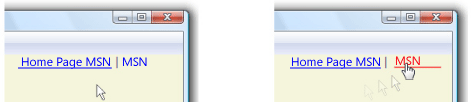

# Procedura: specificare se un collegamento ipertestuale &#232; sottolineato
L'oggetto <xref:System.Windows.Documents.Hyperlink> è un elemento del contenuto del flusso di livello inline che consente di ospitare collegamenti ipertestuali all'interno del contenuto del flusso.  Per impostazione predefinita, <xref:System.Windows.Documents.Hyperlink> utilizza un oggetto <xref:System.Windows.TextDecoration> per visualizzare una sottolineatura.  Gli oggetti <xref:System.Windows.TextDecoration> possono essere prestazione intensive da creare, in particolare se si hanno molti oggetti <xref:System.Windows.Documents.Hyperlink>.  Se gli elementi <xref:System.Windows.Documents.Hyperlink>, utilizzati sono molti è opportuno visualizzare una sottolineatura solo al momento della generazione di un evento, ad esempio l'evento <xref:System.Windows.ContentElement.MouseEnter>.  
  
 Nell'esempio riportato di seguito, il collegamento "My MSN" presenta una sottolineatura dinamica, vale a dire che la sottolineatura viene visualizzata solo al momento della generazione dell'evento <xref:System.Windows.ContentElement.MouseEnter>.  
  
   
Collegamenti ipertestuali definiti con TextDecorations  
  
## Esempio  
 Nell'esempio di markup riportato di seguito viene illustrato un oggetto <xref:System.Windows.Documents.Hyperlink> definito con e senza sottolineatura:  
  
 [!code-xml[Performance#PerformanceSnippet11](../../../../samples/snippets/csharp/VS_Snippets_Wpf/Performance/CSharp/Hyperlink.xaml#performancesnippet11)]  
  
 Nell'esempio di codice riportato di seguito viene illustrato come creare una sottolineatura per <xref:System.Windows.Documents.Hyperlink> sull'evento <xref:System.Windows.ContentElement.MouseEnter> e come rimuoverla sull'evento <xref:System.Windows.ContentElement.MouseLeave>.  
  
 [!code-csharp[Performance#PerformanceSnippet15](../../../../samples/snippets/csharp/VS_Snippets_Wpf/Performance/CSharp/Hyperlink.xaml.cs#performancesnippet15)]
 [!code-vb[Performance#PerformanceSnippet15](../../../../samples/snippets/visualbasic/VS_Snippets_Wpf/Performance/visualbasic/hyperlink.xaml.vb#performancesnippet15)]  
  
## Vedere anche  
 <xref:System.Windows.TextDecoration>   
 <xref:System.Windows.Documents.Hyperlink>   
 [Ottimizzazione delle prestazioni di applicazioni WPF](../../../../docs/framework/wpf/advanced/optimizing-wpf-application-performance.md)   
 [Creare un effetto di testo](../../../../docs/framework/wpf/advanced/how-to-create-a-text-decoration.md)