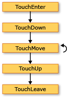
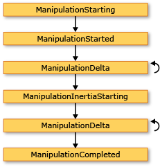
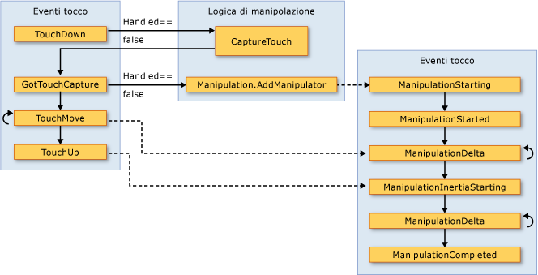

# Cenni preliminari sull’input
Il[!INCLUDE[TLA#tla_winclient](../../../../includes/tlasharptla-winclient-md.md)] sottosistema fornisce un potente [!INCLUDE[TLA#tla_api](../../../../includes/tlasharptla-api-md.md)] per ottenere input da un'ampia gamma di dispositivi, inclusi il mouse, tastiera, tocco e stilo. In questo argomento vengono descritti i servizi forniti da [!INCLUDE[TLA2#tla_winclient](../../../../includes/tla2sharptla-winclient-md.md)] e viene illustrata l'architettura dei sistemi di input.  
  
  
   
## API di input  
 L'input principale [!INCLUDE[TLA2#tla_api](../../../../includes/tla2sharptla-api-md.md)] esposizione viene rilevata nelle classi di elemento di base: <xref:System.Windows.UIElement>, <xref:System.Windows.ContentElement>, <xref:System.Windows.FrameworkElement>, e <xref:System.Windows.FrameworkContentElement>.  Per ulteriori informazioni sugli elementi di base, vedere [Cenni preliminari sugli elementi di Base](../../../../docs/framework/wpf/advanced/base-elements-overview.md).  Queste classi forniscono funzionalità per gli eventi di input correlati a pressioni dei pulsanti del mouse, rotellina del mouse, movimento del mouse, gestione dello stato attivo e mouse capture, per citarne alcuni. Inserendo l'input [!INCLUDE[TLA2#tla_api](../../../../includes/tla2sharptla-api-md.md)] sugli elementi di base, invece di considerare tutti gli eventi di input come servizio, l'architettura di input Abilita gli eventi di input per essere originato da un particolare oggetto nell'interfaccia utente e per supportare uno schema di routing dell'evento in cui più di un elemento ha la possibilità di gestire un evento di input. Molti eventi di input includono una coppia di eventi associati.  Ad esempio, la chiave all'evento è associata il <xref:System.Windows.Input.Keyboard.KeyDown> e <xref:System.Windows.Input.Keyboard.PreviewKeyDown> eventi.  La differenza di questi eventi è in modalità di routing per l'elemento di destinazione.  Tunnel di eventi di anteprima verso il basso nella struttura ad albero l'elemento radice all'elemento di destinazione.  Gli eventi di bubbling bubbling dall'elemento di destinazione per l'elemento radice.  Il routing degli eventi [!INCLUDE[TLA2#tla_winclient](../../../../includes/tla2sharptla-winclient-md.md)] descritti in dettaglio più avanti in questa panoramica e nel [Cenni preliminari sugli eventi indirizzati](../../../../docs/framework/wpf/advanced/routed-events-overview.md).  
  
### Classi di Mouse e tastiera  
 Oltre a input [!INCLUDE[TLA2#tla_api](../../../../includes/tla2sharptla-api-md.md)] sulle classi di elemento di base, il <xref:System.Windows.Input.Keyboard> (classe) e <xref:System.Windows.Input.Mouse> classi forniscono ulteriori [!INCLUDE[TLA2#tla_api](../../../../includes/tla2sharptla-api-md.md)] per l'utilizzo di input del mouse e tastiera.  
  
 Esempi di input [!INCLUDE[TLA2#tla_api](../../../../includes/tla2sharptla-api-md.md)] sul <xref:System.Windows.Input.Keyboard> sono il <xref:System.Windows.Input.Keyboard.Modifiers%2A> proprietà, che restituisce il <xref:System.Windows.Input.ModifierKeys> attualmente premuti e <xref:System.Windows.Input.Keyboard.IsKeyDown%2A> metodo, che determina se viene premuto un tasto specificato.  
  
 Nell'esempio seguente viene utilizzata la <xref:System.Windows.Input.Keyboard.GetKeyStates%2A> per determinare se un <xref:System.Windows.Input.Key> è nello stato premuto.  
  
 [!code-csharp[keyargssnippetsample#KeyEventArgsKeyBoardGetKeyStates](../../../../samples/snippets/csharp/VS_Snippets_Wpf/KeyArgsSnippetSample/CSharp/Window1.xaml.cs#keyeventargskeyboardgetkeystates)]
 [!code-vb[keyargssnippetsample#KeyEventArgsKeyBoardGetKeyStates](../../../../samples/snippets/visualbasic/VS_Snippets_Wpf/KeyArgsSnippetSample/visualbasic/window1.xaml.vb#keyeventargskeyboardgetkeystates)]  
  
 Esempi di input [!INCLUDE[TLA2#tla_api](../../../../includes/tla2sharptla-api-md.md)] sul <xref:System.Windows.Input.Mouse> sono <xref:System.Windows.Input.Mouse.MiddleButton%2A>, che ottiene lo stato del pulsante centrale del mouse e <xref:System.Windows.Input.Mouse.DirectlyOver%2A>, che ottiene l'elemento, il puntatore del mouse è attualmente posizionato.  
  
 Nell'esempio seguente si determina se il <xref:System.Windows.Input.Mouse.LeftButton%2A> del mouse si trova il <xref:System.Windows.Input.MouseButtonState> dello stato.  
  
 [!code-csharp[mouserelatedsnippets#MouseRelatedSnippetsGetLeftButtonMouse](../../../../samples/snippets/csharp/VS_Snippets_Wpf/MouseRelatedSnippets/CSharp/Window1.xaml.cs#mouserelatedsnippetsgetleftbuttonmouse)]
 [!code-vb[mouserelatedsnippets#MouseRelatedSnippetsGetLeftButtonMouse](../../../../samples/snippets/visualbasic/VS_Snippets_Wpf/MouseRelatedSnippets/visualbasic/window1.xaml.vb#mouserelatedsnippetsgetleftbuttonmouse)]  
  
 Il <xref:System.Windows.Input.Mouse> e <xref:System.Windows.Input.Keyboard> classi sono descritti più dettagliatamente in tutta questa panoramica.  
  
### Input dello stilo  
 [!INCLUDE[TLA2#tla_winclient](../../../../includes/tla2sharptla-winclient-md.md)]è integrato il supporto per il <xref:System.Windows.Input.Stylus>.  Il <xref:System.Windows.Input.Stylus> è un input penna divenuto dal [!INCLUDE[TLA#tla_tpc](../../../../includes/tlasharptla-tpc-md.md)].  [!INCLUDE[TLA2#tla_winclient](../../../../includes/tla2sharptla-winclient-md.md)]le applicazioni possono considerare lo stilo come un mouse utilizzando il mouse [!INCLUDE[TLA2#tla_api](../../../../includes/tla2sharptla-api-md.md)], ma [!INCLUDE[TLA2#tla_winclient](../../../../includes/tla2sharptla-winclient-md.md)] espone anche un'astrazione dispositivo stilo che utilizzano un modello simile alla tastiera e mouse.  Tutte le relative stilo [!INCLUDE[TLA2#tla_api#plural](../../../../includes/tla2sharptla-apisharpplural-md.md)] contengono la parola "Stylus".  
  
 Poiché lo stilo può agire come un mouse, le applicazioni che supportano solo l'input del mouse possono comunque ottenere un certo livello di supporto dello stilo automaticamente. Quando lo stilo viene utilizzato in questo modo, l'applicazione viene data la possibilità di gestire l'evento dello stilo appropriato e quindi gestisce l'evento del mouse corrispondente. Inoltre, servizi di livello superiore, ad esempio input penna sono disponibili tramite l'astrazione del dispositivo stilo.  Per ulteriori informazioni sull'input penna come input, vedere [Getting Started with Ink](../../../../docs/framework/wpf/advanced/getting-started-with-ink.md).  
  
   
## Routing di eventi  
 Oggetto <xref:System.Windows.FrameworkElement> possono contenere altri elementi come elementi figlio nel modello di contenuto, formando un struttura ad albero di elementi.  In [!INCLUDE[TLA2#tla_winclient](../../../../includes/tla2sharptla-winclient-md.md)], l'elemento padre può partecipare all'input diretto ai relativi elementi figlio o altri discendenti mediante la gestione degli eventi. Ciò è particolarmente utile per la creazione di controlli da controlli più piccoli, un processo noto come "controllo composizione" o "composizione". Per ulteriori informazioni sulle strutture ad albero dell'elemento e sulla rispettiva correlazione con le route degli eventi, vedere [Trees in WPF](../../../../docs/framework/wpf/advanced/trees-in-wpf.md).  
  
 Routing di eventi è il processo di inoltro di eventi a più elementi, in modo che un determinato oggetto o un elemento nella route è possibile scegliere di offrire una risposta significativa (tramite la gestione) a un evento che potrebbe essere stato originato da un elemento diverso.  Gli eventi indirizzati utilizzano uno dei tre meccanismi di routing: diretto, bubbling e tunneling.  Nel routing diretto, l'elemento di origine è l'unico elemento di una notifica e l'evento non viene indirizzato a tutti gli altri elementi. Tuttavia, l'evento indirizzato diretto offre alcune funzionalità aggiuntive che sono disponibili solo per gli eventi indirizzati anziché standard [!INCLUDE[TLA2#tla_clr](../../../../includes/tla2sharptla-clr-md.md)] eventi. Bubbling, viene eseguito nella struttura ad albero notificando dapprima l'elemento che ha originato l'evento, quindi l'elemento padre e così via.  Tunneling inizia alla radice della struttura ad albero dell'elemento e procede verso il basso, terminando con l'elemento di origine.  Per ulteriori informazioni sugli eventi indirizzati, vedere [Cenni preliminari sugli eventi indirizzati](../../../../docs/framework/wpf/advanced/routed-events-overview.md).  
  
 [!INCLUDE[TLA2#tla_winclient](../../../../includes/tla2sharptla-winclient-md.md)]eventi di input sono generalmente di coppie costituito da un evento di tunneling e un evento di bubbling.  Gli eventi di tunneling si distinguono dai bubbling degli eventi con il prefisso "Anteprima".  Ad esempio, <xref:System.Windows.Input.Mouse.PreviewMouseMove> è la versione tunneling di un evento di spostamento del mouse e <xref:System.Windows.Input.Mouse.MouseMove> è la versione di questo evento di bubbling. Questa coppia di eventi è una convenzione che viene implementata a livello di elemento e non è una funzionalità intrinseca del [!INCLUDE[TLA2#tla_winclient](../../../../includes/tla2sharptla-winclient-md.md)] sistema di eventi. Per informazioni dettagliate, vedere la sezione eventi di Input WPF in [Cenni preliminari sugli eventi indirizzati](../../../../docs/framework/wpf/advanced/routed-events-overview.md).  
  
   
## Gestione degli eventi di Input  
 Per ricevere l'input su un elemento, un gestore eventi deve essere associato a quel particolare evento.  In [!INCLUDE[TLA2#tla_xaml](../../../../includes/tla2sharptla-xaml-md.md)] è semplice: si fa riferimento il nome dell'evento come attributo dell'elemento che rimarrà in ascolto di questo evento.  Quindi, impostare il valore dell'attributo per il nome del gestore eventi che si definisce, basato su un delegato.  Il gestore dell'evento deve essere scritto in codice, ad esempio [!INCLUDE[TLA#tla_cshrp](../../../../includes/tlasharptla-cshrp-md.md)] e possono essere inclusi in un file code-behind.  
  
 Gli eventi di tastiera si verificano quando il sistema operativo segnala le azioni principali che si verificano quando lo stato attivo è su un elemento. Eventi del mouse e stilo ogni rientrano in due categorie: eventi che segnalano le modifiche nella posizione del puntatore rispetto all'elemento della ed eventi che segnalano le modifiche nello stato dei pulsanti del dispositivo.  
  
### Esempio di evento di Input da tastiera  
 Nell'esempio seguente è in attesa di un tasto freccia sinistra.  Oggetto <xref:System.Windows.Controls.StackPanel> viene creato ha un <xref:System.Windows.Controls.Button>.  Un gestore eventi per l'ascolto di pressione del tasto freccia sinistra è collegata al <xref:System.Windows.Controls.Button> istanza.  
  
 Crea la prima sezione dell'esempio di <xref:System.Windows.Controls.StackPanel> e <xref:System.Windows.Controls.Button> e associa il gestore eventi per il <xref:System.Windows.UIElement.KeyDown>.  
  
 [!code-xml[InputOvw#Input_OvwKeyboardExampleXAML](../../../../samples/snippets/csharp/VS_Snippets_Wpf/InputOvw/CSharp/Page1.xaml#input_ovwkeyboardexamplexaml)]  
  
 [!code-csharp[InputOvw#Input_OvwKeyboardExampleUICodeBehind](../../../../samples/snippets/csharp/VS_Snippets_Wpf/InputOvw/CSharp/Page1.xaml.cs#input_ovwkeyboardexampleuicodebehind)]
 [!code-vb[InputOvw#Input_OvwKeyboardExampleUICodeBehind](../../../../samples/snippets/visualbasic/VS_Snippets_Wpf/InputOvw/VisualBasic/Page1.xaml.vb#input_ovwkeyboardexampleuicodebehind)]  
  
 La seconda parte è scritta in codice e definisce il gestore dell'evento.  Quando si preme il tasto freccia sinistra e il <xref:System.Windows.Controls.Button> con lo stato attivo, il gestore viene eseguito e <xref:System.Windows.Controls.Control.Background%2A> colore del <xref:System.Windows.Controls.Button> viene modificato.  Se viene premuto il tasto, ma non è il tasto freccia sinistra, il <xref:System.Windows.Controls.Control.Background%2A> colore del <xref:System.Windows.Controls.Button> viene nuovamente impostata sul colore iniziale.  
  
 [!code-csharp[InputOvw#Input_OvwKeyboardExampleHandlerCodeBehind](../../../../samples/snippets/csharp/VS_Snippets_Wpf/InputOvw/CSharp/Page1.xaml.cs#input_ovwkeyboardexamplehandlercodebehind)]
 [!code-vb[InputOvw#Input_OvwKeyboardExampleHandlerCodeBehind](../../../../samples/snippets/visualbasic/VS_Snippets_Wpf/InputOvw/VisualBasic/Page1.xaml.vb#input_ovwkeyboardexamplehandlercodebehind)]  
  
### Esempio di evento di Input del mouse  
 Nell'esempio seguente, il <xref:System.Windows.Controls.Control.Background%2A> colore di un <xref:System.Windows.Controls.Button> viene modificato quando il puntatore del mouse entra nell'area di <xref:System.Windows.Controls.Button>.  Il <xref:System.Windows.Controls.Control.Background%2A> colore viene ripristinato quando il puntatore del mouse lascia il <xref:System.Windows.Controls.Button>.  
  
 La prima sezione dell'esempio crea il <xref:System.Windows.Controls.StackPanel> e <xref:System.Windows.Controls.Button> controllare e associa i gestori eventi per il <xref:System.Windows.UIElement.MouseEnter> e <xref:System.Windows.UIElement.MouseLeave> eventi per il <xref:System.Windows.Controls.Button>.  
  
 [!code-xml[InputOvw#Input_OvwMouseExampleXAML](../../../../samples/snippets/csharp/VS_Snippets_Wpf/InputOvw/CSharp/Page1.xaml#input_ovwmouseexamplexaml)]  
  
 [!code-csharp[InputOvw#Input_OvwMouseExampleUICodeBehind](../../../../samples/snippets/csharp/VS_Snippets_Wpf/InputOvw/CSharp/Page1.xaml.cs#input_ovwmouseexampleuicodebehind)]
 [!code-vb[InputOvw#Input_OvwMouseExampleUICodeBehind](../../../../samples/snippets/visualbasic/VS_Snippets_Wpf/InputOvw/VisualBasic/Page1.xaml.vb#input_ovwmouseexampleuicodebehind)]  
  
 La seconda parte dell'esempio è scritta in codice e definisce i gestori di eventi.  Quando il mouse viene spostato il <xref:System.Windows.Controls.Button>, <xref:System.Windows.Controls.Control.Background%2A> colore del <xref:System.Windows.Controls.Button> viene modificato in <xref:System.Windows.Media.Brushes.SlateGray%2A>.  Quando il puntatore del mouse lascia il <xref:System.Windows.Controls.Button>, il <xref:System.Windows.Controls.Control.Background%2A> colore del <xref:System.Windows.Controls.Button> ritorna <xref:System.Windows.Media.Brushes.AliceBlue%2A>.  
  
 [!code-csharp[InputOvw#Input_OvwMouseExampleEneterHandler](../../../../samples/snippets/csharp/VS_Snippets_Wpf/InputOvw/CSharp/Page1.xaml.cs#input_ovwmouseexampleeneterhandler)]
 [!code-vb[InputOvw#Input_OvwMouseExampleEneterHandler](../../../../samples/snippets/visualbasic/VS_Snippets_Wpf/InputOvw/VisualBasic/Page1.xaml.vb#input_ovwmouseexampleeneterhandler)]  
  
 [!code-csharp[InputOvw#Input_OvwMouseExampleLeaveHandler](../../../../samples/snippets/csharp/VS_Snippets_Wpf/InputOvw/CSharp/Page1.xaml.cs#input_ovwmouseexampleleavehandler)]
 [!code-vb[InputOvw#Input_OvwMouseExampleLeaveHandler](../../../../samples/snippets/visualbasic/VS_Snippets_Wpf/InputOvw/VisualBasic/Page1.xaml.vb#input_ovwmouseexampleleavehandler)]  
  
   
## Input di testo  
 Il <xref:System.Windows.ContentElement.TextInput> evento consente di ricevere l'input di testo in modo indipendente dal dispositivo. La tastiera è il mezzo principale di riconoscimento della grafia input, ma il riconoscimento vocale, testo e altri dispositivi di input possono generare anche l'input di testo.  
  
 Per l'input da tastiera, [!INCLUDE[TLA2#tla_winclient](../../../../includes/tla2sharptla-winclient-md.md)] invia appropriato <xref:System.Windows.ContentElement.KeyDown>/<xref:System.Windows.ContentElement.KeyUp> eventi. Se non vengono gestiti gli eventi e la chiave è testo anziché (chiave di controllo, ad esempio direzionali) o i tasti funzione, un <xref:System.Windows.ContentElement.TextInput> viene generato l'evento.  Non c'è sempre un semplice mapping uno a uno tra <xref:System.Windows.ContentElement.KeyDown>/<xref:System.Windows.ContentElement.KeyUp> e <xref:System.Windows.ContentElement.TextInput> eventi perché più sequenze di tasti possono generare un singolo carattere di input di testo e singolo tasto può generare stringhe con più caratteri.  Ciò vale soprattutto per lingue quali cinese, giapponese e coreano che utilizzano [!INCLUDE[TLA#tla_ime#plural](../../../../includes/tlasharptla-imesharpplural-md.md)] per generare le migliaia di caratteri possibili nei corrispondenti alfabeti.  
  
 Quando [!INCLUDE[TLA2#tla_winclient](../../../../includes/tla2sharptla-winclient-md.md)] invia un <xref:System.Windows.ContentElement.KeyUp>/<xref:System.Windows.ContentElement.KeyDown> evento <xref:System.Windows.Input.KeyEventArgs.Key%2A> è impostato su <xref:System.Windows.Input.Key?displayProperty=fullName> se le sequenze di tasti possono diventare parte di un <xref:System.Windows.ContentElement.TextInput> evento (se ALT + S viene premuto, ad esempio). Ciò consente al codice un <xref:System.Windows.ContentElement.KeyDown> gestore eventi per verificare la presenza di <xref:System.Windows.Input.Key?displayProperty=fullName> e, se trovato, abbandonare l'elaborazione del gestore di generato successivamente <xref:System.Windows.ContentElement.TextInput> evento. In questi casi, le diverse proprietà di <xref:System.Windows.Input.TextCompositionEventArgs> argomento può essere utilizzato per determinare le sequenze di tasti originale. Analogamente, se un [!INCLUDE[TLA2#tla_ime](../../../../includes/tla2sharptla-ime-md.md)] è attivo, <xref:System.Windows.Input.Key> ha il valore di <xref:System.Windows.Input.Key?displayProperty=fullName>, e <xref:System.Windows.Input.KeyEventArgs.ImeProcessedKey%2A> fornisce la sequenza di tasti o originale.  
  
 Nell'esempio seguente definisce un gestore per il <xref:System.Windows.Controls.Primitives.ButtonBase.Click> evento e un gestore per il <xref:System.Windows.UIElement.KeyDown> evento.  
  
 Il primo segmento di codice o markup crea l'interfaccia utente.  
  
 [!code-xml[InputOvw#Input_OvwTextInputXAML](../../../../samples/snippets/csharp/VS_Snippets_Wpf/InputOvw/CSharp/Page1.xaml#input_ovwtextinputxaml)]  
  
 [!code-csharp[InputOvw#Input_OvwTextInputUICodeBehind](../../../../samples/snippets/csharp/VS_Snippets_Wpf/InputOvw/CSharp/Page1.xaml.cs#input_ovwtextinputuicodebehind)]
 [!code-vb[InputOvw#Input_OvwTextInputUICodeBehind](../../../../samples/snippets/visualbasic/VS_Snippets_Wpf/InputOvw/VisualBasic/Page1.xaml.vb#input_ovwtextinputuicodebehind)]  
  
 Il secondo segmento di codice contiene i gestori di eventi.  
  
 [!code-csharp[InputOvw#Input_OvwTextInputHandlersCodeBehind](../../../../samples/snippets/csharp/VS_Snippets_Wpf/InputOvw/CSharp/Page1.xaml.cs#input_ovwtextinputhandlerscodebehind)]
 [!code-vb[InputOvw#Input_OvwTextInputHandlersCodeBehind](../../../../samples/snippets/visualbasic/VS_Snippets_Wpf/InputOvw/VisualBasic/Page1.xaml.vb#input_ovwtextinputhandlerscodebehind)]  
  
 Poiché gli eventi di input bubbling la route dell'evento, il <xref:System.Windows.Controls.StackPanel> riceve l'input indipendentemente dalla quale l'elemento con lo stato attivo. Il <xref:System.Windows.Controls.TextBox> controllo riceve una notifica prima e la `OnTextInputKeyDown` gestore viene chiamato solo se il <xref:System.Windows.Controls.TextBox> non ha gestito l'input. Se il <xref:System.Windows.UIElement.PreviewKeyDown> l'evento viene utilizzato al posto di <xref:System.Windows.UIElement.KeyDown> evento, il `OnTextInputKeyDown` gestore viene chiamato per primo.  
  
 In questo esempio, la logica di gestione viene scritta due volte: una volta per CTRL + O e, successivamente, per del pulsante click (evento). Questo può essere semplificato tramite comandi, invece di gestire gli eventi di input direttamente.  I comandi sono descritti in questa panoramica e in [panoramica dei comandi](../../../../docs/framework/wpf/advanced/commanding-overview.md).  
  
   
## Tocco e modifica  
 Nuovo hardware e l'API del sistema operativo Windows 7 forniscono applicazioni la possibilità di ricevere input da più tocchi contemporaneamente. [!INCLUDE[TLA2#tla_winclient](../../../../includes/tla2sharptla-winclient-md.md)]consente alle applicazioni di rilevare e rispondere agli input tocco in modo simile alle risposte ad altri input, ad esempio mouse o tastiera, generando eventi quando si verifica il tocco.  
  
 [!INCLUDE[TLA2#tla_winclient](../../../../includes/tla2sharptla-winclient-md.md)]espone due tipi di eventi quando si verifica il tocco: eventi tocco ed eventi di modifica. Gli eventi tocco forniscono dati non elaborati relativi ogni dito su un touchscreen e spostamento. Eventi di modifica interpretano l'input come determinate azioni. In questa sezione vengono descritti entrambi i tipi di eventi.  
  
### Prerequisiti  
 È necessario disporre dei componenti seguenti per sviluppare un'applicazione che risponde al tocco.  
  
-   [!INCLUDE[vs_dev10_ext](../../../../includes/vs-dev10-ext-md.md)].  
  
-   Windows 7.  
  
-   Un dispositivo, ad esempio un touchscreen, che supporta Windows Touch.  
  
### Terminologia  
 Quando il tocco viene trattato, vengono utilizzati i seguenti termini.  
  
-   **Touch** è un tipo di input dell'utente che è riconosciuto da Windows 7. In genere, viene avviato touch inserendo dita sullo schermo sensibile al tocco. Si noti che i dispositivi, ad esempio touchpad diffusi sui computer portatili non supportano touch se il dispositivo converte semplicemente il dito posizione e il movimento come input del mouse.  
  
-   **Multitouch** è un tocco che si verifica contemporaneamente da più di un punto. Windows 7 e [!INCLUDE[TLA2#tla_winclient](../../../../includes/tla2sharptla-winclient-md.md)] supporti la funzionalità multitouch. Ogni volta che il tocco viene trattato nella documentazione relativa a [!INCLUDE[TLA2#tla_winclient](../../../../includes/tla2sharptla-winclient-md.md)], i concetti si applicano al multitocco.  
  
-   Oggetto **manipolazione** si verifica quando il tocco viene interpretato come un'azione fisica che viene applicata a un oggetto. In [!INCLUDE[TLA2#tla_winclient](../../../../includes/tla2sharptla-winclient-md.md)], eventi di modifica interpretano input come una conversione, espansione o rotazione.  
  
-   Oggetto `touch device` rappresenta un dispositivo che produce un input tocco, ad esempio un singolo dito su un touchscreen.  
  
### Controlli che rispondono al tocco  
 È possibile scorrere i controlli seguenti trascinando un dito all'interno del controllo se dispone di contenuto di fuori della visualizzazione.  
  
-   <xref:System.Windows.Controls.ComboBox>  
  
-   <xref:System.Windows.Controls.ContextMenu>  
  
-   <xref:System.Windows.Controls.DataGrid>  
  
-   <xref:System.Windows.Controls.ListBox>  
  
-   <xref:System.Windows.Controls.ListView>  
  
-   <xref:System.Windows.Controls.MenuItem>  
  
-   <xref:System.Windows.Controls.TextBox>  
  
-   <xref:System.Windows.Controls.ToolBar>  
  
-   <xref:System.Windows.Controls.TreeView>  
  
 Il <xref:System.Windows.Controls.ScrollViewer> definisce il <xref:System.Windows.Controls.ScrollViewer.PanningMode%2A?displayProperty=fullName> associata che consente di specificare se la panoramica tocco è abilitata in orizzontale, verticale, entrambi o nessuno. Il <xref:System.Windows.Controls.ScrollViewer.PanningDeceleration%2A?displayProperty=fullName> proprietà specifica la rapidità di rallentamento dello scorrimento quando l'utente solleva il dito dal touchscreen. Il <xref:System.Windows.Controls.ScrollViewer.PanningRatio%2A?displayProperty=fullName> proprietà associata specifica il rapporto dell'offset per convertire l'offset di manipolazione di scorrimento.  
  
### Eventi tocco  
 Le classi di base, <xref:System.Windows.UIElement>, <xref:System.Windows.UIElement3D>, e <xref:System.Windows.ContentElement>, definire gli eventi che è possibile sottoscrivere in modo che l'applicazione risponda al tocco. Gli eventi tocco sono utili quando l'applicazione interpreta il tocco come un valore diverso da un oggetto. Ad esempio, un'applicazione che consente di disegnare con uno o più dita sottoscriverà per eventi di tocco.  
  
 Tutti e tre le classi definiscono gli eventi seguenti, che si comportano allo stesso modo, indipendentemente dalla classe di definizione.  
  
-   <xref:System.Windows.UIElement.TouchDown>  
  
-   <xref:System.Windows.UIElement.TouchMove>  
  
-   <xref:System.Windows.UIElement.TouchUp>  
  
-   <xref:System.Windows.UIElement.TouchEnter>  
  
-   <xref:System.Windows.UIElement.TouchLeave>  
  
-   <xref:System.Windows.UIElement.PreviewTouchDown>  
  
-   <xref:System.Windows.UIElement.PreviewTouchMove>  
  
-   <xref:System.Windows.UIElement.PreviewTouchUp>  
  
-   <xref:System.Windows.UIElement.GotTouchCapture>  
  
-   <xref:System.Windows.UIElement.LostTouchCapture>  
  
 Come gli eventi di tastiera e mouse, gli eventi tocco sono eventi indirizzati. Gli eventi che iniziano con `Preview` sono eventi di tunneling e gli eventi che iniziano con `Touch` sono eventi di bubbling. Per ulteriori informazioni sugli eventi indirizzati, vedere [Cenni preliminari sugli eventi indirizzati](../../../../docs/framework/wpf/advanced/routed-events-overview.md). Quando si gestiscono questi eventi, è possibile ottenere la posizione dell'input, relativa a qualsiasi elemento chiamando il <xref:System.Windows.Input.TouchEventArgs.GetTouchPoint%2A> o <xref:System.Windows.Input.TouchEventArgs.GetIntermediateTouchPoints%2A> metodo.  
  
 Per comprendere l'interazione tra gli eventi di tocco, si consideri lo scenario in cui un utente inserisce un dito su un elemento, sposta il dito nell'elemento e quindi solleva il dito dall'elemento. Nella figura seguente è illustrata l'esecuzione degli eventi di bubbling (gli eventi di tunneling sono stati omessi per maggiore semplicità).  
  
   
Eventi tocco  
  
 Nell'elenco seguente viene descritta la sequenza degli eventi nell'illustrazione precedente.  
  
1.  Il <xref:System.Windows.UIElement.TouchEnter> evento si verifica una volta quando l'utente inserisce un dito sull'elemento.  
  
2.  Il <xref:System.Windows.UIElement.TouchDown> evento si verifica una volta.  
  
3.  Il <xref:System.Windows.UIElement.TouchMove> evento si verifica più volte quando l'utente sposta il dito all'interno dell'elemento.  
  
4.  Il <xref:System.Windows.UIElement.TouchUp> evento si verifica una volta quando l'utente solleva il dito dall'elemento.  
  
5.  Il <xref:System.Windows.UIElement.TouchLeave> evento si verifica una volta.  
  
 Quando vengono utilizzate più di due dita, si verificano gli eventi per ogni dito.  
  
### Eventi di modifica  
 Nei casi in cui un'applicazione consente a un utente di modificare un oggetto, il <xref:System.Windows.UIElement> classe definisce gli eventi di modifica. A differenza degli eventi di tocco che segnalano semplicemente la posizione di tocco, gli eventi di modifica di report come l'input può essere interpretato. Esistono tre tipi di modifiche, conversione, espansione e rotazione. Nell'elenco seguente viene descritto come richiamare i tre tipi di modifiche.  
  
-   Posizionare un dito su un oggetto e spostare il dito sul touchscreen per richiamare una modifica della conversione. In genere viene spostato l'oggetto.  
  
-   Posizionare due dita su un oggetto e spostarle o tra loro per richiamare una modifica di espansione. In genere Ridimensiona l'oggetto.  
  
-   Posizionare due dita su un oggetto e ruotare un dito intorno a altro per richiamare una manipolazione di rotazione. Ciò in genere consente di ruotare l'oggetto.  
  
 Può verificarsi contemporaneamente più di un tipo di modifica.  
  
 Quando che gli oggetti rispondere a modifiche, è possibile impostare l'oggetto visualizzazione di inerzia. In questo modo gli oggetti di simulare il mondo fisico. Ad esempio, quando si esegue un libro in una tabella, se si esegue il push rigido sufficientemente il libro continuerà a spostarsi dopo essere stato rilasciato. [!INCLUDE[TLA2#tla_winclient](../../../../includes/tla2sharptla-winclient-md.md)]Consente di simulare questo comportamento generando eventi di modifica dopo l'oggetto viene rilasciato il dito dell'utente.  
  
 Per informazioni su come creare un'applicazione che consente all'utente di spostare, ridimensionare e ruotare un oggetto, vedere [procedura dettagliata: creazione Your First Touch Application](../../../../docs/framework/wpf/advanced/walkthrough-creating-your-first-touch-application.md).  
  
 Il <xref:System.Windows.UIElement> definisce gli eventi di modifica seguente.  
  
-   <xref:System.Windows.UIElement.ManipulationStarting>  
  
-   <xref:System.Windows.UIElement.ManipulationStarted>  
  
-   <xref:System.Windows.UIElement.ManipulationDelta>  
  
-   <xref:System.Windows.UIElement.ManipulationInertiaStarting>  
  
-   <xref:System.Windows.UIElement.ManipulationCompleted>  
  
-   <xref:System.Windows.UIElement.ManipulationBoundaryFeedback>  
  
 Per impostazione predefinita, un <xref:System.Windows.UIElement> non riceve questi eventi di modifica. Per ricevere eventi di modifica in un <xref:System.Windows.UIElement>, impostare <xref:System.Windows.UIElement.IsManipulationEnabled%2A?displayProperty=fullName> a `true`.  
  
#### Il percorso di esecuzione di eventi di modifica  
 Si consideri uno scenario in cui un utente "genera" un oggetto. L'utente inserisce un dito sull'oggetto, sposta il dito sul touchscreen per una breve distanza e quindi solleva il dito durante lo spostamento. Il risultato è che l'oggetto verrà spostata sotto il dito dell'utente e continuare a spostarsi dopo che l'utente solleva il dito.  
  
 Nella figura seguente mostra il percorso di esecuzione di eventi di manipolazione e informazioni importanti relative a ogni evento.  
  
   
Eventi di modifica  
  
 Nell'elenco seguente viene descritta la sequenza degli eventi nell'illustrazione precedente.  
  
1.  Il <xref:System.Windows.UIElement.ManipulationStarting> evento si verifica quando l'utente posiziona un dito sull'oggetto. Tra le altre cose, questo evento consente di impostare il <xref:System.Windows.Input.ManipulationStartingEventArgs.ManipulationContainer%2A> proprietà. Negli eventi successivi, la posizione della modifica sarà relativo al <xref:System.Windows.Input.ManipulationStartingEventArgs.ManipulationContainer%2A>. Negli eventi diversi da <xref:System.Windows.UIElement.ManipulationStarting>, questa proprietà è di sola lettura, in modo che il <xref:System.Windows.UIElement.ManipulationStarting> evento è l'unica volta che è possibile impostare questa proprietà.  
  
2.  Il <xref:System.Windows.UIElement.ManipulationStarted> l'evento. Questo evento indica l'origine della modifica.  
  
3.  Il <xref:System.Windows.UIElement.ManipulationDelta> evento si verifica più volte come muove dell'utente su un touchscreen. Il <xref:System.Windows.Input.ManipulationDeltaEventArgs.DeltaManipulation%2A> di proprietà di <xref:System.Windows.Input.ManipulationDeltaEventArgs> classe indica se la modifica viene interpretata come movimento, espansione o conversione. Si tratta in cui si esegue la maggior parte delle operazioni di modifica di un oggetto.  
  
4.  Il <xref:System.Windows.UIElement.ManipulationInertiaStarting> evento si verifica quando il dito dell'utente perde il contatto con l'oggetto. Questo evento consente di specificare la decelerazione delle manipolazioni durante l'inerzia. Si tratta pertanto l'oggetto può emulare spazi fisici diversi o attributi se si sceglie. Si supponga, ad esempio, l'applicazione dispone di due oggetti che rappresentano gli elementi nel mondo fisico e uno è più pesante rispetto a altra. È possibile rendere l'oggetto più pesante rallentare più velocemente rispetto all'oggetto più chiaro.  
  
5.  Il <xref:System.Windows.UIElement.ManipulationDelta> evento si verifica più volte durante l'inerzia. Si noti che questo evento si verifica quando il dito dell'utente di spostare il touchscreen e [!INCLUDE[TLA2#tla_winclient](../../../../includes/tla2sharptla-winclient-md.md)] simula l'inerzia. In altre parole, <xref:System.Windows.UIElement.ManipulationDelta> si verifica prima e dopo il <xref:System.Windows.UIElement.ManipulationInertiaStarting> evento. Il <xref:System.Windows.Input.ManipulationDeltaEventArgs.IsInertial%2A?displayProperty=fullName> proprietà report se il <xref:System.Windows.UIElement.ManipulationDelta> evento si verifica durante l'inerzia, pertanto è possibile controllare la proprietà ed eseguire azioni diverse, a seconda del valore.  
  
6.  Il <xref:System.Windows.UIElement.ManipulationCompleted> evento si verifica quando termina la manipolazione e inerzia qualsiasi. Vale a dire, dopo tutti i <xref:System.Windows.UIElement.ManipulationDelta> si verificano gli eventi, il <xref:System.Windows.UIElement.ManipulationCompleted> si verifica l'evento per segnalare che la modifica è stata completata.  
  
 Il <xref:System.Windows.UIElement> definisce inoltre il <xref:System.Windows.UIElement.ManipulationBoundaryFeedback> evento. Questo evento si verifica quando il <xref:System.Windows.Input.ManipulationDeltaEventArgs.ReportBoundaryFeedback%2A> metodo viene chiamato nel <xref:System.Windows.UIElement.ManipulationDelta> evento. Il <xref:System.Windows.UIElement.ManipulationBoundaryFeedback> evento consente alle applicazioni o componenti fornire feedback visivo quando un oggetto raggiunge un limite. Ad esempio, il <xref:System.Windows.Window> classe gestisce il <xref:System.Windows.UIElement.ManipulationBoundaryFeedback> la finestra spostare leggermente quando viene rilevato il bordo dell'evento.  
  
 È possibile annullare la modifica chiamando il <xref:System.Windows.Input.ManipulationStartingEventArgs.Cancel%2A> metodo negli argomenti di evento in qualsiasi evento di modifica eccetto <xref:System.Windows.UIElement.ManipulationBoundaryFeedback> evento. Quando si chiama <xref:System.Windows.Input.ManipulationStartingEventArgs.Cancel%2A>, non vengono generati gli eventi di manipolazione e gli eventi del mouse si verificano per il tocco. Nella tabella seguente descrive la relazione tra l'ora che di modifica viene annullata e gli eventi del mouse che si verificano.  
  
|L'evento che l'annullamento viene chiamato|Gli eventi del mouse che si verificano per input che si è già verificato|  
|----------------------------------------|-----------------------------------------------------------------|  
|<xref:System.Windows.UIElement.ManipulationStarting> e <xref:System.Windows.UIElement.ManipulationStarted>|Passare il mouse gli eventi.|  
|<xref:System.Windows.UIElement.ManipulationDelta>|Spostamento verso il basso e gli eventi di spostamento del mouse.|  
|<xref:System.Windows.UIElement.ManipulationInertiaStarting> e <xref:System.Windows.UIElement.ManipulationCompleted>|Selezione, spostamento e gli eventi mouse con il mouse.|  
  
 Si noti che se si chiama <xref:System.Windows.Input.ManipulationStartingEventArgs.Cancel%2A> quando la modifica si trova l'inerzia, il metodo restituisce `false` e l'input non genera gli eventi del mouse.  
  
### La relazione tra eventi tocco ed eventi di modifica  
 Oggetto <xref:System.Windows.UIElement> può sempre ricevere eventi tocco. Quando il <xref:System.Windows.UIElement.IsManipulationEnabled%2A> è impostata su `true`, <xref:System.Windows.UIElement> può ricevere eventi di tocco e di manipolazione.  Se il <xref:System.Windows.UIElement.TouchDown> non viene gestito l'evento (vale a dire il <xref:System.Windows.RoutedEventArgs.Handled%2A> è `false`), la logica di modifica acquisisce il tocco all'elemento e genera gli eventi di modifica. Se il <xref:System.Windows.RoutedEventArgs.Handled%2A> è impostata su `true` nel <xref:System.Windows.UIElement.TouchDown> evento, la logica di modifica non genera eventi di modifica. Nella figura seguente mostra la relazione tra eventi tocco ed eventi di modifica.  
  
   
Eventi di tocco e modifica  
  
 Nell'elenco seguente descrive la relazione tra gli eventi tocco e modifica è illustrato nella figura precedente.  
  
-   Quando il primo dispositivo a tocco genera un <xref:System.Windows.UIElement.TouchDown> evento su un <xref:System.Windows.UIElement>, le chiamate di logica di manipolazione di <xref:System.Windows.UIElement.CaptureTouch%2A> metodo che genera il <xref:System.Windows.UIElement.GotTouchCapture> evento.  
  
-   Quando il <xref:System.Windows.UIElement.GotTouchCapture> si verifica, le chiamate di logica di manipolazione di <xref:System.Windows.Input.Manipulation.AddManipulator%2A?displayProperty=fullName> metodo che genera il <xref:System.Windows.UIElement.ManipulationStarting> evento.  
  
-   Quando il <xref:System.Windows.UIElement.TouchMove> si verificano gli eventi, la logica di modifica genera il <xref:System.Windows.UIElement.ManipulationDelta> gli eventi che precedono il <xref:System.Windows.UIElement.ManipulationInertiaStarting> evento.  
  
-   Quando l'ultimo dispositivo a tocco sull'elemento genera il <xref:System.Windows.UIElement.TouchUp> la logica di modifica genera l'evento, il <xref:System.Windows.UIElement.ManipulationInertiaStarting> evento.  
  
   
## Stato attivo  
 Esistono due concetti principali relativi allo stato attivo in [!INCLUDE[TLA2#tla_winclient](../../../../includes/tla2sharptla-winclient-md.md)]: tastiera e lo stato attivo logico.  
  
### Stato attivo della tastiera  
 Lo stato attivo fa riferimento all'elemento che sta ricevendo l'input da tastiera.  Può esistere un solo elemento per l'intero desktop con lo stato attivo.  In [!INCLUDE[TLA2#tla_winclient](../../../../includes/tla2sharptla-winclient-md.md)], l'elemento con lo stato attivo della tastiera avrà <xref:System.Windows.IInputElement.IsKeyboardFocused%2A> impostato su `true`.  Il metodo statico <xref:System.Windows.Input.Keyboard> metodo <xref:System.Windows.Input.Keyboard.FocusedElement%2A> restituisce l'elemento che attualmente ha lo stato attivo.  
  
 È possibile ottenere lo stato attivo usando il tasto TAB per un elemento o facendo clic con il puntatore del mouse su determinati elementi, ad esempio un <xref:System.Windows.Controls.TextBox>.  Lo stato attivo può anche essere ottenuto a livello di codice utilizzando il <xref:System.Windows.Input.Keyboard.Focus%2A> metodo il <xref:System.Windows.Input.Keyboard> (classe).  <xref:System.Windows.Input.Keyboard.Focus%2A> tenta di assegnare l'elemento specificato lo stato attivo.  L'elemento restituito da <xref:System.Windows.Input.Keyboard.Focus%2A> è l'elemento che ha attualmente lo stato attivo.  
  
 Affinché un elemento ottenere lo stato attivo di <xref:System.Windows.UIElement.Focusable%2A> proprietà e <xref:System.Windows.UIElement.IsVisible%2A> devono essere impostate su **true**.  Alcune classi, ad esempio <xref:System.Windows.Controls.Panel>, hanno <xref:System.Windows.UIElement.Focusable%2A> impostato su `false` per impostazione predefinita; pertanto, potrebbe essere necessario impostare questa proprietà su `true` se si desidera che un elemento di essere in grado di ottenere lo stato attivo.  
  
 L'esempio seguente usa <xref:System.Windows.Input.Keyboard.Focus%2A> per impostare lo stato attivo su un <xref:System.Windows.Controls.Button>.  La posizione consigliata per impostare lo stato attivo iniziale in un'applicazione è il <xref:System.Windows.FrameworkElement.Loaded> gestore dell'evento.  
  
 [!code-csharp[focussample#FocusSampleSetFocus](../../../../samples/snippets/csharp/VS_Snippets_Wpf/FocusSample/CSharp/Window1.xaml.cs#focussamplesetfocus)]
 [!code-vb[focussample#FocusSampleSetFocus](../../../../samples/snippets/visualbasic/VS_Snippets_Wpf/FocusSample/visualbasic/window1.xaml.vb#focussamplesetfocus)]  
  
 Per ulteriori informazioni sullo stato attivo della tastiera, vedere [Focus Overview](../../../../docs/framework/wpf/advanced/focus-overview.md).  
  
### Stato attivo logico  
 Lo stato attivo logico si intende il <xref:System.Windows.Input.FocusManager.FocusedElement%2A?displayProperty=fullName> un ambito.  Possono essere presenti più elementi che lo stato attivo logico in un'applicazione, ma può essere presente solo un elemento che ha lo stato attivo logico un ambito specifico.  
  
 Un ambito attivo è un elemento contenitore che tiene traccia di <xref:System.Windows.Input.FocusManager.FocusedElement%2A> all'interno dell'ambito.  Quando lo stato attivo esce dall'ambito di stato attivo, l'elemento perderà lo stato attivo, ma verrà mantenuto lo stato attivo logico.  Quando viene restituito lo stato attivo per l'ambito dello stato attivo, l'elemento otterrà lo stato attivo della tastiera.  In questo modo lo stato attivo deve essere modificato tra più ambiti ma assicura che l'elemento all'interno dell'ambito dello stato attivo rimane l'elemento attivo quando viene restituito lo stato attivo.  
  
 Un elemento può essere convertito in un ambito attivo in [!INCLUDE[TLA#tla_xaml](../../../../includes/tlasharptla-xaml-md.md)] impostando il <xref:System.Windows.Input.FocusManager> proprietà associata <xref:System.Windows.Input.FocusManager.IsFocusScope%2A> a `true`, o nel codice impostando la proprietà associata tramite il <xref:System.Windows.Input.FocusManager.SetIsFocusScope%2A> metodo.  
  
 Nell'esempio seguente un <xref:System.Windows.Controls.StackPanel> in un ambito attivo impostando il <xref:System.Windows.Input.FocusManager.IsFocusScope%2A> proprietà associata.  
  
 [!code-xml[MarkupSnippets#MarkupIsFocusScopeXAML](../../../../samples/snippets/csharp/VS_Snippets_Wpf/MarkupSnippets/CSharp/Window1.xaml#markupisfocusscopexaml)]  
  
 [!code-csharp[FocusSnippets#FocusSetIsFocusScope](../../../../samples/snippets/csharp/VS_Snippets_Wpf/FocusSnippets/CSharp/Window1.xaml.cs#focussetisfocusscope)]
 [!code-vb[FocusSnippets#FocusSetIsFocusScope](../../../../samples/snippets/visualbasic/VS_Snippets_Wpf/FocusSnippets/visualbasic/window1.xaml.vb#focussetisfocusscope)]  
  
 Le classi in [!INCLUDE[TLA2#tla_winclient](../../../../includes/tla2sharptla-winclient-md.md)] che sono ambiti per impostazione predefinita sono <xref:System.Windows.Window>, <xref:System.Windows.Controls.Menu>, <xref:System.Windows.Controls.ToolBar>, e <xref:System.Windows.Controls.ContextMenu>.  
  
 Un elemento con lo stato attivo anche avrà lo stato attivo logico per l'ambito che a cui appartiene; Pertanto, impostando lo stato attivo su un elemento con la <xref:System.Windows.Input.Keyboard.Focus%2A> metodo il <xref:System.Windows.Input.Keyboard> classe o le classi di elemento di base tenterà di assegnare l'elemento lo stato attivo della tastiera e lo stato attivo logico.  
  
 Per determinare l'elemento in un ambito attivo, utilizzare <xref:System.Windows.Input.FocusManager.GetFocusedElement%2A>. Per modificare l'elemento attivo per un ambito attivo, utilizzare <xref:System.Windows.Input.FocusManager.SetFocusedElement%2A>.  
  
 Per ulteriori informazioni sullo stato attivo logico, vedere [Focus Overview](../../../../docs/framework/wpf/advanced/focus-overview.md).  
  
   
## Posizione del mouse  
 Il [!INCLUDE[TLA2#tla_winclient](../../../../includes/tla2sharptla-winclient-md.md)] input [!INCLUDE[TLA2#tla_api](../../../../includes/tla2sharptla-api-md.md)] fornisce informazioni utili relativamente agli spazi di coordinate.  Ad esempio, coordinare `(0,0)` è la coordinata superiore sinistra, ma l'angolo superiore sinistro quale elemento nell'albero? L'elemento che è la destinazione dell'input? L'elemento è associato il gestore eventi al? O qualcos'altro? Per evitare confusione, il [!INCLUDE[TLA2#tla_winclient](../../../../includes/tla2sharptla-winclient-md.md)] input [!INCLUDE[TLA2#tla_api](../../../../includes/tla2sharptla-api-md.md)] richiede che venga specificato il frame di riferimento quando si utilizzano le coordinate ottenute tramite il mouse. Il <xref:System.Windows.Input.Mouse.GetPosition%2A> metodo restituisce la coordinata del puntatore del mouse rispetto all'elemento specificato.  
  
   
## Mouse Capture  
 Dispositivi mouse includono in particolare una caratteristica modale nota come input del mouse. Acquisizione del mouse viene utilizzato per mantenere un transizione dello stato di input quando viene avviata un'operazione di trascinamento e, in modo che altre operazioni che coinvolgono il nominale sullo schermo posizione del puntatore del mouse non necessariamente si verificano. Durante il trascinamento, l'utente non può fare clic su senza interrompere il e trascinamento, in modo appropriato la maggior parte dei segnali mouseover mentre il mouse viene acquisito dall'origine del trascinamento. Espone il sistema di input [!INCLUDE[TLA2#tla_api#plural](../../../../includes/tla2sharptla-apisharpplural-md.md)] che possono determinare lo stato di acquisizione del mouse, nonché [!INCLUDE[TLA2#tla_api#plural](../../../../includes/tla2sharptla-apisharpplural-md.md)] che possono forzare l'acquisizione del mouse in un elemento specifico o cancellare lo stato di acquisizione del mouse. Per ulteriori informazioni sulle operazioni di trascinamento e rilascio, vedere [trascinare e rilasciare Panoramica](../../../../docs/framework/wpf/advanced/drag-and-drop-overview.md).  
  
   
## Comandi:  
 Per abilitare la gestione di input a un livello semantico maggiore rispetto all'input di dispositivo del comandi.  Si tratta di direttive semplici, ad esempio `Cut`, `Copy`, `Paste`, o `Open`.  I comandi sono utili per centralizzare la logica di comando.  Lo stesso comando potrebbe essere possibile accedere da un <xref:System.Windows.Controls.Menu>su un <xref:System.Windows.Controls.ToolBar>, o tramite un tasto di scelta rapida. I comandi forniscono anche un meccanismo per la disabilitazione di controlli quando il comando non è più disponibile.  
  
 <xref:System.Windows.Input.RoutedCommand> è il [!INCLUDE[TLA2#tla_winclient](../../../../includes/tla2sharptla-winclient-md.md)] implementazione di <xref:System.Windows.Input.ICommand>.  Quando un <xref:System.Windows.Input.RoutedCommand> viene eseguito un <xref:System.Windows.Input.CommandManager.PreviewExecuted> e <xref:System.Windows.Input.CommandManager.Executed> vengono generati eventi sulla destinazione del comando, il tunneling e bubbling nella struttura ad albero come altri input.  Se una destinazione di comando non è impostata, l'elemento con lo stato attivo sarà la destinazione del comando.  La logica che esegue il comando è associata a un <xref:System.Windows.Input.CommandBinding>.  Quando un <xref:System.Windows.Input.CommandManager.Executed> evento raggiunge un <xref:System.Windows.Input.CommandBinding> per il comando specifico, il <xref:System.Windows.Input.ExecutedRoutedEventHandler> sul <xref:System.Windows.Input.CommandBinding> viene chiamato.  Questo gestore esegue l'azione del comando.  
  
 Per ulteriori informazioni sui comandi, vedere [panoramica dei comandi](../../../../docs/framework/wpf/advanced/commanding-overview.md).  
  
 [!INCLUDE[TLA2#tla_winclient](../../../../includes/tla2sharptla-winclient-md.md)]fornisce una libreria di comandi comuni che è costituito da <xref:System.Windows.Input.ApplicationCommands>, <xref:System.Windows.Input.MediaCommands>, <xref:System.Windows.Input.ComponentCommands>, <xref:System.Windows.Input.NavigationCommands>, e <xref:System.Windows.Documents.EditingCommands>, è possibile definire.  
  
 Nell'esempio seguente viene illustrato come impostare un <xref:System.Windows.Controls.MenuItem> in modo che quando viene selezionato, richiami il <xref:System.Windows.Input.ApplicationCommands.Paste%2A> comando il <xref:System.Windows.Controls.TextBox>, presupponendo che il <xref:System.Windows.Controls.TextBox> con lo stato attivo.  
  
 [!code-xml[CommandingOverviewSnippets#CommandingOverviewSimpleCommand](../../../../samples/snippets/csharp/VS_Snippets_Wpf/CommandingOverviewSnippets/CSharp/Window1.xaml#commandingoverviewsimplecommand)]  
  
 [!code-csharp[CommandingOverviewSnippets#CommandingOverviewCommandTargetCodeBehind](../../../../samples/snippets/csharp/VS_Snippets_Wpf/CommandingOverviewSnippets/CSharp/Window1.xaml.cs#commandingoverviewcommandtargetcodebehind)]
 [!code-vb[CommandingOverviewSnippets#CommandingOverviewCommandTargetCodeBehind](../../../../samples/snippets/visualbasic/VS_Snippets_Wpf/CommandingOverviewSnippets/visualbasic/window1.xaml.vb#commandingoverviewcommandtargetcodebehind)]  
  
 Per ulteriori informazioni sui comandi in [!INCLUDE[TLA2#tla_winclient](../../../../includes/tla2sharptla-winclient-md.md)], vedere [panoramica dei comandi](../../../../docs/framework/wpf/advanced/commanding-overview.md).  
  
   
## Il sistema di Input e gli elementi di Base  
 Ad esempio gli eventi associati definiti da eventi di input di <xref:System.Windows.Input.Mouse>, <xref:System.Windows.Input.Keyboard>, e <xref:System.Windows.Input.Stylus> classi vengono generate dal sistema di input e inserite in una posizione specifica nel modello a oggetti basato sull'hit testing la struttura visiva in fase di esecuzione.  
  
 Tutti gli eventi che <xref:System.Windows.Input.Mouse>, <xref:System.Windows.Input.Keyboard>, e <xref:System.Windows.Input.Stylus> definire come un evento associato viene esposto nuovamente dalle classi di elemento di base <xref:System.Windows.UIElement> e <xref:System.Windows.ContentElement> come un nuovo evento indirizzato. Vengono generati gli eventi indirizzati dell'elemento base dalle classi di gestione dell'evento associato originale e riutilizzare i dati dell'evento.  
  
 Quando l'evento di input viene associato a un particolare elemento di origine tramite l'implementazione di eventi di input dell'elemento di base, possono essere instradato tramite il resto della route di un evento che si basa su una combinazione di oggetti albero logico e visual ed essere gestito dal codice dell'applicazione.  In genere, è preferibile gestire questi eventi di input correlati ai dispositivi utilizzando gli eventi indirizzati di <xref:System.Windows.UIElement> e <xref:System.Windows.ContentElement>, poiché è possibile utilizzare più intuitiva sintassi del gestore eventi sia in [!INCLUDE[TLA2#tla_xaml](../../../../includes/tla2sharptla-xaml-md.md)] e nel codice. È possibile scegliere di gestire l'evento che ha avviato il processo invece, ma si dovrebbe affrontare diversi problemi: l'evento può essere contrassegnato come gestito per la gestione della classe di elemento di base e si desidera utilizzare metodi di accesso anziché la sintassi dell'evento true per associare i gestori per gli eventi associati.  
  
   
## Argomenti successivi  
 Ora si dispone di diverse tecniche per gestire l'input in [!INCLUDE[TLA2#tla_winclient](../../../../includes/tla2sharptla-winclient-md.md)].  È inoltre una conoscenza approfondita dei diversi tipi di eventi di input e i meccanismi di eventi indirizzati utilizzati da [!INCLUDE[TLA2#tla_winclient](../../../../includes/tla2sharptla-winclient-md.md)].  
  
 Sono disponibili risorse aggiuntive che trattano [!INCLUDE[TLA2#tla_winclient](../../../../includes/tla2sharptla-winclient-md.md)] gli elementi del framework e il routing degli eventi in modo più dettagliato. Vedere le panoramiche seguenti per ulteriori informazioni, [panoramica dei comandi](../../../../docs/framework/wpf/advanced/commanding-overview.md), [Focus Overview](../../../../docs/framework/wpf/advanced/focus-overview.md), [Cenni preliminari sugli elementi di Base](../../../../docs/framework/wpf/advanced/base-elements-overview.md), [Trees in WPF](../../../../docs/framework/wpf/advanced/trees-in-wpf.md), e [Cenni preliminari sugli eventi indirizzati](../../../../docs/framework/wpf/advanced/routed-events-overview.md).  
  
## Vedere anche  
 [Panoramica dello stato attivo](../../../../docs/framework/wpf/advanced/focus-overview.md)   
 [Panoramica dei comandi](../../../../docs/framework/wpf/advanced/commanding-overview.md)   
 [Cenni preliminari sugli eventi indirizzati](../../../../docs/framework/wpf/advanced/routed-events-overview.md)   
 [Cenni preliminari sugli elementi di base](../../../../docs/framework/wpf/advanced/base-elements-overview.md)   
 [Proprietà](../../../../docs/framework/wpf/advanced/properties-wpf.md)