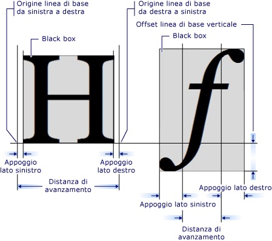

# Introduzione all&#39;oggetto GlyphRun e all&#39;elemento Glyphs
Questo argomento viene descritto il <xref:System.Windows.Media.GlyphRun> oggetto e il <xref:System.Windows.Documents.Glyphs> elemento.  
  
   
  
   
## Introduzione a GlyphRun  
 [!INCLUDE[TLA#tla_winclient](../../../../includes/tlasharptla-winclient-md.md)]fornisce il supporto di testo avanzato incluso il markup a livello di glifo con accesso diretto alla <xref:System.Windows.Documents.Glyphs> per i clienti che desiderano intercettare e salvare in modo permanente il testo dopo la formattazione. Queste funzionalità forniscono supporto critico per il testo diversi requisiti per il rendering in ognuno dei seguenti scenari.  
  
1.  Visualizzazione dei documenti a formato fisso.  
  
2.  Scenari di stampa.  
  
    -   [!INCLUDE[TLA#tla_xaml](../../../../includes/tlasharptla-xaml-md.md)]come un linguaggio della stampante.  
  
    -   [!INCLUDE[TLA#tla_mxdw](../../../../includes/tlasharptla-mxdw-md.md)].  
  
    -   Driver della stampante precedenti, l'output di [!INCLUDE[TLA#tla_win32](../../../../includes/tlasharptla-win32-md.md)] applicazioni in formato fisso.  
  
    -   Formato dello spool di stampa.  
  
3.  Rappresentazione di documenti con formato fisso, inclusi i client per le versioni precedenti di [!INCLUDE[TLA#tla_mswin](../../../../includes/tlasharptla-mswin-md.md)] e altri dispositivi di elaborazione.  
  
> [!NOTE]
>  <xref:System.Windows.Documents.Glyphs> e <xref:System.Windows.Media.GlyphRun> sono progettati per la presentazione di documenti a formato fisso e scenari di stampa.                      [!INCLUDE[TLA#tla_winclient](../../../../includes/tlasharptla-winclient-md.md)]vengono forniti diversi elementi per il layout generale e [!INCLUDE[TLA#tla_ui](../../../../includes/tlasharptla-ui-md.md)] scenari, ad esempio <xref:System.Windows.Controls.Label> e <xref:System.Windows.Controls.TextBlock>. Per ulteriori informazioni sul layout e [!INCLUDE[TLA2#tla_ui](../../../../includes/tla2sharptla-ui-md.md)] scenari, vedere il [funzionalità tipografiche di WPF](../../../../docs/framework/wpf/advanced/typography-in-wpf.md).  
  
   
## L'oggetto GlyphRun  
 Il <xref:System.Windows.Media.GlyphRun> oggetto rappresenta una sequenza di glifi di una singola icona di un unico carattere in una singola dimensione e con un unico stile di rendering.  
  
 <xref:System.Windows.Media.GlyphRun> include i dettagli relativi al tipo di carattere, ad esempio glifo <xref:System.Windows.Documents.Glyphs.Indices%2A> e posizioni dei singoli glifi. Include inoltre originale [!INCLUDE[TLA#tla_unicode](../../../../includes/tlasharptla-unicode-md.md)] punti da informazioni di mapping dell'offset del buffer di carattere a glifo e flag per ogni carattere e per glifo è stata generata l'esecuzione di codice.  
  
 <xref:System.Windows.Media.GlyphRun> corrisponde un alto livello <xref:System.Windows.FrameworkElement>, <xref:System.Windows.Documents.Glyphs>.                  <xref:System.Windows.Documents.Glyphs> può essere utilizzato nell'albero degli elementi e in [!INCLUDE[TLA2#tla_xaml](../../../../includes/tla2sharptla-xaml-md.md)] markup per rappresentare <xref:System.Windows.Media.GlyphRun> output.  
  
   
## Elemento Glyphs  
 Il <xref:System.Windows.Documents.Glyphs> elemento rappresenta l'output di un <xref:System.Windows.Media.GlyphRun> in [!INCLUDE[TLA2#tla_xaml](../../../../includes/tla2sharptla-xaml-md.md)]. La sintassi di markup seguente viene utilizzata per descrivere il <xref:System.Windows.Documents.Glyphs> elemento.  
  
 [!code-xml[GlyphsOvwSample1#1](../../../../samples/snippets/csharp/VS_Snippets_Wpf/GlyphsOvwSample1/CS/default.xaml#1)]  
  
 Le definizioni delle proprietà seguenti corrispondono ai primi quattro attributi nel markup di esempio.  
  
|Proprietà|Descrizione|  
|--------------|-----------------|  
|<xref:System.Windows.Documents.Glyphs.FontUri%2A>|Specifica un identificatore di risorsa: nome del file Web [!INCLUDE[TLA#tla_uri](../../../../includes/tlasharptla-uri-md.md)], o riferimento a una risorsa nel contenitore o .exe dell'applicazione.|  
|<xref:System.Windows.Documents.Glyphs.FontRenderingEmSize%2A>|Specifica le dimensioni del carattere in unità area (valore predefinito è.96 pollici) di disegno.|  
|<xref:System.Windows.Documents.Glyphs.StyleSimulations%2A>|Specifica i flag per gli stili grassetto e corsivo.|  
|<xref:System.Windows.Documents.Glyphs.BidiLevel%2A>|Specifica il livello di layout bidirezionale. Pari e valori zero implicano layout da sinistra a destra. valori dispari implicano layout da destra a sinistra.|  
  
   
### Proprietà degli indici  
 Il <xref:System.Windows.Documents.Glyphs.Indices%2A> proprietà è una stringa specifiche del glifo. In una sequenza di glifi costituisce un singolo cluster, la specifica del primo glifo nel cluster è preceduta da una specifica del numero di glifi e il numero di punti di codice si combina per formare il cluster. Il <xref:System.Windows.Documents.Glyphs.Indices%2A> proprietà raccoglie in una stringa le proprietà seguenti.  
  
-   Indici  
  
-   Larghezza di avanzamento del glifo  
  
-   La combinazione di vettori di attacco del glifo  
  
-   Mapping del cluster tra i punti di codice ai glifi  
  
-   Flag del glifo  
  
 Ogni specifica del glifo presenta il formato seguente.  
  
 `[GlyphIndex][,[Advance][,[uOffset][,[vOffset][,[Flags]]]]]`  
  
   
## Metrica del glifo  
 Ogni glifo definisce la metrica che specifica la modalità di allineamento con altri <xref:System.Windows.Documents.Glyphs>. Nell'immagine seguente definisce le varie qualità tipografiche di due caratteri glifi diversi.  
  
   
  
   
## Markup dei glifi  
 Esempio di codice seguente viene illustrato come utilizzare diverse proprietà del <xref:System.Windows.Documents.Glyphs> elemento [!INCLUDE[TLA2#tla_xaml](../../../../includes/tla2sharptla-xaml-md.md)].  
  
 [!code-xml[GlyphsOvwSamp2#1](../../../../samples/snippets/csharp/VS_Snippets_Wpf/GlyphsOvwSamp2/CS/default.xaml#1)]  
  
## Vedere anche  
 [Funzionalità tipografiche di WPF](../../../../docs/framework/wpf/advanced/typography-in-wpf.md)   
 [Documenti in WPF](../../../../docs/framework/wpf/advanced/documents-in-wpf.md)   
 [Testo](../../../../docs/framework/wpf/advanced/optimizing-performance-text.md)