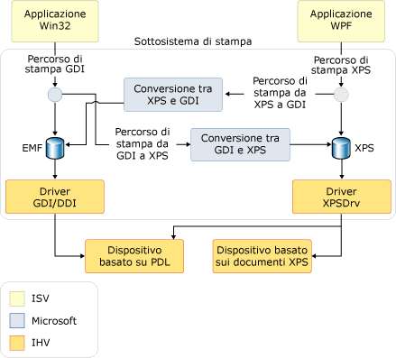

# Cenni preliminari sulla stampa
Con [!INCLUDE[TLA#tla_winfx](../../../../includes/tlasharptla-winfx-md.md)], gli sviluppatori di applicazioni che usano [!INCLUDE[TLA#tla_wpf](../../../../includes/tlasharptla-wpf-md.md)] dispongono di molteplici nuove [!INCLUDE[TLA#tla_api#plural](../../../../includes/tlasharptla-apisharpplural-md.md)] di stampa e di gestione del sistema di stampa.  Con [!INCLUDE[TLA#tla_winvista](../../../../includes/tlasharptla-winvista-md.md)], alcuni dei miglioramenti apportati al sistema di stampa sono anche disponibili agli sviluppatori che creano applicazioni [!INCLUDE[TLA#tla_winforms](../../../../includes/tlasharptla-winforms-md.md)] e a quelli che usano codice non gestito.  Questa nuova funzionalità è basata sul nuovo formato di file [!INCLUDE[TLA#tla_xps](../../../../includes/tlasharptla-xps-md.md)] e sul percorso di stampa [!INCLUDE[TLA2#tla_xps](../../../../includes/tla2sharptla-xps-md.md)].  
  
 Di seguito sono elencate le diverse sezioni di questo argomento:  
  
   
-   [Informazioni su XPS](#introduction_to_XPS)  
  
-   [Percorso di stampa XPS](#XPS_print_path_intro)  
  
-   [Percorso di stampa GDI](#GDI_Print_Path_intro)  
  
-   [Modello di driver XPSDrv](#XPS_Driver_Model_intro)  
  
-   [Argomenti correlati](#seeAlso_Toggle)  
  
   
## Informazioni su XPS  
 [!INCLUDE[TLA2#tla_metro](../../../../includes/tla2sharptla-metro-md.md)] è un formato di documento elettronico, un formato del file di spooling e un linguaggio di descrizione della pagina.  Si tratta di un formato di documento aperto basato sull'uso di [!INCLUDE[TLA#tla_xml](../../../../includes/tlasharptla-xml-md.md)], [!INCLUDE[TLA#tla_opc](../../../../includes/tlasharptla-opc-md.md)] e di altri standard del settore per creare documenti per più piattaforme.  [!INCLUDE[TLA2#tla_metro](../../../../includes/tla2sharptla-metro-md.md)] semplifica il processo di creazione, condivisione, stampa, visualizzazione e archiviazione di documenti digitali.  Per altre informazioni su [!INCLUDE[TLA2#tla_metro](../../../../includes/tla2sharptla-metro-md.md)] visitare il [sito Web di XPS](http://www.microsoft.com/xps).  
  
 In [Stampa di file XPS a livello di codice](../../../../docs/framework/wpf/advanced/how-to-programmatically-print-xps-files.md) vengono illustrate varie tecniche di stampa di contenuto basato su [!INCLUDE[TLA2#tla_metro](../../../../includes/tla2sharptla-metro-md.md)] tramite [!INCLUDE[TLA2#tla_wpf](../../../../includes/tla2sharptla-wpf-md.md)].  Può essere utile fare riferimento a tali esempi durante la lettura di questo argomento. Gli sviluppatori di codice non gestito dovrebbero fare riferimento alla guida relativa alla *funzione di escape della stampante per il processo di conversione documenti XPS Microsoft*.  Gli sviluppatori di [!INCLUDE[TLA2#tla_winforms#initcap](../../../../includes/tla2sharptla-winformssharpinitcap-md.md)] devono usare l'[!INCLUDE[TLA2#tla_api](../../../../includes/tla2sharptla-api-md.md)] nello spazio dei nomi <xref:System.Drawing.Printing>, che non supporta il percorso di stampa [!INCLUDE[TLA2#tla_xps](../../../../includes/tla2sharptla-xps-md.md)] completo, ma un percorso di stampa GDI\-XPS ibrido.  Vedere di seguito **Architettura del percorso di stampa**.  
  
   
## Percorso di stampa XPS  
 Il percorso di stampa [!INCLUDE[TLA#tla_metro](../../../../includes/tlasharptla-metro-md.md)] è una nuova funzionalità di [!INCLUDE[TLA#tla_mswin](../../../../includes/tlasharptla-mswin-md.md)] che ridefinisce la gestione della stampa nelle applicazioni [!INCLUDE[TLA2#tla_mswin](../../../../includes/tla2sharptla-mswin-md.md)].  Poiché [!INCLUDE[TLA2#tla_xps](../../../../includes/tla2sharptla-xps-md.md)] può sostituire un linguaggio di presentazione del documento, ad esempio RTF, un formato di spooler di stampa, ad esempio WMF, e un linguaggio di descrizione della pagina, ad esempio PCL o Postscript, il nuovo percorso di stampa mantiene il formato [!INCLUDE[TLA2#tla_metro](../../../../includes/tla2sharptla-metro-md.md)] dalla pubblicazione dell'applicazione all'elaborazione finale nel dispositivo o nel driver di stampa.  
  
 Il percorso di stampa [!INCLUDE[TLA2#tla_metro](../../../../includes/tla2sharptla-metro-md.md)] è basato sul modello del driver della stampante [!INCLUDE[TLA2#tla_metro](../../../../includes/tla2sharptla-metro-md.md)] \(XPSDrv\) e offre agli sviluppatori numerosi vantaggi quali stampa [!INCLUDE[TLA#tla_wys](../../../../includes/tlasharptla-wys-md.md)] \("what you see is what you get"\), supporto del colore migliorato e prestazioni di stampa più elevate.  Per altre informazioni su PSDrv, vedere il [Windows Driver Development Kit](http://msdn.microsoft.com/library/default.asp?url=/library/dnanchor/html/DeviceDriver.asp).  
  
 Il funzionamento dello spooler di stampa per i documenti [!INCLUDE[TLA2#tla_metro](../../../../includes/tla2sharptla-metro-md.md)] è essenzialmente lo stesso delle versioni precedenti di [!INCLUDE[TLA2#tla_mswin](../../../../includes/tla2sharptla-mswin-md.md)].  Tuttavia, è ora previsto il supporto del percorso di stampa [!INCLUDE[TLA2#tla_metro](../../../../includes/tla2sharptla-metro-md.md)] oltre al percorso di stampa [!INCLUDE[TLA2#tla_gdi](../../../../includes/tla2sharptla-gdi-md.md)] esistente.  Il nuovo percorso di stampa usa a livello nativo un file di spooling [!INCLUDE[TLA2#tla_metro](../../../../includes/tla2sharptla-metro-md.md)].  Anche se i driver della stampante in modalità utente scritti per le versioni precedenti di [!INCLUDE[TLA#tla_mswin](../../../../includes/tlasharptla-mswin-md.md)] continueranno a funzionare, è necessario disporre di un driver della stampante [!INCLUDE[TLA2#tla_metro](../../../../includes/tla2sharptla-metro-md.md)] \(XPSDrv\) per usare il percorso di stampa [!INCLUDE[TLA2#tla_metro](../../../../includes/tla2sharptla-metro-md.md)].  
  
 I vantaggi derivanti dall'uso del percorso di stampa [!INCLUDE[TLA2#tla_metro](../../../../includes/tla2sharptla-metro-md.md)] sono significativi e includono:  
  
-   Supporto di stampa [!INCLUDE[TLA2#tla_wys](../../../../includes/tla2sharptla-wys-md.md)]  
  
-   Supporto nativo di profili colori avanzati che includono 32 bit per canale \(bpc\), CMYK, colori con nome, molteplici inchiostri e supporto nativo di trasparenza e sfumature.  
  
-   Prestazioni di stampa migliorate per applicazioni [!INCLUDE[TLA2#tla_winfx](../../../../includes/tla2sharptla-winfx-md.md)] e [!INCLUDE[TLA#tla_win32](../../../../includes/tlasharptla-win32-md.md)].  
  
-   Formato [!INCLUDE[TLA2#tla_metro](../../../../includes/tla2sharptla-metro-md.md)] standard del settore.  
  
 Per scenari di stampa di base, è disponibile un'[!INCLUDE[TLA2#tla_api](../../../../includes/tla2sharptla-api-md.md)] semplice e di uso intuitivo con un solo punto di ingresso per interfaccia utente, configurazione e invio di processi.  Per scenari avanzati, è disponibile un supporto aggiuntivo per la personalizzazione dell'[!INCLUDE[TLA#tla_ui](../../../../includes/tlasharptla-ui-md.md)] \(o nessuna [!INCLUDE[TLA2#tla_ui](../../../../includes/tla2sharptla-ui-md.md)]\), la stampa sincrona o asincrona e le funzionalità di stampa in modalità batch.  Entrambe le opzioni forniscono supporto di stampa in modalità di attendibilità completa o parziale.  
  
 [!INCLUDE[TLA2#tla_metro](../../../../includes/tla2sharptla-metro-md.md)] è stato progettato tenendo presente l'estensibilità.  Usando il framework di estensibilità, è possibile aggiungere funzionalità a [!INCLUDE[TLA2#tla_metro](../../../../includes/tla2sharptla-metro-md.md)] in modo modulare.  Le funzionalità di estensibilità includono:  
  
-   Schema di stampa.  Lo schema pubblico viene aggiornato regolarmente e consente la rapida estensione delle funzionalità del dispositivo  \(vedere di seguito **PrintTicket e PrintCapabilities**\).  
  
-   Pipeline del filtro estensibile.  La pipeline del filtro del driver della stampante [!INCLUDE[TLA2#tla_metro](../../../../includes/tla2sharptla-metro-md.md)] \(XPSDrv\) è progettata per consentire la stampa diretta e scalabile di documenti [!INCLUDE[TLA2#tla_metro](../../../../includes/tla2sharptla-metro-md.md)] \(cercare "XPSDrv" nel [Windows Driver Development Kit](http://msdn.microsoft.com/library/default.asp?url=/library/dnanchor/html/DeviceDriver.asp)\).  
  
### Architettura del percorso di stampa  
 Se entrambe le applicazioni [!INCLUDE[TLA2#tla_win32](../../../../includes/tla2sharptla-win32-md.md)] e [!INCLUDE[TLA2#tla_winfx](../../../../includes/tla2sharptla-winfx-md.md)] supportano[!INCLUDE[TLA2#tla_metro](../../../../includes/tla2sharptla-metro-md.md)], le applicazioni [!INCLUDE[TLA2#tla_win32](../../../../includes/tla2sharptla-win32-md.md)] e [!INCLUDE[TLA2#tla_winforms](../../../../includes/tla2sharptla-winforms-md.md)] usano la conversione [!INCLUDE[TLA2#tla_gdi](../../../../includes/tla2sharptla-gdi-md.md)] \- [!INCLUDE[TLA2#tla_metro](../../../../includes/tla2sharptla-metro-md.md)] per creare contenuto formattato [!INCLUDE[TLA2#tla_metro](../../../../includes/tla2sharptla-metro-md.md)] per il driver della stampante [!INCLUDE[TLA2#tla_metro](../../../../includes/tla2sharptla-metro-md.md)]S \(XPSDrv\).  Non è necessario che queste applicazioni usino il percorso di stampa [!INCLUDE[TLA2#tla_metro](../../../../includes/tla2sharptla-metro-md.md)] e possono continuare a usare la stampa basata su [!INCLUDE[TLA#tla_emf](../../../../includes/tlasharptla-emf-md.md)].  Tuttavia, la maggior parte delle funzionalità e dei miglioramenti offerti da [!INCLUDE[TLA2#tla_metro](../../../../includes/tla2sharptla-metro-md.md)] è disponibile unicamente per le applicazioni che usano il percorso di stampa [!INCLUDE[TLA2#tla_metro](../../../../includes/tla2sharptla-metro-md.md)].  
  
 Per consentire l'uso di stampanti basate su XPSDrv da parte di applicazioni [!INCLUDE[TLA2#tla_win32](../../../../includes/tla2sharptla-win32-md.md)] e [!INCLUDE[TLA2#tla_winforms](../../../../includes/tla2sharptla-winforms-md.md)], il driver della stampante [!INCLUDE[TLA2#tla_metro](../../../../includes/tla2sharptla-metro-md.md)] \(XPSDrv\) supporta la conversione del formato [!INCLUDE[TLA2#tla_gdi](../../../../includes/tla2sharptla-gdi-md.md)] in [!INCLUDE[TLA2#tla_metro](../../../../includes/tla2sharptla-metro-md.md)]. Il modello XPSDrv dispone inoltre di un convertitore per il formato [!INCLUDE[TLA2#tla_metro](../../../../includes/tla2sharptla-metro-md.md)] \- [!INCLUDE[TLA2#tla_gdi](../../../../includes/tla2sharptla-gdi-md.md)], per consentire alle applicazioni [!INCLUDE[TLA2#tla_win32](../../../../includes/tla2sharptla-win32-md.md)] di stampare documenti [!INCLUDE[TLA2#tla_xps](../../../../includes/tla2sharptla-xps-md.md)].  Per le applicazioni [!INCLUDE[TLA2#tla_wpf](../../../../includes/tla2sharptla-wpf-md.md)], la conversione del formato [!INCLUDE[TLA2#tla_metro](../../../../includes/tla2sharptla-metro-md.md)] in [!INCLUDE[TLA2#tla_gdi](../../../../includes/tla2sharptla-gdi-md.md)] viene eseguita automaticamente tramite i metodi <xref:System.Windows.Xps.XpsDocumentWriter.Write%2A> e <xref:System.Windows.Xps.XpsDocumentWriter.WriteAsync%2A> della classe <xref:System.Windows.Xps.XpsDocumentWriter> ogni volta che la coda di stampa di destinazione dell'operazione di scrittura non dispone di un driver XPSDrv. Non è possibile stampare documenti [!INCLUDE[TLA2#tla_xps](../../../../includes/tla2sharptla-xps-md.md)] da applicazioni [!INCLUDE[TLA2#tla_winforms#initcap](../../../../includes/tla2sharptla-winformssharpinitcap-md.md)].  
  
 Di seguito viene illustrato il sottosistema di stampa e vengono definite le parti fornite da [!INCLUDE[TLA#tla_ms](../../../../includes/tlasharptla-ms-md.md)] e quelle definite da fornitori di software e hardware.  
  
   
  
### Stampa XPS di base  
 In [!INCLUDE[TLA2#tla_wpf](../../../../includes/tla2sharptla-wpf-md.md)] è definita un'[!INCLUDE[TLA#tla_api](../../../../includes/tlasharptla-api-md.md)] di base e un'API avanzata.  Per le applicazioni che non richiedono una personalizzazione di stampa capillare o l'accesso a tutte le funzionalità [!INCLUDE[TLA2#tla_metro](../../../../includes/tla2sharptla-metro-md.md)], è disponibile un supporto di stampa di base.  Il supporto di stampa di base viene esposto tramite un controllo finestra di dialogo di stampa che richiede una configurazione minima e offre un'[!INCLUDE[TLA2#tla_ui](../../../../includes/tla2sharptla-ui-md.md)] già familiare all'utente.  Molte funzionalità [!INCLUDE[TLA2#tla_metro](../../../../includes/tla2sharptla-metro-md.md)] sono disponibili tramite questo modello di stampa semplificato.  
  
#### PrintDialog  
 Il controllo <xref:System.Windows.Controls.PrintDialog?displayProperty=fullName> rappresenta un singolo punto di ingresso per l'[!INCLUDE[TLA2#tla_ui](../../../../includes/tla2sharptla-ui-md.md)], la configurazione e l'invio di processi [!INCLUDE[TLA2#tla_metro](../../../../includes/tla2sharptla-metro-md.md)].  Per informazioni su come creare un'istanza del controllo e come usarlo, vedere [Richiamare una finestra di dialogo di stampa](../../../../docs/framework/wpf/advanced/how-to-invoke-a-print-dialog.md).  
  
### Stampa XPS avanzata  
 Per accedere all'insieme completo delle funzionalità [!INCLUDE[TLA2#tla_metro](../../../../includes/tla2sharptla-metro-md.md)], è necessario usare l'[!INCLUDE[TLA2#tla_api](../../../../includes/tla2sharptla-api-md.md)] di stampa avanzata.  Di seguito vengono descritte in dettaglio diverse [!INCLUDE[TLA2#tla_api](../../../../includes/tla2sharptla-api-md.md)].  Per un elenco completo di [!INCLUDE[TLA2#tla_metro](../../../../includes/tla2sharptla-metro-md.md)] del percorso di stampa [!INCLUDE[TLA2#tla_api#plural](../../../../includes/tla2sharptla-apisharpplural-md.md)], vedere i riferimenti agli spazi dei nomi <xref:System.Windows.Xps> e <xref:System.Printing>.  
  
#### PrintTicket e PrintCapabilities  
 Le classi <xref:System.Printing.PrintTicket> e <xref:System.Printing.PrintCapabilities> sono alla base delle funzionalità [!INCLUDE[TLA2#tla_metro](../../../../includes/tla2sharptla-metro-md.md)] avanzate.  Entrambi i tipi di oggetti sono strutture in formato [!INCLUDE[TLA#tla_xml](../../../../includes/tlasharptla-xml-md.md)] di funzionalità orientate alla stampa quali regole di confronto, stampa fronte\-retro, graffatura e così via.  Queste strutture sono definite dallo schema di stampa.  Un oggetto <xref:System.Printing.PrintTicket> indica a una stampante come elaborare un processo di stampa.  La classe <xref:System.Printing.PrintCapabilities> consente di definire le funzionalità di una stampante.  Eseguendo una query delle funzionalità di una stampante, è possibile creare un oggetto <xref:System.Printing.PrintTicket> per usare in modo completo tutte le funzionalità supportate di una stampante.  Analogamente, è possibile evitare le funzionalità non supportate.  
  
 L'esempio riportato di seguito illustra come eseguire una query della classe <xref:System.Printing.PrintCapabilities> di una stampante e creare un oggetto <xref:System.Printing.PrintTicket> tramite il codice.  
  
 [!code-cpp[xpscreate#PrinterCapabilities](../../../../samples/snippets/cpp/VS_Snippets_Wpf/XpsCreate/CPP/XpsCreate.cpp#printercapabilities)]
 [!code-csharp[xpscreate#PrinterCapabilities](../../../../samples/snippets/csharp/VS_Snippets_Wpf/XpsCreate/CSharp/XpsCreate.cs#printercapabilities)]
 [!code-vb[xpscreate#PrinterCapabilities](../../../../samples/snippets/visualbasic/VS_Snippets_Wpf/XpsCreate/visualbasic/xpscreate.vb#printercapabilities)]  
  
#### PrintServer e PrintQueue  
 La classe <xref:System.Printing.PrintServer> rappresenta un server di stampa di rete, mentre la classe <xref:System.Printing.PrintQueue> rappresenta una stampante e la coda del processo di output a essa associata.  Insieme, queste [!INCLUDE[TLA2#tla_api#plural](../../../../includes/tla2sharptla-apisharpplural-md.md)] consentono una gestione avanzata dei processi di stampa di un server.  La classe <xref:System.Printing.PrintServer>, o una delle relative classi derivate, consente di gestire la classe <xref:System.Printing.PrintQueue>.  Il metodo <xref:System.Printing.PrintQueue.AddJob%2A> consente di inserire un nuovo processo di stampa nella coda.  
  
 L'esempio di codice riportato di seguito illustra come creare un oggetto <xref:System.Printing.LocalPrintServer> e come accedere al relativo oggetto <xref:System.Printing.PrintQueue> predefinito tramite il codice.  
  
 [!code-csharp[xpsprint#PrintQueueSnip](../../../../samples/snippets/csharp/VS_Snippets_Wpf/XpsPrint/CSharp/XpsPrintHelper.cs#printqueuesnip)]
 [!code-vb[xpsprint#PrintQueueSnip](../../../../samples/snippets/visualbasic/VS_Snippets_Wpf/XpsPrint/visualbasic/xpsprinthelper.vb#printqueuesnip)]  
  
#### XpsDocumentWriter  
 Un oggetto <xref:System.Windows.Xps.XpsDocumentWriter>, con i relativi metodi <xref:System.Windows.Xps.XpsDocumentWriter.Write%2A> e <xref:System.Windows.Xps.XpsDocumentWriter.WriteAsync%2A>, consente di scrivere documenti [!INCLUDE[TLA2#tla_metro](../../../../includes/tla2sharptla-metro-md.md)] in un oggetto <xref:System.Printing.PrintQueue>.  Ad esempio, il metodo <xref:System.Windows.Xps.XpsDocumentWriter.Write%28System.Windows.Documents.FixedPage%2CSystem.Printing.PrintTicket%29> viene usato per emettere un documento[!INCLUDE[TLA2#tla_metro](../../../../includes/tla2sharptla-metro-md.md)] e un oggetto <xref:System.Printing.PrintTicket> in modo sincrono.  Il metodo <xref:System.Windows.Xps.XpsDocumentWriter.WriteAsync%28System.Windows.Documents.FixedDocument%2CSystem.Printing.PrintTicket%29> viene invece usato per emettere un documento [!INCLUDE[TLA2#tla_metro](../../../../includes/tla2sharptla-metro-md.md)] e un oggetto <xref:System.Printing.PrintTicket> in modo asincrono.  
  
 L'esempio riportato di seguito illustra come creare un oggetto <xref:System.Windows.Xps.XpsDocumentWriter> tramite codice.  
  
 [!code-csharp[XpsPrint#PrintQueueSnip](../../../../samples/snippets/csharp/VS_Snippets_Wpf/XpsPrint/CSharp/XpsPrintHelper.cs#printqueuesnip)]
 [!code-vb[XpsPrint#PrintQueueSnip](../../../../samples/snippets/visualbasic/VS_Snippets_Wpf/XpsPrint/visualbasic/xpsprinthelper.vb#printqueuesnip)]  
  
 I metodi <xref:System.Printing.PrintQueue.AddJob%2A> consentono anche di stampare in diversi modi.  Vedere [Stampa di file XPS a livello di codice](../../../../docs/framework/wpf/advanced/how-to-programmatically-print-xps-files.md) per informazioni dettagliate.  
  
   
## Percorso di stampa GDI  
 Le applicazioni [!INCLUDE[TLA2#tla_wpf](../../../../includes/tla2sharptla-wpf-md.md)] supportano a livello nativo il percorso di stampa [!INCLUDE[TLA2#tla_metro](../../../../includes/tla2sharptla-metro-md.md)], mentre le applicazioni [!INCLUDE[TLA2#tla_win32](../../../../includes/tla2sharptla-win32-md.md)] e [!INCLUDE[TLA2#tla_winforms](../../../../includes/tla2sharptla-winforms-md.md)] possono usufruire anche di alcune funzionalità [!INCLUDE[TLA2#tla_metro](../../../../includes/tla2sharptla-metro-md.md)].  Il driver della stampante [!INCLUDE[TLA2#tla_metro](../../../../includes/tla2sharptla-metro-md.md)] \(XPSDrv\) può convertire l'output basato su [!INCLUDE[TLA2#tla_gdi](../../../../includes/tla2sharptla-gdi-md.md)] nel formato [!INCLUDE[TLA2#tla_metro](../../../../includes/tla2sharptla-metro-md.md)].  In scenari avanzati, la conversione personalizzata del contenuto è supportata tramite la [funzione di escape della stampante per il processo di conversione documenti XPS Microsoft](_win32_MXDC_ESCAPE).  Analogamente, le applicazioni [!INCLUDE[TLA2#tla_wpf](../../../../includes/tla2sharptla-wpf-md.md)] possono inviare l'output al percorso di stampa [!INCLUDE[TLA2#tla_gdi](../../../../includes/tla2sharptla-gdi-md.md)] chiamando uno dei metodi <xref:System.Windows.Xps.XpsDocumentWriter.Write%2A> o <xref:System.Windows.Xps.XpsDocumentWriter.WriteAsync%2A> della classe <xref:System.Windows.Xps.XpsDocumentWriter> e impostando una stampante non XpsDrv come coda di stampa di destinazione.  
  
 Per le applicazioni che non richiedono il supporto o la funzionalità [!INCLUDE[TLA2#tla_metro](../../../../includes/tla2sharptla-metro-md.md)], il percorso di stampa [!INCLUDE[TLA2#tla_gdi](../../../../includes/tla2sharptla-gdi-md.md)] corrente rimane invariato.  
  
-   Per materiale di riferimento aggiuntivo relativo al percorso di stampa [!INCLUDE[TLA2#tla_gdi](../../../../includes/tla2sharptla-gdi-md.md)] e alle opzioni di conversione [!INCLUDE[TLA2#tla_metro](../../../../includes/tla2sharptla-metro-md.md)] disponibili, vedere [Escape della stampante per il processo di conversione documenti XPS Microsoft](_win32_MXDC_ESCAPE) e "XPSDrv" in [Windows Driver Development Kit](http://msdn.microsoft.com/library/default.asp?url=/library/dnanchor/html/DeviceDriver.asp).  
  
   
## Modello di driver XPSDrv  
 Il percorso di stampa [!INCLUDE[TLA2#tla_metro](../../../../includes/tla2sharptla-metro-md.md)] migliora l'efficienza dello spooler usando [!INCLUDE[TLA2#tla_metro](../../../../includes/tla2sharptla-metro-md.md)] come formato dello spooler di stampa nativo per la stampa su un driver o una stampante [!INCLUDE[TLA2#tla_metro](../../../../includes/tla2sharptla-metro-md.md)].  Il processo di spooling semplificato elimina la necessità di generare un file di spooling intermedio, ad esempio un file di dati [!INCLUDE[TLA2#tla_emf](../../../../includes/tla2sharptla-emf-md.md)], prima che il documento venga inviato allo spooler.  Grazie alle dimensioni ridotte del file di spooling, il percorso di stampa [!INCLUDE[TLA2#tla_metro](../../../../includes/tla2sharptla-metro-md.md)] può ridurre il traffico nella rete e migliorare le prestazioni di stampa.  
  
 [!INCLUDE[TLA2#tla_emf](../../../../includes/tla2sharptla-emf-md.md)] è un formato chiuso che rappresenta l'output dell'applicazione come una serie di chiamate a [!INCLUDE[TLA2#tla_gdi](../../../../includes/tla2sharptla-gdi-md.md)] per i servizi di rendering.  A differenza di [!INCLUDE[TLA2#tla_emf](../../../../includes/tla2sharptla-emf-md.md)], il formato di spooling [!INCLUDE[TLA2#tla_metro](../../../../includes/tla2sharptla-metro-md.md)] rappresenta il documento effettivo senza richiedere un'ulteriore interpretazione al momento dell'output su un driver della stampante [!INCLUDE[TLA2#tla_metro](../../../../includes/tla2sharptla-metro-md.md)] \(XPSDrv\).  I driver possono agire direttamente sui dati nel formato.  Questa funzionalità elimina le conversioni dei dati e dello spazio colori necessarie quando si usano file [!INCLUDE[TLA2#tla_emf](../../../../includes/tla2sharptla-emf-md.md)] e driver della stampante basati su [!INCLUDE[TLA2#tla_gdi](../../../../includes/tla2sharptla-gdi-md.md)].  
  
 Le dimensioni del file di spooling diminuiscono in genere quando si usano documenti [!INCLUDE[TLA2#tla_metro](../../../../includes/tla2sharptla-metro-md.md)] indirizzati a un driver della stampante [!INCLUDE[TLA2#tla_metro](../../../../includes/tla2sharptla-metro-md.md)] \(XPSDrv\), rispetto agli equivalenti [!INCLUDE[TLA2#tla_emf](../../../../includes/tla2sharptla-emf-md.md)]. Esistono tuttavia delle eccezioni:  
  
-   Una grafica vettoriale molto complessa, a più livelli o scritta in modo inappropriato può presentare dimensioni maggiori rispetto alla relativa versione bitmap.  
  
-   Per scopi di visualizzazione, i file XPS incorporano tipi di carattere del dispositivo, nonché tipi di caratteri basati sul computer. Al contrario, i file di spooling GDI non incorporano alcun tipo di carattere del dispositivo.  Tuttavia, entrambi i tipi di carattere presentano sottoinsiemi \(vedere di seguito\) e i driver della stampante possono rimuovere i tipi di carattere del dispositivo prima di trasmettere il file alla stampante.  
  
 La riduzione delle dimensioni di spooling viene eseguita tramite molteplici meccanismi:  
  
-   **Incorporazione di sottoinsiemi dei tipi di carattere**.  Solo i caratteri usati nel documento effettivo vengono archiviati nel file [!INCLUDE[TLA2#tla_metro](../../../../includes/tla2sharptla-metro-md.md)].  
  
-   **Supporto grafico avanzato**.  Il supporto nativo di primitive di sfumature e trasparenza evita la rasterizzazione del contenuto nel documento [!INCLUDE[TLA2#tla_xps](../../../../includes/tla2sharptla-xps-md.md)].  
  
-   **Identificazione di risorse comuni**.  Le risorse usate più volte \(ad esempio un'immagine che rappresenta un logo aziendale\) sono considerate risorse condivise e vengono caricate solo una volta.  
  
-   **Compressione ZIP**.  Tutti i documenti [!INCLUDE[TLA2#tla_metro](../../../../includes/tla2sharptla-metro-md.md)] usano la compressione ZIP.  
  
## Vedere anche  
 <xref:System.Windows.Controls.PrintDialog>   
 <xref:System.Windows.Xps.XpsDocumentWriter>   
 <xref:System.Windows.Xps.Packaging.XpsDocument>   
 <xref:System.Printing.PrintTicket>   
 <xref:System.Printing.PrintCapabilities>   
 <xref:System.Printing.PrintServer>   
 <xref:System.Printing.PrintQueue>   
 [Procedure relative](../../../../docs/framework/wpf/advanced/printing-how-to-topics.md)   
 [Documenti in WPF](../../../../docs/framework/wpf/advanced/documents-in-wpf.md)   
 [XPS](http://www.microsoft.com/xps)   
 [Serializzazione e archiviazione di documenti](../../../../docs/framework/wpf/advanced/document-serialization-and-storage.md)   
 [Funzione di escape della stampante per il processo di conversione documenti XPS Microsoft](_win32_MXDC_ESCAPE)