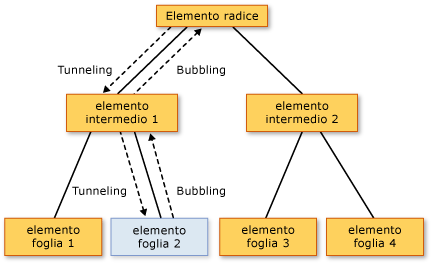

# Cenni preliminari sugli eventi indirizzati
In questo argomento viene descritto il concetto di eventi indirizzati in [!INCLUDE[TLA#tla_winclient](../../../../includes/tlasharptla-winclient-md.md)].  Nell'argomento viene definita la terminologia degli eventi indirizzati e vengono illustrate la modalità in cui questi eventi sono indirizzati attraverso una struttura ad albero di elementi, la modalità di gestione degli eventi indirizzati e la modalità di creazione di eventi indirizzati personalizzati.  
  
   
  
   
## Prerequisiti  
 In questo argomento si presuppone una conoscenza di base della programmazione [!INCLUDE[TLA#tla_clr](../../../../includes/tlasharptla-clr-md.md)] e orientata a oggetti, oltre che del modo in cui le relazioni tra elementi [!INCLUDE[TLA2#tla_winclient](../../../../includes/tla2sharptla-winclient-md.md)] possono essere concettualizzate come una struttura ad albero.  Per seguire gli esempi illustrati in questo argomento, è necessaria inoltre la comprensione di [!INCLUDE[TLA#tla_xaml](../../../../includes/tlasharptla-xaml-md.md)] e della modalità di scrittura di applicazioni o pagine [!INCLUDE[TLA2#tla_winclient](../../../../includes/tla2sharptla-winclient-md.md)] di base.  Per ulteriori informazioni, vedere [Procedura dettagliata: introduzione a WPF](../../../../docs/framework/wpf/getting-started/walkthrough-my-first-wpf-desktop-application.md) e [Cenni preliminari su XAML \(WPF\)](../../../../docs/framework/wpf/advanced/xaml-overview-wpf.md).  
  
   
## Definizione di evento indirizzato  
 È possibile considerare gli eventi indirizzati da un punto di vista funzionale o da una prospettiva di implementazione.  Entrambe le definizioni sono presentate in questo argomento, poiché alcuni utenti trovano più utile l'una o l'altra definizione.  
  
 Definizione funzionale: un evento indirizzato è un tipo di evento che può richiamare gestori su più listener in una struttura ad albero di elementi, anziché solo sull'oggetto che ha generato l'evento.  
  
 Definizione di implementazione: un [evento indirizzato](GTMT) è un evento [!INCLUDE[TLA2#tla_clr](../../../../includes/tla2sharptla-clr-md.md)] supportato da un'istanza della classe <xref:System.Windows.RoutedEvent> ed elaborato dal sistema di eventi [!INCLUDE[TLA#tla_winclient](../../../../includes/tlasharptla-winclient-md.md)].  
  
 Un'applicazione [!INCLUDE[TLA2#tla_winclient](../../../../includes/tla2sharptla-winclient-md.md)] tipica contiene molti elementi.  Indipendentemente dal fatto che vengano creati nel codice o dichiarati in [!INCLUDE[TLA2#tla_xaml](../../../../includes/tla2sharptla-xaml-md.md)], questi elementi si trovano in una relazione di struttura ad albero dell'elemento l'uno con l'altro.  La route dell'evento può procedere in una delle due direzioni in base alla definizione dell'evento, ma generalmente va dall'elemento di origine per essere successivamente propagata verso l'alto tramite la struttura ad albero dell'elemento finché non ne raggiunge la radice \(in genere una pagina o una finestra\).  Questo concetto di bubbling \(propagazione\) può risultare familiare se si è già precedentemente utilizzato il modello a oggetti DHTML.  
  
 Si consideri la semplice struttura ad albero dell'elemento riportata di seguito:  
  
 [!code-xml[EventOvwSupport#GroupButton](../../../../samples/snippets/csharp/VS_Snippets_Wpf/EventOvwSupport/CSharp/default.xaml#groupbutton)]  
  
 Questa struttura ad albero dell'elemento produce elementi simili ai seguenti:  
  
   
  
 In questa struttura ad albero dell'elemento semplificata, l'origine di un evento <xref:System.Windows.Controls.Primitives.ButtonBase.Click> è uno degli elementi <xref:System.Windows.Controls.Button> e l'oggetto <xref:System.Windows.Controls.Button> su cui è stato fatto clic è il primo elemento che ha l'opportunità di gestire l'evento.  Se nessun gestore associato a <xref:System.Windows.Controls.Button> agisce sull'evento, tuttavia, l'evento si propagherà verso l'alto in direzione dell'elemento padre <xref:System.Windows.Controls.Button> nella struttura ad albero dell'elemento, che è <xref:System.Windows.Controls.StackPanel>.  Potenzialmente, l'evento si propaga verso <xref:System.Windows.Controls.Border>, quindi fino alla radice della pagina della struttura ad albero dell'elemento \(non illustrato\).  
  
 In altre parole, la route per questo evento <xref:System.Windows.Controls.Primitives.ButtonBase.Click> è:  
  
 Pulsante\-\-\> StackPanel\-\-\> Bordo\-\-\>...  
  
### Scenari di livello principale per gli eventi indirizzati  
 Di seguito viene riportato un breve riepilogo degli scenari alla base del concetto di evento indirizzato e la spiegazione dei motivi per cui un evento [!INCLUDE[TLA2#tla_clr](../../../../includes/tla2sharptla-clr-md.md)] tipico non era adatto per questi scenari:  
  
 **Composizione e incapsulamento di controlli**: diversi controlli di [!INCLUDE[TLA2#tla_winclient](../../../../includes/tla2sharptla-winclient-md.md)] sono caratterizzati da un modello di contenuto dettagliato.  Ad esempio, è possibile posizionare un'immagine all'interno di <xref:System.Windows.Controls.Button>, che estende efficacemente la struttura ad albero visuale del pulsante.  Tuttavia, l'immagine aggiunta non deve interrompere il comportamento di hit testing che determina la risposta di un pulsante a un oggetto <xref:System.Windows.Controls.Primitives.ButtonBase.Click> del contenuto, anche se l'utente fa clic su pixel che fanno tecnicamente parte dell'immagine.  
  
 **Singoli punti di associazione del gestore**: in [!INCLUDE[TLA#tla_winforms](../../../../includes/tlasharptla-winforms-md.md)], era necessario associare lo stesso gestore più volte per elaborare eventi che potevano essere generati da più elementi.  Gli eventi indirizzati consentono di associare il gestore una sola volta, come illustrato nell'esempio precedente, e di utilizzare la logica del gestore per determinare da quale punto proviene l'evento, se necessario.  Ad esempio, questo potrebbe essere il gestore per il codice [!INCLUDE[TLA2#tla_xaml](../../../../includes/tla2sharptla-xaml-md.md)] illustrato in precedenza:  
  
 [!code-csharp[EventOvwSupport#GroupButtonCodeBehind](../../../../samples/snippets/csharp/VS_Snippets_Wpf/EventOvwSupport/CSharp/default.xaml.cs#groupbuttoncodebehind)]
 [!code-vb[EventOvwSupport#GroupButtonCodeBehind](../../../../samples/snippets/visualbasic/VS_Snippets_Wpf/EventOvwSupport/visualbasic/default.xaml.vb#groupbuttoncodebehind)]  
  
 **Gestione di classi**: gli eventi indirizzati consentono un gestore statico definito dalla classe.  Questo gestore di classi ha la possibilità di gestire un evento prima di qualsiasi gestore di istanze associato.  
  
 **Riferimento a un evento senza reflection**: alcune tecniche di codice e di markup richiedono una modalità per identificare un evento specifico.  Un evento indirizzato crea un campo <xref:System.Windows.RoutedEvent> come identificatore, offrendo una tecnica di identificazione di eventi affidabile che non richiede reflection statica di runtime.  
  
### Modalità di implementazione degli eventi indirizzati  
 Un [evento indirizzato](GTMT) è un evento [!INCLUDE[TLA2#tla_clr](../../../../includes/tla2sharptla-clr-md.md)] supportato da un'istanza della classe <xref:System.Windows.RoutedEvent> e registrato con il sistema di eventi [!INCLUDE[TLA2#tla_winclient](../../../../includes/tla2sharptla-winclient-md.md)].  L'istanza di <xref:System.Windows.RoutedEvent> ottenuta dalla registrazione viene generalmente mantenuta come membro del campo `public` `static` `readonly` della classe che registra e pertanto "possiede" l'evento indirizzato.  La connessione all'evento [!INCLUDE[TLA2#tla_clr](../../../../includes/tla2sharptla-clr-md.md)] con nome identico \(in alcuni casi indicato come evento "wrapper"\) viene effettuata eseguendo l'override delle implementazioni `add` e `remove` dell'evento [!INCLUDE[TLA2#tla_clr](../../../../includes/tla2sharptla-clr-md.md)].  Normalmente, `add` e `remove` vengono conservati come un'impostazione predefinita implicita che utilizza la sintassi degli eventi specifica del linguaggio per l'aggiunta e la rimozione dei gestori di quell'evento.  Il meccanismo di supporto e connessione degli eventi indirizzati è concettualmente simile al modo in cui una [proprietà di dipendenza](GTMT) è una proprietà [!INCLUDE[TLA2#tla_clr](../../../../includes/tla2sharptla-clr-md.md)] supportata dalla classe <xref:System.Windows.DependencyProperty> e registrata con il sistema di proprietà [!INCLUDE[TLA2#tla_winclient](../../../../includes/tla2sharptla-winclient-md.md)].  
  
 Nell'esempio riportato di seguito viene illustrata la dichiarazione per un evento indirizzato `Tap` personalizzato, incluse la registrazione e l'esposizione del campo dell'identificatore <xref:System.Windows.RoutedEvent> e le implementazioni `add` e `remove` per l'evento `Tap`[!INCLUDE[TLA2#tla_clr](../../../../includes/tla2sharptla-clr-md.md)].  
  
 [!code-csharp[RoutedEventCustom#AddRemoveHandler](../../../../samples/snippets/csharp/VS_Snippets_Wpf/RoutedEventCustom/CSharp/SDKSampleLibrary/class1.cs#addremovehandler)]
 [!code-vb[RoutedEventCustom#AddRemoveHandler](../../../../samples/snippets/visualbasic/VS_Snippets_Wpf/RoutedEventCustom/VB/SDKSampleLibrary/Class1.vb#addremovehandler)]  
  
### Gestori di eventi indirizzati e XAML  
 Per aggiungere un gestore per un evento utilizzando [!INCLUDE[TLA2#tla_xaml](../../../../includes/tla2sharptla-xaml-md.md)], il nome dell'evento viene dichiarato come attributo sull'elemento che è un listener di eventi.  Il valore dell'attributo è il nome del metodo del gestore implementato che deve esistere nella classe parziale del file code\-behind.  
  
 [!code-xml[EventOvwSupport#SimplestSyntax](../../../../samples/snippets/csharp/VS_Snippets_Wpf/EventOvwSupport/CSharp/default.xaml#simplestsyntax)]  
  
 La sintassi [!INCLUDE[TLA2#tla_xaml](../../../../includes/tla2sharptla-xaml-md.md)] per l'aggiunta di gestori eventi [!INCLUDE[TLA2#tla_clr](../../../../includes/tla2sharptla-clr-md.md)] standard è la stessa utilizzata per l'aggiunta di gestori di eventi indirizzati, poiché i gestori vengono effettivamente aggiunti al wrapper di eventi [!INCLUDE[TLA2#tla_clr](../../../../includes/tla2sharptla-clr-md.md)] sotto cui si trova un'implementazione dell'evento indirizzato.  Per ulteriori informazioni sull'aggiunta di gestori eventi in [!INCLUDE[TLA2#tla_xaml](../../../../includes/tla2sharptla-xaml-md.md)], vedere [Cenni preliminari su XAML \(WPF\)](../../../../docs/framework/wpf/advanced/xaml-overview-wpf.md).  
  
   
## Strategie di routing  
 Gli eventi indirizzati utilizzano una di tre strategie di routing:  
  
-   **Bubbling**: vengono richiamati i gestori eventi sull'origine evento.  L'evento indirizzato viene quindi indirizzato agli elementi padre successivi fino a raggiungere la radice della struttura ad albero dell'elemento.  La maggior parte degli eventi indirizzati utilizzano la strategia di bubbling.  Gli eventi indirizzati di bubbling vengono generalmente utilizzati per segnalare modifiche di input o dello stato da controlli distinti o altri elementi dell'interfaccia utente.  
  
-   **Diretto**: solo all'elemento di origine stesso viene data la possibilità di richiamare i gestori in risposta.  Questa strategia è analoga al "routing" utilizzato da [!INCLUDE[TLA#tla_winforms](../../../../includes/tlasharptla-winforms-md.md)] per gli eventi.  Tuttavia, a differenza di un evento [!INCLUDE[TLA2#tla_clr](../../../../includes/tla2sharptla-clr-md.md)] standard, gli eventi indirizzati diretti supportano la gestione di classi \(concetto spiegato in una sezione successiva\) e possono essere utilizzati da <xref:System.Windows.EventSetter> e <xref:System.Windows.EventTrigger>.  
  
-   **Tunneling**: inizialmente vengono richiamati i gestori eventi alla radice della struttura ad albero dell'elemento.  L'evento indirizzato si sposta quindi in una route attraverso elementi figlio successivi, verso l'elemento nodo che rappresenta l'origine dell'evento indirizzato \(elemento che ha generato l'evento indirizzato\).  Gli eventi indirizzati di tunneling vengono spesso utilizzati o gestiti come parte della composizione di un controllo, affinché sia possibile eliminare eventi da parti composite o sostituirli con eventi specifici del controllo completo, in modo intenzionale.  Gli eventi di input forniti in [!INCLUDE[TLA2#tla_winclient](../../../../includes/tla2sharptla-winclient-md.md)] vengono spesso implementati come una coppia di tunneling\/bubbling.  In alcuni casi, gli eventi di tunneling sono anche indicati come eventi in anteprima, per una convenzione di denominazione utilizzata per le coppie.  
  
   
## Vantaggi offerti dall'utilizzo degli eventi indirizzati  
 Per gli sviluppatori di applicazioni non è sempre necessario o importante sapere se l'evento gestito venga implementato come evento indirizzato.  Gli eventi indirizzati hanno un comportamento speciale, ma tale comportamento è praticamente invisibile se l'evento viene gestito sull'elemento in cui è stato generato.  
  
 Gli eventi indirizzati sono particolarmente efficace in uno degli scenari suggeriti: definizione di gestori comuni in corrispondenza di una radice comune, composizione di un controllo personalizzato o definizione di una classe di controlli personalizzata.  
  
 Non è necessario che i listener e le origini di eventi indirizzati condividano un evento comune nella gerarchia.  Qualsiasi <xref:System.Windows.UIElement> o <xref:System.Windows.ContentElement> può essere un listener di eventi per qualsiasi evento indirizzato.  Pertanto, è possibile utilizzare l'insieme completo di eventi indirizzati disponibile in tutto l'insieme di [!INCLUDE[TLA2#tla_api](../../../../includes/tla2sharptla-api-md.md)] come interfaccia concettuale tramite cui elementi diversi dell'applicazione possono scambiarsi informazioni sugli eventi.  Questo concetto di interfaccia per gli eventi indirizzati è particolarmente adatto agli eventi di input.  
  
 Gli eventi indirizzati possono essere utilizzati anche per comunicare tramite la struttura ad albero dell'elemento, poiché i dati dell'evento vengono trasmessi a ogni elemento nella route.  Se un elemento modifica in qualche modo i dati dell'evento, tale modifica risulterebbe disponibile per l'elemento successivo nella route.  
  
 Oltre all'aspetto del routing, vi sono altri due motivi per i quali un qualsiasi evento [!INCLUDE[TLA2#tla_winclient](../../../../includes/tla2sharptla-winclient-md.md)] può essere implementato come evento indirizzato, anziché come evento [!INCLUDE[TLA2#tla_clr](../../../../includes/tla2sharptla-clr-md.md)] standard.  Se si implementano eventi personalizzati, è opportuno inoltre considerare questi principi:  
  
-   Alcune funzionalità di applicazione di stili e modelli di [!INCLUDE[TLA2#tla_winclient](../../../../includes/tla2sharptla-winclient-md.md)], ad esempio <xref:System.Windows.EventSetter> e <xref:System.Windows.EventTrigger>, richiedono che l'evento a cui si fa riferimento sia un evento indirizzato.  Si tratta dello scenario di identificatore dell'evento riportato in precedenza.  
  
-   Gli eventi indirizzati supportano un meccanismo di gestione di classi in base al quale la classe può specificare metodi statici che hanno la possibilità di gestire eventi indirizzati prima che qualsiasi gestore di istanze registrato possa accedervi.  Questa funzionalità è molto utile nella progettazione di controlli, poiché la classe può imporre comportamenti di classe basati su eventi che non è possibile eliminare accidentalmente mediante la gestione di un evento su un'istanza.  
  
 Ognuna delle considerazioni precedenti viene discussa in una sezione separata di questo argomento.  
  
   
## Aggiunta e implementazione di un gestore eventi per un evento indirizzato  
 Per aggiungere un gestore eventi in [!INCLUDE[TLA2#tla_xaml](../../../../includes/tla2sharptla-xaml-md.md)], è sufficiente aggiungere il nome dell'evento a un elemento come attributo e impostare il valore dell'attributo come nome del gestore eventi che implementa un delegato adatto, come nell'esempio riportato di seguito.  
  
 [!code-xml[EventOvwSupport#SimplestSyntax](../../../../samples/snippets/csharp/VS_Snippets_Wpf/EventOvwSupport/CSharp/default.xaml#simplestsyntax)]  
  
 `b1SetColor` è il nome del gestore implementato che contiene il codice che gestisce l'evento <xref:System.Windows.Controls.Primitives.ButtonBase.Click>.  `b1SetColor` deve avere la stessa firma del delegato <xref:System.Windows.RoutedEventHandler>, che è il delegato del gestore eventi per l'evento <xref:System.Windows.Controls.Primitives.ButtonBase.Click>.  Il primo parametro di tutti i delegati del gestore eventi indirizzati specifica l'elemento al quale viene aggiunto il gestore eventi, mentre il secondo parametro specifica i dati per l'evento.  
  
 [!code-csharp[EventOvwSupport#SimpleHandlerA](../../../../samples/snippets/csharp/VS_Snippets_Wpf/EventOvwSupport/CSharp/default.xaml.cs#simplehandlera)]
 [!code-vb[EventOvwSupport#SimpleHandlerA](../../../../samples/snippets/visualbasic/VS_Snippets_Wpf/EventOvwSupport/visualbasic/default.xaml.vb#simplehandlera)]  
[!code-csharp[EventOvwSupport#SimpleHandlerB](../../../../samples/snippets/csharp/VS_Snippets_Wpf/EventOvwSupport/CSharp/default.xaml.cs#simplehandlerb)]
[!code-vb[EventOvwSupport#SimpleHandlerB](../../../../samples/snippets/visualbasic/VS_Snippets_Wpf/EventOvwSupport/visualbasic/default.xaml.vb#simplehandlerb)]  
  
 <xref:System.Windows.RoutedEventHandler> è il delegato del gestore eventi indirizzati di base.  Per gli eventi indirizzati specializzati per determinati controlli o scenari, i delegati da utilizzare per i gestori eventi indirizzati possono anche essere più specializzati, in modo da poter trasmettere dati di eventi specializzati.  Ad esempio, in uno scenario di input comune è possibile gestire un evento indirizzato <xref:System.Windows.UIElement.DragEnter>.  Il gestore deve implementare il delegato <xref:System.Windows.DragEventHandler>.  Utilizzando il delegato più specifico, è possibile elaborare <xref:System.Windows.DragEventArgs> nel gestore e leggere la proprietà <xref:System.Windows.DragEventArgs.Data%2A> che contiene il payload degli Appunti dell'operazione di trascinamento.  
  
 Per un esempio completo della modalità di aggiunta di un gestore eventi a un elemento tramite [!INCLUDE[TLA2#tla_xaml](../../../../includes/tla2sharptla-xaml-md.md)], vedere [Gestire un evento indirizzato](../../../../docs/framework/wpf/advanced/how-to-handle-a-routed-event.md).  
  
 L'aggiunta di un gestore per un evento indirizzato in un'applicazione creata nel codice è semplice.  I gestori eventi indirizzati possono sempre essere aggiunti tramite un metodo di supporto <xref:System.Windows.UIElement.AddHandler%2A> \(lo stesso metodo chiamato dal supporto esistente per `add`\). Tuttavia, gli eventi indirizzati [!INCLUDE[TLA2#tla_winclient](../../../../includes/tla2sharptla-winclient-md.md)] esistenti generalmente dispongono di implementazioni di supporto per la logica `add` e `remove` che consentono l'aggiunta di gestori per eventi indirizzati tramite una sintassi di evento specifica del linguaggio, soluzione più intuitiva rispetto al metodo di supporto.  Di seguito viene riportato un esempio di utilizzo del metodo di supporto:  
  
 [!code-csharp[EventOvwSupport#AddHandlerCode](../../../../samples/snippets/csharp/VS_Snippets_Wpf/EventOvwSupport/CSharp/default.xaml.cs#addhandlercode)]
 [!code-vb[EventOvwSupport#AddHandlerCode](../../../../samples/snippets/visualbasic/VS_Snippets_Wpf/EventOvwSupport/visualbasic/default.xaml.vb#addhandlercode)]  
  
 Nell'esempio successivo viene illustrata la sintassi dell'operatore [!INCLUDE[TLA#tla_cshrp](../../../../includes/tlasharptla-cshrp-md.md)] \(la sintassi degli operatori di [!INCLUDE[TLA2#tla_visualb](../../../../includes/tla2sharptla-visualb-md.md)] è leggermente diversa a causa della gestione della dereferenziazione\):  
  
 [!code-csharp[EventOvwSupport#AddHandlerPlusEquals](../../../../samples/snippets/csharp/VS_Snippets_Wpf/EventOvwSupport/CSharp/default.xaml.cs#addhandlerplusequals)]
 [!code-vb[EventOvwSupport#AddHandlerPlusEquals](../../../../samples/snippets/visualbasic/VS_Snippets_Wpf/EventOvwSupport/visualbasic/default.xaml.vb#addhandlerplusequals)]  
  
 Per un esempio sulla modalità di aggiunta di un gestore eventi nel codice, vedere [Aggiungere un gestore eventi mediante codice](../../../../docs/framework/wpf/advanced/how-to-add-an-event-handler-using-code.md).  
  
 Se si utilizza [!INCLUDE[TLA2#tla_visualb](../../../../includes/tla2sharptla-visualb-md.md)], è anche possibile utilizzare la parola chiave `Handles` per aggiungere gestori come parte delle dichiarazioni dei gestori.  Per ulteriori informazioni, vedere [Visual Basic e la gestione degli eventi WPF](../../../../docs/framework/wpf/advanced/visual-basic-and-wpf-event-handling.md).  
  
   
### Concetto di gestito  
 Tutti gli eventi indirizzati condividono una classe base dei dati di evento comune, <xref:System.Windows.RoutedEventArgs>.  <xref:System.Windows.RoutedEventArgs> definisce la proprietà <xref:System.Windows.RoutedEventArgs.Handled%2A>, che accetta un valore booleano.  Lo scopo della proprietà <xref:System.Windows.RoutedEventArgs.Handled%2A> è quello di consentire a qualsiasi gestore eventi lungo la route di contrassegnare l'evento indirizzato come *gestito*, impostando il valore di <xref:System.Windows.RoutedEventArgs.Handled%2A> su `true`.  Dopo essere stato elaborato dal gestore in corrispondenza di un elemento lungo la route, i dati di evento condivisi vengono nuovamente riportati a ogni listener lungo la route.  
  
 Il valore di <xref:System.Windows.RoutedEventArgs.Handled%2A> influisce sul modo in cui un evento indirizzato viene riportato o elaborato durante lo spostamento in avanti nella route.  Se <xref:System.Windows.RoutedEventArgs.Handled%2A> è `true` nei dati di un evento indirizzato, i gestori che rimangono in ascolto per tale evento indirizzato su altri elementi generalmente non vengono più richiamati per tale particolare istanza dell'evento.  Questa situazione si verifica per i gestori associati in [!INCLUDE[TLA2#tla_xaml](../../../../includes/tla2sharptla-xaml-md.md)] e per i gestori aggiunti da sintassi di associazione dei gestori eventi specifiche del linguaggio, ad esempio `+=` o `Handles`.  Per la maggior parte degli scenari di gestori, il contrassegno di un evento come gestito tramite l'impostazione di <xref:System.Windows.RoutedEventArgs.Handled%2A> su `true` arresta il routing per una route di tunneling o di bubbling, nonché per qualsiasi evento gestito in un punto della route da un gestore di classi.  
  
 Tuttavia, esiste un meccanismo "handledEventsToo" tramite il quale i listener possono continuare ad eseguire gestori in risposta agli eventi indirizzati in cui <xref:System.Windows.RoutedEventArgs.Handled%2A> è `true` nei dati di evento.  In altre parole, la route dell'evento non viene effettivamente arrestata contrassegnando i dati di evento come gestiti.  Il meccanismo handledEventsToo può essere utilizzato solo nel codice o in <xref:System.Windows.EventSetter>:  
  
-   Nel codice, anziché utilizzare una sintassi di evento specifica del linguaggio adatta per eventi [!INCLUDE[TLA2#tla_clr](../../../../includes/tla2sharptla-clr-md.md)] generali, chiamare il metodo [!INCLUDE[TLA2#tla_winclient](../../../../includes/tla2sharptla-winclient-md.md)]<xref:System.Windows.UIElement.AddHandler%28System.Windows.RoutedEvent%2CSystem.Delegate%2CSystem.Boolean%29> per aggiungere il gestore.  Specificare il valore di `handledEventsToo` come `true`.  
  
-   In <xref:System.Windows.EventSetter>, impostare l'attributo <xref:System.Windows.EventSetter.HandledEventsToo%2A> su `true`.  
  
 Oltre al comportamento che lo stato <xref:System.Windows.RoutedEventArgs.Handled%2A> produce negli eventi indirizzati, il concetto di <xref:System.Windows.RoutedEventArgs.Handled%2A> ha delle implicazioni sulla modalità di progettazione di un'applicazione e sulla scrittura del codice del gestore eventi.  È possibile definire il concetto di <xref:System.Windows.RoutedEventArgs.Handled%2A> come un semplice protocollo esposto dagli eventi indirizzati.  La modalità esatta di utilizzo di questo protocollo dipende dallo sviluppatore, ma la progettazione concettuale relativa alla modalità di utilizzo previsto del valore di <xref:System.Windows.RoutedEventArgs.Handled%2A> è la seguente:  
  
-   Se un evento indirizzato è contrassegnato come gestito, non è necessario che venga gestito nuovamente da altri elementi lungo la route.  
  
-   Se un evento indirizzato non è contrassegnato come gestito, altri listener precedenti nella route hanno scelto di non registrare un gestore oppure i gestori registrati hanno scelto di non modificare i dati di evento e di impostare <xref:System.Windows.RoutedEventArgs.Handled%2A> su `true`.  È anche possibile, ovviamente, che il listener corrente sia il primo punto nella route. I gestori sul listener corrente a questo punto hanno tre possibilità:  
  
    -   Non intraprendere alcuna azione; l'evento rimane non gestito e viene indirizzato al listener successivo.  
  
    -   Eseguire il codice in risposta all'evento, ma stabilire che l'azione non era abbastanza rilevante per garantire il contrassegno dell'evento come gestito.  L'evento viene indirizzato al listener successivo.  
  
    -   Eseguire il codice in risposta all'evento.  Contrassegnare l'evento come gestito nei dati di evento passati al gestore, poiché l'azione intrapresa è stata ritenuta abbastanza rilevante per garantire il contrassegno dell'evento come gestito.  L'evento viene ancora indirizzato al listener successivo, ma con <xref:System.Windows.RoutedEventArgs.Handled%2A>\=`true` nei dati di evento, in modo che solo i listener `handledEventsToo` abbiano la possibilità di richiamare ulteriori gestori.  
  
 Questa progettazione concettuale è consolidata dal comportamento di routing descritto in precedenza: è più difficile, benché ancora possibile nel codice o negli stili, associare gestori per eventi indirizzati richiamati anche se un gestore precedente nella route ha già impostato <xref:System.Windows.RoutedEventArgs.Handled%2A> su `true`.  
  
 Per ulteriori informazioni su <xref:System.Windows.RoutedEventArgs.Handled%2A>, sulla gestione di classi di eventi indirizzati e sui consigli relativi ai casi in cui è opportuno contrassegnare un evento indirizzato come <xref:System.Windows.RoutedEventArgs.Handled%2A>, vedere [Contrassegno degli eventi indirizzati come gestiti e gestione delle classi](../../../../docs/framework/wpf/advanced/marking-routed-events-as-handled-and-class-handling.md).  
  
 Nelle applicazioni, è piuttosto comune gestire un evento indirizzato di bubbling solo sull'oggetto che lo ha generato, senza considerare minimamente le caratteristiche di routing dell'evento.  Tuttavia, è sempre opportuno contrassegnare l'evento indirizzato come gestito nei dati di evento, per evitare effetti collaterali imprevisti nel caso in cui un elemento più avanzato sulla struttura ad albero dell'elemento disponga di un gestore associato per quello stesso evento indirizzato.  
  
   
## Gestori di classi  
 Se viene definita una classe che deriva in qualche modo da <xref:System.Windows.DependencyObject>, è anche possibile definire e associare un gestore di classi per un evento indirizzato che è un membro di evento dichiarato o ereditato della classe.  I gestori di classi vengono richiamati prima di tutti i gestori di listener di istanze associati a un'istanza di tale classe, ogni volta che un evento indirizzato raggiunge un'istanza dell'elemento nella relativa route.  
  
 Alcuni controlli [!INCLUDE[TLA2#tla_winclient](../../../../includes/tla2sharptla-winclient-md.md)] dispongono della gestione intrinseca delle classi per determinati eventi indirizzati.  In questo modo potrebbe sembrare che l'evento indirizzato non venga mai generato, ma in realtà viene gestito da classi e, utilizzando determinate tecniche, l'evento indirizzato può essere ancora potenzialmente gestito dai gestori di istanze.  Inoltre, molte classi e controlli di base espongono metodi virtuali che possono essere utilizzati per eseguire l'override del comportamento di gestione di classi.  Per ulteriori informazioni su come evitare una gestione di classi indesiderata e sulla definizione di una gestione di classi in una classe personalizzata, vedere [Contrassegno degli eventi indirizzati come gestiti e gestione delle classi](../../../../docs/framework/wpf/advanced/marking-routed-events-as-handled-and-class-handling.md).  
  
   
## Eventi associati in WPF  
 Il linguaggio [!INCLUDE[TLA2#tla_xaml](../../../../includes/tla2sharptla-xaml-md.md)] definisce anche un tipo speciale di evento noto come *evento associato*.  Un evento associato consente di aggiungere un gestore per un determinato evento a un elemento arbitrario.  L'elemento che gestisce l'evento non deve definire o ereditare l'evento associato, né l'oggetto che genera potenzialmente l'evento né l'istanza della gestione di destinazione devono definire o possedere in altro modo tale evento come membro della classe.  
  
 Il sistema di input di [!INCLUDE[TLA2#tla_winclient](../../../../includes/tla2sharptla-winclient-md.md)] utilizza ampiamente gli eventi associati.  Tuttavia, quasi tutti questi eventi associati vengono inoltrati tramite elementi di base.  Gli eventi di input appaiono quindi come eventi indirizzati non associati equivalenti, membri della classe di elementi di base.  Ad esempio, l'evento associato sottostante <xref:System.Windows.Input.Mouse.MouseDown?displayProperty=fullName> può essere gestito più facilmente su qualsiasi <xref:System.Windows.UIElement> specificato utilizzando <xref:System.Windows.UIElement.MouseDown> su tale <xref:System.Windows.UIElement>, anziché utilizzare la sintassi dell'evento associato in [!INCLUDE[TLA2#tla_xaml](../../../../includes/tla2sharptla-xaml-md.md)] o nel codice.  
  
 Per ulteriori informazioni sugli eventi associati in [!INCLUDE[TLA2#tla_winclient](../../../../includes/tla2sharptla-winclient-md.md)], vedere [Cenni preliminari sugli eventi associati](../../../../docs/framework/wpf/advanced/attached-events-overview.md).  
  
   
## Nomi completi di eventi in XAML  
 Un altro utilizzo della sintassi simile alla sintassi dell'evento associato *nometipo*.*nomeevento*, benché non si tratti effettivamente dell'utilizzo di un evento associato, è rappresentato dall'associazion e di gestori per eventi indirizzati generati da elementi figlio.  I gestori vengono associati a un elemento padre comune, per sfruttare il routing degli eventi, anche se l'evento indirizzato rilevante potrebbe non essere membro dell'elemento padre.  Si consideri nuovamente questo esempio:  
  
 [!code-xml[EventOvwSupport#GroupButton](../../../../samples/snippets/csharp/VS_Snippets_Wpf/EventOvwSupport/CSharp/default.xaml#groupbutton)]  
  
 In questo caso, il listener dell'elemento padre in cui viene aggiunto il gestore è <xref:System.Windows.Controls.StackPanel>.  Tuttavia, viene aggiunto un gestore per un evento indirizzato che è stato dichiarato e che verrà generato dalla classe <xref:System.Windows.Controls.Button> \(in realtà <xref:System.Windows.Controls.Primitives.ButtonBase>, ma disponibile a <xref:System.Windows.Controls.Button> per ereditarietà\).  <xref:System.Windows.Controls.Button> è proprietario dell'evento, ma il sistema di eventi indirizzati consente l'associazione di gestori per qualsiasi evento indirizzato a qualsiasi listener di istanze <xref:System.Windows.UIElement> o <xref:System.Windows.ContentElement> che potrebbe associare listener per un evento [!INCLUDE[TLA#tla_clr](../../../../includes/tlasharptla-clr-md.md)] in altro modo.  In genere, lo spazio dei nomi xmlns predefinito per questi nomi completi di attributo di evento è lo spazio dei nomi xmlns predefinito di [!INCLUDE[TLA2#tla_winclient](../../../../includes/tla2sharptla-winclient-md.md)], ma è anche possibile specificare spazi dei nomi con prefisso per eventi indirizzati personalizzati.  Per ulteriori informazioni su xmlns, vedere [Spazi dei nomi XAML e mapping dello spazio dei nomi per XAML WPF](../../../../docs/framework/wpf/advanced/xaml-namespaces-and-namespace-mapping-for-wpf-xaml.md).  
  
   
## Eventi di input WPF  
 Un'applicazione frequente degli eventi indirizzati nella piattaforma [!INCLUDE[TLA2#tla_winclient](../../../../includes/tla2sharptla-winclient-md.md)] riguarda gli eventi di input. In [!INCLUDE[TLA2#tla_winclient](../../../../includes/tla2sharptla-winclient-md.md)], i nomi degli eventi indirizzati di tunneling sono preceduti dalla parola "Preview" per convenzione.  Gli eventi di input sono spesso in coppia, uno rappresenta l'evento di bubbling e l'altro quello di tunneling.  Ad esempio, l'evento <xref:System.Windows.ContentElement.KeyDown> e l'evento <xref:System.Windows.ContentElement.PreviewKeyDown> hanno la stessa firma: il primo è l'evento di input di bubbling e il secondo è l'evento di input di tunneling.  In alcuni casi, gli eventi di input hanno solo una versione di bubbling o solo una versione indirizzata diretta.  Nella documentazione, gli argomenti relativi agli eventi indirizzati contengono riferimenti incrociati a eventi indirizzati simili con strategie di routing alternative, se disponibili, e le sezioni nelle pagine di riferimenti gestiti chiariscono la strategia di routing per ogni evento indirizzato.  
  
 Gli eventi di input [!INCLUDE[TLA2#tla_winclient](../../../../includes/tla2sharptla-winclient-md.md)] in coppia vengono implementati in modo che una sola azione di input dell'utente, ad esempio la pressione di un pulsante del mouse, generi entrambi gli eventi indirizzati della coppia in sequenza.  Per prima cosa, viene generato l'evento di tunneling, che avanza nella route.  Successivamente, viene generato l'evento di bubbling, che avanza nella route.  I due eventi condividono letteralmente la stessa istanza dei dati di evento, poiché la chiamata al metodo <xref:System.Windows.UIElement.RaiseEvent%2A> nella classe di implementazione che genera l'evento di bubbling rimane in ascolto per i dati di evento dall'evento di tunneling e li riutilizza nel nuovo evento generato.  I listener con gestori per l'evento di tunneling hanno l'opportunità di contrassegnare per primi l'evento indirizzato come gestito \(prima i gestori di classi, quindi i gestori di istanze\).  Se un elemento nella route di tunneling ha contrassegnato l'evento indirizzato come gestito, i dati di evento già gestiti vengono inviati per l'evento di bubbling e i gestori tipici associati per gli eventi di input di bubbling equivalenti non vengono richiamati.  Dall'esterno, potrebbe sembrare che l'evento di bubbling gestito non sia mai stato generato.  Questo comportamento di gestione è utile per la composizione di controlli, in cui può essere opportuno che tutti gli eventi di input basati su hit test o gli eventi di input basati su stato attivo vengano riportati dal controllo finale, piuttosto che dalle relative parti composite.  L'elemento di controllo finale è più vicino alla radice nella composizione, pertanto ha la possibilità di gestire prima la classe dell'evento di tunneling ed eventualmente di sostituire tale evento indirizzato con un evento più specifico del controllo, come parte del codice sottostante la classe del controllo.  
  
 Come dimostrazione della modalità di funzionamento dell'elaborazione degli eventi di input, si consideri l'esempio di evento di input riportato di seguito.  Nell'illustrazione della struttura ad albero riportata di seguito, `leaf element #2` rappresenta l'origine di un evento `PreviewMouseDown` e di un evento `MouseDown`.  
  
   
Bubbling e tunneling degli eventi di input  
  
 L'ordine di elaborazione degli eventi è il seguente:  
  
1.  `PreviewMouseDown` \(tunneling\) sull'elemento radice.  
  
2.  `PreviewMouseDown` \(tunneling\) sull'elemento intermedio \#1.  
  
3.  `PreviewMouseDown` \(tunneling\) sull'elemento di origine \#2.  
  
4.  `MouseDown` \(bubbling\) sull'elemento di origine \#2.  
  
5.  `MouseDown` \(bubbling\) sull'elemento intermedio \#1.  
  
6.  `MouseDown` \(bubbling\) sull'elemento radice.  
  
 Un delegato del gestore eventi indirizzati fa riferimento a due oggetti: l'oggetto che ha generato l'evento e quello in cui è stato richiamato il gestore.  L'oggetto in cui è stato richiamato il gestore è quello indicato dal parametro `sender`.  L'oggetto in cui l'evento è stato generato per la prima volta è indicato dalla proprietà <xref:System.Windows.RoutedEventArgs.Source%2A> nei dati di evento.  Un evento indirizzato può ancora essere generato e gestito dallo stesso oggetto, nel qual caso `sender` e <xref:System.Windows.RoutedEventArgs.Source%2A> sono identici \(si tratta del caso riportato nei passaggi 3 e 4 nell'elenco di esempi di elaborazione degli eventi\).  
  
 A causa del tunneling e del bubbling, gli elementi padre ricevono eventi di input in cui <xref:System.Windows.RoutedEventArgs.Source%2A> è uno dei relativi elementi figlio.  Quando è importante conoscere l'elemento di origine, è possibile identificare l'elemento di origine mediante l'accesso alla proprietà <xref:System.Windows.RoutedEventArgs.Source%2A>.  
  
 In genere, dopo avere contrassegnato l'evento di input come <xref:System.Windows.RoutedEventArgs.Handled%2A>, non vengono richiamati ulteriori gestori.  Di solito, è necessario contrassegnare gli eventi di input come gestiti non appena viene richiamato un gestore che risponde alla gestione logica specifica dell'applicazione del significato dell'evento di input.  
  
 L'eccezione a questa istruzione generale sullo stato <xref:System.Windows.RoutedEventArgs.Handled%2A> è data dal fatto che i gestori di eventi di input registrati per ignorare intenzionalmente lo stato <xref:System.Windows.RoutedEventArgs.Handled%2A> dei dati di evento verranno ancora richiamati lungo la route.  Per ulteriori informazioni, vedere [Eventi di anteprima](../../../../docs/framework/wpf/advanced/preview-events.md) o [Contrassegno degli eventi indirizzati come gestiti e gestione delle classi](../../../../docs/framework/wpf/advanced/marking-routed-events-as-handled-and-class-handling.md).  
  
 Il modello dei dati di evento condivisi tra eventi di tunneling e di bubbling e la generazione sequenziale di eventi di tunneling e di bubbling non è un concetto generalmente vero per tutti gli eventi indirizzati.  Tale comportamento viene specificamente implementato dal modo in cui i dispositivi di input [!INCLUDE[TLA2#tla_winclient](../../../../includes/tla2sharptla-winclient-md.md)] scelgono di generare e connettere le coppie di eventi di input.  L'implementazione di eventi di input personalizzati è un scenario avanzato, ma è possibile scegliere di seguire tale modello anche per eventi di input personalizzati.  
  
 Alcune classi scelgono di gestire tramite classi determinati eventi di input, di solito con l'intenzione di ridefinire il significato di un determinato evento di input generato dall'utente all'interno di tale controllo e di generare un nuovo evento.  Per ulteriori informazioni, vedere [Contrassegno degli eventi indirizzati come gestiti e gestione delle classi](../../../../docs/framework/wpf/advanced/marking-routed-events-as-handled-and-class-handling.md).  
  
 Per ulteriori informazioni sull'input e su come input ed eventi interagiscono in scenari di applicazioni tipici, vedere [Cenni preliminari sull’input](../../../../docs/framework/wpf/advanced/input-overview.md).  
  
   
## EventSetter ed EventTrigger  
 Negli stili, è possibile includere una sintassi di gestione degli eventi [!INCLUDE[TLA2#tla_xaml](../../../../includes/tla2sharptla-xaml-md.md)] predichiarata nel markup utilizzando <xref:System.Windows.EventSetter>.  Quando lo stile viene applicato, il gestore a cui si fa riferimento viene aggiunto all'istanza a cui è stato applicato lo stile.  È possibile dichiarare un <xref:System.Windows.EventSetter> solo per un evento indirizzato.  Di seguito è riportato un esempio.  Si noti che il metodo `b1SetColor` a cui si fa riferimento qui si trova in un file code\-behind.  
  
 [!code-xml[EventOvwSupport#XAML2](../../../../samples/snippets/csharp/VS_Snippets_Wpf/EventOvwSupport/CSharp/page2.xaml#xaml2)]  
  
 Il vantaggio è dato dalla probabilità che lo stile contenga numerose altre informazioni che si possono applicare a qualsiasi pulsante nell'applicazione e il fatto che <xref:System.Windows.EventSetter> faccia parte di tale stile agevola il riutilizzo del codice anche a livello del markup.  Inoltre, <xref:System.Windows.EventSetter> estrae i nomi dei metodi per i gestori in modo più avanzato rispetto al markup generale di applicazioni e pagine.  
  
 Un'altra sintassi specializzata che combina le funzionalità di eventi indirizzati e animazioni di [!INCLUDE[TLA2#tla_winclient](../../../../includes/tla2sharptla-winclient-md.md)] è <xref:System.Windows.EventTrigger>.  Come con <xref:System.Windows.EventSetter>, solo gli eventi indirizzati possono essere utilizzati per <xref:System.Windows.EventTrigger>. In genere, <xref:System.Windows.EventTrigger> viene dichiarato come parte di uno stile, ma <xref:System.Windows.EventTrigger> può essere dichiarato anche su elementi a livello di pagina come parte della raccolta <xref:System.Windows.FrameworkElement.Triggers%2A> o in <xref:System.Windows.Controls.ControlTemplate>. <xref:System.Windows.EventTrigger> consente di specificare un oggetto <xref:System.Windows.Media.Animation.Storyboard> che viene eseguito ogni volta che un evento indirizzato raggiunge un elemento nella route che dichiara <xref:System.Windows.EventTrigger> per tale evento.  Il vantaggio di <xref:System.Windows.EventTrigger> rispetto alla semplice gestione dell'evento e al conseguente avvio di uno storyboard esistente è il fatto che <xref:System.Windows.EventTrigger> fornisce un controllo migliore sullo storyboard e sul relativo comportamento di runtime. Per ulteriori informazioni, vedere [Utilizzare i trigger di eventi per controllare uno storyboard in seguito al relativo avvio](../../../../docs/framework/wpf/graphics-multimedia/how-to-use-event-triggers-to-control-a-storyboard-after-it-starts.md).  
  
   
## Ulteriori informazioni sugli eventi indirizzati  
 In questo argomento gli eventi indirizzati vengono illustrati principalmente con lo scopo di descrivere i concetti di base e di fornire istruzioni sulle modalità e sui tempi di risposta agli eventi indirizzati già presenti nei vari elementi e controlli di base.  Tuttavia, è possibile creare un evento indirizzato personalizzato nella classe personalizzata insieme a tutto il supporto necessario, ad esempio classi e delegati di dati di evento specializzati.  Il proprietario dell'evento indirizzato può essere una classe qualsiasi, ma gli eventi indirizzati devono essere generati e gestiti da classi derivate da <xref:System.Windows.UIElement> o da <xref:System.Windows.ContentElement> per essere utili.  Per ulteriori informazioni sugli eventi personalizzati, vedere [Creare un evento indirizzato personalizzato](../../../../docs/framework/wpf/advanced/how-to-create-a-custom-routed-event.md).  
  
## Vedere anche  
 <xref:System.Windows.EventManager>   
 <xref:System.Windows.RoutedEvent>   
 <xref:System.Windows.RoutedEventArgs>   
 [Contrassegno degli eventi indirizzati come gestiti e gestione delle classi](../../../../docs/framework/wpf/advanced/marking-routed-events-as-handled-and-class-handling.md)   
 [Cenni preliminari sull’input](../../../../docs/framework/wpf/advanced/input-overview.md)   
 [Cenni preliminari sull'esecuzione di comandi](../../../../docs/framework/wpf/advanced/commanding-overview.md)   
 [Proprietà Dependency personalizzate](../../../../docs/framework/wpf/advanced/custom-dependency-properties.md)   
 [Strutture ad albero in WPF](../../../../docs/framework/wpf/advanced/trees-in-wpf.md)   
 [Modelli di eventi deboli](../../../../docs/framework/wpf/advanced/weak-event-patterns.md)