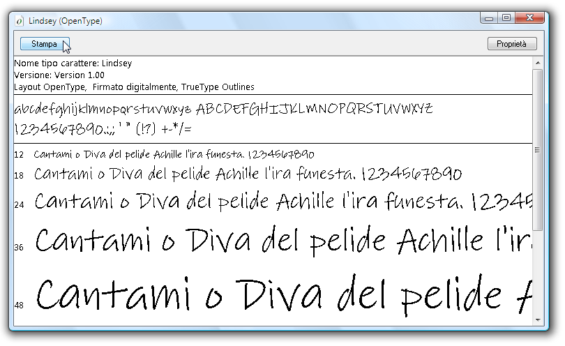

# Esempio di pacchetto di tipi di carattere OpenType
In questo argomento viene fornita una panoramica dei tipi di carattere [!INCLUDE[TLA#tla_opentype](../../../../includes/tlasharptla-opentype-md.md)] di esempio distribuiti con [!INCLUDE[TLA2#tla_wcsdk](../../../../includes/tla2sharptla-wcsdk-md.md)].  I tipi di carattere di esempio supportano funzionalità [!INCLUDE[TLA#tla_opentype](../../../../includes/tlasharptla-opentype-md.md)] estese che possono essere utilizzate dalle applicazioni [!INCLUDE[TLA#tla_winclient](../../../../includes/tlasharptla-winclient-md.md)].  
  
 [!INCLUDE[autoOutline](../Token/autoOutline_md.md)]  
  
   
## Tipi di carattere nel pacchetto di caratteri OpenType  
 [!INCLUDE[TLA2#tla_wcsdk](../../../../includes/tla2sharptla-wcsdk-md.md)] fornisce un insieme di tipi di carattere [!INCLUDE[TLA#tla_opentype](../../../../includes/tlasharptla-opentype-md.md)] di esempio che possono essere utilizzati nella creazione di applicazioni [!INCLUDE[TLA#tla_winclient](../../../../includes/tlasharptla-winclient-md.md)].  I tipi di carattere di esempio sono concessi in licenza da Ascender Corporation.  Questi tipi di carattere implementano solo un sottoinsieme delle funzionalità totali definite dal formato [!INCLUDE[TLA#tla_opentype](../../../../includes/tlasharptla-opentype-md.md)].  Nella tabella seguente sono elencati i nomi dei tipi di caratteri [!INCLUDE[TLA#tla_opentype](../../../../includes/tlasharptla-opentype-md.md)] di esempio.  
  
|**Nome**|**File**|  
|--------------|--------------|  
|Kootenay|Kooten.ttf|  
|Lindsey|Linds.ttf|  
|Miramonte|Miramo.ttf|  
|Miramonte Bold|Miramob.ttf|  
|Pericles|Peric.ttf|  
|Pericles Light|Pericl.ttf|  
|Pescadero|Pesca.ttf|  
|Pescadero Bold|Pescab.ttf|  
  
 Nell'illustrazione seguente viene illustrato l'aspetto dei tipi di carattere [!INCLUDE[TLA#tla_opentype](../../../../includes/tlasharptla-opentype-md.md)] di esempio.  
  
   
Tipi di carattere nel pacchetto di caratteri OpenType  
  
 I tipi di carattere di esempio sono concessi in licenza da Ascender Corporation.  Ascender è un provider di tipi di carattere avanzati.  Per ottenere in licenza versioni estese o personalizzate dei tipi di carattere di esempio, vedere il [sito Web di Ascender Corporation](http://go.microsoft.com/fwlink/?LinkId=182627) \(la pagina potrebbe essere in inglese\).  
  
> [!NOTE]
>  È responsabilità dello sviluppatore accertarsi di disporre dei diritti di licenza necessari per qualsiasi tipo di carattere incorporato all'interno di un'applicazione o ridistribuito in altro modo.  
  
   
## Installazione dei tipi di carattere  
 È possibile installare i tipi di carattere [!INCLUDE[TLA#tla_opentype](../../../../includes/tlasharptla-opentype-md.md)] di esempio nella directory dei tipi di carattere di [!INCLUDE[TLA#tla_mswin](../../../../includes/tlasharptla-mswin-md.md)] predefinita, ovvero **\\WINDOWS\\Fonts**.  Per installare i tipi di carattere, utilizzare il pannello di controllo Tipi di carattere.  Dopo aver installato questi tipi di carattere nel computer, tutte le applicazioni che fanno riferimento ai tipi di carattere predefiniti di [!INCLUDE[TLA#tla_mswin](../../../../includes/tlasharptla-mswin-md.md)] potranno accedere ai tipi di carattere installati. È possibile visualizzare un set di caratteri rappresentativo in diverse dimensioni facendo doppio clic sul file del tipo di carattere.  Nella schermata seguente viene illustrato il file del tipo di carattere Lindsey, ovvero Linds.ttf.  
  
   
Visualizzazione del tipo di carattere Lindsey  
  
   
## Utilizzo dei tipi di carattere  
 Nell'applicazione è possibile utilizzare i tipi di carattere in due modi.  È possibile aggiungere i tipi di carattere all'applicazione come elementi di contenuto del progetto non incorporati come risorse in un assembly.  In alternativa, è possibile aggiungere tipi di carattere all'applicazione come elementi di risorsa di progetto incorporati nei file assembly dell'applicazione.  Per ulteriori informazioni, vedere [Creazione di un package di tipi di carattere tramite applicazioni](../../../../docs/framework/wpf/advanced/packaging-fonts-with-applications.md).  
  
## Vedere anche  
 <xref:System.Windows.Documents.Typography>   
 [Funzionalità dei tipi di carattere OpenType](../../../../docs/framework/wpf/advanced/opentype-font-features.md)   
 [Creazione di un package di tipi di carattere tramite applicazioni](../../../../docs/framework/wpf/advanced/packaging-fonts-with-applications.md)