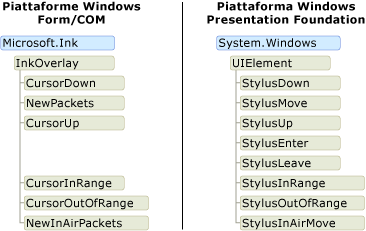
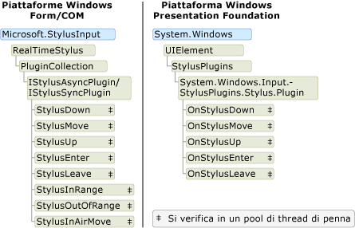

# Modello a oggetti Ink: confronto di Windows Form e COM con WPF
Sono essenzialmente tre le piattaforme che supportano l'input penna, la piattaforma Windows Form di Tablet PC, la piattaforma COM di Tablet PC e la piattaforma [!INCLUDE[TLA#tla_wpf](../../../../includes/tlasharptla-wpf-md.md)].  Le piattaforme Windows Form e COM condividono un modello a oggetti simile, mentre il modello a oggetti per la piattaforma [!INCLUDE[TLA2#tla_wpf](../../../../includes/tla2sharptla-wpf-md.md)] è sostanzialmente diverso.  In questo argomento vengono illustrate le differenze ad alto livello in modo che gli sviluppatori che hanno utilizzato un modello a oggetti possano comprendere anche l'altro.  
  
## Abilitazione dell'input penna in un'applicazione  
 Tutte e tre le piattaforme forniscono oggetti e controlli che consentono a un'applicazione di ricevere l'input da una penna del Tablet PC.  Nelle piattaforme Windows Form e COM sono disponibili le classi <xref:Microsoft.Ink.InkPicture>, <xref:Microsoft.Ink.InkEdit>, <xref:Microsoft.Ink.InkOverlay> e <xref:Microsoft.Ink.InkCollector>.  I controlli <xref:Microsoft.Ink.InkPicture> e <xref:Microsoft.Ink.InkEdit> possono essere aggiunti a un'applicazione per raccogliere l'input penna.  I controlli <xref:Microsoft.Ink.InkOverlay> e <xref:Microsoft.Ink.InkCollector> possono essere collegati a una finestra esistente per abilitare all'input penna le finestre e i controlli personalizzati.  
  
 La piattaforma WPF include il controllo <xref:System.Windows.Controls.InkCanvas>.  È possibile aggiungere un controllo <xref:System.Windows.Controls.InkCanvas> all'applicazione e avviare immediatamente la raccolta dell'input penna.  Il controllo <xref:System.Windows.Controls.InkCanvas> consente di copiare, selezionare e ridimensionare l'input penna.  È possibile aggiungere altri controlli a <xref:System.Windows.Controls.InkCanvas> e inserire grafia su di essi.  È possibile creare un controllo personalizzato che supporti l'input penna aggiungendo a esso un oggetto <xref:System.Windows.Controls.InkPresenter> e raccogliendo i relativi punti dello stilo.  
  
 Nella tabella seguente viene indicato dove ottenere ulteriori informazioni sul supporto dell'input penna in un'applicazione:  
  
|Per:|Nella piattaforma WPF:|Nelle piattaforme Windows Form\/COM:|  
|----------|----------------------------|------------------------------------------|  
|Aggiungere un controllo abilitato per l'input penna a un'applicazione|Vedere [Nozioni di base sull'input penna](../../../../docs/framework/wpf/advanced/getting-started-with-ink.md).|Vedere [Auto Claims Form Sample](http://msdn.microsoft.com/it-it/bec4333a-62ca-4254-a39b-04bc2c556992)|  
|Abilitare l'input penna su un controllo personalizzato|Vedere [Creazione di un controllo di input penna](../../../../docs/framework/wpf/advanced/creating-an-ink-input-control.md).|Vedere [Ink Clipboard Sample](http://msdn.microsoft.com/it-it/a0c42f1c-543d-44f8-83d9-fe810de410ff).|  
  
## Dati dell'input penna  
 Nelle piattaforme Windows Form e COM <xref:Microsoft.Ink.InkCollector>, <xref:Microsoft.Ink.InkOverlay>, <xref:Microsoft.Ink.InkEdit> e <xref:Microsoft.Ink.InkPicture> espongono ognuno un oggetto <xref:Microsoft.Ink.Ink?displayProperty=fullName>.  L'oggetto <xref:Microsoft.Ink.Ink> contiene i dati per uno o più oggetti <xref:Microsoft.Ink.Stroke?displayProperty=fullName> ed espone proprietà e metodi comuni per gestire e modificare questi tratti.  L'oggetto <xref:Microsoft.Ink.Ink> consente di gestire la durata dei tratti in esso contenuti, mentre l'oggetto <xref:Microsoft.Ink.Ink> consente di creare ed eliminare i tratti di sua proprietà.  Ogni oggetto <xref:Microsoft.Ink.Stroke> dispone di un identificatore univoco all'interno del relativo oggetto <xref:Microsoft.Ink.Ink> padre.  
  
 Nella piattaforma WPF la classe <xref:System.Windows.Ink.Stroke?displayProperty=fullName> è proprietaria della propria durata e la gestisce.  Un gruppo di oggetti <xref:System.Windows.Ink.Stroke> può essere raccolto in un oggetto <xref:System.Windows.Ink.StrokeCollection> che fornisce metodi per operazioni di gestione comuni dei dati dell'input penna quali hit testing, cancellazione, trasformazione e serializzazione dell'input penna.  Un oggetto <xref:System.Windows.Ink.Stroke> può appartenere, in un determinato momento, a zero, uno o più oggetti <xref:System.Windows.Ink.StrokeCollection>.  Anziché contenere un oggetto <xref:Microsoft.Ink.Ink?displayProperty=fullName>, gli oggetti <xref:System.Windows.Controls.InkCanvas> e <xref:System.Windows.Controls.InkPresenter> contengono un oggetto <xref:System.Windows.Ink.StrokeCollection?displayProperty=fullName>.  
  
 Nelle due illustrazioni seguenti vengono confrontati i modelli a oggetti dei dati dell'input penna.  Nelle piattaforme Windows Form e COM, l'oggetto <xref:Microsoft.Ink.Ink?displayProperty=fullName> limita la durata degli oggetti <xref:Microsoft.Ink.Stroke?displayProperty=fullName> e i pacchetti di stilo appartengono ai singoli tratti.  Due o più tratti possono fare riferimento allo stesso oggetto <xref:Microsoft.Ink.DrawingAttributes?displayProperty=fullName>, come illustrato di seguito.  
  
   
  
 Nella piattaforma [!INCLUDE[TLA2#tla_winclient](../../../../includes/tla2sharptla-winclient-md.md)], ogni <xref:System.Windows.Ink.Stroke?displayProperty=fullName> è un oggetto Common Language Runtime che esiste fino a quando un qualsiasi elemento contiene un riferimento a esso.  Ogni <xref:System.Windows.Ink.Stroke> fa riferimento agli oggetti <xref:System.Windows.Input.StylusPointCollection> e <xref:System.Windows.Ink.DrawingAttributes?displayProperty=fullName>, anch'essi oggetti Common Language Runtime.  
  
   
  
 Nella tabella seguente viene illustrato come eseguire alcune attività comuni nella piattaforma [!INCLUDE[TLA2#tla_wpf](../../../../includes/tla2sharptla-wpf-md.md)] e nelle piattaforme Windows Form e COM.  
  
|Task|Windows Presentation Foundation|Windows Forms e COM|  
|----------|-------------------------------------|-------------------------|  
|Salvare l'input penna|<xref:System.Windows.Ink.StrokeCollection.Save%2A>|<xref:Microsoft.Ink.Ink.Save%2A>|  
|Caricare l'input penna|Creare un oggetto <xref:System.Windows.Ink.StrokeCollection> con il costruttore <xref:System.Windows.Ink.StrokeCollection.%23ctor%28System.IO.Stream%29?displayProperty=fullName>.|[M:Microsoft.Ink.Ink.Load\(System.Byte\<xref:Microsoft.Ink.Ink.Load%2A>|  
|Eseguire hit test|<xref:System.Windows.Ink.StrokeCollection.HitTest%2A>|<xref:Microsoft.Ink.Ink.HitTest%2A>|  
|Copiare l'input penna|<xref:System.Windows.Controls.InkCanvas.CopySelection%2A>|<xref:Microsoft.Ink.Ink.ClipboardCopy%2A>|  
|Incollare l'input penna|<xref:System.Windows.Controls.InkCanvas.Paste%2A>|<xref:Microsoft.Ink.Ink.ClipboardPaste%2A>|  
|Accedere a proprietà personalizzate in una raccolta di tratti|<xref:System.Windows.Ink.StrokeCollection.AddPropertyData%2A> \(le proprietà sono archiviate internamente e accessibili tramite <xref:System.Windows.Ink.StrokeCollection.AddPropertyData%2A>, <xref:System.Windows.Ink.StrokeCollection.RemovePropertyData%2A> e <xref:System.Windows.Ink.StrokeCollection.ContainsPropertyData%2A>\)|Utilizzare <xref:Microsoft.Ink.Ink.ExtendedProperties%2A>|  
  
### Condivisione di input penna tra piattaforme  
 Sebbene le piattaforme offrano modelli a oggetti diversi per i dati dell'input penna, la condivisione tra piattaforme non presenta particolari problemi.  Nell'esempio riportato di seguito l'input penna viene salvato in un'applicazione Windows Form e caricato in un'applicazione Windows Presentation Foundation.  
  
 [!code-csharp[WinFormWPFInk#UsingWinforms](../../../../samples/snippets/csharp/VS_Snippets_Wpf/WinformWPFInk/CSharp/Program.cs#usingwinforms)]
 [!code-vb[WinFormWPFInk#UsingWinforms](../../../../samples/snippets/visualbasic/VS_Snippets_Wpf/WinformWPFInk/VisualBasic/Module1.vb#usingwinforms)]  
[!code-csharp[WinFormWPFInk#SaveWinforms](../../../../samples/snippets/csharp/VS_Snippets_Wpf/WinformWPFInk/CSharp/Program.cs#savewinforms)]
[!code-vb[WinFormWPFInk#SaveWinforms](../../../../samples/snippets/visualbasic/VS_Snippets_Wpf/WinformWPFInk/VisualBasic/Module1.vb#savewinforms)]  
  
 [!code-csharp[WinFormWPFInk#UsingWPF](../../../../samples/snippets/csharp/VS_Snippets_Wpf/WinformWPFInk/CSharp/Program.cs#usingwpf)]
 [!code-vb[WinFormWPFInk#UsingWPF](../../../../samples/snippets/visualbasic/VS_Snippets_Wpf/WinformWPFInk/VisualBasic/Module1.vb#usingwpf)]  
[!code-csharp[WinFormWPFInk#LoadWPF](../../../../samples/snippets/csharp/VS_Snippets_Wpf/WinformWPFInk/CSharp/Program.cs#loadwpf)]
[!code-vb[WinFormWPFInk#LoadWPF](../../../../samples/snippets/visualbasic/VS_Snippets_Wpf/WinformWPFInk/VisualBasic/Module1.vb#loadwpf)]  
  
 Nell'esempio riportato di seguito l'input penna viene salvato in un'applicazione Windows Presentation Foundation e caricato in un'applicazione Windows Form.  
  
 [!code-csharp[WinFormWPFInk#UsingWPF](../../../../samples/snippets/csharp/VS_Snippets_Wpf/WinformWPFInk/CSharp/Program.cs#usingwpf)]
 [!code-vb[WinFormWPFInk#UsingWPF](../../../../samples/snippets/visualbasic/VS_Snippets_Wpf/WinformWPFInk/VisualBasic/Module1.vb#usingwpf)]  
[!code-csharp[WinFormWPFInk#SaveWPF](../../../../samples/snippets/csharp/VS_Snippets_Wpf/WinformWPFInk/CSharp/Program.cs#savewpf)]
[!code-vb[WinFormWPFInk#SaveWPF](../../../../samples/snippets/visualbasic/VS_Snippets_Wpf/WinformWPFInk/VisualBasic/Module1.vb#savewpf)]  
  
 [!code-csharp[WinFormWPFInk#UsingWinforms](../../../../samples/snippets/csharp/VS_Snippets_Wpf/WinformWPFInk/CSharp/Program.cs#usingwinforms)]
 [!code-vb[WinFormWPFInk#UsingWinforms](../../../../samples/snippets/visualbasic/VS_Snippets_Wpf/WinformWPFInk/VisualBasic/Module1.vb#usingwinforms)]  
[!code-csharp[WinFormWPFInk#LoadWinforms](../../../../samples/snippets/csharp/VS_Snippets_Wpf/WinformWPFInk/CSharp/Program.cs#loadwinforms)]
[!code-vb[WinFormWPFInk#LoadWinforms](../../../../samples/snippets/visualbasic/VS_Snippets_Wpf/WinformWPFInk/VisualBasic/Module1.vb#loadwinforms)]  
  
## Eventi dalla penna del Tablet PC  
 All'immissione di dati con la penna per Tablet PC, gli oggetti <xref:Microsoft.Ink.InkOverlay>, <xref:Microsoft.Ink.InkCollector> e <xref:Microsoft.Ink.InkPicture> nelle piattaforme Windows Form e COM ricevono eventi.  L'oggetto <xref:Microsoft.Ink.InkOverlay> o <xref:Microsoft.Ink.InkCollector> è collegato a una finestra o a un controllo e può sottoscrivere gli eventi generati dai dati immessi con la penna per Tablet PC.  Il thread su cui si verificano questi eventi varia a seconda che gli eventi vengano generati con una penna, un mouse o a livello di codice.  Per ulteriori informazioni sul threading in relazione a questi eventi, vedere [General Threading Considerations](http://msdn.microsoft.com/it-it/cf35724f-5f80-4b3e-992a-a9d5ea99aae9) e [Threads on Which an Event Can Fire](http://msdn.microsoft.com/it-it/d1a5ab9b-d474-4ed7-9aa8-b5bdb771934f).  
  
 Nella piattaforma Windows Presentation Foundation, la classe <xref:System.Windows.UIElement> dispone di eventi per l'input penna.  Ogni controllo espone pertanto l'insieme completo di eventi dello stilo.  Gli eventi dello stilo dispongono di coppie di eventi di tunneling\/bubbling e si verificano sempre sul thread dell'applicazione.  Per ulteriori informazioni, vedere [Cenni preliminari sugli eventi indirizzati](../../../../docs/framework/wpf/advanced/routed-events-overview.md).  
  
 Nel diagramma riportato di seguito vengono confrontati i modelli a oggetti per le classi che generano gli eventi dello stilo.  Il modello a oggetti di Windows Presentation Foundation mostra solo gli eventi di bubbling, non quelli di tunneling.  
  
   
  
## Dati della penna  
 Tutte e tre le piattaforme consentono di intercettare e modificare i dati immessi tramite una penna per Tablet PC.  Nelle piattaforme Windows Form e COM queste operazioni possono essere eseguite creando un oggetto <xref:Microsoft.StylusInput.RealTimeStylus> a cui viene collegata una finestra o un controllo, quindi creando una classe che implementa l'interfaccia <xref:Microsoft.StylusInput.IStylusSyncPlugin> o <xref:Microsoft.StylusInput.IStylusAsyncPlugin>.  Il plug\-in personalizzato viene quindi aggiunto alla raccolta di plug\-in dell'oggetto <xref:Microsoft.StylusInput.RealTimeStylus>.  Per ulteriori informazioni su questo modello a oggetti, vedere [Architecture of the StylusInput APIs](http://msdn.microsoft.com/it-it/88bab0ab-df9f-4813-9a9f-9a137813f0b4).  
  
 Nella piattaforma [!INCLUDE[TLA2#tla_wpf](../../../../includes/tla2sharptla-wpf-md.md)] la classe <xref:System.Windows.UIElement> espone una raccolta di plug\-in, con progettazione simile a <xref:Microsoft.StylusInput.RealTimeStylus>.  Per intercettare i dati della penna, creare una classe che erediti da <xref:System.Windows.Input.StylusPlugIns.StylusPlugIn> e aggiungere l'oggetto alla raccolta <xref:System.Windows.UIElement.StylusPlugIns%2A> dell'oggetto <xref:System.Windows.UIElement>.  Per ulteriori informazioni su questa interazione, vedere [Intercettazione dell'input dello stilo](../../../../docs/framework/wpf/advanced/intercepting-input-from-the-stylus.md).  
  
 In tutte le piattaforme, un pool di thread riceve i dati dell'input pen tramite eventi dello stile e li invia al thread dell'applicazione.  Per ulteriori informazioni sul threading nelle piattaforme COM e Windows, vedere [Threading Considerations for the StylusInput APIs](http://msdn.microsoft.com/it-it/5d98768a-c60b-4bb0-8640-9bf38254d41f).  Per ulteriori informazioni sul threading nella piattaforma Windows Presentation Software, vedere [Modello di threading dell'input penna](../../../../docs/framework/wpf/advanced/the-ink-threading-model.md).  
  
 Nell'illustrazione seguente vengono confrontati i modelli a oggetti per le classi che ricevono i dati della penna sul pool di thread della penna.  
  
 