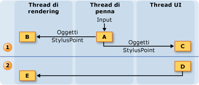
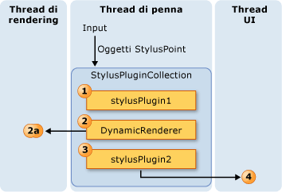
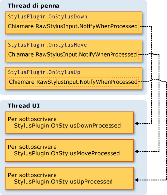
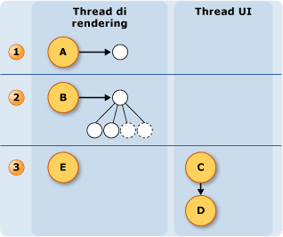

# Modello di threading dell&#39;input penna
Uno dei vantaggi dell'input penna in un Tablet PC è che dà all'utente la sensazione di scrivere con una normale penna su un foglio di carta.  Per ottenere questo risultato, la penna del Tablet PC raccoglie i dati di input a una velocità notevolmente superiore rispetto a un mouse ed esegue il rendering dell'input mentre viene scritto dall'utente.  Il thread dell'interfaccia utente dell'applicazione non è sufficiente per raccogliere dati della penna e sottoporre a rendering l'input, perché può essere bloccato.  Per risolvere questo problema, nelle applicazioni [!INCLUDE[TLA2#tla_winclient](../../../../includes/tla2sharptla-winclient-md.md)] vengono utilizzati due thread aggiuntivi quando un utente scrive input penna.  
  
 Nell'elenco seguente vengono descritti i thread che partecipano alla raccolta e al rendering dell'input penna:  
  
-   Thread di penna: il thread che accetta input dallo stilo.  In realtà si tratta di un pool di thread, ma in questo argomento viene citato come thread di penna.  
  
-   Thread dell'interfaccia utente dell'applicazione: il thread che controlla l'interfaccia utente dell'applicazione.  
  
-   Thread di rendering dinamico: il thread che esegue il rendering dell'input penna mentre l'utente traccia un tratto.  Il thread di rendering dinamico è diverso dal thread che esegue il rendering di altri elementi dell'interfaccia utente dell'applicazione, come accennato nella sezione [Modello di threading](../../../../docs/framework/wpf/advanced/threading-model.md) relativa a Window Presentation Foundation.  
  
 Il modello di input penna è identico sia che l'applicazione utilizzi il controllo <xref:System.Windows.Controls.InkCanvas> o un controllo personalizzato simile a quello descritto in [Creazione di un controllo di input penna](../../../../docs/framework/wpf/advanced/creating-an-ink-input-control.md).  Anche se in questo argomento il threading viene descritto relativamente all'oggetto <xref:System.Windows.Controls.InkCanvas>, gli stessi concetti si applicano anche quando si crea un controllo personalizzato.  
  
## Cenni preliminari sul threading  
 Nel diagramma seguente è illustrato il modello di threading quando un utente traccia un tratto:  
  
   
  
1.  Azioni che verificano mentre l'utente traccia il tratto  
  
    1.  Quando l'utente traccia un tratto, i punti dello stilo entrano nel thread di penna.  I plug\-in dello stilo, incluso <xref:System.Windows.Input.StylusPlugIns.DynamicRenderer>, accettano i punti dello stilo nel thread di penna e hanno la possibilità di modificarli prima che il controllo <xref:System.Windows.Controls.InkCanvas> li riceva.  
  
    2.  L'oggetto <xref:System.Windows.Input.StylusPlugIns.DynamicRenderer> esegue il rendering dei punti dello stilo nel thread di rendering dinamico.  Ciò si verifica contemporaneamente al passaggio precedente.  
  
    3.  Il controllo <xref:System.Windows.Controls.InkCanvas> riceve i punti dello stilo nel thread dell'interfaccia utente.  
  
2.  Azioni che verificano quando l'utente termina il tratto  
  
    1.  Quando l'utente termina di tracciare il tratto, il controllo <xref:System.Windows.Controls.InkCanvas> crea un oggetto <xref:System.Windows.Ink.Stroke> e lo aggiunge all'oggetto <xref:System.Windows.Controls.InkPresenter>, che lo sottopone a rendering statico.  
  
    2.  Il thread dell'interfaccia utente avvisa l'oggetto <xref:System.Windows.Input.StylusPlugIns.DynamicRenderer> che il tratto è stato sottoposto a rendering statico, quindi l'oggetto <xref:System.Windows.Input.StylusPlugIns.DynamicRenderer> rimuove la rappresentazione visiva del tratto.  
  
## Raccolta di input penna e plug\-in dello stilo  
 Ogni <xref:System.Windows.UIElement> include un oggetto <xref:System.Windows.Input.StylusPlugIns.StylusPlugInCollection>.  Gli oggetti <xref:System.Windows.Input.StylusPlugIns.StylusPlugIn> inclusi nell'oggetto <xref:System.Windows.Input.StylusPlugIns.StylusPlugInCollection> ricevono e possono modificare i punti dello stilo nel thread di penna.  Gli oggetti <xref:System.Windows.Input.StylusPlugIns.StylusPlugIn> ricevono i punti dello stilo in base al relativo ordine nell'oggetto <xref:System.Windows.Input.StylusPlugIns.StylusPlugInCollection>.  
  
 Nel diagramma seguente è illustrata la situazione ipotetica in cui la raccolta <xref:System.Windows.UIElement.StylusPlugIns%2A> di un oggetto <xref:System.Windows.UIElement> contiene `stylusPlugin1`, un oggetto <xref:System.Windows.Input.StylusPlugIns.DynamicRenderer>e `stylusPlugin2`, in questo ordine.  
  
   
  
 Nel diagramma precedente si verifica il comportamento seguente:  
  
1.  `StylusPlugin1` modifica i valori per x e y.  
  
2.  <xref:System.Windows.Input.StylusPlugIns.DynamicRenderer> riceve i punti dello stilo modificati e li sottopone a rendering nel thread di rendering dinamico.  
  
3.  `StylusPlugin2` riceve i punti dello stilo modificati e modifica ulteriormente i valori per x e y.  
  
4.  L'applicazione raccoglie i punti dello stilo e, quando l'utente termina il tratto, esegue il rendering statico del tratto.  
  
 Si supponga che `stylusPlugin1` limiti i punti dello stilo a un rettangolo e che `stylusPlugin2` li sposti a destra.  Nello scenario precedente l'oggetto <xref:System.Windows.Input.StylusPlugIns.DynamicRenderer> riceve i punti dello stilo limitati, ma non quelli spostati.  Una volta tracciato dall'utente, il tratto viene sottoposto a rendering all'interno dei limiti del rettangolo, ma appare spostato solo quando l'utente solleva la penna.  
  
### Esecuzione di operazioni con un plug\-in dello stilo nel thread dell'interfaccia utente  
 Poiché non è possibile eseguire hit test accurati sul thread di penna, alcuni elementi possono a volte ricevere input dello stilo destinato ad altri elementi.  Per verificare che l''input sia stato indirizzato correttamente prima di eseguire un'operazione, sottoscrivere ed eseguire l'operazione nel metodo <xref:System.Windows.Input.StylusPlugIns.StylusPlugIn.OnStylusDownProcessed%2A>, <xref:System.Windows.Input.StylusPlugIns.StylusPlugIn.OnStylusMoveProcessed%2A> o <xref:System.Windows.Input.StylusPlugIns.StylusPlugIn.OnStylusUpProcessed%2A>.  Questi metodi vengono richiamati dal thread dell'applicazione dopo l'esecuzione di hit test accurati.  Per sottoscrivere questi metodi, effettuare una chiamata al metodo <xref:System.Windows.Input.StylusPlugIns.RawStylusInput.NotifyWhenProcessed%2A> nel metodo che si verifica sul thread di penna.  
  
 Nel diagramma seguente è illustrata la relazione tra il thread di penna e il thread dell'interfaccia utente rispetto agli eventi dello stilo di un oggetto <xref:System.Windows.Input.StylusPlugIns.StylusPlugIn>.  
  
   
  
## Rendering dell'input penna  
 Quando l'utente traccia un tratto, l'oggetto <xref:System.Windows.Input.StylusPlugIns.DynamicRenderer> esegue il rendering dell'input penna in un thread distinto, in modo che sembri "fluire" dalla penna anche se il thread dell'interfaccia utente non è disponibile.  L'oggetto <xref:System.Windows.Input.StylusPlugIns.DynamicRenderer> compila una struttura ad albero visiva del thread di rendering dinamico mentre raccoglie punti dello stilo.  Quando l'utente termina il tratto, l'oggetto <xref:System.Windows.Input.StylusPlugIns.DynamicRenderer> chiede di ricevere una notifica quando l'applicazione esegue il passaggio di rendering successivo.  Dopo che l'applicazione ha completato il passaggio di rendering successivo, l'oggetto <xref:System.Windows.Input.StylusPlugIns.DynamicRenderer> pulisce la struttura ad albero visiva.  Nel diagramma che segue viene illustrato questo processo.  
  
   
  
1.  L'utente inizia il tratto.  
  
    1.  L'oggetto <xref:System.Windows.Input.StylusPlugIns.DynamicRenderer> crea la struttura ad albero visiva.  
  
2.  L'utente sta tracciando il tratto.  
  
    1.  L'oggetto <xref:System.Windows.Input.StylusPlugIns.DynamicRenderer> compila la struttura ad albero visiva.  
  
3.  L'utente termina il tratto.  
  
    1.  L'oggetto <xref:System.Windows.Controls.InkPresenter> aggiunge il tratto alla struttura ad albero visiva.  
  
    2.  Il tratto viene sottoposto a rendering statico tramite Media Integration Layer \(MIL\).  
  
    3.  L'oggetto <xref:System.Windows.Input.StylusPlugIns.DynamicRenderer> pulisce la visualizzazione.