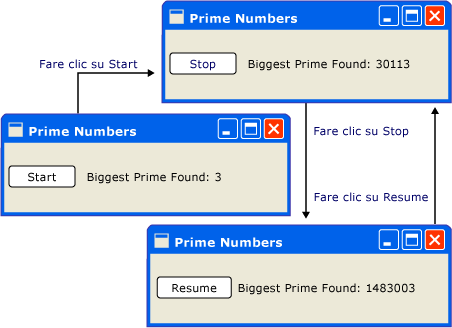
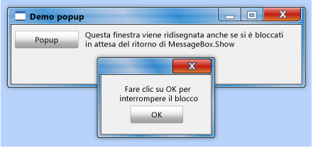
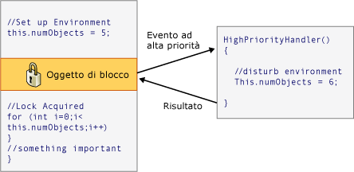

# Modello di threading
[!INCLUDE[TLA#tla_winclient](../../../../includes/tlasharptla-winclient-md.md)]è stato progettato per semplificare il threading. Di conseguenza, la maggior parte dei [!INCLUDE[TLA2#tla_winclient](../../../../includes/tla2sharptla-winclient-md.md)] non sarà necessario agli sviluppatori di scrivere un'interfaccia che utilizza più di un thread. Poiché i programmi con multithreading sono complessi e difficili da eseguire il debug, deve essere evitati quando sono disponibili soluzioni a thread singolo.  
  
 Nessun indipendentemente dall'architettura, tuttavia, non [!INCLUDE[TLA2#tla_ui](../../../../includes/tla2sharptla-ui-md.md)] framework sarà mai in grado di fornire una soluzione a thread singolo per ogni tipo di problema.              [!INCLUDE[TLA2#tla_winclient](../../../../includes/tla2sharptla-winclient-md.md)]si avvicina, ma esistono situazioni in cui più thread migliorano [!INCLUDE[TLA#tla_ui](../../../../includes/tlasharptla-ui-md.md)] delle prestazioni di velocità di risposta o l'applicazione. Dopo aver illustrato alcune nozioni di base, questo documento vengono illustrate alcune di queste situazioni e quindi si conclude con una descrizione di alcuni dettagli di basso livello.  
  
 [!INCLUDE[autoOutline](../Token/autoOutline_md.md)]  
  
> [!NOTE]
>  Questo argomento viene illustrato il threading utilizzando la <xref:System.Windows.Threading.Dispatcher.BeginInvoke%2A> metodo per le chiamate asincrone. È anche possibile effettuare chiamate asincrone chiamando il <xref:System.Windows.Threading.Dispatcher.InvokeAsync%2A> (metodo), che accettano un <xref:System.Action> o <xref:System.Func%601> come parametro.  Il <xref:System.Windows.Threading.Dispatcher.InvokeAsync%2A> metodo restituisce un <xref:System.Windows.Threading.DispatcherOperation> oppure <xref:System.Windows.Threading.DispatcherOperation%601>, che presenta un <xref:System.Windows.Threading.DispatcherOperation.Task%2A> proprietà. È possibile utilizzare il `await` (parola chiave) con il <xref:System.Windows.Threading.DispatcherOperation> o associato <xref:System.Threading.Tasks.Task>. Se è necessario attendere in modo sincrono il <xref:System.Threading.Tasks.Task> restituito da un <xref:System.Windows.Threading.DispatcherOperation> oppure <xref:System.Windows.Threading.DispatcherOperation%601>, chiamare il <xref:System.Windows.Threading.TaskExtensions.DispatcherOperationWait%2A> metodo di estensione.  La chiamata a <xref:System.Threading.Tasks.Task.Wait%2A?displayProperty=fullName> comporterà un deadlock. Per ulteriori informazioni sull'utilizzo di un <xref:System.Threading.Tasks.Task> per eseguire operazioni asincrone, vedere parallelismo delle attività.  Il <xref:System.Windows.Threading.Dispatcher.Invoke%2A> dispone inoltre di overload che accettano un <xref:System.Action> o <xref:System.Func%601> come parametro.  È possibile utilizzare il <xref:System.Windows.Threading.Dispatcher.Invoke%2A> per rendere sincrono chiama passando un delegato, <xref:System.Action> o <xref:System.Func%601>.  
  
   
## Panoramica e il Dispatcher  
 In genere, [!INCLUDE[TLA2#tla_winclient](../../../../includes/tla2sharptla-winclient-md.md)] applicazioni avviate con due thread: uno per la gestione per il rendering e l'altro per la gestione di [!INCLUDE[TLA2#tla_ui](../../../../includes/tla2sharptla-ui-md.md)]. Il thread di rendering in modo efficace viene eseguito in background durante il [!INCLUDE[TLA2#tla_ui](../../../../includes/tla2sharptla-ui-md.md)] thread riceve l'input, gestisce gli eventi, aggiorna la visualizzazione sullo schermo e viene eseguito il codice dell'applicazione. La maggior parte delle applicazioni utilizzano un singolo [!INCLUDE[TLA2#tla_ui](../../../../includes/tla2sharptla-ui-md.md)] thread, sebbene in alcune situazioni è preferibile utilizzare diversi. Tratteremo questo con un esempio in un secondo momento.  
  
 Il [!INCLUDE[TLA2#tla_ui](../../../../includes/tla2sharptla-ui-md.md)] thread accoda elementi di lavoro in un oggetto denominato un <xref:System.Windows.Threading.Dispatcher>. Il <xref:System.Windows.Threading.Dispatcher> seleziona gli elementi di lavoro in base alla priorità ed esegue ciascuno fino al completamento.  Ogni [!INCLUDE[TLA2#tla_ui](../../../../includes/tla2sharptla-ui-md.md)] thread deve essere presente almeno un <xref:System.Windows.Threading.Dispatcher>e ogni <xref:System.Windows.Threading.Dispatcher> può eseguire gli elementi di lavoro in un solo thread.  
  
 È la soluzione per compilare applicazioni reattive e intuitiva per ottimizzare il <xref:System.Windows.Threading.Dispatcher> contenendo gli elementi di lavoro piccola. In questo modo, gli elementi non rimarranno mai <xref:System.Windows.Threading.Dispatcher> coda in attesa di elaborazione. Qualsiasi ritardo percepibile tra input e di risposta può causare frustrazione un utente.  
  
 Come si sono [!INCLUDE[TLA2#tla_winclient](../../../../includes/tla2sharptla-winclient-md.md)] applicazioni deve per gestire operazioni più complesse? Se il codice comporta un calcolo di grandi dimensioni o deve eseguire una query di un database in un server remoto? In genere, la risposta è per la gestione dell'operazione in un thread separato, lasciando il [!INCLUDE[TLA2#tla_ui](../../../../includes/tla2sharptla-ui-md.md)] thread liberi di tendono a elementi di <xref:System.Windows.Threading.Dispatcher> coda. Al termine dell'operazione, è possibile segnalare il risultato al [!INCLUDE[TLA2#tla_ui](../../../../includes/tla2sharptla-ui-md.md)] thread per la visualizzazione.  
  
 In passato, [!INCLUDE[TLA#tla_mswin](../../../../includes/tlasharptla-mswin-md.md)] consente [!INCLUDE[TLA2#tla_ui](../../../../includes/tla2sharptla-ui-md.md)] elementi accessibile solo dal thread che li ha creati. Ciò significa che un thread in background responsabile di alcune attività a esecuzione prolungata non è possibile aggiornare una casella di testo al suo completamento.                  [!INCLUDE[TLA#tla_mswin](../../../../includes/tlasharptla-mswin-md.md)]scopo di garantire l'integrità del [!INCLUDE[TLA2#tla_ui](../../../../includes/tla2sharptla-ui-md.md)] componenti. Una casella di riepilogo potrebbe sembrare strano se il relativo contenuto sono stato aggiornato da un thread in background durante il disegno.  
  
 [!INCLUDE[TLA2#tla_winclient](../../../../includes/tla2sharptla-winclient-md.md)]include un meccanismo di esclusione reciproca incorporato che impone questa coordinazione. La maggior parte delle classi in [!INCLUDE[TLA2#tla_winclient](../../../../includes/tla2sharptla-winclient-md.md)] derivano da <xref:System.Windows.Threading.DispatcherObject>. In fase di costruzione, un <xref:System.Windows.Threading.DispatcherObject> archivia un riferimento di <xref:System.Windows.Threading.Dispatcher> collegato al thread attualmente in esecuzione. In effetti, il <xref:System.Windows.Threading.DispatcherObject> associato al thread che lo crea. Durante l'esecuzione del programma, un <xref:System.Windows.Threading.DispatcherObject> può chiamare pubblici <xref:System.Windows.Threading.DispatcherObject.VerifyAccess%2A> metodo.                  <xref:System.Windows.Threading.DispatcherObject.VerifyAccess%2A> esamina il <xref:System.Windows.Threading.Dispatcher> associato al thread corrente e confrontato con il <xref:System.Windows.Threading.Dispatcher> riferimento archiviato durante la costruzione. Se non corrispondono, <xref:System.Windows.Threading.DispatcherObject.VerifyAccess%2A> genera un'eccezione.                  <xref:System.Windows.Threading.DispatcherObject.VerifyAccess%2A> è destinato a essere chiamato all'inizio di ogni metodo appartenente a un <xref:System.Windows.Threading.DispatcherObject>.  
  
 Se solo un thread può modificare il [!INCLUDE[TLA2#tla_ui](../../../../includes/tla2sharptla-ui-md.md)], come interagiscono con l'utente i thread in background? Un thread in background può chiedere il [!INCLUDE[TLA2#tla_ui](../../../../includes/tla2sharptla-ui-md.md)] thread per eseguire un'operazione per suo conto. A tale scopo, la registrazione di un elemento di lavoro con il <xref:System.Windows.Threading.Dispatcher> del [!INCLUDE[TLA2#tla_ui](../../../../includes/tla2sharptla-ui-md.md)] thread. Il <xref:System.Windows.Threading.Dispatcher> classe fornisce due metodi per la registrazione degli elementi di lavoro: <xref:System.Windows.Threading.Dispatcher.Invoke%2A> e <xref:System.Windows.Threading.Dispatcher.BeginInvoke%2A>. Entrambi i metodi di pianificano un delegato per l'esecuzione.                  <xref:System.Windows.Threading.Dispatcher.Invoke%2A> una chiamata sincrona, ovvero non restituisce fino a quando il [!INCLUDE[TLA2#tla_ui](../../../../includes/tla2sharptla-ui-md.md)] thread non termina l'esecuzione del delegato.                  <xref:System.Windows.Threading.Dispatcher.BeginInvoke%2A> è asincrona e restituisce immediatamente.  
  
 Il <xref:System.Windows.Threading.Dispatcher> Ordina gli elementi nella coda in base alla priorità. Sono disponibili dieci livelli che possono essere specificati quando si aggiunge un elemento verso il <xref:System.Windows.Threading.Dispatcher> coda. Tali priorità vengono mantenute nel <xref:System.Windows.Threading.DispatcherPriority> enumerazione. Informazioni dettagliate sulla <xref:System.Windows.Threading.DispatcherPriority> livelli sono reperibili il [!INCLUDE[TLA2#tla_winfxsdk](../../../../includes/tla2sharptla-winfxsdk-md.md)] documentazione.  
  
   
## Thread in azione: esempi  
  
   
### Un'applicazione a thread singolo con un calcolo a esecuzione prolungata  
 La maggior parte dei [!INCLUDE[TLA#tla_gui#plural](../../../../includes/tlasharptla-guisharpplural-md.md)] dedicare gran parte del loro tempo di inattività durante l'attesa di eventi che vengono generati in risposta alle interazioni dell'utente. Con un'attenta programmazione questo tempo di inattività può essere usato modo costruttivo, senza modificare la velocità di risposta di [!INCLUDE[TLA2#tla_ui](../../../../includes/tla2sharptla-ui-md.md)]. Il [!INCLUDE[TLA2#tla_winclient](../../../../includes/tla2sharptla-winclient-md.md)] modello di threading non consente l'input interrompere un'operazione in corso nel [!INCLUDE[TLA2#tla_ui](../../../../includes/tla2sharptla-ui-md.md)] thread. Ciò significa che sarà necessario ripristinare il <xref:System.Windows.Threading.Dispatcher> periodicamente al processo in attesa di eventi di input prima di ottenere non aggiornati.  
  
 Si consideri l'esempio seguente:  
  
   
  
 Questa semplice applicazione conta verso l'alto di tre, cercare i numeri primi. Quando l'utente sceglie il **avviare** pulsante, la ricerca ha inizio. Quando viene trovato un numero primo, l'interfaccia utente viene aggiornato con il rilevamento. In qualsiasi momento, l'utente può arrestare la ricerca.  
  
 Anche se è abbastanza semplice, la ricerca dei numeri primi potrebbe continuare all'infinito, che presenta alcune difficoltà.  Se venisse gestita l'intera ricerca all'interno dell'evento Click del pulsante, ci non sarà mai il [!INCLUDE[TLA2#tla_ui](../../../../includes/tla2sharptla-ui-md.md)] thread la possibilità di gestire altri eventi. Il [!INCLUDE[TLA2#tla_ui](../../../../includes/tla2sharptla-ui-md.md)] sarebbero in grado di rispondere all'input o elaborare i messaggi. Viene mai aggiornata e non rispondere alle selezioni dei pulsanti.  
  
 È possibile eseguire la ricerca dei numeri primi in un thread separato, ma quindi è necessario affrontare problemi di sincronizzazione. Con un approccio a thread singolo, è possibile aggiornare direttamente l'etichetta che elenca i primi più grande trovato.  
  
 Scomponendo l'attività di calcolo in blocchi gestibili, è possibile tornare periodicamente per la <xref:System.Windows.Threading.Dispatcher> ed elaborare gli eventi. In questo modo [!INCLUDE[TLA2#tla_winclient](../../../../includes/tla2sharptla-winclient-md.md)] l'opportunità di aggiornare lo schermo ed elaborare l'input.  
  
 È il modo migliore per dividere il tempo di elaborazione tra calcolo e la gestione degli eventi per gestire il calcolo dalla <xref:System.Windows.Threading.Dispatcher>. Tramite il <xref:System.Windows.Threading.Dispatcher.BeginInvoke%2A> (metodo), è possibile pianificare le verifiche dei numeri primi in quella coda che [!INCLUDE[TLA2#tla_ui](../../../../includes/tla2sharptla-ui-md.md)] provengono gli eventi. Nell'esempio viene pianificata solo un singolo numero primo contemporaneamente. Una volta completata la verifica dei numeri primi, è stato programmato immediatamente il controllo successivo. La ricerca procede solo dopo aver sospeso [!INCLUDE[TLA2#tla_ui](../../../../includes/tla2sharptla-ui-md.md)] gli eventi sono stati gestiti.  
  
   
  
 [!INCLUDE[TLA#tla_word](../../../../includes/tlasharptla-word-md.md)]esegue il controllo ortografico con questo meccanismo. Il controllo ortografico viene eseguito in background utilizzando il tempo di inattività di [!INCLUDE[TLA2#tla_ui](../../../../includes/tla2sharptla-ui-md.md)] thread. Esaminiamo ora il codice.  
  
 Nell'esempio seguente viene illustrato il codice XAML che crea l'interfaccia utente.  
  
 [!code-xml[ThreadingPrimeNumbers#ThreadingPrimeNumberXAML](../../../../samples/snippets/csharp/VS_Snippets_Wpf/ThreadingPrimeNumbers/CSharp/Window1.xaml#threadingprimenumberxaml)]  
  
 Nell'esempio seguente viene illustrato il code-behind.  
  
 [!code-csharp[ThreadingPrimeNumbers#ThreadingPrimeNumberCodeBehind](../../../../samples/snippets/csharp/VS_Snippets_Wpf/ThreadingPrimeNumbers/CSharp/Window1.xaml.cs#threadingprimenumbercodebehind)]
 [!code-vb[ThreadingPrimeNumbers#ThreadingPrimeNumberCodeBehind](../../../../samples/snippets/visualbasic/VS_Snippets_Wpf/ThreadingPrimeNumbers/visualbasic/mainwindow.xaml.vb#threadingprimenumbercodebehind)]  
  
 Nell'esempio seguente viene illustrato il gestore eventi per il <xref:System.Windows.Controls.Button>.  
  
 [!code-csharp[ThreadingPrimeNumbers#ThreadingPrimeNumberStartOrStop](../../../../samples/snippets/csharp/VS_Snippets_Wpf/ThreadingPrimeNumbers/CSharp/Window1.xaml.cs#threadingprimenumberstartorstop)]
 [!code-vb[ThreadingPrimeNumbers#ThreadingPrimeNumberStartOrStop](../../../../samples/snippets/visualbasic/VS_Snippets_Wpf/ThreadingPrimeNumbers/visualbasic/mainwindow.xaml.vb#threadingprimenumberstartorstop)]  
  
 Oltre ad aggiornare il testo sul <xref:System.Windows.Controls.Button>, questo gestore è responsabile della pianificazione della prima dei numeri primi aggiungendo un delegato per il <xref:System.Windows.Threading.Dispatcher> coda. Talvolta al termine delle operazioni, il gestore dell'evento di <xref:System.Windows.Threading.Dispatcher> il delegato per l'esecuzione viene selezionato.  
  
 Come accennato in precedenza, <xref:System.Windows.Threading.Dispatcher.BeginInvoke%2A> è il <xref:System.Windows.Threading.Dispatcher> membro utilizzato per pianificare un delegato per l'esecuzione. In questo caso, è stato scelto il <xref:System.Windows.Threading.DispatcherPriority> priorità. Il <xref:System.Windows.Threading.Dispatcher> il delegato verrà eseguito solo quando non sono presenti eventi importanti per l'elaborazione.                          [!INCLUDE[TLA2#tla_ui](../../../../includes/tla2sharptla-ui-md.md)]la velocità di risposta è più importante della ricerca di numeri. Si passa inoltre un nuovo delegato che rappresenta la routine di controllo di numero.  
  
 [!code-csharp[ThreadingPrimeNumbers#ThreadingPrimeNumberCheckNextNumber](../../../../samples/snippets/csharp/VS_Snippets_Wpf/ThreadingPrimeNumbers/CSharp/Window1.xaml.cs#threadingprimenumberchecknextnumber)]
 [!code-vb[ThreadingPrimeNumbers#ThreadingPrimeNumberCheckNextNumber](../../../../samples/snippets/visualbasic/VS_Snippets_Wpf/ThreadingPrimeNumbers/visualbasic/mainwindow.xaml.vb#threadingprimenumberchecknextnumber)]  
  
 Questo metodo controlla se il numero dispari successivo è un numero primo. Se è un numero primo, il metodo aggiorna direttamente il `bigPrime` <xref:System.Windows.Controls.TextBlock> di conseguenza. È possibile farlo perché il calcolo viene eseguito nello stesso thread utilizzato per creare il componente. Avevamo utilizzare un thread separato per il calcolo, si sarebbe stato necessario utilizzare un meccanismo di sincronizzazione più complesso ed eseguire l'aggiornamento nel [!INCLUDE[TLA2#tla_ui](../../../../includes/tla2sharptla-ui-md.md)] thread. Successivamente verrà illustrata questa situazione.  
  
 Per il codice sorgente completo per questo esempio, vedere il [applicazione Single-Threaded con calcolo di lunga durata](http://go.microsoft.com/fwlink/?LinkID=160038)  
  
   
### La gestione di un'operazione di blocco con un Thread in Background  
 Gestione delle operazioni di blocco in un'applicazione grafica può essere difficile. Non si desidera chiamare metodi di blocco da gestori eventi perché l'applicazione verrà visualizzata per bloccare. È possibile utilizzare un thread separato per gestire queste operazioni, ma al termine, è necessario eseguire la sincronizzazione con il [!INCLUDE[TLA2#tla_ui](../../../../includes/tla2sharptla-ui-md.md)] thread poiché è possibile modificare direttamente il [!INCLUDE[TLA2#tla_gui](../../../../includes/tla2sharptla-gui-md.md)] dal thread di lavoro. È possibile utilizzare <xref:System.Windows.Threading.Dispatcher.Invoke%2A> o <xref:System.Windows.Threading.Dispatcher.BeginInvoke%2A> per inserire delegati nel <xref:System.Windows.Threading.Dispatcher> del [!INCLUDE[TLA2#tla_ui](../../../../includes/tla2sharptla-ui-md.md)] thread. Alla fine, verranno eseguiti con l'autorizzazione per modificare questi delegati [!INCLUDE[TLA2#tla_ui](../../../../includes/tla2sharptla-ui-md.md)] elementi.  
  
 In questo esempio viene simulata una chiamata di procedura remota che recupera le previsioni meteo. Per eseguire questa chiamata viene utilizzato un thread di lavoro separato e viene pianificato un metodo di aggiornamento nel <xref:System.Windows.Threading.Dispatcher> della [!INCLUDE[TLA2#tla_ui](../../../../includes/tla2sharptla-ui-md.md)] al termine del thread.  
  
   
  
 [!code-csharp[ThreadingWeatherForecast#ThreadingWeatherCodeBehind](../../../../samples/snippets/csharp/VS_Snippets_Wpf/ThreadingWeatherForecast/CSharp/Window1.xaml.cs#threadingweathercodebehind)]
 [!code-vb[ThreadingWeatherForecast#ThreadingWeatherCodeBehind](../../../../samples/snippets/visualbasic/VS_Snippets_Wpf/ThreadingWeatherForecast/visualbasic/window1.xaml.vb#threadingweathercodebehind)]  
  
 Di seguito sono indicati alcuni dei dettagli di tenere presente.  
  
-   Creazione del gestore del pulsante  
  
     [!code-csharp[ThreadingWeatherForecast#ThreadingWeatherButtonHandler](../../../../samples/snippets/csharp/VS_Snippets_Wpf/ThreadingWeatherForecast/CSharp/Window1.xaml.cs#threadingweatherbuttonhandler)]
     [!code-vb[ThreadingWeatherForecast#ThreadingWeatherButtonHandler](../../../../samples/snippets/visualbasic/VS_Snippets_Wpf/ThreadingWeatherForecast/visualbasic/window1.xaml.vb#threadingweatherbuttonhandler)]  
  
 Quando si fa clic sul pulsante, viene visualizzato il disegno dell'orologio e viene avviata l'animazione. Disabilitare il pulsante. Viene chiamato il `FetchWeatherFromServer` metodo in un nuovo thread e viene quindi restituito, che consente il <xref:System.Windows.Threading.Dispatcher> per elaborare gli eventi nell'attesa di raccogliere le previsioni meteorologiche.  
  
-   Recupero delle previsioni meteorologiche  
  
     [!code-csharp[ThreadingWeatherForecast#ThreadingWeatherFetchWeather](../../../../samples/snippets/csharp/VS_Snippets_Wpf/ThreadingWeatherForecast/CSharp/Window1.xaml.cs#threadingweatherfetchweather)]
     [!code-vb[ThreadingWeatherForecast#ThreadingWeatherFetchWeather](../../../../samples/snippets/visualbasic/VS_Snippets_Wpf/ThreadingWeatherForecast/visualbasic/window1.xaml.vb#threadingweatherfetchweather)]  
  
 Per semplificare le operazioni, non abbiamo alcun codice di rete in questo esempio. Al contrario, il ritardo di accesso alla rete è simulare inserendo il nuovo thread per quattro secondi. In questo periodo, originale [!INCLUDE[TLA2#tla_ui](../../../../includes/tla2sharptla-ui-md.md)] thread è ancora in esecuzione e risponde agli eventi. Per illustrare questa situazione, che sono stati lasciati un'animazione in esecuzione e la riduzione a icona e massimizzare pulsanti inoltre continuano a lavorare.  
  
 Quando il ritardo è completo ed è stato scelto in modo casuale la previsione meteorologica, è possibile segnalare per la [!INCLUDE[TLA2#tla_ui](../../../../includes/tla2sharptla-ui-md.md)] thread. A tale scopo, la pianificazione di una chiamata a `UpdateUserInterface` nel [!INCLUDE[TLA2#tla_ui](../../../../includes/tla2sharptla-ui-md.md)] thread utilizzando tale thread <xref:System.Windows.Threading.Dispatcher>. Viene passata una stringa che descrive le condizioni meteorologiche a questa chiamata al metodo pianificata.  
  
-   L'aggiornamento di[!INCLUDE[TLA2#tla_ui](../../../../includes/tla2sharptla-ui-md.md)]  
  
     [!code-csharp[ThreadingWeatherForecast#ThreadingWeatherUpdateUI](../../../../samples/snippets/csharp/VS_Snippets_Wpf/ThreadingWeatherForecast/CSharp/Window1.xaml.cs#threadingweatherupdateui)]
     [!code-vb[ThreadingWeatherForecast#ThreadingWeatherUpdateUI](../../../../samples/snippets/visualbasic/VS_Snippets_Wpf/ThreadingWeatherForecast/visualbasic/window1.xaml.vb#threadingweatherupdateui)]  
  
 Quando il <xref:System.Windows.Threading.Dispatcher> nel [!INCLUDE[TLA2#tla_ui](../../../../includes/tla2sharptla-ui-md.md)] thread dispone di tempo, esegue la chiamata pianificata a `UpdateUserInterface`. Questo metodo interrompe l'animazione dell'orologio e sceglie un'immagine per descrivere le condizioni meteorologiche. Visualizza l'immagine e ripristina il pulsante "fetch forecast".  
  
   
### Più finestre, più thread  
 Alcuni [!INCLUDE[TLA2#tla_winclient](../../../../includes/tla2sharptla-winclient-md.md)] applicazioni richiedono più finestre di primo livello. È perfettamente accettabile che un Thread / <xref:System.Windows.Threading.Dispatcher> combinazione per gestire più finestre, ma talvolta più thread rappresentano una soluzione più efficiente. Ciò è particolarmente vero che nel caso di qualsiasi possibilità che una delle finestre monopolizzi il thread.  
  
 [!INCLUDE[TLA#tla_mswin](../../../../includes/tlasharptla-mswin-md.md)]Explorer funziona in questo modo. Ogni nuova finestra appartiene al processo originale, ma viene creato sotto il controllo di un thread indipendente.  
  
 Utilizzando un [!INCLUDE[TLA2#tla_winclient](../../../../includes/tla2sharptla-winclient-md.md)] <xref:System.Windows.Controls.Frame> controllo, è possibile visualizzare pagine Web. È possibile creare facilmente un semplice [!INCLUDE[TLA2#tla_ie](../../../../includes/tla2sharptla-ie-md.md)] sostituire. Iniziamo con una caratteristica importante: la possibilità di aprire una nuova finestra. Quando l'utente fa clic su "nuova finestra" pulsante, viene avviata una copia della finestra in un thread separato. In questo modo, le operazioni a esecuzione prolungata o di bloccante in una delle finestre di non bloccheranno tutte le altre finestre.  
  
 In realtà, il modello di browser Web è presente un modello di threading complicato. È stato scelto perché dovrebbe essere noto per la maggior parte dei lettori.  
  
 Nell'esempio seguente viene illustrato il codice.  
  
 [!code-xml[ThreadingMultipleBrowsers#ThreadingMultiBrowserXAML](../../../../samples/snippets/csharp/VS_Snippets_Wpf/ThreadingMultipleBrowsers/CSharp/Window1.xaml#threadingmultibrowserxaml)]  
  
 [!code-csharp[ThreadingMultipleBrowsers#ThreadingMultiBrowserCodeBehind](../../../../samples/snippets/csharp/VS_Snippets_Wpf/ThreadingMultipleBrowsers/CSharp/Window1.xaml.cs#threadingmultibrowsercodebehind)]
 [!code-vb[ThreadingMultipleBrowsers#ThreadingMultiBrowserCodeBehind](../../../../samples/snippets/visualbasic/VS_Snippets_Wpf/ThreadingMultipleBrowsers/VisualBasic/Window1.xaml.vb#threadingmultibrowsercodebehind)]  
  
 I segmenti di threading seguenti di questo codice sono le più interessanti in questo contesto:  
  
 [!code-csharp[ThreadingMultipleBrowsers#ThreadingMultiBrowserNewWindow](../../../../samples/snippets/csharp/VS_Snippets_Wpf/ThreadingMultipleBrowsers/CSharp/Window1.xaml.cs#threadingmultibrowsernewwindow)]
 [!code-vb[ThreadingMultipleBrowsers#ThreadingMultiBrowserNewWindow](../../../../samples/snippets/visualbasic/VS_Snippets_Wpf/ThreadingMultipleBrowsers/VisualBasic/Window1.xaml.vb#threadingmultibrowsernewwindow)]  
  
 Questo metodo viene chiamato quando la finestra"nuova" si fa clic sul pulsante. Crea un nuovo thread e viene avviata in modo asincrono.  
  
 [!code-csharp[ThreadingMultipleBrowsers#ThreadingMultiBrowserThreadStart](../../../../samples/snippets/csharp/VS_Snippets_Wpf/ThreadingMultipleBrowsers/CSharp/Window1.xaml.cs#threadingmultibrowserthreadstart)]
 [!code-vb[ThreadingMultipleBrowsers#ThreadingMultiBrowserThreadStart](../../../../samples/snippets/visualbasic/VS_Snippets_Wpf/ThreadingMultipleBrowsers/VisualBasic/Window1.xaml.vb#threadingmultibrowserthreadstart)]  
  
 Questo metodo è il punto di partenza per il nuovo thread. Creiamo una nuova finestra sotto il controllo di questo thread.                          [!INCLUDE[TLA2#tla_winclient](../../../../includes/tla2sharptla-winclient-md.md)]Crea automaticamente un nuovo <xref:System.Windows.Threading.Dispatcher> per gestire il nuovo thread. Per rendere funzionale la finestra è necessario avviare il <xref:System.Windows.Threading.Dispatcher>.  
  
   
## Dettagli tecnici e difficoltà  
  
### Scrittura di componenti utilizzando il Threading  
 Il [!INCLUDE[TLA#tla_netframewk](../../../../includes/tlasharptla-netframewk-md.md)] Guida per sviluppatori descrive un modello al quale un componente può esporre il comportamento asincrono ai relativi client (vedere [Event-based Asynchronous Pattern Overview](../../../../docs/standard/asynchronous-programming-patterns/event-based-asynchronous-pattern-overview.md)). Ad esempio, supponiamo di creare un pacchetto di `FetchWeatherFromServer` metodo in un componente riutilizzabile e non grafico. Seguendo lo standard [!INCLUDE[TLA#tla_netframewk](../../../../includes/tlasharptla-netframewk-md.md)] modello, questo aspetto è simile a quanto segue.  
  
 [!code-csharp[CommandingOverviewSnippets#ThreadingArticleWeatherComponent1](../../../../samples/snippets/csharp/VS_Snippets_Wpf/CommandingOverviewSnippets/CSharp/Window1.xaml.cs#threadingarticleweathercomponent1)]
 [!code-vb[CommandingOverviewSnippets#ThreadingArticleWeatherComponent1](../../../../samples/snippets/visualbasic/VS_Snippets_Wpf/CommandingOverviewSnippets/visualbasic/window1.xaml.vb#threadingarticleweathercomponent1)]  
  
 `GetWeatherAsync`utilizzerebbe una delle tecniche descritte in precedenza, ad esempio la creazione di un thread in background, per le operazioni in modo asincrono, non bloccare il thread chiamante.  
  
 Una delle parti più importanti di questo modello consiste nel chiamare il *MethodName* `Completed` metodo sullo stesso thread che ha chiamato la *MethodName* `Async` di inizio del metodo. È possibile farlo utilizzando [!INCLUDE[TLA2#tla_winclient](../../../../includes/tla2sharptla-winclient-md.md)] abbastanza facilmente archiviando <xref:System.Windows.Threading.Dispatcher.CurrentDispatcher%2A>, ma quindi questo caso il componente potrebbe essere utilizzato solo [!INCLUDE[TLA2#tla_winclient](../../../../includes/tla2sharptla-winclient-md.md)] applicazioni, non in [!INCLUDE[TLA#tla_winforms](../../../../includes/tlasharptla-winforms-md.md)] o [!INCLUDE[TLA#tla_aspnet](../../../../includes/tlasharptla-aspnet-md.md)] programmi.  
  
 Il <xref:System.Windows.Threading.DispatcherSynchronizationContext> classe soddisfa questa esigenza, considerarlo come una versione semplificata di <xref:System.Windows.Threading.Dispatcher> che interagisce con altri [!INCLUDE[TLA2#tla_ui](../../../../includes/tla2sharptla-ui-md.md)] Framework.  
  
 [!code-csharp[CommandingOverviewSnippets#ThreadingArticleWeatherComponent2](../../../../samples/snippets/csharp/VS_Snippets_Wpf/CommandingOverviewSnippets/CSharp/Window1.xaml.cs#threadingarticleweathercomponent2)]
 [!code-vb[CommandingOverviewSnippets#ThreadingArticleWeatherComponent2](../../../../samples/snippets/visualbasic/VS_Snippets_Wpf/CommandingOverviewSnippets/visualbasic/window1.xaml.vb#threadingarticleweathercomponent2)]  
  
### Distribuzione annidata  
 In alcuni casi non è fattibile bloccare completamente il [!INCLUDE[TLA2#tla_ui](../../../../includes/tla2sharptla-ui-md.md)] thread. Si consideri il <xref:System.Windows.MessageBox.Show%2A> metodo il <xref:System.Windows.MessageBox> (classe).                          <xref:System.Windows.MessageBox.Show%2A> non viene restituita finché l'utente fa clic sul pulsante OK. , Tuttavia, creare una finestra che deve avere un ciclo di messaggi per essere interattive. Durante l'attesa per l'utente fare clic su OK, la finestra dell'applicazione originale non risponde all'input dell'utente. Tuttavia, continua a elaborare i messaggi di disegno. La finestra originale viene ridisegnato quando presentati e recuperabile.  
  
   
  
 Un thread deve essere responsabile della finestra di messaggio.                          [!INCLUDE[TLA2#tla_winclient](../../../../includes/tla2sharptla-winclient-md.md)]Impossibile creare un nuovo thread solo per la finestra di messaggio, ma questo thread non è in grado di disegnare gli elementi disabilitati nella finestra originale (tenere presente che la sezione relativa all'esclusione reciproca). Al contrario, [!INCLUDE[TLA2#tla_winclient](../../../../includes/tla2sharptla-winclient-md.md)] utilizza un sistema di elaborazione dei messaggi annidati. Il <xref:System.Windows.Threading.Dispatcher> classe include un metodo speciale denominato <xref:System.Windows.Threading.Dispatcher.PushFrame%2A>, che archivia il punto di esecuzione corrente di un'applicazione, quindi avvia un nuovo ciclo di messaggi. Al termine del ciclo di messaggi annidati, l'esecuzione riprende dopo l'originale <xref:System.Windows.Threading.Dispatcher.PushFrame%2A> chiamare.  
  
 In questo caso, <xref:System.Windows.Threading.Dispatcher.PushFrame%2A> mantiene il contesto di programma alla chiamata a <xref:System.Windows.MessageBox>.                         <xref:System.Windows.MessageBox.Show%2A>, e inizia un nuovo ciclo di messaggi per ridisegnare la finestra di sfondo e la gestione dell'input alla finestra di messaggio. Quando l'utente fa clic su OK e cancella la finestra popup, il ciclo nidificato viene chiuso e il controllo riprende dopo la chiamata a <xref:System.Windows.MessageBox.Show%2A>.  
  
### Eventi indirizzati non aggiornati  
 Il sistema di eventi indirizzati [!INCLUDE[TLA2#tla_winclient](../../../../includes/tla2sharptla-winclient-md.md)] notifica intere strutture ad albero quando vengono generati eventi.  
  
 [!code-xml[InputOvw#ThreadingArticleStaticRoutedEvent](../../../../samples/snippets/csharp/VS_Snippets_Wpf/InputOvw/CSharp/Page1.xaml#threadingarticlestaticroutedevent)]  
  
 Quando viene premuto il pulsante sinistro del mouse sull'ellisse, `handler2` viene eseguita. Dopo aver `handler2` al termine, l'evento viene passata al <xref:System.Windows.Controls.Canvas> oggetto, che utilizza `handler1` per elaborarlo. Ciò si verifica solo se `handler2` operazione viene eseguita in modo non esplicito contrassegna l'oggetto evento come gestito.  
  
 È possibile che `handler2` richiederà una notevole quantità di tempo di elaborazione di questo evento.                          `handler2`potrebbe utilizzare <xref:System.Windows.Threading.Dispatcher.PushFrame%2A> per avviare un ciclo di messaggi annidati che non restituisce per ore. Se `handler2` non contrassegna l'evento come gestito quando questo ciclo di messaggi viene completata, l'evento venga passato alla struttura ad albero, sebbene sia molto obsoleto.  
  
### Reentrancy e blocco  
 Il meccanismo di blocco di [!INCLUDE[TLA#tla_clr](../../../../includes/tlasharptla-clr-md.md)] non si comportano esattamente come prevedibile, ci si aspetterebbe annullare completamente l'operazione quando viene richiesto un blocco di un thread. In realtà, il thread continua a ricevere ed elaborare messaggi con priorità alta. Questo consente di evitare i deadlock e la reattività interfacce minima, ma introduce la possibilità che i bug.  La maggior parte dei casi non è necessario conoscere il linguaggio su questo, ma in rare circostanze (in genere [!INCLUDE[TLA2#tla_win32](../../../../includes/tla2sharptla-win32-md.md)] messaggi di finestra o i componenti COM STA) può essere molto utili.  
  
 La maggior parte delle interfacce non viene compilata con presente la sicurezza dei thread perché gli sviluppatori si basano sul presupposto che un [!INCLUDE[TLA2#tla_ui](../../../../includes/tla2sharptla-ui-md.md)] non possano accedere più thread. In questo caso, che singolo thread può apportare modifiche ambientali in momenti imprevisti, causando tali valido gli effetti di <xref:System.Windows.Threading.DispatcherObject> meccanismo di esclusione reciproca dovrebbe per risolvere. Si consideri il seguente pseudocodice:  
  
   
  
 La maggior parte del tempo che è la cosa giusta, ma esistono situazioni in [!INCLUDE[TLA2#tla_winclient](../../../../includes/tla2sharptla-winclient-md.md)] in tali rientranza imprevista può causare problemi. In tal caso, in determinati momenti chiave [!INCLUDE[TLA2#tla_winclient](../../../../includes/tla2sharptla-winclient-md.md)] chiamate <xref:System.Windows.Threading.Dispatcher.DisableProcessing%2A>, che modifica l'istruzione di blocco per il thread da utilizzare il [!INCLUDE[TLA2#tla_winclient](../../../../includes/tla2sharptla-winclient-md.md)] blocco senza reentrancy, anziché i soliti [!INCLUDE[TLA2#tla_clr](../../../../includes/tla2sharptla-clr-md.md)] blocco.  
  
 Perché è stato il [!INCLUDE[TLA2#tla_clr](../../../../includes/tla2sharptla-clr-md.md)] team scegliere questo comportamento? Aveva a che fare con gli oggetti COM apartment a thread singolo e il thread di finalizzazione. Quando un oggetto viene sottoposto a garbage collection, il relativo `Finalize` metodo viene eseguito sul thread del finalizzatore dedicato, non il [!INCLUDE[TLA2#tla_ui](../../../../includes/tla2sharptla-ui-md.md)] thread. Al suo interno si trova il problema, poiché un oggetto STA COM che è stato creato il [!INCLUDE[TLA2#tla_ui](../../../../includes/tla2sharptla-ui-md.md)] thread può essere eliminato solo sul [!INCLUDE[TLA2#tla_ui](../../../../includes/tla2sharptla-ui-md.md)] thread. Il [!INCLUDE[TLA2#tla_clr](../../../../includes/tla2sharptla-clr-md.md)] esegue l'equivalente di un <xref:System.Windows.Threading.Dispatcher.BeginInvoke%2A> (in questo caso utilizzando Win32 `SendMessage`). Se tuttavia il [!INCLUDE[TLA2#tla_ui](../../../../includes/tla2sharptla-ui-md.md)] thread non è disponibile, si blocca il thread del finalizzatore e non può essere eliminato l'oggetto COM STA, che consente di creare una perdita di memoria gravi. In modo che il [!INCLUDE[TLA2#tla_clr](../../../../includes/tla2sharptla-clr-md.md)] team eseguito la chiamata necessaria per rendere i blocchi funzionano in modo affermativo.  
  
 L'attività per [!INCLUDE[TLA2#tla_winclient](../../../../includes/tla2sharptla-winclient-md.md)] consiste nell'evitare una rientranza imprevista senza causare la perdita di memoria, per questo motivo, non bloccati reentrancy ovunque.  
  
## Vedere anche  
 [Applicazione a thread singolo con calcolo di lunga durata](http://go.microsoft.com/fwlink/?LinkID=160038)