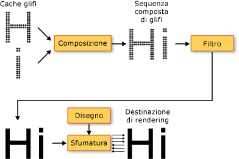
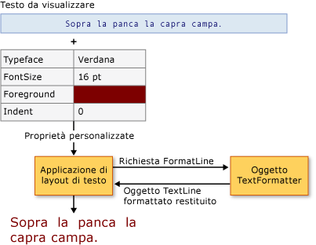

# Funzionalit&#224; tipografiche di WPF
In questo argomento vengono presentate le funzionalità tipografiche principali di [!INCLUDE[TLA2#tla_winclient](../../../../includes/tla2sharptla-winclient-md.md)].  Tra queste sono incluse qualità e prestazioni migliorate di rendering del testo, supporto tipografico di [!INCLUDE[TLA#tla_opentype](../../../../includes/tlasharptla-opentype-md.md)], testo internazionale migliorato, supporto avanzato dei tipi di carattere e nuove API \(Application Programming Interface\) di testo.  
  
 [!INCLUDE[autoOutline](../Token/autoOutline_md.md)]  
  
   
## Qualità e prestazioni del testo migliorate  
 Il rendering del testo in [!INCLUDE[TLA2#tla_winclient](../../../../includes/tla2sharptla-winclient-md.md)] viene eseguito utilizzando [!INCLUDE[TLA#tla_ct](../../../../includes/tlasharptla-ct-md.md)], che migliora la chiarezza e la leggibilità del testo.  [!INCLUDE[TLA2#tla_ct](../../../../includes/tla2sharptla-ct-md.md)] è una tecnologia software sviluppata da [!INCLUDE[TLA#tla_ms](../../../../includes/tlasharptla-ms-md.md)] che consente di migliorare la leggibilità del testo sui display LCD \(Liquid Crystal Display\), ad esempio gli schermi di computer portatili, Pocket PC e i monitor a schermo piatto.  In [!INCLUDE[TLA2#tla_ct](../../../../includes/tla2sharptla-ct-md.md)] viene utilizzato il rendering dei subpixel che consente di visualizzare il testo con maggiore fedeltà alla forma effettiva grazie all'allineamento dei caratteri a una parte frazionaria di un pixel.  La risoluzione aggiuntiva aumenta la nitidezza dei piccoli dettagli nella visualizzazione del testo, rendendone più facile la lettura per periodi prolungati.  Un altro miglioramento di [!INCLUDE[TLA2#tla_ct](../../../../includes/tla2sharptla-ct-md.md)] in [!INCLUDE[TLA2#tla_winclient](../../../../includes/tla2sharptla-winclient-md.md)] è l'anti\-aliasing con direzione y che smussa le parti superiori e inferiori delle curve poco pronunciate nei caratteri di testo.  Per informazioni dettagliate sulle funzionalità di [!INCLUDE[TLA2#tla_ct](../../../../includes/tla2sharptla-ct-md.md)], vedere [Cenni preliminari su ClearType](../../../../docs/framework/wpf/advanced/cleartype-overview.md).  
  
   
Testo con antialiasing della direzione y ClearType  
  
 È possibile applicare l'accelerazione hardware all'intera pipeline di rendering del testo in [!INCLUDE[TLA2#tla_winclient](../../../../includes/tla2sharptla-winclient-md.md)], purché il computer in uso soddisfi i requisiti hardware minimi richiesti.  Se non è possibile eseguire il rendering tramite hardware, viene eseguito il rendering software.  L'accelerazione hardware influisce su tutte le fasi della pipeline di rendering del testo, dall'archiviazione di singoli glifi, alla composizione di glifi, all'applicazione di effetti, all'applicazione dell'algoritmo di sfumatura di [!INCLUDE[TLA2#tla_ct](../../../../includes/tla2sharptla-ct-md.md)] all'output finale visualizzato.  Per ulteriori informazioni sull'accelerazione hardware, vedere [Livelli di rendering della grafica](../../../../docs/framework/wpf/advanced/graphics-rendering-tiers.md).  
  
   
Diagramma della pipeline di rendering del testo  
  
 Il testo animato, mediante carattere o glifo, sfrutta inoltre completamente la funzionalità hardware grafica abilitata da [!INCLUDE[TLA2#tla_winclient](../../../../includes/tla2sharptla-winclient-md.md)],  con il risultato di ottenere un'animazione del testo uniforme.  
  
   
## Tipografia dettagliata  
 Il formato del tipo di carattere [!INCLUDE[TLA2#tla_opentype](../../../../includes/tla2sharptla-opentype-md.md)] è un'estensione del formato [!INCLUDE[TLA#tla_truetype](../../../../includes/tlasharptla-truetype-md.md)].  Il formato del tipo di carattere [!INCLUDE[TLA2#tla_opentype](../../../../includes/tla2sharptla-opentype-md.md)] è stato sviluppato congiuntamente da [!INCLUDE[TLA#tla_ms](../../../../includes/tlasharptla-ms-md.md)] e Adobe e offre un vasto assortimento di funzionalità tipografiche avanzate.  L'oggetto <xref:System.Windows.Documents.Typography> espone molte delle funzionalità avanzate dei tipi di carattere [!INCLUDE[TLA2#tla_opentype](../../../../includes/tla2sharptla-opentype-md.md)], ad esempio alternative e caratteri ornati stilistici.  [!INCLUDE[TLA2#tla_lhsdk](../../../../includes/tla2sharptla-lhsdk-md.md)] fornisce un insieme di tipi di carattere [!INCLUDE[TLA2#tla_opentype](../../../../includes/tla2sharptla-opentype-md.md)] di esempio con funzionalità dettagliate, ad esempio i tipi di carattere Pericles e Pescadero.  Per ulteriori informazioni, vedere [Esempio di pacchetto di tipi di carattere OpenType](../../../../docs/framework/wpf/advanced/sample-opentype-font-pack.md).  
  
 Il tipo di carattere [!INCLUDE[TLA2#tla_opentype](../../../../includes/tla2sharptla-opentype-md.md)] Pericles contiene glifi aggiuntivi che offrono alternative stilistiche all'insieme di glifi standard.  Nel testo riportato di seguito vengono visualizzati glifi alternativi stilistici.  
  
   
Testo con glifi alternativi stilistici OpenType  
  
 I caratteri ornati sono glifi decorativi che utilizzano ornamenti elaborati spesso associati alla calligrafia.  Nel testo riportato di seguito vengono visualizzati glifi standard e ornati per il tipo di carattere Pescadero.  
  
   
Testo con glifi standard e ornati OpenType  
  
 Per informazioni dettagliate sulle funzionalità di [!INCLUDE[TLA2#tla_opentype](../../../../includes/tla2sharptla-opentype-md.md)], vedere [Funzionalità dei tipi di carattere OpenType](../../../../docs/framework/wpf/advanced/opentype-font-features.md).  
  
   
## Supporto del testo internazionale migliorato  
 [!INCLUDE[TLA2#tla_winclient](../../../../includes/tla2sharptla-winclient-md.md)] fornisce un migliore supporto del testo internazionale mediante le funzionalità seguenti:  
  
-   Interlinea automatica in tutti i sistemi di scrittura, tramite misurazione adattiva.  
  
-   Ampio supporto per il testo internazionale.  Per ulteriori informazioni, vedere [Globalizzazione per WPF](../../../../docs/framework/wpf/advanced/globalization-for-wpf.md).  
  
-   Interruzione di riga, sillabazione e giustificazione in base alla lingua.  
  
   
## Supporto dei tipi di carattere migliorato  
 [!INCLUDE[TLA2#tla_winclient](../../../../includes/tla2sharptla-winclient-md.md)] fornisce un migliore supporto dei tipi di carattere mediante le funzionalità seguenti:  
  
-   Unicode per ogni testo.  Il comportamento e la selezione del tipo di carattere non richiedono più set di caratteri o tabelle codici.  
  
-   Comportamento del tipo di carattere indipendente dalle impostazioni globali, ad esempio le impostazioni locali del sistema.  
  
-   Tipi <xref:System.Windows.FontWeight>, <xref:System.Windows.FontStretch> e <xref:System.Windows.FontStyle> separati per la definizione di <xref:System.Windows.Media.FontFamily>.  Offre maggiore flessibilità rispetto alla programmazione [!INCLUDE[TLA#tla_win32](../../../../includes/tlasharptla-win32-md.md)], in cui vengono utilizzate combinazioni booleane di corsivo e grassetto per definire una famiglia di caratteri.  
  
-   Direzione di scrittura \(orizzontale o verticale\) gestita indipendentemente dal nome del carattere.  
  
-   Collegamento e fallback dei tipi di carattere in un file [!INCLUDE[TLA#tla_xml](../../../../includes/tlasharptla-xml-md.md)] portabile, con tecnologia dei tipi di carattere composti.  I tipi di carattere composti consentono la costruzione di una gamma completa di tipi di carattere multilingua.  Offrono inoltre un meccanismo che evita la visualizzazione di glifi mancanti.  Per ulteriori informazioni, vedere le note nella classe <xref:System.Windows.Media.FontFamily>.  
  
-   Tipi di carattere internazionali compilati da tipi di carattere composti, mediante un gruppo di tipi di carattere di una singola lingua.  In questo modo, si risparmiano risorse durante lo sviluppo dei tipi di carattere per più lingue.  
  
-   Tipi di carattere composti incorporati in un documento, per offrire maggiore portabilità dei documenti.  Per ulteriori informazioni, vedere le note nella classe <xref:System.Windows.Media.FontFamily>.  
  
   
## Nuove API \(Application Programming Interface\) di testo  
 [!INCLUDE[TLA2#tla_winclient](../../../../includes/tla2sharptla-winclient-md.md)] fornisce varie [!INCLUDE[TLA2#tla_api#plural](../../../../includes/tla2sharptla-apisharpplural-md.md)] di testo che gli sviluppatori possono utilizzare per l'inserimento di testo nelle applicazioni.  Le [!INCLUDE[TLA2#tla_api#plural](../../../../includes/tla2sharptla-apisharpplural-md.md)] sono raggruppate in tre categorie:  
  
-   **Layout e interfaccia utente**.  Controlli di testo comuni per [!INCLUDE[TLA#tla_gui](../../../../includes/tlasharptla-gui-md.md)].  
  
-   **Disegno di testo leggero**.  Consente di disegnare direttamente il testo negli oggetti.  
  
-   **Formattazione di testo avanzata** Consente di implementare un motore di testo personalizzato.  
  
### Layout e interfaccia utente  
 Al livello più alto di funzionalità, le [!INCLUDE[TLA2#tla_api#plural](../../../../includes/tla2sharptla-apisharpplural-md.md)] di testo forniscono controlli [!INCLUDE[TLA#tla_ui](../../../../includes/tlasharptla-ui-md.md)] comuni, ad esempio <xref:System.Windows.Controls.Label>, <xref:System.Windows.Controls.TextBlock> e <xref:System.Windows.Controls.TextBox>.  Questi controlli forniscono gli elementi di base di [!INCLUDE[TLA2#tla_ui](../../../../includes/tla2sharptla-ui-md.md)] all'interno di un'applicazione e offrono un modo semplice per presentare il testo e interagire con esso.  Controlli quali <xref:System.Windows.Controls.RichTextBox> e <xref:System.Windows.Controls.PasswordBox> consentono una gestione del testo più avanzata o specializzata.  Classi quali <xref:System.Windows.Documents.TextRange>, <xref:System.Windows.Documents.TextSelection> e <xref:System.Windows.Documents.TextPointer> consentono un'utile manipolazione del testo.  I controlli [!INCLUDE[TLA2#tla_ui](../../../../includes/tla2sharptla-ui-md.md)] forniscono proprietà quali <xref:System.Windows.Controls.Control.FontFamily%2A>, <xref:System.Windows.Controls.Control.FontSize%2A> e <xref:System.Windows.Controls.Control.FontStyle%2A> che permettono di controllare il tipo di carattere utilizzato per il rendering del testo.  
  
#### Utilizzo di effetti bitmap, trasformazioni ed effetti di testo  
 [!INCLUDE[TLA2#tla_winclient](../../../../includes/tla2sharptla-winclient-md.md)] consente di utilizzare il testo in modi visivamente interessanti grazie a funzionalità quali effetti bitmap, trasformazioni ed effetti di testo.  Nell'esempio riportato di seguito viene illustrato un tipo comune di effetto ombreggiatura applicato al testo.  
  
   
Testo con ombreggiatura  
  
 Nell'esempio riportato di seguito viene illustrato un effetto ombreggiatura e un rumore applicato al testo.  
  
   
Testo con ombreggiatura e rumore  
  
 Nell'esempio riportato di seguito viene illustrato un effetto di alone esterno applicato al testo.  
  
   
Testo con effetto di alone esterno  
  
 Nell'esempio riportato di seguito viene illustrato un effetto di sfocatura applicato al testo.  
  
   
Testo con effetto sfocatura  
  
 Nell'esempio riportato di seguito viene illustrata la seconda riga del testo ridimensionata del 150% lungo l'asse x e la terza riga del testo ridimensionata del 150% lungo l'asse y.  
  
   
Testo con ScaleTransform  
  
 Nell'esempio riportato di seguito viene illustrato un testo inclinato lungo l'asse x.  
  
   
Testo con SkewTransform  
  
 <xref:System.Windows.Media.TextEffect> è un oggetto di supporto che consente di trattare il testo come uno o più gruppi di caratteri in una stringa di testo.  Nell'esempio seguente viene illustrata la rotazione di un singolo carattere.  Ciascun carattere viene ruotato in modo indipendente a intervalli di 1 secondo.  
  
   
Esempio di animazione con effetto di rotazione del testo  
  
#### Utilizzo di documenti dinamici  
 Oltre ai controlli comuni dell'[!INCLUDE[TLA2#tla_ui](../../../../includes/tla2sharptla-ui-md.md)], [!INCLUDE[TLA2#tla_winclient](../../../../includes/tla2sharptla-winclient-md.md)] offre un controllo di layout per la presentazione del testo, l'elemento <xref:System.Windows.Documents.FlowDocument>.  L'elemento <xref:System.Windows.Documents.FlowDocument>, insieme all'elemento <xref:System.Windows.Controls.DocumentViewer>, fornisce un controllo per grandi quantità di testo con diversi requisiti di layout.  I controlli di layout offrono l'accesso alla tipografia avanzata tramite l'oggetto <xref:System.Windows.Documents.Typography> e proprietà correlate al tipo di carattere di altri controlli dell'[!INCLUDE[TLA2#tla_ui](../../../../includes/tla2sharptla-ui-md.md)].  
  
 Nell'esempio riportato di seguito viene illustrato contenuto di testo ospitato in un oggetto <xref:System.Windows.Controls.FlowDocumentReader> che fornisce supporto per ricerca, navigazione, paginazione e ridimensionamento del contenuto.  
  
   
Testo ospitato in FlowDocumentReader  
  
 Per ulteriori informazioni, vedere [Documenti in WPF](../../../../docs/framework/wpf/advanced/documents-in-wpf.md).  
  
### Disegno di testo leggero  
 È possibile disegnare direttamente il testo su oggetti [!INCLUDE[TLA2#tla_winclient](../../../../includes/tla2sharptla-winclient-md.md)] utilizzando il metodo <xref:System.Windows.Media.DrawingContext.DrawText%2A> dell'oggetto <xref:System.Windows.Media.DrawingContext>.  Per utilizzare questo metodo, occorre creare un oggetto <xref:System.Windows.Media.FormattedText>.  Questo oggetto consente di disegnare un testo su più righe nel quale ogni carattere può essere formattato singolarmente.  La funzionalità dell'oggetto <xref:System.Windows.Media.FormattedText> contiene molte funzionalità dei flag DrawText nell'API Win32.  Inoltre, l'oggetto <xref:System.Windows.Media.FormattedText> contiene funzionalità quali il supporto dei puntini di sospensione, che prevede la visualizzazione dei puntini di sospensione quando il testo supera i limiti.  Nell'esempio riportato di seguito viene illustrato un testo a cui sono stati applicati diversi formati, inclusa una sfumatura lineare sulla seconda e la terza parola.  
  
   
Testo visualizzato con l'oggetto FormattedText  
  
 È possibile convertire il testo formattato in oggetti <xref:System.Windows.Media.Geometry>, per creare altri tipi di testo dall'aspetto accattivante.  Ad esempio, è possibile creare un oggetto <xref:System.Windows.Media.Geometry> in base alla struttura di una stringa di testo.  
  
   
Struttura di testo con pennello sfumato lineare  
  
 Negli esempi seguenti vengono illustrate varie modalità di creazione di effetti visivi interessanti tramite la modifica del tratto, del riempimento e dell'evidenziazione del testo convertito.  
  
   
Esempio di impostazione di tratto e riempimento in colori diversi  
  
   
Esempio di tratto con immagine applicato al tratto  
  
   
Esempio di tratto con immagine applicato al tratto e all'evidenziazione  
  
 Per ulteriori informazioni sull'oggetto <xref:System.Windows.Media.FormattedText>, vedere [Disegno di testo formattato](../../../../docs/framework/wpf/advanced/drawing-formatted-text.md).  
  
### Formattazione del testo avanzata  
 Al livello più avanzato delle [!INCLUDE[TLA2#tla_api#plural](../../../../includes/tla2sharptla-apisharpplural-md.md)] di testo, [!INCLUDE[TLA2#tla_winclient](../../../../includes/tla2sharptla-winclient-md.md)] offre la possibilità di creare layout di testo personalizzato utilizzando l'oggetto <xref:System.Windows.Media.TextFormatting.TextFormatter> e altri tipi nello spazio dei nomi <xref:System.Windows.Media.TextFormatting>.  L'oggetto <xref:System.Windows.Media.TextFormatting.TextFormatter> e le classi associate consentono di implementare il layout di testo personalizzato che supporta la definizione di formati di carattere, stili di paragrafo, regole di interruzione di riga e altre funzionalità di layout per il testo internazionale.  Sono pochi i casi in cui occorre eseguire l'override dell'implementazione predefinita del supporto di layout di testo di [!INCLUDE[TLA2#tla_winclient](../../../../includes/tla2sharptla-winclient-md.md)].  Se tuttavia occorre creare un controllo o un'applicazione di modifica del testo, potrebbe essere necessaria un'implementazione diversa da quella predefinita di [!INCLUDE[TLA2#tla_winclient](../../../../includes/tla2sharptla-winclient-md.md)].  
  
 A differenza di un [!INCLUDE[TLA#tla_api](../../../../includes/tlasharptla-api-md.md)] di testo tradizionale, l'oggetto <xref:System.Windows.Media.TextFormatting.TextFormatter> interagisce con un client di layout di testo tramite un insieme di metodi di callback.  È necessario che il client fornisca questi metodi in un'implementazione della classe <xref:System.Windows.Media.TextFormatting.TextSource>.  Nel seguente diagramma viene illustrata l'interazione di layout di testo tra l'applicazione client e <xref:System.Windows.Media.TextFormatting.TextFormatter>.  
  
   
Interazione tra l'applicazione e TextFormatter  
  
 Per informazioni dettagliate sulla creazione di layout di testo personalizzato, vedere [Formattazione del testo avanzata](../../../../docs/framework/wpf/advanced/advanced-text-formatting.md).  
  
## Vedere anche  
 <xref:System.Windows.Media.FormattedText>   
 <xref:System.Windows.Media.TextFormatting.TextFormatter>   
 [Cenni preliminari su ClearType](../../../../docs/framework/wpf/advanced/cleartype-overview.md)   
 [Funzionalità dei tipi di carattere OpenType](../../../../docs/framework/wpf/advanced/opentype-font-features.md)   
 [Disegno di testo formattato](../../../../docs/framework/wpf/advanced/drawing-formatted-text.md)   
 [Formattazione del testo avanzata](../../../../docs/framework/wpf/advanced/advanced-text-formatting.md)   
 [Text](../../../../docs/framework/wpf/advanced/optimizing-performance-text.md)   
 [Tipografia Microsoft](http://www.microsoft.com/typography/default.mspx)