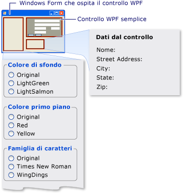

# Procedura dettagliata: hosting di controlli compositi di WPF in Windows Form
[!INCLUDE[TLA#tla_winclient](../../../../includes/tlasharptla-winclient-md.md)] fornisce un ambiente dettagliato per la creazione di applicazioni.  Tuttavia, quando si dispone di una grande quantità di codice [!INCLUDE[TLA#tla_winforms](../../../../includes/tlasharptla-winforms-md.md)], può essere opportuno estendere l'applicazione [!INCLUDE[TLA#tla_winforms](../../../../includes/tlasharptla-winforms-md.md)] esistente con [!INCLUDE[TLA2#tla_winclient](../../../../includes/tla2sharptla-winclient-md.md)] anziché riscriverla dall'inizio.  Uno scenario comune è dato dalla situazione in cui si desidera incorporare uno o più controlli implementati con [!INCLUDE[TLA2#tla_winclient](../../../../includes/tla2sharptla-winclient-md.md)] all'interno dell'applicazione [!INCLUDE[TLA2#tla_winforms](../../../../includes/tla2sharptla-winforms-md.md)].  Per ulteriori informazioni sulla personalizzazione dei controlli WPF, vedere [Personalizzazione dei controlli](../../../../docs/framework/wpf/controls/control-customization.md).  
  
 In questa procedura dettagliata viene descritta un'applicazione che ospita un controllo composito [!INCLUDE[TLA2#tla_winclient](../../../../includes/tla2sharptla-winclient-md.md)] per eseguire l'immissione di dati in un'applicazione [!INCLUDE[TLA2#tla_winforms](../../../../includes/tla2sharptla-winforms-md.md)].  Il controllo composito è compresso in una DLL.  Questa procedura generale può essere estesa ad applicazioni e controlli più complessi.  Questa procedura dettagliata è stata progettata in modo che risulti quasi identica per aspetto e funzionalità a [Procedura dettagliata: hosting di controlli Windows Form compositi in WPF](../../../../docs/framework/wpf/advanced/walkthrough-hosting-a-windows-forms-composite-control-in-wpf.md).  La differenza primaria risiede nel fatto che lo scenario di hosting risulta invertito.  
  
 La procedura dettagliata è divisa in due sezioni.  Nella prima sezione viene brevemente descritta l'implementazione del controllo composito [!INCLUDE[TLA2#tla_winclient](../../../../includes/tla2sharptla-winclient-md.md)].  Nella seconda sezione viene illustrato in dettaglio come ospitare il controllo composito in un'applicazione [!INCLUDE[TLA2#tla_winforms](../../../../includes/tla2sharptla-winforms-md.md)], come ricevere eventi dal controllo e come accedere ad alcune delle proprietà del controllo.  
  
 Di seguito vengono elencate le attività illustrate nella procedura dettagliata:  
  
-   Implementazione del controllo composito WPF.  
  
-   Implementazione dell'applicazione host Windows Form.  
  
 Per un elenco di codice completo delle attività illustrate in questa procedura dettagliata, vedere [Esempio di hosting di controlli compositi di WPF in Windows Form](http://go.microsoft.com/fwlink/?LinkID=159996) \(la pagina potrebbe essere in inglese\).  
  
## Prerequisiti  
 Per completare la procedura dettagliata, è necessario disporre dei componenti seguenti:  
  
-   [!INCLUDE[vs_dev10_long](../../../../includes/vs-dev10-long-md.md)].  
  
## Implementazione del controllo composito WPF.  
 Il controllo composito [!INCLUDE[TLA2#tla_winclient](../../../../includes/tla2sharptla-winclient-md.md)] utilizzato in questo esempio è un semplice form di immissione dati che accetta il nome e l'indirizzo dell'utente.  Quando l'utente fa clic su uno di due pulsanti per indicare che l'attività è terminata, il controllo genera un evento personalizzato per la restituzione delle informazioni all'host.  Nell’immagine riportata di seguito viene illustrato il controllo sottoposto a rendering.  
  
   
Controllo composito WPF  
  
### Creazione del progetto  
 Per avviare il progetto:  
  
1.  Avviare [!INCLUDE[TLA#tla_visualstu](../../../../includes/tlasharptla-visualstu-md.md)] e aprire la finestra di dialogo **Nuovo progetto**.  
  
2.  Nella categoria Visual C\# e Windows, selezionare il modello **Libreria di controlli utente WPF**.  
  
3.  Denominare il nuovo progetto `MyControls`.  
  
4.  Come posizione, specificare una cartella di livello principale denominata in modo appropriato, ad esempio `WindowsFormsHostingWpfControl`.  Successivamente, l'applicazione host verrà posizionata in questa cartella.  
  
5.  Scegliere **OK** per creare il progetto.  Il progetto predefinito contiene un singolo controllo denominato `UserControl1`.  
  
6.  In Esplora soluzioni rinominare `UserControl1` in `MyControl1`.  
  
 Il progetto dovrebbe presentare riferimenti alle DLL di sistema riportate di seguito.  Se alcune di queste DLL non sono incluse per impostazione predefinita, aggiungerle al progetto.  
  
-   PresentationCore  
  
-   PresentationFramework  
  
-   Sistema  
  
-   WindowsBase  
  
### Creazione dell'interfaccia utente  
 L'[!INCLUDE[TLA#tla_ui](../../../../includes/tlasharptla-ui-md.md)] per il controllo composito è implementata con [!INCLUDE[TLA#tla_xaml](../../../../includes/tlasharptla-xaml-md.md)].  Il controllo composito [!INCLUDE[TLA2#tla_ui](../../../../includes/tla2sharptla-ui-md.md)] è costituito da cinque elementi <xref:System.Windows.Controls.TextBox>.  A ogni elemento <xref:System.Windows.Controls.TextBox> è associato un elemento <xref:System.Windows.Controls.TextBlock> con funzione di etichetta.  Nella parte inferiore sono presenti due elementi <xref:System.Windows.Controls.Button>, **OK** e **Cancel**.  Quando l'utente fa clic su uno dei due pulsanti, il controllo genera un evento personalizzato per la restituzione delle informazioni all'host.  
  
#### Layout di base  
 I vari elementi dell'[!INCLUDE[TLA2#tla_ui](../../../../includes/tla2sharptla-ui-md.md)] sono contenuti in un elemento <xref:System.Windows.Controls.Grid>.  È possibile utilizzare <xref:System.Windows.Controls.Grid> per disporre il contenuto del controllo composito in modo molto simile a come si utilizzerebbe un elemento `Table` nel codice HTML.  In [!INCLUDE[TLA2#tla_winclient](../../../../includes/tla2sharptla-winclient-md.md)] è inoltre disponibile un elemento <xref:System.Windows.Documents.Table>, ma <xref:System.Windows.Controls.Grid> rappresenta un'alternativa più semplice e più appropriata per semplici attività di layout.  
  
 Nel codice XAML seguente viene mostrato il layout di base.  Questo codice XAML definisce la struttura complessiva del controllo specificando il numero di colonne e di righe dell'elemento <xref:System.Windows.Controls.Grid>.  
  
 In MyControl1.xaml sostituire il codice XAML esistente con il seguente :  
  
 [!code-xml[WindowsFormsHostingWpfControl#101](../../../../samples/snippets/csharp/VS_Snippets_Wpf/WindowsFormsHostingWpfControl/CSharp/MyControls/Page1.xaml#101)]  
[!code-xml[WindowsFormsHostingWpfControl#102](../../../../samples/snippets/csharp/VS_Snippets_Wpf/WindowsFormsHostingWpfControl/CSharp/MyControls/Page1.xaml#102)]  
  
#### Aggiunta di elementi TextBlock e TextBox alla griglia  
 Un elemento dell'[!INCLUDE[TLA2#tla_ui](../../../../includes/tla2sharptla-ui-md.md)] viene posizionato nella griglia impostando gli attributi <xref:System.Windows.Controls.Grid.RowProperty> e <xref:System.Windows.Controls.Grid.ColumnProperty> dell'elemento sul numero di righe e colonne appropriato.  Ricordare che la numerazione delle righe e delle colonne è in base zero.  Affinché un elemento occupi più colonne è necessario impostare il relativo attributo <xref:System.Windows.Controls.Grid.ColumnSpanProperty>.  Per ulteriori informazioni sugli elementi <xref:System.Windows.Controls.Grid>, vedere [Creare un elemento griglia](../../../../docs/framework/wpf/controls/how-to-create-a-grid-element.md).  
  
 Nel codice XAML seguente sono riportati gli elementi <xref:System.Windows.Controls.TextBox> e <xref:System.Windows.Controls.TextBlock> del controllo composito con i relativi attributi <xref:System.Windows.Controls.Grid.RowProperty> e <xref:System.Windows.Controls.Grid.ColumnProperty>, impostati per inserire correttamente gli elementi nella griglia.  
  
 In MyControl1.xaml, aggiungere il codice XAML seguente all'interno dell'elemento <xref:System.Windows.Controls.Grid>.  
  
 [!code-xml[WindowsFormsHostingWpfControl#103](../../../../samples/snippets/csharp/VS_Snippets_Wpf/WindowsFormsHostingWpfControl/CSharp/MyControls/Page1.xaml#103)]  
  
#### Applicazione di uno stile agli elementi dell'interfaccia utente  
 Molti degli elementi del form di immissione dati sono simili nell'aspetto, il che significa che presentano impostazioni identiche per molte delle loro proprietà.  Anziché impostare separatamente gli attributi di ciascun elemento, il codice XAML precedente utilizza gli elementi <xref:System.Windows.Style> per definire impostazioni delle proprietà standard per classi di elementi.  In questo modo, è possibile ridurre la complessità del controllo e modificare l'aspetto di più elementi attraverso un singolo attributo di stile.  
  
 Poiché gli elementi <xref:System.Windows.Style> sono contenuti nella proprietà <xref:System.Windows.FrameworkElement.Resources%2A> dell'elemento <xref:System.Windows.Controls.Grid>, possono essere utilizzati da tutti gli elementi nel controllo.  Se a uno stile è stato assegnato un nome, per applicarlo a un elemento aggiungere un elemento <xref:System.Windows.Style> impostato sul nome dello stile.  Gli stili a cui non è stato assegnato alcun nome diventano lo stile predefinito dell'elemento.  Per ulteriori informazioni sugli stili [!INCLUDE[TLA2#tla_winclient](../../../../includes/tla2sharptla-winclient-md.md)], vedere [Applicazione di stili e modelli](../../../../docs/framework/wpf/controls/styling-and-templating.md).  
  
 Nel codice XAML seguente vengono illustrati gli elementi <xref:System.Windows.Style> per il controllo composito.  Per vedere come gli stili vengono applicati agli elementi, vedere il codice XAML precedente.  Ad esempio, l'ultimo elemento <xref:System.Windows.Controls.TextBlock> presenta lo stile `inlineText`, mentre l'ultimo elemento <xref:System.Windows.Controls.TextBox> utilizza lo stile predefinito.  
  
 In MyControl1.xaml, aggiungere il codice XAML seguente immediatamente dopo l'elemento <xref:System.Windows.Controls.Grid> iniziale.  
  
 [!code-xml[WindowsFormsHostingWpfControl#104](../../../../samples/snippets/csharp/VS_Snippets_Wpf/WindowsFormsHostingWpfControl/CSharp/MyControls/Page1.xaml#104)]  
  
#### Aggiunta dei pulsanti OK e Annulla  
 Gli elementi finali del controllo composito sono gli elementi <xref:System.Windows.Controls.Button> **OK** e **Annulla**, i quali occupano le prime due colonne dell'ultima riga dell'elemento <xref:System.Windows.Controls.Grid>.  Questi elementi utilizzano un gestore eventi comune, `ButtonClicked`, e lo stile <xref:System.Windows.Controls.Button> predefinito definito nel codice XAML precedente.  
  
 In MyControl1.xaml, aggiungere il codice XAML seguente dopo l'ultimo elemento <xref:System.Windows.Controls.TextBox>.  La parte [!INCLUDE[TLA2#tla_xaml](../../../../includes/tla2sharptla-xaml-md.md)] del controllo composito è ora completata.  
  
 [!code-xml[WindowsFormsHostingWpfControl#105](../../../../samples/snippets/csharp/VS_Snippets_Wpf/WindowsFormsHostingWpfControl/CSharp/MyControls/Page1.xaml#105)]  
  
### Implementazione del file code\-behind  
 Nel file code\-behind, MyControl1.xaml.cs, sono implementate tre attività essenziali:  
  
1.  Gestione dell'evento che si verifica quando l'utente fa clic su uno dei pulsanti.  
  
2.  Recupero dei dati dagli elementi <xref:System.Windows.Controls.TextBox> e relativo assemblaggio in un oggetto argomento dell'evento personalizzato.  
  
3.  Generazione dell'evento `OnButtonClick` personalizzato che notifica all'host la fine dell'operazione dell'utente e conseguente passaggio dei dati all'host.  
  
 Il controllo espone inoltre alcune proprietà di colori e tipi di carattere che consentono di modificare l'aspetto della pagina.  A differenza della classe <xref:System.Windows.Forms.Integration.WindowsFormsHost>, utilizzata per l'hosting di un controllo [!INCLUDE[TLA2#tla_winforms](../../../../includes/tla2sharptla-winforms-md.md)], la classe <xref:System.Windows.Forms.Integration.ElementHost> espone unicamente la proprietà <xref:System.Windows.Controls.Panel.Background%2A> del controllo.  Per mantenere le similitudini tra questo esempio di codice e quello illustrato nella [Procedura dettagliata: hosting di controlli Windows Form compositi in WPF](../../../../docs/framework/wpf/advanced/walkthrough-hosting-a-windows-forms-composite-control-in-wpf.md), il controllo espone direttamente le proprietà rimanenti.  
  
#### Struttura di base del file code\-behind  
 Il file code\-behind è costituito da un singolo spazio dei nomi, `MyControls`, che conterrà due classi, `MyControl1` e `MyControlEventArgs`.  
  
```  
  
namespace MyControls  
{  
  public partial class MyControl1 : Grid  
  {  
    //...  
  }  
  public class MyControlEventArgs : EventArgs  
  {  
    //...  
  }  
}  
  
```  
  
 La prima classe, `MyControl1`, è una classe parziale che contiene il codice che implementa la funzionalità dell'[!INCLUDE[TLA2#tla_ui](../../../../includes/tla2sharptla-ui-md.md)] definita in MyControl1.xaml.  Quando viene analizzato il file MyControl1.xaml, il codice [!INCLUDE[TLA2#tla_xaml](../../../../includes/tla2sharptla-xaml-md.md)] viene convertito nella stessa classe parziale e le due classi parziali vengono unite per formare il controllo compilato.  Per questo motivo, il nome della classe nel file code\-behind deve corrispondere al nome della classe assegnato a MyControl1.xaml e deve ereditare dall'elemento radice del controllo.  La seconda classe, `MyControlEventArgs`, è una classe di argomenti degli eventi che consente di reinviare i dati all'host.  
  
 Aprire il file MyControl1.xaml.cs.  Modificare la dichiarazione di classe esistente in modo che abbia il seguente nome e erediti da <xref:System.Windows.Controls.Grid>.  
  
 [!code-csharp[WindowsFormsHostingWpfControl#21](../../../../samples/snippets/csharp/VS_Snippets_Wpf/WindowsFormsHostingWpfControl/CSharp/MyControls/Page1.xaml.cs#21)]  
  
#### Inizializzazione del controllo  
 Nel codice riportato di seguito vengono implementate diverse attività di base:  
  
-   Dichiarazione di un evento privato, `OnButtonClick`, e del delegato associato, `MyControlEventHandler`.  
  
-   Creazione di molteplici variabili globali private per l'archiviazione dei dati dell'utente.  Questi dati vengono esposti tramite proprietà corrispondenti.  
  
-   Implementazione di un gestore, `Init`, per l'evento <xref:System.Windows.FrameworkElement.Loaded> del controllo.  Questo gestore inizializza le variabili globali assegnando ad esse i valori definiti in MyControl1.xaml.  A tale scopo, utilizza la proprietà <xref:System.Windows.FrameworkElement.Name%2A> assegnata a un elemento <xref:System.Windows.Controls.TextBlock> tipico, `nameLabel`, per accedere alle impostazioni delle proprietà di quell'elemento.  
  
 Eliminare il costruttore esistente e aggiungere il codice seguente alla classe `MyControl1`.  
  
 [!code-csharp[WindowsFormsHostingWpfControl#11](../../../../samples/snippets/csharp/VS_Snippets_Wpf/WindowsFormsHostingWpfControl/CSharp/MyControls/Page1.xaml.cs#11)]  
  
#### Gestione degli eventi Click dei pulsanti  
 L'utente indica il termine dell'attività di immissione dati facendo clic sul pulsante **OK** o **Annulla** nella parte inferiore.  Entrambi i pulsanti utilizzano lo stesso gestore dell'evento <xref:System.Windows.Controls.Primitives.ButtonBase.Click>, `ButtonClicked`.  A entrambi i pulsanti è stato assegnato un nome, `btnOK` o `btnCancel`, attraverso il quale il gestore è in grado di determinare su quale pulsante è stato fatto clic esaminando il valore dell'argomento `sender`.  Tramite il gestore è possibile eseguire le attività riportate di seguito:  
  
-   Creazione di un oggetto `MyControlEventArgs` che contiene i dati degli elementi <xref:System.Windows.Controls.TextBox>.  
  
-   Se l'utente fa clic sul pulsante **Annulla**, imposta la proprietà `IsOK` dell'oggetto `MyControlEventArgs` su `false`.  
  
-   Generazione dell'evento `OnButtonClick` per indicare all'host la fine delle operazioni dell'utente e il passaggio dei dati raccolti all'host stesso.  
  
 Aggiungere il codice seguente alla classe `MyControl1`, dopo il metodo `Init`.  
  
 [!code-csharp[WindowsFormsHostingWpfControl#12](../../../../samples/snippets/csharp/VS_Snippets_Wpf/WindowsFormsHostingWpfControl/CSharp/MyControls/Page1.xaml.cs#12)]  
  
#### Creazione di proprietà  
 La parte restante della classe espone semplicemente le proprietà che corrispondono alle variabili globali descritte in precedenza.  Quando una proprietà viene modificata, la funzione di accesso set modifica l'aspetto del controllo modificando le proprietà dell'elemento corrispondente e aggiornando le variabili globali sottostanti.  
  
 Aggiungere il codice riportato di seguito alla classe `MyControl1`.  
  
 [!code-csharp[WindowsFormsHostingWpfControl#13](../../../../samples/snippets/csharp/VS_Snippets_Wpf/WindowsFormsHostingWpfControl/CSharp/MyControls/Page1.xaml.cs#13)]  
  
#### Reinvio dei dati all'host  
 Il componente finale del file è la classe `MyControlEventArgs` utilizzata per reinviare i dati raccolti all'host.  
  
 Aggiungere il codice riportato di seguito allo spazio dei nomi `MyControls`:  L'implementazione non presenta particolari difficoltà e non verrà trattata ulteriormente.  
  
 [!code-csharp[WindowsFormsHostingWpfControl#14](../../../../samples/snippets/csharp/VS_Snippets_Wpf/WindowsFormsHostingWpfControl/CSharp/MyControls/Page1.xaml.cs#14)]  
  
 Compilare la soluzione.  La compilazione creerà una DLL denominata MyControls.dll.  
  
<a name="winforms_host_section"></a>   
## Implementazione dell'applicazione host Windows Form  
 L'applicazione host [!INCLUDE[TLA2#tla_winforms](../../../../includes/tla2sharptla-winforms-md.md)] utilizza un oggetto <xref:System.Windows.Forms.Integration.ElementHost> per l'hosting del controllo composito [!INCLUDE[TLA2#tla_winclient](../../../../includes/tla2sharptla-winclient-md.md)].  L'applicazione gestisce l'evento `OnButtonClick` per ricevere i dati dal controllo composito.  Nell'applicazione è inoltre disponibile un insieme di pulsanti di opzione utilizzabili per modificare l'aspetto del controllo.  Di seguito viene illustrata l'applicazione.  
  
   
Controllo composito WPF ospitato in un'applicazione Windows Form  
  
### Creazione del progetto  
 Per avviare il progetto:  
  
1.  Avviare [!INCLUDE[TLA2#tla_visualstu](../../../../includes/tla2sharptla-visualstu-md.md)] e aprire la finestra di dialogo **Nuovo progetto**.  
  
2.  Nella categoria Visual C\# e Windows, selezionare il modello **Applicazione Windows Form**.  
  
3.  Denominare il nuovo progetto `WFHost`.  
  
4.  Come posizione, specificare la stessa cartella di livello principale che contiene il progetto MyControls.  
  
5.  Scegliere **OK** per creare il progetto.  
  
 È inoltre necessario aggiungere riferimenti alla DLL che contiene `MyControl1` e altri assembly.  
  
1.  Fare clic con il pulsante destro del mouse in Esplora soluzioni e selezionare **Aggiungi riferimento**.  
  
2.  Fare clic sulla scheda **Sfoglia** e passare alla cartella che contiene MyControls.dll.  In questa procedura dettagliata, questa cartella è MyControls\\bin\\Debug.  
  
3.  Selezionare MyControls.dll, quindi scegliere **OK**.  
  
4.  Aggiungere riferimenti agli assembly riportati di seguito.  
  
    -   PresentationCore  
  
    -   PresentationFramework  
  
    -   System.Xaml  
  
    -   WindowsBase  
  
    -   WindowsFormsIntegration  
  
### Implementazione dell'interfaccia utente per l'applicazione  
 L'interfaccia utente per l'applicazione Windows Form contiene diversi controlli per interagire con il controllo composito WPF.  
  
1.  In Progettazione Windows Form aprire Form1.  
  
2.  Ingrandire il form affinché possa contenere i controlli.  
  
3.  Nell'angolo superiore destro del form aggiungere un controllo <xref:System.Windows.Forms.Panel?displayProperty=fullName> per contenere il controllo composito [!INCLUDE[TLA2#tla_winclient](../../../../includes/tla2sharptla-winclient-md.md)].  
  
4.  Aggiungere i controlli <xref:System.Windows.Forms.GroupBox?displayProperty=fullName> seguenti al form.  
  
    |Nome|Text|  
    |----------|----------|  
    |groupBox1|Colore di sfondo|  
    |groupBox2|Foreground Color|  
    |groupBox3|Font Size|  
    |groupBox4|Font Family|  
    |groupBox5|Stile|  
    |groupBox6|Font Weight|  
    |groupBox7|Data from control|  
  
5.  Aggiungere i controlli <xref:System.Windows.Forms.RadioButton?displayProperty=fullName> seguenti ai controlli <xref:System.Windows.Forms.GroupBox?displayProperty=fullName>.  
  
    |GroupBox|Nome|Text|  
    |--------------|----------|----------|  
    |groupBox1|radioBackgroundOriginal|Originale|  
    |groupBox1|radioBackgroundLightGreen|LightGreen|  
    |groupBox1|radioBackgroundLightSalmon|LightSalmon|  
    |groupBox2|radioForegroundOriginal|Originale|  
    |groupBox2|radioForegroundRed|Rosso|  
    |groupBox2|radioForegroundYellow|Yellow|  
    |groupBox3|radioSizeOriginal|Originale|  
    |groupBox3|radioSizeTen|10|  
    |groupBox3|radioSizeTwelve|12|  
    |groupBox4|radioFamilyOriginal|Originale|  
    |groupBox4|radioFamilyTimes|Times New Roman|  
    |groupBox4|radioFamilyWingDings|WingDings|  
    |groupBox5|radioStyleOriginal|Normal|  
    |groupBox5|radioStyleItalic|Italic|  
    |groupBox6|radioWeightOriginal|Originale|  
    |groupBox6|radioWeightBold|Grassetto|  
  
6.  Aggiungere i controlli <xref:System.Windows.Forms.Label?displayProperty=fullName> seguenti all'ultimo <xref:System.Windows.Forms.GroupBox?displayProperty=fullName>.  Questi controlli visualizzano i dati restituiti dal controllo composito [!INCLUDE[TLA2#tla_winclient](../../../../includes/tla2sharptla-winclient-md.md)].  
  
    |GroupBox|Nome|Text|  
    |--------------|----------|----------|  
    |groupBox7|lblName|Name:|  
    |groupBox7|lblAddress|Street Address:|  
    |groupBox7|lblCity|City:|  
    |groupBox7|lblState|State:|  
    |groupBox7|lblZip|Zip:|  
  
### Inizializzazione del form  
 Il codice di hosting viene in genere implementato nel gestore dell'evento <xref:System.Windows.Forms.Form.Load> del form.  Nel codice seguente sono riportati il gestore dell'evento <xref:System.Windows.Forms.Form.Load>, un gestore per l'evento <xref:System.Windows.FrameworkElement.Loaded> del controllo composito [!INCLUDE[TLA2#tla_winclient](../../../../includes/tla2sharptla-winclient-md.md)] e dichiarazioni per molteplici variabili globali che verranno utilizzate in un secondo momento.  
  
 In Progettazione Windows Form fare doppio clic sul form per creare un gestore dell'evento <xref:System.Windows.Forms.Form.Load>.  Nella parte superiore di Form1.cs, aggiungere le istruzioni `using` seguenti.  
  
 [!code-csharp[WindowsFormsHostingWpfControl#10](../../../../samples/snippets/csharp/VS_Snippets_Wpf/WindowsFormsHostingWpfControl/CSharp/WFHost/Form1.cs#10)]  
  
 Sostituire il contenuto della classe `Form1` esistente con il codice riportato di seguito.  
  
 [!code-csharp[WindowsFormsHostingWpfControl#2](../../../../samples/snippets/csharp/VS_Snippets_Wpf/WindowsFormsHostingWpfControl/CSharp/WFHost/Form1.cs#2)]  
  
 Il metodo `Form1_Load` nel codice precedente mostra la procedura generale per l'hosting di un controllo [!INCLUDE[TLA2#tla_winclient](../../../../includes/tla2sharptla-winclient-md.md)]:  
  
1.  Creare un nuovo oggetto <xref:System.Windows.Forms.Integration.ElementHost>.  
  
2.  Impostare la proprietà <xref:System.Windows.Forms.Control.Dock%2A> del controllo su <xref:System.Windows.Forms.DockStyle?displayProperty=fullName>.  
  
3.  Aggiungere il controllo <xref:System.Windows.Forms.Integration.ElementHost> alla raccolta <xref:System.Windows.Forms.Control.Controls%2A>del controllo <xref:System.Windows.Forms.Panel>.  
  
4.  Creare un'istanza del controllo [!INCLUDE[TLA2#tla_winclient](../../../../includes/tla2sharptla-winclient-md.md)].  
  
5.  Ospitare il controllo composito nel form assegnando il controllo alla proprietà <xref:System.Windows.Forms.Integration.ElementHost.Child%2A> del controllo <xref:System.Windows.Forms.Integration.ElementHost>.  
  
 Le due righe rimanenti nel metodo `Form1_Load` associano i gestori a due eventi del controllo:  
  
-   `OnButtonClick` è un evento personalizzato che viene generato dal controllo composito quando l'utente fa clic sul pulsante **OK** o **Annulla**.  L'evento deve essere gestito per ottenere la risposta dell'utente e per raccogliere i dati specificati.  
  
-   <xref:System.Windows.FrameworkElement.Loaded> è un evento standard che viene generato da un controllo [!INCLUDE[TLA2#tla_winclient](../../../../includes/tla2sharptla-winclient-md.md)] dopo essere stato caricato completamente.  L'evento viene utilizzato perché nell'esempio è necessario inizializzare molteplici variabili globali utilizzando le proprietà del controllo.  Al momento dell'evento <xref:System.Windows.Forms.Form.Load> del form, il controllo non è ancora caricato completamente e quei valori sono ancora impostati su `null`.  Per poter accedere a queste proprietà, è necessario attendere che si verifichi l'evento <xref:System.Windows.FrameworkElement.Loaded> del controllo.  
  
 Il gestore dell'evento <xref:System.Windows.FrameworkElement.Loaded> viene descritto nel codice precedente.  Il gestore `OnButtonClick` viene descritto nella sezione successiva.  
  
### Gestione di OnButtonClick  
 L'evento `OnButtonClick` si verifica quando l'utente fa clic sul pulsante **OK** o **Annulla**.  
  
 Il gestore eventi controlla il campo `IsOK` dell'argomento dell'evento per determinare su quale pulsante è stato fatto clic.  Le variabili `lbl`*dati* corrispondono ai controlli <xref:System.Windows.Forms.Label> descritti in precedenza.  Se l'utente fa clic sul pulsante **OK**, i dati dei controlli <xref:System.Windows.Controls.TextBox> del controllo vengono assegnati al controllo <xref:System.Windows.Forms.Label> corrispondente.  Se l'utente fa clic su **Cancel**, i valori di <xref:System.Windows.Forms.Label.Text%2A> vengono impostati sulle stringhe predefinite.  
  
 Aggiungere il codice del gestore dell'evento clic sul pulsante alla classe `Form1`.  
  
 [!code-csharp[WindowsFormsHostingWpfControl#3](../../../../samples/snippets/csharp/VS_Snippets_Wpf/WindowsFormsHostingWpfControl/CSharp/WFHost/Form1.cs#3)]  
  
 Compilare ed eseguire l'applicazione.  Aggiungere testo al controllo composito WPF, quindi scegliere **OK**.  Il testo viene visualizzato nelle etichette.  A questo punto, il codice non è stato aggiunto per gestire i pulsanti di opzione.  
  
### Modifica dell'aspetto del controllo  
 I controlli <xref:System.Windows.Forms.RadioButton> presenti nel form consentono all'utente di modificare i colori di sfondo e di primo piano del controllo composito [!INCLUDE[TLA2#tla_winclient](../../../../includes/tla2sharptla-winclient-md.md)], nonché molte proprietà dei tipi di carattere.  Il colore di sfondo è esposto dall'oggetto <xref:System.Windows.Forms.Integration.ElementHost>.  Le proprietà rimanenti sono esposte come proprietà personalizzate del controllo.  
  
 Fare doppio clic su ogni controllo <xref:System.Windows.Forms.RadioButton> nel form per creare gestori per l'evento <xref:System.Windows.Forms.RadioButton.CheckedChanged>.  Sostituire i gestori dell'evento <xref:System.Windows.Forms.RadioButton.CheckedChanged> con il codice riportato di seguito.  
  
 [!code-csharp[WindowsFormsHostingWpfControl#4](../../../../samples/snippets/csharp/VS_Snippets_Wpf/WindowsFormsHostingWpfControl/CSharp/WFHost/Form1.cs#4)]  
  
 Compilare ed eseguire l'applicazione.  Fare clic sui diversi pulsanti di opzione per visualizzare l'effetto sul controllo composito WPF.  
  
## Vedere anche  
 <xref:System.Windows.Forms.Integration.ElementHost>   
 <xref:System.Windows.Forms.Integration.WindowsFormsHost>   
 [WPF Designer](http://msdn.microsoft.com/it-it/c6c65214-8411-4e16-b254-163ed4099c26)   
 [Procedura dettagliata: hosting di controlli Windows Form compositi in WPF](../../../../docs/framework/wpf/advanced/walkthrough-hosting-a-windows-forms-composite-control-in-wpf.md)   
 [Procedura dettagliata: hosting di controlli compositi 3D di WPF in Windows Form](../../../../docs/framework/wpf/advanced/walkthrough-hosting-a-3-d-wpf-composite-control-in-windows-forms.md)