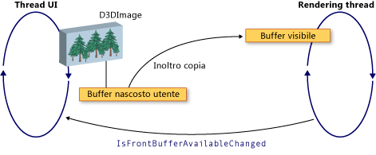

# Interoperativit&#224; di WPF e Direct3D9
È possibile includere contenuto Direct3D9 in un'applicazione Windows Presentation Foundation \(WPF\).  Questo argomento descrive come creare contenuto Direct3D9 che possa interoperare in maniera efficiente con WPF.  
  
> [!NOTE]
>  In caso di utilizzo di contenuto Direct3D9 in WPF, è necessario tenere in considerazione anche le prestazioni.  Per ulteriori informazioni su come ottimizzare le prestazioni, vedere [Considerazioni sulle prestazioni per l'interoperabilità fra Direct3D9 e WPF](../../../../docs/framework/wpf/advanced/performance-considerations-for-direct3d9-and-wpf-interoperability.md).  
  
## Buffer di visualizzazione  
 La classe <xref:System.Windows.Interop.D3DImage> gestisce due buffer di visualizzazione, definiti *buffer nascosto* e *front buffer*.  Il buffer nascosto rappresenta la superficie Direct3D9.  Le modifiche apportate al buffer nascosto vengono copiate nel front buffer quando si chiama il metodo <xref:System.Windows.Interop.D3DImage.Unlock%2A>.  
  
 Nell'illustrazione seguente è mostrata la relazione tra buffer nascosto e front buffer.  
  
   
  
## Creazione di un dispositivo Direct3D9  
 Per eseguire il rendering del contenuto Direct3D9, è necessario creare un dispositivo Direct3D9.  Esistono due oggetti Direct3D9 che è possibile utilizzare per creare un dispositivo, `IDirect3D9` e `IDirect3D9Ex`.  Utilizzare questi oggetti per creare rispettivamente i dispositivi `IDirect3DDevice9` e `IDirect3DDevice9Ex`.  
  
 Creare un dispositivo chiamando uno dei metodi seguenti:  
  
-   `IDirect3D9 * Direct3DCreate9(UINT SDKVersion);`  
  
-   `HRESULT Direct3DCreate9Ex(UINT SDKVersion, IDirect3D9Ex **ppD3D);`  
  
 Windows Vista o nel sistema operativo successivo, utilizzare il metodo `Direct3DCreate9Ex` con una visualizzazione configurata per utilizzare il modello \(WDDM\) display driver di Windows.  Utilizzare il metodo `Direct3DCreate9` su qualsiasi altra piattaforma.  
  
### Disponibilità del metodo Direct3DCreate9Ex  
 D3d9.dll nel metodo `Direct3DCreate9Ex` solo in Windows Vista o nel sistema operativo successivo.  Se si collega direttamente la funzione in Windows XP, risulta impossibile caricare l'applicazione.  Per determinare se il metodo `Direct3DCreate9Ex` è supportato, caricare la DLL e cercare l'indirizzo di routine.  Nel codice seguente viene illustrato come eseguire test per il metodo `Direct3DCreate9Ex`.  Per un esempio di codice completo, vedere [Procedura dettagliata: creazione di contenuto Direct3D9 per l'hosting in WPF](../../../../docs/framework/wpf/advanced/walkthrough-creating-direct3d9-content-for-hosting-in-wpf.md).  
  
 [!code-cpp[System.Windows.Interop.D3DImage#RendererManager_EnsureD3DObjects](../../../../samples/snippets/cpp/VS_Snippets_Wpf/System.Windows.Interop.D3DImage/cpp/renderermanager.cpp#renderermanager_ensured3dobjects)]  
  
### Creazione di un HWND  
 La creazione di un dispositivo richiede un HWND.  In generale si crea un HWND fittizio per l'utilizzo da parte di Direct3D9.  Nell'esempio di codice riportato di seguito viene illustrato come creare un HWND fittizio.  
  
 [!code-cpp[System.Windows.Interop.D3DImage#RendererManager_EnsureHWND](../../../../samples/snippets/cpp/VS_Snippets_Wpf/System.Windows.Interop.D3DImage/cpp/renderermanager.cpp#renderermanager_ensurehwnd)]  
  
### Parametri attuali  
 La creazione di un dispositivo richiede anche una struttura `D3DPRESENT_PARAMETERS`, ma solo alcuni parametri sono importanti.  Sono stati scelti questi parametri per ridurre il footprint di memoria.  
  
 Impostare i campi `BackBufferHeight` e `BackBufferWidth` su 1.  Impostandoli su 0 vengono impostati sulle dimensioni di HWND.  
  
 Impostare sempre i flag `D3DCREATE_MULTITHREADED` e `D3DCREATE_FPU_PRESERVE` per impedire il danneggiamento della memoria utilizzata da Direct3D9 e per impedire a Direct3D9 di modificare le impostazioni FPU.  
  
 Nell'esempio di codice riportato di seguito viene illustrato come inizializzare la struttura `D3DPRESENT_PARAMETERS`.  
  
 [!code-cpp[System.Windows.Interop.D3DImage#Renderer_Init](../../../../samples/snippets/cpp/VS_Snippets_Wpf/System.Windows.Interop.D3DImage/cpp/renderer.cpp#renderer_init)]  
  
## Creazione della destinazione di rendering del buffer nascosto  
 Per visualizzare contenuto Direct3D9 in un oggetto <xref:System.Windows.Interop.D3DImage>, si crea una superficie Direct3D9 e la si assegna chiamando il metodo <xref:System.Windows.Interop.D3DImage.SetBackBuffer%2A>.  
  
### Verifica del supporto dell'adattatore  
 Prima di creare una superficie, verificare che tutti gli adattatori supportino le proprietà della superficie richieste.  Anche se si esegue il rendering a solo un adattatore, la finestra WPF può essere visualizzata su qualsiasi adattatore nel sistema.  È necessario scrivere sempre codice Direct3D9 in grado di gestire configurazioni con più adattatori e verificare il supporto di tutti gli adattatori, in quanto in WPF la superficie potrebbe essere spostata tra gli adattatori disponibili.  
  
 Nell'esempio di codice seguente viene mostrato come verificare che tutti gli adattatori presenti nel sistema supportino Direct3D9.  
  
 [!code-cpp[System.Windows.Interop.D3DImage#RendererManager_TestSurfaceSettings](../../../../samples/snippets/cpp/VS_Snippets_Wpf/System.Windows.Interop.D3DImage/cpp/renderermanager.cpp#renderermanager_testsurfacesettings)]  
  
### Creazione della superficie  
 Prima di creare una superficie, verificare che le funzionalità del dispositivo offrano buone prestazioni nel sistema operativo di destinazione.  Per ulteriori informazioni, vedere [Considerazioni sulle prestazioni per l'interoperabilità fra Direct3D9 e WPF](../../../../docs/framework/wpf/advanced/performance-considerations-for-direct3d9-and-wpf-interoperability.md).  
  
 Una volta verificate le funzionalità del dispositivo, sarà possibile creare la superficie.  Nell'esempio di codice seguente viene illustrato come creare la destinazione per il rendering.  
  
 [!code-cpp[System.Windows.Interop.D3DImage#Renderer_CreateSurface](../../../../samples/snippets/cpp/VS_Snippets_Wpf/System.Windows.Interop.D3DImage/cpp/renderer.cpp#renderer_createsurface)]  
  
### WDDM  
 In Windows Vista e nei sistemi operativi successivi, configurati per l'utilizzo di WDDM, è possibile creare una trama della destinazione di rendering e passare a Livello 0 superfici al metodo <xref:System.Windows.Interop.D3DImage.SetBackBuffer%2A>.  Questo approccio non è consigliato in Windows XP in quanto non è possibile creare una trama di destinazione del rendering bloccabile, per cui le prestazioni risultano ridotte.  
  
## Gestione dello stato del dispositivo  
 La classe <xref:System.Windows.Interop.D3DImage> gestisce due buffer di visualizzazione, definiti *buffer nascosto* e *front buffer*.  Il buffer nascosto rappresenta la superficie Direct3D.  Le modifiche al buffer nascosto vengono copiate nel front buffer quando si chiama il metodo <xref:System.Windows.Interop.D3DImage.Unlock%2A>, dove visualizzare su hardware.  Talvolta, il front buffer non diventa disponibile.  Questa mancanza di disponibilità può essere causata da applicazioni Direct3D esclusive a schermo intero che bloccano lo schermo, da cambi utente o da altre attività di sistema.  In questo caso, l'applicazione WPF viene trasmessa gestendo l'evento <xref:System.Windows.Interop.D3DImage.IsFrontBufferAvailableChanged>.  Il modo in cui l'applicazione risponde al front buffer che diventa non disponibile dipende da WPF è abilitato per eseguire il fallback al rendering software.  Il metodo <xref:System.Windows.Interop.D3DImage.SetBackBuffer%2A> presenta un overload che accetta un parametro che specifica se WPF esegue il fallback al rendering software.  
  
 Quando si chiama l'overload <xref:System.Windows.Interop.D3DImage.SetBackBuffer%28System.Windows.Interop.D3DResourceType%2CSystem.IntPtr%29> o si chiama l'overload <xref:System.Windows.Interop.D3DImage.SetBackBuffer%28System.Windows.Interop.D3DResourceType%2CSystem.IntPtr%2CSystem.Boolean%29> con il parametro `enableSoftwareFallback` impostato su `false`, il sistema di rendering rilascia il riferimento al buffer nascosto quando il front buffer diventa non disponibile e visualizzato.  Quando il front buffer è ancora disponibile, il sistema di rendering genera l'evento <xref:System.Windows.Interop.D3DImage.IsFrontBufferAvailableChanged> per notificare all'applicazione WPF.  È possibile creare un gestore eventi per l'evento <xref:System.Windows.Interop.D3DImage.IsFrontBufferAvailableChanged> riavvia nuovamente il rendering con una superficie valida direct3d.  Per riavviare il rendering, è necessario chiamare <xref:System.Windows.Interop.D3DImage.SetBackBuffer%2A>.  
  
 Quando si chiama l'overload <xref:System.Windows.Interop.D3DImage.SetBackBuffer%28System.Windows.Interop.D3DResourceType%2CSystem.IntPtr%2CSystem.Boolean%29> con il parametro `enableSoftwareFallback` impostato su `true`, il sistema di rendering conserva il riferimento al buffer nascosto quando il front buffer diventa non disponibile, pertanto non è necessario chiamare <xref:System.Windows.Interop.D3DImage.SetBackBuffer%2A> quando il front buffer è ancora disponibile.  
  
 Quando il rendering software è abilitato, potrebbero verificarsi situazioni in cui il dispositivo utente diventa non disponibile, ma il sistema di rendering mantiene un riferimento alla superficie di direct3d.  Per verificare se un dispositivo Direct3D9 non è disponibile, chiamare il metodo `TestCooperativeLevel`.  Per controllare i dispositivi di un Direct3D9Ex chiamare il metodo `CheckDeviceState`, perché il metodo `TestCooperativeLevel` è deprecato e restituisce sempre il successo.  Se il dispositivo utente è diventata non disponibile, chiamata <xref:System.Windows.Interop.D3DImage.SetBackBuffer%2A> per rilasciare il riferimento di WPF al buffer nascosto.  Se è necessario reimpostare il dispositivo, chiamare <xref:System.Windows.Interop.D3DImage.SetBackBuffer%2A> con il parametro `backBuffer` impostato su `null`quindi chiamare <xref:System.Windows.Interop.D3DImage.SetBackBuffer%2A> nuovamente con `backBuffer` impostata su una superficie valida direct3d.  
  
 Chiamare il metodo `Reset` per il recupero da un dispositivo non valido solo se si implementa un supporto per più adattatori.  In caso contrario, rilasciare tutte le interfacce Direct3D9 e ricrearle completamente.  Se il layout dell'adattatore è stato modificato, gli oggetti Direct3D9 creati prima della modifica non sono aggiornati.  
  
## Gestione del ridimensionamento  
 Se <xref:System.Windows.Interop.D3DImage> visualizzare una risoluzione diversa dalla dimensione native, viene ridimensionato secondo <xref:System.Windows.Media.RenderOptions.BitmapScalingMode%2A>corrente, ad eccezione <xref:System.Windows.Media.Effects.SamplingMode> viene sostituito con <xref:System.Windows.Media.BitmapScalingMode>.  
  
 Se è necessaria una maggiore fedeltà, è necessario creare una nuova superficie quando il contenitore di <xref:System.Windows.Interop.D3DImage> si ridimensiona.  
  
 Sono possibili tre approcci per gestire il ridimensionamento.  
  
-   Partecipare al sistema di layout e creare una nuova superficie quando la dimensione viene modificata.  Non creare troppe superfici, perché è possibile esaurire o frammentare la memoria video.  
  
-   Prima di creare una nuova superficie attendere che non si siano verificati eventi di ridimensionamento per un periodo di tempo fisso.  
  
-   Creare un oggetto <xref:System.Windows.Threading.DispatcherTimer> che controlla le dimensioni del contenitore varie volte al secondo.  
  
## Ottimizzazione per più monitor  
 Possono verificarsi prestazioni significativamente ridotte quando il sistema di rendering sposta un oggetto <xref:System.Windows.Interop.D3DImage> a un altro monitor.  
  
 In WDDM non si verifica alcuna riduzione delle prestazioni fintantoché i monitor sono sulla stessa scheda video e si utilizza `Direct3DCreate9Ex`.  Se i monitor sono su schede video diverse, le prestazioni si riducono.  In Windows XP le prestazioni sono sempre ridotte.  
  
 Quando <xref:System.Windows.Interop.D3DImage> si sposta su un altro monitor, per ripristinare le buone prestazioni, è possibile creare una nuova superficie nell'adattatore corrispondente.  
  
 Per evitare la riduzione delle prestazioni, scrivere codice specificamente per il caso di più monitor.  Nell'elenco seguente viene illustrato un modo per scrivere codice per più monitor.  
  
1.  Trovare un punto di <xref:System.Windows.Interop.D3DImage> nello spazio dello schermo con il metodo `Visual.ProjectToScreen`.  
  
2.  Utilizzare il metodo GDI `MonitorFromPoint` per trovare il monitor che sta visualizzando il punto.  
  
3.  Utilizzare il metodo `IDirect3D9::GetAdapterMonitor` per trovare l'adattatore Direct3D9 del monitor.  
  
4.  Se l'adattatore non è lo stesso utilizzato per il buffer nascosto, creare un nuovo buffer nascosto nel nuovo monitor e assegnarlo al buffer nascosto <xref:System.Windows.Interop.D3DImage>.  
  
> [!NOTE]
>  Se <xref:System.Windows.Interop.D3DImage> gestisce più monitor, le prestazioni saranno lente, salvo nel caso WDDM e `IDirect3D9Ex` siano sullo stesso adattatore.  Non vi è modo di migliorare le prestazioni in questa situazione.  
  
 Nell'esempio di codice riportato di seguito viene illustrato come trovare il monitor corrente.  
  
 [!code-cpp[System.Windows.Interop.D3DImage#RendererManager_SetAdapter](../../../../samples/snippets/cpp/VS_Snippets_Wpf/System.Windows.Interop.D3DImage/cpp/renderermanager.cpp#renderermanager_setadapter)]  
  
 Aggiornare il monitor quando la dimensione o la posizione del contenitore <xref:System.Windows.Interop.D3DImage> variano oppure aggiornare il monitor utilizzando un oggetto `DispatcherTimer` che si aggiorna varie volte al secondo.  
  
## Rendering nel software di WPF  
 Nel software WPF esegue il rendering in modo sincrono sul thread UI nelle situazioni seguenti.  
  
-   Stampa  
  
-   <xref:System.Windows.Media.Effects.BitmapEffect>  
  
-   <xref:System.Windows.Media.Imaging.RenderTargetBitmap>  
  
 Quando si verifica una di queste situazioni, il sistema di rendering chiama il metodo <xref:System.Windows.Interop.D3DImage.CopyBackBuffer%2A> per copiare il buffer hardware nel software.  L'implementazione predefinita chiama il metodo `GetRenderTargetData` con la superficie.  Poiché questa chiamata si verifica  all'esterno del modello di blocco\/sblocco, può non riuscire.  In questo caso, il metodo  `CopyBackBuffer` restituisce `null` e non viene visualizzata alcuna immagine.  
  
 È possibile eseguire l'override del metodo <xref:System.Windows.Interop.D3DImage.CopyBackBuffer%2A>, chiamare l'implementazione di base e, se restituisce `null`, è possibile restituire un segnaposto <xref:System.Windows.Media.Imaging.BitmapSource>.  
  
 È inoltre possibile implementare software di rendering proprio anziché chiamare l'implementazione di base.  
  
> [!NOTE]
>  Se il rendering WPF viene eseguito completamente nel software, <xref:System.Windows.Interop.D3DImage> non è visualizzato perché WPF non dispone di un front buffer.  
  
## Vedere anche  
 <xref:System.Windows.Interop.D3DImage>   
 [Considerazioni sulle prestazioni per l'interoperabilità fra Direct3D9 e WPF](../../../../docs/framework/wpf/advanced/performance-considerations-for-direct3d9-and-wpf-interoperability.md)   
 [Procedura dettagliata: creazione di contenuto Direct3D9 per l'hosting in WPF](../../../../docs/framework/wpf/advanced/walkthrough-creating-direct3d9-content-for-hosting-in-wpf.md)   
 [Procedura dettagliata: hosting di contenuto Direct3D9 in WPF](../../../../docs/framework/wpf/advanced/walkthrough-hosting-direct3d9-content-in-wpf.md)