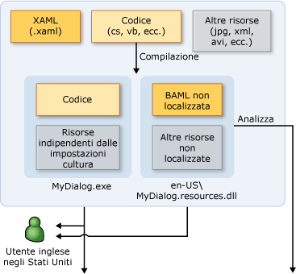
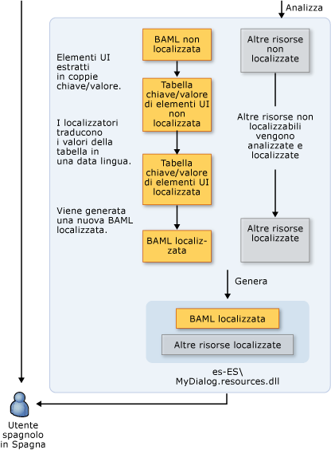

# Cenni preliminari sulla globalizzazione e localizzazione WPF
Quando si limita la disponibilità di un prodotto a una sola lingua, si limita la potenziale clientela a una frazione dei 6,5 miliardi di persone che costituiscono la popolazione mondiale.  Se si desidera che le applicazioni abbiano un pubblico globale, una localizzazione del prodotto che sia conveniente in termini di costi è uno dei metodi migliori e più economici per raggiungere una maggiore clientela.  
  
 In questo argomento vengono presentate la globalizzazione e la localizzazione in [!INCLUDE[TLA#tla_winclient](../../../../includes/tlasharptla-winclient-md.md)].  La globalizzazione consiste nella progettazione e nello sviluppo di applicazioni eseguibili a livello internazionale.  Supporta ad esempio interfacce utente localizzate e dati internazionali per utenti che utilizzano impostazioni cultura diverse.  [!INCLUDE[TLA2#tla_winclient](../../../../includes/tla2sharptla-winclient-md.md)] fornisce funzionalità di progettazione globalizzate, inclusi il layout automatico, gli assembly satellite, nonché attributi e commenti localizzati.  
  
 La localizzazione consiste nella traduzione delle risorse dell'applicazione in versioni appositamente localizzate per le impostazioni cultura supportate dall'applicazione.  La localizzazione in [!INCLUDE[TLA2#tla_winclient](../../../../includes/tla2sharptla-winclient-md.md)], richiede l'utilizzo delle API nello spazio dei nomi <xref:System.Windows.Markup.Localizer>. Queste API vengono utilizzate con lo strumento da riga di comando illustrato in [Esempio di strumento LocBaml](http://go.microsoft.com/fwlink/?LinkID=160016).  Per informazioni sulla compilazione e l'utilizzo di LocBaml, vedere [Localizzare un'applicazione](../../../../docs/framework/wpf/advanced/how-to-localize-an-application.md).  
  
   
  
## Procedure consigliate per la globalizzazione e la localizzazione in WPF  
 Per sfruttare al meglio le funzionalità di globalizzazione e localizzazione integrate in [!INCLUDE[TLA2#tla_winclient](../../../../includes/tla2sharptla-winclient-md.md)], seguire i suggerimenti relativi alla progettazione e localizzazione dell'interfaccia utente forniti in questa sezione.  
  
### Procedure consigliate per la progettazione dell'interfaccia utente in WPF  
 In caso di progettazione di un'[!INCLUDE[TLA2#tla_ui](../../../../includes/tla2sharptla-ui-md.md)] basata su [!INCLUDE[TLA2#tla_winclient](../../../../includes/tla2sharptla-winclient-md.md)], si consiglia di implementare le seguenti procedure consigliate:  
  
-   Scrivere l'[!INCLUDE[TLA2#tla_ui](../../../../includes/tla2sharptla-ui-md.md)] in [!INCLUDE[TLA2#tla_xaml](../../../../includes/tla2sharptla-xaml-md.md)]; evitare di creare l'[!INCLUDE[TLA2#tla_ui](../../../../includes/tla2sharptla-ui-md.md)] tramite codice.  Quando si crea l'[!INCLUDE[TLA2#tla_ui](../../../../includes/tla2sharptla-ui-md.md)] mediante [!INCLUDE[TLA2#tla_xaml](../../../../includes/tla2sharptla-xaml-md.md)], la si espone tramite API di localizzazione incorporate.  
  
-   Evitare di utilizzare posizioni assolute e dimensioni fisse per disporre il contenuto; utilizzare invece il ridimensionamento relativo o automatico.  
  
    -   Utilizzare <xref:System.Windows.Window.SizeToContent%2A> e mantenere le larghezze e le altezze impostate su `Auto`.  
  
    -   Evitare di utilizzare <xref:System.Windows.Controls.Canvas> per creare il layout dell'[!INCLUDE[TLA2#tla_ui](../../../../includes/tla2sharptla-ui-md.md)].  
  
    -   Utilizzare <xref:System.Windows.Controls.Grid> e la funzionalità di condivisione delle dimensioni.  
  
-   Fornire uno spazio aggiuntivo nei margini poiché il testo localizzato spesso richiede maggiore spazio.  Lo spazio aggiuntivo potrà contenere eventuali caratteri sporgenti.  
  
-   Abilitare <xref:System.Windows.Controls.TextBlock.TextWrapping%2A> in <xref:System.Windows.Controls.TextBlock> per evitare che il testo venga ritagliato.  
  
-   Impostare l'attributo **xml:lang**.  Questo attributo descrive le impostazioni cultura di un elemento specifico e dei relativi elementi figlio.  Il valore di questa proprietà modifica il comportamento di diverse funzionalità in [!INCLUDE[TLA2#tla_winclient](../../../../includes/tla2sharptla-winclient-md.md)]. Ad esempio, modifica il comportamento di sillabazione, controllo ortografico, sostituzione dei numeri, visualizzazione di lingue con alfabeti non latini e fallback dei tipi di carattere.  Vedere [Globalizzazione per WPF](../../../../docs/framework/wpf/advanced/globalization-for-wpf.md) per ulteriori informazioni sull'impostazione dell'[Gestione di xml:lang in XAML](../../../../docs/framework/xaml-services/xml-lang-handling-in-xaml.md).  
  
-   Creare un tipo di carattere composito personalizzato che consenta di ottenere un migliore controllo dei tipi di carattere utilizzati per le diverse lingue.  Per impostazione predefinita, [!INCLUDE[TLA2#tla_winclient](../../../../includes/tla2sharptla-winclient-md.md)] utilizza il tipo di carattere GlobalUserInterface.composite nella directory Windows\\Fonts.  
  
-   Quando si creano applicazioni per la navigazione che potrebbero essere localizzate in impostazioni cultura con formato di testo da destra a sinistra, impostare in modo esplicito <xref:System.Windows.FlowDirection> per ogni pagina per fare in modo che la pagina non erediti <xref:System.Windows.FlowDirection> da <xref:System.Windows.Navigation.NavigationWindow>.  
  
-   Quando si creano applicazioni per la navigazione autonome ospitate al di fuori di un browser, impostare <xref:System.Windows.Application.StartupUri%2A> per l'applicazione iniziale su un oggetto <xref:System.Windows.Navigation.NavigationWindow> \(ad esempio, `<Application StartupUri="NavigationWindow.xaml">`\) anziché su una pagina.  Questo consente di modificare <xref:System.Windows.FlowDirection> per la finestra e la barra di navigazione.  Per ulteriori informazioni e un esempio, vedere [Esempio di globalizzazione di una home page](http://go.microsoft.com/fwlink/?LinkId=159990) \(la pagina potrebbe essere in inglese\).  
  
### Procedure consigliate per la localizzazione in WPF  
 In caso di localizzazione di applicazioni basate su [!INCLUDE[TLA2#tla_winclient](../../../../includes/tla2sharptla-winclient-md.md)], si consiglia di implementare le seguenti procedure consigliate:  
  
-   Utilizzare i commenti di localizzazione per fornire un contesto aggiuntivo ai localizzatori.  
  
-   Utilizzare gli attributi di localizzazione per controllare la localizzazione anziché omettere in maniera selettiva le proprietà <xref:System.Windows.Markup.Localizer.BamlLocalizableResourceKey.Uid%2A> negli elementi.  Per ulteriori informazioni, vedere [Attributi e commenti di localizzazione](../../../../docs/framework/wpf/advanced/localization-attributes-and-comments.md).  
  
-   Utilizzare **msbuild \/t:updateuid** e **\/t:checkuid** per aggiungere e controllare le proprietà <xref:System.Windows.Markup.Localizer.BamlLocalizableResourceKey.Uid%2A> nel codice [!INCLUDE[TLA2#tla_xaml](../../../../includes/tla2sharptla-xaml-md.md)].  Utilizzare le proprietà <xref:System.Windows.Markup.Localizer.BamlLocalizableResourceKey.Uid%2A> per tenere traccia delle modifiche tra lo sviluppo e la localizzazione. Le proprietà <xref:System.Windows.Markup.Localizer.BamlLocalizableResourceKey.Uid%2A> semplificano la localizzazione delle nuove modifiche di sviluppo.  L'aggiunta manuale di proprietà <xref:System.Windows.Markup.Localizer.BamlLocalizableResourceKey.Uid%2A> a un'[!INCLUDE[TLA2#tla_ui](../../../../includes/tla2sharptla-ui-md.md)] risulta in genere una procedura monotona e meno accurata.  
  
    -   Non modificare le proprietà <xref:System.Windows.Markup.Localizer.BamlLocalizableResourceKey.Uid%2A> una volta iniziata la localizzazione.  
  
    -   Non utilizzare proprietà <xref:System.Windows.Markup.Localizer.BamlLocalizableResourceKey.Uid%2A> doppie. Tenere a mente questo suggerimento quando si utilizza il comando copia e incolla.  
  
    -   Impostare il percorso `UltimateResourceFallback` nel file AssemblyInfo.\* per specificare la lingua di fallback appropriata, ad esempio `[assembly: NeutralResourcesLanguage("en-US",   UltimateResourceFallbackLocation.Satellite)]`.  
  
         Se si decide di includere la lingua di origine nell'assembly principale omettendo il tag `<UICulture>` nel file di progetto, impostare il percorso `UltimateResourceFallback` come assembly principale anziché il satellite \(ad esempio, `[assembly: NeutralResourcesLanguage("en-US", UltimateResourceFallbackLocation.MainAssembly)]`\).  
  
   
## Localizzare un'applicazione WPF  
 Esistono diverse opzioni utilizzabili per localizzare un'applicazione [!INCLUDE[TLA2#tla_winclient](../../../../includes/tla2sharptla-winclient-md.md)].  Ad esempio, è possibile associare le risorse localizzabili nell'applicazione a un file [!INCLUDE[TLA2#tla_xml](../../../../includes/tla2sharptla-xml-md.md)], archiviare il testo localizzabile in tabelle RESX o fare in modo che il localizzatore utilizzi file [!INCLUDE[TLA#tla_xaml](../../../../includes/tlasharptla-xaml-md.md)].  In questa sezione viene descritto un flusso di lavoro di localizzazione che utilizza il modulo BALM di XAML, il quale fornisce diversi vantaggi:  
  
-   È possibile effettuare la localizzazione dopo la compilazione.  
  
-   È possibile effettuare l'aggiornamento a una versione più recente del modulo BALM di XAML con localizzazioni da una versione precedente modulo BALM di XAML, il che significa sviluppare e localizzare contemporaneamente.  
  
-   È possibile convalidare elementi di origine e semantica originali in fase di compilazione, poiché il modulo BALM di XAML è la forma compilata di [!INCLUDE[TLA2#tla_xaml](../../../../includes/tla2sharptla-xaml-md.md)].  
  
### Processo di compilazione per la localizzazione  
 In caso di sviluppo di un'applicazione [!INCLUDE[TLA2#tla_winclient](../../../../includes/tla2sharptla-winclient-md.md)], il processo di compilazione per la localizzazione è il seguente:  
  
-   Lo sviluppatore crea e globalizza l'applicazione [!INCLUDE[TLA2#tla_winclient](../../../../includes/tla2sharptla-winclient-md.md)].  Nel file di progetto, lo sviluppatore imposta `<UICulture>en-US</UICulture>` in modo tale che, quando l'applicazione viene compilata, venga generato un assembly principale indipendente dalla lingua. Questo assembly possiede un file .resources.dll satellite contenente tutte le risorse localizzabili. In alternativa è possibile mantenere la lingua di origine nell'assembly principale, dal momento che le [!INCLUDE[TLA2#tla_api#plural](../../../../includes/tla2sharptla-apisharpplural-md.md)] di localizzazione supportano l'estrazione da tale assembly.  
  
-   Quando il file viene compilato nella build, [!INCLUDE[TLA2#tla_xaml](../../../../includes/tla2sharptla-xaml-md.md)] viene convertito nel modulo BAML di XAML.  Il file `MyDialog.exe` indipendente dalle impostazioni cultura e il file `MyDialog.resources.dll` dipendente dalle impostazioni cultura \(inglese\) vengono distribuiti ai clienti di lingua inglese.  
  
### Flusso di lavoro per la localizzazione  
 Il processo di localizzazione ha inizio una volta terminata la compilazione del file `MyDialog.resources.dll` non localizzato.  Gli elementi e le proprietà dell'[!INCLUDE[TLA2#tla_ui](../../../../includes/tla2sharptla-ui-md.md)] nel codice [!INCLUDE[TLA2#tla_xaml](../../../../includes/tla2sharptla-xaml-md.md)] originale vengono estratti dal modulo BAML di XAML in coppie chiave\/valore utilizzando le [!INCLUDE[TLA2#tla_api#plural](../../../../includes/tla2sharptla-apisharpplural-md.md)] contenute in <xref:System.Windows.Markup.Localizer>.  I localizzatori utilizzano le coppie chiave\/valore per localizzare l'applicazione.  Una volta completata la localizzazione, sarà possibile generare un nuovo file .resource.dll a partire dai nuovi valori.  
  
 Le chiavi delle coppie chiave\-valore sono valori `x:Uid` inseriti dallo sviluppatore nel codice [!INCLUDE[TLA2#tla_xaml](../../../../includes/tla2sharptla-xaml-md.md)] originale.  Questi valori `x:Uid` consentono all'[!INCLUDE[TLA2#tla_api](../../../../includes/tla2sharptla-api-md.md)] di tenere traccia e di unire le modifiche eseguite dallo sviluppatore e il localizzatore durante la localizzazione.  Ad esempio, se lo sviluppatore modifica l'[!INCLUDE[TLA2#tla_ui](../../../../includes/tla2sharptla-ui-md.md)] quando il localizzatore ha già avviato il processo di localizzazione, è possibile unire la modifica apportata durante lo sviluppo con la versione di localizzazione già completata, così che il lavoro di traduzione effettuato andrà perso soltanto in minima parte.  
  
 Nel grafico che segue viene illustrato un flusso di lavoro di localizzazione tipico basato sul modulo BAML di XAML.  Il grafico presuppone che lo sviluppatore scriva l'applicazione in inglese.  Lo sviluppatore crea e globalizza l'applicazione WPF.  Nel file di progetto lo sviluppatore imposta `<UICulture>en-US</UICulture>` in modo tale che, in fase di compilazione, venga generato un assembly principale della lingua di sistema con un file resources.dll satellite contenente tutte le risorse localizzabili.  In alternativa è possibile mantenere la lingua di origine nell'assembly principale, dal momento che le API di localizzazione WPF supportano l'estrazione da tale assembly.  Terminato il processo di compilazione, XAML viene compilato in BAML.  Il file MyDialog.exe.resources.dll indipendente dalle impostazioni cultura viene distribuito ai clienti di lingua inglese.  
  
   
  
   
  
   
## Esempi di localizzazione WPF  
 In questa sezione sono contenuti esempi di applicazioni localizzate che aiutano a comprendere le modalità di compilazione e localizzazione di applicazioni [!INCLUDE[TLA2#tla_winclient](../../../../includes/tla2sharptla-winclient-md.md)].  
  
#### Esempio di finestra di dialogo Run  
 Nelle immagini che seguono viene illustrato l'output dell'esempio di finestra di dialogo **Run**.  
  
 **\(Stati Uniti\):**  
  
   
  
 **Tedesco:**  
  
   
  
 **Progettazione di una finestra di dialogo Run globale**  
  
 In questo esempio viene prodotta una finestra di dialogo **Run** mediante [!INCLUDE[TLA2#tla_winclient](../../../../includes/tla2sharptla-winclient-md.md)] e [!INCLUDE[TLA2#tla_xaml](../../../../includes/tla2sharptla-xaml-md.md)].  Questa finestra è equivalente alla finestra di dialogo **Esegui** disponibile dal menu Start di [!INCLUDE[TLA#tla_win](../../../../includes/tlasharptla-win-md.md)].  
  
 Di seguito vengono riportati alcuni elementi di rilievo per la creazione di finestre di dialogo globali:  
  
 **Automatic Layout**  
  
 *In Window1.xaml:*  
  
 `<Window SizeToContent="WidthAndHeight">`  
  
 La proprietà Window precedente ridimensiona automaticamente la finestra in base alla dimensione del contenuto.  Questa proprietà impedisce alla finestra di troncare il contenuto le cui dimensioni aumentano in seguito alla localizzazione. Rimuove inoltre lo spazio non necessario nel caso in cui le dimensioni del contenuto diminuiscano in seguito alla localizzazione.  
  
 `<Grid x:Uid="Grid_1">`  
  
 Le proprietà <xref:System.Windows.Markup.Localizer.BamlLocalizableResourceKey.Uid%2A> sono necessarie per il corretto funzionamento delle [!INCLUDE[TLA2#tla_api#plural](../../../../includes/tla2sharptla-apisharpplural-md.md)] di localizzazione [!INCLUDE[TLA2#tla_winclient](../../../../includes/tla2sharptla-winclient-md.md)].  
  
 Tali proprietà vengono utilizzate dalle [!INCLUDE[TLA2#tla_api#plural](../../../../includes/tla2sharptla-apisharpplural-md.md)] di localizzazione di [!INCLUDE[TLA2#tla_winclient](../../../../includes/tla2sharptla-winclient-md.md)] per tenere traccia delle modifiche tra lo sviluppo e la localizzazione dell'[!INCLUDE[TLA#tla_ui](../../../../includes/tlasharptla-ui-md.md)].  Le proprietà <xref:System.Windows.Markup.Localizer.BamlLocalizableResourceKey.Uid%2A> consentono di unire una versione più recente dell'[!INCLUDE[TLA2#tla_ui](../../../../includes/tla2sharptla-ui-md.md)] a una localizzazione meno recente dell'[!INCLUDE[TLA2#tla_ui](../../../../includes/tla2sharptla-ui-md.md)].  Per aggiungere una proprietà <xref:System.Windows.Markup.Localizer.BamlLocalizableResourceKey.Uid%2A>, è necessario eseguire **msbuild \/t:updateuid RunDialog.csproj** in una shell dei comandi.  Questo è il metodo consigliato per aggiungere proprietà <xref:System.Windows.Markup.Localizer.BamlLocalizableResourceKey.Uid%2A>, poiché un'aggiunta manuale richiede in genere troppo tempo e risulta meno accurata.  Per verificare che le proprietà <xref:System.Windows.Markup.Localizer.BamlLocalizableResourceKey.Uid%2A> siano correttamente impostate, eseguire **msbuild \/t:checkuid RunDialog.csproj**.  
  
 L'[!INCLUDE[TLA2#tla_ui](../../../../includes/tla2sharptla-ui-md.md)] viene strutturata mediante il controllo <xref:System.Windows.Controls.Grid>, utile in quanto consente di sfruttare il layout automatico in [!INCLUDE[TLA2#tla_winclient](../../../../includes/tla2sharptla-winclient-md.md)].  La finestra di dialogo è suddivisa in tre righe e cinque colonne.  Le definizioni delle righe e delle colonne non hanno una dimensione fissa, pertanto l'eventuale aumento o riduzione delle dimensioni degli elementi dell'[!INCLUDE[TLA2#tla_ui](../../../../includes/tla2sharptla-ui-md.md)] collocati in ogni cella, dovuto alla localizzazione, non comporta alcun problema.  
  
 [!code-xml[GlobalizationRunDialog#GridColumnDef](../../../../samples/snippets/csharp/VS_Snippets_Wpf/GlobalizationRunDialog/CS/Window1.xaml#gridcolumndef)]  
  
 Le prime due colonne, contenenti l'etichetta **Open:** e <xref:System.Windows.Controls.ComboBox>, utilizzano il 10% della larghezza totale dell'[!INCLUDE[TLA2#tla_ui](../../../../includes/tla2sharptla-ui-md.md)].  
  
 [!code-xml[GlobalizationRunDialog#GridColumnDef2](../../../../samples/snippets/csharp/VS_Snippets_Wpf/GlobalizationRunDialog/CS/Window1.xaml#gridcolumndef2)]  
  
 Nell'esempio viene utilizzata la funzionalità di ridimensionamento condiviso di <xref:System.Windows.Controls.Grid>.  Le ultime tre colonne sfruttano tale funzionalità posizionandosi nello stesso <xref:System.Windows.Controls.DefinitionBase.SharedSizeGroup%2A>.  Come si evince dal nome della proprietà, questo consente alle colonne di condividere la stessa dimensione.  Di conseguenza, quando "Browse…" viene localizzato nella stringa più lunga "Durchsuchen…" tutti i pulsanti aumentano di larghezza. Non si avrà quindi un pulsante "OK" piccolo e un pulsante "Durchsuchen…" più grande e sproporzionato.  
  
 **Xml:lang**  
  
 `Xml:lang="en-US"`  
  
 Si noti [Gestione di xml:lang in XAML](../../../../docs/framework/xaml-services/xml-lang-handling-in-xaml.md) collocato nell'elemento radice dell'[!INCLUDE[TLA2#tla_ui](../../../../includes/tla2sharptla-ui-md.md)].  Questa proprietà descrive le impostazioni cultura di un dato elemento e dei relativi elementi figlio.  Questo valore viene utilizzato da diverse funzionalità in [!INCLUDE[TLA2#tla_winclient](../../../../includes/tla2sharptla-winclient-md.md)] e deve essere modificato in maniera adeguata durante la localizzazione.  Modifica ad esempio il dizionario utilizzato per la sillabazione e il controllo ortografico delle parole.  Influisce anche sulla visualizzazione delle cifre e sul modo in cui il sistema di fallback dei tipi di carattere seleziona il tipo di carattere da utilizzare.  Infine, la proprietà influisce sulla modalità di visualizzazione dei numeri e dei testi scritti in lingue con alfabeti non latini.  Il valore predefinito è "en\-US".  
  
 **Building a Satellite Resource Assembly**  
  
 *In .csproj:*  
  
 `<UICulture>en-US</UICulture>`  
  
 Si noti l'aggiunta di un valore `UICulture`.  Quando questa viene impostata su un valore <xref:System.Globalization.CultureInfo> valido, ad esempio en\-US, la compilazione del progetto genera un assembly satellite contenente tutte le risorse localizzabili.  
  
 `<Resource Include="RunIcon.JPG">`  
  
 `<Localizable>False</Localizable>`  
  
 `</Resource>`  
  
 `RunIcon.JPG` non deve essere localizzato poiché deve apparire uguale per tutte le impostazioni cultura.  `Localizable` viene impostato su `false`, per far sì che resti nell'assembly principale indipendente dalla lingua anziché nell'assembly satellite.  Il valore predefinito di tutte le risorse non compilabili è `Localizable`, impostato su `true`.  
  
 **Localizzazione della finestra di dialogo Run**  
  
 **Parse**  
  
 Dopo avere compilato l'applicazione, la prima fase di localizzazione consiste nell'analizzare le risorse localizzabili al di fuori dell'assembly satellite.  Ai fini di questo argomento, utilizzare lo strumento LocBaml di esempio riportato in [Esempio di strumento LocBaml](http://go.microsoft.com/fwlink/?LinkID=160016) \(la pagina potrebbe essere in inglese\).  LocBaml è soltanto uno strumento di esempio che consente di acquisire familiarità con la compilazione di uno strumento adatto a un particolare processo di localizzazione.  Tramite LocBaml, eseguire **LocBaml \/parse RunDialog.resources.dll \/out:** per l'analisi e per generare un file "RunDialog.resources.dll.CSV".  
  
 **Localize**  
  
 Utilizzare l'editor CSV con supporto Unicode preferito per modificare questo file.  Eliminare tutte le voci con una categoria di localizzazione "None".  Verranno visualizzate le seguenti voci:  
  
||||  
|-|-|-|  
|Chiave risorsa|Categoria di localizzazione|Valore|  
|Button\_1:System.Windows.Controls.Button.$Content|Button|OK|  
|Button\_2:System.Windows.Controls.Button.$Content|Button|Cancel|  
|Button\_3:System.Windows.Controls.Button.$Content|Button|Browse...|  
|ComboBox\_1:System.Windows.Controls.ComboBox.$Content|ComboBox||  
|TextBlock\_1:System.Windows.Controls.TextBlock.$Content|Text|Type the name of a program, folder, document, or Internet resource, and Windows will open it for you.|  
|TextBlock\_2:System.Windows.Controls.TextBlock.$Content|Text|Open:|  
|Window\_1:System.Windows.Window.Title|Titolo|Run|  
  
 La localizzazione dell'applicazione in tedesco richiede le seguenti traduzioni:  
  
||||  
|-|-|-|  
|Chiave risorsa|Categoria di localizzazione|Valore|  
|Button\_1:System.Windows.Controls.Button.$Content|Button|OK|  
|Button\_2:System.Windows.Controls.Button.$Content|Button|Abbrechen|  
|Button\_3:System.Windows.Controls.Button.$Content|Button|Durchsuchen…|  
|ComboBox\_1:System.Windows.Controls.ComboBox.$Content|ComboBox||  
|TextBlock\_1:System.Windows.Controls.TextBlock.$Content|Text|Geben Sie den Namen eines Programms, Ordners, Dokuments oder einer Internetresource an.|  
|TextBlock\_2:System.Windows.Controls.TextBlock.$Content|Text|Öffnen:|  
|Window\_1:System.Windows.Window.Title|Titolo|Run|  
  
 **Generate**  
  
 L'ultima fase di localizzazione consiste nella creazione dell'assembly satellite appena localizzato.  L'operazione può essere eseguita mediante il seguente comando LocBaml:  
  
 **LocBaml.exe \/generate RunDialog.resources.dll \/trans:RunDialog.resources.dll.CSV \/out: .  \/cul:de\-DE**  
  
 Nella versione tedesca di [!INCLUDE[TLA#tla_mswin](../../../../includes/tlasharptla-mswin-md.md)], se questo file resources.dll viene collocato in una cartella de\-DE accanto all'assembly principale, questa risorsa verrà automaticamente caricata al posto di quella contenuta nella cartella en\-US.  Se non si dispone di una versione tedesca di [!INCLUDE[TLA#tla_mswin](../../../../includes/tlasharptla-mswin-md.md)] per eseguire il test, modificare le impostazioni cultura e utilizzare le impostazioni della versione di [!INCLUDE[TLA#tla_mswin](../../../../includes/tlasharptla-mswin-md.md)] in uso \(ad esempio  en\-US\), quindi sostituire il file resources.dll originale.  
  
 **Satellite Resource Loading**  
  
|MyDialog.exe|en\-US\\MyDialog.resources.dll|de\-DE\\MyDialog.resources.dll|  
|------------------|------------------------------------|------------------------------------|  
|Codice|BAML inglese originale|BAML localizzato|  
|Risorse indipendenti dalle impostazioni cultura|Altre risorse in inglese|Altre risorse localizzate in tedesco|  
  
 .NET Framework sceglie automaticamente l'assembly delle risorse satellite da caricare in base all'elemento `Thread.CurrentThread.CurrentUICulture` dell'applicazione.  la cui impostazione predefinita dipende dalle impostazioni cultura del sistema operativo [!INCLUDE[TLA#tla_mswin](../../../../includes/tlasharptla-mswin-md.md)] in uso.  Se si utilizza la versione tedesca di [!INCLUDE[TLA#tla_mswin](../../../../includes/tlasharptla-mswin-md.md)] viene caricato de\-DE\\MyDialog.resources.dll; in caso di utilizzo della versione inglese di [!INCLUDE[TLA#tla_mswin](../../../../includes/tlasharptla-mswin-md.md)] viene caricato en\-US\\MyDialog.resources.dll.  È possibile impostare la risorsa di fallback finale per l'applicazione specificando NeutralResourcesLanguage nel file AssemblyInfo.\* del progetto.  Se ad esempio si specifica:  
  
 `[assembly: NeutralResourcesLanguage("en-US", UltimateResourceFallbackLocation.Satellite)]`  
  
 en\-US\\MyDialog.resources.dll verrà utilizzato con la versione tedesca di Windows nel caso in cui de\-DE\\MyDialog.resources.dll e de\\MyDialog.resources.dll siano entrambi non disponibili.  
  
### Home page del sito Microsoft per l'Arabia Saudita  
 Nelle immagini che seguono vengono illustrate la home page inglese e la home page araba.  Per l'esempio completo che produce questa grafica vedere [Esempio di globalizzazione di una homepage](http://go.microsoft.com/fwlink/?LinkID=159990) \(la pagina potrebbe essere in inglese\).  
  
 **\(Stati Uniti\):**  
  
   
  
 **Arabo:**  
  
   
  
### Progettazione di una home page del sito Microsoft globale  
 Questo modello di sito Web Microsoft per l'Arabia Saudita illustra le funzionalità di globalizzazione fornite per le lingue con scrittura da destra a sinistra.  Lingue quali l'ebraico e l'arabo sono caratterizzate da un ordine di lettura da destra a sinistra. Accade spesso, quindi, che il layout dell'[!INCLUDE[TLA2#tla_ui](../../../../includes/tla2sharptla-ui-md.md)] debba essere strutturato diversamente rispetto alle lingue con scrittura da sinistra a destra quali ad esempio l'inglese.  La localizzazione da un tipo di lingua all'altro può rivelarsi un'operazione alquanto difficoltosa.  [!INCLUDE[TLA2#tla_winclient](../../../../includes/tla2sharptla-winclient-md.md)] è stato progettato per semplificare processi di questo tipo.  
  
 **FlowDirection**  
  
 *Homepage.xaml:*  
  
 [!code-xml[GlobalizationHomepage#Homepage](../../../../samples/snippets/csharp/VS_Snippets_Wpf/GlobalizationHomepage/CS/Homepage.xaml#homepage)]  
  
 Si noti la proprietà <xref:System.Windows.FrameworkElement.FlowDirection%2A> in <xref:System.Windows.Controls.Page>.  Se si modifica questa proprietà in <xref:System.Windows.FlowDirection>, verrà modificata anche la proprietà  <xref:System.Windows.FrameworkElement.FlowDirection%2A> dell'elemento <xref:System.Windows.Controls.Page> e dei relativi elementi figlio in modo da invertire il layout di questa [!INCLUDE[TLA2#tla_ui](../../../../includes/tla2sharptla-ui-md.md)] per applicare l'orientamento da destra a sinistra, normalmente utilizzato da un utente arabo.  Per eseguire l'override del comportamento di ereditarietà, specificare un oggetto <xref:System.Windows.FrameworkElement.FlowDirection%2A> esplicito in qualsiasi elemento.  La proprietà <xref:System.Windows.FrameworkElement.FlowDirection%2A> è disponibile in qualsiasi elemento <xref:System.Windows.FrameworkElement> o elemento correlato al documento e include un valore implicito <xref:System.Windows.FlowDirection>.  
  
 Si noti come anche la sfumatura di sfondo sia stata invertita correttamente quando è stato modificato l'elemento <xref:System.Windows.FrameworkElement.FlowDirection%2A> radice:  
  
 **FlowDirection\="LeftToRight"**  
  
   
  
 **FlowDirection\="RightToLeft"**  
  
   
  
 **Evitare di utilizzare dimensioni fisse per riquadri e controlli**  
  
 Si osservi attentamente Homepage.xaml: a parte la larghezza e l'altezza fisse specificate per l'intera [!INCLUDE[TLA2#tla_ui](../../../../includes/tla2sharptla-ui-md.md)] nel <xref:System.Windows.Controls.DockPanel> superiore, non vi sono altre dimensioni fisse.  Evitare di utilizzare dimensioni fisse poiché il testo localizzato potrebbe essere troncato se più lungo del testo di origine.  I riquadri e i controlli [!INCLUDE[TLA2#tla_winclient](../../../../includes/tla2sharptla-winclient-md.md)] verranno automaticamente ridimensionati in base al contenuto presente al loro interno.  Per la maggior parte dei controlli è prevista la possibilità di impostare una dimensione minima e massima, per un maggiore controllo \(ad esempio  MinWidth\= "20"\).  Con <xref:System.Windows.Controls.Grid> è anche possibile impostare larghezze e altezze relative mediante "\*" \(ad esempio  Width\= "0.25\*"\) oppure utilizzare la funzionalità di condivisione delle dimensioni della cella.  
  
 **Commenti di localizzazione**  
  
 Esistono molti casi in cui il contenuto può risultare ambiguo e difficile da tradurre.  Lo sviluppatore o progettista ha la possibilità di fornire contesto aggiuntivo e commenti ai localizzatori tramite i commenti di localizzazione.  Ad esempio, nel commento Localization.Comments riportato di seguito viene spiegato l'utilizzo del carattere "&#124;".  
  
 [!code-xml[GlobalizationHomepage#LocalizationComment](../../../../samples/snippets/csharp/VS_Snippets_Wpf/GlobalizationHomepage/CS/Homepage.xaml#localizationcomment)]  
  
 Questo commento viene associato al contenuto di TextBlock\_1 e, nel caso dello strumento LocBaml \(vedere [Localizzare un'applicazione](../../../../docs/framework/wpf/advanced/how-to-localize-an-application.md)\), risulta visibile nella sesta colonna della riga TextBlock\_1 nel file CSV di output:  
  
|||||||  
|-|-|-|-|-|-|  
|Chiave risorsa|Categoria|Leggibile|Modificabile|Commento|Valore|  
|TextBlock\_1:System.Windows.Controls.TextBlock.$Content|Text|TRUE|TRUE|Questo carattere viene utilizzato come regola decorativa.|&#124;|  
  
 I commenti possono essere posizionati sul contenuto o sulla proprietà di qualsiasi elemento utilizzando la seguente sintassi:  
  
 [!code-xml[GlobalizationHomepage#LocalizationCommentsProp](../../../../samples/snippets/csharp/VS_Snippets_Wpf/GlobalizationHomepage/CS/Homepage.xaml#localizationcommentsprop)]  
  
 **Attributi di localizzazione**  
  
 Spesso lo sviluppatore o il responsabile di localizzazione ha bisogno di stabilire quali elementi possono essere letti e modificati dai localizzatori.  Ad esempio, può decidere che il localizzatore non debba tradurre il nome della società o eventuali testi di carattere giuridico.  [!INCLUDE[TLA2#tla_winclient](../../../../includes/tla2sharptla-winclient-md.md)] fornisce attributi che consentono di impostare la leggibilità, la modificabilità e la categoria del contenuto o della proprietà di un elemento, utilizzabili dallo strumento di localizzazione per bloccare, nascondere o ordinare gli elementi.  Per ulteriori informazioni, vedere <xref:System.Windows.Localization.Attributes%2A>.  Ai fini di questo esempio, lo strumento LocBaml restituisce semplicemente i valori di questi attributi.  Tutti i controlli [!INCLUDE[TLA2#tla_winclient](../../../../includes/tla2sharptla-winclient-md.md)] possiedono valori predefiniti per gli attributi, ma è possibile eseguire l'override di tali valori.  Nell'esempio seguente viene eseguito l'override degli attributi di localizzazione predefiniti per `TextBlock_1` e il contenuto viene impostato come leggibile ma non modificabile per i localizzatori.  
  
 [!code-xml[LocalizationComAtt#LocalizationAttributes](../../../../samples/snippets/csharp/VS_Snippets_Wpf/LocalizationComAtt/CSharp/Attributes.xaml#localizationattributes)]  
  
 Oltre agli attributi di leggibilità e modificabilità, [!INCLUDE[TLA2#tla_winclient](../../../../includes/tla2sharptla-winclient-md.md)] offre un'enumerazione di categorie di interfaccia utente comuni \(<xref:System.Windows.LocalizationCategory>\) che è possibile utilizzare per fornire maggiore contesto ai localizzatori.  L'override delle categorie predefinite [!INCLUDE[TLA2#tla_winclient](../../../../includes/tla2sharptla-winclient-md.md)] per i controlli della piattaforma può anche essere eseguito in [!INCLUDE[TLA2#tla_xaml](../../../../includes/tla2sharptla-xaml-md.md)]:  
  
 [!code-xml[LocalizationComAtt#LocalizationAttributesOverridden](../../../../samples/snippets/csharp/VS_Snippets_Wpf/LocalizationComAtt/CSharp/Attributes.xaml#localizationattributesoverridden)]  
  
 L'override degli attributi di localizzazione predefiniti forniti da [!INCLUDE[TLA2#tla_winclient](../../../../includes/tla2sharptla-winclient-md.md)] può essere eseguito anche tramite codice, pertanto è possibile impostare correttamente i valori predefiniti appropriati per i controlli personalizzati.  Di seguito è riportato un esempio:  
  
 `[Localizability(Readability = Readability.Readable, Modifiability=Modifiability.Unmodifiable, LocalizationCategory.None)]`  
  
 `public class CorporateLogo: TextBlock`  
  
 `{`  
  
 `…`  
  
 `..`  
  
 `.`  
  
 `}`  
  
 Gli attributi per istanza impostati in [!INCLUDE[TLA2#tla_xaml](../../../../includes/tla2sharptla-xaml-md.md)] avranno la precedenza sui valori impostati nel codice per i controlli personalizzati.  Per ulteriori informazioni sugli attributi e i commenti, vedere [Attributi e commenti di localizzazione](../../../../docs/framework/wpf/advanced/localization-attributes-and-comments.md).  
  
 **Fallback dei tipi di carattere e tipi di carattere compositi**  
  
 Se si specifica un tipo di carattere che non supporta un intervallo di punti di codice specificato, [!INCLUDE[TLA2#tla_winclient](../../../../includes/tla2sharptla-winclient-md.md)] eseguirà automaticamente il fallback a un tipo di carattere diverso mediante Global User Interface.compositefont situato nella directory Windows\\Fonts.  I tipi di carattere compositi funzionano come qualsiasi altro tipo di carattere e possono essere utilizzati in modo esplicito impostando FontFamily di un elemento \(ad esempio,  FontFamily\= "Global User Interface"\).  È possibile specificare la propria preferenza di fallback dei tipi di carattere creando un tipo di carattere composito personalizzato e specificando il tipo di carattere da utilizzare per particolari intervalli di punti di codice e lingue.  
  
 Per ulteriori informazioni sui tipi di carattere compositi, vedere <xref:System.Windows.Media.FontFamily>.  
  
 **Localizzazione della home page del sito Microsoft**  
  
 Per localizzare questa applicazione, è possibile seguire la stessa procedura utilizzata nell'esempio della finestra di dialogo Run.  Il file CSV localizzato per la lingua araba è disponibile in [Esempio di globalizzazione di una homepage](http://go.microsoft.com/fwlink/?LinkID=159990) \(la pagina potrebbe essere in inglese\).