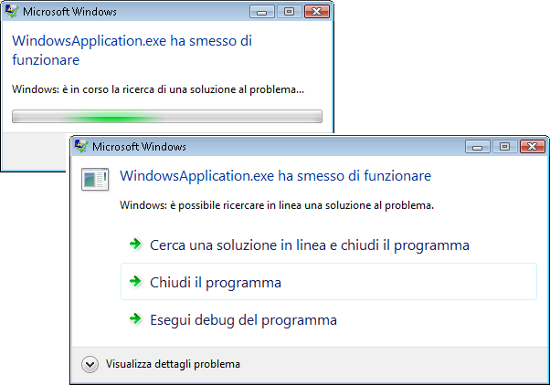
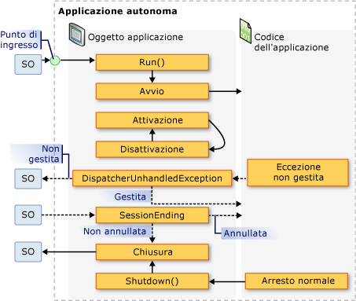
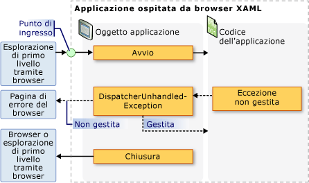

# Cenni preliminari sulla gestione di applicazioni
Tutte le applicazioni tendono a condividere un insieme comune di funzionalità che si applica all'implementazione e alla gestione.  In questo argomento viene fornita una panoramica delle funzionalità in <xref:System.Windows.Application> classe per creare e gestire applicazioni.  
  
 [!INCLUDE[autoOutline](../Token/autoOutline_md.md)]  
  
## Classe Application  
 in [!INCLUDE[TLA2#tla_wpf](../../../../includes/tla2sharptla-wpf-md.md)], la funzionalità con ambito di applicazione vengono incapsulate in  <xref:System.Windows.Application> classe.  <xref:System.Windows.Application> la classe include le funzionalità seguenti:  
  
-   Controllo della durata di un'applicazione e interazione con la stessa.  
  
-   Recupero ed elaborazione dei parametri della riga di comando.  
  
-   Rilevamento e risposta a eccezioni non gestite.  
  
-   Condivisione di proprietà e risorse con ambito di applicazione.  
  
-   Gestione di finestre in applicazioni autonome.  
  
-   Rilevamento e gestione di navigazione.  
  
<a name="The_Application_Class"></a>   
## Come eseguire attività comuni utilizzando la classe di applicazione  
 Se non si è interessati in dettaglio tutti di <xref:System.Windows.Application> classificare, i la tabella seguente sono alcune delle comuni attività per  <xref:System.Windows.Application> e viene descritto come eseguirle.  Visualizzando l'API e argomenti correlati, è possibile trovare ulteriori informazioni e un codice di esempio.  
  
|Task|Approccio|  
|----------|---------------|  
|ottenere un oggetto che rappresenta l'applicazione corrente|Utilizzare la proprietà <xref:System.Windows.Application.Current%2A?displayProperty=fullName>.|  
|Aggiungere uno schermo di avvio a un'applicazione|Vedere [Aggiunta di una schermata iniziale in un'applicazione WPF](../../../../docs/framework/wpf/app-development/how-to-add-a-splash-screen-to-a-wpf-application.md).|  
|Avviare un'applicazione|Utilizzare il metodo <xref:System.Windows.Application.Run%2A?displayProperty=fullName>.|  
|Arrestare un'applicazione|Utilizzare il metodo <xref:System.Windows.Application.Shutdown%2A> dell'oggetto <xref:System.Windows.Application.Current%2A?displayProperty=fullName>.|  
|Ottenere gli argomenti della riga di comando|gestire <xref:System.Windows.Application.Startup?displayProperty=fullName> l'evento e viene utilizzato  <xref:System.Windows.StartupEventArgs.Args%2A?displayProperty=fullName> proprietà.  per un esempio, vedere <xref:System.Windows.Application.Startup?displayProperty=fullName> evento.|  
|Ottenere e impostare il codice di uscita di applicazione|impostare <xref:System.Windows.ExitEventArgs.ApplicationExitCode%2A?displayProperty=fullName> proprietà di  <xref:System.Windows.Application.Exit?displayProperty=fullName> il gestore eventi chiama o  <xref:System.Windows.Application.Shutdown%2A> metodo e passare in un Integer.|  
|Rilevare e risolvere le eccezioni non gestite|Gestire l'evento <xref:System.Windows.Application.DispatcherUnhandledException>.|  
|ottenere e impostare le risorse con ambito di applicazione|Utilizzare la proprietà <xref:System.Windows.Application.Resources%2A?displayProperty=fullName>.|  
|Utilizzare un dizionario risorse con ambito di applicazione|Vedere [Utilizzare un dizionario di risorse dell'ambito dell'applicazione](../../../../docs/framework/wpf/app-development/how-to-use-an-application-scope-resource-dictionary.md).|  
|ottenere e impostare le proprietà con ambito di applicazione|Utilizzare la proprietà <xref:System.Windows.Application.Properties%2A?displayProperty=fullName>.|  
|ottenere e salvare lo stato di un'applicazione|Vedere [Rendere persistenti e ripristinare le proprietà dell'ambito dell'applicazione nelle sessioni dell'applicazione](../../../../docs/framework/wpf/app-development/persist-and-restore-application-scope-properties.md).|  
|Gestire i file di dati non di codice, inclusi i file di risorse, i file di dati e i file del sito di origine.|Vedere [File di dati e di risorse dell'applicazione WPF.](../../../../docs/framework/wpf/app-development/wpf-application-resource-content-and-data-files.md).|  
|Gestione di finestre in applicazioni autonome|Vedere [Cenni preliminari sulle finestre WPF](../../../../docs/framework/wpf/app-development/wpf-windows-overview.md).|  
|Per rilevare e gestire la navigazione|Vedere [Cenni preliminari sulla navigazione](../../../../docs/framework/wpf/app-development/navigation-overview.md).|  
  
<a name="The_Application_Definition"></a>   
## Definizione di applicazione  
 Per utilizzare la funzionalità di <xref:System.Windows.Application> classe, è necessario implementare una definizione di applicazione.  Una definizione di applicazione [!INCLUDE[TLA2#tla_wpf](../../../../includes/tla2sharptla-wpf-md.md)]è una classe che deriva da <xref:System.Windows.Application> ed è configurata con un'impostazione [!INCLUDE[TLA#tla_msbuild](../../../../includes/tlasharptla-msbuild-md.md)] speciale.  
  
### Implementazione di una definizione di applicazione  
 Una definizione di applicazione [!INCLUDE[TLA2#tla_wpf](../../../../includes/tla2sharptla-wpf-md.md)] tipica viene implementata mediante markup e code\-behind.  In questo modo è possibile utilizzare il markup per impostare in modo dichiarativo le proprietà dell'applicazione, le risorse e registrare gli eventi, gestendo al contempo gli eventi e implementando il comportamento specifico dell'applicazione nel code\-behind.  
  
 Nell'esempio seguente viene illustrato come implementare una definizione di applicazione tramite markup e code\-behind:  
  
 [!code-xml[ApplicationSnippets#ApplicationXAML](../../../../samples/snippets/csharp/VS_Snippets_Wpf/ApplicationSnippets/CSharp/App.xaml#applicationxaml)]  
  
 [!code-csharp[ApplicationSnippets#ApplicationCODEBEHIND](../../../../samples/snippets/csharp/VS_Snippets_Wpf/ApplicationSnippets/CSharp/App.xaml.cs#applicationcodebehind)]
 [!code-vb[ApplicationSnippets#ApplicationCODEBEHIND](../../../../samples/snippets/visualbasic/VS_Snippets_Wpf/ApplicationSnippets/visualbasic/application.xaml.vb#applicationcodebehind)]  
  
 Per consentire il funzionamento congiunto di un file di markup e un file code\-behind, è necessario soddisfare le seguenti condizioni:  
  
-   Nel markup, l'elemento `Application` deve includere l'attributo `x:Class`.  Quando l'applicazione viene compilata, la presenza di `x:Class` nel file di markup fa sì che [!INCLUDE[TLA2#tla_msbuild](../../../../includes/tla2sharptla-msbuild-md.md)] crei una classe `partial` derivante da <xref:System.Windows.Application> e avente il nome specificato dall'attributo `x:Class`.  Questo richiede l'aggiunta di una dichiarazione dello spazio dei nomi [!INCLUDE[TLA2#tla_xml](../../../../includes/tla2sharptla-xml-md.md)] per lo schema [!INCLUDE[TLA2#tla_xaml](../../../../includes/tla2sharptla-xaml-md.md)] \(`xmlns:x="http://schemas.microsoft.com/winfx/2006/xaml"`\).  
  
-   Nel code\-behind, la classe deve essere una classe `partial` con lo stesso nome specificato dall'attributo `x:Class` nel markup e deve derivare da <xref:System.Windows.Application>.  In questo modo il file code\-behind può essere associato alla classe `partial` generata per il file di markup durante la compilazione dell'applicazione \(vedere [Compilazione di un'applicazione WPF](../../../../docs/framework/wpf/app-development/building-a-wpf-application-wpf.md)\).  
  
> [!NOTE]
>  Quando si crea un nuovo progetto di applicazione WPF o di applicazione browser WPF utilizzando [!INCLUDE[TLA#tla_visualstu](../../../../includes/tlasharptla-visualstu-md.md)], una definizione di applicazione viene inclusa per impostazione predefinita e definita tramite markup e code\-behind.  
  
 Questo codice è il requisito minimo necessario per implementare una definizione di applicazione.  È tuttavia necessario creare una configurazione [!INCLUDE[TLA2#tla_msbuild](../../../../includes/tla2sharptla-msbuild-md.md)] aggiuntiva per la definizione di applicazione prima di compilare ed eseguire l'applicazione.  
  
### Configurazione della definizione di applicazione per MSBuild  
 L'esecuzione delle applicazioni autonome e delle [!INCLUDE[TLA#tla_xbap#plural](../../../../includes/tlasharptla-xbapsharpplural-md.md)] richiede l'implementazione di un determinato livello di infrastruttura.  La parte più importante di questa infrastruttura è il punto di ingresso.  Quando un'applicazione viene avviata da un utente, il sistema operativo chiama il punto di ingresso, una funzione nota per l'avvio di applicazioni.  
  
 In precedenza, occorreva che gli sviluppatori scrivessero personalmente l'intero codice o parte di esso, a seconda della tecnologia.  [!INCLUDE[TLA2#tla_wpf](../../../../includes/tla2sharptla-wpf-md.md)] genera invece questo codice quando il file di markup della definizione di applicazione viene configurato come elemento `ApplicationDefinition` [!INCLUDE[TLA2#tla_msbuild](../../../../includes/tla2sharptla-msbuild-md.md)], come illustrato nel seguente file di progetto [!INCLUDE[TLA2#tla_msbuild](../../../../includes/tla2sharptla-msbuild-md.md)]:  
  
```  
<Project   
  DefaultTargets="Build"  
  xmlns="http://schemas.microsoft.com/developer/msbuild/2003">  
  ...  
  <ApplicationDefinition Include="App.xaml" />  
  <Compile Include="App.xaml.cs" />  
  ...  
</Project>  
```  
  
 Poiché il file code\-behind contiene codice, viene contrassegnato come elemento `Compile` [!INCLUDE[TLA2#tla_msbuild](../../../../includes/tla2sharptla-msbuild-md.md)], come vuole la prassi.  
  
 L'applicazione di queste configurazioni [!INCLUDE[TLA2#tla_msbuild](../../../../includes/tla2sharptla-msbuild-md.md)] ai file di markup e code\-behind di una definizione di applicazione fa sì che [!INCLUDE[TLA2#tla_msbuild](../../../../includes/tla2sharptla-msbuild-md.md)] generi codice analogo a quello riportato di seguito:  
  
 [!code-csharp[AppDefAugSnippets#AppDefAugCODE1](../../../../samples/snippets/csharp/VS_Snippets_Wpf/AppDefAugSnippets/CSharp/App.cs#appdefaugcode1)]
 [!code-vb[AppDefAugSnippets#AppDefAugCODE1](../../../../samples/snippets/visualbasic/VS_Snippets_Wpf/AppDefAugSnippets/VisualBasic/App.vb#appdefaugcode1)]  
[!code-csharp[AppDefAugSnippets#AppDefAugCODE2](../../../../samples/snippets/csharp/VS_Snippets_Wpf/AppDefAugSnippets/CSharp/App.cs#appdefaugcode2)]
[!code-vb[AppDefAugSnippets#AppDefAugCODE2](../../../../samples/snippets/visualbasic/VS_Snippets_Wpf/AppDefAugSnippets/VisualBasic/App.vb#appdefaugcode2)]  
  
 Il codice risultante integra la definizione di applicazione con un codice di infrastruttura aggiuntivo, il quale include il metodo del punto di ingresso `Main`.  L'attributo <xref:System.STAThreadAttribute> viene applicato al metodo `Main` per indicare che il thread principale dell'[!INCLUDE[TLA2#tla_ui](../../../../includes/tla2sharptla-ui-md.md)] per l'applicazione [!INCLUDE[TLA2#tla_wpf](../../../../includes/tla2sharptla-wpf-md.md)] è un thread STA, necessario nel caso di applicazioni [!INCLUDE[TLA2#tla_wpf](../../../../includes/tla2sharptla-wpf-md.md)]. Quando viene chiamato, `Main` crea una nuova istanza di `App` prima di chiamare il metodo `InitializeComponent` per registrare gli eventi e impostare le proprietà implementate nel markup.  Poiché `InitializeComponent` viene generato da WPF, non sarà necessario chiamarlo in modo esplicito da una definizione di applicazione, come avviene invece per le implementazioni di <xref:System.Windows.Controls.Page> e <xref:System.Windows.Window>.  Infine viene chiamato il metodo <xref:System.Windows.Application.Run%2A> per avviare l'applicazione.  
  
<a name="Getting_the_Current_Application"></a>   
## Ottenere l'applicazione corrente  
 Poiché la funzionalità di <xref:System.Windows.Application> la classe è condivisa tra un'applicazione, potrebbe essere necessario sostenere una sola istanza di  <xref:System.Windows.Application> classe per  <xref:System.AppDomain>.  Per fare in modo che questo accada, la classe <xref:System.Windows.Application> viene implementata come classe Singleton \(vedere [Implementing Singleton in C\#](http://go.microsoft.com/fwlink/?LinkId=100567) \- informazioni in lingua inglese\), la quale crea un'unica istanza di se stessa e ne fornisce l'accesso condiviso mediante la proprietà <xref:System.Windows.Application.Current%2A> `static`.  
  
 Nel codice riportato di seguito viene illustrato come acquisire un riferimento all'oggetto <xref:System.Windows.Application> per <xref:System.AppDomain> corrente.  
  
 [!code-csharp[ApplicationManagementOverviewSnippets#GetCurrentAppCODE](../../../../samples/snippets/csharp/VS_Snippets_Wpf/ApplicationManagementOverviewSnippets/CSharp/MainWindow.xaml.cs#getcurrentappcode)]
 [!code-vb[ApplicationManagementOverviewSnippets#GetCurrentAppCODE](../../../../samples/snippets/visualbasic/VS_Snippets_Wpf/ApplicationManagementOverviewSnippets/VisualBasic/MainWindow.xaml.vb#getcurrentappcode)]  
  
 <xref:System.Windows.Application.Current%2A> restituisce un riferimento a un'istanza della classe <xref:System.Windows.Application>.  Per ottenere un riferimento alla classe derivata <xref:System.Windows.Application> è necessario eseguire il cast del valore della proprietà <xref:System.Windows.Application.Current%2A>, come illustrato nell'esempio che segue.  
  
 [!code-csharp[ApplicationManagementOverviewSnippets#GetSTCurrentAppCODE](../../../../samples/snippets/csharp/VS_Snippets_Wpf/ApplicationManagementOverviewSnippets/CSharp/MainWindow.xaml.cs#getstcurrentappcode)]
 [!code-vb[ApplicationManagementOverviewSnippets#GetSTCurrentAppCODE](../../../../samples/snippets/visualbasic/VS_Snippets_Wpf/ApplicationManagementOverviewSnippets/VisualBasic/MainWindow.xaml.vb#getstcurrentappcode)]  
  
 Il valore di <xref:System.Windows.Application.Current%2A> può essere controllato in qualsiasi momento nel corso della durata di un oggetto <xref:System.Windows.Application>.  Tuttavia, è necessario prestare attenzione.  Una volta creata un'istanza della classe <xref:System.Windows.Application>, lo stato dell'oggetto <xref:System.Windows.Application> diventa incoerente per un determinato periodo di tempo.  Durante questo periodo, <xref:System.Windows.Application> esegue le varie attività di inizializzazione richieste dal codice per l'esecuzione, incluso stabilire l'infrastruttura dell'applicazione, impostare le proprietà e registrare gli eventi.  Se si tenta di utilizzare l'oggetto <xref:System.Windows.Application> durante questo periodo, il codice potrebbe avere risultati imprevisti, in particolare se dipende dalle varie proprietà di <xref:System.Windows.Application> impostate.  
  
 Nel momento in cui <xref:System.Windows.Application> completa le operazioni di inizializzazione, ha inizio la reale durata.  
  
<a name="Application_Lifetime"></a>   
## Durata dell'applicazione  
 La durata di un'applicazione [!INCLUDE[TLA2#tla_wpf](../../../../includes/tla2sharptla-wpf-md.md)] è segnata da diversi eventi generati da <xref:System.Windows.Application>, grazie ai quali è possibile sapere quando l'applicazione è stata avviata, attivata e disattivata, nonché chiusa.  
  
 [!INCLUDE[autoOutline](../Token/autoOutline_md.md)]  
  
<a name="Splash_Screen"></a>   
### Schermata iniziale  
 A partire da [!INCLUDE[net_v35SP1_short](../../../../includes/net-v35sp1-short-md.md)], è possibile specificare un'immagine da utilizzare in una finestra di avvio o *schermata iniziale*.  La classe <xref:System.Windows.SplashScreen> agevola la visualizzazione di una finestra di avvio mentre l'applicazione viene caricata.  La finestra <xref:System.Windows.SplashScreen> viene creata e visualizzata prima che venga chiamato <xref:System.Windows.Application.Run%2A>.  Per ulteriori informazioni, vedere [Tempo di avvio delle applicazioni](../../../../docs/framework/wpf/advanced/application-startup-time.md) e [Aggiunta di una schermata iniziale in un'applicazione WPF](../../../../docs/framework/wpf/app-development/how-to-add-a-splash-screen-to-a-wpf-application.md).  
  
<a name="Starting_an_Application"></a>   
### Avvio di un'applicazione  
 Una volta chiamato <xref:System.Windows.Application.Run%2A> e inizializzata l'applicazione, questa è pronta per essere eseguita.  Questo momento corrisponde al momento in cui viene generato l'evento <xref:System.Windows.Application.Startup>:  
  
 [!code-csharp[ApplicationStartupSnippets#StartupCODEBEHIND1](../../../../samples/snippets/csharp/VS_Snippets_Wpf/ApplicationStartupSnippets/CSharp/App.xaml.cs#startupcodebehind1)]
 [!code-vb[ApplicationStartupSnippets#StartupCODEBEHIND1](../../../../samples/snippets/visualbasic/VS_Snippets_Wpf/ApplicationStartupSnippets/visualbasic/application.xaml.vb#startupcodebehind1)]  
[!code-csharp[ApplicationStartupSnippets#StartupCODEBEHIND2](../../../../samples/snippets/csharp/VS_Snippets_Wpf/ApplicationStartupSnippets/CSharp/App.xaml.cs#startupcodebehind2)]
[!code-vb[ApplicationStartupSnippets#StartupCODEBEHIND2](../../../../samples/snippets/visualbasic/VS_Snippets_Wpf/ApplicationStartupSnippets/visualbasic/application.xaml.vb#startupcodebehind2)]  
  
 A questo punto della durata di un'applicazione, l'operazione più comune da eseguire è la visualizzazione di un'[!INCLUDE[TLA2#tla_ui](../../../../includes/tla2sharptla-ui-md.md)].  
  
<a name="Showing_a_User_Interface"></a>   
### Visualizzazione di un'interfaccia utente  
 Gran parte delle applicazioni [!INCLUDE[TLA2#tla_mswin](../../../../includes/tla2sharptla-mswin-md.md)] autonome aprono un oggetto <xref:System.Windows.Window> una volta iniziata l'esecuzione.  Il gestore eventi <xref:System.Windows.Application.Startup> è uno dei percorsi da cui è possibile eseguire questa operazione, come illustrato nel codice che segue.  
  
 [!code-xml[AppShowWindowHardSnippets#StartupEventMARKUP](../../../../samples/snippets/csharp/VS_Snippets_Wpf/AppShowWindowHardSnippets/CSharp/App.xaml#startupeventmarkup)]  
  
 [!code-csharp[AppShowWindowHardSnippets#StartupEventCODEBEHIND](../../../../samples/snippets/csharp/VS_Snippets_Wpf/AppShowWindowHardSnippets/CSharp/App.xaml.cs#startupeventcodebehind)]
 [!code-vb[AppShowWindowHardSnippets#StartupEventCODEBEHIND](../../../../samples/snippets/visualbasic/VS_Snippets_Wpf/AppShowWindowHardSnippets/VisualBasic/Application.xaml.vb#startupeventcodebehind)]  
  
> [!NOTE]
>  Per impostazione predefinita, il primo oggetto <xref:System.Windows.Window> di cui viene creata un'istanza in un'applicazione autonoma diventa la finestra principale dell'applicazione.  A questo oggetto <xref:System.Windows.Window> fa riferimento la proprietà <xref:System.Windows.Application.MainWindow%2A?displayProperty=fullName>.  Il valore della proprietà <xref:System.Windows.Application.MainWindow%2A> può essere modificato a livello di codice se si desidera che la finestra principale sia una finestra diversa dal primo oggetto <xref:System.Windows.Window> di cui è stata creata un'istanza.  
  
 Al primo avvio di un'applicazione [!INCLUDE[TLA2#tla_xbap](../../../../includes/tla2sharptla-xbap-md.md)], è probabile che si verifichi uno spostamento su un oggetto <xref:System.Windows.Controls.Page>,  come illustrato nel codice che segue.  
  
 [!code-xml[XBAPAppStartupSnippets#StartupXBAPMARKUP](../../../../samples/snippets/csharp/VS_Snippets_Wpf/XBAPAppStartupSnippets/CSharp/App.xaml#startupxbapmarkup)]  
  
 [!code-csharp[XBAPAppStartupSnippets#StartupXBAPCODEBEHIND](../../../../samples/snippets/csharp/VS_Snippets_Wpf/XBAPAppStartupSnippets/CSharp/App.xaml.cs#startupxbapcodebehind)]
 [!code-vb[XBAPAppStartupSnippets#StartupXBAPCODEBEHIND](../../../../samples/snippets/visualbasic/VS_Snippets_Wpf/XBAPAppStartupSnippets/VisualBasic/Application.xaml.vb#startupxbapcodebehind)]  
  
 Se <xref:System.Windows.Application.Startup> viene gestito per la sola apertura di un oggetto <xref:System.Windows.Window> o lo spostamento su un oggetto <xref:System.Windows.Controls.Page>, è possibile impostare l'attributo `StartupUri` nel markup.  
  
 Nell'esempio seguente viene illustrato come utilizzare <xref:System.Windows.Application.StartupUri%2A> da un'applicazione autonoma per aprire un oggetto <xref:System.Windows.Window>.  
  
 [!code-xml[ApplicationManagementOverviewSnippets#OverviewStartupUriMARKUP](../../../../samples/snippets/csharp/VS_Snippets_Wpf/ApplicationManagementOverviewSnippets/CSharp/App.xaml#overviewstartupurimarkup)]  
  
 Nell'esempio seguente viene illustrato come utilizzare <xref:System.Windows.Application.StartupUri%2A> da un'applicazione [!INCLUDE[TLA2#tla_xbap](../../../../includes/tla2sharptla-xbap-md.md)] per spostarsi su un oggetto <xref:System.Windows.Controls.Page>.  
  
 [!code-xml[PageSnippets#XBAPStartupUriMARKUP](../../../../samples/snippets/csharp/VS_Snippets_Wpf/PageSnippets/CSharp/App.xaml#xbapstartupurimarkup)]  
  
 Questo markup ha lo stesso effetto del codice precedente per l'apertura di una finestra.  
  
> [!NOTE]
>  Per ulteriori informazioni sulla navigazione, vedere [Cenni preliminari sulla navigazione](../../../../docs/framework/wpf/app-development/navigation-overview.md).  
  
 L'evento <xref:System.Windows.Application.Startup> deve essere gestito per l'apertura di un oggetto <xref:System.Windows.Window> nei seguenti casi: se è necessario crearne un'istanza tramite un costruttore non predefinito, se è necessario impostarne le proprietà o sottoscriverne gli eventi prima di visualizzarlo oppure se occorre elaborare gli argomenti della riga di comando forniti in fase di avvio dell'applicazione.  
  
<a name="Processing_Command_Line_Arguments"></a>   
### Elaborazione degli argomenti della riga di comando  
 In [!INCLUDE[TLA2#tla_mswin](../../../../includes/tla2sharptla-mswin-md.md)], le applicazioni autonome possono essere avviate da un prompt dei comandi oppure dal desktop.  In entrambi i casi, gli argomenti della riga di comando possono essere passati all'applicazione. Nell'esempio che segue viene illustrata un'applicazione avviata con un unico argomento della riga di comando, "\/StartMinimized":  
  
 `wpfapplication.exe /StartMinimized`  
  
 Durante l'inizializzazione dell'applicazione, [!INCLUDE[TLA2#tla_wpf](../../../../includes/tla2sharptla-wpf-md.md)] recupera gli argomenti della riga di comando dal sistema operativo e li passa al gestore eventi <xref:System.Windows.Application.Startup> tramite la proprietà <xref:System.Windows.StartupEventArgs.Args%2A> del parametro <xref:System.Windows.StartupEventArgs>.  Gli argomenti della riga di comando possono essere recuperati e archiviati tramite codice analogo a quello riportato di seguito.  
  
 [!code-xml[ApplicationStartupSnippets#HandleStartupXAML](../../../../samples/snippets/csharp/VS_Snippets_Wpf/ApplicationStartupSnippets/CSharp/App.xaml#handlestartupxaml)]  
  
 [!code-csharp[ApplicationStartupSnippets#HandleStartupCODEBEHIND](../../../../samples/snippets/csharp/VS_Snippets_Wpf/ApplicationStartupSnippets/CSharp/App.xaml.cs#handlestartupcodebehind)]
 [!code-vb[ApplicationStartupSnippets#HandleStartupCODEBEHIND](../../../../samples/snippets/visualbasic/VS_Snippets_Wpf/ApplicationStartupSnippets/visualbasic/application.xaml.vb#handlestartupcodebehind)]  
  
 Il codice gestisce <xref:System.Windows.Application.Startup> per controllare se l'argomento della riga di comando **\/StartMinimized** è stato fornito; in caso affermativo, apre la finestra principale con <xref:System.Windows.WindowState> equivalente a <xref:System.Windows.WindowState>.  Poiché la proprietà <xref:System.Windows.Window.WindowState%2A> deve essere impostata a livello di codice, l'oggetto <xref:System.Windows.Window> principale deve essere esplicitamente aperto nel codice.  
  
 Le applicazioni [!INCLUDE[TLA2#tla_xbap#plural](../../../../includes/tla2sharptla-xbapsharpplural-md.md)] non possono recuperare ed elaborare gli argomenti della riga di comando poiché vengono avviate mediante distribuzione [!INCLUDE[TLA#tla_clickonce](../../../../includes/tlasharptla-clickonce-md.md)] \(vedere [Distribuzione di un'applicazione WPF](../../../../docs/framework/wpf/app-development/deploying-a-wpf-application-wpf.md)\).  Tuttavia sono in grado di recuperare ed elaborare i parametri delle stringhe di query dagli URL utilizzati per l'avvio.  
  
<a name="Application_Activation_and_Deactivation"></a>   
### Attivazione e disattivazione di un'applicazione  
 [!INCLUDE[TLA2#tla_mswin](../../../../includes/tla2sharptla-mswin-md.md)] consente agli utenti di passare da un'applicazione all'altra. Il metodo più comune consiste nell'utilizzo della combinazione di tasti ALT\+TAB.  Per passare a un'applicazione, occorre che questa disponga di un oggetto <xref:System.Windows.Window> visibile e selezionabile da parte di un utente.  L'oggetto <xref:System.Windows.Window> attualmente selezionato rappresenta la *finestra attiva*, nota anche come *finestra in primo piano*, ed è l'oggetto <xref:System.Windows.Window> che riceve l'input dall'utente. L'applicazione alla quale appartiene la finestra attiva è definita *applicazione attiva* o *applicazione in primo piano*. Di seguito vengono riportati i casi in cui un'applicazione diventa l'applicazione attiva:  
  
-   Viene avviata e visualizza un oggetto <xref:System.Windows.Window>.  
  
-   Un utente passa da un'altra applicazione a quella in questione selezionando un oggetto <xref:System.Windows.Window> nella stessa.  
  
 È possibile rilevare quando un'applicazione diventa attiva mediante gestione dell'evento <xref:System.Windows.Application.Activated?displayProperty=fullName>.  
  
 Allo stesso modo, un'applicazione diventa inattiva nei seguenti casi:  
  
-   Un utente passa dall'applicazione corrente a un'altra applicazione.  
  
-   L'applicazione viene chiusa.  
  
 È possibile rilevare quando un'applicazione diventa inattiva mediante gestione dell'evento <xref:System.Windows.Application.Deactivated?displayProperty=fullName>.  
  
 Nel codice seguente viene illustrato come gestire gli eventi <xref:System.Windows.Application.Activated> e <xref:System.Windows.Application.Deactivated> per determinare se un'applicazione è attiva o meno.  
  
 [!code-xml[ApplicationActivationSnippets#DetectActivationStateXAML](../../../../samples/snippets/csharp/VS_Snippets_Wpf/ApplicationActivationSnippets/CSharp/App.xaml#detectactivationstatexaml)]  
  
 [!code-csharp[ApplicationActivationSnippets#DetectActivationStateCODEBEHIND](../../../../samples/snippets/csharp/VS_Snippets_Wpf/ApplicationActivationSnippets/CSharp/App.xaml.cs#detectactivationstatecodebehind)]
 [!code-vb[ApplicationActivationSnippets#DetectActivationStateCODEBEHIND](../../../../samples/snippets/visualbasic/VS_Snippets_Wpf/ApplicationActivationSnippets/visualbasic/application.xaml.vb#detectactivationstatecodebehind)]  
  
 Anche <xref:System.Windows.Window> può essere attivato e disattivato.  Per ulteriori informazioni, vedere <xref:System.Windows.Window.Activated?displayProperty=fullName> e <xref:System.Windows.Window.Deactivated?displayProperty=fullName>.  
  
> [!NOTE]
>  Per quanto riguarda le applicazioni [!INCLUDE[TLA2#tla_xbap#plural](../../../../includes/tla2sharptla-xbapsharpplural-md.md)], <xref:System.Windows.Application.Activated?displayProperty=fullName> e <xref:System.Windows.Application.Deactivated?displayProperty=fullName> non vengono generati.  
  
<a name="Application_Shutdown"></a>   
### Chiusura di un'applicazione  
 La durata di un'applicazione termina quando questa viene chiusa per uno dei seguenti motivi:  
  
-   Un utente chiude tutti gli oggetti <xref:System.Windows.Window>.  
  
-   Un utente chiude l'oggetto <xref:System.Windows.Window> principale.  
  
-   Un utente termina la sessione di [!INCLUDE[TLA2#tla_mswin](../../../../includes/tla2sharptla-mswin-md.md)] mediante disconnessione o spegnimento del computer.  
  
-   È stata soddisfatta una condizione specifica dell'applicazione.  
  
 Per facilitare la gestione della chiusura di un'applicazione, <xref:System.Windows.Application> fornisce il metodo <xref:System.Windows.Application.Shutdown%2A>, la proprietà <xref:System.Windows.Application.ShutdownMode%2A> e gli eventi <xref:System.Windows.Application.SessionEnding> ed <xref:System.Windows.Application.Exit>.  
  
> [!NOTE]
>  <xref:System.Windows.Application.Shutdown%2A> può essere chiamato unicamente da applicazioni dotate di <xref:System.Security.Permissions.UIPermission>.  Le applicazioni [!INCLUDE[TLA2#tla_wpf](../../../../includes/tla2sharptla-wpf-md.md)] autonome possiedono sempre questa autorizzazione.  Le applicazioni [!INCLUDE[TLA2#tla_xbap#plural](../../../../includes/tla2sharptla-xbapsharpplural-md.md)] in esecuzione nella sandbox di sicurezza con attendibilità parziale dell'area Internet non dispongono invece di tale autorizzazione.  
  
#### Modalità di chiusura  
 La maggior parte delle applicazioni vengono chiuse in seguito a chiusura di tutte le finestre o della finestra principale.  Talvolta però la chiusura di un'applicazione viene determinata da altre condizioni specifiche della stessa.  Tali condizioni possono essere specificate impostando <xref:System.Windows.Application.ShutdownMode%2A> con uno dei valori di enumerazione <xref:System.Windows.ShutdownMode> seguenti:  
  
-   <xref:System.Windows.ShutdownMode>  
  
-   <xref:System.Windows.ShutdownMode>  
  
-   <xref:System.Windows.ShutdownMode>  
  
 Il valore predefinito di <xref:System.Windows.Application.ShutdownMode%2A> è <xref:System.Windows.ShutdownMode>, il quale determina la chiusura automatica di un'applicazione quando l'ultima finestra di questa viene chiusa dall'utente.  Tuttavia è anche possibile fare in modo che l'applicazione venga chiusa quando si chiude la finestra principale. [!INCLUDE[TLA2#tla_wpf](../../../../includes/tla2sharptla-wpf-md.md)] esegue automaticamente tale operazione se si imposta <xref:System.Windows.Application.ShutdownMode%2A> su <xref:System.Windows.ShutdownMode>,  Questa operazione viene mostrata nell'esempio seguente.  
  
 [!code-xml[ApplicationShutdownModeSnippets#OnMainWindowCloseMARKUP](../../../../samples/snippets/csharp/VS_Snippets_Wpf/ApplicationShutdownModeSnippets/CS/Page1.xaml#onmainwindowclosemarkup)]  
  
 In presenza di condizioni di chiusura specifiche dell'applicazione, impostare <xref:System.Windows.Application.ShutdownMode%2A> su <xref:System.Windows.ShutdownMode>.  In questo caso, per chiudere un'applicazione sarà necessario chiamare in modo esplicito il metodo <xref:System.Windows.Application.Shutdown%2A>; in caso contrario, l'applicazione continuerà a essere eseguita anche se tutte le finestre sono chiuse.  <xref:System.Windows.Application.Shutdown%2A> viene chiamato in modo implicito quando <xref:System.Windows.Application.ShutdownMode%2A> è impostato su <xref:System.Windows.ShutdownMode> o <xref:System.Windows.ShutdownMode>.  
  
> [!NOTE]
>  Se si imposta <xref:System.Windows.Application.ShutdownMode%2A> da un'applicazione [!INCLUDE[TLA2#tla_xbap](../../../../includes/tla2sharptla-xbap-md.md)], tale impostazione verrà ignorata. Un'applicazione [!INCLUDE[TLA2#tla_xbap](../../../../includes/tla2sharptla-xbap-md.md)] viene sempre chiusa in caso di spostamento dalla stessa in un browser oppure quando il browser che la ospita viene chiuso.  Per ulteriori informazioni, vedere [Cenni preliminari sulla navigazione](../../../../docs/framework/wpf/app-development/navigation-overview.md).  
  
#### Fine della sessione  
 Le condizioni di chiusura descritte dalla proprietà <xref:System.Windows.Application.ShutdownMode%2A> sono specifiche di un'applicazione.  In alcuni casi, tuttavia, è possibile che un'applicazione venga chiusa in seguito a una condizione esterna.  La condizione esterna più comune si verifica quando un utente termina la sessione di [!INCLUDE[TLA2#tla_mswin](../../../../includes/tla2sharptla-mswin-md.md)] mediante le seguenti azioni:  
  
-   Disconnessione  
  
-   Spegnimento  
  
-   Riavvio  
  
-   Ibernazione  
  
 Per rilevare la fine di una sessione di [!INCLUDE[TLA2#tla_mswin](../../../../includes/tla2sharptla-mswin-md.md)], è possibile gestire l'evento <xref:System.Windows.Application.SessionEnding>, come illustrato nell'esempio che segue.  
  
 [!code-xml[ApplicationSessionEndingSnippets#HandlingSessionEndingXAML](../../../../samples/snippets/csharp/VS_Snippets_Wpf/ApplicationSessionEndingSnippets/CSharp/App.xaml#handlingsessionendingxaml)]  
  
 [!code-csharp[ApplicationSessionEndingSnippets#HandlingSessionEndingCODEBEHIND](../../../../samples/snippets/csharp/VS_Snippets_Wpf/ApplicationSessionEndingSnippets/CSharp/App.xaml.cs#handlingsessionendingcodebehind)]
 [!code-vb[ApplicationSessionEndingSnippets#HandlingSessionEndingCODEBEHIND](../../../../samples/snippets/visualbasic/VS_Snippets_Wpf/ApplicationSessionEndingSnippets/visualbasic/application.xaml.vb#handlingsessionendingcodebehind)]  
  
 In questo esempio, il codice controlla la proprietà <xref:System.Windows.SessionEndingCancelEventArgs.ReasonSessionEnding%2A> per stabilire come viene terminata la sessione di [!INCLUDE[TLA2#tla_mswin](../../../../includes/tla2sharptla-mswin-md.md)].  Utilizza quindi questo valore per visualizzare un messaggio di conferma per l'utente.  Se l'utente decide che la sessione non deve terminare, il codice imposta <xref:System.ComponentModel.CancelEventArgs.Cancel%2A> su `true` per impedire la fine della sessione di [!INCLUDE[TLA2#tla_mswin](../../../../includes/tla2sharptla-mswin-md.md)].  
  
> [!NOTE]
>  <xref:System.Windows.Application.SessionEnding> non viene generato per le applicazioni [!INCLUDE[TLA2#tla_xbap#plural](../../../../includes/tla2sharptla-xbapsharpplural-md.md)].  
  
#### Exit  
 Quando un'applicazione viene chiusa, è possibile che debba eseguire alcune operazioni di elaborazione finale, ad esempio mantenere lo stato dell'applicazione.  In questi casi è possibile gestire l'evento <xref:System.Windows.Application.Exit>.  
  
 [!code-xml[HOWTOApplicationModelSnippets#PersistRestoreAppScopePropertiesXAML1](../../../../samples/snippets/csharp/VS_Snippets_Wpf/HOWTOApplicationModelSnippets/CSharp/App.xaml#persistrestoreappscopepropertiesxaml1)]  
[!code-xml[HOWTOApplicationModelSnippets#PersistRestoreAppScopePropertiesXAML2](../../../../samples/snippets/csharp/VS_Snippets_Wpf/HOWTOApplicationModelSnippets/CSharp/App.xaml#persistrestoreappscopepropertiesxaml2)]  
  
 [!code-csharp[HOWTOApplicationModelSnippets#PersistAppScopePropertiesCODEBEHIND1](../../../../samples/snippets/csharp/VS_Snippets_Wpf/HOWTOApplicationModelSnippets/CSharp/App.xaml.cs#persistappscopepropertiescodebehind1)]
 [!code-vb[HOWTOApplicationModelSnippets#PersistAppScopePropertiesCODEBEHIND1](../../../../samples/snippets/visualbasic/VS_Snippets_Wpf/HOWTOApplicationModelSnippets/visualbasic/application.xaml.vb#persistappscopepropertiescodebehind1)]  
[!code-csharp[HOWTOApplicationModelSnippets#PersistAppScopePropertiesCODEBEHIND2](../../../../samples/snippets/csharp/VS_Snippets_Wpf/HOWTOApplicationModelSnippets/CSharp/App.xaml.cs#persistappscopepropertiescodebehind2)]
[!code-vb[HOWTOApplicationModelSnippets#PersistAppScopePropertiesCODEBEHIND2](../../../../samples/snippets/visualbasic/VS_Snippets_Wpf/HOWTOApplicationModelSnippets/visualbasic/application.xaml.vb#persistappscopepropertiescodebehind2)]  
  
 Per l'esempio completo, vedere [Rendere persistenti e ripristinare le proprietà dell'ambito dell'applicazione nelle sessioni dell'applicazione](../../../../docs/framework/wpf/app-development/persist-and-restore-application-scope-properties.md).  
  
 <xref:System.Windows.Application.Exit> può essere gestito sia da applicazioni autonome che da applicazioni [!INCLUDE[TLA2#tla_xbap#plural](../../../../includes/tla2sharptla-xbapsharpplural-md.md)].  Per quanto concerne le applicazioni [!INCLUDE[TLA2#tla_xbap#plural](../../../../includes/tla2sharptla-xbapsharpplural-md.md)], <xref:System.Windows.Application.Exit> viene generato nei seguenti casi:  
  
-   L'utente si sposta da un'applicazione [!INCLUDE[TLA2#tla_xbap](../../../../includes/tla2sharptla-xbap-md.md)].  
  
-   In [!INCLUDE[TLA2#tla_ie7](../../../../includes/tla2sharptla-ie7-md.md)], la scheda che ospita l'applicazione [!INCLUDE[TLA2#tla_xbap](../../../../includes/tla2sharptla-xbap-md.md)] viene chiusa.  
  
-   Il browser viene chiuso.  
  
#### Codice di uscita  
 Nella maggior parte dei casi le applicazioni vengono avviate dal sistema operativo in risposta a una richiesta dell'utente.  Tuttavia è possibile che un'applicazione venga avviata da un'altra applicazione per eseguire un'attività specifica.  Quando l'applicazione avviata viene chiusa, è possibile che l'altra applicazione voglia conoscere la condizione che ne ha determinato la chiusura.  In questi casi, [!INCLUDE[TLA2#tla_mswin](../../../../includes/tla2sharptla-mswin-md.md)] consente alle applicazioni di restituire un codice di uscita al momento della chiusura.  Per impostazione predefinita, le applicazioni [!INCLUDE[TLA2#tla_wpf](../../../../includes/tla2sharptla-wpf-md.md)] restituiscono un codice di uscita con valore pari a 0.  
  
> [!NOTE]
>  Quando si esegue il debug da [!INCLUDE[TLA2#tla_visualstu](../../../../includes/tla2sharptla-visualstu-md.md)], il codice di uscita viene visualizzato nella finestra **Output** alla chiusura dell'applicazione, in un messaggio analogo a quello riportato di seguito:  
>   
>  `The program '[5340] AWPFApp.vshost.exe: Managed' has exited with code 0 (0x0).`  
>   
>  Per aprire la finestra **Output**, scegliere **Output** dal menu **Visualizza**.  
  
 Per modificare il codice di uscita è possibile chiamare l'overload di <xref:System.Windows.Application.Shutdown%28System.Int32%29>, il quale accetta un argomento integer come codice di uscita:  
  
 [!code-csharp[ApplicationExitSnippets#AppExitCODE](../../../../samples/snippets/csharp/VS_Snippets_Wpf/ApplicationExitSnippets/CSharp/MainWindow.xaml.cs#appexitcode)]
 [!code-vb[ApplicationExitSnippets#AppExitCODE](../../../../samples/snippets/visualbasic/VS_Snippets_Wpf/ApplicationExitSnippets/visualbasic/mainwindow.xaml.vb#appexitcode)]  
  
 È possibile rilevare e modificare il valore del codice di uscita mediante gestione dell'evento <xref:System.Windows.Application.Exit>.  Al gestore eventi <xref:System.Windows.Application.Exit> viene passato un oggetto <xref:System.Windows.ExitEventArgs> che consente di accedere al codice di uscita con la proprietà <xref:System.Windows.ExitEventArgs.ApplicationExitCode%2A>.  Per ulteriori informazioni, vedere <xref:System.Windows.Application.Exit>.  
  
> [!NOTE]
>  Il codice di uscita può essere impostato sia nelle applicazioni autonome che nelle applicazioni [!INCLUDE[TLA2#tla_xbap#plural](../../../../includes/tla2sharptla-xbapsharpplural-md.md)].  Tuttavia, nel caso delle applicazioni [!INCLUDE[TLA2#tla_xbap#plural](../../../../includes/tla2sharptla-xbapsharpplural-md.md)] il valore del codice viene ignorato.  
  
<a name="Unhandled_Exceptions"></a>   
### Eccezioni non gestite  
 Talvolta un'applicazione può essere chiusa in condizioni anomale, ad esempio in seguito alla generazione di un'eccezione imprevista.  In questo caso, è possibile che l'applicazione non disponga del codice necessario a rilevare ed elaborare l'eccezione.  Si avrà quindi un'eccezione non gestita e, prima della chiusura dell'applicazione, verrà visualizzata una notifica simile a quella riportata nella figura che segue.  
  
   
  
 Dal punto di vista dell'esperienza utente, è preferibile evitare questo comportamento predefinito dell'applicazione nei modi che seguono:  
  
-   Visualizzando informazioni di facile comprensione.  
  
-   Tentando di mantenere in esecuzione un'applicazione.  
  
-   Registrando informazioni sull'eccezione dettagliate e facilmente comprensibili per lo sviluppatore nel registro eventi di [!INCLUDE[TLA2#tla_mswin](../../../../includes/tla2sharptla-mswin-md.md)].  
  
 L'implementazione di questo supporto dipende dalla possibilità di rilevare o meno le eccezioni non gestite, motivo per cui viene generato l'evento <xref:System.Windows.Application.DispatcherUnhandledException>.  
  
 [!code-xml[ApplicationDispatcherUnhandledExceptionSnippets#HandleDispatcherUnhandledExceptionXAML](../../../../samples/snippets/csharp/VS_Snippets_Wpf/ApplicationDispatcherUnhandledExceptionSnippets/CSharp/App.xaml#handledispatcherunhandledexceptionxaml)]  
  
 [!code-csharp[ApplicationDispatcherUnhandledExceptionSnippets#HandleDispatcherUnhandledExceptionCODEBEHIND1](../../../../samples/snippets/csharp/VS_Snippets_Wpf/ApplicationDispatcherUnhandledExceptionSnippets/CSharp/App.xaml.cs#handledispatcherunhandledexceptioncodebehind1)]
 [!code-vb[ApplicationDispatcherUnhandledExceptionSnippets#HandleDispatcherUnhandledExceptionCODEBEHIND1](../../../../samples/snippets/visualbasic/VS_Snippets_Wpf/ApplicationDispatcherUnhandledExceptionSnippets/visualbasic/application.xaml.vb#handledispatcherunhandledexceptioncodebehind1)]  
[!code-csharp[ApplicationDispatcherUnhandledExceptionSnippets#HandleDispatcherUnhandledExceptionCODEBEHIND2](../../../../samples/snippets/csharp/VS_Snippets_Wpf/ApplicationDispatcherUnhandledExceptionSnippets/CSharp/App.xaml.cs#handledispatcherunhandledexceptioncodebehind2)]
[!code-vb[ApplicationDispatcherUnhandledExceptionSnippets#HandleDispatcherUnhandledExceptionCODEBEHIND2](../../../../samples/snippets/visualbasic/VS_Snippets_Wpf/ApplicationDispatcherUnhandledExceptionSnippets/visualbasic/application.xaml.vb#handledispatcherunhandledexceptioncodebehind2)]  
  
 Al gestore eventi <xref:System.Windows.Application.DispatcherUnhandledException> viene passato un parametro <xref:System.Windows.Threading.DispatcherUnhandledExceptionEventArgs> contenente informazioni contestuali riguardo l'eccezione non gestita, inclusa l'eccezione stessa \(<xref:System.Windows.Threading.DispatcherUnhandledExceptionEventArgs.Exception%2A?displayProperty=fullName>\).  È possibile utilizzare queste informazioni per stabilire come gestire l'eccezione.  
  
 Quando si gestisce <xref:System.Windows.Application.DispatcherUnhandledException>, è necessario impostare la proprietà <xref:System.Windows.Threading.DispatcherUnhandledExceptionEventArgs.Handled%2A?displayProperty=fullName> su `true`; in caso contrario, [!INCLUDE[TLA2#tla_wpf](../../../../includes/tla2sharptla-wpf-md.md)] continua a considerare l'eccezione come non gestita e ripristina il comportamento predefinito descritto in precedenza.  Se viene generata un'eccezione non gestita e l'evento <xref:System.Windows.Application.DispatcherUnhandledException> non è gestito oppure l'evento è gestito e <xref:System.Windows.Threading.DispatcherUnhandledExceptionEventArgs.Handled%2A> è impostato su `false`, l'applicazione viene immediatamente chiusa.  Inoltre, non vengono generati altri eventi <xref:System.Windows.Application>.  Di conseguenza, è necessario gestire <xref:System.Windows.Application.DispatcherUnhandledException> nel caso in cui l'applicazione possieda un codice da eseguire prima della chiusura.  
  
 Benché possa essere determinata da un'eccezione non gestita, in genere la chiusura di un'applicazione avviene in risposta a una richiesta dell'utente, come illustrato nella sezione che segue.  
  
<a name="Application_Lifetime_Events"></a>   
### Eventi di durata dell'applicazione  
 La durata delle applicazioni autonome e delle applicazioni [!INCLUDE[TLA2#tla_xbap#plural](../../../../includes/tla2sharptla-xbapsharpplural-md.md)] non è esattamente la stessa. Nella figura che segue vengono illustrati gli eventi principali nella durata di un'applicazione autonoma con la relativa sequenza di generazione.  
  
   
  
 Allo stesso modo, vengono illustrati anche gli eventi principali nella durata di un'applicazione [!INCLUDE[TLA2#tla_xbap](../../../../includes/tla2sharptla-xbap-md.md)] con la relativa sequenza di generazione.  
  
   
  
## Vedere anche  
 <xref:System.Windows.Application>   
 [Cenni preliminari sulle finestre WPF](../../../../docs/framework/wpf/app-development/wpf-windows-overview.md)   
 [Cenni preliminari sulla navigazione](../../../../docs/framework/wpf/app-development/navigation-overview.md)   
 [File di dati e di risorse dell'applicazione WPF.](../../../../docs/framework/wpf/app-development/wpf-application-resource-content-and-data-files.md)   
 [URI di tipo pack in WPF](../../../../docs/framework/wpf/app-development/pack-uris-in-wpf.md)   
 [Application Model: How\-to Topics](http://msdn.microsoft.com/it-it/76771b09-3688-4d1c-8818-9b3f4cf39a30)   
 [Sviluppo di applicazioni](../../../../docs/framework/wpf/app-development/index.md)