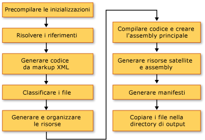

# Compilazione di un&#39;applicazione WPF (WPF)
Le applicazioni [!INCLUDE[TLA#tla_wpf](../../../../includes/tlasharptla-wpf-md.md)] possono essere compilate come file eseguibili [!INCLUDE[dnprdnshort](../../../../includes/dnprdnshort-md.md)] \(.exe\), librerie \(.dll\) o come combinazione dei due tipi di assembly.  In questo argomento viene illustrato come compilare applicazioni [!INCLUDE[TLA2#tla_wpf](../../../../includes/tla2sharptla-wpf-md.md)] e vengono descritti i passaggi chiave del processo di compilazione.  
  
   
  
<a name="Building_a_WPF_Application_using_Command_Line"></a>   
## Compilazione di un'applicazione WPF  
 È possibile compilare un'applicazione WPF nei modi seguenti:  
  
-   Riga di comando.  L'applicazione deve contenere solo codice \(non XAML\) e un file di definizione di applicazione.  Per ulteriori informazioni, vedere [Compilazione dalla riga di comando con csc.exe](../../../../ocs/csharp/language-reference/compiler-options/command-line-building-with-csc-exe.md) o [Compilazione dalla riga di comando \(Visual Basic\)](../Topic/Building%20from%20the%20Command%20Line%20\(Visual%20Basic\).md).  
  
-   Microsoft Build Engine \(MSBuild\).  Oltre al codice e ai file XAML, l'applicazione deve contenere un file di progetto MSBuild.  Per ulteriori informazioni, vedere [MSBuild](../Topic/MSBuild1.md).  
  
-   Visual Studio.  Visual Studio è un ambiente di sviluppo integrato che consente di compilare applicazioni WPF con MSBuild e include una finestra di progettazione visiva per la creazione dell'interfaccia utente.  Per ulteriori informazioni, vedere [Sviluppo di applicazioni in Visual Studio](http://msdn.microsoft.com/it-it/97490c1b-a247-41fb-8f2c-bc4c201eff68) e [WPF Designer](http://msdn.microsoft.com/it-it/c6c65214-8411-4e16-b254-163ed4099c26).  
  
<a name="The_Windows_Presentation_Foundation_Build_Pipeline"></a>   
## Pipeline di compilazione WPF  
 Quando si compila un progetto [!INCLUDE[TLA2#tla_wpf](../../../../includes/tla2sharptla-wpf-md.md)] vengono richiamate tutte le destinazioni specifiche del linguaggio e di [!INCLUDE[TLA2#tla_wpf](../../../../includes/tla2sharptla-wpf-md.md)].  Il processo di esecuzione di queste destinazioni viene definito pipeline di compilazione. Nella figura che segue vengono illustrati i principali passaggi che costituiscono tale processo.  
  
   
  
<a name="Pre_Build_Initializations"></a>   
### Inizializzazioni pre\-compilazione  
 Prima della compilazione, [!INCLUDE[TLA2#tla_msbuild](../../../../includes/tla2sharptla-msbuild-md.md)] determina il percorso di strumenti e librerie importanti, tra cui:  
  
-   Campo [!INCLUDE[TLA2#tla_winfx](../../../../includes/tla2sharptla-winfx-md.md)].  
  
-   Le directory [!INCLUDE[TLA2#tla_wcsdk](../../../../includes/tla2sharptla-wcsdk-md.md)].  
  
-   Il percorso degli assembly di riferimento [!INCLUDE[TLA2#tla_wpf](../../../../includes/tla2sharptla-wpf-md.md)].  
  
-   La proprietà per i percorsi di ricerca degli assembly.  
  
 Il primo percorso in cui [!INCLUDE[TLA2#tla_msbuild](../../../../includes/tla2sharptla-msbuild-md.md)] cerca gli assembly è la directory dell'assembly di riferimento \(%ProgramFiles%\\Reference Assemblies\\Microsoft\\Framework\\v3.0\\\).  Durante questa fase, il processo di compilazione inizializza anche le varie proprietà e i gruppi di elementi ed esegue eventuali operazioni di pulitura necessarie.  
  
<a name="Resolving_references"></a>   
### Risoluzione dei riferimenti  
 Il processo di compilazione individua e associa gli assembly richiesti per compilare il progetto di applicazione.  Questa logica è contenuta nell'attività `ResolveAssemblyReference`.  Tutti gli assembly dichiarati come `Reference` nel file di progetto vengono forniti all'attività insieme alle informazioni sui percorsi di ricerca e ai metadati degli assembly già installati nel sistema.  L'attività ricerca gli assembly e utilizza i metadati degli assembly installati per escludere gli assembly [!INCLUDE[TLA2#tla_wpf](../../../../includes/tla2sharptla-wpf-md.md)] di base che non devono essere visualizzati nei manifesti di output.  In questo modo non vi saranno informazioni ridondanti nei manifesti ClickOnce.  Ad esempio, dal momento che PresentationFramework.dll può essere considerato rappresentativo di un'applicazione compilata in e per [!INCLUDE[TLA2#tla_wpf](../../../../includes/tla2sharptla-wpf-md.md)] e tutti gli assembly [!INCLUDE[TLA2#tla_wpf](../../../../includes/tla2sharptla-wpf-md.md)] si trovano nello stesso percorso su ogni computer nel quale sia installato [!INCLUDE[TLA2#tla_winfx](../../../../includes/tla2sharptla-winfx-md.md)], non occorre includere tutte le informazioni su tutti gli assembly di riferimento [!INCLUDE[TLA2#tla_winfx](../../../../includes/tla2sharptla-winfx-md.md)] nei manifesti.  
  
<a name="Markup_Compilation___Pass_1"></a>   
### Compilazione del markup – Passaggio 1  
 In questo passaggio i file [!INCLUDE[TLA2#tla_xaml](../../../../includes/tla2sharptla-xaml-md.md)] vengono analizzati e compilati, così che il runtime non dovrà analizzare [!INCLUDE[TLA2#tla_xml](../../../../includes/tla2sharptla-xml-md.md)] né convalidare i valori delle proprietà.  Il file [!INCLUDE[TLA2#tla_xaml](../../../../includes/tla2sharptla-xaml-md.md)] compilato viene presuddiviso in token, in modo tale da rendere molto più rapido il caricamento in fase di esecuzione.  
  
 Durante questo passaggio, per ogni file [!INCLUDE[TLA2#tla_xaml](../../../../includes/tla2sharptla-xaml-md.md)] che rappresenta un elemento di compilazione `Page` vengono eseguite le seguenti attività:  
  
1.  Il file [!INCLUDE[TLA2#tla_xaml](../../../../includes/tla2sharptla-xaml-md.md)] viene analizzato dal compilatore di markup.  
  
2.  Una rappresentazione compilata viene creata per il suddetto file [!INCLUDE[TLA2#tla_xaml](../../../../includes/tla2sharptla-xaml-md.md)] e copiata nella cartella obj\\Release.  
  
3.  Una rappresentazione CodeDOM di una nuova classe parziale viene creata e copiata nella cartella obj\\Release.  
  
 Inoltre, viene generato un file di codice specifico del linguaggio per ogni file [!INCLUDE[TLA2#tla_xaml](../../../../includes/tla2sharptla-xaml-md.md)]. Ad esempio, per una pagina Page1.xaml in un progetto [!INCLUDE[TLA2#tla_visualb](../../../../includes/tla2sharptla-visualb-md.md)], viene generato un file Page1.g.vb. per una pagina Page1.xaml in un progetto [!INCLUDE[TLA2#tla_cshrp](../../../../includes/tla2sharptla-cshrp-md.md)], viene generato un file Page1.g.cs.  Il componente ".g" nel nome del file indica la generazione di un file di codice avente una dichiarazione di classe parziale per l'elemento di primo livello del file di markup, quale ad esempio `Page` o `Window`.  La classe viene dichiarata con il modificatore `partial` in [!INCLUDE[TLA2#tla_cshrp](../../../../includes/tla2sharptla-cshrp-md.md)] e `Extends` in [!INCLUDE[TLA2#tla_visualb](../../../../includes/tla2sharptla-visualb-md.md)] per indicare la presenza di un'altra dichiarazione di classe in un percorso diverso, generalmente nel file code\-behind Page1.xaml.cs.  
  
 La classe parziale si estende dalla classe di base appropriata, ad esempio <xref:System.Windows.Controls.Page> nel caso di una pagina, e implementa l'interfaccia <xref:System.Windows.Markup.IComponentConnector?displayProperty=fullName>.  L'interfaccia <xref:System.Windows.Markup.IComponentConnector> possiede metodi che consentono di inizializzare un componente e connettere nomi ed eventi negli elementi del contenuto.  Di conseguenza, l'implementazione dei metodi del file di codice generato sarà analoga alla seguente:  
  
```csharp  
public void InitializeComponent() {  
    if (_contentLoaded) {  
        return;  
    }  
    _contentLoaded = true;  
    System.Uri resourceLocater =   
        new System.Uri(  
            "window1.xaml",   
            System.UriKind.RelativeOrAbsolute);  
    System.Windows.Application.LoadComponent(this, resourceLocater);  
}  
```  
  
```vb  
Public Sub InitializeComponent() _  
  
    If _contentLoaded Then  
        Return  
    End If  
  
    _contentLoaded = True  
    Dim resourceLocater As System.Uri = _  
        New System.Uri("mainwindow.xaml", System.UriKind.Relative)  
  
    System.Windows.Application.LoadComponent(Me, resourceLocater)  
  
End Sub  
```  
  
 Per impostazione predefinita, la compilazione del markup viene eseguita nello stesso oggetto <xref:System.AppDomain> del motore [!INCLUDE[TLA2#tla_msbuild](../../../../includes/tla2sharptla-msbuild-md.md)].  In questo modo si ottengono notevoli miglioramenti delle prestazioni.  Questo comportamento può essere modificato mediante la proprietà `AlwaysCompileMarkupFilesInSeparateDomain`.  Tale proprietà offre il vantaggio di scaricare tutti gli assembly di riferimento scaricando l'oggetto <xref:System.AppDomain> separato.  
  
<a name="Pass_2_of_Markup_Compilation"></a>   
### Compilazione del markup – Passaggio 2  
 Non tutte le pagine [!INCLUDE[TLA2#tla_xaml](../../../../includes/tla2sharptla-xaml-md.md)] vengono compilate durante il passaggio 1 della compilazione del markup.  I file [!INCLUDE[TLA2#tla_xaml](../../../../includes/tla2sharptla-xaml-md.md)] con riferimenti a tipi definiti localmente, ossia definiti altrove nel codice all'interno dello stesso progetto, non vengono compilati durante questa fase.  Questo avviene perché i tipi definiti localmente esistono soltanto nell'origine e non sono ancora stati compilati.  Per determinare quanto detto il parser utilizza un'euristica che implica la ricerca di elementi, ad esempio `x:Name`, nel file di markup.  Quando un'istanza di questo tipo viene trovata, la compilazione del file di markup viene posticipata fino all'avvenuta compilazione dei file di codice, i quali verranno successivamente elaborati nel secondo passaggio di compilazione del markup.  
  
<a name="File_Classification"></a>   
### Classificazione dei file  
 Durante il processo di compilazione i file di output vengono inseriti in gruppi di risorse diversi, a seconda dell'assembly dell'applicazione in cui verranno collocati.  In un'applicazione non localizzata tipica, tutti i file di dati contrassegnati come `Resource` vengono collocati nell'assembly principale \(eseguibile o libreria\).  Quando si imposta `UICulture` nel progetto, tutti i file [!INCLUDE[TLA2#tla_xaml](../../../../includes/tla2sharptla-xaml-md.md)] compilati e le risorse specificatamente contrassegnate come specifiche della lingua vengono collocati nell'assembly di risorse satellite.  Inoltre, tutte le risorse indipendenti dalla lingua vengono collocate nell'assembly principale.  Questo passaggio del processo di compilazione comporta tale classificazione.  
  
 Le azioni di compilazione di `ApplicationDefinition`, `Page` e `Resource` nel file di progetto possono essere ampliate con i metadati `Localizable`, i cui valori accettabili sono `true` e `false`, che indicano se il file è specifico della lingua o indipendente dalla lingua.  
  
<a name="Core_Compilation"></a>   
### Compilazione principale  
 Il passaggio principale della compilazione implica la compilazione dei file di codice.  Tale operazione viene gestita dalla logica nei file delle destinazioni specifiche del linguaggio Microsoft.CSharp.targets e Microsoft.VisualBasic.targets.  Se in base all'euristica è stato stabilito che sia sufficiente un unico passaggio del compilatore di markup, allora viene generato l'assembly principale.  Tuttavia, se uno o più file [!INCLUDE[TLA2#tla_xaml](../../../../includes/tla2sharptla-xaml-md.md)] nel progetto possiedono riferimenti a tipi definiti localmente, viene generato un file DLL temporaneo e gli assembly finali dell'applicazione potranno essere creati una volta completato il secondo passaggio della compilazione del markup.  
  
<a name="Manifest_generation"></a>   
### Generazione di manifesti  
 Al termine del processo di compilazione, una volta creati tutti gli assembly e i file di dati dell'applicazione, vengono generati i manifesti [!INCLUDE[TLA2#tla_clickonce](../../../../includes/tla2sharptla-clickonce-md.md)] per l'applicazione.  
  
 Il file del manifesto di distribuzione descrive il modello di distribuzione, ovvero la versione corrente, il comportamento di aggiornamento e l'identità dell'editore insieme alla firma digitale.  Questo manifesto deve essere creato dagli amministratori che gestiscono la distribuzione.  L'estensione di file è xbap per le [!INCLUDE[TLA#tla_xbap#plural](../../../../includes/tlasharptla-xbapsharpplural-md.md)] e application per le applicazioni installate.  La prima viene stabilita dalla proprietà del progetto `HostInBrowser` e, di conseguenza, il manifesto identifica l'applicazione come ospitata da browser.  
  
 Il manifesto dell'applicazione, un file con estensione exe.manifest, descrive gli assembly e le librerie dipendenti dell'applicazione ed elenca le autorizzazioni richieste dalla stessa.  Questo file deve essere creato dallo sviluppatore di applicazioni.  Per avviare un'applicazione [!INCLUDE[TLA2#tla_clickonce](../../../../includes/tla2sharptla-clickonce-md.md)], occorre aprire il file manifesto di distribuzione dell'applicazione.  
  
 Questi file manifesto vengono sempre creati per le applicazioni [!INCLUDE[TLA2#tla_xbap#plural](../../../../includes/tla2sharptla-xbapsharpplural-md.md)].  Non vengono invece creati per le applicazioni installate, a meno che la proprietà `GenerateManifests` non sia specificata nel file di progetto con il valore `true`.  
  
 Le applicazioni [!INCLUDE[TLA2#tla_xbap#plural](../../../../includes/tla2sharptla-xbapsharpplural-md.md)] ottengono due autorizzazioni aggiuntive oltre a quelle assegnate alle applicazioni dell'area Internet tipiche: <xref:System.Security.Permissions.WebBrowserPermission> e <xref:System.Security.Permissions.MediaPermission>.  Il sistema di compilazione [!INCLUDE[TLA2#tla_wpf](../../../../includes/tla2sharptla-wpf-md.md)] dichiara le suddette autorizzazioni nel manifesto dell'applicazione.  
  
<a name="Incremental_Build_Support"></a>   
## Supporto per compilazioni incrementali  
 Il sistema di compilazione [!INCLUDE[TLA2#tla_wpf](../../../../includes/tla2sharptla-wpf-md.md)] fornisce un supporto per le compilazioni incrementali.  Tale supporto consente di rilevare le modifiche apportate al markup o al codice e compilare soltanto gli elementi interessati dalle modifiche.  Il meccanismo di compilazione incrementale utilizza i seguenti file:  
  
-   Un file $\(*NomeAssembly*\)\_MarkupCompiler.Cache per gestire lo stato del compilatore corrente.  
  
-   Un file $\(*NomeAssembly*\)\_MarkupCompiler.lref per memorizzare nella cache i file [!INCLUDE[TLA2#tla_xaml](../../../../includes/tla2sharptla-xaml-md.md)] con riferimenti a tipi definiti localmente.  
  
 Di seguito viene riportato un insieme di regole relative alla compilazione incrementale:  
  
-   Il file è l'unità più piccola in cui il sistema di compilazione rileva le modifiche.  Nel caso di un file di codice, pertanto, tale sistema non è in grado di rilevare la modifica di un tipo né l'aggiunta di codice.  Lo stesso vale per i file di progetto.  
  
-   Il meccanismo di compilazione incrementale deve tenere conto del fatto che una pagina [!INCLUDE[TLA2#tla_xaml](../../../../includes/tla2sharptla-xaml-md.md)] definisce una classe o utilizza altre classi.  
  
-   Se le voci `Reference` vengono modificate, ricompilare tutte le pagine.  
  
-   Se un file di codice viene modificato, ricompilare tutte le pagine con riferimenti a tipi definiti localmente.  
  
-   Se un file [!INCLUDE[TLA2#tla_xaml](../../../../includes/tla2sharptla-xaml-md.md)] viene modificato:  
  
    -   Se il codice [!INCLUDE[TLA2#tla_xaml](../../../../includes/tla2sharptla-xaml-md.md)] è dichiarato come `Page` nel progetto: se il codice [!INCLUDE[TLA2#tla_xaml](../../../../includes/tla2sharptla-xaml-md.md)] non possiede riferimenti a tipi definiti localmente, ricompilare il codice [!INCLUDE[TLA2#tla_xaml](../../../../includes/tla2sharptla-xaml-md.md)] e tutte le pagine [!INCLUDE[TLA2#tla_xaml](../../../../includes/tla2sharptla-xaml-md.md)] con riferimenti locali; se il codice [!INCLUDE[TLA2#tla_xaml](../../../../includes/tla2sharptla-xaml-md.md)] possiede riferimenti locali, ricompilare tutte le pagine [!INCLUDE[TLA2#tla_xaml](../../../../includes/tla2sharptla-xaml-md.md)] con riferimenti locali.  
  
    -   Se il codice [!INCLUDE[TLA2#tla_xaml](../../../../includes/tla2sharptla-xaml-md.md)] è dichiarato come `ApplicationDefinition` nel progetto: ricompilare tutte le pagine [!INCLUDE[TLA2#tla_xaml](../../../../includes/tla2sharptla-xaml-md.md)], poiché ogni codice [!INCLUDE[TLA2#tla_xaml](../../../../includes/tla2sharptla-xaml-md.md)] possiede un riferimento a un tipo <xref:System.Windows.Application> che può essere stato modificato.  
  
-   Se il file di progetto dichiara un file di codice come definizione di applicazione anziché un file [!INCLUDE[TLA2#tla_xaml](../../../../includes/tla2sharptla-xaml-md.md)]:  
  
    -   Controllare se il valore di `ApplicationClassName` nel file di progetto è stato modificato, ovvero se è presente un nuovo tipo di applicazione.  In caso affermativo, ricompilare l'intera applicazione.  
  
    -   In caso contrario, ricompilare tutte le pagine [!INCLUDE[TLA2#tla_xaml](../../../../includes/tla2sharptla-xaml-md.md)] con riferimenti locali.  
  
-   Se un file di progetto viene modificato: applicare tutte le regole elencate in precedenza e stabilire gli elementi da ricompilare.  Le modifiche alle seguenti proprietà comportano una ricompilazione totale: `AssemblyName`, `IntermediateOutputPath`, `RootNamespace` e `HostInBrowser`.  
  
 Di seguito vengono riportati i possibili scenari di ricompilazione:  
  
-   Viene ricompilata l'intera applicazione.  
  
-   Vengono ricompilati soltanto i file [!INCLUDE[TLA2#tla_xaml](../../../../includes/tla2sharptla-xaml-md.md)] con riferimenti a tipi definiti localmente.  
  
-   Non avviene alcuna ricompilazione, in quanto il progetto non ha subito modifiche.  
  
## Vedere anche  
 [Distribuzione di un'applicazione WPF](../../../../docs/framework/wpf/app-development/deploying-a-wpf-application-wpf.md)   
 [Informazioni di riferimento su MSBuild WPF](../Topic/WPF%20MSBuild%20Reference.md)   
 [URI di tipo pack in WPF](../../../../docs/framework/wpf/app-development/pack-uris-in-wpf.md)   
 [File di dati e di risorse dell'applicazione WPF.](../../../../docs/framework/wpf/app-development/wpf-application-resource-content-and-data-files.md)