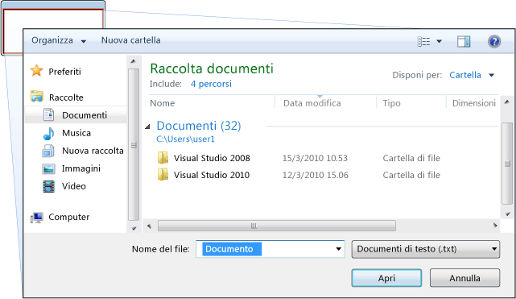
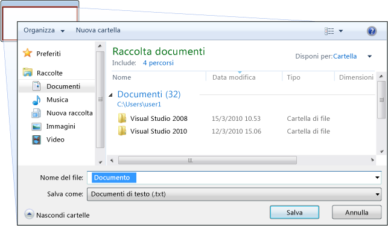
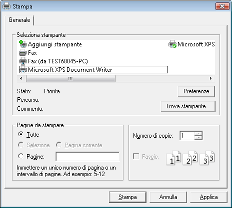
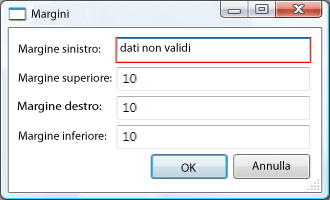
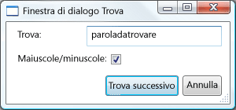

# Cenni preliminari sulle finestre di dialogo
Applicazioni autonome sono in genere una finestra principale in cui vengono visualizzati i dati principali su cui l'applicazione funziona ed espone la funzionalità di elaborazione dei dati tramite [!INCLUDE[TLA#tla_ui](../../../../includes/tlasharptla-ui-md.md)] meccanismi come barre dei menu, barre degli strumenti e le barre di stato. Un'applicazione non semplice può anche visualizzare finestre aggiuntive per le operazioni seguenti:  
  
-   Visualizzare informazioni specifiche per gli utenti.  
  
-   Raccogliere informazioni dagli utenti.  
  
-   Visualizzare e raccogliere informazioni.  
  
 Questi tipi di windows sono note come *le finestre di dialogo*, e sono disponibili due tipi: modali e non modali.  
  
 Oggetto *modale* la finestra di dialogo viene visualizzata per una funzione quando la funzione necessita di ulteriori dati da un utente di continuare. Poiché la funzione dipende la finestra di dialogo modale per raccogliere i dati, la finestra di dialogo modale impedisce inoltre a un utente di attivare altre finestre dell'applicazione finché viene aperto. Nella maggior parte dei casi, una finestra di dialogo modale consente a un utente segnalare quando hanno finito con la finestra di dialogo modale premendo un **OK** o **Annulla** pulsante. Premendo il **OK** pulsante indica che un utente ha immesso dei dati e desidera continuare l'elaborazione dei dati dalla funzione. Premendo il **Annulla** pulsante indica che un utente desidera arrestare l'esecuzione della funzione. Per aprire, salvare e stampare i dati vengono visualizzati gli esempi più comuni delle finestre di dialogo modale.  
  
 Oggetto *non modali* nella finestra di dialogo d'altra parte, non impedisce a un utente di attivare altre finestre mentre è aperto. Ad esempio, se un utente desidera individuare le occorrenze di una determinata parola in un documento, una finestra principale spesso aprire una finestra di dialogo per chiedere a un utente la parola che stanno cercando. Poiché la ricerca di una parola non impedisca all'utente la modifica del documento, tuttavia, la finestra di dialogo senza dover essere modale. Una finestra di dialogo non modale fornisce almeno un **chiudere** per chiudere la finestra di dialogo e può fornire pulsanti aggiuntivi per eseguire funzioni specifiche, ad esempio un **Trova successivo** per trovare la parola successiva corrispondente ai criteri di ricerca di una parola.  
  
 [!INCLUDE[TLA#tla_wpf](../../../../includes/tlasharptla-wpf-md.md)]Consente di creare tipi diversi di finestre di dialogo, incluse le finestre di messaggio, finestre di dialogo comuni e finestre di dialogo personalizzate. Questo argomento vengono illustrate e [Dialog Box Sample](http://go.microsoft.com/fwlink/?LinkID=159984) sono disponibili alcuni esempi.  
  
   
  
   
## Finestre di messaggio  
 Oggetto *finestra di messaggio* è una finestra di dialogo che può essere utilizzata per visualizzare le informazioni testuali e consentire agli utenti di prendere decisioni con i pulsanti. La figura seguente mostra una finestra di messaggio che consente di visualizzare informazioni testuali, pone una domanda e fornisce all'utente con tre pulsanti per rispondere alla domanda.  
  
   
  
 Per creare una finestra di messaggio, utilizzare il <xref:System.Windows.MessageBox> (classe).                  <xref:System.Windows.MessageBox> consente di configurare il testo della finestra di messaggio, titolo, l'icona e i pulsanti, utilizzando codice simile al seguente.  
  
 [!code-csharp[DialogBoxesOverviewSnippets#MsgBoxConfigureCODEBEHIND](../../../../samples/snippets/csharp/VS_Snippets_Wpf/DialogBoxesOverviewSnippets/CSharp/Window1.xaml.cs#msgboxconfigurecodebehind)]
 [!code-vb[DialogBoxesOverviewSnippets#MsgBoxConfigureCODEBEHIND](../../../../samples/snippets/visualbasic/VS_Snippets_Wpf/DialogBoxesOverviewSnippets/VisualBasic/window1.xaml.vb#msgboxconfigurecodebehind)]  
  
 Per visualizzare una finestra di messaggio, chiamare il `static` <xref:System.Windows.MessageBox.Show%2A> metodo, come illustrato nel codice seguente.  
  
 [!code-csharp[DialogBoxesOverviewSnippets#MsgBoxShowCODEBEHIND](../../../../samples/snippets/csharp/VS_Snippets_Wpf/DialogBoxesOverviewSnippets/CSharp/Window1.xaml.cs#msgboxshowcodebehind)]
 [!code-vb[DialogBoxesOverviewSnippets#MsgBoxShowCODEBEHIND](../../../../samples/snippets/visualbasic/VS_Snippets_Wpf/DialogBoxesOverviewSnippets/VisualBasic/window1.xaml.vb#msgboxshowcodebehind)]  
  
 Quando il codice che viene visualizzata una finestra di messaggio deve rilevare ed elaborare la decisione dell'utente (è stato premuto il pulsante), il codice può controllare il risultato di casella di messaggio, come illustrato nel codice seguente.  
  
 [!code-csharp[DialogBoxesOverviewSnippets#MsgBoxShowAndResultCODEBEHIND1](../../../../samples/snippets/csharp/VS_Snippets_Wpf/DialogBoxesOverviewSnippets/CSharp/Window1.xaml.cs#msgboxshowandresultcodebehind1)]
 [!code-vb[DialogBoxesOverviewSnippets#MsgBoxShowAndResultCODEBEHIND1](../../../../samples/snippets/visualbasic/VS_Snippets_Wpf/DialogBoxesOverviewSnippets/VisualBasic/window1.xaml.vb#msgboxshowandresultcodebehind1)]  
  
 Per ulteriori informazioni sull'utilizzo delle finestre di messaggio, vedere <xref:System.Windows.MessageBox>, [esempio MessageBox](http://go.microsoft.com/fwlink/?LinkID=160023), e [Dialog Box Sample](http://go.microsoft.com/fwlink/?LinkID=159984).  
  
 Sebbene <xref:System.Windows.MessageBox> può offrire una semplice finestra di dialogo dell'utente, il vantaggio dell'utilizzo <xref:System.Windows.MessageBox> è l'unico tipo di finestra che può essere visualizzato dalle applicazioni eseguite in una sandbox di sicurezza di attendibilità parziale (vedere [sicurezza](../../../../docs/framework/wpf/security-wpf.md)), ad esempio [!INCLUDE[TLA#tla_xbap#plural](../../../../includes/tlasharptla-xbapsharpplural-md.md)].  
  
 La maggior parte delle finestre di dialogo visualizzano l'elenco di selezione (caselle di riepilogo, caselle combinate, caselle di riepilogo a discesa) e raccolgono dati più complessi del risultato di una finestra di messaggio, incluso il testo, selezione (caselle di controllo), la selezione si escludono a vicenda (pulsanti di opzione). Per questo motivo, [!INCLUDE[TLA#tla_wpf](../../../../includes/tlasharptla-wpf-md.md)] offre diverse finestre di dialogo comuni e consente di creare finestre di dialogo, sebbene l'utilizzo di entrambe è limitato alle applicazioni in esecuzione con attendibilità totale.  
  
   
## Finestre di dialogo comuni  
 [!INCLUDE[TLA#tla_mswin](../../../../includes/tlasharptla-mswin-md.md)]implementa una varietà di finestre di dialogo riutilizzabili comuni a tutte le applicazioni, incluse le finestre di dialogo per l'apertura, salvataggio di file e stampa. Poiché queste finestre di dialogo vengono implementate dal sistema operativo, può essere condiviso tra tutte le applicazioni che eseguono il sistema operativo, che facilita l'utente verifica coerenza; Quando gli utenti hanno familiarità con l'utilizzo di una dialogo fornita dal sistema operativo in un'applicazione, non dovranno imparare a utilizzare tale finestra di dialogo in altre applicazioni. Poiché queste finestre di dialogo sono disponibili per tutte le applicazioni e poiché consentono un'esperienza utente coerente, sono note come *finestre di dialogo comuni*.  
  
 [!INCLUDE[TLA#tla_wpf](../../../../includes/tlasharptla-wpf-md.md)]incapsula il file aperto, salvare file e stampa finestre di dialogo comuni e li espone come classi gestite per l'utilizzo in applicazioni autonome. In questo argomento fornisce una breve panoramica di ciascuno.  
  
   
### Finestra di dialogo Apri File  
 La finestra di dialogo Apri file, illustrata nella figura riportata di seguito, viene utilizzata dalla funzionalità di apertura file per recuperare il nome di un file da aprire.  
  
   
  
 La finestra di dialogo Apri file comuni viene implementato come il <xref:Microsoft.Win32.OpenFileDialog> classe e si trova nella <xref:Microsoft.Win32> dello spazio dei nomi. Il codice seguente viene illustrato come creare, configurare e visualizzare una e come elaborare il risultato.  
  
 [!code-csharp[DialogBoxesOverviewSnippets#OpenFileDialogBoxCODEBEHIND](../../../../samples/snippets/csharp/VS_Snippets_Wpf/DialogBoxesOverviewSnippets/CSharp/Window1.xaml.cs#openfiledialogboxcodebehind)]
 [!code-vb[DialogBoxesOverviewSnippets#OpenFileDialogBoxCODEBEHIND](../../../../samples/snippets/visualbasic/VS_Snippets_Wpf/DialogBoxesOverviewSnippets/VisualBasic/window1.xaml.vb#openfiledialogboxcodebehind)]  
  
 Per ulteriori informazioni nella finestra di dialogo Apri file, vedere <xref:Microsoft.Win32.OpenFileDialog?displayProperty=fullName>.  
  
> [!NOTE]
>  <xref:Microsoft.Win32.OpenFileDialog> può essere utilizzato per recuperare in modo sicuro i nomi di file da applicazioni in esecuzione con attendibilità parziale (vedere [sicurezza](../../../../docs/framework/wpf/security-wpf.md)).  
  
   
### Salvare la finestra di dialogo File  
 Salva la finestra di dialogo file, illustrata nella figura riportata di seguito, viene utilizzata dalla funzionalità di salvataggio file per recuperare il nome di un file da salvare.  
  
   
  
 La finestra Salva la finestra di dialogo file comune viene implementata come il <xref:Microsoft.Win32.SaveFileDialog> classe e si trova nella <xref:Microsoft.Win32> dello spazio dei nomi. Il codice seguente viene illustrato come creare, configurare e visualizzare una e come elaborare il risultato.  
  
 [!code-csharp[DialogBoxesOverviewSnippets#SaveFileDialogBoxCODEBEHIND](../../../../samples/snippets/csharp/VS_Snippets_Wpf/DialogBoxesOverviewSnippets/CSharp/Window1.xaml.cs#savefiledialogboxcodebehind)]
 [!code-vb[DialogBoxesOverviewSnippets#SaveFileDialogBoxCODEBEHIND](../../../../samples/snippets/visualbasic/VS_Snippets_Wpf/DialogBoxesOverviewSnippets/VisualBasic/window1.xaml.vb#savefiledialogboxcodebehind)]  
  
 Per ulteriori informazioni sul salvataggio di file la finestra di dialogo, vedere <xref:Microsoft.Win32.SaveFileDialog?displayProperty=fullName>.  
  
   
### La finestra di dialogo Stampa  
 La finestra di dialogo Stampa, illustrata nella figura riportata di seguito, viene utilizzata dalla funzionalità di stampa per scegliere e configurare la stampante che si desidera stampare dati per un utente.  
  
   
  
 La finestra di dialogo Stampa comune viene implementata come il <xref:System.Windows.Controls.PrintDialog> classe e si trova nella <xref:System.Windows.Controls> dello spazio dei nomi. Il codice seguente viene illustrato come creare, configurare e visualizzare uno.  
  
 [!code-csharp[DialogBoxesOverviewSnippets#PrintDialogBoxCODEBEHIND](../../../../samples/snippets/csharp/VS_Snippets_Wpf/DialogBoxesOverviewSnippets/CSharp/Window1.xaml.cs#printdialogboxcodebehind)]
 [!code-vb[DialogBoxesOverviewSnippets#PrintDialogBoxCODEBEHIND](../../../../samples/snippets/visualbasic/VS_Snippets_Wpf/DialogBoxesOverviewSnippets/VisualBasic/window1.xaml.vb#printdialogboxcodebehind)]  
  
 Per ulteriori informazioni sulla finestra di dialogo Stampa, vedere <xref:System.Windows.Controls.PrintDialog?displayProperty=fullName>. Per informazioni dettagliate sulla stampa in [!INCLUDE[TLA2#tla_wpf](../../../../includes/tla2sharptla-wpf-md.md)], vedere [Cenni preliminari sulla stampa](../../../../docs/framework/wpf/advanced/printing-overview.md).  
  
   
## Finestre di dialogo personalizzate  
 Finestre di dialogo comuni sono utili, mentre dovrebbero essere utilizzate quando possibile, non supportano i requisiti delle finestre di dialogo specifico di dominio. In questi casi, è necessario creare finestre di dialogo. Come vedremo, una finestra di dialogo è una finestra con comportamenti speciali.                  <xref:System.Windows.Window> implementa tali comportamenti e, pertanto, si utilizza <xref:System.Windows.Window> per creare finestre di dialogo modali e non modali personalizzate.  
  
   
### Creazione di una finestra di dialogo modale a personalizzato  
 In questo argomento viene illustrato come utilizzare <xref:System.Windows.Window> per creare un'implementazione tipica di finestra di dialogo modale, utilizzando il `Margins` la finestra di dialogo ad esempio (vedere [Dialog Box Sample](http://go.microsoft.com/fwlink/?LinkID=159984)). Il `Margins` la finestra di dialogo è illustrata nella figura riportata di seguito.  
  
   
  
#### Configurazione di una finestra di dialogo modale  
 L'interfaccia utente per una normale finestra di dialogo include quanto segue:  
  
-   I vari controlli necessari per raccogliere i dati desiderati.  
  
-   Che mostra un **OK** pulsante che gli utenti, fare clic per chiudere la finestra di dialogo, torna alla funzione e continuare l'elaborazione.  
  
-   Che mostra un **Annulla** pulsante che gli utenti fanno clic per chiudere la finestra di dialogo e interrompere l'elaborazione da parte della funzione.  
  
-   Che mostra un **Chiudi** pulsante nella barra del titolo.  
  
-   Icona.  
  
-   Showing                                          **Minimize**,                                          **Maximize**, and                                          **Restore** buttons.  
  
-   Che mostra un **sistema** menu per ridurre al minimo, ingrandire, ripristinare e chiudere la finestra di dialogo.  
  
-   Apertura sopra e al centro della finestra che ha aperto la finestra di dialogo.  
  
-   Finestre di dialogo devono essere rispettivamente dimensioni ridimensionabile laddove possibile, pertanto, per impedire che la finestra di dialogo troppo piccolo e per fornire all'utente con una dimensione predefinita utile, è necessario impostare predefinito sia minimo.  
  
-   Premere il tasto ESC deve essere configurato come un tasto di scelta rapida che causa il **Annulla** pulsante premuto. Questo risultato si ottiene impostando il <xref:System.Windows.Controls.Button.IsCancel%2A> proprietà del **Annulla** pulsante per `true`.  
  
-   Premendo il tasto INVIO (o a capo) deve essere configurato come un tasto di scelta rapida che causa il **OK** pulsante premuto. Questo risultato si ottiene impostando il <xref:System.Windows.Controls.Button.IsDefault%2A> proprietà di **OK** pulsante `true`.  
  
 Il codice seguente viene illustrata questa configurazione.  
  
 [!code-xml[DialogBoxSample#MarginsDialogBoxMainBitsMARKUP1](../../../../samples/snippets/csharp/VS_Snippets_Wpf/DialogBoxSample/CSharp/MarginsDialogBox.xaml#marginsdialogboxmainbitsmarkup1)]  
[!code-xml[DialogBoxSample#MarginsDialogBoxMainBitsMARKUP2](../../../../samples/snippets/csharp/VS_Snippets_Wpf/DialogBoxSample/CSharp/MarginsDialogBox.xaml#marginsdialogboxmainbitsmarkup2)]  
  
 [!code-csharp[DialogBoxSample#MarginsDialogBoxMainBitsCODEBEHIND1](../../../../samples/snippets/csharp/VS_Snippets_Wpf/DialogBoxSample/CSharp/MarginsDialogBox.xaml.cs#marginsdialogboxmainbitscodebehind1)]
 [!code-vb[DialogBoxSample#MarginsDialogBoxMainBitsCODEBEHIND1](../../../../samples/snippets/visualbasic/VS_Snippets_Wpf/DialogBoxSample/VisualBasic/MarginsDialogBox.xaml.vb#marginsdialogboxmainbitscodebehind1)]  
[!code-csharp[DialogBoxSample#MarginsDialogBoxMainBitsCODEBEHIND2](../../../../samples/snippets/csharp/VS_Snippets_Wpf/DialogBoxSample/CSharp/MarginsDialogBox.xaml.cs#marginsdialogboxmainbitscodebehind2)]
[!code-vb[DialogBoxSample#MarginsDialogBoxMainBitsCODEBEHIND2](../../../../samples/snippets/visualbasic/VS_Snippets_Wpf/DialogBoxSample/VisualBasic/MarginsDialogBox.xaml.vb#marginsdialogboxmainbitscodebehind2)]  
  
 L'esperienza utente per una finestra di dialogo si estende anche nella barra dei menu della finestra che viene visualizzata la finestra di dialogo. Quando una voce di menu viene eseguita una funzione che richiede l'intervento dell'utente tramite una finestra di dialogo prima di proseguire con la funzione, la voce di menu per la funzione avranno i puntini di sospensione nella relativa intestazione, come illustrato di seguito.  
  
 [!code-xml[DialogBoxSample#MainWindowMarginsDialogBoxMenuItemMARKUP1](../../../../samples/snippets/csharp/VS_Snippets_Wpf/DialogBoxSample/CSharp/MainWindow.xaml#mainwindowmarginsdialogboxmenuitemmarkup1)]  
[!code-xml[DialogBoxSample#MainWindowMarginsDialogBoxMenuItemMARKUP2](../../../../samples/snippets/csharp/VS_Snippets_Wpf/DialogBoxSample/CSharp/MainWindow.xaml#mainwindowmarginsdialogboxmenuitemmarkup2)]  
  
 Quando una voce di menu viene eseguita una funzione che visualizza una finestra di dialogo che richiede l'interazione dell'utente, ad esempio una finestra di dialogo informazioni sui puntini di sospensione non è necessaria.  
  
#### Aprire una finestra di dialogo modale  
 Una finestra di dialogo viene in genere illustrata in seguito a un utente seleziona una voce di menu per eseguire una funzione specifica del dominio, ad esempio l'impostazione dei margini di un documento in un elaboratore di testo. Visualizzando una finestra di dialogo è simile alla visualizzazione di una finestra normale, sebbene richieda di configurazione specifiche finestra di dialogo aggiuntive. Nel codice seguente è illustrato l'intero processo di creazione di istanze, configurazione e aprire una finestra di dialogo.  
  
 [!code-csharp[DialogBoxSample#OpenMarginsDialogCODEBEHIND1](../../../../samples/snippets/csharp/VS_Snippets_Wpf/DialogBoxSample/CSharp/MainWindow.xaml.cs#openmarginsdialogcodebehind1)]
 [!code-vb[DialogBoxSample#OpenMarginsDialogCODEBEHIND1](../../../../samples/snippets/visualbasic/VS_Snippets_Wpf/DialogBoxSample/VisualBasic/MainWindow.xaml.vb#openmarginsdialogcodebehind1)]  
[!code-csharp[DialogBoxSample#OpenMarginsDialogCODEBEHIND2](../../../../samples/snippets/csharp/VS_Snippets_Wpf/DialogBoxSample/CSharp/MainWindow.xaml.cs#openmarginsdialogcodebehind2)]
[!code-vb[DialogBoxSample#OpenMarginsDialogCODEBEHIND2](../../../../samples/snippets/visualbasic/VS_Snippets_Wpf/DialogBoxSample/VisualBasic/MainWindow.xaml.vb#openmarginsdialogcodebehind2)]  
[!code-csharp[DialogBoxSample#OpenMarginsDialogCODEBEHIND3](../../../../samples/snippets/csharp/VS_Snippets_Wpf/DialogBoxSample/CSharp/MainWindow.xaml.cs#openmarginsdialogcodebehind3)]
[!code-vb[DialogBoxSample#OpenMarginsDialogCODEBEHIND3](../../../../samples/snippets/visualbasic/VS_Snippets_Wpf/DialogBoxSample/VisualBasic/MainWindow.xaml.vb#openmarginsdialogcodebehind3)]  
[!code-csharp[DialogBoxSample#OpenMarginsDialogCODEBEHIND4](../../../../samples/snippets/csharp/VS_Snippets_Wpf/DialogBoxSample/CSharp/MainWindow.xaml.cs#openmarginsdialogcodebehind4)]
[!code-vb[DialogBoxSample#OpenMarginsDialogCODEBEHIND4](../../../../samples/snippets/visualbasic/VS_Snippets_Wpf/DialogBoxSample/VisualBasic/MainWindow.xaml.vb#openmarginsdialogcodebehind4)]  
  
 In questo caso, il codice passa informazioni predefinite (i margini corrente) nella finestra di dialogo. Viene inoltre impostata la <xref:System.Windows.Window.Owner%2A?displayProperty=fullName> proprietà con un riferimento alla finestra che viene visualizzata la finestra di dialogo. In generale, è necessario impostare sempre il proprietario di una finestra di dialogo per fornire i comportamenti correlati allo stato di finestra sono comuni a tutte le finestre di dialogo (vedere [WPF Windows Overview](../../../../docs/framework/wpf/app-development/wpf-windows-overview.md) per ulteriori informazioni).  
  
> [!NOTE]
>  È necessario specificare un proprietario per supportare [!INCLUDE[TLA#tla_ui](../../../../includes/tlasharptla-ui-md.md)] automazione per le finestre di dialogo (vedere [UI Automation Overview](../../../../docs/framework/ui-automation/ui-automation-overview.md)).  
  
 Dopo aver configurata la finestra di dialogo, viene visualizzato come form modale chiamando il <xref:System.Windows.Window.ShowDialog%2A> metodo.  
  
#### Convalida dei dati forniti dall'utente  
 Quando si apre una finestra di dialogo e l'utente fornisce i dati richiesti, una finestra di dialogo è responsabile di garantire che i dati forniti sono validi per i motivi seguenti:  
  
-   Dal punto di vista della protezione, è necessario convalidare tutto l'input.  
  
-   Dal punto di vista specifico di dominio, la convalida dei dati impedisce dati errati per il codice che potrebbe potenzialmente generare eccezioni.  
  
-   Dal punto di vista dell'esperienza dell'utente, una finestra di dialogo consente agli utenti mostrando loro quali dati vengono immessi non sono validi.  
  
-   Dal punto di vista delle prestazioni, la convalida dei dati in un'applicazione a più livelli può ridurre il numero di round trip tra il client e i livelli di applicazione, in particolare quando l'applicazione è costituito da servizi Web o database basati su server.  
  
 Per convalidare un controllo associato in [!INCLUDE[TLA2#tla_wpf](../../../../includes/tla2sharptla-wpf-md.md)], è necessario definire una regola di convalida e associarlo con l'associazione. Una regola di convalida è una classe personalizzata che deriva da <xref:System.Windows.Controls.ValidationRule>. Nell'esempio seguente viene illustrata una regola di convalida, `MarginValidationRule`, che verifica che un valore associato è un <xref:System.Double> e si trova all'interno di un intervallo specificato.  
  
 [!code-csharp[DialogBoxSample#MarginValidationRuleCODE](../../../../samples/snippets/csharp/VS_Snippets_Wpf/DialogBoxSample/CSharp/MarginValidationRule.cs#marginvalidationrulecode)]
 [!code-vb[DialogBoxSample#MarginValidationRuleCODE](../../../../samples/snippets/visualbasic/VS_Snippets_Wpf/DialogBoxSample/VisualBasic/MarginValidationRule.vb#marginvalidationrulecode)]  
  
 In questo codice viene implementata la logica di convalida di una regola di convalida eseguendo l'override di <xref:System.Windows.Controls.ValidationRule.Validate%2A> metodo, che convalida i dati e restituisce un oggetto appropriato <xref:System.Windows.Controls.ValidationResult>.  
  
 Per associare il controllo associato la regola di convalida, utilizzare il markup seguente.  
  
 [!code-xml[DialogBoxSample#MarginsValidationMARKUP1](../../../../samples/snippets/csharp/VS_Snippets_Wpf/DialogBoxSample/CSharp/MarginsDialogBox.xaml#marginsvalidationmarkup1)]  
[!code-xml[DialogBoxSample#MarginsValidationMARKUP2](../../../../samples/snippets/csharp/VS_Snippets_Wpf/DialogBoxSample/CSharp/MarginsDialogBox.xaml#marginsvalidationmarkup2)]  
[!code-xml[DialogBoxSample#MarginsValidationMARKUP3](../../../../samples/snippets/csharp/VS_Snippets_Wpf/DialogBoxSample/CSharp/MarginsDialogBox.xaml#marginsvalidationmarkup3)]  
  
 Una volta associata, la regola di convalida [!INCLUDE[TLA2#tla_wpf](../../../../includes/tla2sharptla-wpf-md.md)] verranno automaticamente applicati quando vengono immessi dati nel controllo associato. Quando un controllo contiene dati non validi, [!INCLUDE[TLA2#tla_wpf](../../../../includes/tla2sharptla-wpf-md.md)] verrà visualizzato un bordo rosso intorno al controllo non valido, come illustrato nella figura seguente.  
  
   
  
 [!INCLUDE[TLA2#tla_wpf](../../../../includes/tla2sharptla-wpf-md.md)]non consentire a un utente il controllo non valido fino a quando non vengono immessi dati validi. È buona comportamento di una finestra di dialogo; un utente deve essere in grado di passare liberamente i controlli in una finestra di dialogo dati non validi o meno. Tuttavia, ciò significa che un utente può immettere dati non validi e premere il **OK** pulsante. Per questo motivo, il codice deve anche convalidare tutti i controlli in una finestra di dialogo quando il **OK** pulsante gestendo la <xref:System.Windows.Controls.Primitives.ButtonBase.Click> evento.  
  
 [!code-csharp[DialogBoxSample#MarginsDialogBoxValidationCODEBEHIND1](../../../../samples/snippets/csharp/VS_Snippets_Wpf/DialogBoxSample/CSharp/MarginsDialogBox.xaml.cs#marginsdialogboxvalidationcodebehind1)]
 [!code-vb[DialogBoxSample#MarginsDialogBoxValidationCODEBEHIND1](../../../../samples/snippets/visualbasic/VS_Snippets_Wpf/DialogBoxSample/VisualBasic/MarginsDialogBox.xaml.vb#marginsdialogboxvalidationcodebehind1)]  
[!code-csharp[DialogBoxSample#MarginsDialogBoxValidationCODEBEHIND2](../../../../samples/snippets/csharp/VS_Snippets_Wpf/DialogBoxSample/CSharp/MarginsDialogBox.xaml.cs#marginsdialogboxvalidationcodebehind2)]
[!code-vb[DialogBoxSample#MarginsDialogBoxValidationCODEBEHIND2](../../../../samples/snippets/visualbasic/VS_Snippets_Wpf/DialogBoxSample/VisualBasic/MarginsDialogBox.xaml.vb#marginsdialogboxvalidationcodebehind2)]  
[!code-csharp[DialogBoxSample#MarginsDialogBoxValidationCODEBEHIND3](../../../../samples/snippets/csharp/VS_Snippets_Wpf/DialogBoxSample/CSharp/MarginsDialogBox.xaml.cs#marginsdialogboxvalidationcodebehind3)]
[!code-vb[DialogBoxSample#MarginsDialogBoxValidationCODEBEHIND3](../../../../samples/snippets/visualbasic/VS_Snippets_Wpf/DialogBoxSample/VisualBasic/MarginsDialogBox.xaml.vb#marginsdialogboxvalidationcodebehind3)]  
  
 Questo codice enumera tutti gli oggetti di dipendenza di una finestra e, se uno non valido (come restituito da <xref:System.Windows.Controls.Validation.GetHasError%2A>, il controllo non valido riceve lo stato attivo, il `IsValid` restituisce `false`, e la finestra viene considerata non valida.  
  
 Quando una finestra di dialogo è valida, è possibile chiudere e restituire. Come parte del processo restituito, che deve restituire un risultato alla funzione chiamante.  
  
#### Impostazione del risultato della finestra di dialogo modale  
 Aprire una finestra di dialogo con <xref:System.Windows.Window.ShowDialog%2A> è sostanzialmente equivalente alla chiamata a un metodo: il codice che ha aperto la finestra di dialogo con <xref:System.Windows.Window.ShowDialog%2A> attende <xref:System.Windows.Window.ShowDialog%2A> restituisce. Quando <xref:System.Windows.Window.ShowDialog%2A> restituisce, il codice che ha chiamato deve decidere se continuare o arrestare l'elaborazione, a seconda che l'utente ha premuto il **OK** pulsante o **Annulla** pulsante. Per facilitare questa decisione, la finestra di dialogo deve restituire la scelta dell'utente come un <xref:System.Boolean> valore restituito dal <xref:System.Windows.Window.ShowDialog%2A> metodo.  
  
 Quando il **OK** pulsante <xref:System.Windows.Window.ShowDialog%2A> deve restituire `true`. Questo risultato si ottiene impostando il <xref:System.Windows.Window.DialogResult%2A> della finestra di dialogo Proprietà finestra quando il **OK** si fa clic sul pulsante.  
  
 [!code-csharp[DialogBoxSample#MarginsDialogBoxOKResultSetCODEBEHIND1](../../../../samples/snippets/csharp/VS_Snippets_Wpf/DialogBoxSample/CSharp/MarginsDialogBox.xaml.cs#marginsdialogboxokresultsetcodebehind1)]
 [!code-vb[DialogBoxSample#MarginsDialogBoxOKResultSetCODEBEHIND1](../../../../samples/snippets/visualbasic/VS_Snippets_Wpf/DialogBoxSample/VisualBasic/MarginsDialogBox.xaml.vb#marginsdialogboxokresultsetcodebehind1)]  
[!code-csharp[DialogBoxSample#MarginsDialogBoxOKResultSetCODEBEHIND2](../../../../samples/snippets/csharp/VS_Snippets_Wpf/DialogBoxSample/CSharp/MarginsDialogBox.xaml.cs#marginsdialogboxokresultsetcodebehind2)]
[!code-vb[DialogBoxSample#MarginsDialogBoxOKResultSetCODEBEHIND2](../../../../samples/snippets/visualbasic/VS_Snippets_Wpf/DialogBoxSample/VisualBasic/MarginsDialogBox.xaml.vb#marginsdialogboxokresultsetcodebehind2)]  
[!code-csharp[DialogBoxSample#MarginsDialogBoxOKResultSetCODEBEHIND3](../../../../samples/snippets/csharp/VS_Snippets_Wpf/DialogBoxSample/CSharp/MarginsDialogBox.xaml.cs#marginsdialogboxokresultsetcodebehind3)]
[!code-vb[DialogBoxSample#MarginsDialogBoxOKResultSetCODEBEHIND3](../../../../samples/snippets/visualbasic/VS_Snippets_Wpf/DialogBoxSample/VisualBasic/MarginsDialogBox.xaml.vb#marginsdialogboxokresultsetcodebehind3)]  
[!code-csharp[DialogBoxSample#MarginsDialogBoxOKResultSetCODEBEHIND4](../../../../samples/snippets/csharp/VS_Snippets_Wpf/DialogBoxSample/CSharp/MarginsDialogBox.xaml.cs#marginsdialogboxokresultsetcodebehind4)]
[!code-vb[DialogBoxSample#MarginsDialogBoxOKResultSetCODEBEHIND4](../../../../samples/snippets/visualbasic/VS_Snippets_Wpf/DialogBoxSample/VisualBasic/MarginsDialogBox.xaml.vb#marginsdialogboxokresultsetcodebehind4)]  
  
 Si noti che l'impostazione di <xref:System.Windows.Window.DialogResult%2A> proprietà comporta la chiusura della finestra automaticamente, che riduce la necessità di chiamare in modo esplicito <xref:System.Windows.Window.Close%2A>.  
  
 Quando il **Annulla** pulsante <xref:System.Windows.Window.ShowDialog%2A> deve restituire `false`, che richiede l'impostazione di <xref:System.Windows.Window.DialogResult%2A> proprietà.  
  
 [!code-csharp[DialogBoxSample#MarginsDialogBoxCancelResultSetCODEBEHIND1](../../../../samples/snippets/csharp/VS_Snippets_Wpf/DialogBoxSample/CSharp/MarginsDialogBox.xaml.cs#marginsdialogboxcancelresultsetcodebehind1)]
 [!code-vb[DialogBoxSample#MarginsDialogBoxCancelResultSetCODEBEHIND1](../../../../samples/snippets/visualbasic/VS_Snippets_Wpf/DialogBoxSample/VisualBasic/MarginsDialogBox.xaml.vb#marginsdialogboxcancelresultsetcodebehind1)]  
[!code-csharp[DialogBoxSample#MarginsDialogBoxCancelResultSetCODEBEHIND2](../../../../samples/snippets/csharp/VS_Snippets_Wpf/DialogBoxSample/CSharp/MarginsDialogBox.xaml.cs#marginsdialogboxcancelresultsetcodebehind2)]
[!code-vb[DialogBoxSample#MarginsDialogBoxCancelResultSetCODEBEHIND2](../../../../samples/snippets/visualbasic/VS_Snippets_Wpf/DialogBoxSample/VisualBasic/MarginsDialogBox.xaml.vb#marginsdialogboxcancelresultsetcodebehind2)]  
[!code-csharp[DialogBoxSample#MarginsDialogBoxCancelResultSetCODEBEHIND3](../../../../samples/snippets/csharp/VS_Snippets_Wpf/DialogBoxSample/CSharp/MarginsDialogBox.xaml.cs#marginsdialogboxcancelresultsetcodebehind3)]
[!code-vb[DialogBoxSample#MarginsDialogBoxCancelResultSetCODEBEHIND3](../../../../samples/snippets/visualbasic/VS_Snippets_Wpf/DialogBoxSample/VisualBasic/MarginsDialogBox.xaml.vb#marginsdialogboxcancelresultsetcodebehind3)]  
  
 Quando un pulsante <xref:System.Windows.Controls.Button.IsCancel%2A> è impostata su `true` e l'utente preme uno di **Annulla** pulsante o il tasto ESC, <xref:System.Windows.Window.DialogResult%2A> viene impostata automaticamente su `false`. Il markup seguente ha lo stesso effetto del codice precedente, senza la necessità di gestire il <xref:System.Windows.Controls.Primitives.ButtonBase.Click> evento.  
  
 [!code-xml[DialogBoxSample#MarginsDialogDefaultCancelMARKUP](../../../../samples/snippets/csharp/VS_Snippets_Wpf/DialogBoxSample/CSharp/MarginsDialogBox.xaml#marginsdialogdefaultcancelmarkup)]  
  
 Una finestra di dialogo restituisce automaticamente `false` quando un utente preme il **Chiudi** pulsante nella barra del titolo o sceglie il **Chiudi** voce di menu dal **sistema** menu.  
  
#### L'elaborazione dei dati restituiti da una finestra di dialogo modale  
 Quando <xref:System.Windows.Window.DialogResult%2A> è impostato da una finestra di dialogo, la funzione che ha aperto, ottenere la finestra risultante controllando il <xref:System.Windows.Window.DialogResult%2A> proprietà quando <xref:System.Windows.Window.ShowDialog%2A> restituisce.  
  
 [!code-csharp[DialogBoxSample#OpenMarginsDialogProcessReturnCODEBEHIND1](../../../../samples/snippets/csharp/VS_Snippets_Wpf/DialogBoxSample/CSharp/MainWindow.xaml.cs#openmarginsdialogprocessreturncodebehind1)]
 [!code-vb[DialogBoxSample#OpenMarginsDialogProcessReturnCODEBEHIND1](../../../../samples/snippets/visualbasic/VS_Snippets_Wpf/DialogBoxSample/VisualBasic/MainWindow.xaml.vb#openmarginsdialogprocessreturncodebehind1)]  
[!code-csharp[DialogBoxSample#OpenMarginsDialogProcessReturnCODEBEHIND2](../../../../samples/snippets/csharp/VS_Snippets_Wpf/DialogBoxSample/CSharp/MainWindow.xaml.cs#openmarginsdialogprocessreturncodebehind2)]
[!code-vb[DialogBoxSample#OpenMarginsDialogProcessReturnCODEBEHIND2](../../../../samples/snippets/visualbasic/VS_Snippets_Wpf/DialogBoxSample/VisualBasic/MainWindow.xaml.vb#openmarginsdialogprocessreturncodebehind2)]  
[!code-csharp[DialogBoxSample#OpenMarginsDialogProcessReturnCODEBEHIND3](../../../../samples/snippets/csharp/VS_Snippets_Wpf/DialogBoxSample/CSharp/MainWindow.xaml.cs#openmarginsdialogprocessreturncodebehind3)]
[!code-vb[DialogBoxSample#OpenMarginsDialogProcessReturnCODEBEHIND3](../../../../samples/snippets/visualbasic/VS_Snippets_Wpf/DialogBoxSample/VisualBasic/MainWindow.xaml.vb#openmarginsdialogprocessreturncodebehind3)]  
[!code-csharp[DialogBoxSample#OpenMarginsDialogProcessReturnCODEBEHIND4](../../../../samples/snippets/csharp/VS_Snippets_Wpf/DialogBoxSample/CSharp/MainWindow.xaml.cs#openmarginsdialogprocessreturncodebehind4)]
[!code-vb[DialogBoxSample#OpenMarginsDialogProcessReturnCODEBEHIND4](../../../../samples/snippets/visualbasic/VS_Snippets_Wpf/DialogBoxSample/VisualBasic/MainWindow.xaml.vb#openmarginsdialogprocessreturncodebehind4)]  
  
 Se il risultato della finestra di dialogo è `true`, la funzione che utilizza come un segnale per recuperare ed elaborare i dati forniti dall'utente.  
  
> [!NOTE]
>  Dopo aver <xref:System.Windows.Window.ShowDialog%2A> ha restituito una finestra di dialogo non può essere riaperto. In alternativa, è necessario creare una nuova istanza.  
  
 Se il risultato della finestra di dialogo è `false`, la funzione deve terminare l'elaborazione in modo appropriato.  
  
   
### Creazione di una finestra di dialogo personalizzate non modale  
 Una finestra di dialogo non modale, ad esempio la finestra di dialogo Trova, illustrato nella figura riportata di seguito, ha lo stesso aspetto fondamentale come la finestra di dialogo modale.  
  
   
  
 Tuttavia, il comportamento è leggermente diverso, come descritto nelle sezioni seguenti.  
  
#### Aprire una finestra di dialogo non modale  
 Viene aperta una finestra di dialogo non modale chiamando il <xref:System.Windows.Window.Show%2A> metodo.  
  
 [!code-xml[DialogBoxSample#OpenFindDialogMARKUP1](../../../../samples/snippets/csharp/VS_Snippets_Wpf/DialogBoxSample/CSharp/MainWindow.xaml#openfinddialogmarkup1)]  
  
 [!code-csharp[DialogBoxSample#OpenFindDialogCODEBEHIND1](../../../../samples/snippets/csharp/VS_Snippets_Wpf/DialogBoxSample/CSharp/MainWindow.xaml.cs#openfinddialogcodebehind1)]
 [!code-vb[DialogBoxSample#OpenFindDialogCODEBEHIND1](../../../../samples/snippets/visualbasic/VS_Snippets_Wpf/DialogBoxSample/VisualBasic/MainWindow.xaml.vb#openfinddialogcodebehind1)]  
[!code-csharp[DialogBoxSample#OpenFindDialogCODEBEHIND2](../../../../samples/snippets/csharp/VS_Snippets_Wpf/DialogBoxSample/CSharp/MainWindow.xaml.cs#openfinddialogcodebehind2)]
[!code-vb[DialogBoxSample#OpenFindDialogCODEBEHIND2](../../../../samples/snippets/visualbasic/VS_Snippets_Wpf/DialogBoxSample/VisualBasic/MainWindow.xaml.vb#openfinddialogcodebehind2)]  
[!code-csharp[DialogBoxSample#OpenFindDialogCODEBEHIND3](../../../../samples/snippets/csharp/VS_Snippets_Wpf/DialogBoxSample/CSharp/MainWindow.xaml.cs#openfinddialogcodebehind3)]
[!code-vb[DialogBoxSample#OpenFindDialogCODEBEHIND3](../../../../samples/snippets/visualbasic/VS_Snippets_Wpf/DialogBoxSample/VisualBasic/MainWindow.xaml.vb#openfinddialogcodebehind3)]  
  
 A differenza di <xref:System.Windows.Window.ShowDialog%2A>, <xref:System.Windows.Window.Show%2A> restituisce immediatamente. Di conseguenza, la finestra chiamante non può stabilire quando la finestra di dialogo non modale viene chiusa e, pertanto, non sa quando verificare la presenza di una finestra risultante o ottenere i dati nella finestra di dialogo per un'ulteriore elaborazione. Al contrario, la finestra di dialogo deve creare un modo alternativo per restituire i dati alla finestra chiamante per l'elaborazione.  
  
#### L'elaborazione dei dati restituiti da una finestra di dialogo non modale  
 In questo esempio, il `FindDialogBox` può restituire uno o più risultati di ricerca alla finestra principale, a seconda del testo cercato senza una frequenza specifica. Come con una finestra di dialogo modale, una finestra di dialogo non modale può restituire risultati utilizzando le proprietà. Tuttavia, la finestra proprietaria la finestra di dialogo deve sapere quando controllare tali proprietà. È possibile abilitare questa opzione è per la finestra di dialogo implementare un evento che viene generato ogni volta che il testo viene trovato.                                  `FindDialogBox`implementa il `TextFoundEvent` a questo scopo, che innanzitutto richiede un delegato.  
  
 [!code-csharp[DialogBoxSample#TextFoundEventHandlerCODE](../../../../samples/snippets/csharp/VS_Snippets_Wpf/DialogBoxSample/CSharp/TextFoundEventHandler.cs#textfoundeventhandlercode)]
 [!code-vb[DialogBoxSample#TextFoundEventHandlerCODE](../../../../samples/snippets/visualbasic/VS_Snippets_Wpf/DialogBoxSample/VisualBasic/TextFoundEventHandler.vb#textfoundeventhandlercode)]  
  
 Using the                                  `TextFoundEventHandler` delegate,                                  `FindDialogBox` implements the                                  `TextFoundEvent`.  
  
 [!code-csharp[DialogBoxSample#TextFoundEventCODEBEHIND1](../../../../samples/snippets/csharp/VS_Snippets_Wpf/DialogBoxSample/CSharp/FindDialogBox.xaml.cs#textfoundeventcodebehind1)]
 [!code-vb[DialogBoxSample#TextFoundEventCODEBEHIND1](../../../../samples/snippets/visualbasic/VS_Snippets_Wpf/DialogBoxSample/VisualBasic/FindDialogBox.xaml.vb#textfoundeventcodebehind1)]  
[!code-csharp[DialogBoxSample#TextFoundEventCODEBEHIND2](../../../../samples/snippets/csharp/VS_Snippets_Wpf/DialogBoxSample/CSharp/FindDialogBox.xaml.cs#textfoundeventcodebehind2)]
[!code-vb[DialogBoxSample#TextFoundEventCODEBEHIND2](../../../../samples/snippets/visualbasic/VS_Snippets_Wpf/DialogBoxSample/VisualBasic/FindDialogBox.xaml.vb#textfoundeventcodebehind2)]  
  
 Di conseguenza, `Find` può generare l'evento quando viene trovato un risultato della ricerca.  
  
 [!code-csharp[DialogBoxSample#TextFoundEventRaiseCODEBEHIND1](../../../../samples/snippets/csharp/VS_Snippets_Wpf/DialogBoxSample/CSharp/FindDialogBox.xaml.cs#textfoundeventraisecodebehind1)]
 [!code-vb[DialogBoxSample#TextFoundEventRaiseCODEBEHIND1](../../../../samples/snippets/visualbasic/VS_Snippets_Wpf/DialogBoxSample/VisualBasic/FindDialogBox.xaml.vb#textfoundeventraisecodebehind1)]  
[!code-csharp[DialogBoxSample#TextFoundEventRaiseCODEBEHIND2](../../../../samples/snippets/csharp/VS_Snippets_Wpf/DialogBoxSample/CSharp/FindDialogBox.xaml.cs#textfoundeventraisecodebehind2)]
[!code-vb[DialogBoxSample#TextFoundEventRaiseCODEBEHIND2](../../../../samples/snippets/visualbasic/VS_Snippets_Wpf/DialogBoxSample/VisualBasic/FindDialogBox.xaml.vb#textfoundeventraisecodebehind2)]  
[!code-csharp[DialogBoxSample#TextFoundEventRaiseCODEBEHIND3](../../../../samples/snippets/csharp/VS_Snippets_Wpf/DialogBoxSample/CSharp/FindDialogBox.xaml.cs#textfoundeventraisecodebehind3)]
[!code-vb[DialogBoxSample#TextFoundEventRaiseCODEBEHIND3](../../../../samples/snippets/visualbasic/VS_Snippets_Wpf/DialogBoxSample/VisualBasic/FindDialogBox.xaml.vb#textfoundeventraisecodebehind3)]  
[!code-csharp[DialogBoxSample#TextFoundEventRaiseCODEBEHIND4](../../../../samples/snippets/csharp/VS_Snippets_Wpf/DialogBoxSample/CSharp/FindDialogBox.xaml.cs#textfoundeventraisecodebehind4)]
[!code-vb[DialogBoxSample#TextFoundEventRaiseCODEBEHIND4](../../../../samples/snippets/visualbasic/VS_Snippets_Wpf/DialogBoxSample/VisualBasic/FindDialogBox.xaml.vb#textfoundeventraisecodebehind4)]  
[!code-csharp[DialogBoxSample#TextFoundEventRaiseCODEBEHIND5](../../../../samples/snippets/csharp/VS_Snippets_Wpf/DialogBoxSample/CSharp/FindDialogBox.xaml.cs#textfoundeventraisecodebehind5)]
[!code-vb[DialogBoxSample#TextFoundEventRaiseCODEBEHIND5](../../../../samples/snippets/visualbasic/VS_Snippets_Wpf/DialogBoxSample/VisualBasic/FindDialogBox.xaml.vb#textfoundeventraisecodebehind5)]  
  
 La finestra proprietaria deve quindi effettuare la registrazione e gestire questo evento.  
  
 [!code-csharp[DialogBoxSample#OpenFindDialogResultCODEBEHIND1](../../../../samples/snippets/csharp/VS_Snippets_Wpf/DialogBoxSample/CSharp/MainWindow.xaml.cs#openfinddialogresultcodebehind1)]
 [!code-vb[DialogBoxSample#OpenFindDialogResultCODEBEHIND1](../../../../samples/snippets/visualbasic/VS_Snippets_Wpf/DialogBoxSample/VisualBasic/MainWindow.xaml.vb#openfinddialogresultcodebehind1)]  
[!code-csharp[DialogBoxSample#OpenFindDialogResultCODEBEHIND2](../../../../samples/snippets/csharp/VS_Snippets_Wpf/DialogBoxSample/CSharp/MainWindow.xaml.cs#openfinddialogresultcodebehind2)]
[!code-vb[DialogBoxSample#OpenFindDialogResultCODEBEHIND2](../../../../samples/snippets/visualbasic/VS_Snippets_Wpf/DialogBoxSample/VisualBasic/MainWindow.xaml.vb#openfinddialogresultcodebehind2)]  
  
#### Chiusura di una finestra di dialogo non modale  
 Poiché <xref:System.Windows.Window.DialogResult%2A> non deve essere impostato, una finestra di dialogo non modale può essere chiusa utilizzando sistema forniscono meccanismi, inclusi i seguenti:  
  
-   Fare clic su di **Chiudi** pulsante nella barra del titolo.  
  
-   Premere ALT + F4.  
  
-   Choosing                                          **Close** from the                                          **System** menu.  
  
 In alternativa, è possibile chiamare <xref:System.Windows.Window.Close%2A> quando il **Chiudi** si fa clic sul pulsante.  
  
 [!code-csharp[DialogBoxSample#FindDialogCloseCODEBEHIND1](../../../../samples/snippets/csharp/VS_Snippets_Wpf/DialogBoxSample/CSharp/FindDialogBox.xaml.cs#finddialogclosecodebehind1)]
 [!code-vb[DialogBoxSample#FindDialogCloseCODEBEHIND1](../../../../samples/snippets/visualbasic/VS_Snippets_Wpf/DialogBoxSample/VisualBasic/FindDialogBox.xaml.vb#finddialogclosecodebehind1)]  
[!code-csharp[DialogBoxSample#FindDialogCloseCODEBEHIND2](../../../../samples/snippets/csharp/VS_Snippets_Wpf/DialogBoxSample/CSharp/FindDialogBox.xaml.cs#finddialogclosecodebehind2)]
[!code-vb[DialogBoxSample#FindDialogCloseCODEBEHIND2](../../../../samples/snippets/visualbasic/VS_Snippets_Wpf/DialogBoxSample/VisualBasic/FindDialogBox.xaml.vb#finddialogclosecodebehind2)]  
  
## Vedere anche  
 [Panoramica di popup](../../../../docs/framework/wpf/controls/popup-overview.md)   
 [Esempio di finestra di dialogo](http://go.microsoft.com/fwlink/?LinkID=159984)   
 [Esempio di controllo personalizzato ColorPicker](http://go.microsoft.com/fwlink/?LinkID=159977)