# Cenni preliminari sulla navigazione
[!INCLUDE[TLA#tla_wpf](../../../../includes/tlasharptla-wpf-md.md)] supporta la navigazione di tipo browser che può essere utilizzata in due tipi di applicazioni: le applicazioni autonome e le [!INCLUDE[TLA#tla_xbap#plural](../../../../includes/tlasharptla-xbapsharpplural-md.md)]. Per assemblare un contenuto ai fini della navigazione, in [!INCLUDE[TLA2#tla_wpf](../../../../includes/tla2sharptla-wpf-md.md)] viene fornita la classe <xref:System.Windows.Controls.Page>.  È possibile spostarsi da un oggetto <xref:System.Windows.Controls.Page> a un altro in modo dichiarativo mediante <xref:System.Windows.Documents.Hyperlink> oppure a livello di codice mediante <xref:System.Windows.Navigation.NavigationService>. In [!INCLUDE[TLA2#tla_wpf](../../../../includes/tla2sharptla-wpf-md.md)] viene utilizzato il journal per memorizzare le pagine da cui ci si è spostati e tornarvi nuovamente.  
  
 <xref:System.Windows.Controls.Page>, <xref:System.Windows.Documents.Hyperlink>, <xref:System.Windows.Navigation.NavigationService> e il journal costituiscono gli elementi essenziali del supporto per la navigazione offerto da [!INCLUDE[TLA2#tla_wpf](../../../../includes/tla2sharptla-wpf-md.md)].  In questo argomento vengono descritte in dettaglio le suddette funzionalità, per poi illustrare il supporto per la navigazione avanzata che include la navigazione su file [!INCLUDE[TLA#tla_xaml](../../../../includes/tlasharptla-xaml-md.md)] separati, file [!INCLUDE[TLA#tla_html](../../../../includes/tlasharptla-html-md.md)] e oggetti.  
  
> [!NOTE]
>  Il termine "browser" qui utilizzato fa riferimento soltanto ai browser in grado di ospitare applicazioni [!INCLUDE[TLA2#tla_wpf](../../../../includes/tla2sharptla-wpf-md.md)], che attualmente includono [!INCLUDE[TLA#tla_ie](../../../../includes/tlasharptla-ie-md.md)] e Firefox.  Nel caso in cui determinate funzionalità di [!INCLUDE[TLA2#tla_wpf](../../../../includes/tla2sharptla-wpf-md.md)] siano supportate unicamente da un particolare browser, verrà fatto riferimento alla versione del browser.  
  
   
  
   
## Navigazione nelle applicazioni WPF  
 In questo argomento viene fornita una panoramica sulle principali funzionalità di navigazione in [!INCLUDE[TLA2#tla_wpf](../../../../includes/tla2sharptla-wpf-md.md)].  Queste funzionalità sono disponibili sia per le applicazioni autonome che per le applicazioni [!INCLUDE[TLA2#tla_xbap#plural](../../../../includes/tla2sharptla-xbapsharpplural-md.md)]. Qui verranno presentate nel contesto di un'applicazione [!INCLUDE[TLA2#tla_xbap](../../../../includes/tla2sharptla-xbap-md.md)].  
  
> [!NOTE]
>  La compilazione e la distribuzione delle applicazioni [!INCLUDE[TLA2#tla_xbap#plural](../../../../includes/tla2sharptla-xbapsharpplural-md.md)] non vengono trattate in questo argomento.  Per ulteriori informazioni sulle applicazioni [!INCLUDE[TLA2#tla_xbap#plural](../../../../includes/tla2sharptla-xbapsharpplural-md.md)], vedere [Panoramica delle applicazioni browser XAML di WPF](../../../../docs/framework/wpf/app-development/wpf-xaml-browser-applications-overview.md).  
  
 In questa sezione vengono illustrati i seguenti aspetti della navigazione:  
  
-   [Implementazione di una pagina](#CreatingAXAMLPage)  
  
-   [Configurazione di una pagina iniziale](#Configuring_a_Start_Page)  
  
-   [Configurazione del titolo, della larghezza e dell'altezza della finestra host](#ConfiguringAXAMLPage)  
  
-   [Navigazione mediante collegamenti ipertestuali](#NavigatingBetweenXAMLPages)  
  
-   [Navigazione su un frammento](#FragmentNavigation)  
  
-   [Servizio di navigazione](#NavigationService)  
  
-   [Navigazione a livello di codice mediante servizio di navigazione](#Programmatic_Navigation_with_the_Navigation_Service)  
  
-   [Durata della navigazione](#Navigation_Lifetime)  
  
-   [Memorizzazione della navigazione mediante journal](#NavigationHistory)  
  
-   [Durata della pagina e journal](#PageLifetime)  
  
-   [Mantenimento dello stato del contenuto mediante cronologia di navigazione](#RetainingContentStateWithNavigationHistory)  
  
-   [Cookie](#Cookies)  
  
-   [Navigazione strutturata](#Structured_Navigation)  
  
   
### Implementazione di una pagina  
 [!INCLUDE[TLA2#tla_wpf](../../../../includes/tla2sharptla-wpf-md.md)] consente di spostarsi su diversi tipi di contenuto, tra cui oggetti [!INCLUDE[TLA2#tla_winfx](../../../../includes/tla2sharptla-winfx-md.md)], oggetti personalizzati, valori di enumerazione, controlli utente, file [!INCLUDE[TLA2#tla_xaml](../../../../includes/tla2sharptla-xaml-md.md)] e file [!INCLUDE[TLA#tla_html](../../../../includes/tlasharptla-html-md.md)].  Il metodo più comune e conveniente per assemblare il contenuto consiste tuttavia nell'utilizzo di <xref:System.Windows.Controls.Page>.  Inoltre, <xref:System.Windows.Controls.Page> implementa funzionalità specifiche della navigazione che consentono di migliorarne l'aspetto e semplificarne lo sviluppo.  
  
 Utilizzando <xref:System.Windows.Controls.Page> è possibile implementare in modo dichiarativo una pagina di contenuto [!INCLUDE[TLA2#tla_xaml](../../../../includes/tla2sharptla-xaml-md.md)] navigabile tramite markup analogo al seguente.  
  
 [!code-xml[NavigationOverviewSnippets#Page1XAML](../../../../samples/snippets/csharp/VS_Snippets_Wpf/NavigationOverviewSnippets/CSharp/Page1.xaml#page1xaml)]  
  
 Un oggetto <xref:System.Windows.Controls.Page> implementato nel markup [!INCLUDE[TLA2#tla_xaml](../../../../includes/tla2sharptla-xaml-md.md)] è caratterizzato dall'elemento radice `Page` e richiede la dichiarazione dello spazio dei nomi [!INCLUDE[TLA#tla_xml](../../../../includes/tlasharptla-xml-md.md)] [!INCLUDE[TLA2#tla_wpf](../../../../includes/tla2sharptla-wpf-md.md)].  L'elemento `Page` include il contenuto sul quale spostarsi per la visualizzazione.  Per aggiungere contenuto è necessario impostare l'elemento della proprietà `Page.Content`, come illustrato nel seguente markup.  
  
 [!code-xml[NavigationOverviewSnippets#Page2XAML](../../../../samples/snippets/csharp/VS_Snippets_Wpf/NavigationOverviewSnippets/CSharp/Page2.xaml#page2xaml)]  
  
 `Page.Content` può contenere soltanto un elemento figlio. Nell'esempio precedente, il contenuto è una stringa unica, "Hello, Page\!". In genere si utilizza quindi un controllo di layout come elemento figlio \(vedere [Layout](../../../../docs/framework/wpf/advanced/layout.md)\) per contenere e comporre il contenuto.  
  
 Gli elementi figlio di un elemento `Page` vengono considerati come contenuto di <xref:System.Windows.Controls.Page> e, di conseguenza, non sarà necessario utilizzare la dichiarazione `Page.Content` esplicita.  Il markup che segue è l'equivalente dichiarativo dell'esempio precedente.  
  
 [!code-xml[NavigationOverviewSnippets#Page3XAML](../../../../samples/snippets/csharp/VS_Snippets_Wpf/NavigationOverviewSnippets/CSharp/Page3.xaml#page3xaml)]  
  
 In questo caso, `Page.Content` viene automaticamente impostato con gli elementi figlio dell'elemento `Page`.  Per ulteriori informazioni, vedere [Modello di contenuto WPF](../../../../docs/framework/wpf/controls/wpf-content-model.md).  
  
 Un oggetto <xref:System.Windows.Controls.Page> solo markup è utile per la visualizzazione di contenuto.  Tuttavia <xref:System.Windows.Controls.Page> può anche visualizzare controlli che consentono agli utenti di interagire con la pagina, nonché rispondere all'interazione dell'utente mediante gestione di eventi e chiamata alla logica dell'applicazione.  Un oggetto <xref:System.Windows.Controls.Page> interattivo viene implementato mediante una combinazione di markup e code\-behind, come illustrato nell'esempio che segue.  
  
 [!code-xml[XBAPAppDefSnippets#HomePageMARKUP](../../../../samples/snippets/csharp/VS_Snippets_Wpf/XBAPAppDefSnippets/CSharp/HomePage.xaml#homepagemarkup)]  
  
 [!code-csharp[XBAPAppDefSnippets#HomePageCODEBEHIND](../../../../samples/snippets/csharp/VS_Snippets_Wpf/XBAPAppDefSnippets/CSharp/HomePage.xaml.cs#homepagecodebehind)]
 [!code-vb[XBAPAppDefSnippets#HomePageCODEBEHIND](../../../../samples/snippets/visualbasic/VS_Snippets_Wpf/XBAPAppDefSnippets/VisualBasic/HomePage.xaml.vb#homepagecodebehind)]  
  
 Per consentire il funzionamento congiunto di un file di markup e un file code\-behind, è necessaria la seguente configurazione:  
  
-   Nel markup, l'elemento `Page` deve includere l'attributo `x:Class`.  Quando l'applicazione viene compilata, la presenza di `x:Class` nel file di markup fa sì che [!INCLUDE[TLA#tla_msbuild](../../../../includes/tlasharptla-msbuild-md.md)] crei una classe `partial` derivante da <xref:System.Windows.Controls.Page> e avente il nome specificato dall'attributo `x:Class`.  Questo richiede l'aggiunta di una dichiarazione dello spazio dei nomi [!INCLUDE[TLA2#tla_xml](../../../../includes/tla2sharptla-xml-md.md)] per lo schema [!INCLUDE[TLA2#tla_xaml](../../../../includes/tla2sharptla-xaml-md.md)] \(`xmlns:x="http://schemas.microsoft.com/winfx/2006/xaml"`\).  La classe `partial` generata implementa `InitializeComponent`, il quale viene chiamato per registrare gli eventi e impostare le proprietà implementate nel markup.  
  
-   Nel code\-behind, la classe deve essere una classe `partial` avente lo stesso nome specificato dall'attributo `x:Class` nel markup e deve derivare da <xref:System.Windows.Controls.Page>.  In questo modo il file code\-behind può essere associato alla classe `partial` generata per il file di markup durante la compilazione dell'applicazione \(vedere [Compilazione di un'applicazione WPF](../../../../docs/framework/wpf/app-development/building-a-wpf-application-wpf.md)\).  
  
-   Nel code\-behind, la classe <xref:System.Windows.Controls.Page> deve implementare un costruttore che chiama il metodo `InitializeComponent`.  Il metodo `InitializeComponent` viene implementato dalla classe `partial` generata per il file di markup per registrare gli eventi e impostare le proprietà definite nel markup.  
  
> [!NOTE]
>  Quando si aggiunge un nuovo oggetto <xref:System.Windows.Controls.Page> al progetto utilizzando [!INCLUDE[TLA#tla_visualstu](../../../../includes/tlasharptla-visualstu-md.md)], questo viene implementato tramite markup e code\-behind e include la configurazione necessaria per creare l'associazione tra il file di markup e il file code\-behind, come descritto in questo argomento.  
  
 Una volta creato <xref:System.Windows.Controls.Page>, sarà possibile spostarsi su di esso.  Per specificare il primo oggetto <xref:System.Windows.Controls.Page> sul quale si sposta un'applicazione, è necessario configurare l'oggetto <xref:System.Windows.Controls.Page> iniziale.  
  
   
### Configurazione di una pagina iniziale  
 Le applicazioni [!INCLUDE[TLA2#tla_xbap#plural](../../../../includes/tla2sharptla-xbapsharpplural-md.md)] richiedono una determinata infrastruttura per essere ospitate in un browser.  In [!INCLUDE[TLA2#tla_wpf](../../../../includes/tla2sharptla-wpf-md.md)], la classe <xref:System.Windows.Application> fa parte di una definizione di applicazione che stabilisce l'infrastruttura dell'applicazione richiesta \(vedere [Cenni preliminari sulla gestione di applicazioni](../../../../docs/framework/wpf/app-development/application-management-overview.md)\).  
  
 In genere una definizione di applicazione viene implementata tramite markup e code\-behind, con il file di markup configurato come elemento `ApplicationDefinition` [!INCLUDE[TLA2#tla_msbuild](../../../../includes/tla2sharptla-msbuild-md.md)]. Di seguito viene riportata una definizione di applicazione per un'applicazione [!INCLUDE[TLA2#tla_xbap](../../../../includes/tla2sharptla-xbap-md.md)].  
  
 [!code-xml[XBAPAppDefSnippets#XBAPApplicationDefinitionMARKUP](../../../../samples/snippets/csharp/VS_Snippets_Wpf/XBAPAppDefSnippets/CSharp/App.xaml#xbapapplicationdefinitionmarkup)]  
  
 [!code-csharp[XBAPAppDefSnippets#XBAPApplicationDefinitionCODEBEHIND](../../../../samples/snippets/csharp/VS_Snippets_Wpf/XBAPAppDefSnippets/CSharp/App.xaml.cs#xbapapplicationdefinitioncodebehind)]
 [!code-vb[XBAPAppDefSnippets#XBAPApplicationDefinitionCODEBEHIND](../../../../samples/snippets/visualbasic/VS_Snippets_Wpf/XBAPAppDefSnippets/VisualBasic/Application.xaml.vb#xbapapplicationdefinitioncodebehind)]  
  
 In un'applicazione [!INCLUDE[TLA2#tla_xbap](../../../../includes/tla2sharptla-xbap-md.md)] è possibile utilizzare la definizione di applicazione per specificare un oggetto <xref:System.Windows.Controls.Page> iniziale, ovvero l'oggetto <xref:System.Windows.Controls.Page> caricato automaticamente all'avvio dell'applicazione [!INCLUDE[TLA2#tla_xbap](../../../../includes/tla2sharptla-xbap-md.md)].  A tale scopo è necessario impostare la proprietà <xref:System.Windows.Application.StartupUri%2A> con lo [!INCLUDE[TLA#tla_uri](../../../../includes/tlasharptla-uri-md.md)] per l'oggetto <xref:System.Windows.Controls.Page> desiderato.  
  
> [!NOTE]
>  Nella maggior parte dei casi, <xref:System.Windows.Controls.Page> viene compilato all'interno di un'applicazione o distribuito con essa.  In questi casi, l'[!INCLUDE[TLA2#tla_uri](../../../../includes/tla2sharptla-uri-md.md)] che identifica <xref:System.Windows.Controls.Page> è un [!INCLUDE[TLA2#tla_uri](../../../../includes/tla2sharptla-uri-md.md)] di tipo pack, ovvero un [!INCLUDE[TLA2#tla_uri](../../../../includes/tla2sharptla-uri-md.md)] conforme allo schema *pack*.  Gli [!INCLUDE[TLA2#tla_uri#plural](../../../../includes/tla2sharptla-urisharpplural-md.md)] di tipo pack verranno ulteriormente trattati in [URI di tipo pack in WPF](../../../../docs/framework/wpf/app-development/pack-uris-in-wpf.md). Per spostarsi su un contenuto è anche possibile utilizzare lo schema HTTP, illustrato di seguito.  
  
 È possibile impostare <xref:System.Windows.Application.StartupUri%2A> in modo dichiarativo nel markup, come illustrato nell'esempio che segue.  
  
 [!code-xml[NavigationOverviewSnippets#XBAPApplicationDefinitionMARKUP](../../../../samples/snippets/csharp/VS_Snippets_Wpf/NavigationOverviewSnippets/CSharp/App.xaml#xbapapplicationdefinitionmarkup)]  
  
 In questo esempio, l'attributo `StartupUri` è impostato con un [!INCLUDE[TLA2#tla_uri](../../../../includes/tla2sharptla-uri-md.md)] di tipo pack relativo che identifica HomePage.xaml.  Quando l'applicazione [!INCLUDE[TLA2#tla_xbap](../../../../includes/tla2sharptla-xbap-md.md)] viene avviata, ci si sposta automaticamente su HomePage.xaml visualizzandolo.  Quanto detto viene illustrato nella figura che segue, in cui viene rappresentata un'applicazione [!INCLUDE[TLA2#tla_xbap](../../../../includes/tla2sharptla-xbap-md.md)] avviata da un server Web.  
  
 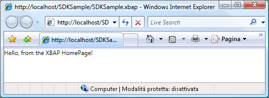  
  
> [!NOTE]
>  Per ulteriori informazioni sullo sviluppo e la distribuzione delle applicazioni [!INCLUDE[TLA2#tla_xbap#plural](../../../../includes/tla2sharptla-xbapsharpplural-md.md)], vedere [Panoramica delle applicazioni browser XAML di WPF](../../../../docs/framework/wpf/app-development/wpf-xaml-browser-applications-overview.md) e [Distribuzione di un'applicazione WPF](../../../../docs/framework/wpf/app-development/deploying-a-wpf-application-wpf.md).  
  
   
### Configurazione del titolo, della larghezza e dell'altezza della finestra host  
 Come si può notare dalla figura precedente, il titolo del browser e del riquadro della scheda è l'[!INCLUDE[TLA2#tla_uri](../../../../includes/tla2sharptla-uri-md.md)] dell'applicazione [!INCLUDE[TLA2#tla_xbap](../../../../includes/tla2sharptla-xbap-md.md)].  Oltre a essere lungo, il titolo non è visivamente gradevole né informativo.  Per questa ragione, <xref:System.Windows.Controls.Page> offre la possibilità di modificare il titolo impostando la proprietà <xref:System.Windows.Controls.Page.WindowTitle%2A>.  È anche possibile configurare la larghezza e l'altezza della finestra del browser impostando rispettivamente <xref:System.Windows.Controls.Page.WindowWidth%2A> e <xref:System.Windows.Controls.Page.WindowHeight%2A>.  
  
 <xref:System.Windows.Controls.Page.WindowTitle%2A>, <xref:System.Windows.Controls.Page.WindowWidth%2A> e <xref:System.Windows.Controls.Page.WindowHeight%2A> possono essere impostate in modo dichiarativo nel markup, come illustrato nell'esempio che segue.  
  
 [!code-xml[NavigationOverviewSnippets#HomePageMARKUP](../../../../samples/snippets/csharp/VS_Snippets_Wpf/NavigationOverviewSnippets/CSharp/HomePage.xaml#homepagemarkup)]  
  
 Nella figura riportata di seguito viene illustrato il risultato.  
  
   
  
   
### Navigazione mediante collegamenti ipertestuali  
 Un'applicazione [!INCLUDE[TLA2#tla_xbap](../../../../includes/tla2sharptla-xbap-md.md)] tipica comprende diverse pagine.  Il modo più semplice per spostarsi da una pagina all'altra consiste nell'utilizzo di <xref:System.Windows.Documents.Hyperlink>.  Per aggiungere in modo dichiarativo <xref:System.Windows.Documents.Hyperlink> a <xref:System.Windows.Controls.Page>, utilizzare l'elemento `Hyperlink`, illustrato nel seguente markup.  
  
 [!code-xml[NavigationOverviewSnippets#HyperlinkXAML1](../../../../samples/snippets/csharp/VS_Snippets_Wpf/NavigationOverviewSnippets/CSharp/PageWithHyperlink.xaml#hyperlinkxaml1)]  
[!code-xml[NavigationOverviewSnippets#HyperlinkXAML2](../../../../samples/snippets/csharp/VS_Snippets_Wpf/NavigationOverviewSnippets/CSharp/PageWithHyperlink.xaml#hyperlinkxaml2)]  
[!code-xml[NavigationOverviewSnippets#HyperlinkXAML3](../../../../samples/snippets/csharp/VS_Snippets_Wpf/NavigationOverviewSnippets/CSharp/PageWithHyperlink.xaml#hyperlinkxaml3)]  
  
 Un elemento `Hyperlink` necessita dei seguenti elementi:  
  
-   L'[!INCLUDE[TLA2#tla_uri](../../../../includes/tla2sharptla-uri-md.md)] di tipo pack dell'oggetto <xref:System.Windows.Controls.Page> sul quale ci si deve spostare, come specificato dall'attributo `NavigateUri`.  
  
-   Un contenuto sul quale un utente possa fare clic per avviare la navigazione, ad esempio testo o immagini. Per informazioni sul contenuto dell'elemento `Hyperlink`, vedere <xref:System.Windows.Documents.Hyperlink>.  
  
 Nella figura riportata di seguito viene illustrata un'applicazione [!INCLUDE[TLA2#tla_xbap](../../../../includes/tla2sharptla-xbap-md.md)] con un oggetto <xref:System.Windows.Controls.Page> contenente un oggetto <xref:System.Windows.Documents.Hyperlink>.  
  
 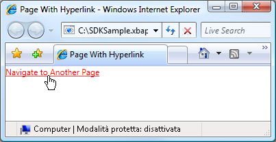  
  
 Come previsto, facendo clic su <xref:System.Windows.Documents.Hyperlink> l'applicazione [!INCLUDE[TLA2#tla_xbap](../../../../includes/tla2sharptla-xbap-md.md)] si sposta sull'oggetto <xref:System.Windows.Controls.Page> identificato dall'attributo `NavigateUri`.  Inoltre l'applicazione [!INCLUDE[TLA2#tla_xbap](../../../../includes/tla2sharptla-xbap-md.md)] aggiunge una voce relativa all'oggetto <xref:System.Windows.Controls.Page> precedente all'elenco Pagine recenti di [!INCLUDE[TLA2#tla_ie](../../../../includes/tla2sharptla-ie-md.md)],  come illustrato nella figura che segue.  
  
 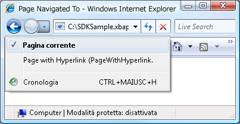  
  
 Oltre a supportare la navigazione da un oggetto <xref:System.Windows.Controls.Page> all'altro, <xref:System.Windows.Documents.Hyperlink> supporta anche la navigazione su un frammento.  
  
   
### Navigazione su un frammento  
 La *navigazione su un frammento* è l'azione mediante la quale ci si sposta su un frammento di contenuto dell'oggetto <xref:System.Windows.Controls.Page> corrente o di un altro oggetto <xref:System.Windows.Controls.Page>.  In [!INCLUDE[TLA2#tla_wpf](../../../../includes/tla2sharptla-wpf-md.md)] un frammento equivale al contenuto incluso in un elemento denominato,  ovvero un elemento con l'attributo `Name` impostato.  Nel markup che segue viene illustrato un elemento `TextBlock` denominato contenente un frammento di contenuto.  
  
 [!code-xml[NavigationOverviewSnippets#PageWithContentFragmentsMARKUP1](../../../../samples/snippets/csharp/VS_Snippets_Wpf/NavigationOverviewSnippets/CSharp/PageWithFragments.xaml#pagewithcontentfragmentsmarkup1)]  
[!code-xml[NavigationOverviewSnippets#PageWithContentFragmentsMARKUP2](../../../../samples/snippets/csharp/VS_Snippets_Wpf/NavigationOverviewSnippets/CSharp/PageWithFragments.xaml#pagewithcontentfragmentsmarkup2)]  
[!code-xml[NavigationOverviewSnippets#PageWithContentFragmentsMARKUP3](../../../../samples/snippets/csharp/VS_Snippets_Wpf/NavigationOverviewSnippets/CSharp/PageWithFragments.xaml#pagewithcontentfragmentsmarkup3)]  
  
 Per fare in modo che <xref:System.Windows.Documents.Hyperlink> si sposti su un frammento di contenuto, l'attributo `NavigateUri` deve includere quanto segue:  
  
-   L'[!INCLUDE[TLA2#tla_uri](../../../../includes/tla2sharptla-uri-md.md)] dell'oggetto <xref:System.Windows.Controls.Page> contenente il frammento sul quale ci si deve spostare.  
  
-   Un carattere "\#".  
  
-   Il nome dell'elemento di <xref:System.Windows.Controls.Page> contenente il frammento di contenuto.  
  
 L'[!INCLUDE[TLA2#tla_uri](../../../../includes/tla2sharptla-uri-md.md)] di un frammento ha il formato che segue.  
  
 *PageURI* `#` *ElementName*  
  
 Di seguito viene illustrato un esempio di `Hyperlink` configurato per la navigazione su un frammento di contenuto.  
  
 [!code-xml[NavigationOverviewSnippets#PageThatNavigatesXAML1](../../../../samples/snippets/csharp/VS_Snippets_Wpf/NavigationOverviewSnippets/CSharp/PageThatNavigatesToFragment.xaml#pagethatnavigatesxaml1)]  
[!code-xml[NavigationOverviewSnippets#PageThatNavigatesXAML2](../../../../samples/snippets/csharp/VS_Snippets_Wpf/NavigationOverviewSnippets/CSharp/PageThatNavigatesToFragment.xaml#pagethatnavigatesxaml2)]  
[!code-xml[NavigationOverviewSnippets#PageThatNavigatesXAML3](../../../../samples/snippets/csharp/VS_Snippets_Wpf/NavigationOverviewSnippets/CSharp/PageThatNavigatesToFragment.xaml#pagethatnavigatesxaml3)]  
  
> [!NOTE]
>  In questa sezione viene descritta l'implementazione della navigazione su un frammento predefinita in [!INCLUDE[TLA2#tla_wpf](../../../../includes/tla2sharptla-wpf-md.md)].  [!INCLUDE[TLA2#tla_wpf](../../../../includes/tla2sharptla-wpf-md.md)] consente anche di implementare uno schema di navigazione personalizzato che, in parte, richiede la gestione dell'evento <xref:System.Windows.Navigation.NavigationService.FragmentNavigation?displayProperty=fullName>.  
  
> [!IMPORTANT]
>  È possibile spostarsi su frammenti contenuti in pagine [!INCLUDE[TLA2#tla_xaml](../../../../includes/tla2sharptla-xaml-md.md)] separate, ovvero file [!INCLUDE[TLA2#tla_xaml](../../../../includes/tla2sharptla-xaml-md.md)] solo markup aventi `Page` come elemento radice, soltanto se le pagine possono essere visualizzate tramite [!INCLUDE[TLA2#tla_http](../../../../includes/tla2sharptla-http-md.md)].  
>   
>  Tuttavia, una pagina [!INCLUDE[TLA2#tla_xaml](../../../../includes/tla2sharptla-xaml-md.md)] separata può eseguire una navigazione sui propri frammenti.  
  
   
### Servizio di navigazione  
 Mentre <xref:System.Windows.Documents.Hyperlink> consente a un utente di avviare la navigazione su un particolare oggetto <xref:System.Windows.Controls.Page>, l'individuazione e lo scaricamento della pagina vengono eseguiti dalla classe <xref:System.Windows.Navigation.NavigationService>.  Essenzialmente, <xref:System.Windows.Navigation.NavigationService> consente di elaborare una richiesta di navigazione da parte del codice client, quale ad esempio <xref:System.Windows.Documents.Hyperlink>.  Inoltre, <xref:System.Windows.Navigation.NavigationService> implementa un supporto di livello superiore grazie al quale è possibile tenere traccia di una richiesta di navigazione nonché influenzare tale richiesta.  
  
 Facendo clic su <xref:System.Windows.Documents.Hyperlink>, [!INCLUDE[TLA2#tla_wpf](../../../../includes/tla2sharptla-wpf-md.md)] chiama <xref:System.Windows.Navigation.NavigationService.Navigate%2A?displayProperty=fullName> per individuare e scaricare l'oggetto <xref:System.Windows.Controls.Page> nell'[!INCLUDE[TLA2#tla_uri](../../../../includes/tla2sharptla-uri-md.md)] di tipo pack specificato.  Una volta scaricato, <xref:System.Windows.Controls.Page> viene convertito in una struttura ad albero di oggetti il cui oggetto radice è un'istanza del medesimo oggetto <xref:System.Windows.Controls.Page> scaricato.  Un riferimento all'oggetto <xref:System.Windows.Controls.Page> radice viene archiviato nella proprietà <xref:System.Windows.Navigation.NavigationService.Content%2A?displayProperty=fullName>.  L'[!INCLUDE[TLA2#tla_uri](../../../../includes/tla2sharptla-uri-md.md)] di tipo pack del contenuto sul quale ci si è spostati viene archiviato nella proprietà <xref:System.Windows.Navigation.NavigationService.Source%2A?displayProperty=fullName>, mentre <xref:System.Windows.Navigation.NavigationService.CurrentSource%2A?displayProperty=fullName> archivia l'[!INCLUDE[TLA2#tla_uri](../../../../includes/tla2sharptla-uri-md.md)] di tipo pack dell'ultima pagina sulla quale è avvenuta la navigazione.  
  
> [!NOTE]
>  Un'applicazione [!INCLUDE[TLA2#tla_wpf](../../../../includes/tla2sharptla-wpf-md.md)] può avere più oggetti <xref:System.Windows.Navigation.NavigationService> attualmente attivi.  Per ulteriori informazioni, vedere [Host di navigazione](#Navigation_Hosts) più avanti in questo argomento.  
  
   
### Navigazione a livello di codice mediante servizio di navigazione  
 Se la navigazione viene implementata in modo dichiarativo nel markup tramite <xref:System.Windows.Documents.Hyperlink>, non occorre conoscere <xref:System.Windows.Navigation.NavigationService> in quanto <xref:System.Windows.Documents.Hyperlink> utilizza <xref:System.Windows.Navigation.NavigationService> per conto dell'utente.  Ciò significa che, se l'elemento padre diretto o indiretto di un oggetto <xref:System.Windows.Documents.Hyperlink> è un host di navigazione \(vedere [Host di navigazione](#Navigation_Hosts)\), <xref:System.Windows.Documents.Hyperlink> sarà in grado di individuare e utilizzare il servizio di navigazione dell'host per elaborare una richiesta di navigazione.  
  
 In alcuni casi, tuttavia, è necessario utilizzare direttamente <xref:System.Windows.Navigation.NavigationService>. Di seguito vengono riportati alcuni di questi casi:  
  
-   Per creare un'istanza di <xref:System.Windows.Controls.Page> utilizzando un costruttore non predefinito.  
  
-   Per impostare le proprietà di <xref:System.Windows.Controls.Page> prima di spostarsi su di esso.  
  
-   Quando l'oggetto <xref:System.Windows.Controls.Page> sul quale ci si deve spostare può essere determinato solo in fase di esecuzione.  
  
 In questi casi è richiesta la scrittura di codice per avviare la navigazione a livello di codice mediante chiamata al metodo <xref:System.Windows.Navigation.NavigationService.Navigate%2A> dell'oggetto <xref:System.Windows.Navigation.NavigationService>.  A tal proposito è necessario ottenere un riferimento a <xref:System.Windows.Navigation.NavigationService>.  
  
#### Ottenimento di un riferimento a NavigationService  
 Per ragioni analizzate nella sezione [Host di navigazione](#Navigation_Hosts), un'applicazione [!INCLUDE[TLA2#tla_wpf](../../../../includes/tla2sharptla-wpf-md.md)] può avere più oggetti <xref:System.Windows.Navigation.NavigationService>.  Ciò significa che il codice necessita di un metodo per individuare un particolare oggetto <xref:System.Windows.Navigation.NavigationService>, in genere l'oggetto <xref:System.Windows.Navigation.NavigationService> che ha effettuato la navigazione sull'oggetto <xref:System.Windows.Controls.Page> corrente. Per ottenere un riferimento a <xref:System.Windows.Navigation.NavigationService>, chiamare il metodo `static` <xref:System.Windows.Navigation.NavigationService.GetNavigationService%2A?displayProperty=fullName>.  Per ottenere l'oggetto <xref:System.Windows.Navigation.NavigationService> che ha effettuato la navigazione su un particolare oggetto <xref:System.Windows.Controls.Page>, passare un riferimento a <xref:System.Windows.Controls.Page> come argomento del metodo <xref:System.Windows.Navigation.NavigationService.GetNavigationService%2A>.  Nel codice riportato di seguito viene illustrato come ottenere <xref:System.Windows.Navigation.NavigationService> per l'oggetto <xref:System.Windows.Controls.Page> corrente.  
  
 [!code-csharp[NavigationOverviewSnippets#GetNSCODEBEHIND1](../../../../samples/snippets/csharp/VS_Snippets_Wpf/NavigationOverviewSnippets/CSharp/GetNSPage.xaml.cs#getnscodebehind1)]  
[!code-csharp[NavigationOverviewSnippets#GetNSCODEBEHIND2](../../../../samples/snippets/csharp/VS_Snippets_Wpf/NavigationOverviewSnippets/CSharp/GetNSPage.xaml.cs#getnscodebehind2)]
[!code-vb[NavigationOverviewSnippets#GetNSCODEBEHIND2](../../../../samples/snippets/visualbasic/VS_Snippets_Wpf/NavigationOverviewSnippets/VisualBasic/GetNSPage.xaml.vb#getnscodebehind2)]  
  
 Un'alternativa più rapida per la ricerca di <xref:System.Windows.Navigation.NavigationService> viene offerta da <xref:System.Windows.Controls.Page>, il quale implementa la proprietà <xref:System.Windows.Controls.Page.NavigationService%2A>,  Questa operazione viene mostrata nell'esempio seguente.  
  
 [!code-csharp[NavigationOverviewSnippets#GetNSShortcutCODEBEHIND1](../../../../samples/snippets/csharp/VS_Snippets_Wpf/NavigationOverviewSnippets/CSharp/GetNSPageShortCut.xaml.cs#getnsshortcutcodebehind1)]  
[!code-csharp[NavigationOverviewSnippets#GetNSShortcutCODEBEHIND2](../../../../samples/snippets/csharp/VS_Snippets_Wpf/NavigationOverviewSnippets/CSharp/GetNSPageShortCut.xaml.cs#getnsshortcutcodebehind2)]
[!code-vb[NavigationOverviewSnippets#GetNSShortcutCODEBEHIND2](../../../../samples/snippets/visualbasic/VS_Snippets_Wpf/NavigationOverviewSnippets/VisualBasic/GetNSPageShortCut.xaml.vb#getnsshortcutcodebehind2)]  
  
> [!NOTE]
>  <xref:System.Windows.Controls.Page> può ottenere un riferimento a <xref:System.Windows.Navigation.NavigationService> soltanto quando genera l'evento <xref:System.Windows.FrameworkElement.Loaded>.  
  
#### Navigazione a livello di codice su un oggetto Page  
 Nell'esempio seguente viene illustrato come utilizzare <xref:System.Windows.Navigation.NavigationService> per spostarsi a livello di codice su un oggetto <xref:System.Windows.Controls.Page>.  Si richiede la navigazione a livello di codice in quanto è possibile creare un'istanza dell'oggetto <xref:System.Windows.Controls.Page> sul quale ci si sposta soltanto mediante un unico costruttore non predefinito.  Nel markup e nel codice che seguono viene illustrato <xref:System.Windows.Controls.Page> con il costruttore non predefinito.  
  
 [!code-xml[NavigationOverviewSnippets#PageWithNonDefaultConstructorXAML](../../../../samples/snippets/csharp/VS_Snippets_Wpf/NavigationOverviewSnippets/CSharp/PageWithNonDefaultConstructor.xaml#pagewithnondefaultconstructorxaml)]  
  
 [!code-csharp[NavigationOverviewSnippets#PageWithNonDefaultConstructorCODEBEHIND](../../../../samples/snippets/csharp/VS_Snippets_Wpf/NavigationOverviewSnippets/CSharp/PageWithNonDefaultConstructor.xaml.cs#pagewithnondefaultconstructorcodebehind)]
 [!code-vb[NavigationOverviewSnippets#PageWithNonDefaultConstructorCODEBEHIND](../../../../samples/snippets/visualbasic/VS_Snippets_Wpf/NavigationOverviewSnippets/VisualBasic/PageWithNonDefaultConstructor.xaml.vb#pagewithnondefaultconstructorcodebehind)]  
  
 Nel markup e nel codice che seguono viene illustrato l'oggetto <xref:System.Windows.Controls.Page> che effettua la navigazione su <xref:System.Windows.Controls.Page> con il costruttore non predefinito.  
  
 [!code-xml[NavigationOverviewSnippets#NSNavigationPageXAML](../../../../samples/snippets/csharp/VS_Snippets_Wpf/NavigationOverviewSnippets/CSharp/NSNavigationPage.xaml#nsnavigationpagexaml)]  
  
 [!code-csharp[NavigationOverviewSnippets#NSNavigationPageCODEBEHIND](../../../../samples/snippets/csharp/VS_Snippets_Wpf/NavigationOverviewSnippets/CSharp/NSNavigationPage.xaml.cs#nsnavigationpagecodebehind)]
 [!code-vb[NavigationOverviewSnippets#NSNavigationPageCODEBEHIND](../../../../samples/snippets/visualbasic/VS_Snippets_Wpf/NavigationOverviewSnippets/VisualBasic/NSNavigationPage.xaml.vb#nsnavigationpagecodebehind)]  
  
 Facendo clic su <xref:System.Windows.Documents.Hyperlink> nell'oggetto <xref:System.Windows.Controls.Page> in questione, la navigazione viene avviata mediante creazione di un'istanza dell'oggetto <xref:System.Windows.Controls.Page> sul quale ci si deve spostare tramite costruttore non predefinito e chiamata al metodo <xref:System.Windows.Navigation.NavigationService.Navigate%2A?displayProperty=fullName>.  <xref:System.Windows.Navigation.NavigationService.Navigate%2A> accetta un riferimento all'oggetto sul quale si sposterà <xref:System.Windows.Navigation.NavigationService>, anziché un [!INCLUDE[TLA2#tla_uri](../../../../includes/tla2sharptla-uri-md.md)] di tipo pack.  
  
#### Navigazione a livello di codice con un URI di tipo pack  
 Per costruire un [!INCLUDE[TLA2#tla_uri](../../../../includes/tla2sharptla-uri-md.md)] di tipo pack a livello di codice, ad esempio nel caso in cui sia possibile determinare l'[!INCLUDE[TLA2#tla_uri](../../../../includes/tla2sharptla-uri-md.md)] di tipo pack unicamente in fase di esecuzione, è possibile utilizzare il metodo <xref:System.Windows.Navigation.NavigationService.Navigate%2A?displayProperty=fullName>,  Questa operazione viene mostrata nell'esempio seguente.  
  
 [!code-xml[NavigationOverviewSnippets#NSUriNavigationPageXAML](../../../../samples/snippets/csharp/VS_Snippets_Wpf/NavigationOverviewSnippets/CSharp/NSUriNavigationPage.xaml#nsurinavigationpagexaml)]  
  
 [!code-csharp[NavigationOverviewSnippets#NSUriNavigationPageCODEBEHIND](../../../../samples/snippets/csharp/VS_Snippets_Wpf/NavigationOverviewSnippets/CSharp/NSUriNavigationPage.xaml.cs#nsurinavigationpagecodebehind)]
 [!code-vb[NavigationOverviewSnippets#NSUriNavigationPageCODEBEHIND](../../../../samples/snippets/visualbasic/VS_Snippets_Wpf/NavigationOverviewSnippets/VisualBasic/NSUriNavigationPage.xaml.vb#nsurinavigationpagecodebehind)]  
  
#### Aggiornamento della pagina corrente  
 <xref:System.Windows.Controls.Page> non viene scaricato se il relativo [!INCLUDE[TLA2#tla_uri](../../../../includes/tla2sharptla-uri-md.md)] di tipo pack è equivalente all'[!INCLUDE[TLA2#tla_uri](../../../../includes/tla2sharptla-uri-md.md)] archiviato nella proprietà <xref:System.Windows.Navigation.NavigationService.Source%2A?displayProperty=fullName>.  Per forzare [!INCLUDE[TLA2#tla_wpf](../../../../includes/tla2sharptla-wpf-md.md)] a scaricare nuovamente la pagina corrente, è possibile chiamare il metodo <xref:System.Windows.Navigation.NavigationService.Refresh%2A?displayProperty=fullName>, come illustrato nell'esempio che segue.  
  
 [!code-xml[NavigationOverviewSnippets#NSRefreshNavigationPageXAML1](../../../../samples/snippets/csharp/VS_Snippets_Wpf/NavigationOverviewSnippets/CSharp/NSRefreshNavigationPage.xaml#nsrefreshnavigationpagexaml1)]  
  
 [!code-csharp[NavigationOverviewSnippets#NSRefreshNavigationPageCODEBEHIND1](../../../../samples/snippets/csharp/VS_Snippets_Wpf/NavigationOverviewSnippets/CSharp/NSRefreshNavigationPage.xaml.cs#nsrefreshnavigationpagecodebehind1)]
 [!code-vb[NavigationOverviewSnippets#NSRefreshNavigationPageCODEBEHIND1](../../../../samples/snippets/visualbasic/VS_Snippets_Wpf/NavigationOverviewSnippets/VisualBasic/NSRefreshNavigationPage.xaml.vb#nsrefreshnavigationpagecodebehind1)]  
[!code-csharp[NavigationOverviewSnippets#NSRefreshNavigationPageCODEBEHIND2](../../../../samples/snippets/csharp/VS_Snippets_Wpf/NavigationOverviewSnippets/CSharp/NSRefreshNavigationPage.xaml.cs#nsrefreshnavigationpagecodebehind2)]
[!code-vb[NavigationOverviewSnippets#NSRefreshNavigationPageCODEBEHIND2](../../../../samples/snippets/visualbasic/VS_Snippets_Wpf/NavigationOverviewSnippets/VisualBasic/NSRefreshNavigationPage.xaml.vb#nsrefreshnavigationpagecodebehind2)]  
  
   
### Durata della navigazione  
 Come si è visto, esistono diversi modi per avviare una navigazione.  Una volta avviata la navigazione e durante la relativa esecuzione è possibile tenerne traccia nonché influenzarla utilizzando gli eventi riportati di seguito, implementati da <xref:System.Windows.Navigation.NavigationService>:  
  
-   <xref:System.Windows.Navigation.NavigationService.Navigating>.  Si verifica quando viene richiesto una nuova navigazione.  Può essere utilizzato per annullare la navigazione.  
  
-   <xref:System.Windows.Navigation.NavigationService.NavigationProgress>.  Si verifica periodicamente durante un download per fornire informazioni sullo stato di avanzamento della navigazione.  
  
-   <xref:System.Windows.Navigation.NavigationService.Navigated>.  Si verifica quando la pagina è stata individuata e scaricata.  
  
-   <xref:System.Windows.Navigation.NavigationService.NavigationStopped>.  Si verifica quando la navigazione viene interrotta mediante una chiamata a <xref:System.Windows.Navigation.NavigationService.StopLoading%2A> oppure quando viene richiesto una nuova navigazione mentre quella corrente è ancora in corso.  
  
-   <xref:System.Windows.Navigation.NavigationService.NavigationFailed>.  Si verifica quando viene generato un errore durante la navigazione sul contenuto richiesto.  
  
-   <xref:System.Windows.Navigation.NavigationService.LoadCompleted>.  Si verifica quando il contenuto sul quale ci si è spostati è stato caricato e analizzato ed è iniziata l'esecuzione del rendering.  
  
-   <xref:System.Windows.Navigation.NavigationService.FragmentNavigation>.  Si verifica quando inizia la navigazione su un frammento di contenuto; tale navigazione avviene:  
  
    -   Immediatamente, se il frammento desiderato si trova nel contenuto corrente.  
  
    -   Una volta caricato il contenuto di origine, se il frammento desiderato si trova in un contenuto diverso.  
  
 Gli eventi di navigazione vengono generati nell'ordine illustrato nella figura che segue.  
  
 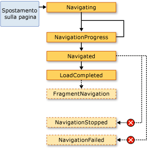  
  
 In genere questi eventi non riguardano <xref:System.Windows.Controls.Page>.  È più probabile che interessino un'applicazione e, per tale ragione, vengono generati anche dalla classe <xref:System.Windows.Application>:  
  
-   <xref:System.Windows.Application.Navigating?displayProperty=fullName>  
  
-   <xref:System.Windows.Application.NavigationProgress?displayProperty=fullName>  
  
-   <xref:System.Windows.Application.Navigated?displayProperty=fullName>  
  
-   <xref:System.Windows.Application.NavigationFailed?displayProperty=fullName>  
  
-   <xref:System.Windows.Application.NavigationStopped?displayProperty=fullName>  
  
-   <xref:System.Windows.Application.LoadCompleted?displayProperty=fullName>  
  
-   <xref:System.Windows.Application.FragmentNavigation?displayProperty=fullName>  
  
 Ogni qualvolta <xref:System.Windows.Navigation.NavigationService> genera un evento, la classe <xref:System.Windows.Application> genera l'evento corrispondente.  <xref:System.Windows.Controls.Frame> e <xref:System.Windows.Navigation.NavigationWindow> offrono gli stessi eventi per rilevare la navigazione all'interno dei rispettivi ambiti.  
  
 In alcuni casi è possibile che questi eventi interessino <xref:System.Windows.Controls.Page>.  Ad esempio, <xref:System.Windows.Controls.Page> può gestire l'evento <xref:System.Windows.Navigation.NavigationService.Navigating?displayProperty=fullName> per determinare se annullare o meno la navigazione da se stesso,  Questa operazione viene mostrata nell'esempio seguente.  
  
 [!code-xml[NavigationOverviewSnippets#CancelNavigationPageXAML](../../../../samples/snippets/csharp/VS_Snippets_Wpf/NavigationOverviewSnippets/CSharp/CancelNavigationPage.xaml#cancelnavigationpagexaml)]  
  
 [!code-csharp[NavigationOverviewSnippets#CancelNavigationPageCODEBEHIND](../../../../samples/snippets/csharp/VS_Snippets_Wpf/NavigationOverviewSnippets/CSharp/CancelNavigationPage.xaml.cs#cancelnavigationpagecodebehind)]
 [!code-vb[NavigationOverviewSnippets#CancelNavigationPageCODEBEHIND](../../../../samples/snippets/visualbasic/VS_Snippets_Wpf/NavigationOverviewSnippets/VisualBasic/CancelNavigationPage.xaml.vb#cancelnavigationpagecodebehind)]  
  
 Nel caso in cui venga registrato un gestore con un evento di navigazione da <xref:System.Windows.Controls.Page>, come avviene nell'esempio precedente, occorre anche annullare la registrazione del gestore eventi.  In caso contrario, potrebbero esserci effetti collaterali circa il modo in cui [!INCLUDE[TLA2#tla_wpf](../../../../includes/tla2sharptla-wpf-md.md)] memorizza la navigazione da <xref:System.Windows.Controls.Page> mediante il journal.  
  
   
### Memorizzazione della navigazione mediante journal  
 [!INCLUDE[TLA2#tla_wpf](../../../../includes/tla2sharptla-wpf-md.md)] utilizza due stack per memorizzare le pagine dalle quali ci si è spostati: uno stack indietro e uno stack avanti.  Quando si effettua la navigazione dall'oggetto <xref:System.Windows.Controls.Page> corrente a un nuovo oggetto <xref:System.Windows.Controls.Page> oppure quando ci si sposta in avanti su un oggetto <xref:System.Windows.Controls.Page> esistente, l'oggetto <xref:System.Windows.Controls.Page> corrente viene aggiunto allo *stack indietro*.  Quando si effettua la navigazione dall'oggetto <xref:System.Windows.Controls.Page> corrente all'oggetto <xref:System.Windows.Controls.Page> precedente, l'oggetto <xref:System.Windows.Controls.Page> corrente viene aggiunto allo *stack avanti*.  Lo stack indietro, lo stack avanti e la funzionalità di gestione degli stack vengono complessivamente definiti come il journal.  Ogni elemento contenuto nello stack indietro e nello stack avanti è un'istanza della classe <xref:System.Windows.Navigation.JournalEntry> e viene definito *voce del journal*.  
  
#### Navigazione nel journal da Internet Explorer  
 Dal punto di vista concettuale, il journal funziona esattamente come i pulsanti **Indietro** e **Avanti** di [!INCLUDE[TLA2#tla_ie](../../../../includes/tla2sharptla-ie-md.md)],  illustrati nella figura che segue.  
  
   
  
 Nel caso delle applicazioni [!INCLUDE[TLA2#tla_xbap#plural](../../../../includes/tla2sharptla-xbapsharpplural-md.md)] ospitate da [!INCLUDE[TLA2#tla_ie](../../../../includes/tla2sharptla-ie-md.md)], [!INCLUDE[TLA2#tla_wpf](../../../../includes/tla2sharptla-wpf-md.md)] integra il journal nell'[!INCLUDE[TLA2#tla_ui](../../../../includes/tla2sharptla-ui-md.md)] di navigazione di [!INCLUDE[TLA2#tla_ie](../../../../includes/tla2sharptla-ie-md.md)].  In questo modo gli utenti possono spostarsi sulle pagine di un'applicazione [!INCLUDE[TLA2#tla_xbap](../../../../includes/tla2sharptla-xbap-md.md)] utilizzando i pulsanti **Indietro**, **Avanti** e **Pagine recenti** di [!INCLUDE[TLA2#tla_ie](../../../../includes/tla2sharptla-ie-md.md)]. Per quanto concerne [!INCLUDE[TLA2#tla_ie6](../../../../includes/tla2sharptla-ie6-md.md)], il journal non viene integrato allo stesso modo di [!INCLUDE[TLA2#tla_ie7](../../../../includes/tla2sharptla-ie7-md.md)] o Internet Explorer 8.  Al contrario, [!INCLUDE[TLA2#tla_wpf](../../../../includes/tla2sharptla-wpf-md.md)] esegue il rendering di un'[!INCLUDE[TLA2#tla_ui](../../../../includes/tla2sharptla-ui-md.md)] di navigazione sostitutiva.  
  
> [!IMPORTANT]
>  Nel caso di [!INCLUDE[TLA2#tla_ie](../../../../includes/tla2sharptla-ie-md.md)], se un utente si sposta da un'applicazione [!INCLUDE[TLA2#tla_xbap](../../../../includes/tla2sharptla-xbap-md.md)] e poi vi fa ritorno, nel journal vengono conservate soltanto le voci relative alle pagine che non sono state mantenute attive.  Per informazioni su come mantenere attive le pagine, vedere [Durata della pagina e journal](#PageLifetime) più avanti in questo argomento.  
  
 Per impostazione predefinita, il testo relativo a ogni oggetto <xref:System.Windows.Controls.Page> visualizzato nell'elenco **Pagine recenti** di [!INCLUDE[TLA2#tla_ie](../../../../includes/tla2sharptla-ie-md.md)] è equivalente all'[!INCLUDE[TLA2#tla_uri](../../../../includes/tla2sharptla-uri-md.md)] di <xref:System.Windows.Controls.Page>.  In diversi casi questo testo non risulta molto significativo agli occhi dell'utente.  Fortunatamente è possibile modificarlo utilizzando una delle seguenti opzioni:  
  
1.  Il valore dell'attributo `JournalEntry.Name` associato.  
  
2.  Il valore dell'attributo `Page.Title`.  
  
3.  Il valore dell'attributo `Page.WindowTitle` e l'[!INCLUDE[TLA2#tla_uri](../../../../includes/tla2sharptla-uri-md.md)] dell'oggetto <xref:System.Windows.Controls.Page> corrente.  
  
4.  L'[!INCLUDE[TLA2#tla_uri](../../../../includes/tla2sharptla-uri-md.md)] dell'oggetto <xref:System.Windows.Controls.Page> corrente  \(Valore predefinito\)  
  
 L'ordine nel quale sono elencate le opzioni corrisponde all'ordine di precedenza utilizzato per cercare il testo.  Se ad esempio `JournalEntry.Name` è impostato, gli altri valori vengono ignorati.  
  
 Nell'esempio che segue viene utilizzato l'attributo `Page.Title` per modificare il testo visualizzato per una voce del journal.  
  
 [!code-xml[NavigationOverviewSnippets#PageTitleMARKUP1](../../../../samples/snippets/csharp/VS_Snippets_Wpf/NavigationOverviewSnippets/CSharp/PageWithTitle.xaml#pagetitlemarkup1)]  
[!code-xml[NavigationOverviewSnippets#PageTitleMARKUP2](../../../../samples/snippets/csharp/VS_Snippets_Wpf/NavigationOverviewSnippets/CSharp/PageWithTitle.xaml#pagetitlemarkup2)]  
  
 [!code-csharp[NavigationOverviewSnippets#PageTitleCODEBEHIND1](../../../../samples/snippets/csharp/VS_Snippets_Wpf/NavigationOverviewSnippets/CSharp/PageWithTitle.xaml.cs#pagetitlecodebehind1)]
 [!code-vb[NavigationOverviewSnippets#PageTitleCODEBEHIND1](../../../../samples/snippets/visualbasic/VS_Snippets_Wpf/NavigationOverviewSnippets/VisualBasic/PageWithTitle.xaml.vb#pagetitlecodebehind1)]  
[!code-csharp[NavigationOverviewSnippets#PageTitleCODEBEHIND2](../../../../samples/snippets/csharp/VS_Snippets_Wpf/NavigationOverviewSnippets/CSharp/PageWithTitle.xaml.cs#pagetitlecodebehind2)]
[!code-vb[NavigationOverviewSnippets#PageTitleCODEBEHIND2](../../../../samples/snippets/visualbasic/VS_Snippets_Wpf/NavigationOverviewSnippets/VisualBasic/PageWithTitle.xaml.vb#pagetitlecodebehind2)]  
  
#### Navigazione nel journal mediante WPF  
 Benché sia possibile spostarsi nel journal utilizzando i pulsanti **Indietro**, **Avanti** e **Pagine recenti** di [!INCLUDE[TLA2#tla_ie](../../../../includes/tla2sharptla-ie-md.md)], è anche possibile effettuare la stessa operazione tramite meccanismi dichiarativi e a livello di codice forniti da [!INCLUDE[TLA2#tla_wpf](../../../../includes/tla2sharptla-wpf-md.md)].  Questo metodo può essere utilizzato, ad esempio, per fornire [!INCLUDE[TLA2#tla_ui#plural](../../../../includes/tla2sharptla-uisharpplural-md.md)] di navigazione personalizzate nelle pagine.  
  
 Per aggiungere in modo dichiarativo un supporto per la navigazione nel journal, è possibile utilizzare i comandi di navigazione esposti da <xref:System.Windows.Input.NavigationCommands>.  Nell'esempio che segue viene illustrato come utilizzare il comando di navigazione `BrowseBack`.  
  
 [!code-xml[NavigationOverviewSnippets#NavigationCommandsPageXAML1](../../../../samples/snippets/csharp/VS_Snippets_Wpf/NavigationOverviewSnippets/CSharp/NavigationCommandsPage.xaml#navigationcommandspagexaml1)]  
[!code-xml[NavigationOverviewSnippets#NavigationCommandsPageXAML2](../../../../samples/snippets/csharp/VS_Snippets_Wpf/NavigationOverviewSnippets/CSharp/NavigationCommandsPage.xaml#navigationcommandspagexaml2)]  
[!code-xml[NavigationOverviewSnippets#NavigationCommandsPageXAML3](../../../../samples/snippets/csharp/VS_Snippets_Wpf/NavigationOverviewSnippets/CSharp/NavigationCommandsPage.xaml#navigationcommandspagexaml3)]  
[!code-xml[NavigationOverviewSnippets#NavigationCommandsPageXAML4](../../../../samples/snippets/csharp/VS_Snippets_Wpf/NavigationOverviewSnippets/CSharp/NavigationCommandsPage.xaml#navigationcommandspagexaml4)]  
  
 Per spostarsi nel journal a livello di codice, è possibile utilizzare uno dei seguenti membri della classe <xref:System.Windows.Navigation.NavigationService>:  
  
-   <xref:System.Windows.Navigation.NavigationService.GoBack%2A>  
  
-   <xref:System.Windows.Navigation.NavigationService.GoForward%2A>  
  
-   <xref:System.Windows.Navigation.NavigationService.CanGoBack%2A>  
  
-   <xref:System.Windows.Navigation.NavigationService.CanGoForward%2A>  
  
 Il journal può anche essere modificato a livello di codice, come illustrato in [Mantenimento dello stato del contenuto mediante cronologia di navigazione](#RetainingContentStateWithNavigationHistory) più avanti in questo argomento.  
  
   
### Durata della pagina e journal  
 Si consideri un'applicazione [!INCLUDE[TLA2#tla_xbap](../../../../includes/tla2sharptla-xbap-md.md)] con diverse pagine che includono un contenuto complesso, ad esempio grafici, animazioni e contenuti multimediali.  Il footprint di memoria per pagine simili può essere piuttosto grande, in particolare se vengono utilizzati contenuti audio e video.  Considerando il fatto che il journal "memorizza" le pagine sulle quali ci si è spostati, un'applicazione [!INCLUDE[TLA2#tla_xbap](../../../../includes/tla2sharptla-xbap-md.md)] di questo tipo potrebbe utilizzare rapidamente una notevole quantità di memoria.  
  
 Per questa ragione, il comportamento predefinito del journal prevede l'archiviazione dei metadati di <xref:System.Windows.Controls.Page> in ciascuna voce del journal anziché di un riferimento a un oggetto <xref:System.Windows.Controls.Page>.  Quando ci si sposta su una voce del journal, i metadati di <xref:System.Windows.Controls.Page> vengono utilizzati per creare una nuova istanza dell'oggetto <xref:System.Windows.Controls.Page> specificato.  Di conseguenza, ogni oggetto <xref:System.Windows.Controls.Page> sul quale si effettua la navigazione possiede la durata illustrata nella figura che segue.  
  
 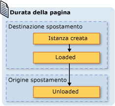  
  
 Benché l'utilizzo del comportamento di inserimento nel journal predefinito consenta di ridurre il consumo di memoria, è possibile che anche le prestazioni di rendering delle singole pagine vengano ridotte. La creazione di una nuova istanza di <xref:System.Windows.Controls.Page> può richiedere molto tempo, in particolare se è presente una grande quantità di contenuto.  Per conservare un'istanza di <xref:System.Windows.Controls.Page> nel journal, è possibile sfruttare due tecniche diverse.  Primo, è possibile spostarsi a livello di codice su un oggetto <xref:System.Windows.Controls.Page> mediante una chiamata al metodo <xref:System.Windows.Navigation.NavigationService.Navigate%2A?displayProperty=fullName>.  
  
 Secondo, è possibile fare in modo che [!INCLUDE[TLA2#tla_wpf](../../../../includes/tla2sharptla-wpf-md.md)] conservi un'istanza di <xref:System.Windows.Controls.Page> nel journal impostando la proprietà <xref:System.Windows.Controls.Page.KeepAlive%2A> su `true` \(l'impostazione predefinita è `false`\).  Come illustrato nell'esempio che segue, <xref:System.Windows.Controls.Page.KeepAlive%2A> può essere impostata in modo dichiarativo nel markup.  
  
 [!code-xml[NavigationOverviewSnippets#KeepAlivePageXAML](../../../../samples/snippets/csharp/VS_Snippets_Wpf/NavigationOverviewSnippets/CSharp/KeepAlivePage.xaml#keepalivepagexaml)]  
  
 La durata di un oggetto <xref:System.Windows.Controls.Page> mantenuto attivo è leggermente diversa rispetto agli altri oggetti.  La prima volta in cui si effettua la navigazione su un oggetto <xref:System.Windows.Controls.Page> mantenuto attivo, ne viene creata un'istanza proprio come avviene per gli oggetti <xref:System.Windows.Controls.Page> che non vengono mantenuti attivi.  Tuttavia, poiché nel journal viene conservata un'istanza di <xref:System.Windows.Controls.Page>, non sarà più necessario creare nuove istanze dello stesso fintanto che tale istanza resterà nel journal.  Di conseguenza, nel caso in cui <xref:System.Windows.Controls.Page> possieda una logica di inizializzazione che deve essere chiamata ogni qualvolta ci si sposta sull'oggetto in questione, sarebbe opportuno spostarlo dal costruttore in un gestore per l'evento <xref:System.Windows.FrameworkElement.Loaded>.  Come illustrato nella figura che segue, gli eventi <xref:System.Windows.FrameworkElement.Loaded> e <xref:System.Windows.FrameworkElement.Unloaded> vengono tuttora generati ogni qualvolta avviene la navigazione rispettivamente su o da <xref:System.Windows.Controls.Page>.  
  
 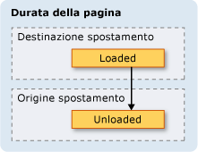  
  
 Quando <xref:System.Windows.Controls.Page> non viene mantenuto attivo, occorre evitare di:  
  
-   Archiviare un riferimento all'oggetto o parte di esso.  
  
-   Registrare gestori eventi con eventi che non siano implementati dall'oggetto.  
  
 In caso contrario verrebbero creati riferimenti in base ai quali <xref:System.Windows.Controls.Page> verrebbe conservato in memoria anche dopo essere stato rimosso dal journal.  
  
 In genere si preferisce il comportamento predefinito per cui <xref:System.Windows.Controls.Page> non viene mantenuto attivo.  Ciò comporta tuttavia implicazioni sullo stato, che verranno trattate nella sezione successiva.  
  
   
### Mantenimento dello stato del contenuto mediante cronologia di navigazione  
 Se un oggetto <xref:System.Windows.Controls.Page> dotato di controlli per la raccolta di dati dall'utente non viene mantenuto attivo, cosa accade ai dati nel momento in cui ci si sposta da tale oggetto per poi farvi nuovamente ritorno?  Dal punto di vista dell'esperienza utente, ci si potrebbe aspettare di visualizzare i dati immessi in precedenza.  Sfortunatamente, a ogni navigazione viene creata una nuova istanza di <xref:System.Windows.Controls.Page> e di conseguenza anche dei controlli di raccolta dei dati, pertanto i dati immessi vengono persi.  
  
 Il journal fornisce però un supporto per la memorizzazione dei dati, inclusi quelli dei controlli, durante la navigazione da un oggetto <xref:System.Windows.Controls.Page> all'altro.  Nello specifico, la voce del journal per ogni oggetto <xref:System.Windows.Controls.Page> funge da contenitore temporaneo per lo stato dell'oggetto <xref:System.Windows.Controls.Page> associato.  Nella procedura che segue viene illustrato l'utilizzo di questo supporto in caso di navigazione da <xref:System.Windows.Controls.Page>:  
  
1.  Una voce per l'oggetto <xref:System.Windows.Controls.Page> corrente viene aggiunta al journal.  
  
2.  Lo stato di <xref:System.Windows.Controls.Page> viene archiviato con la voce del journal relativa alla pagina in questione, la quale viene aggiunta allo stack indietro.  
  
3.  Viene effettuato la navigazione sul nuovo oggetto <xref:System.Windows.Controls.Page>.  
  
 Quando si torna sull'oggetto <xref:System.Windows.Controls.Page> precedente utilizzando il journal, avviene quanto segue:  
  
1.  Viene creata un'istanza di <xref:System.Windows.Controls.Page>, ossia della prima voce del journal nello stack indietro.  
  
2.  <xref:System.Windows.Controls.Page> viene aggiornato con lo stato archiviato nella voce del journal corrispondente.  
  
3.  Ci si sposta nuovamente su <xref:System.Windows.Controls.Page>.  
  
 [!INCLUDE[TLA2#tla_wpf](../../../../includes/tla2sharptla-wpf-md.md)] utilizza automaticamente questo supporto quando in <xref:System.Windows.Controls.Page> vengono utilizzati i seguenti controlli:  
  
-   <xref:System.Windows.Controls.CheckBox>  
  
-   <xref:System.Windows.Controls.ComboBox>  
  
-   <xref:System.Windows.Controls.Expander>  
  
-   <xref:System.Windows.Controls.Frame>  
  
-   <xref:System.Windows.Controls.ListBox>  
  
-   <xref:System.Windows.Controls.ListBoxItem>  
  
-   <xref:System.Windows.Controls.MenuItem>  
  
-   <xref:System.Windows.Controls.ProgressBar>  
  
-   <xref:System.Windows.Controls.RadioButton>  
  
-   <xref:System.Windows.Controls.Slider>  
  
-   <xref:System.Windows.Controls.TabControl>  
  
-   <xref:System.Windows.Controls.TabItem>  
  
-   <xref:System.Windows.Controls.TextBox>  
  
 Se <xref:System.Windows.Controls.Page> utilizza questi controlli, i dati immessi al loro interno vengono memorizzati tra una navigazione e l'altra, come illustrato dall'oggetto <xref:System.Windows.Controls.ListBox> **Favorite Color** nella figura che segue.  
  
   
  
 Quando <xref:System.Windows.Controls.Page> possiede controlli diversi da quelli precedentemente elencati oppure quando lo stato viene archiviato in oggetti personalizzati, è necessario scrivere codice per fare in modo che il journal memorizzi lo stato durante le navigazioni da un oggetto <xref:System.Windows.Controls.Page> all'altro.  
  
 Per memorizzare stati di piccole dimensioni durante le navigazioni da un oggetto <xref:System.Windows.Controls.Page> all'altro, è possibile utilizzare le proprietà di dipendenza \(vedere <xref:System.Windows.DependencyProperty>\) configurate con il flag di metadati <xref:System.Windows.FrameworkPropertyMetadata.Journal%2A?displayProperty=fullName>.  
  
 Se lo stato che deve essere memorizzato da <xref:System.Windows.Controls.Page> tra le varie navigazioni comprende più dati, potrebbe risultare più semplice a livello di codice incapsularlo in un'unica classe e implementare l'interfaccia <xref:System.Windows.Navigation.IProvideCustomContentState>.  
  
 Per spostarsi tra diversi stati di un unico oggetto <xref:System.Windows.Controls.Page> senza però spostarsi da <xref:System.Windows.Controls.Page>, è possibile utilizzare <xref:System.Windows.Navigation.IProvideCustomContentState> e <xref:System.Windows.Navigation.NavigationService.AddBackEntry%2A?displayProperty=fullName>.  
  
   
### Cookie  
 Un altro metodo di archiviazione dei dati per le applicazioni [!INCLUDE[TLA2#tla_wpf](../../../../includes/tla2sharptla-wpf-md.md)] consiste nell'utilizzo dei cookie, i quali vengono creati, aggiornati ed eliminati utilizzando i metodi <xref:System.Windows.Application.SetCookie%2A> e <xref:System.Windows.Application.GetCookie%2A>.  I cookie che è possibile creare in [!INCLUDE[TLA2#tla_wpf](../../../../includes/tla2sharptla-wpf-md.md)] sono gli stessi cookie utilizzati da altri tipi di applicazioni Web. I cookie sono dati arbitrari che vengono archiviati da un'applicazione su un computer client durante una sessione dell'applicazione o tra una sessione e l'altra.  I dati dei cookie assumono in genere la forma di una coppia nome\/valore nel formato che segue.  
  
 *Nome* `=` *Valore*  
  
 Quando i dati vengono passati a <xref:System.Windows.Application.SetCookie%2A>, insieme all'oggetto <xref:System.Uri> del percorso per il quale il cookie deve essere impostato, viene creato un cookie in memoria, il quale sarà disponibile soltanto per la durata della sessione dell'applicazione corrente.  Questo tipo di cookie viene definito *cookie di sessione*.  
  
 Per archiviare un cookie tra una sessione e l'altra dell'applicazione, occorre aggiungervi una data di scadenza utilizzando il formato che segue.  
  
 *N0ME* `=` *VALORE* `; expires=DAY, DD-MMM-YYYY HH:MM:SS GMT`  
  
 Un cookie con una data di scadenza viene archiviato nella cartella dei file temporanei Internet dell'installazione di [!INCLUDE[TLA#tla_mswin](../../../../includes/tlasharptla-mswin-md.md)] corrente fino alla scadenza.  Questo tipo di cookie viene definito *cookie permanente* in quanto permane tra una sessione e l'altra dell'applicazione.  
  
 Per recuperare i cookie di sessione e permanenti, chiamare il metodo <xref:System.Windows.Application.GetCookie%2A> e passare l'oggetto <xref:System.Uri> del percorso in cui è stato impostato il cookie con il metodo <xref:System.Windows.Application.SetCookie%2A>.  
  
 Di seguito vengono elencati alcuni tipi di supporto dei cookie in [!INCLUDE[TLA2#tla_wpf](../../../../includes/tla2sharptla-wpf-md.md)]:  
  
-   Le applicazioni autonome [!INCLUDE[TLA2#tla_wpf](../../../../includes/tla2sharptla-wpf-md.md)] e le applicazioni [!INCLUDE[TLA2#tla_xbap#plural](../../../../includes/tla2sharptla-xbapsharpplural-md.md)] possono creare e gestire i cookie.  
  
-   I cookie creati da un'applicazione [!INCLUDE[TLA2#tla_xbap](../../../../includes/tla2sharptla-xbap-md.md)] sono accessibili dal browser.  
  
-   Le applicazioni [!INCLUDE[TLA2#tla_xbap#plural](../../../../includes/tla2sharptla-xbapsharpplural-md.md)] appartenenti allo stesso dominio possono creare e condividere i cookie.  
  
-   Le applicazioni [!INCLUDE[TLA2#tla_xbap#plural](../../../../includes/tla2sharptla-xbapsharpplural-md.md)] e le pagine [!INCLUDE[TLA2#tla_html](../../../../includes/tla2sharptla-html-md.md)] appartenenti allo stesso dominio possono creare e condividere i cookie.  
  
-   I cookie vengono inviati quando le applicazioni [!INCLUDE[TLA2#tla_xbap#plural](../../../../includes/tla2sharptla-xbapsharpplural-md.md)] e le pagine [!INCLUDE[TLA2#tla_xaml](../../../../includes/tla2sharptla-xaml-md.md)] separate effettuano richieste Web.  
  
-   Sia le applicazioni [!INCLUDE[TLA2#tla_xbap#plural](../../../../includes/tla2sharptla-xbapsharpplural-md.md)] di livello superiore che le applicazioni [!INCLUDE[TLA2#tla_xbap#plural](../../../../includes/tla2sharptla-xbapsharpplural-md.md)] ospitate in IFRAMES possono accedere ai cookie.  
  
-   Il supporto dei cookie in [!INCLUDE[TLA2#tla_wpf](../../../../includes/tla2sharptla-wpf-md.md)] è lo stesso per tutti i browser supportati.  
  
-   In [!INCLUDE[TLA2#tla_ie](../../../../includes/tla2sharptla-ie-md.md)] [!INCLUDE[TLA2#tla_wpf](../../../../includes/tla2sharptla-wpf-md.md)] applica i criteri P3P pertinenti ai cookie, con particolare riferimento alle applicazioni [!INCLUDE[TLA2#tla_xbap#plural](../../../../includes/tla2sharptla-xbapsharpplural-md.md)] del produttore e di terze parti.  
  
   
### Navigazione strutturata  
 I dati possono essere passati da un oggetto <xref:System.Windows.Controls.Page> a un altro sotto forma di argomenti, mediante passaggio a un costruttore non predefinito di <xref:System.Windows.Controls.Page>.  In caso di utilizzo di questa tecnica, è necessario mantenere attivo <xref:System.Windows.Controls.Page>; in caso contrario, nel momento in cui ci si sposta nuovamente su <xref:System.Windows.Controls.Page>, [!INCLUDE[TLA2#tla_wpf](../../../../includes/tla2sharptla-wpf-md.md)] ne crea una nuova istanza utilizzando il costruttore predefinito.  
  
 In alternativa, <xref:System.Windows.Controls.Page> può implementare proprietà impostate con i dati che devono essere passati.  La situazione si complica, tuttavia, quando <xref:System.Windows.Controls.Page> deve passare nuovamente i dati all'oggetto <xref:System.Windows.Controls.Page> che ha effettuata la navigazione su di esso.  Il problema è che, a livello nativo, la navigazione non supporta alcun meccanismo in grado di garantire che, una volta effettuata una navigazione da <xref:System.Windows.Controls.Page>, si tornerà nuovamente su tale oggetto.  In pratica, la navigazione non supporta la semantica di tipo chiamata\/ritorno.  Per risolvere questo problema [!INCLUDE[TLA2#tla_wpf](../../../../includes/tla2sharptla-wpf-md.md)] fornisce la classe <xref:System.Windows.Navigation.PageFunction%601>, utilizzabile per garantire il ritorno su <xref:System.Windows.Controls.Page> in modo prevedibile e strutturato.  Per ulteriori informazioni, vedere [Cenni preliminari sulla navigazione strutturata](../../../../docs/framework/wpf/app-development/structured-navigation-overview.md).  
  
   
## Classe NavigationWindow  
 Fino a questo punto sono stati analizzati i servizi di navigazione utilizzati più di frequente per compilare applicazioni con contenuto navigabile.  Tali servizi sono stati trattati nel contesto delle applicazioni [!INCLUDE[TLA2#tla_xbap#plural](../../../../includes/tla2sharptla-xbapsharpplural-md.md)], benché non siano limitati alle applicazioni [!INCLUDE[TLA2#tla_xbap#plural](../../../../includes/tla2sharptla-xbapsharpplural-md.md)].  Le applicazioni [!INCLUDE[TLA2#tla_mswin](../../../../includes/tla2sharptla-mswin-md.md)] e i sistemi operativi moderni sfruttano l'esperienza utente del browser per incorporare una navigazione di tipo browser nelle applicazioni autonome. Di seguito vengono riportati alcuni esempi comuni:  
  
-   **Thesaurus di Word**: navigazione sui diversi vocaboli.  
  
-   **Esplora file**: navigazione su file e cartelle.  
  
-   **Procedure guidate**: suddivisione di un'attività complessa in più pagine tra le quali è possibile spostarsi.  Un esempio è dato dall'Aggiunta guidata componenti di Windows, che consente di gestire l'aggiunta e la rimozione delle funzionalità di [!INCLUDE[TLA2#tla_mswin](../../../../includes/tla2sharptla-mswin-md.md)].  
  
 Per incorporare una navigazione di tipo browser nelle applicazioni autonome, è possibile utilizzare la classe <xref:System.Windows.Navigation.NavigationWindow>.  <xref:System.Windows.Navigation.NavigationWindow> deriva da <xref:System.Windows.Window> e lo estende con lo stesso supporto per la navigazione fornito dalle applicazioni [!INCLUDE[TLA2#tla_xbap#plural](../../../../includes/tla2sharptla-xbapsharpplural-md.md)]. È possibile utilizzare <xref:System.Windows.Navigation.NavigationWindow> come finestra principale dell'applicazione autonoma oppure come finestra secondaria, quale ad esempio una finestra di dialogo.  
  
 L'implementazione di <xref:System.Windows.Navigation.NavigationWindow>, analogamente a quanto avviene con la maggior parte delle classi di livello superiore in [!INCLUDE[TLA2#tla_wpf](../../../../includes/tla2sharptla-wpf-md.md)] \(<xref:System.Windows.Window>, <xref:System.Windows.Controls.Page> e così via\), richiede l'utilizzo di una combinazione di markup e code\-behind,  Questa operazione viene mostrata nell'esempio seguente.  
  
 [!code-xml[IntroToNavNavigationWindowSnippets#NavigationWindowMARKUP](../../../../samples/snippets/csharp/VS_Snippets_Wpf/IntroToNavNavigationWindowSnippets/CSharp/MainWindow.xaml#navigationwindowmarkup)]  
  
 [!code-csharp[IntroToNavNavigationWindowSnippets#NavigationWindowCODEBEHIND](../../../../samples/snippets/csharp/VS_Snippets_Wpf/IntroToNavNavigationWindowSnippets/CSharp/MainWindow.xaml.cs#navigationwindowcodebehind)]
 [!code-vb[IntroToNavNavigationWindowSnippets#NavigationWindowCODEBEHIND](../../../../samples/snippets/visualbasic/VS_Snippets_Wpf/IntroToNavNavigationWindowSnippets/VisualBasic/MainWindow.xaml.vb#navigationwindowcodebehind)]  
  
 Questo codice crea un oggetto <xref:System.Windows.Navigation.NavigationWindow> il quale, nel momento in cui viene aperto, si sposta automaticamente su <xref:System.Windows.Controls.Page> \(HomePage.xaml\).  Se <xref:System.Windows.Navigation.NavigationWindow> è la finestra principale dell'applicazione, è possibile utilizzare l'attributo `StartupUri` per l'avvio,  come illustrato nel markup che segue.  
  
 [!code-xml[IntroToNavNavigationWindowSnippets#AppLaunchNavWindow](../../../../samples/snippets/csharp/VS_Snippets_Wpf/IntroToNavNavigationWindowSnippets/CSharp/App.xaml#applaunchnavwindow)]  
  
 Nella figura riportata di seguito viene illustrato <xref:System.Windows.Navigation.NavigationWindow> come finestra principale di un'applicazione autonoma.  
  
   
  
 Dalla figura risulta evidente che <xref:System.Windows.Navigation.NavigationWindow> possiede un titolo, benché questo non sia stato impostato nel relativo codice di implementazione riportato nell'esempio precedente.  In questo caso il titolo viene impostato utilizzando la proprietà <xref:System.Windows.Controls.Page.WindowTitle%2A>, illustrata nel codice che segue.  
  
 [!code-xml[IntroToNavNavigationWindowSnippets#HomePageMARKUP1](../../../../samples/snippets/csharp/VS_Snippets_Wpf/IntroToNavNavigationWindowSnippets/CSharp/HomePage.xaml#homepagemarkup1)]  
[!code-xml[IntroToNavNavigationWindowSnippets#HomePageMARKUP2](../../../../samples/snippets/csharp/VS_Snippets_Wpf/IntroToNavNavigationWindowSnippets/CSharp/HomePage.xaml#homepagemarkup2)]  
  
 Anche l'impostazione delle proprietà <xref:System.Windows.Controls.Page.WindowWidth%2A> e <xref:System.Windows.Controls.Page.WindowHeight%2A> influisce su <xref:System.Windows.Navigation.NavigationWindow>.  
  
 In genere si implementa un oggetto <xref:System.Windows.Navigation.NavigationWindow> personalizzato quando si desidera personalizzarne il comportamento o l'aspetto.  Se tutto ciò non fosse necessario, è possibile utilizzare un'alternativa più rapida.  Se si specifica l'[!INCLUDE[TLA2#tla_uri](../../../../includes/tla2sharptla-uri-md.md)] di tipo pack di <xref:System.Windows.Controls.Page> come <xref:System.Windows.Application.StartupUri%2A> in un'applicazione autonoma, <xref:System.Windows.Application> crea automaticamente <xref:System.Windows.Navigation.NavigationWindow> per ospitare <xref:System.Windows.Controls.Page>.  Nel markup che segue viene illustrata la procedura necessaria in proposito.  
  
 [!code-xml[IntroToNavNavigationWindowSnippets#AppLaunchPage](../../../../samples/snippets/csharp/VS_Snippets_Wpf/IntroToNavNavigationWindowSnippets/CSharp/AnotherApp.xaml#applaunchpage)]  
  
 Per fare in modo che una finestra secondaria dell'applicazione, ad esempio una finestra di dialogo, sia un oggetto <xref:System.Windows.Navigation.NavigationWindow>, è possibile aprire tale finestra utilizzando il codice riportato nell'esempio che segue.  
  
 [!code-csharp[IntroToNavNavigationWindowSnippets#CreateNWDialogBox](../../../../samples/snippets/csharp/VS_Snippets_Wpf/IntroToNavNavigationWindowSnippets/CSharp/DialogOwnerWindow.xaml.cs#createnwdialogbox)]
 [!code-vb[IntroToNavNavigationWindowSnippets#CreateNWDialogBox](../../../../samples/snippets/visualbasic/VS_Snippets_Wpf/IntroToNavNavigationWindowSnippets/VisualBasic/DialogOwnerWindow.xaml.vb#createnwdialogbox)]  
  
 Nella figura riportata di seguito viene illustrato il risultato.  
  
   
  
 Come si può notare, <xref:System.Windows.Navigation.NavigationWindow> visualizza pulsanti **Indietro** e **Avanti** di tipo [!INCLUDE[TLA2#tla_ie](../../../../includes/tla2sharptla-ie-md.md)] che consentono agli utenti di spostarsi nel journal.  L'esperienza utente è la stessa, come illustrato nella figura che segue.  
  
   
  
 Se le pagine forniscono un supporto e un'interfaccia utente personalizzati per la navigazione nel journal, è possibile nascondere i pulsanti **Indietro** e **Avanti** visualizzati da <xref:System.Windows.Navigation.NavigationWindow> impostando il valore della proprietà <xref:System.Windows.Navigation.NavigationWindow.ShowsNavigationUI%2A> su `false`.  
  
 In alternativa, è possibile utilizzare il supporto per la personalizzazione in [!INCLUDE[TLA2#tla_wpf](../../../../includes/tla2sharptla-wpf-md.md)] per sostituire l'[!INCLUDE[TLA2#tla_ui](../../../../includes/tla2sharptla-ui-md.md)] di <xref:System.Windows.Navigation.NavigationWindow>.  
  
   
## Classe Frame  
 Sia il browser che <xref:System.Windows.Navigation.NavigationWindow> sono finestre che ospitano contenuto navigabile.  In alcuni casi, il contenuto delle applicazioni non deve essere necessariamente ospitato da un'intera finestra.  Al contrario, tale contenuto può essere ospitato in altro contenuto.  Per inserire contenuto navigabile in altro contenuto, utilizzare la classe <xref:System.Windows.Controls.Frame>,  la quale fornisce lo stesso supporto di <xref:System.Windows.Navigation.NavigationWindow> e [!INCLUDE[TLA2#tla_xbap#plural](../../../../includes/tla2sharptla-xbapsharpplural-md.md)].  
  
 Nell'esempio riportato di seguito viene illustrato come aggiungere <xref:System.Windows.Controls.Frame> a <xref:System.Windows.Controls.Page> in modo dichiarativo, utilizzando l'elemento `Frame`.  
  
 [!code-xml[NavigationOverviewSnippets#FrameHostPageXAML1](../../../../samples/snippets/csharp/VS_Snippets_Wpf/NavigationOverviewSnippets/CSharp/FrameHostPage.xaml#framehostpagexaml1)]  
[!code-xml[NavigationOverviewSnippets#FrameHostPageXAML2](../../../../samples/snippets/csharp/VS_Snippets_Wpf/NavigationOverviewSnippets/CSharp/FrameHostPage.xaml#framehostpagexaml2)]  
[!code-xml[NavigationOverviewSnippets#FrameHostPageXAML3](../../../../samples/snippets/csharp/VS_Snippets_Wpf/NavigationOverviewSnippets/CSharp/FrameHostPage.xaml#framehostpagexaml3)]  
  
 Questo markup imposta l'attributo `Source` dell'elemento `Frame` con un [!INCLUDE[TLA2#tla_uri](../../../../includes/tla2sharptla-uri-md.md)] di tipo pack per l'oggetto <xref:System.Windows.Controls.Page> sul quale <xref:System.Windows.Controls.Frame> deve inizialmente spostarsi.  Nella figura seguente viene illustrata un'applicazione [!INCLUDE[TLA2#tla_xbap](../../../../includes/tla2sharptla-xbap-md.md)] con un oggetto <xref:System.Windows.Controls.Page> che possiede a sua volta un oggetto <xref:System.Windows.Controls.Frame> che si è spostato tra più pagine.  
  
 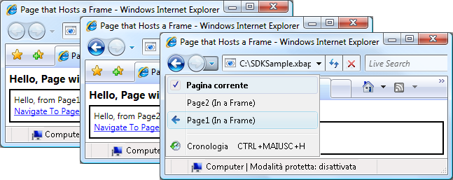  
  
 <xref:System.Windows.Controls.Frame> non deve essere utilizzato soltanto all'interno del contenuto di <xref:System.Windows.Controls.Page>.  Spesso <xref:System.Windows.Controls.Frame> viene anche ospitato all'interno del contenuto di <xref:System.Windows.Window>.  
  
 Per impostazione predefinita, <xref:System.Windows.Controls.Frame> utilizza un journal personalizzato soltanto in assenza di un altro journal.  Se <xref:System.Windows.Controls.Frame> fa parte di un contenuto ospitato all'interno di <xref:System.Windows.Navigation.NavigationWindow> o di un'applicazione [!INCLUDE[TLA2#tla_xbap](../../../../includes/tla2sharptla-xbap-md.md)], <xref:System.Windows.Controls.Frame> utilizza il journal appartenente a <xref:System.Windows.Navigation.NavigationWindow> o all'applicazione [!INCLUDE[TLA2#tla_xbap](../../../../includes/tla2sharptla-xbap-md.md)]. Talvolta però è necessario che <xref:System.Windows.Controls.Frame> gestisca un journal personalizzato.  Una ragione potrebbe essere la necessità di consentire la navigazione nel journal all'interno delle pagine ospitate da <xref:System.Windows.Controls.Frame>,  come illustrato nella figura che segue.  
  
 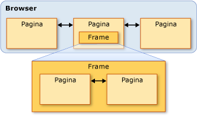  
  
 In questo caso, è possibile configurare <xref:System.Windows.Controls.Frame> per l'utilizzo di un journal personalizzato impostando la proprietà <xref:System.Windows.Controls.Frame.JournalOwnership%2A> di <xref:System.Windows.Controls.Frame> su <xref:System.Windows.Navigation.JournalOwnership>,  come illustrato nel markup che segue.  
  
 [!code-xml[NavigationOverviewSnippets#FrameHostPageOwnJournalXAML1](../../../../samples/snippets/csharp/VS_Snippets_Wpf/NavigationOverviewSnippets/CSharp/FrameHostPageOwnJournal.xaml#framehostpageownjournalxaml1)]  
[!code-xml[NavigationOverviewSnippets#FrameHostPageOwnJournalXAML2](../../../../samples/snippets/csharp/VS_Snippets_Wpf/NavigationOverviewSnippets/CSharp/FrameHostPageOwnJournal.xaml#framehostpageownjournalxaml2)]  
[!code-xml[NavigationOverviewSnippets#FrameHostPageOwnJournalXAML3](../../../../samples/snippets/csharp/VS_Snippets_Wpf/NavigationOverviewSnippets/CSharp/FrameHostPageOwnJournal.xaml#framehostpageownjournalxaml3)]  
  
 Nella figura seguente viene illustrato l'effetto della navigazione all'interno di un oggetto <xref:System.Windows.Controls.Frame> che utilizza un journal personalizzato.  
  
 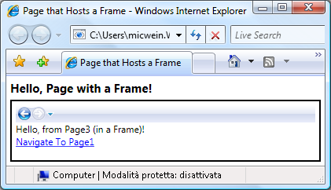  
  
 Le voci del journal vengono visualizzate dall'[!INCLUDE[TLA2#tla_ui](../../../../includes/tla2sharptla-ui-md.md)] di navigazione di <xref:System.Windows.Controls.Frame> anziché da [!INCLUDE[TLA2#tla_ie](../../../../includes/tla2sharptla-ie-md.md)].  
  
> [!NOTE]
>  Se <xref:System.Windows.Controls.Frame> fa parte di un contenuto ospitato in <xref:System.Windows.Window>, <xref:System.Windows.Controls.Frame> utilizza un journal personalizzato e, di conseguenza, visualizza un'[!INCLUDE[TLA2#tla_ui](../../../../includes/tla2sharptla-ui-md.md)] di navigazione personalizzata.  
  
 Se l'esperienza utente lo richiede, è possibile fare in modo che <xref:System.Windows.Controls.Frame> fornisca un journal personalizzato senza visualizzare l'[!INCLUDE[TLA2#tla_ui](../../../../includes/tla2sharptla-ui-md.md)] di navigazione, nascondendo l'[!INCLUDE[TLA2#tla_ui](../../../../includes/tla2sharptla-ui-md.md)] mediante impostazione di <xref:System.Windows.Controls.Frame.NavigationUIVisibility%2A> su <xref:System.Windows.Visibility>,  come illustrato nel markup che segue.  
  
 [!code-xml[NavigationOverviewSnippets#FrameHostPageHidesUIXAML1](../../../../samples/snippets/csharp/VS_Snippets_Wpf/NavigationOverviewSnippets/CSharp/FrameHostPageOwnHiddenJournal.xaml#framehostpagehidesuixaml1)]  
[!code-xml[NavigationOverviewSnippets#FrameHostPageHidesUIXAML2](../../../../samples/snippets/csharp/VS_Snippets_Wpf/NavigationOverviewSnippets/CSharp/FrameHostPageOwnHiddenJournal.xaml#framehostpagehidesuixaml2)]  
[!code-xml[NavigationOverviewSnippets#FrameHostPageHidesUIXAML3](../../../../samples/snippets/csharp/VS_Snippets_Wpf/NavigationOverviewSnippets/CSharp/FrameHostPageOwnHiddenJournal.xaml#framehostpagehidesuixaml3)]  
  
   
## Host di navigazione  
 <xref:System.Windows.Controls.Frame> e <xref:System.Windows.Navigation.NavigationWindow> sono classi note come host di navigazione.  Un *host di navigazione* è una classe in grado di spostarsi su un contenuto e visualizzarlo.  A tal proposito, ogni host di navigazione utilizza <xref:System.Windows.Navigation.NavigationService> e journal personalizzati.  Nella figura che segue viene illustrata la costruzione di base di un host di navigazione.  
  
   
  
 Essenzialmente, questa costruzione consente a <xref:System.Windows.Navigation.NavigationWindow> e a <xref:System.Windows.Controls.Frame> di fornire lo stesso supporto per la navigazione fornito da un'applicazione [!INCLUDE[TLA2#tla_xbap](../../../../includes/tla2sharptla-xbap-md.md)] ospitata nel browser.  
  
 Oltre a utilizzare <xref:System.Windows.Navigation.NavigationService> e un journal, gli host di navigazione implementano gli stessi membri implementati da <xref:System.Windows.Navigation.NavigationService>,  come illustrato nella figura che segue.  
  
 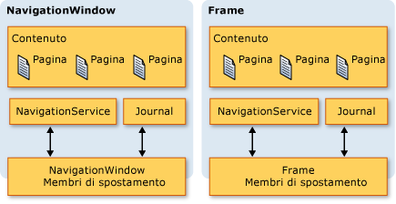  
  
 Ciò consente di programmare un supporto specifico per la navigazione.  È bene tenere presente quanto detto nel caso in cui si desideri fornire un'[!INCLUDE[TLA2#tla_ui](../../../../includes/tla2sharptla-ui-md.md)] di navigazione personalizzata per un oggetto <xref:System.Windows.Controls.Frame> ospitato in <xref:System.Windows.Window>. Entrambi i tipi inoltre implementano membri aggiuntivi, correlati alla navigazione, tra cui `BackStack` \(<xref:System.Windows.Navigation.NavigationWindow.BackStack%2A?displayProperty=fullName>, <xref:System.Windows.Controls.Frame.BackStack%2A?displayProperty=fullName>\) e `ForwardStack` \(<xref:System.Windows.Navigation.NavigationWindow.ForwardStack%2A?displayProperty=fullName>, <xref:System.Windows.Controls.Frame.ForwardStack%2A?displayProperty=fullName>\), che consentono di enumerare le voci del journal rispettivamente nello stack indietro e nello stack avanti.  
  
 Come detto in precedenza, all'interno di un'applicazione possono essere presenti più journal.  Nella figura seguente viene fornito un esempio in proposito.  
  
   
  
   
## Navigazione su contenuto diverso dalle pagine XAML  
 In questo argomento sono stati utilizzati <xref:System.Windows.Controls.Page> e le applicazioni [!INCLUDE[TLA2#tla_xbap#plural](../../../../includes/tla2sharptla-xbapsharpplural-md.md)] di tipo pack per illustrare le varie funzionalità di navigazione di [!INCLUDE[TLA2#tla_wpf](../../../../includes/tla2sharptla-wpf-md.md)].  Tuttavia, un oggetto <xref:System.Windows.Controls.Page> compilato in un'applicazione non è l'unico tipo di contenuto sul quale ci si può spostare, così come le applicazioni [!INCLUDE[TLA2#tla_xbap#plural](../../../../includes/tla2sharptla-xbapsharpplural-md.md)] di tipo pack non rappresentano l'unico modo per identificare il contenuto.  
  
 Come illustrato in questa sezione, è anche possibile spostarsi su file [!INCLUDE[TLA2#tla_xaml](../../../../includes/tla2sharptla-xaml-md.md)] separati, file [!INCLUDE[TLA2#tla_html](../../../../includes/tla2sharptla-html-md.md)] e oggetti.  
  
   
### Navigazione su file XAML separati  
 Un file [!INCLUDE[TLA2#tla_xaml](../../../../includes/tla2sharptla-xaml-md.md)] separato è un file con le seguenti caratteristiche:  
  
-   Contiene solo [!INCLUDE[TLA2#tla_xaml](../../../../includes/tla2sharptla-xaml-md.md)] e non codice.  
  
-   Possiede una dichiarazione dello spazio dei nomi appropriata.  
  
-   Possiede l'estensione XAML.  
  
 Si consideri ad esempio il contenuto seguente archiviato come file [!INCLUDE[TLA2#tla_xaml](../../../../includes/tla2sharptla-xaml-md.md)] separato, Person.xaml.  
  
 [!code-xml[NavigationOverviewSnippets#LooseXAML](../../../../samples/snippets/csharp/VS_Snippets_Wpf/NavigationOverviewSnippets/CSharp/Person.xaml#loosexaml)]  
  
 Facendo doppio clic sul file, il browser si apre e si sposta sul contenuto visualizzandolo,  come illustrato nella figura che segue.  
  
 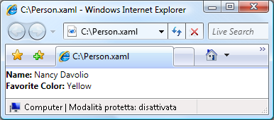  
  
 È possibile visualizzare un file [!INCLUDE[TLA2#tla_xaml](../../../../includes/tla2sharptla-xaml-md.md)] separato da:  
  
-   Un sito Web sul computer locale, Intranet o Internet.  
  
-   Una condivisione file [!INCLUDE[TLA#tla_unc](../../../../includes/tlasharptla-unc-md.md)].  
  
-   Il disco locale.  
  
 Un file [!INCLUDE[TLA2#tla_xaml](../../../../includes/tla2sharptla-xaml-md.md)] separato può essere aggiunto all'elenco Preferiti del browser oppure può essere la pagina iniziale del browser.  
  
> [!NOTE]
>  Per ulteriori informazioni sulla pubblicazione e l'avvio di pagine [!INCLUDE[TLA2#tla_xaml](../../../../includes/tla2sharptla-xaml-md.md)] separate, vedere [Distribuzione di un'applicazione WPF](../../../../docs/framework/wpf/app-development/deploying-a-wpf-application-wpf.md).  
  
 [!INCLUDE[TLA2#tla_xaml](../../../../includes/tla2sharptla-xaml-md.md)] separato comporta una limitazione, ossia consente di ospitare solo contenuto eseguibile senza rischi in attendibilità parziale.  Ad esempio, `Window` non può essere l'elemento radice di un file [!INCLUDE[TLA2#tla_xaml](../../../../includes/tla2sharptla-xaml-md.md)] separato.  Per ulteriori informazioni, vedere [Sicurezza con attendibilità parziale in WPF](../../../../docs/framework/wpf/wpf-partial-trust-security.md).  
  
   
### Navigazione ai file HTML utilizzando frame  
 Come previsto, è anche possibile spostarsi su file [!INCLUDE[TLA2#tla_html](../../../../includes/tla2sharptla-html-md.md)].  Occorre semplicemente fornire un [!INCLUDE[TLA2#tla_uri](../../../../includes/tla2sharptla-uri-md.md)] che utilizza lo schema HTTP.  Ad esempio, nel seguente codice [!INCLUDE[TLA2#tla_xaml](../../../../includes/tla2sharptla-xaml-md.md)] viene illustrato un oggetto <xref:System.Windows.Controls.Frame> che si sposta su una pagina [!INCLUDE[TLA2#tla_html](../../../../includes/tla2sharptla-html-md.md)].  
  
 [!code-xml[NavigationOverviewSnippets#FrameHtmlNavMARKUP](../../../../samples/snippets/csharp/VS_Snippets_Wpf/NavigationOverviewSnippets/CSharp/FrameHTMLNavPage.xaml#framehtmlnavmarkup)]  
  
 La navigazione su [!INCLUDE[TLA2#tla_html](../../../../includes/tla2sharptla-html-md.md)] necessita di particolari autorizzazioni.  Non è ad esempio possibile effettuare la navigazione da un'applicazione [!INCLUDE[TLA2#tla_xbap](../../../../includes/tla2sharptla-xbap-md.md)] in esecuzione nella sandbox di sicurezza con attendibilità parziale dell'area Internet. Per ulteriori informazioni, vedere [Sicurezza con attendibilità parziale in WPF](../../../../docs/framework/wpf/wpf-partial-trust-security.md).  
  
   
### Navigazione ai file HTML tramite il controllo WebBrowser  
 Il controllo <xref:System.Windows.Controls.WebBrowser> supporta l'hosting di documenti [!INCLUDE[TLA2#tla_html](../../../../includes/tla2sharptla-html-md.md)], la navigazione e l'interoperabilità fra script e codice gestito.  Per informazioni dettagliate sul controllo <xref:System.Windows.Controls.WebBrowser>, vedere <xref:System.Windows.Controls.WebBrowser>.  
  
 Come per <xref:System.Windows.Controls.Frame>, la navigazione a [!INCLUDE[TLA2#tla_html](../../../../includes/tla2sharptla-html-md.md)] utilizzando <xref:System.Windows.Controls.WebBrowser> richiede autorizzazioni speciali.  Ad esempio, da un'applicazione parzialmente attendibile, è possibile passare solo a [!INCLUDE[TLA2#tla_html](../../../../includes/tla2sharptla-html-md.md)] ubicato presso il sito di origine.  Per ulteriori informazioni, vedere [Sicurezza con attendibilità parziale in WPF](../../../../docs/framework/wpf/wpf-partial-trust-security.md).  
  
   
### Navigazione su oggetti personalizzati  
 Per visualizzare dati archiviati come oggetti personalizzati, è possibile creare un oggetto <xref:System.Windows.Controls.Page> con un contenuto associato a tali oggetti \(vedere [Cenni preliminari sull'associazione dati](../../../../docs/framework/wpf/data/data-binding-overview.md)\).  Se invece si preferisce evitare di creare un'intera pagina al solo scopo di visualizzare gli oggetti, è possibile spostarsi direttamente su di essi.  
  
 Si consideri la classe `Person` implementata nel codice che segue.  
  
 [!code-csharp[NavigateToObjectSnippets#PersonClassCODE](../../../../samples/snippets/csharp/VS_Snippets_Wpf/NavigateToObjectSnippets/CSharp/Person.cs#personclasscode)]
 [!code-vb[NavigateToObjectSnippets#PersonClassCODE](../../../../samples/snippets/visualbasic/VS_Snippets_Wpf/NavigateToObjectSnippets/VisualBasic/Person.vb#personclasscode)]  
  
 Per spostarsi su di essa, chiamare il metodo <xref:System.Windows.Navigation.NavigationWindow.Navigate%2A?displayProperty=fullName>, come illustrato nel codice che segue.  
  
 [!code-xml[NavigateToObjectSnippets#PageThatNavsToObject1](../../../../samples/snippets/csharp/VS_Snippets_Wpf/NavigateToObjectSnippets/CSharp/HomePage.xaml#pagethatnavstoobject1)]  
[!code-xml[NavigateToObjectSnippets#PageThatNavsToObject2](../../../../samples/snippets/csharp/VS_Snippets_Wpf/NavigateToObjectSnippets/CSharp/HomePage.xaml#pagethatnavstoobject2)]  
[!code-xml[NavigateToObjectSnippets#PageThatNavsToObject3](../../../../samples/snippets/csharp/VS_Snippets_Wpf/NavigateToObjectSnippets/CSharp/HomePage.xaml#pagethatnavstoobject3)]  
  
 [!code-csharp[NavigateToObjectSnippets#PageThatNavsToObjectCODEBEHIND](../../../../samples/snippets/csharp/VS_Snippets_Wpf/NavigateToObjectSnippets/CSharp/HomePage.xaml.cs#pagethatnavstoobjectcodebehind)]
 [!code-vb[NavigateToObjectSnippets#PageThatNavsToObjectCODEBEHIND](../../../../samples/snippets/visualbasic/VS_Snippets_Wpf/NavigateToObjectSnippets/VisualBasic/HomePage.xaml.vb#pagethatnavstoobjectcodebehind)]  
  
 Nella figura riportata di seguito viene illustrato il risultato.  
  
 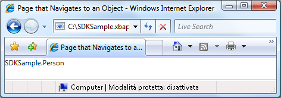  
  
 Da questa figura risulta evidente come non vengano visualizzati elementi utili.  Infatti, il valore visualizzato è il valore restituito del metodo `ToString` per l'oggetto **Person**. Per impostazione predefinita, questo è l'unico valore utilizzabile da [!INCLUDE[TLA2#tla_wpf](../../../../includes/tla2sharptla-wpf-md.md)] per rappresentare l'oggetto.  È possibile eseguire l'override del metodo `ToString` per restituire informazioni più significative, benché si ottenga comunque un valore stringa.  Una tecnica che sfrutta le funzionalità di presentazione di [!INCLUDE[TLA2#tla_wpf](../../../../includes/tla2sharptla-wpf-md.md)] consiste nell'utilizzo di un modello di dati.  È possibile implementare un modello di dati che verrà associato da [!INCLUDE[TLA2#tla_wpf](../../../../includes/tla2sharptla-wpf-md.md)] a un oggetto di un particolare tipo.  Nel codice riportato di seguito viene illustrato un modello di dati per l'oggetto `Person`.  
  
 [!code-xml[NavigateToObjectSnippets#DataTemplateMARKUP](../../../../samples/snippets/csharp/VS_Snippets_Wpf/NavigateToObjectSnippets/CSharp/App.xaml#datatemplatemarkup)]  
  
 In questo caso il modello di dati viene associato al tipo `Person` utilizzando l'estensione di markup `x:Type` nell'attributo `DataType`.  Il modello di dati associa quindi gli elementi `TextBlock` \(vedere <xref:System.Windows.Controls.TextBlock>\) alle proprietà della classe `Person`.  Nella figura seguente viene illustrato l'aspetto aggiornato dell'oggetto `Person`.  
  
 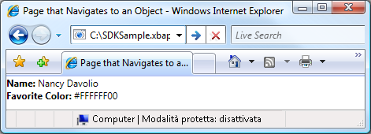  
  
 Un vantaggio di questa tecnica è dato dalla coerenza: il modello di dati può infatti essere riutilizzato per visualizzare gli oggetti in modo coerente nell'intero ambito dell'applicazione.  
  
 Per ulteriori informazioni sui modelli di dati, vedere [Cenni preliminari sui modelli di dati](../../../../docs/framework/wpf/data/data-templating-overview.md).  
  
   
## Sicurezza  
 Il supporto per la navigazione di [!INCLUDE[TLA2#tla_wpf](../../../../includes/tla2sharptla-wpf-md.md)] consente di spostarsi sulle applicazioni [!INCLUDE[TLA2#tla_xbap#plural](../../../../includes/tla2sharptla-xbapsharpplural-md.md)] attraverso Internet. Grazie a questo supporto, inoltre, le applicazioni possono ospitare contenuto di terze parti.  Per proteggere le applicazioni e gli utenti da comportamenti dannosi, [!INCLUDE[TLA2#tla_wpf](../../../../includes/tla2sharptla-wpf-md.md)] fornisce diverse funzionalità di sicurezza, illustrate in [Sicurezza](../../../../docs/framework/wpf/security-wpf.md) e [Sicurezza con attendibilità parziale in WPF](../../../../docs/framework/wpf/wpf-partial-trust-security.md).  
  
## Vedere anche  
 <xref:System.Windows.Application.SetCookie%2A>   
 <xref:System.Windows.Application.GetCookie%2A>   
 [Cenni preliminari sulla gestione di applicazioni](../../../../docs/framework/wpf/app-development/application-management-overview.md)   
 [URI di tipo pack in WPF](../../../../docs/framework/wpf/app-development/pack-uris-in-wpf.md)   
 [Cenni preliminari sulla navigazione strutturata](../../../../docs/framework/wpf/app-development/structured-navigation-overview.md)   
 [Cenni preliminari sulle topologie di navigazione](../../../../docs/framework/wpf/app-development/navigation-topologies-overview.md)   
 [Procedure relative](../../../../docs/framework/wpf/app-development/navigation-how-to-topics.md)   
 [Distribuzione di un'applicazione WPF](../../../../docs/framework/wpf/app-development/deploying-a-wpf-application-wpf.md)