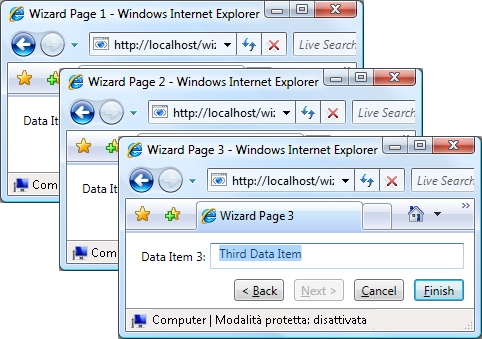
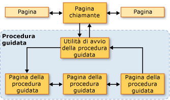
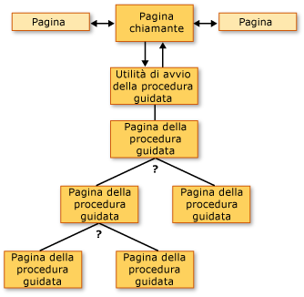
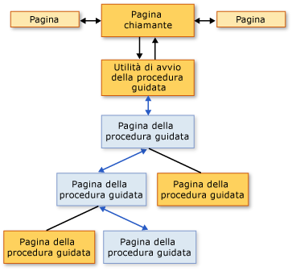
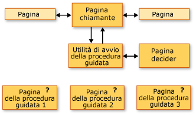
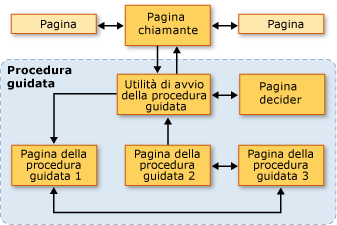

# Cenni preliminari sulle topologie di navigazione
 In questi cenni preliminari viene fornita un'introduzione alle topologie di navigazione in [!INCLUDE[TLA2#tla_wpf](../../../../includes/tla2sharptla-wpf-md.md)].  Di seguito vengono analizzate tre topologie di navigazione comuni, con i relativi esempi.  
  
> [!NOTE]
>  Prima di leggere questo argomento, è importante conoscere il concetto di navigazione strutturato in [!INCLUDE[TLA2#tla_wpf](../../../../includes/tla2sharptla-wpf-md.md)] tramite funzioni di pagina.  Per ulteriori informazioni su entrambi gli argomenti, vedere [Cenni preliminari sulla navigazione strutturata](../../../../docs/framework/wpf/app-development/structured-navigation-overview.md).  
  
 Di seguito sono elencate le diverse sezioni di questo argomento:  
  
-   [Topologie di navigazione](#Navigation_Topologies)  
  
-   [Topologie di navigazione strutturate](#Structured_Navigation_Topologies)  
  
-   [Navigazione in una topologia lineare fissa](#Navigation_over_a_Fixed_Linear_Topology)  
  
-   [Navigazione dinamica in una topologia gerarchica fissa](#Dynamic_Navigation_over_a_Fixed_Hierarchical_Topology)  
  
-   [Navigazione in una topologia generata dinamicamente](#Navigation_over_a_Dynamically_Generated_Topology)  
  
   
## Topologie di navigazione  
 In [!INCLUDE[TLA2#tla_wpf](../../../../includes/tla2sharptla-wpf-md.md)], la navigazione viene effettuata in genere in pagine \(<xref:System.Windows.Controls.Page>\) con collegamenti ipertestuali \(<xref:System.Windows.Documents.Hyperlink>\) che consentono di passare ad altre pagine quando si fa clic su di essi.  Le pagine in cui ci si sposta sono identificate da [!INCLUDE[TLA#tla_uri#plural](../../../../includes/tlasharptla-urisharpplural-md.md)] \(vedere [URI di tipo pack in WPF](../../../../docs/framework/wpf/app-development/pack-uris-in-wpf.md)\).  Nel semplice esempio riportato di seguito vengono illustrate pagine, collegamenti ipertestuali e [!INCLUDE[TLA#tla_uri#plural](../../../../includes/tlasharptla-urisharpplural-md.md)]:  
  
 [!code-xml[NavigationTopologiesOverviewSnippets#Page1](../../../../samples/snippets/csharp/VS_Snippets_Wpf/NavigationTopologiesOverviewSnippets/CS/Page1.xaml#page1)]  
  
 [!code-xml[NavigationTopologiesOverviewSnippets#Page2](../../../../samples/snippets/csharp/VS_Snippets_Wpf/NavigationTopologiesOverviewSnippets/CS/Page2.xaml#page2)]  
  
 Queste pagine sono disposte in una *topologia di navigazione* la cui struttura è determinata dalla modalità di navigazione tra le pagine.  Questa particolare topologia di navigazione è adatta a scenari semplici, sebbene la navigazione possa richiedere topologie più complesse, alcune delle quali possono essere definite solo quando un'applicazione è in esecuzione.  
  
 In questo argomento vengono analizzate tre topologie di navigazione comuni: *lineare fissa*, *gerarchica fissa* e *generata dinamicamente*.  Per ogni topologia di navigazione viene fornito un esempio con un'[!INCLUDE[TLA2#tla_ui](../../../../includes/tla2sharptla-ui-md.md)] analoga a quella illustrata nella figura seguente:  
  
   
  
   
## Topologie di navigazione strutturate  
 Esistono due tipi di topologie di navigazione:  
  
-   **Topologia fissa**: viene definita in fase di compilazione e non viene modificata in fase di esecuzione.  Le topologie fisse sono utili per la navigazione in una sequenza fissa di pagine con un ordine lineare o gerarchico.  
  
-   **Topologia dinamica**: viene definita in fase di esecuzione in base a input raccolto dall'utente, dall'applicazione o dal sistema.  Le topologie dinamiche sono utili quando è possibile spostarsi tra le pagine in sequenze diverse.  
  
 Benché sia possibile creare topologie di navigazione utilizzando le pagine, negli esempi vengono utilizzate funzioni di pagina poiché offrono un supporto aggiuntivo che semplifica le operazioni di passaggio e di restituzione dei dati attraverso le pagine di una topologia.  
  
   
## Navigazione in una topologia lineare fissa  
 Una topologia lineare fissa è analoga alla struttura di una procedura guidata composta da una o più pagine in cui è possibile spostarsi in una sequenza fissa.  Nella figura riportata di seguito viene visualizzata la struttura di livello elevato e il flusso di una procedura guidata con una topologia lineare fissa.  
  
   
  
 I comportamenti tipici per lo spostamento in una topologia lineare fissa sono i seguent:  
  
-   Spostamento dalla pagina chiamante alla pagina di avvio che inizializza la procedura guidata e consente di passare alla prima pagina della procedura.  La pagina di avvio \(<xref:System.Windows.Navigation.PageFunction%601> senza [!INCLUDE[TLA2#tla_ui](../../../../includes/tla2sharptla-ui-md.md)]\) non è obbligatoria, poiché è possibile chiamare la prima pagina della procedura guidata direttamente dalla pagina chiamante.  Tuttavia, l'utilizzo di una pagina di avvio può semplificare l'inizializzazione della procedura guidata, in particolare se tale operazione è complessa.  
  
-   Gli utenti possono spostarsi tra le pagine utilizzando i pulsanti, o collegamenti ipertestuali, Avanti e Indietro.  
  
-   Gli utenti possono spostarsi tra le pagine utilizzando il journal.  
  
-   Gli utenti possono annullare la procedura guidata da qualsiasi pagina scegliendo il pulsante Annulla.  
  
-   Gli utenti possono accettare la procedura guidata sull'ultima pagina scegliendo il pulsante Fine.  
  
-   Se una procedura guidata viene annullata, restituisce un risultato appropriato e non restituisce dati.  
  
-   Se una procedura guidata viene accettata, tale procedura restituisce un risultato appropriato e i dati raccolti.  
  
-   Al completamento della procedura guidata \(accettata o annullata\), le pagine incluse nella procedura guidata vengono rimosse dal journal.  In questo modo ogni istanza della procedura guidata viene isolata, evitando potenziali anomalie dei dati o dello stato.  
  
   
## Navigazione dinamica in una topologia gerarchica fissa  
 In alcune applicazioni, è possibile navigare dalle pagine in due o più altre pagine, come illustrato nella figura seguente.  
  
   
  
 Questa struttura è nota come topologia gerarchica fissa e la sequenza nella quale viene attraversata la gerarchia è spesso determinata in fase di esecuzione dall'applicazione o dall'utente.  In fase di esecuzione, in ogni pagina della gerarchia che consente la navigazione a due o più altre pagine vengono raccolti i dati necessari a determinare in quale pagina spostarsi.  Nella figura riportata di seguito viene illustrata una delle numerose sequenze di navigazione possibili in base alla figura precedente.  
  
   
  
 Anche se la sequenza delle pagine in cui ci si sposta in una struttura gerarchica fissa viene determinata in fase di esecuzione, l'esperienza utente è uguale a quella di una topologia lineare fissa:  
  
-   Spostamento dalla pagina chiamante alla pagina di avvio che inizializza la procedura guidata e consente di passare alla prima pagina della procedura.  La pagina di avvio \(<xref:System.Windows.Navigation.PageFunction%601> senza [!INCLUDE[TLA2#tla_ui](../../../../includes/tla2sharptla-ui-md.md)]\) non è obbligatoria, poiché è possibile chiamare la prima pagina della procedura guidata direttamente dalla pagina chiamante.  Tuttavia, l'utilizzo di una pagina di avvio può semplificare l'inizializzazione della procedura guidata, in particolare se tale operazione è complessa.  
  
-   Gli utenti possono spostarsi tra le pagine utilizzando i pulsanti, o collegamenti ipertestuali, Avanti e Indietro.  
  
-   Gli utenti possono spostarsi tra le pagine utilizzando il journal.  
  
-   Gli utenti possono modificare la sequenza di navigazione se si spostano all'indietro nel journal.  
  
-   Gli utenti possono annullare la procedura guidata da qualsiasi pagina scegliendo il pulsante Annulla.  
  
-   Gli utenti possono accettare la procedura guidata sull'ultima pagina scegliendo il pulsante Fine.  
  
-   Se una procedura guidata viene annullata, restituisce un risultato appropriato e non restituisce dati.  
  
-   Se una procedura guidata viene accettata, tale procedura restituisce un risultato appropriato e i dati raccolti.  
  
-   Al completamento della procedura guidata \(accettata o annullata\), le pagine incluse nella procedura guidata vengono rimosse dal journal.  In questo modo ogni istanza della procedura guidata viene isolata, evitando potenziali anomalie dei dati o dello stato.  
  
   
## Navigazione in una topologia generata dinamicamente  
 In alcune applicazioni, la sequenza in cui ci si sposta su due o più pagine può essere determinata solo in fase di esecuzione dall'utente, dall'applicazione o da dati esterni.  Nella figura riportata di seguito viene illustrato un insieme di pagine con una sequenza di navigazione indeterminata.  
  
   
  
 Nella figura successiva viene illustrata una sequenza di navigazione scelta dall'utente in fase di esecuzione.  
  
   
  
 La sequenza di navigazione è nota come topologia generata dinamicamente.  L'esperienza utente è la stessa delle topologie di navigazione descritte in precedenza:  
  
-   Spostamento dalla pagina chiamante alla pagina di avvio che inizializza la procedura guidata e consente di passare alla prima pagina della procedura.  La pagina di avvio \(<xref:System.Windows.Navigation.PageFunction%601> senza [!INCLUDE[TLA2#tla_ui](../../../../includes/tla2sharptla-ui-md.md)]\) non è obbligatoria, poiché è possibile chiamare la prima pagina della procedura guidata direttamente dalla pagina chiamante.  Tuttavia, l'utilizzo di una pagina di avvio può semplificare l'inizializzazione della procedura guidata, in particolare se tale operazione è complessa.  
  
-   Gli utenti possono spostarsi tra le pagine utilizzando i pulsanti, o collegamenti ipertestuali, Avanti e Indietro.  
  
-   Gli utenti possono spostarsi tra le pagine utilizzando il journal.  
  
-   Gli utenti possono annullare la procedura guidata da qualsiasi pagina scegliendo il pulsante Annulla.  
  
-   Gli utenti possono accettare la procedura guidata sull'ultima pagina scegliendo il pulsante Fine.  
  
-   Se una procedura guidata viene annullata, restituisce un risultato appropriato e non restituisce dati.  
  
-   Se una procedura guidata viene accettata, tale procedura restituisce un risultato appropriato e i dati raccolti.  
  
-   Al completamento della procedura guidata \(accettata o annullata\), le pagine incluse nella procedura guidata vengono rimosse dal journal.  In questo modo ogni istanza della procedura guidata viene isolata, evitando potenziali anomalie dei dati o dello stato.  
  
## Vedere anche  
 <xref:System.Windows.Controls.Page>   
 <xref:System.Windows.Navigation.PageFunction%601>   
 <xref:System.Windows.Navigation.NavigationService>   
 [Cenni preliminari sulla navigazione strutturata](../../../../docs/framework/wpf/app-development/structured-navigation-overview.md)