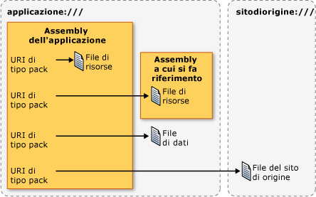

# URI di tipo pack in WPF
In [!INCLUDE[TLA#tla_wpf](../../../../includes/tlasharptla-wpf-md.md)], gli [!INCLUDE[TLA#tla_uri#plural](../../../../includes/tlasharptla-urisharpplural-md.md)] vengono utilizzati per identificare e caricare file in diversi modi, inclusi i seguenti:  
  
-   Specificando l'[!INCLUDE[TLA#tla_ui](../../../../includes/tlasharptla-ui-md.md)] da visualizzare al primo avvio di un'applicazione.  
  
-   Caricando immagini.  
  
-   Spostandosi sulle pagine.  
  
-   Caricando file di dati non eseguibili.  
  
 Inoltre, gli [!INCLUDE[TLA2#tla_uri#plural](../../../../includes/tla2sharptla-urisharpplural-md.md)] possono essere utilizzati per identificare e caricare file da diversi percorsi, inclusi i seguenti:  
  
-   L'assembly corrente.  
  
-   Un assembly a cui si fa riferimento.  
  
-   Un percorso relativo a un assembly.  
  
-   Il sito di origine dell'applicazione.  
  
 Per fornire un meccanismo coerente di identificazione e caricamento di questi tipi di file dai diversi percorsi, [!INCLUDE[TLA2#tla_wpf](../../../../includes/tla2sharptla-wpf-md.md)] sfrutta l'estensibilità dello *schema URI di tipo pack*.  In questo argomento vengono fornite informazioni preliminari sullo schema, viene illustrato come costruire [!INCLUDE[TLA2#tla_uri#plural](../../../../includes/tla2sharptla-urisharpplural-md.md)] di tipo pack per diversi scenari, vengono trattati gli [!INCLUDE[TLA2#tla_uri#plural](../../../../includes/tla2sharptla-urisharpplural-md.md)] assoluti e relativi nonché la risoluzione degli [!INCLUDE[TLA2#tla_uri](../../../../includes/tla2sharptla-uri-md.md)], fino a illustrare come utilizzare gli [!INCLUDE[TLA2#tla_uri#plural](../../../../includes/tla2sharptla-urisharpplural-md.md)] di tipo pack dal markup e dal codice.  
  
   
  
<a name="The_Pack_URI_Scheme"></a>   
## Schema URI di tipo pack  
 Lo schema [!INCLUDE[TLA2#tla_uri](../../../../includes/tla2sharptla-uri-md.md)] di tipo pack viene utilizzato dalla specifica [Open Packaging Conventions](http://go.microsoft.com/fwlink/?LinkID=71255) \(OPC\) \(la pagina potrebbe essere in inglese\), che descrive un modello di organizzazione e identificazione del contenuto.  Gli elementi principali di questo modello sono i package e le parti, dove un *package* è un contenitore logico per una o più *parti* logiche.  Nella figura che segue viene illustrato questo concetto.  
  
   
  
 Per identificare le parti, la specifica OPC sfrutta l'estensibilità dello standard RFC 2396 \(Uniform Resource Identifier \(URI\): Generic Syntax\) per definire lo schema [!INCLUDE[TLA2#tla_uri](../../../../includes/tla2sharptla-uri-md.md)] di tipo pack.  
  
 Lo schema specificato da un [!INCLUDE[TLA2#tla_uri](../../../../includes/tla2sharptla-uri-md.md)] è definito dal prefisso; http, ftp e file sono esempi noti.  Lo schema [!INCLUDE[TLA2#tla_uri](../../../../includes/tla2sharptla-uri-md.md)] di tipo pack utilizza "pack" come schema e contiene due componenti: autorità e percorso.  Di seguito viene riportato il formato di un [!INCLUDE[TLA2#tla_uri](../../../../includes/tla2sharptla-uri-md.md)] di tipo pack.  
  
 pack:\/\/*autorità*\/*percorso*  
  
 L'*autorità* specifica il tipo di package in cui è contenuta una parte, mentre il *percorso* specifica il percorso di una parte all'interno di un package.  
  
 Il concetto è illustrato nella figura che segue:  
  
   
  
 Package e parti possono essere paragonati ad applicazioni e file, dove un'applicazione \(package\) può includere uno o più file \(parti\), inclusi:  
  
-   File di risorse compilati nell'assembly locale.  
  
-   File di risorse compilati in un assembly a cui si fa riferimento.  
  
-   File di risorse compilati in un assembly contenente un riferimento.  
  
-   File di dati.  
  
-   File del sito di origine.  
  
 Per l'accesso a questi tipi di file, [!INCLUDE[TLA2#tla_wpf](../../../../includes/tla2sharptla-wpf-md.md)] supporta due autorità: application:\/\/\/ e siteoforigin:\/\/\/.  L'autorità application:\/\/\/ identifica i file di dati dell'applicazione noti in fase di compilazione, inclusi i file di risorse e i file di dati.  L'autorità siteoforigin:\/\/\/ identifica i file del sito di origine.  Nella figura che segue viene illustrato l'ambito di ciascuna autorità.  
  
   
  
> [!NOTE]
>  Il componente autorità di un [!INCLUDE[TLA2#tla_uri](../../../../includes/tla2sharptla-uri-md.md)] di tipo pack è un [!INCLUDE[TLA2#tla_uri](../../../../includes/tla2sharptla-uri-md.md)] incorporato che punta a un package e deve essere conforme allo standard RFC 2396.  Inoltre, il carattere "\/" deve essere sostituito con il carattere "," e i caratteri riservati quali "%" e "?" devono essere di tipo escape.  Vedere la specifica OPC per i dettagli.  
  
 Nelle sezioni seguenti viene illustrato come costruire [!INCLUDE[TLA2#tla_uri#plural](../../../../includes/tla2sharptla-urisharpplural-md.md)] di tipo pack utilizzando queste due autorità insieme ai percorsi appropriati per l'identificazione dei file di risorse, di dati e del sito di origine.  
  
<a name="Resource_File_Pack_URIs___Local_Assembly"></a>   
## URI di tipo pack per i file di risorse  
 I file di risorse vengono configurati come elementi [!INCLUDE[TLA2#tla_msbuild](../../../../includes/tla2sharptla-msbuild-md.md)] `Resource` e compilati all'interno di assembly.  [!INCLUDE[TLA2#tla_wpf](../../../../includes/tla2sharptla-wpf-md.md)] supporta la costruzione di [!INCLUDE[TLA2#tla_uri#plural](../../../../includes/tla2sharptla-urisharpplural-md.md)] di tipo pack utilizzabili per identificare i file di risorse compilati nell'assembly locale o in un assembly a cui si fa riferimento dall'assembly locale.  
  
<a name="Local_Assembly_Resource_File"></a>   
### File di risorse dell'assembly locale  
 L'[!INCLUDE[TLA2#tla_uri](../../../../includes/tla2sharptla-uri-md.md)] di tipo pack per un file di risorse compilato nell'assembly locale utilizza l'autorità e il percorso seguenti:  
  
-   **Autorità**: application:\/\/\/.  
  
-   **Percorso**: il nome del file di risorse, incluso il percorso relativo alla radice della cartella del progetto dell'assembly locale.  
  
 Nell'esempio seguente viene illustrato l'[!INCLUDE[TLA2#tla_uri](../../../../includes/tla2sharptla-uri-md.md)] di tipo pack per un file di risorse [!INCLUDE[TLA2#tla_xaml](../../../../includes/tla2sharptla-xaml-md.md)] situato nella radice della cartella del progetto dell'assembly locale.  
  
 `pack://application:,,,/ResourceFile.xaml`  
  
 Nell'esempio seguente viene illustrato l'[!INCLUDE[TLA2#tla_uri](../../../../includes/tla2sharptla-uri-md.md)] di tipo pack per un file di risorse [!INCLUDE[TLA2#tla_xaml](../../../../includes/tla2sharptla-xaml-md.md)] situato in una sottocartella della cartella del progetto dell'assembly locale.  
  
 `pack://application:,,,/Subfolder/ResourceFile.xaml`  
  
<a name="Resource_File_Pack_URIs___Referenced_Assembly"></a>   
### File di risorse dell'assembly a cui si fa riferimento  
 L'[!INCLUDE[TLA2#tla_uri](../../../../includes/tla2sharptla-uri-md.md)] di tipo pack per un file di risorse compilato in un assembly a cui si fa riferimento utilizza l'autorità e il percorso seguenti:  
  
-   **Autorità**: application:\/\/\/.  
  
-   **Percorso**: il nome di un file di risorse compilato in un assembly a cui si fa riferimento.  Il percorso deve rispettare il formato seguente:  
  
     *NomeBreveAssembly*\[*;Versione*\]\[*;ChiavePubblica*\];component\/*Percorso*  
  
    -   **NomeBreveAssembly**: nome breve dell'assembly a cui si fa riferimento.  
  
    -   **;Versione** \[facoltativo\]: versione dell'assembly a cui si fa riferimento contenente il file di risorse.  Viene utilizzato in caso di caricamento di due o più assembly a cui si fa riferimento aventi lo stesso nome breve.  
  
    -   **;ChiavePubblica** \[facoltativo\]: chiave pubblica utilizzata per firmare l'assembly a cui si fa riferimento.  Viene utilizzato in caso di caricamento di due o più assembly a cui si fa riferimento aventi lo stesso nome breve.  
  
    -   **;component**: specifica che il riferimento all'assembly avviene dall'assembly locale.  
  
    -   **\/Percorso**: nome del file di risorse, incluso il percorso relativo alla radice della cartella del progetto dell'assembly a cui si fa riferimento.  
  
 Nell'esempio seguente viene illustrato l'[!INCLUDE[TLA2#tla_uri](../../../../includes/tla2sharptla-uri-md.md)] di tipo pack per un file di risorse [!INCLUDE[TLA2#tla_xaml](../../../../includes/tla2sharptla-xaml-md.md)] situato nella radice della cartella del progetto dell'assembly a cui si fa riferimento.  
  
 `pack://application:,,,/ReferencedAssembly;component/ResourceFile.xaml`  
  
 Nell'esempio seguente viene illustrato l'[!INCLUDE[TLA2#tla_uri](../../../../includes/tla2sharptla-uri-md.md)] di tipo pack per un file di risorse [!INCLUDE[TLA2#tla_xaml](../../../../includes/tla2sharptla-xaml-md.md)] situato in una sottocartella della cartella del progetto dell'assembly a cui si fa riferimento.  
  
 `pack://application:,,,/ReferencedAssembly;component/Subfolder/ResourceFile.xaml`  
  
 Nell'esempio seguente viene illustrato l'[!INCLUDE[TLA2#tla_uri](../../../../includes/tla2sharptla-uri-md.md)] di tipo pack per un file di risorse [!INCLUDE[TLA2#tla_xaml](../../../../includes/tla2sharptla-xaml-md.md)] situato nella cartella radice della cartella del progetto di un assembly specifico della versione, a cui si fa riferimento.  
  
 `pack://application:,,,/ReferencedAssembly;v1.0.0.1;component/ResourceFile.xaml`  
  
 La sintassi dell'[!INCLUDE[TLA2#tla_uri](../../../../includes/tla2sharptla-uri-md.md)] di tipo pack per i file di risorse dell'assembly a cui si fa riferimento può essere utilizzata soltanto con l'autorità application:\/\/\/.  L'utilizzo di un'autorità diversa, come nell'esempio che segue, non è supportato in [!INCLUDE[TLA2#tla_wpf](../../../../includes/tla2sharptla-wpf-md.md)].  
  
 `pack://siteoforigin:,,,/SomeAssembly;component/ResourceFile.xaml`  
  
<a name="Content_File_Pack_URIs"></a>   
## URI di tipo pack per i file di dati  
 L'[!INCLUDE[TLA2#tla_uri](../../../../includes/tla2sharptla-uri-md.md)] di tipo pack per un file di dati utilizza l'autorità e il percorso seguenti:  
  
-   **Autorità**: application:\/\/\/.  
  
-   **Percorso**: nome del file di dati, incluso il percorso relativo al file system dell'assembly eseguibile principale dell'applicazione.  
  
 Nell'esempio seguente viene illustrato l'[!INCLUDE[TLA2#tla_uri](../../../../includes/tla2sharptla-uri-md.md)] di tipo pack per un file di dati [!INCLUDE[TLA2#tla_xaml](../../../../includes/tla2sharptla-xaml-md.md)], situato nella stessa cartella dell'assembly eseguibile.  
  
 `pack://application:,,,/ContentFile.xaml`  
  
 Nell'esempio seguente viene illustrato l'[!INCLUDE[TLA2#tla_uri](../../../../includes/tla2sharptla-uri-md.md)] di tipo pack per un file di dati [!INCLUDE[TLA2#tla_xaml](../../../../includes/tla2sharptla-xaml-md.md)], situato in una sottocartella relativa all'assembly eseguibile dell'applicazione.  
  
 `pack://application:,,,/Subfolder/ContentFile.xaml`  
  
> [!NOTE]
>  Non è possibile spostarsi su file di dati [!INCLUDE[TLA2#tla_html](../../../../includes/tla2sharptla-html-md.md)].  Lo schema [!INCLUDE[TLA2#tla_uri](../../../../includes/tla2sharptla-uri-md.md)] supporta unicamente la navigazione in file [!INCLUDE[TLA2#tla_html](../../../../includes/tla2sharptla-html-md.md)] che si trovano nel sito di origine.  
  
<a name="The_siteoforigin_____Authority"></a>   
## URI di tipo pack per il sito di origine  
 L'[!INCLUDE[TLA2#tla_uri](../../../../includes/tla2sharptla-uri-md.md)] di tipo pack per un file del sito di origine utilizza l'autorità e il percorso seguenti:  
  
-   **Autorità**: siteoforigin:\/\/\/.  
  
-   **Percorso**: nome del file del sito di origine, incluso il percorso da cui è stato avviato l'assembly eseguibile.  
  
 Nell'esempio seguente viene illustrato l'[!INCLUDE[TLA2#tla_uri](../../../../includes/tla2sharptla-uri-md.md)] di tipo pack per un file del sito di origine [!INCLUDE[TLA2#tla_xaml](../../../../includes/tla2sharptla-xaml-md.md)], archiviato nel percorso dal quale viene avviato l'assembly eseguibile.  
  
 `pack://siteoforigin:,,,/SiteOfOriginFile.xaml`  
  
 Nell'esempio seguente viene illustrato l'[!INCLUDE[TLA2#tla_uri](../../../../includes/tla2sharptla-uri-md.md)] di tipo pack per un file del sito di origine [!INCLUDE[TLA2#tla_xaml](../../../../includes/tla2sharptla-xaml-md.md)], archiviato in una sottocartella relativa al percorso dal quale viene avviato l'assembly eseguibile dell'applicazione.  
  
 `pack://siteoforigin:,,,/Subfolder/SiteOfOriginFile.xaml`  
  
<a name="Page_Files"></a>   
## File di paging  
 I file [!INCLUDE[TLA2#tla_xaml](../../../../includes/tla2sharptla-xaml-md.md)] configurati come elementi `Page` [!INCLUDE[TLA2#tla_msbuild](../../../../includes/tla2sharptla-msbuild-md.md)] vengono compilati all'interno di assembly, esattamente come avviene per i file di risorse.  Di conseguenza, gli elementi `Page` [!INCLUDE[TLA2#tla_msbuild](../../../../includes/tla2sharptla-msbuild-md.md)] possono essere identificati mediante gli [!INCLUDE[TLA2#tla_uri#plural](../../../../includes/tla2sharptla-urisharpplural-md.md)] di tipo pack per i file di risorse.  
  
 I tipi di file [!INCLUDE[TLA2#tla_xaml](../../../../includes/tla2sharptla-xaml-md.md)] comunemente configurati come elementi `Page` [!INCLUDE[TLA2#tla_msbuild](../../../../includes/tla2sharptla-msbuild-md.md)] possiedono uno dei seguenti elementi radice:  
  
-   <xref:System.Windows.Window?displayProperty=fullName>  
  
-   <xref:System.Windows.Controls.Page?displayProperty=fullName>  
  
-   <xref:System.Windows.Navigation.PageFunction%601?displayProperty=fullName>  
  
-   <xref:System.Windows.ResourceDictionary?displayProperty=fullName>  
  
-   <xref:System.Windows.Documents.FlowDocument?displayProperty=fullName>  
  
-   <xref:System.Windows.Controls.UserControl?displayProperty=fullName>  
  
<a name="Absolute_vs_Relative_Pack_URIs"></a>   
## URI di tipo pack assolutie relativi  
 Un [!INCLUDE[TLA2#tla_uri](../../../../includes/tla2sharptla-uri-md.md)] di tipo pack completo include lo schema, l'autorità e il percorso e viene considerato un [!INCLUDE[TLA2#tla_uri](../../../../includes/tla2sharptla-uri-md.md)] di tipo pack assoluto.  Per semplificare il lavoro degli sviluppatori, gli elementi [!INCLUDE[TLA2#tla_xaml](../../../../includes/tla2sharptla-xaml-md.md)] consentono in genere di impostare gli attributi appropriati con un [!INCLUDE[TLA2#tla_uri](../../../../includes/tla2sharptla-uri-md.md)] di tipo pack relativo, il quale include soltanto il percorso.  
  
 Ad esempio, si consideri il seguente [!INCLUDE[TLA2#tla_uri](../../../../includes/tla2sharptla-uri-md.md)] di tipo pack assoluto per un file di risorse nell'assembly locale.  
  
 `pack://application:,,,/ResourceFile.xaml`  
  
 L'[!INCLUDE[TLA2#tla_uri](../../../../includes/tla2sharptla-uri-md.md)] di tipo pack relativo che fa riferimento a questo file di risorse sarebbe il seguente.  
  
 `/ResourceFile.xaml`  
  
> [!NOTE]
>  Dal momento che i file del sito di origine non sono associati agli assembly, è possibile farvi riferimento soltanto mediante [!INCLUDE[TLA2#tla_uri#plural](../../../../includes/tla2sharptla-urisharpplural-md.md)] di tipo pack assoluti.  
  
 Per impostazione predefinita, un [!INCLUDE[TLA2#tla_uri](../../../../includes/tla2sharptla-uri-md.md)] di tipo pack relativo è considerato relativo al percorso del markup o del codice contenente il riferimento.  In caso di utilizzo di una barra rovesciata iniziale, tuttavia, il riferimento dell'[!INCLUDE[TLA2#tla_uri](../../../../includes/tla2sharptla-uri-md.md)] di tipo pack relativo viene considerato relativo alla radice dell'applicazione.  Si consideri ad esempio la seguente struttura del progetto.  
  
 `App.xaml`  
  
 `Page2.xaml`  
  
 `\SubFolder`  
  
 `+ Page1.xaml`  
  
 `+ Page2.xaml`  
  
 Se Page1.xaml contiene un [!INCLUDE[TLA2#tla_uri](../../../../includes/tla2sharptla-uri-md.md)] che fa riferimento a *Radice*\\SubFolder\\Page2.xaml, il riferimento può utilizzare l'[!INCLUDE[TLA2#tla_uri](../../../../includes/tla2sharptla-uri-md.md)] di tipo pack relativo che segue.  
  
 `Page2.xaml`  
  
 Se Page1.xaml contiene un [!INCLUDE[TLA2#tla_uri](../../../../includes/tla2sharptla-uri-md.md)] che fa riferimento a *Radice*\\Page2.xaml, il riferimento può utilizzare l'[!INCLUDE[TLA2#tla_uri](../../../../includes/tla2sharptla-uri-md.md)] di tipo pack relativo che segue.  
  
 `/Page2.xaml`  
  
<a name="Pack_URI_Resolution"></a>   
## Risoluzione degli URI di tipo pack  
 Il formato degli [!INCLUDE[TLA2#tla_uri#plural](../../../../includes/tla2sharptla-urisharpplural-md.md)] di tipo pack è tale da conferire lo stesso aspetto a [!INCLUDE[TLA2#tla_uri#plural](../../../../includes/tla2sharptla-urisharpplural-md.md)] per tipi di file diversi.  Si consideri ad esempio il seguente [!INCLUDE[TLA2#tla_uri](../../../../includes/tla2sharptla-uri-md.md)] di tipo pack assoluto.  
  
 `pack://application:,,,/ResourceOrContentFile.xaml`  
  
 Questo [!INCLUDE[TLA2#tla_uri](../../../../includes/tla2sharptla-uri-md.md)] potrebbe fare riferimento a un file di risorse nell'assembly locale o a un file di dati.  Lo stesso vale per il seguente [!INCLUDE[TLA2#tla_uri](../../../../includes/tla2sharptla-uri-md.md)] relativo.  
  
 `/ResourceOrContentFile.xaml`  
  
 Per determinare il tipo di file al quale un [!INCLUDE[TLA2#tla_uri](../../../../includes/tla2sharptla-uri-md.md)] di tipo pack fa riferimento, [!INCLUDE[TLA2#tla_wpf](../../../../includes/tla2sharptla-wpf-md.md)] risolve gli [!INCLUDE[TLA2#tla_uri#plural](../../../../includes/tla2sharptla-urisharpplural-md.md)] per i file di risorse negli assembly locali e per i file di dati mediante la seguente euristica:  
  
1.  Ricercare nei metadati dell'assembly un attributo <xref:System.Windows.Resources.AssemblyAssociatedContentFileAttribute> che corrisponda all'[!INCLUDE[TLA2#tla_uri](../../../../includes/tla2sharptla-uri-md.md)] di tipo pack.  
  
2.  Se l'attributo <xref:System.Windows.Resources.AssemblyAssociatedContentFileAttribute> viene trovato, il percorso dell'[!INCLUDE[TLA2#tla_uri](../../../../includes/tla2sharptla-uri-md.md)] di tipo pack fa riferimento a un file di dati.  
  
3.  Se l'attributo <xref:System.Windows.Resources.AssemblyAssociatedContentFileAttribute> non viene trovato, ricercare nei file di risorse fissi compilati nell'assembly locale.  
  
4.  Se viene trovato un file di risorse corrispondente al percorso dell'[!INCLUDE[TLA2#tla_uri](../../../../includes/tla2sharptla-uri-md.md)] di tipo pack, allora il percorso dell'[!INCLUDE[TLA2#tla_uri](../../../../includes/tla2sharptla-uri-md.md)] fa riferimento a un file di risorse.  
  
5.  Se la risorsa non viene trovata, l'oggetto <xref:System.Uri> internamente creato non è valido.  
  
 La risoluzione degli [!INCLUDE[TLA2#tla_uri](../../../../includes/tla2sharptla-uri-md.md)] non viene applicata agli [!INCLUDE[TLA2#tla_uri#plural](../../../../includes/tla2sharptla-urisharpplural-md.md)] che fanno riferimento a quanto segue:  
  
-   File di dati negli assembly a cui si fa riferimento: questi tipi di file non sono supportati da [!INCLUDE[TLA2#tla_wpf](../../../../includes/tla2sharptla-wpf-md.md)].  
  
-   File incorporati negli assembly a cui si fa riferimento: gli [!INCLUDE[TLA2#tla_uri#plural](../../../../includes/tla2sharptla-urisharpplural-md.md)] che li identificano sono univoci in quanto includono sia il nome dell'assembly in questione sia il suffisso `;component`.  
  
-   File del sito di origine: gli [!INCLUDE[TLA2#tla_uri#plural](../../../../includes/tla2sharptla-urisharpplural-md.md)] che li identificano sono univoci in quanto sono gli unici file identificabili dagli [!INCLUDE[TLA2#tla_uri#plural](../../../../includes/tla2sharptla-urisharpplural-md.md)] di tipo pack contenenti l'autorità siteoforigin:\/\/\/.  
  
 La risoluzione degli [!INCLUDE[TLA2#tla_uri](../../../../includes/tla2sharptla-uri-md.md)] di tipo pack consente al codice di essere indipendente dai percorsi dei file di risorse e dei file di dati.  Ad esempio, se un file di risorse nell'assembly locale viene riconfigurato come file di dati, l'[!INCLUDE[TLA2#tla_uri](../../../../includes/tla2sharptla-uri-md.md)] di tipo pack per la risorsa rimane lo stesso, come anche il codice che utilizza tale [!INCLUDE[TLA2#tla_uri](../../../../includes/tla2sharptla-uri-md.md)].  
  
<a name="Programming_with_Pack_URIs"></a>   
## Programmazione con URI di tipo pack  
 Molte classi [!INCLUDE[TLA2#tla_wpf](../../../../includes/tla2sharptla-wpf-md.md)] implementano proprietà che possono essere impostate con [!INCLUDE[TLA2#tla_uri#plural](../../../../includes/tla2sharptla-urisharpplural-md.md)] di tipo pack, tra cui:  
  
-   <xref:System.Windows.Application.StartupUri%2A?displayProperty=fullName>  
  
-   <xref:System.Windows.Controls.Frame.Source%2A?displayProperty=fullName>  
  
-   <xref:System.Windows.Navigation.NavigationWindow.Source%2A?displayProperty=fullName>  
  
-   <xref:System.Windows.Documents.Hyperlink.NavigateUri%2A?displayProperty=fullName>  
  
-   <xref:System.Windows.Window.Icon%2A?displayProperty=fullName>  
  
-   <xref:System.Windows.Controls.Image.Source%2A?displayProperty=fullName>  
  
 Queste proprietà possono essere impostate sia dal markup che dal codice.  In questa sezione vengono illustrate le costruzioni di base per entrambi, quindi vengono riportati alcuni esempi di scenari comuni.  
  
<a name="Using_Pack_URIs_in_Markup"></a>   
### Utilizzo degli URI di tipo pack nel markup  
 Un [!INCLUDE[TLA2#tla_uri](../../../../includes/tla2sharptla-uri-md.md)] di tipo pack viene specificato nel markup impostando l'elemento di un attributo con l'[!INCLUDE[TLA2#tla_uri](../../../../includes/tla2sharptla-uri-md.md)] in questione.  Di seguito è riportato un esempio:  
  
 `<element attribute="pack://application:,,,/File.xaml" />`  
  
 Nella Tabella 1 sono illustrati i vari [!INCLUDE[TLA2#tla_uri#plural](../../../../includes/tla2sharptla-urisharpplural-md.md)] di tipo pack assoluti che è possibile specificare nel markup.  
  
 Tabella 1: URI di tipo pack assoluti nel markup  
  
|File|[!INCLUDE[TLA2#tla_uri](../../../../includes/tla2sharptla-uri-md.md)] di tipo pack assoluto|  
|----------|----------------------------------------------------------------------------------------|  
|File di risorse \- assembly locale|`"pack://application:,,,/ResourceFile.xaml"`|  
|File di risorse in una sottocartella \- assembly locale|`"pack://application:,,,/Subfolder/ResourceFile.xaml"`|  
|File di risorse \- assembly a cui si fa riferimento|`"pack://application:,,,/ReferencedAssembly;component/ResourceFile.xaml"`|  
|File di risorse in una sottocartella dell'assembly a cui si fa riferimento|`"pack://application:,,,/ReferencedAssembly;component/Subfolder/ResourceFile.xaml"`|  
|File di risorse nell'assembly con versione a cui si fa riferimento|`"pack://application:,,,/ReferencedAssembly;v1.0.0.0;component/ResourceFile.xaml"`|  
|File di dati|`"pack://application:,,,/ContentFile.xaml"`|  
|File di dati in una sottocartella|`"pack://application:,,,/Subfolder/ContentFile.xaml"`|  
|File del sito di origine|`"pack://siteoforigin:,,,/SOOFile.xaml"`|  
|File del sito di origine in una sottocartella|`"pack://siteoforigin:,,,/Subfolder/SOOFile.xaml"`|  
  
 Nella Tabella 2 sono illustrati i vari [!INCLUDE[TLA2#tla_uri#plural](../../../../includes/tla2sharptla-urisharpplural-md.md)] di tipo pack relativi che è possibile specificare nel markup.  
  
 Tabella 2: URI di tipo pack relativi nel markup  
  
|File|[!INCLUDE[TLA2#tla_uri](../../../../includes/tla2sharptla-uri-md.md)] di tipo pack relativo|  
|----------|----------------------------------------------------------------------------------------|  
|File di risorse nell'assembly locale|`"/ResourceFile.xaml"`|  
|File di risorse in una sottocartella dell'assembly locale|`"/Subfolder/ResourceFile.xaml"`|  
|File di risorse nell'assembly a cui si fa riferimento|`"/ReferencedAssembly;component/ResourceFile.xaml"`|  
|File di risorse in una sottocartella dell'assembly a cui si fa riferimento|`"/ReferencedAssembly;component/Subfolder/ResourceFile.xaml"`|  
|File di dati|`"/ContentFile.xaml"`|  
|File di dati in una sottocartella|`"/Subfolder/ContentFile.xaml"`|  
  
<a name="Using_Pack_URIs_in_Code"></a>   
### Utilizzo degli URI di tipo pack nel codice  
 Per specificare un [!INCLUDE[TLA2#tla_uri](../../../../includes/tla2sharptla-uri-md.md)] di tipo pack nel codice, creare un'istanza della classe <xref:System.Uri> e passare l'[!INCLUDE[TLA2#tla_uri](../../../../includes/tla2sharptla-uri-md.md)] al costruttore sotto forma di parametro,  come illustrato nell'esempio riportato di seguito.  
  
```csharp  
Uri uri = new Uri("pack://application:,,,/File.xaml");  
```  
  
 Per impostazione predefinita, la classe <xref:System.Uri> considera gli [!INCLUDE[TLA2#tla_uri#plural](../../../../includes/tla2sharptla-urisharpplural-md.md)] di tipo pack come assoluti.  Di conseguenza, quando si crea un'istanza della classe <xref:System.Uri> con un [!INCLUDE[TLA2#tla_uri](../../../../includes/tla2sharptla-uri-md.md)] di tipo pack relativo viene generata un'eccezione.  
  
```csharp  
Uri uri = new Uri("/File.xaml");  
```  
  
 Fortunatamente l'overload <xref:System.Uri.%23ctor%28System.String%2CSystem.UriKind%29> del costruttore della classe <xref:System.Uri> accetta un parametro di tipo <xref:System.UriKind> che consente di specificare se un [!INCLUDE[TLA2#tla_uri](../../../../includes/tla2sharptla-uri-md.md)] di tipo pack è assoluto o relativo.  
  
```csharp  
// Absolute URI (default)  
Uri absoluteUri = new Uri("pack://application:,,,/File.xaml", UriKind.Absolute);  
// Relative URI  
Uri relativeUri = new Uri("/File.xaml", UriKind.Relative);  
```  
  
 Quando si è certi che l'[!INCLUDE[TLA2#tla_uri](../../../../includes/tla2sharptla-uri-md.md)] di tipo pack fornito sia assoluto o relativo, sarebbe opportuno specificare unicamente <xref:System.UriKind> o <xref:System.UriKind>, a seconda del caso.  Se invece non si conosce il tipo di [!INCLUDE[TLA2#tla_uri](../../../../includes/tla2sharptla-uri-md.md)] utilizzato, ad esempio quando un utente immette un [!INCLUDE[TLA2#tla_uri](../../../../includes/tla2sharptla-uri-md.md)] di tipo pack in fase di esecuzione, utilizzare <xref:System.UriKind>.  
  
```csharp  
// Relative or Absolute URI provided by user via a text box  
TextBox userProvidedUriTextBox = new TextBox();  
Uri uri = new Uri(userProvidedUriTextBox.Text, UriKind.RelativeOrAbsolute);  
```  
  
 Nella Tabella 3 sono illustrati i vari [!INCLUDE[TLA2#tla_uri#plural](../../../../includes/tla2sharptla-urisharpplural-md.md)] di tipo pack assoluti che è possibile specificare nel codice utilizzando <xref:System.Uri?displayProperty=fullName>.  
  
 Tabella 3: URI di tipo pack assoluti nel codice  
  
|File|[!INCLUDE[TLA2#tla_uri](../../../../includes/tla2sharptla-uri-md.md)] di tipo pack assoluto|  
|----------|----------------------------------------------------------------------------------------|  
|File di risorse \- assembly locale|`Uri uri = new Uri("pack://application:,,,/ResourceFile.xaml", UriKind.Absolute);`|  
|File di risorse in una sottocartella \- assembly locale|`Uri uri = new Uri("pack://application:,,,/Subfolder/ResourceFile.xaml", UriKind.Absolute);`|  
|File di risorse \- assembly a cui si fa riferimento|`Uri uri = new Uri("pack://application:,,,/ReferencedAssembly;component/ResourceFile.xaml", UriKind.Absolute);`|  
|File di risorse in una sottocartella dell'assembly a cui si fa riferimento|`Uri uri = new Uri("pack://application:,,,/ReferencedAssembly;component/Subfolder/ResourceFile.xaml", UriKind.Absolute);`|  
|File di risorse nell'assembly con versione a cui si fa riferimento|`Uri uri = new Uri("pack://application:,,,/ReferencedAssembly;v1.0.0.0;component/ResourceFile.xaml", UriKind.Absolute);`|  
|File di dati|`Uri uri = new Uri("pack://application:,,,/ContentFile.xaml", UriKind.Absolute);`|  
|File di dati in una sottocartella|`Uri uri = new Uri("pack://application:,,,/Subfolder/ContentFile.xaml", UriKind.Absolute);`|  
|File del sito di origine|`Uri uri = new Uri("pack://siteoforigin:,,,/SOOFile.xaml", UriKind.Absolute);`|  
|File del sito di origine in una sottocartella|`Uri uri = new Uri("pack://siteoforigin:,,,/Subfolder/SOOFile.xaml", UriKind.Absolute);`|  
  
 Nella Tabella 4 sono illustrati i vari [!INCLUDE[TLA2#tla_uri#plural](../../../../includes/tla2sharptla-urisharpplural-md.md)] di tipo pack relativi che è possibile specificare nel codice utilizzando <xref:System.Uri?displayProperty=fullName>.  
  
 Tabella 4: URI di tipo pack relativi nel codice  
  
|File|[!INCLUDE[TLA2#tla_uri](../../../../includes/tla2sharptla-uri-md.md)] di tipo pack relativo|  
|----------|----------------------------------------------------------------------------------------|  
|File di risorse \- assembly locale|`Uri uri = new Uri("/ResourceFile.xaml", UriKind.Relative);`|  
|File di risorse in una sottocartella \- assembly locale|`Uri uri = new Uri("/Subfolder/ResourceFile.xaml", UriKind.Relative);`|  
|File di risorse \- assembly a cui si fa riferimento|`Uri uri = new Uri("/ReferencedAssembly;component/ResourceFile.xaml", UriKind.Relative);`|  
|File di risorse in una sottocartella \- assembly a cui si fa riferimento|`Uri uri = new Uri("/ReferencedAssembly;component/Subfolder/ResourceFile.xaml", UriKind.Relative);`|  
|File di dati|`Uri uri = new Uri("/ContentFile.xaml", UriKind.Relative);`|  
|File di dati in una sottocartella|`Uri uri = new Uri("/Subfolder/ContentFile.xaml", UriKind.Relative);`|  
  
<a name="Common_Pack_URI_Scenarios"></a>   
### Scenari comuni di URI di tipo pack  
 Nelle sezioni precedenti è stato illustrato come costruire [!INCLUDE[TLA2#tla_uri#plural](../../../../includes/tla2sharptla-urisharpplural-md.md)] di tipo pack per identificare i file di risorse, di dati e del sito di origine.  In [!INCLUDE[TLA2#tla_wpf](../../../../includes/tla2sharptla-wpf-md.md)] queste costruzioni vengono utilizzate in diversi modi. Nelle sezioni che seguono vengono trattati diversi scenari di utilizzo comuni.  
  
<a name="Specifying_the_UI_to_Show_when_an_Application_Starts"></a>   
#### Specifica dell'interfaccia utente da visualizzare all'avvio di un'applicazione  
 <xref:System.Windows.Application.StartupUri%2A> specifica la prima [!INCLUDE[TLA2#tla_ui](../../../../includes/tla2sharptla-ui-md.md)] da visualizzare all'avvio di un'applicazione [!INCLUDE[TLA2#tla_wpf](../../../../includes/tla2sharptla-wpf-md.md)].  Nel caso delle applicazioni autonome, l'[!INCLUDE[TLA2#tla_ui](../../../../includes/tla2sharptla-ui-md.md)] può essere una finestra, come illustrato nell'esempio che segue.  
  
 [!code-xml[PackURIOverviewSnippets#StartupUriWindow](../../../../samples/snippets/csharp/VS_Snippets_Wpf/PackURIOverviewSnippets/CS/Copy of App.xaml#startupuriwindow)]  
  
 Le applicazioni autonome e le [!INCLUDE[TLA#tla_xbap#plural](../../../../includes/tlasharptla-xbapsharpplural-md.md)] possono specificare anche una pagina come interfaccia utente iniziale, come illustrato nell'esempio che segue.  
  
 [!code-xml[PackURIOverviewSnippets#StartupUriPage](../../../../samples/snippets/csharp/VS_Snippets_Wpf/PackURIOverviewSnippets/CS/App.xaml#startupuripage)]  
  
 Se l'applicazione in questione è un'applicazione autonoma e una pagina viene specificata con <xref:System.Windows.Application.StartupUri%2A>, [!INCLUDE[TLA2#tla_wpf](../../../../includes/tla2sharptla-wpf-md.md)] apre un oggetto <xref:System.Windows.Navigation.NavigationWindow> per ospitare la pagina.  Nel caso delle applicazioni [!INCLUDE[TLA2#tla_xbap#plural](../../../../includes/tla2sharptla-xbapsharpplural-md.md)], la pagina viene visualizzata nel browser host.  
  
<a name="Navigating_to_a_Page"></a>   
#### Spostamento su una pagina  
 Nell'esempio seguente viene illustrato come spostarsi su una pagina.  
  
 [!code-xml[NavigationOverviewSnippets#HyperlinkXAML1](../../../../samples/snippets/csharp/VS_Snippets_Wpf/NavigationOverviewSnippets/CSharp/PageWithHyperlink.xaml#hyperlinkxaml1)]  
[!code-xml[NavigationOverviewSnippets#HyperlinkXAML2](../../../../samples/snippets/csharp/VS_Snippets_Wpf/NavigationOverviewSnippets/CSharp/PageWithHyperlink.xaml#hyperlinkxaml2)]  
[!code-xml[NavigationOverviewSnippets#HyperlinkXAML3](../../../../samples/snippets/csharp/VS_Snippets_Wpf/NavigationOverviewSnippets/CSharp/PageWithHyperlink.xaml#hyperlinkxaml3)]  
  
 Per ulteriori informazioni sulle diverse modalità di spostamento in [!INCLUDE[TLA2#tla_wpf](../../../../includes/tla2sharptla-wpf-md.md)], vedere [Cenni preliminari sulla navigazione](../../../../docs/framework/wpf/app-development/navigation-overview.md).  
  
<a name="Specifying_a_Window_Icon"></a>   
#### Specifica dell'icona di una finestra  
 Nell'esempio riportato di seguito viene illustrato come utilizzare un URI per specificare l'icona di una finestra.  
  
 [!code-xml[WindowIconSnippets#WindowIconSetXAML](../../../../samples/snippets/xaml/VS_Snippets_Wpf/WindowIconSnippets/XAML/MainWindow.xaml#windowiconsetxaml)]  
  
 Per ulteriori informazioni, vedere <xref:System.Windows.Window.Icon%2A>.  
  
<a name="Loading_Image__Audio__and_Video_Files"></a>   
#### Caricamento di file di immagini, audio e video  
 [!INCLUDE[TLA2#tla_wpf](../../../../includes/tla2sharptla-wpf-md.md)] consente alle applicazioni di utilizzare un'ampia varietà di tipi di contenuti multimediali, tutti identificabili e caricabili mediante [!INCLUDE[TLA2#tla_uri#plural](../../../../includes/tla2sharptla-urisharpplural-md.md)] di tipo pack, come illustrato negli esempi che seguono.  
  
 [!code-xml[MediaPlayerVideoSample#VideoPackURIAtSOO](../../../../samples/snippets/csharp/VS_Snippets_Wpf/MediaPlayerVideoSample/CS/HomePage.xaml#videopackuriatsoo)]  
  
 [!code-xml[MediaPlayerAudioSample#AudioPackURIAtSOO](../../../../samples/snippets/csharp/VS_Snippets_Wpf/MediaPlayerAudioSample/CS/HomePage.xaml#audiopackuriatsoo)]  
  
 [!code-xml[ImageSample#ImagePackURIContent](../../../../samples/snippets/csharp/VS_Snippets_Wpf/ImageSample/CS/HomePage.xaml#imagepackuricontent)]  
  
 Per ulteriori informazioni sull'utilizzo di contenuti multimediali, vedere [Grafica e funzionalità multimediali](../../../../docs/framework/wpf/graphics-multimedia/index.md).  
  
<a name="Loading_a_Resource_Dictionary_from_the_Site_of_Origin"></a>   
#### Caricamento di un dizionario risorse dal sito di origine  
 I dizionari risorse \(<xref:System.Windows.ResourceDictionary>\) possono essere utilizzati per supportare i temi dell'applicazione.  Per creare e gestire i temi, è possibile creare più temi sotto forma di dizionari risorse situati nel sito di origine di un'applicazione.  In questo modo sarà possibile aggiungere e aggiornare i temi senza dover ricompilare e ridistribuire l'applicazione.  Questi dizionari risorse possono essere identificati e caricati mediante [!INCLUDE[TLA2#tla_uri#plural](../../../../includes/tla2sharptla-urisharpplural-md.md)] di tipo pack, come illustrato nell'esempio che segue.  
  
 [!code-xml[ResourceDictionarySnippets#ResourceDictionaryPackURI](../../../../samples/snippets/csharp/VS_Snippets_Wpf/ResourceDictionarySnippets/CS/App.xaml#resourcedictionarypackuri)]  
  
 Per informazioni preliminari sui temi in [!INCLUDE[TLA2#tla_wpf](../../../../includes/tla2sharptla-wpf-md.md)], vedere [Applicazione di stili e modelli](../../../../docs/framework/wpf/controls/styling-and-templating.md).  
  
## Vedere anche  
 [File di dati e di risorse dell'applicazione WPF.](../../../../docs/framework/wpf/app-development/wpf-application-resource-content-and-data-files.md)