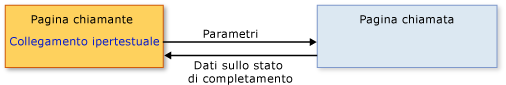

# Cenni preliminari sulla navigazione strutturata
Il contenuto che può essere ospitato da un'[!INCLUDE[TLA#tla_xbap](../../../../includes/tlasharptla-xbap-md.md)], un oggetto <xref:System.Windows.Controls.Frame>o un oggetto <xref:System.Windows.Navigation.NavigationWindow> è composto da pagine che è possibile identificare tramite gli [!INCLUDE[TLA#tla_uri#plural](../../../../includes/tlasharptla-urisharpplural-md.md)] di tipo pack ed essere esplorate mediante collegamenti ipertestuali.  La struttura delle pagine e le modalità di navigazione, definite dai collegamenti ipertestuali, sono note come topologia di navigazione.  Tale topologia si adatta a vari tipi di applicazione, in particolare alle applicazioni che si spostano tra documenti.  Per tali applicazioni, l'utente può spostarsi da una pagina a un'altra, senza che tali pagine siano a conoscenza l'una dell'altra.  
  
 In altri tipi di applicazioni, tuttavia, è necessario tenere traccia degli spostamenti tra le pagine.  Si consideri, ad esempio, un'applicazione delle risorse umane con una pagina in cui sono elencati tutti i dipendenti di un'organizzazione, la pagina "Elenco dipendenti".  In questa pagina è anche possibile aggiungere un nuovo dipendente facendo clic su un collegamento ipertestuale.  Quando si fa clic nella pagina, viene visualizzata la pagina "Aggiungi dipendente" in cui vengono raccolte le informazioni sul nuovo dipendente, restituite quindi alla pagina "Elenco dipendenti" per creare il nuovo dipendente e aggiornare l'elenco.  Questo stile di navigazione è simile alla chiamata a un metodo affinché venga eseguita un'elaborazione e venga restituito un valore, operazione nota come programmazione strutturata.  Analogamente, questo stile di navigazione è noto come *navigazione strutturata*.  
  
 La classe <xref:System.Windows.Controls.Page> non implementa il supporto per la navigazione strutturata.  La classe <xref:System.Windows.Navigation.PageFunction%601> deriva invece da <xref:System.Windows.Controls.Page> e lo estende con i costrutti di base richiesti per la navigazione strutturata.  In questo argomento viene illustrato come definire la navigazione strutturata con <xref:System.Windows.Navigation.PageFunction%601>.  
  
   
  
   
## Navigazione strutturata  
 Quando una pagina chiama un'altra pagina nella navigazione strutturata, sono richiesti alcuni dei comportamenti riportati di seguito, o tutti:  
  
-   La pagina chiamante si sposta nella pagina chiamata, passando facoltativamente i parametri richiesti dalla pagina chiamata.  
  
-   La pagina chiamata, al completamento dell'utilizzo della pagina chiamante, torna specificamente alla pagina chiamante e, facoltativamente, vengono eseguite le operazioni seguenti:  
  
    -   Vengono restituite informazioni sullo stato che descrivono la modalità di completamento della pagina chiamante \(ad esempio, se si fa clic su un pulsante OK o Annulla\).  
  
    -   Vengono restituiti i dati raccolti dall'utente \(ad esempio, i dettagli sul nuovo dipendente\).  
  
-   Quando la pagina chiamante torna alla pagina chiamata, quest'ultima viene rimossa dalla cronologia di navigazione per isolare un'istanza di una pagina chiamata da un'altra.  
  
 Questi comportamenti sono illustrati nella figura riportata di seguito.  
  
   
  
 È possibile implementare questi comportamenti utilizzando <xref:System.Windows.Navigation.PageFunction%601> come pagina chiamata.  
  
   
## Navigazione strutturata con PageFunction  
 In questo argomento viene illustrato come implementare il funzionamento di base della navigazione strutturata che prevede un solo oggetto <xref:System.Windows.Navigation.PageFunction%601>.  In questo esempio, <xref:System.Windows.Controls.Page> chiama <xref:System.Windows.Navigation.PageFunction%601> per ottenere un valore <xref:System.String> dall'utente e restituirlo.  
  
### Creazione di una pagina chiamante  
 La pagina che chiama <xref:System.Windows.Navigation.PageFunction%601> può essere <xref:System.Windows.Controls.Page> o <xref:System.Windows.Navigation.PageFunction%601>.  In questo esempio, viene utilizzato <xref:System.Windows.Controls.Page>, come illustrato nel codice seguente.  
  
 [!code-xml[StructuredNavigationSample#CallingPageDefaultMARKUP1](../../../../samples/snippets/csharp/VS_Snippets_Wpf/StructuredNavigationSample/CSharp/CallingPage.xaml#callingpagedefaultmarkup1)]  
[!code-xml[StructuredNavigationSample#CallingPageDefaultMARKUP2](../../../../samples/snippets/csharp/VS_Snippets_Wpf/StructuredNavigationSample/CSharp/CallingPage.xaml#callingpagedefaultmarkup2)]  
  
 [!code-csharp[StructuredNavigationSample#CallingPageDefaultCODEBEHIND1](../../../../samples/snippets/csharp/VS_Snippets_Wpf/StructuredNavigationSample/CSharp/CallingPage.xaml.cs#callingpagedefaultcodebehind1)]
 [!code-vb[StructuredNavigationSample#CallingPageDefaultCODEBEHIND1](../../../../samples/snippets/visualbasic/VS_Snippets_Wpf/StructuredNavigationSample/VisualBasic/CallingPage.xaml.vb#callingpagedefaultcodebehind1)]  
[!code-csharp[StructuredNavigationSample#CallingPageDefaultCODEBEHIND2](../../../../samples/snippets/csharp/VS_Snippets_Wpf/StructuredNavigationSample/CSharp/CallingPage.xaml.cs#callingpagedefaultcodebehind2)]
[!code-vb[StructuredNavigationSample#CallingPageDefaultCODEBEHIND2](../../../../samples/snippets/visualbasic/VS_Snippets_Wpf/StructuredNavigationSample/VisualBasic/CallingPage.xaml.vb#callingpagedefaultcodebehind2)]  
[!code-csharp[StructuredNavigationSample#CallingPageDefaultCODEBEHIND3](../../../../samples/snippets/csharp/VS_Snippets_Wpf/StructuredNavigationSample/CSharp/CallingPage.xaml.cs#callingpagedefaultcodebehind3)]
[!code-vb[StructuredNavigationSample#CallingPageDefaultCODEBEHIND3](../../../../samples/snippets/visualbasic/VS_Snippets_Wpf/StructuredNavigationSample/VisualBasic/CallingPage.xaml.vb#callingpagedefaultcodebehind3)]  
  
### Creazione di una funzione di pagina da chiamare  
 Affinché la pagina chiamante possa utilizzare la pagina chiamata per raccogliere dati dall'utente e restituirli, viene implementato <xref:System.Windows.Navigation.PageFunction%601> come classe generica il cui argomento di tipo specifica il tipo di valore restituito dalla pagina chiamata.  Nel codice riportato di seguito viene illustrata l'implementazione iniziale della pagina chiamata, mediante <xref:System.Windows.Navigation.PageFunction%601> che restituisce <xref:System.String>.  
  
 [!code-xml[StructuredNavigationSample#CalledPageFunctionMARKUP](../../../../samples/snippets/csharp/VS_Snippets_Wpf/StructuredNavigationSample/CSharp/CalledPageFunction.xaml#calledpagefunctionmarkup)]  
  
 [!code-csharp[StructuredNavigationSample#CalledPageFunctionCODEBEHIND1](../../../../samples/snippets/csharp/VS_Snippets_Wpf/StructuredNavigationSample/CSharp/CalledPageFunction.xaml.cs#calledpagefunctioncodebehind1)]
 [!code-vb[StructuredNavigationSample#CalledPageFunctionCODEBEHIND1](../../../../samples/snippets/visualbasic/VS_Snippets_Wpf/StructuredNavigationSample/VisualBasic/CalledPageFunction.xaml.vb#calledpagefunctioncodebehind1)]  
[!code-csharp[StructuredNavigationSample#CalledPageFunctionCODEBEHIND2](../../../../samples/snippets/csharp/VS_Snippets_Wpf/StructuredNavigationSample/CSharp/CalledPageFunction.xaml.cs#calledpagefunctioncodebehind2)]
[!code-vb[StructuredNavigationSample#CalledPageFunctionCODEBEHIND2](../../../../samples/snippets/visualbasic/VS_Snippets_Wpf/StructuredNavigationSample/VisualBasic/CalledPageFunction.xaml.vb#calledpagefunctioncodebehind2)]  
  
 La dichiarazione di <xref:System.Windows.Navigation.PageFunction%601> è simile alla dichiarazione di <xref:System.Windows.Controls.Page> con l'aggiunta degli argomenti di tipo.  Come si nota dall'esempio di codice, gli argomenti di tipo sono specificati sia nel markup [!INCLUDE[TLA2#tla_xaml](../../../../includes/tla2sharptla-xaml-md.md)], che utilizza l'attributo `x:TypeArguments`, sia nel code\-behind, che utilizza la sintassi degli argomenti di tipo generico standard.  
  
 Non è necessario utilizzare solo le classi [!INCLUDE[dnprdnshort](../../../../includes/dnprdnshort-md.md)] come argomenti di tipo.  È possibile chiamare <xref:System.Windows.Navigation.PageFunction%601> per raccogliere dati specifici del dominio estratti come tipo personalizzato.  Nel codice riportato di seguito viene illustrato come utilizzare un tipo personalizzato come argomento di tipo per <xref:System.Windows.Navigation.PageFunction%601>.  
  
 [!code-csharp[CustomTypePageFunctionSnippets#CustomTypeCODE1](../../../../samples/snippets/csharp/VS_Snippets_Wpf/CustomTypePageFunctionSnippets/CSharp/CustomType.cs#customtypecode1)]
 [!code-vb[CustomTypePageFunctionSnippets#CustomTypeCODE1](../../../../samples/snippets/visualbasic/VS_Snippets_Wpf/CustomTypePageFunctionSnippets/VisualBasic/CustomType.vb#customtypecode1)]  
[!code-csharp[CustomTypePageFunctionSnippets#CustomTypeCODE2](../../../../samples/snippets/csharp/VS_Snippets_Wpf/CustomTypePageFunctionSnippets/CSharp/CustomType.cs#customtypecode2)]
[!code-vb[CustomTypePageFunctionSnippets#CustomTypeCODE2](../../../../samples/snippets/visualbasic/VS_Snippets_Wpf/CustomTypePageFunctionSnippets/VisualBasic/CustomType.vb#customtypecode2)]  
  
 [!code-xml[CustomTypePageFunctionSnippets#CustomTypePageFunctionMARKUP1](../../../../samples/snippets/csharp/VS_Snippets_Wpf/CustomTypePageFunctionSnippets/CSharp/CustomTypePageFunction.xaml#customtypepagefunctionmarkup1)]  
[!code-xml[CustomTypePageFunctionSnippets#CustomTypePageFunctionMARKUP2](../../../../samples/snippets/csharp/VS_Snippets_Wpf/CustomTypePageFunctionSnippets/CSharp/CustomTypePageFunction.xaml#customtypepagefunctionmarkup2)]  
  
 [!code-csharp[CustomTypePageFunctionSnippets#CustomTypePageFunctionCODEBEHIND1](../../../../samples/snippets/csharp/VS_Snippets_Wpf/CustomTypePageFunctionSnippets/CSharp/CustomTypePageFunction.xaml.cs#customtypepagefunctioncodebehind1)]
 [!code-vb[CustomTypePageFunctionSnippets#CustomTypePageFunctionCODEBEHIND1](../../../../samples/snippets/visualbasic/VS_Snippets_Wpf/CustomTypePageFunctionSnippets/VisualBasic/CustomTypePageFunction.xaml.vb#customtypepagefunctioncodebehind1)]  
  
  
 Gli argomenti di tipo per <xref:System.Windows.Navigation.PageFunction%601> forniscono le basi per la comunicazione tra una pagina chiamante e la pagina chiamata, illustrate nelle sezioni che seguono.  
  
 Come verrà illustrato, il tipo identificato con la dichiarazione di <xref:System.Windows.Navigation.PageFunction%601> riveste un ruolo importante nel restituire dati da <xref:System.Windows.Navigation.PageFunction%601> alla pagina chiamante.  
  
### Chiamata di PageFunction e passaggio di parametri  
 Per chiamare una pagina, è necessario che nella pagina chiamante venga creata un'istanza della pagina chiamata, in cui effettuare lo spostamento tramite il metodo <xref:System.Windows.Navigation.NavigationService.Navigate%2A>.  In questo modo, è possibile passare i dati iniziali dalla pagina chiamante alla pagina chiamata, ad esempio i valori predefiniti dei dati raccolti dalla pagina chiamata.  
  
 Nel codice riportato di seguito viene illustrata la pagina chiamata con un costruttore non predefinito per accettare parametri dalla pagina chiamante.  
  
 [!code-csharp[StructuredNavigationSample#AcceptsInitialDataCODEBEHIND1](../../../../samples/snippets/csharp/VS_Snippets_Wpf/StructuredNavigationSample/CSharp/CalledPageFunction.xaml.cs#acceptsinitialdatacodebehind1)]
 [!code-vb[StructuredNavigationSample#AcceptsInitialDataCODEBEHIND1](../../../../samples/snippets/visualbasic/VS_Snippets_Wpf/StructuredNavigationSample/VisualBasic/CalledPageFunction.xaml.vb#acceptsinitialdatacodebehind1)]  
[!code-csharp[StructuredNavigationSample#AcceptsInitialDataCODEBEHIND2](../../../../samples/snippets/csharp/VS_Snippets_Wpf/StructuredNavigationSample/CSharp/CalledPageFunction.xaml.cs#acceptsinitialdatacodebehind2)]
[!code-vb[StructuredNavigationSample#AcceptsInitialDataCODEBEHIND2](../../../../samples/snippets/visualbasic/VS_Snippets_Wpf/StructuredNavigationSample/VisualBasic/CalledPageFunction.xaml.vb#acceptsinitialdatacodebehind2)]  
[!code-csharp[StructuredNavigationSample#AcceptsInitialDataCODEBEHIND3](../../../../samples/snippets/csharp/VS_Snippets_Wpf/StructuredNavigationSample/CSharp/CalledPageFunction.xaml.cs#acceptsinitialdatacodebehind3)]
[!code-vb[StructuredNavigationSample#AcceptsInitialDataCODEBEHIND3](../../../../samples/snippets/visualbasic/VS_Snippets_Wpf/StructuredNavigationSample/VisualBasic/CalledPageFunction.xaml.vb#acceptsinitialdatacodebehind3)]  
[!code-csharp[StructuredNavigationSample#AcceptsInitialDataCODEBEHIND4](../../../../samples/snippets/csharp/VS_Snippets_Wpf/StructuredNavigationSample/CSharp/CalledPageFunction.xaml.cs#acceptsinitialdatacodebehind4)]
[!code-vb[StructuredNavigationSample#AcceptsInitialDataCODEBEHIND4](../../../../samples/snippets/visualbasic/VS_Snippets_Wpf/StructuredNavigationSample/VisualBasic/CalledPageFunction.xaml.vb#acceptsinitialdatacodebehind4)]  
  
 Nel codice riportato di seguito viene illustrata la pagina chiamante in cui viene gestito l'evento <xref:System.Windows.Documents.Hyperlink.Click> di <xref:System.Windows.Documents.Hyperlink> dichiarato in precedenza, per creare un'istanza della pagina chiamata e passarvi un valore di stringa iniziale.  
  
 [!code-xml[StructuredNavigationSample#PassingDataMARKUP2](../../../../samples/snippets/csharp/VS_Snippets_Wpf/StructuredNavigationSample/CSharp/CallingPage.xaml#passingdatamarkup2)]  
[!code-csharp[StructuredNavigationSample#PassingDataCODEBEHIND1](../../../../samples/snippets/csharp/VS_Snippets_Wpf/StructuredNavigationSample/CSharp/CallingPage.xaml.cs#passingdatacodebehind1)]
[!code-vb[StructuredNavigationSample#PassingDataCODEBEHIND1](../../../../samples/snippets/visualbasic/VS_Snippets_Wpf/StructuredNavigationSample/VisualBasic/CallingPage.xaml.vb#passingdatacodebehind1)]  
[!code-csharp[StructuredNavigationSample#PassingDataCODEBEHIND2](../../../../samples/snippets/csharp/VS_Snippets_Wpf/StructuredNavigationSample/CSharp/CallingPage.xaml.cs#passingdatacodebehind2)]
[!code-vb[StructuredNavigationSample#PassingDataCODEBEHIND2](../../../../samples/snippets/visualbasic/VS_Snippets_Wpf/StructuredNavigationSample/VisualBasic/CallingPage.xaml.vb#passingdatacodebehind2)]  
[!code-csharp[StructuredNavigationSample#PassingDataCODEBEHIND3](../../../../samples/snippets/csharp/VS_Snippets_Wpf/StructuredNavigationSample/CSharp/CallingPage.xaml.cs#passingdatacodebehind3)]
[!code-vb[StructuredNavigationSample#PassingDataCODEBEHIND3](../../../../samples/snippets/visualbasic/VS_Snippets_Wpf/StructuredNavigationSample/VisualBasic/CallingPage.xaml.vb#passingdatacodebehind3)]  
  
 Non è necessario passare parametri alla pagina chiamata.  È invece possibile effettuare le operazioni seguenti:  
  
-   Dalla pagina chiamante:  
  
    1.  Creare un'istanza dell'oggetto <xref:System.Windows.Navigation.PageFunction%601> chiamato, utilizzando il costruttore predefinito.  
  
    2.  Archiviare i parametri in <xref:System.Windows.Application.Properties%2A>.  
  
    3.  Spostarsi nell'oggetto <xref:System.Windows.Navigation.PageFunction%601> chiamato.  
  
-   Dall'oggetto <xref:System.Windows.Navigation.PageFunction%601> chiamato:  
  
    -   Recuperare e utilizzare i parametri archiviati in <xref:System.Windows.Application.Properties%2A>.  
  
 Come verrà illustrato successivamente, è ancora necessario utilizzare codice per creare un'istanza e spostarsi nella pagina chiamata per raccogliere i dati restituiti dalla pagina chiamata.  Per questo motivo, è necessario mantenere attivo <xref:System.Windows.Navigation.PageFunction%601>, in caso contrario al successivo spostamento in <xref:System.Windows.Navigation.PageFunction%601>, in [!INCLUDE[TLA2#tla_wpf](../../../../includes/tla2sharptla-wpf-md.md)] verrà creata un'istanza di <xref:System.Windows.Navigation.PageFunction%601> utilizzando il costruttore predefinito.  
  
 Prima della restituzione della pagina chiamata, tuttavia, è necessario che tale pagina restituisca i dati che possono essere recuperati dalla pagina chiamante.  
  
### Restituzione del risultato e dei dati di attività da un'attività a una pagina chiamante  
 Al termine dell'utilizzo della pagina chiamata, indicato in questo esempio dalla scelta dei pulsanti OK o Annulla, la pagina chiamata deve essere restituita.  Poiché la pagina chiamata è stata utilizzata dalla pagina chiamante per raccogliere dati dall'utente, la pagina chiamante richiede due tipi di informazioni:  
  
1.  L'utente ha annullato la pagina chiamata \(scegliendo OK o Annulla in questo esempio\).  Grazie a questa informazione, la pagina chiamante è in grado di determinare se i dati raccolti dall'utente nella pagina chiamante devono essere elaborati.  
  
2.  I dati forniti dall'utente.  
  
 Per restituire informazioni, <xref:System.Windows.Navigation.PageFunction%601> implementa il metodo <xref:System.Windows.Navigation.PageFunction%601.OnReturn%2A>.  Nel codice riportato di seguito viene illustrato come chiamare tale metodo.  
  
 [!code-csharp[StructuredNavigationSample#ReturnCODEBEHIND1](../../../../samples/snippets/csharp/VS_Snippets_Wpf/StructuredNavigationSample/CSharp/CalledPageFunction.xaml.cs#returncodebehind1)]
 [!code-vb[StructuredNavigationSample#ReturnCODEBEHIND1](../../../../samples/snippets/visualbasic/VS_Snippets_Wpf/StructuredNavigationSample/VisualBasic/CalledPageFunction.xaml.vb#returncodebehind1)]  
[!code-csharp[StructuredNavigationSample#ReturnCODEBEHIND2](../../../../samples/snippets/csharp/VS_Snippets_Wpf/StructuredNavigationSample/CSharp/CalledPageFunction.xaml.cs#returncodebehind2)]
[!code-vb[StructuredNavigationSample#ReturnCODEBEHIND2](../../../../samples/snippets/visualbasic/VS_Snippets_Wpf/StructuredNavigationSample/VisualBasic/CalledPageFunction.xaml.vb#returncodebehind2)]  
  
 In questo esempio, se un utente fa clic su Annulla, un valore `null` viene restituito alla pagina chiamante.  Se si sceglie invece il pulsante OK, viene restituito il valore della stringa fornito dall'utente.  <xref:System.Windows.Navigation.PageFunction%601.OnReturn%2A> è un metodo `protected` `virtual` chiamato per restituire i dati alla pagina chiamante.  I dati devono essere assemblati in un'istanza del tipo <xref:System.Windows.Navigation.ReturnEventArgs%601> generico il cui argomento di tipo specifica il tipo di valore restituito da <xref:System.Windows.Navigation.ReturnEventArgs%601.Result%2A>.  In questo modo, quando <xref:System.Windows.Navigation.PageFunction%601> viene dichiarato con un determinato argomento di tipo, viene dichiarato che <xref:System.Windows.Navigation.PageFunction%601> restituirà un'istanza del tipo specificato dall'argomento di tipo.  In questo esempio, l'argomento di tipo e, di conseguenza, il valore restituito sono di tipo <xref:System.String>.  
  
 Quando viene chiamato <xref:System.Windows.Navigation.PageFunction%601.OnReturn%2A>, la pagina chiamante richiede un modo per ricevere il valore restituito di <xref:System.Windows.Navigation.PageFunction%601>.  Per questo motivo, <xref:System.Windows.Navigation.PageFunction%601> implementa l'evento <xref:System.Windows.Navigation.PageFunction%601.Return> che verrà gestito dalle pagine chiamanti.  Quando viene chiamato <xref:System.Windows.Navigation.PageFunction%601.OnReturn%2A>, viene generato <xref:System.Windows.Navigation.PageFunction%601.Return>, in modo da consentire alla pagina chiamante la registrazione con <xref:System.Windows.Navigation.PageFunction%601.Return> per ricevere la notifica.  
  
 [!code-csharp[StructuredNavigationSample#ProcessResultCODEBEHIND1](../../../../samples/snippets/csharp/VS_Snippets_Wpf/StructuredNavigationSample/CSharp/CallingPage.xaml.cs#processresultcodebehind1)]
 [!code-vb[StructuredNavigationSample#ProcessResultCODEBEHIND1](../../../../samples/snippets/visualbasic/VS_Snippets_Wpf/StructuredNavigationSample/VisualBasic/CallingPage.xaml.vb#processresultcodebehind1)]  
[!code-csharp[StructuredNavigationSample#ProcessResultCODEBEHIND2](../../../../samples/snippets/csharp/VS_Snippets_Wpf/StructuredNavigationSample/CSharp/CallingPage.xaml.cs#processresultcodebehind2)]
[!code-vb[StructuredNavigationSample#ProcessResultCODEBEHIND2](../../../../samples/snippets/visualbasic/VS_Snippets_Wpf/StructuredNavigationSample/VisualBasic/CallingPage.xaml.vb#processresultcodebehind2)]  
  
### Rimozione delle pagine di attività al completamento dell'attività  
 Quando viene restituita una pagina chiamata che non è stata annullata dall'utente, la pagina chiamante elabora i dati forniti dall'utente e restituiti dalla pagina chiamata.  Questo tipo di acquisizione dei dati è in genere un'attività isolata. Quando la pagina chiamata viene restituita, è necessario che la pagina chiamante crei una nuova pagina chiamante in cui spostarsi per acquisire più dati.  
  
 Tuttavia, a meno che una pagina chiamata non venga rimossa dal [journal](GTMT), un utente potrà spostarsi di nuovo in un'istanza precedente della pagina chiamante.  Il fatto che <xref:System.Windows.Navigation.PageFunction%601> venga mantenuto nel [journal](GTMT) è determinato dalla proprietà <xref:System.Windows.Navigation.PageFunctionBase.RemoveFromJournal%2A>.  Per impostazione predefinita, una funzione di pagina viene automaticamente rimossa quando viene chiamato <xref:System.Windows.Navigation.PageFunction%601.OnReturn%2A>, poiché <xref:System.Windows.Navigation.PageFunctionBase.RemoveFromJournal%2A> è impostato su `true`.  Per mantenere una funzione di pagina nella cronologia di navigazione dopo la chiamata a <xref:System.Windows.Navigation.PageFunction%601.OnReturn%2A>, impostare <xref:System.Windows.Navigation.PageFunctionBase.RemoveFromJournal%2A> su `false`.  
  
   
## Altri tipi di navigazione strutturata  
 In questo argomento viene illustrato l'utilizzo di base di <xref:System.Windows.Navigation.PageFunction%601> per il supporto della navigazione strutturata di tipo chiamata\/restituzione.  Da questa base è possibile creare tipi di navigazione strutturata più complessi.  
  
 Ad esempio, talvolta in una pagina chiamante sono richieste più pagine per raccogliere una quantità di dati sufficiente da un utente o per eseguire un'attività.  L'utilizzo di più pagine è noto come "procedura guidata".  
  
 In altri casi, le applicazioni possono presentare topologie di navigazione complesse che dipendono dalla navigazione strutturato per funzionare in modo efficiente.  Per ulteriori informazioni, vedere [Cenni preliminari sulle topologie di navigazione](../../../../docs/framework/wpf/app-development/navigation-topologies-overview.md).  
  
## Vedere anche  
 <xref:System.Windows.Navigation.PageFunction%601>   
 <xref:System.Windows.Navigation.NavigationService>   
 [Cenni preliminari sulle topologie di navigazione](../../../../docs/framework/wpf/app-development/navigation-topologies-overview.md)