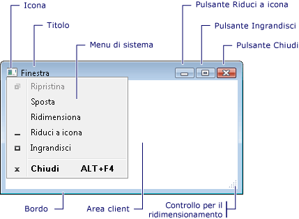
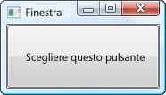
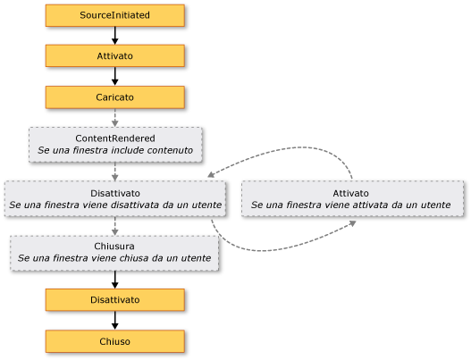
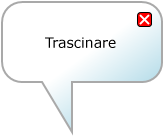

# Cenni preliminari sulle finestre WPF
Le finestre consentono l'interazione degli utenti con le applicazioni autonome [!INCLUDE[TLA#tla_wpf](../../../../includes/tlasharptla-wpf-md.md)].  Scopo principale di una finestra è ospitare il contenuto che visualizza i dati e consente agli utenti di interagire con essi. Le applicazioni [!INCLUDE[TLA2#tla_wpf](../../../../includes/tla2sharptla-wpf-md.md)] autonome utilizzano la classe <xref:System.Windows.Window> per fornire le rispettive finestre.  In questo argomento viene descritta la classe <xref:System.Windows.Window> e successivamente vengono illustrate le nozioni fondamentali sulla creazione e gestione delle finestre nelle applicazioni autonome.  
  
> [!NOTE]
>  Le applicazioni [!INCLUDE[TLA2#tla_wpf](../../../../includes/tla2sharptla-wpf-md.md)] ospitate da browser, incluse le [!INCLUDE[TLA#tla_xbap#plural](../../../../includes/tlasharptla-xbapsharpplural-md.md)] e le pagine [!INCLUDE[TLA#tla_xaml](../../../../includes/tlasharptla-xaml-md.md)] separate, non dispongono di finestre proprie.  Al contrario, vengono ospitate nelle finestre fornite da [!INCLUDE[TLA#tla_iegeneric](../../../../includes/tlasharptla-iegeneric-md.md)].  Vedere [Panoramica delle applicazioni browser XAML di WPF](../../../../docs/framework/wpf/app-development/wpf-xaml-browser-applications-overview.md).  
  
   
  
<a name="TheWindowClass"></a>   
## Classe Window  
 Nella figura che segue vengono illustrate le diverse parti che compongono una finestra.  
  
   
  
 Una finestra è suddivisa in due aree: l'area non client e l'area client.  
  
 L'*area non client* di una finestra viene implementata da [!INCLUDE[TLA2#tla_wpf](../../../../includes/tla2sharptla-wpf-md.md)] e include le parti comuni alla maggior parte delle finestre, tra cui le seguenti:  
  
-   Un bordo.  
  
-   Una barra del titolo.  
  
-   Un'icona.  
  
-   I pulsanti Riduci a icona, Ingrandisci e Ripristina.  
  
-   Un pulsante Chiudi.  
  
-   Un menu Sistema le cui voci consentono agli utenti di ridurre a icona, ingrandire, ripristinare, spostare, ridimensionare e chiudere una finestra.  
  
 L'*area client* di una finestra è l'area situata all'interno dell'area non client e utilizzata dagli sviluppatori per aggiungere un contenuto specifico dell'applicazione, ad esempio barre dei menu, barre degli strumenti e controlli.  
  
 In [!INCLUDE[TLA2#tla_wpf](../../../../includes/tla2sharptla-wpf-md.md)] una finestra viene incapsulata dalla classe <xref:System.Windows.Window>, utilizzata per effettuare le seguenti operazioni:  
  
-   Visualizzare una finestra.  
  
-   Configurare le dimensioni, la posizione e l'aspetto di una finestra.  
  
-   Ospitare contenuto specifico dell'applicazione.  
  
-   Gestire la durata di una finestra.  
  
<a name="DefiningAWindow"></a>   
## Implementazione di una finestra  
 L'implementazione di una finestra tipica include sia l'aspetto che il comportamento: l'*aspetto* definisce le caratteristiche visive della finestra, mentre il *comportamento* ne definisce il funzionamento nel momento in cui gli utenti interagiscono con essa.  In [!INCLUDE[TLA2#tla_wpf](../../../../includes/tla2sharptla-wpf-md.md)] è possibile implementare l'aspetto e il comportamento di una finestra tramite codice o markup [!INCLUDE[TLA2#tla_xaml](../../../../includes/tla2sharptla-xaml-md.md)].  
  
 Tuttavia, accade in genere che l'aspetto di una finestra venga implementato tramite markup [!INCLUDE[TLA2#tla_xaml](../../../../includes/tla2sharptla-xaml-md.md)] e il comportamento tramite code\-behind, come illustrato nell'esempio che segue.  
  
 [!code-xml[WindowsOverviewSnippets#MarkupAndCodeBehindWindowMARKUP](../../../../samples/snippets/csharp/VS_Snippets_Wpf/WindowsOverviewSnippets/CSharp/MarkupAndCodeBehindWindow.xaml#markupandcodebehindwindowmarkup)]  
  
 [!code-csharp[WindowsOverviewSnippets#MarkupAndCodeBehindWindowCODEBEHIND](../../../../samples/snippets/csharp/VS_Snippets_Wpf/WindowsOverviewSnippets/CSharp/MarkupAndCodeBehindWindow.xaml.cs#markupandcodebehindwindowcodebehind)]
 [!code-vb[WindowsOverviewSnippets#MarkupAndCodeBehindWindowCODEBEHIND](../../../../samples/snippets/visualbasic/VS_Snippets_Wpf/WindowsOverviewSnippets/VisualBasic/MarkupAndCodeBehindWindow.xaml.vb#markupandcodebehindwindowcodebehind)]  
  
 Per consentire il funzionamento congiunto di un file di markup [!INCLUDE[TLA2#tla_xaml](../../../../includes/tla2sharptla-xaml-md.md)] e un file code\-behind, è necessario soddisfare le seguenti condizioni:  
  
-   Nel markup, l'elemento `Window` deve includere l'attributo `x:Class`.  Quando l'applicazione viene compilata, la presenza di `x:Class` nel file di markup fa sì che [!INCLUDE[TLA#tla_msbuild](../../../../includes/tlasharptla-msbuild-md.md)] crei una classe `partial` derivante da <xref:System.Windows.Window> e avente il nome specificato dall'attributo `x:Class`.  Questo richiede l'aggiunta di una dichiarazione dello spazio dei nomi [!INCLUDE[TLA2#tla_xml](../../../../includes/tla2sharptla-xml-md.md)] per lo schema [!INCLUDE[TLA2#tla_xaml](../../../../includes/tla2sharptla-xaml-md.md)] \(`xmlns:x="http://schemas.microsoft.com/winfx/2006/xaml"`\).  La classe `partial` generata implementa il metodo `InitializeComponent`, il quale viene chiamato per registrare gli eventi e impostare le proprietà implementate nel markup.  
  
-   Nel code\-behind, la classe deve essere una classe `partial` avente lo stesso nome specificato dall'attributo `x:Class` nel markup e deve derivare da <xref:System.Windows.Window>.  In questo modo il file code\-behind può essere associato alla classe `partial` generata per il file di markup durante la compilazione dell'applicazione \(vedere [Compilazione di un'applicazione WPF](../../../../docs/framework/wpf/app-development/building-a-wpf-application-wpf.md)\).  
  
-   Nel code\-behind, la classe <xref:System.Windows.Window> deve implementare un costruttore che chiama il metodo `InitializeComponent`.  Il metodo `InitializeComponent` viene implementato dalla classe `partial` generata per il file di markup per registrare gli eventi e impostare le proprietà definite nel markup.  
  
> [!NOTE]
>  Quando si aggiunge un nuovo oggetto <xref:System.Windows.Window> al progetto utilizzando [!INCLUDE[TLA#tla_visualstu](../../../../includes/tlasharptla-visualstu-md.md)], questo viene implementato tramite markup e code\-behind e include la configurazione necessaria per creare l'associazione tra il file di markup e il file code\-behind, come descritto in questo argomento.  
  
 Grazie a questa configurazione sarà possibile concentrarsi sulla definizione dell'aspetto della finestra nel markup [!INCLUDE[TLA2#tla_xaml](../../../../includes/tla2sharptla-xaml-md.md)] e sull'implementazione del comportamento nel code\-behind.  Nell'esempio seguente viene illustrata una finestra con un pulsante, implementato nel markup [!INCLUDE[TLA2#tla_xaml](../../../../includes/tla2sharptla-xaml-md.md)], e un gestore eventi per l'evento <xref:System.Windows.Controls.Primitives.ButtonBase.Click> del pulsante, implementato nel code\-behind.  
  
 [!code-xml[WindowsOverviewWindowWithButtonSnippets#MarkupAndCodeBehindWindowMARKUP](../../../../samples/snippets/csharp/VS_Snippets_Wpf/WindowsOverviewWindowWithButtonSnippets/CSharp/MarkupAndCodeBehindWindow.xaml#markupandcodebehindwindowmarkup)]  
  
 [!code-csharp[WindowsOverviewWindowWithButtonSnippets#MarkupAndCodeBehindWindowCODEBEHIND](../../../../samples/snippets/csharp/VS_Snippets_Wpf/WindowsOverviewWindowWithButtonSnippets/CSharp/MarkupAndCodeBehindWindow.xaml.cs#markupandcodebehindwindowcodebehind)]
 [!code-vb[WindowsOverviewWindowWithButtonSnippets#MarkupAndCodeBehindWindowCODEBEHIND](../../../../samples/snippets/visualbasic/VS_Snippets_Wpf/WindowsOverviewWindowWithButtonSnippets/VisualBasic/MarkupAndCodeBehindWindow.xaml.vb#markupandcodebehindwindowcodebehind)]  
  
<a name="ConfiguringWindowForMSBuild"></a>   
## Configurazione della definizione di una finestra per MSBuild  
 Il modo in cui una finestra viene implementata ne determina la configurazione per [!INCLUDE[TLA2#tla_msbuild](../../../../includes/tla2sharptla-msbuild-md.md)].  Nel caso di una finestra definita tramite markup [!INCLUDE[TLA2#tla_xaml](../../../../includes/tla2sharptla-xaml-md.md)] e code\-behind:  
  
-   I file di markup [!INCLUDE[TLA2#tla_xaml](../../../../includes/tla2sharptla-xaml-md.md)] vengono configurati come elementi `Page` [!INCLUDE[TLA2#tla_msbuild](../../../../includes/tla2sharptla-msbuild-md.md)].  
  
-   I file code\-behind vengono configurati come elementi `Compile` [!INCLUDE[TLA2#tla_msbuild](../../../../includes/tla2sharptla-msbuild-md.md)].  
  
 Nel file di progetto [!INCLUDE[TLA2#tla_msbuild](../../../../includes/tla2sharptla-msbuild-md.md)] che segue viene illustrato quanto detto.  
  
```  
<Project ... xmlns="http://schemas.microsoft.com/developer/msbuild/2003">  
    ...  
    <Page Include="MarkupAndCodeBehindWindow.xaml" />  
    <Compile Include=" MarkupAndCodeBehindWindow.xaml.cs" />  
    ...  
</Project>  
```  
  
 Per informazioni sulla compilazione di applicazioni [!INCLUDE[TLA2#tla_wpf](../../../../includes/tla2sharptla-wpf-md.md)], vedere [Compilazione di un'applicazione WPF](../../../../docs/framework/wpf/app-development/building-a-wpf-application-wpf.md).  
  
<a name="WindowLifetime"></a>   
## Durata di una finestra  
 Come accade per qualsiasi classe, la durata di una finestra ha inizio nel momento in cui ne viene creata un'istanza, dopo di che la finestra verrà aperta, attivata, disattivata ed eventualmente chiusa.  
  
   
  
<a name="Opening_a_Window"></a>   
### Apertura di una finestra  
 Per aprire una finestra occorre innanzitutto crearne un'istanza, come illustrato nell'esempio che segue.  
  
 [!code-xml[WindowsOverviewStartupEventSnippets#AppMARKUP](../../../../samples/snippets/csharp/VS_Snippets_Wpf/WindowsOverviewStartupEventSnippets/CSharp/App.xaml#appmarkup)]  
  
 [!code-csharp[WindowsOverviewStartupEventSnippets#AppCODEBEHIND](../../../../samples/snippets/csharp/VS_Snippets_Wpf/WindowsOverviewStartupEventSnippets/CSharp/App.xaml.cs#appcodebehind)]  
  
 In questo esempio viene creata un'istanza di `MarkupAndCodeBehindWindow` all'avvio dell'applicazione, ovvero nel momento in cui viene generato l'evento <xref:System.Windows.Application.Startup>.  
  
 Quando si crea un'istanza di una finestra, un riferimento a questa viene automaticamente aggiunto a un elenco di finestre gestito dall'oggetto <xref:System.Windows.Application> \(vedere <xref:System.Windows.Application.Windows%2A?displayProperty=fullName>\).  Inoltre, per impostazione predefinita, la prima finestra di cui si crea un'istanza viene impostata da <xref:System.Windows.Application> come finestra principale dell'applicazione \(vedere <xref:System.Windows.Application.MainWindow%2A?displayProperty=fullName>\).  
  
 Infine la finestra viene aperta mediante una chiamata al metodo <xref:System.Windows.Window.Show%2A>. Nella figura riportata di seguito viene illustrato il risultato.  
  
   
  
 La chiamata al metodo <xref:System.Windows.Window.Show%2A> genera una finestra non modale. In altri termini, la modalità di funzionamento dell'applicazione consente agli utenti di attivare altre finestre nella stessa applicazione.  
  
> [!NOTE]
>  La chiamata al metodo <xref:System.Windows.Window.ShowDialog%2A> consente invece di aprire finestre modali, quali ad esempio le finestre di dialogo.  Per ulteriori informazioni, vedere [Cenni preliminari sulle finestre di dialogo](../../../../docs/framework/wpf/app-development/dialog-boxes-overview.md).  
  
 La chiamata a <xref:System.Windows.Window.Show%2A> non comporta l'immediata visualizzazione di una finestra, poiché questa esegue prima le operazioni di inizializzazione per stabilire l'infrastruttura necessaria per ricevere l'input dell'utente.  Una volta inizializzata la finestra, viene generato l'evento <xref:System.Windows.Window.SourceInitialized> e la finestra in questione viene visualizzata.  
  
 Per una procedura più rapida, è possibile impostare <xref:System.Windows.Application.StartupUri%2A> in modo tale da specificare la prima finestra che viene automaticamente aperta all'avvio dell'applicazione.  
  
 [!code-xml[WindowsOverviewSnippets#ApplicationStartupUriMARKUP](../../../../samples/snippets/csharp/VS_Snippets_Wpf/WindowsOverviewSnippets/CSharp/App.xaml#applicationstartupurimarkup)]  
  
 Quando l'applicazione viene avviata, la finestra specificata dal valore di <xref:System.Windows.Application.StartupUri%2A> viene aperta come non modale. A livello interno, la finestra viene aperta chiamando il metodo <xref:System.Windows.Window.Show%2A>.  
  
<a name="Ownership"></a>   
#### Proprietà di una finestra  
 In caso di utilizzo del metodo <xref:System.Windows.Window.Show%2A>, non si crea alcuna relazione implicita tra la finestra aperta e la finestra che l'ha creata. Gli utenti possono quindi interagire con una finestra indipendentemente dall'altra. In altre parole, ogni finestra può eseguire le operazioni seguenti:  
  
-   Coprire l'altra finestra, a meno che una delle finestre non abbia la proprietà <xref:System.Windows.Window.Topmost%2A> impostata su `true`.  
  
-   Essere ridotta a icona, ingrandita e ripristinata senza influire sull'altra.  
  
 Alcune finestre necessitano di una relazione con la finestra da cui vengono aperte.  Ad esempio, è possibile che in un'applicazione nell'[!INCLUDE[TLA#tla_ide](../../../../includes/tlasharptla-ide-md.md)] vengano aperte finestre delle proprietà e degli strumenti il cui comportamento tipico prevede la copertura della finestra che le crea.  Tali finestre dovranno sempre essere chiuse, ridotte a icona, ingrandite e ripristinate insieme alla finestra che le ha create.  Questa relazione può essere stabilita facendo in modo che una finestra *diventi proprietaria* di un'altra finestra, ovvero impostando la proprietà <xref:System.Windows.Window.Owner%2A> della *finestra secondaria* con un riferimento alla *finestra proprietaria*,  Questa operazione viene mostrata nell'esempio seguente.  
  
 [!code-csharp[WindowOwnerOwnedWindowsSnippets#SetWindowOwnerCODE](../../../../samples/snippets/csharp/VS_Snippets_Wpf/WindowOwnerOwnedWindowsSnippets/CSharp/MainWindow.xaml.cs#setwindowownercode)]
 [!code-vb[WindowOwnerOwnedWindowsSnippets#SetWindowOwnerCODE](../../../../samples/snippets/visualbasic/VS_Snippets_Wpf/WindowOwnerOwnedWindowsSnippets/visualbasic/mainwindow.xaml.vb#setwindowownercode)]  
  
 Una volta stabilita la proprietà:  
  
-   La finestra secondaria può fare riferimento alla finestra proprietaria controllando il valore della proprietà <xref:System.Windows.Window.Owner%2A>.  
  
-   La finestra proprietaria può individuare tutte le finestre che le appartengono controllando il valore della proprietà <xref:System.Windows.Window.OwnedWindows%2A>.  
  
<a name="Preventing"></a>   
#### Prevenzione dell'attivazione della finestra  
 In alcuni scenari le finestre non devono essere attivate quando vengono visualizzate, come ad esempio nelle finestre di conversazione di un'applicazione Internet di tipo Messenger o nelle finestre di notifica di un'applicazione di posta elettronica.  
  
 Se l'applicazione dispone di una finestra che non deve essere attivata quando viene visualizzata, è possibile impostarne la proprietà <xref:System.Windows.Window.ShowActivated%2A> su `false` prima di chiamare il metodo <xref:System.Windows.Window.Show%2A> per la prima volta.  Di conseguenza:  
  
-   La finestra non viene attivata.  
  
-   L'evento <xref:System.Windows.Window.Activated> non viene generato.  
  
-   La finestra correntemente attiva resterà tale.  
  
 Verrà tuttavia attivata da parte dell'utente quando fa clic sull'area client o non client.  In questo caso:  
  
-   La finestra viene attivata.  
  
-   Viene generato l'evento <xref:System.Windows.Window.Activated> della finestra.  
  
-   La finestra precedentemente attivata viene disattivata.  
  
-   Gli eventi <xref:System.Windows.Window.Deactivated> e <xref:System.Windows.Window.Activated> della finestra vengono quindi generati come previsto in risposta alle azioni dell'utente.  
  
<a name="Window_Activation"></a>   
### Attivazione di una finestra  
 Quando la finestra viene aperta inizialmente, diviene la finestra attiva \(a meno che non sia visualizzata con <xref:System.Windows.Window.ShowActivated%2A> impostato su `false`\).  La *finestra attiva* è quella che acquisisce attualmente l'input dell'utente, quale ad esempio la pressione di un tasto o un clic del mouse.  Quando una finestra diventa attiva, genera l'evento <xref:System.Windows.Window.Activated>.  
  
> [!NOTE]
>  All'apertura di una finestra, gli eventi <xref:System.Windows.FrameworkElement.Loaded> e <xref:System.Windows.Window.ContentRendered> vengono generati soltanto dopo l'evento <xref:System.Windows.Window.Activated>.  Tenuto conto di questo, una finestra può considerarsi effettivamente aperta quando viene generato <xref:System.Windows.Window.ContentRendered>.  
  
 Una volta attivata una finestra, un utente può attivare un'altra finestra nella stessa applicazione oppure attivare un'altra applicazione.  In tal caso, la finestra attualmente attiva viene disattivata e genera l'evento <xref:System.Windows.Window.Deactivated>.  In modo analogo, quando l'utente seleziona una finestra attualmente disattivata, questa diventa nuovamente attiva e genera <xref:System.Windows.Window.Activated>.  
  
 In genere, <xref:System.Windows.Window.Activated> e <xref:System.Windows.Window.Deactivated> vengono gestiti per abilitare e disabilitare le funzionalità eseguibili soltanto con la finestra attiva.  Alcune finestre, ad esempio, visualizzano un contenuto interattivo che richiede attenzione o input costanti da parte dell'utente. È il caso di giochi o lettori video.  Di seguito viene riportato l'esempio di un lettore video semplificato nel quale viene illustrato come gestire <xref:System.Windows.Window.Activated> e <xref:System.Windows.Window.Deactivated> per implementare questo comportamento.  
  
 [!code-xml[WindowsOverviewSnippets#ActivationDeactivationMARKUP](../../../../samples/snippets/csharp/VS_Snippets_Wpf/WindowsOverviewSnippets/CSharp/CustomMediaPlayerWindow.xaml#activationdeactivationmarkup)]  
  
 [!code-csharp[WindowsOverviewSnippets#ActivationDeactivationCODEBEHIND](../../../../samples/snippets/csharp/VS_Snippets_Wpf/WindowsOverviewSnippets/CSharp/CustomMediaPlayerWindow.xaml.cs#activationdeactivationcodebehind)]
 [!code-vb[WindowsOverviewSnippets#ActivationDeactivationCODEBEHIND](../../../../samples/snippets/visualbasic/VS_Snippets_Wpf/WindowsOverviewSnippets/VisualBasic/CustomMediaPlayerWindow.xaml.vb#activationdeactivationcodebehind)]  
  
 Altri tipi di applicazioni possono comunque eseguire codice in background quando una finestra viene disattivata.  Ad esempio, è possibile che un client di posta elettronica continui a eseguire il polling del server di posta mentre l'utente utilizza altre applicazioni.  Applicazioni di questo tipo forniscono spesso un comportamento diverso o aggiuntivo mentre la finestra principale è disattivata.  Nel caso del programma di posta elettronica, può accadere che un nuovo elemento di posta venga aggiunto nella posta in arrivo e contemporaneamente un'icona di notifica venga visualizzata nella barra delle applicazioni.  L'icona di notifica deve essere visualizzata soltanto quando la finestra di posta elettronica non è attiva. A tal proposito, controllare la proprietà <xref:System.Windows.Window.IsActive%2A>.  
  
 Se un'attività in background viene completata, è possibile che una finestra voglia informare l'utente in modo più tempestivo, chiamando il metodo <xref:System.Windows.Window.Activate%2A>.  Se al momento della chiamata ad <xref:System.Windows.Window.Activate%2A> l'utente sta interagendo con un'altra applicazione attivata, il pulsante della finestra nella barra delle applicazioni lampeggia.  Se l'utente sta interagendo con l'applicazione corrente, la chiamata ad <xref:System.Windows.Window.Activate%2A> fa sì che la finestra venga visualizzata in primo piano.  
  
> [!NOTE]
>  È possibile gestire l'attivazione con ambito di applicazione utilizzando gli eventi <xref:System.Windows.Application.Activated?displayProperty=fullName> e <xref:System.Windows.Application.Deactivated?displayProperty=fullName>.  
  
<a name="Closing_a_Window"></a>   
### Chiusura di una finestra  
 La durata di una finestra volge al termine nel momento in cui la stessa viene chiusa da un utente.  Una finestra può essere chiusa utilizzando gli elementi presenti nell'area non client, tra cui:  
  
-   L'elemento **Chiudi** del menu **Sistema**.  
  
-   La combinazione di tasti ALT \+ F4.  
  
-   Il pulsante **Chiudi**.  
  
 È anche possibile fornire meccanismi di chiusura aggiuntivi nell'area client. Di seguito vengono riportati alcuni tra i meccanismi più comuni:  
  
-   Un elemento **Esci** nel menu **File**, in genere nelle finestre principali delle applicazioni.  
  
-   Un elemento **Chiudi** nel menu **File**, in genere in una finestra secondaria dell'applicazione.  
  
-   Un pulsante **Annulla**, in genere in una finestra di dialogo modale.  
  
-   Un pulsante **Chiudi**, in genere in una finestra di dialogo non modale.  
  
 Per chiudere una finestra in risposta a uno di questi meccanismi personalizzati, è necessario chiamare il metodo <xref:System.Windows.Window.Close%2A>.  Nell'esempio seguente viene implementata la possibilità di chiudere una finestra mediante l'elemento **Esci** del menu **File**.  
  
 [!code-xml[WindowsOverviewSnippets#WindowWithFileExitMARKUP](../../../../samples/snippets/csharp/VS_Snippets_Wpf/WindowsOverviewSnippets/CSharp/WindowWithFileExit.xaml#windowwithfileexitmarkup)]  
  
 [!code-csharp[WindowsOverviewSnippets#WindowWithFileExitCODEBEHIND](../../../../samples/snippets/csharp/VS_Snippets_Wpf/WindowsOverviewSnippets/CSharp/WindowWithFileExit.xaml.cs#windowwithfileexitcodebehind)]
 [!code-vb[WindowsOverviewSnippets#WindowWithFileExitCODEBEHIND](../../../../samples/snippets/visualbasic/VS_Snippets_Wpf/WindowsOverviewSnippets/VisualBasic/WindowWithFileExit.xaml.vb#windowwithfileexitcodebehind)]  
  
 Quando una finestra si chiude, genera due eventi: <xref:System.Windows.Window.Closing> e <xref:System.Windows.Window.Closed>.  
  
 <xref:System.Windows.Window.Closing> viene generato prima che la finestra si chiuda e fornisce un meccanismo mediante il quale è possibile impedirne la chiusura.  Una ragione comune per impedire la chiusura è data dalla presenza di dati modificati nel contenuto della finestra.  In questo caso è possibile gestire l'evento <xref:System.Windows.Window.Closing> per stabilire se i dati siano stati modificati e, in caso affermativo, chiedere all'utente se proseguire con la chiusura della finestra senza salvare i dati o piuttosto annullare la chiusura.  Nell'esempio seguente vengono illustrati gli aspetti principali della gestione di <xref:System.Windows.Window.Closing>.  
  
 [!code-csharp[WindowClosingSnippets#WindowClosingCODEBEHIND1](../../../../samples/snippets/csharp/VS_Snippets_Wpf/WindowClosingSnippets/CSharp/DataWindow.xaml.cs#windowclosingcodebehind1)]
 [!code-vb[WindowClosingSnippets#WindowClosingCODEBEHIND1](../../../../samples/snippets/visualbasic/VS_Snippets_Wpf/WindowClosingSnippets/visualbasic/datawindow.xaml.vb#windowclosingcodebehind1)]  
[!code-csharp[WindowClosingSnippets#WindowClosingCODEBEHIND2](../../../../samples/snippets/csharp/VS_Snippets_Wpf/WindowClosingSnippets/CSharp/DataWindow.xaml.cs#windowclosingcodebehind2)]
[!code-vb[WindowClosingSnippets#WindowClosingCODEBEHIND2](../../../../samples/snippets/visualbasic/VS_Snippets_Wpf/WindowClosingSnippets/visualbasic/datawindow.xaml.vb#windowclosingcodebehind2)]  
  
 Al gestore dell'evento <xref:System.Windows.Window.Closing> viene passato un oggetto <xref:System.ComponentModel.CancelEventArgs>, il quale implementa la proprietà <xref:System.ComponentModel.CancelEventArgs.Cancel%2A> `Boolean` impostata su `true` per impedire la chiusura di una finestra.  
  
 Se <xref:System.Windows.Window.Closing> non viene gestito oppure viene gestito ma non annullato, la finestra si chiuderà.  Prima dell'effettiva chiusura di una finestra, viene generato <xref:System.Windows.Window.Closed>.  A questo punto non sarà più possibile impedirne la chiusura.  
  
> [!NOTE]
>  È possibile configurare un'applicazione in modo tale che si chiuda quando viene chiusa la finestra principale della stessa \(vedere <xref:System.Windows.Application.MainWindow%2A>\) oppure l'ultima finestra rimasta aperta.  Per informazioni dettagliate, vedere <xref:System.Windows.Application.ShutdownMode%2A>.  
  
 Una finestra può essere chiusa in modo esplicito tramite meccanismi forniti nelle aree non client e client, ma può anche essere chiusa in modo implicito in seguito a comportamenti in altre parti dell'applicazione o in [!INCLUDE[TLA#tla_mswin](../../../../includes/tlasharptla-mswin-md.md)], inclusi i seguenti:  
  
-   Un utente si disconnette o termina la sessione di lavoro di [!INCLUDE[TLA2#tla_mswin](../../../../includes/tla2sharptla-mswin-md.md)].  
  
-   La finestra proprietaria della finestra in questione viene chiusa \(vedere <xref:System.Windows.Window.Owner%2A>\).  
  
-   La finestra principale dell'applicazione viene chiusa e <xref:System.Windows.Application.ShutdownMode%2A> è impostata su <xref:System.Windows.ShutdownMode>.  
  
-   Viene chiamato <xref:System.Windows.Application.Shutdown%2A>.  
  
> [!NOTE]
>  Una volta chiusa, una finestra non può essere riaperta.  
  
<a name="Window_Lifetime_Events"></a>   
### Eventi di durata di una finestra  
 Nella figura che segue viene illustrata la sequenza dei principali eventi di durata di una finestra.  
  
   
  
 Nell'illustrazione seguente è mostrata la sequenza degli eventi principali nella durata di una finestra, visualizzata senza attivazione \(<xref:System.Windows.Window.ShowActivated%2A> viene impostato su `false` prima che venga visualizzata la finestra\).  
  
   
  
<a name="WindowLocation"></a>   
## Posizione di una finestra  
 Una finestra aperta occupa una posizione nelle dimensioni x e y relativamente al desktop.  Questa posizione può essere determinata controllando rispettivamente le proprietà <xref:System.Windows.Window.Left%2A> e <xref:System.Windows.Window.Top%2A>.  Tramite impostazione di queste proprietà è possibile modificare la posizione della finestra.  
  
 È anche possibile specificare la posizione iniziale di <xref:System.Windows.Window>, ovvero la posizione in cui viene visualizzato all'avvio, impostando la proprietà <xref:System.Windows.Window.WindowStartupLocation%2A> con uno dei valori di enumerazione <xref:System.Windows.WindowStartupLocation> seguenti:  
  
-   <xref:System.Windows.WindowStartupLocation> \(impostazione predefinita\)  
  
-   <xref:System.Windows.WindowStartupLocation>  
  
-   <xref:System.Windows.WindowStartupLocation>  
  
 Se la posizione di avvio è specificata come <xref:System.Windows.WindowStartupLocation> e le proprietà <xref:System.Windows.Window.Left%2A> e <xref:System.Windows.Window.Top%2A> non sono state impostate, <xref:System.Windows.Window> chiederà a [!INCLUDE[TLA2#tla_mswin](../../../../includes/tla2sharptla-mswin-md.md)] in quale posizione effettuare la visualizzazione.  
  
<a name="Topmost_Windows_and_Z_Order"></a>   
### Finestre in primo piano e ordine Z  
 Oltre a occupare una posizione x e y, una finestra occupa anche una posizione nella dimensione z, la quale determina la posizione verticale in relazione alle altre finestre.  Si tratta del cosiddetto ordine Z della finestra, il quale può essere di due tipi: normale e di primo piano.  La posizione di una finestra nell'*ordine Z normale* dipende dal fatto che questa sia attualmente attiva o meno.  Per impostazione predefinita una finestra si trova nell'ordine Z normale.  Anche la posizione di una finestra nell'*ordine Z di primo piano* dipende dal fatto che questa sia attualmente attiva o meno.  Inoltre, le finestre situate nell'ordine Z di primo piano vengono sempre sovrapposte alle finestre situate nell'ordine Z normale.  Per collocare una finestra nell'ordine Z di primo piano, impostare la proprietà <xref:System.Windows.Window.Topmost%2A> su `true`.  
  
 [!code-xml[WindowsOverviewSnippets#TopmostWindowMARKUP1](../../../../samples/snippets/csharp/VS_Snippets_Wpf/WindowsOverviewSnippets/CSharp/TopmostWindow.xaml#topmostwindowmarkup1)]  
[!code-xml[WindowsOverviewSnippets#TopmostWindowMARKUP2](../../../../samples/snippets/csharp/VS_Snippets_Wpf/WindowsOverviewSnippets/CSharp/TopmostWindow.xaml#topmostwindowmarkup2)]  
  
 All'interno di ogni ordine Z, la finestra attualmente attiva viene visualizzata sopra a tutte le altre finestre dello stesso ordine.  
  
<a name="WindowSize"></a>   
## Dimensioni di una finestra  
 Oltre a occupare una posizione nel desktop, una finestra è caratterizzata da dimensioni specifiche determinate da diverse proprietà, tra cui le varie proprietà di larghezza e altezza e <xref:System.Windows.Window.SizeToContent%2A>.  
  
 <xref:System.Windows.FrameworkElement.MinWidth%2A>, <xref:System.Windows.FrameworkElement.Width%2A> e <xref:System.Windows.FrameworkElement.MaxWidth%2A> vengono utilizzate per gestire l'intervallo delle larghezze che possono caratterizzare una finestra nel corso della sua durata. Queste proprietà vengono configurate come illustrato nell'esempio che segue.  
  
 [!code-xml[WindowsOverviewSnippets#WidthWindowMARKUP1](../../../../samples/snippets/csharp/VS_Snippets_Wpf/WindowsOverviewSnippets/CSharp/WidthWindow.xaml#widthwindowmarkup1)]  
[!code-xml[WindowsOverviewSnippets#WidthWindowMARKUP2](../../../../samples/snippets/csharp/VS_Snippets_Wpf/WindowsOverviewSnippets/CSharp/WidthWindow.xaml#widthwindowmarkup2)]  
  
 L'altezza di una finestra viene gestita mediante <xref:System.Windows.FrameworkElement.MinHeight%2A>, <xref:System.Windows.FrameworkElement.Height%2A> e <xref:System.Windows.FrameworkElement.MaxHeight%2A>. Queste proprietà vengono configurate come illustrato nell'esempio che segue.  
  
 [!code-xml[WindowsOverviewSnippets#HeightWindowMARKUP1](../../../../samples/snippets/csharp/VS_Snippets_Wpf/WindowsOverviewSnippets/CSharp/HeightWindow.xaml#heightwindowmarkup1)]  
[!code-xml[WindowsOverviewSnippets#HeightWindowMARKUP2](../../../../samples/snippets/csharp/VS_Snippets_Wpf/WindowsOverviewSnippets/CSharp/HeightWindow.xaml#heightwindowmarkup2)]  
  
 Poiché i diversi valori di larghezza e di altezza specificano un intervallo, la larghezza e l'altezza di una finestra ridimensionabile possono assumere un valore qualsiasi all'interno dell'intervallo specificato per la rispettiva dimensione.  Per rilevare la larghezza e l'altezza correnti, controllare rispettivamente <xref:System.Windows.FrameworkElement.ActualWidth%2A> e <xref:System.Windows.FrameworkElement.ActualHeight%2A>.  
  
 Per fare in modo che la larghezza e l'altezza della finestra si adattino al contenuto della stessa, è possibile utilizzare la proprietà <xref:System.Windows.Window.SizeToContent%2A>, la quale può assumere i seguenti valori:  
  
-   <xref:System.Windows.SizeToContent>.  Nessun effetto \(impostazione predefinita\).  
  
-   <xref:System.Windows.SizeToContent>.  Adattamento alla larghezza del contenuto; stesso effetto ottenuto impostando <xref:System.Windows.FrameworkElement.MinWidth%2A> e <xref:System.Windows.FrameworkElement.MaxWidth%2A> sulla larghezza del contenuto.  
  
-   <xref:System.Windows.SizeToContent>.  Adattamento all'altezza del contenuto; stesso effetto ottenuto impostando <xref:System.Windows.FrameworkElement.MinHeight%2A> e <xref:System.Windows.FrameworkElement.MaxHeight%2A> sull'altezza del contenuto.  
  
-   <xref:System.Windows.SizeToContent>.  Adattamento alla larghezza e all'altezza del contenuto; stesso effetto ottenuto impostando <xref:System.Windows.FrameworkElement.MinHeight%2A> e <xref:System.Windows.FrameworkElement.MaxHeight%2A> sull'altezza del contenuto e <xref:System.Windows.FrameworkElement.MinWidth%2A> e <xref:System.Windows.FrameworkElement.MaxWidth%2A> sulla larghezza del contenuto.  
  
 Nell'esempio seguente viene illustrata una finestra che automaticamente dimensioni al contenuto, verticalmente e orizzontalmente, nel momento in cui viene visualizzata.  
  
 [!code-xml[WindowsOverviewSnippets#SizeToContentWindowMARKUP1](../../../../samples/snippets/csharp/VS_Snippets_Wpf/WindowsOverviewSnippets/CSharp/SizeToContentWindow.xaml#sizetocontentwindowmarkup1)]  
[!code-xml[WindowsOverviewSnippets#SizeToContentWindowMARKUP2](../../../../samples/snippets/csharp/VS_Snippets_Wpf/WindowsOverviewSnippets/CSharp/SizeToContentWindow.xaml#sizetocontentwindowmarkup2)]  
  
 Di seguito viene illustrato come impostare <xref:System.Windows.Window.SizeToContent%2A> proprietà nel codice per specificare come una finestra viene ridimensionata per adattarsi al contenuto.  
  
 [!code-csharp[HOWTOWindowManagementSnippets#SetWindowSizeToContentPropertyCODE](../../../../samples/snippets/csharp/VS_Snippets_Wpf/HOWTOWindowManagementSnippets/CSharp/MainWindow.xaml.cs#setwindowsizetocontentpropertycode)]
 [!code-vb[HOWTOWindowManagementSnippets#SetWindowSizeToContentPropertyCODE](../../../../samples/snippets/visualbasic/VS_Snippets_Wpf/HOWTOWindowManagementSnippets/visualbasic/mainwindow.xaml.vb#setwindowsizetocontentpropertycode)]  
  
<a name="OrderOfPrecedence"></a>   
## Ordine di precedenza per le proprietà di dimensione  
 Essenzialmente, le varie proprietà di dimensione di una finestra si combinano per definire l'intervallo di larghezza e di altezza di una finestra ridimensionabile.  Per fare in modo che venga mantenuto un intervallo valido, <xref:System.Windows.Window> valuta i valori delle proprietà di dimensione utilizzando i seguenti ordini di precedenza.  
  
 **Per le proprietà di altezza:**  
  
1.  <xref:System.Windows.FrameworkElement.MinHeight%2A?displayProperty=fullName> \>  
  
2.  <xref:System.Windows.FrameworkElement.MaxHeight%2A?displayProperty=fullName> \>  
  
3.  <xref:System.Windows.SizeToContent?displayProperty=fullName>\/<xref:System.Windows.SizeToContent?displayProperty=fullName> \>  
  
4.  <xref:System.Windows.FrameworkElement.Height%2A?displayProperty=fullName>  
  
 **Per le proprietà di larghezza:**  
  
1.  <xref:System.Windows.FrameworkElement.MinWidth%2A?displayProperty=fullName> \>  
  
2.  <xref:System.Windows.FrameworkElement.MaxWidth%2A?displayProperty=fullName> \>  
  
3.  <xref:System.Windows.SizeToContent?displayProperty=fullName>\/<xref:System.Windows.SizeToContent?displayProperty=fullName> \>  
  
4.  <xref:System.Windows.FrameworkElement.Width%2A?displayProperty=fullName>  
  
 L'ordine di precedenza può determinare anche le dimensioni di una finestra quando viene ingrandita. A tal proposito occorre gestire la proprietà <xref:System.Windows.Window.WindowState%2A>.  
  
<a name="WindowState"></a>   
## Stato di una finestra  
 Nel corso della sua durata, una finestra ridimensionabile può avere tre stati: normale, ridotta a icona e ingrandita.  Lo stato *normale* rappresenta lo stato predefinito di una finestra.  Se una finestra si trova in questo stato, un utente ha la possibilità di spostarla e ridimensionarla utilizzando un controllo per il ridimensionamento oppure il bordo, se ridimensionabile.  
  
 Una finestra con uno stato *ridotta a icona* viene compressa nel relativo pulsante nella barra delle applicazioni nel caso in cui <xref:System.Windows.Window.ShowInTaskbar%2A> sia impostata su `true`; in caso contrario, viene compressa nella dimensione minima possibile e collocata nell'angolo inferiore sinistro del desktop.  Entrambi i tipi di finestra ridotta a icona non possono essere ridimensionati utilizzando un bordo o un controllo di ridimensionamento. Tuttavia, una finestra ridotta a icona che non sia visualizzata nella barra delle applicazioni può essere trascinata sul desktop.  
  
 Una finestra con uno stato *ingrandita* viene allargata fino a raggiungere le dimensioni massime, ovvero quelle determinate dalle proprietà <xref:System.Windows.FrameworkElement.MaxWidth%2A>, <xref:System.Windows.FrameworkElement.MaxHeight%2A> e <xref:System.Windows.Window.SizeToContent%2A>.  Come avviene per una finestra ridotta a icona, una finestra ingrandita non può essere ridimensionata utilizzando un controllo per il ridimensionamento né trascinando il bordo.  
  
> [!NOTE]
>  I valori delle proprietà <xref:System.Windows.Window.Top%2A>, <xref:System.Windows.Window.Left%2A>, <xref:System.Windows.FrameworkElement.Width%2A> e <xref:System.Windows.FrameworkElement.Height%2A> di una finestra rappresentano sempre i valori relativi allo stato normale, anche quando la finestra è ingrandita o ridotta.  
  
 Per configurare lo stato di una finestra occorre impostare la proprietà <xref:System.Windows.Window.WindowState%2A>, che può assumere uno dei valori di enumerazione <xref:System.Windows.WindowState> seguenti:  
  
-   <xref:System.Windows.WindowState> \(impostazione predefinita\)  
  
-   <xref:System.Windows.WindowState>  
  
-   <xref:System.Windows.WindowState>  
  
 Nell'esempio seguente viene illustrato come creare una finestra che, una volta aperta, viene visualizzata come ingrandita.  
  
 [!code-xml[WindowsOverviewSnippets#WindowStateWindowMARKUP1](../../../../samples/snippets/csharp/VS_Snippets_Wpf/WindowsOverviewSnippets/CSharp/WindowStateWindow.xaml#windowstatewindowmarkup1)]  
[!code-xml[WindowsOverviewSnippets#WindowStateWindowMARKUP2](../../../../samples/snippets/csharp/VS_Snippets_Wpf/WindowsOverviewSnippets/CSharp/WindowStateWindow.xaml#windowstatewindowmarkup2)]  
  
 In genere, <xref:System.Windows.Window.WindowState%2A> viene impostata per configurare lo stato iniziale di una finestra.  Una volta visualizzata una finestra ridimensionabile, gli utenti possono utilizzare i pulsanti Riduci a icona, Ingrandisci e Ripristina che si trovano nella barra del titolo per modificare lo stato della finestra.  
  
<a name="WindowAppearance"></a>   
## Aspetto di una finestra  
 Per modificare l'aspetto dell'area client di una finestra, è possibile aggiungere contenuto specifico della stessa, ad esempio pulsanti, etichette e caselle di testo.  Per configurare l'area non client, <xref:System.Windows.Window> fornisce diverse proprietà, tra cui <xref:System.Windows.Window.Icon%2A> per impostare l'icona di una finestra e <xref:System.Windows.Window.Title%2A> per impostarne il titolo.  
  
 È anche possibile modificare l'aspetto e il comportamento del bordo dell'area non client configurando la modalità di ridimensionamento e lo stile di una finestra, nonché la possibilità che questa venga visualizzata come pulsante nella barra delle applicazioni sul desktop.  
  
   
  
<a name="Resize_Mode"></a>   
### Modalità di ridimensionamento  
 In base alla proprietà <xref:System.Windows.Window.WindowStyle%2A> è possibile controllare la possibilità di ridimensionare la finestra nonché la modalità di ridimensionamento.  La scelta dello stile influisce sul fatto che un utente possa o meno ridimensionare la finestra trascinando il bordo con il mouse, nonché sull'eventuale visualizzazione e abilitazione nell'area non client dei pulsanti **Riduci a icona**, **Ingrandisci** e **Ridimensiona**.  
  
 Per configurare la modalità di ridimensionamento di una finestra, è possibile impostare la proprietà <xref:System.Windows.Window.ResizeMode%2A>, la quale può assumere uno dei valori di enumerazione <xref:System.Windows.ResizeMode> seguenti:  
  
-   <xref:System.Windows.ResizeMode>  
  
-   <xref:System.Windows.ResizeMode>  
  
-   <xref:System.Windows.ResizeMode> \(impostazione predefinita\)  
  
-   <xref:System.Windows.ResizeMode>  
  
 Analogamente a <xref:System.Windows.Window.WindowStyle%2A>, la modalità di ridimensionamento di una finestra non viene in genere modificata nel corso della sua durata, pertanto è molto probabile che venga impostata dal markup [!INCLUDE[TLA2#tla_xaml](../../../../includes/tla2sharptla-xaml-md.md)].  
  
 [!code-xml[WindowsOverviewSnippets#ResizeModeWindowMARKUP1](../../../../samples/snippets/csharp/VS_Snippets_Wpf/WindowsOverviewSnippets/CSharp/ResizeModeWindow.xaml#resizemodewindowmarkup1)]  
[!code-xml[WindowsOverviewSnippets#ResizeModeWindowMARKUP2](../../../../samples/snippets/csharp/VS_Snippets_Wpf/WindowsOverviewSnippets/CSharp/ResizeModeWindow.xaml#resizemodewindowmarkup2)]  
  
 Per rilevare se una finestra è stata ingrandita, ridotta a icona o ripristinata, controllare la proprietà <xref:System.Windows.Window.WindowState%2A>.  
  
<a name="Window_Style"></a>   
### Stile di una finestra  
 Il bordo esposto dall'area non client di una finestra è adatto per la maggior parte delle applicazioni.  In alcuni casi, tuttavia, è possibile che siano necessari tipi di bordi diversi oppure che non sia necessario alcun bordo, a seconda del tipo di finestra.  
  
 Per controllare il tipo di bordo di una finestra, impostare la proprietà <xref:System.Windows.Window.WindowStyle%2A> con uno dei valori di enumerazione <xref:System.Windows.WindowStyle> seguenti:  
  
-   <xref:System.Windows.WindowStyle>  
  
-   <xref:System.Windows.WindowStyle> \(impostazione predefinita\)  
  
-   <xref:System.Windows.WindowStyle>  
  
-   <xref:System.Windows.WindowStyle>  
  
 Nella figura che segue viene illustrato l'effetto di questi stili della finestra.  
  
   
  
 <xref:System.Windows.Window.WindowStyle%2A> può essere impostata tramite markup [!INCLUDE[TLA2#tla_xaml](../../../../includes/tla2sharptla-xaml-md.md)] o codice. Tuttavia, poiché non viene in genere modificata nel corso della durata di una finestra, è molto probabile che venga configurata tramite markup [!INCLUDE[TLA2#tla_xaml](../../../../includes/tla2sharptla-xaml-md.md)].  
  
 [!code-xml[WindowsOverviewSnippets#WindowStyleWindowMARKUP1](../../../../samples/snippets/csharp/VS_Snippets_Wpf/WindowsOverviewSnippets/CSharp/WindowStyleWindow.xaml#windowstylewindowmarkup1)]  
[!code-xml[WindowsOverviewSnippets#WindowStyleWindowMARKUP2](../../../../samples/snippets/csharp/VS_Snippets_Wpf/WindowsOverviewSnippets/CSharp/WindowStyleWindow.xaml#windowstylewindowmarkup2)]  
  
#### Stile non rettangolare di una finestra  
 In alcuni casi, gli stili del bordo applicabili con <xref:System.Windows.Window.WindowStyle%2A> non sono sufficienti.  Può accadere che si desideri creare un'applicazione con un bordo non rettangolare, come quello utilizzato da [!INCLUDE[TLA#tla_wmp](../../../../includes/tlasharptla-wmp-md.md)].  
  
 Si consideri ad esempio il fumetto illustrato nella figura che segue.  
  
   
  
 Questo tipo di finestra può essere creato impostando la proprietà <xref:System.Windows.Window.WindowStyle%2A> su <xref:System.Windows.WindowStyle> e utilizzando il supporto speciale di <xref:System.Windows.Window> per la trasparenza.  
  
 [!code-xml[WindowsOverviewSnippets#TransparentWindowMARKUP1](../../../../samples/snippets/csharp/VS_Snippets_Wpf/WindowsOverviewSnippets/CSharp/TransparentWindow.xaml#transparentwindowmarkup1)]  
[!code-xml[WindowsOverviewSnippets#TransparentWindowMARKUP2](../../../../samples/snippets/csharp/VS_Snippets_Wpf/WindowsOverviewSnippets/CSharp/TransparentWindow.xaml#transparentwindowmarkup2)]  
  
 Grazie a questa combinazione di valori, la finestra apparirà completamente trasparente.  In questo stato non è possibile utilizzare le aree di controllo dell'area non client della finestra, ovvero il menu Chiudi, i pulsanti Riduci a icona, Ingrandisci e Ripristina e così via.  Sarà quindi necessario fornire aree di controllo personalizzate.  
  
<a name="Task_Bar_Presence"></a>   
### Presenza nella barra delle applicazioni  
 L'aspetto predefinito di una finestra include un pulsante nella barra delle applicazioni, come quello illustrato nella figura che segue.  
  
   
  
 Alcuni tipi di finestre non possiedono un pulsante nella barra delle applicazioni: è il caso delle finestre di messaggio e delle finestre di dialogo \(vedere [Cenni preliminari sulle finestre di dialogo](../../../../docs/framework/wpf/app-development/dialog-boxes-overview.md)\).  Per stabilire se il pulsante nella barra delle applicazioni debba essere visualizzato o meno, impostare la proprietà <xref:System.Windows.Window.ShowInTaskbar%2A>. L'impostazione predefinita è `true`.  
  
 [!code-xml[WindowsOverviewSnippets#ShowInTaskbarWindowMARKUP1](../../../../samples/snippets/csharp/VS_Snippets_Wpf/WindowsOverviewSnippets/CSharp/ShowInTaskbarWindow.xaml#showintaskbarwindowmarkup1)]  
[!code-xml[WindowsOverviewSnippets#ShowInTaskbarWindowMARKUP2](../../../../samples/snippets/csharp/VS_Snippets_Wpf/WindowsOverviewSnippets/CSharp/ShowInTaskbarWindow.xaml#showintaskbarwindowmarkup2)]  
  
<a name="SecurityConsiderations"></a>   
## Considerazioni sulla sicurezza  
 Per poter creare un'istanza di <xref:System.Windows.Window>, è necessaria l'autorizzazione di sicurezza `UnmanagedCode`.  Nel caso delle applicazioni installate e avviate dal computer locale, tale autorizzazione rientra nell'insieme di autorizzazioni concesse all'applicazione.  
  
 Al contrario, non è inclusa nell'insieme di autorizzazioni concesse alle applicazioni avviate dall'area Internet o intranet locale [!INCLUDE[TLA#tla_clickonce](../../../../includes/tlasharptla-clickonce-md.md)].  In questo caso, gli utenti riceveranno un avviso di sicurezza [!INCLUDE[TLA2#tla_clickonce](../../../../includes/tla2sharptla-clickonce-md.md)] e dovranno innalzare l'insieme di autorizzazioni dell'applicazione a un livello di attendibilità totale.  
  
 Per impostazione predefinita, inoltre, le applicazioni [!INCLUDE[TLA2#tla_xbap#plural](../../../../includes/tla2sharptla-xbapsharpplural-md.md)] non possono visualizzare né finestre né finestre di dialogo.  Per alcune considerazioni sulla sicurezza delle applicazioni autonome, vedere [Strategia di sicurezza di WPF \- Sicurezza della piattaforma](../../../../docs/framework/wpf/wpf-security-strategy-platform-security.md).  
  
<a name="Other_Types_of_Windows"></a>   
## Altri tipi di finestre  
 <xref:System.Windows.Navigation.NavigationWindow> è una finestra progettata per ospitare contenuto esplorabile.  Per ulteriori informazioni, vedere [Cenni preliminari sulla navigazione](../../../../docs/framework/wpf/app-development/navigation-overview.md).  
  
 Le finestre di dialogo vengono spesso utilizzate per raccogliere informazioni da un utente e completare una funzione.  Si supponga ad esempio che un utente voglia aprire un file: la finestra di dialogo **Apri file** viene di norma visualizzata da un'applicazione per ottenere dall'utente il nome del file.  Per ulteriori informazioni, vedere [Cenni preliminari sulle finestre di dialogo](../../../../docs/framework/wpf/app-development/dialog-boxes-overview.md).  
  
## Vedere anche  
 <xref:System.Windows.Window>   
 <xref:System.Windows.MessageBox>   
 <xref:System.Windows.Navigation.NavigationWindow>   
 <xref:System.Windows.Application>   
 [Cenni preliminari sulle finestre di dialogo](../../../../docs/framework/wpf/app-development/dialog-boxes-overview.md)   
 [Compilazione di un'applicazione WPF](../../../../docs/framework/wpf/app-development/building-a-wpf-application-wpf.md)