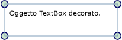

# Cenni preliminari sugli strumenti decorativi visuali
Gli strumenti decorativi visuali sono un tipo speciale di <xref:System.Windows.FrameworkElement> che fornisce all'utente segnali visivi.  Gli strumenti decorativi visuali possono anche essere utilizzati per aggiungere handle funzionali a elementi o fornire informazioni sullo stato di un controllo.  
  
   
  
   
## Informazioni sugli strumenti decorativi visuali  
 Un oggetto <xref:System.Windows.Documents.Adorner> è un oggetto <xref:System.Windows.FrameworkElement> personalizzato associato a un oggetto <xref:System.Windows.UIElement>.  Il rendering degli strumenti decorativi visuali viene eseguito in un oggetto <xref:System.Windows.Documents.AdornerLayer>, una superficie di rendering che si trova sempre sopra l'elemento decorato o una raccolta di elementi decorati.  Il rendering di uno strumento decorativo è indipendente dal rendering dell'oggetto <xref:System.Windows.UIElement> a cui lo strumento decorativo visuale è associato.  La posizione di uno strumento decorativo visuale è in genere relativa all'elemento a cui è associato, utilizzando l'origine delle coordinate standard bidimensionali poste in alto a sinistra rispetto all'elemento decorato.  
  
 Le applicazioni comuni degli strumenti decorativi visuali includono:  
  
-   Aggiunta di handle funzionali a un oggetto <xref:System.Windows.UIElement> che consentono a un utente di modificare \(ridimensionare, ruotare, riposizionare e così via\) l'elemento.  
  
-   Fornire feedback visuale per indicare vari stati o in risposta a vari eventi.  
  
-   Sovrapporre decorazioni visuali su un oggetto <xref:System.Windows.UIElement>.  
  
-   Mascherare visivamente o eseguire l'override di una parte o dell'intero oggetto <xref:System.Windows.UIElement>.  
  
 [!INCLUDE[TLA#tla_winclient](../../../../includes/tlasharptla-winclient-md.md)] fornisce un framework di base per la decorazione di elementi visivi.  Nella tabella riportata di seguito vengono elencati i tipi primari utilizzati per la decorazione di oggetti e ne viene descritto lo scopo.  Seguiranno alcuni esempi di utilizzo.  
  
|||  
|-|-|  
|<xref:System.Windows.Documents.Adorner>|Una classe base astratta da cui ereditano tutte le implementazioni concrete di elementi decorativi visuali.|  
|<xref:System.Windows.Documents.AdornerLayer>|Una classe che rappresenta un livello di rendering per lo strumento o gli strumenti decorativi visuali di uno o più elementi decorati.|  
|<xref:System.Windows.Documents.AdornerDecorator>|Una classe che consente l'associazione di un livello dello strumento decorativo visuale a una raccolta di elementi.|  
  
   
## Implementazione di uno strumento decorativo visuale personalizzato  
 Il framework degli strumenti decorativi visuali fornito da [!INCLUDE[TLA#tla_winclient](../../../../includes/tlasharptla-winclient-md.md)] supporta la creazione di strumenti decorativi visuali personalizzati.  Uno strumento decorativo personalizzato viene creato implementando una classe che eredita dalla classe astratta <xref:System.Windows.Documents.Adorner>.  
  
> [!NOTE]
>  L'elemento padre di un oggetto <xref:System.Windows.Documents.Adorner> è l'oggetto <xref:System.Windows.Documents.AdornerLayer> che esegue il rendering di <xref:System.Windows.Documents.Adorner>, non dell'elemento che viene decorato.  
  
 Nell'esempio di codice riportato di seguito viene illustrata una classe che implementa un semplice strumento decorativo visuale.  Lo strumento decorativo dell'esempio decora semplicemente gli angoli di un oggetto <xref:System.Windows.UIElement> con dei cerchi.  
  
 [!code-csharp[Adorners_SimpleCircleAdorner#_SimpleCircleAdornerBody](../../../../samples/snippets/csharp/VS_Snippets_Wpf/Adorners_SimpleCircleAdorner/CSharp/Window1.xaml.cs#_simplecircleadornerbody)]
 [!code-vb[Adorners_SimpleCircleAdorner#_SimpleCircleAdornerBody](../../../../samples/snippets/visualbasic/VS_Snippets_Wpf/Adorners_SimpleCircleAdorner/VisualBasic/Window1.xaml.vb#_simplecircleadornerbody)]  
  
 Nell'immagine riportata di seguito viene illustrato lo strumento decorativo SimpleCircleAdorner a un oggetto <xref:System.Windows.Controls.TextBox>.  
  
   
  
   
## Comportamento di rendering degli strumenti decorativi visuali  
 È importante notare che gli strumenti decorativi non comprendono comportamenti di rendering intrinseci; garantire che uno strumento decorativo esegua il rendering è responsabilità dell'implementatore.  Un modo comune di implementare un comportamento di rendering consiste nell'eseguire l'override del metodo <xref:System.Windows.UIElement.OnRender%2A> e nell'utilizzare uno o più oggetti <xref:System.Windows.Media.DrawingContext> per eseguire il rendering degli elementi visivi dello strumento decorativo in base alle esigenze \(come illustrato in questo esempio\).  
  
> [!NOTE]
>  Qualsiasi elemento posizionato sul livello dello strumento decorativo viene sottoposto a rendering sopra tutti gli altri stili eventualmente impostati.  In altre parole, gli strumenti decorativi sono sempre "in primo piano" e il loro override non può essere eseguito tramite l'[ordine Z](GTMT).  
  
   
## Eventi e hit testing  
 Gli strumenti decorativi visuali ricevono eventi di input come qualsiasi altro <xref:System.Windows.FrameworkElement>.  Poiché uno strumento decorativo visuale presenta un [ordine Z](GTMT) più elevato rispetto all'elemento da decorare, lo strumento decorativo visuale riceve eventi di input, ad esempio <xref:System.Windows.UIElement.Drop> o <xref:System.Windows.UIElement.MouseMove>, che potrebbero essere destinati all'elemento decorato sottostante.  Uno strumento decorativo visuale può rimanere in ascolto di determinati eventi di input e passare gli eventi ricevuti all'elemento decorato sottostante generando nuovamente l'evento.  
  
 Per abilitare l'hit testing pass\-through di elementi sotto uno strumento decorativo visuale, impostare la proprietà <xref:System.Windows.UIElement.IsHitTestVisible%2A> di hit testing su **false** sullo strumento decorativo visuale.  Per ulteriori informazioni sull'hit testing, vedere  
  
 [Hit testing a livello visivo](../../../../docs/framework/wpf/graphics-multimedia/hit-testing-in-the-visual-layer.md).  
  
   
## Decorazione di un singolo UIElement  
 Per associare uno strumento decorativo visuale a un particolare oggetto <xref:System.Windows.UIElement>, attenersi alla seguente procedura:  
  
1.  Chiamare il metodo statico <xref:System.Windows.Documents.AdornerLayer.GetAdornerLayer%2A> per ottenere un oggetto <xref:System.Windows.Documents.AdornerLayer> per l'elemento <xref:System.Windows.UIElement> da decorare.  <xref:System.Windows.Documents.AdornerLayer.GetAdornerLayer%2A> risale la struttura ad albero visuale, partendo dall'oggetto <xref:System.Windows.UIElement> specificato e restituisce il primo livello dello strumento decorativo trovato.  Se non viene riscontrato alcun livello dello strumento decorativo visuale, il metodo restituisce null.  
  
2.  Chiamare il metodo <xref:System.Windows.Documents.AdornerLayer.Add%2A> per associare lo strumento decorativo visuale all'oggetto <xref:System.Windows.UIElement> di destinazione.  
  
 Nell'esempio riportato di seguito viene associato un SimpleCircleAdorner \(illustrato in precedenza\) a un controllo <xref:System.Windows.Controls.TextBox> denominato *myTextBox*.  
  
 [!code-csharp[Adorners_SimpleCircleAdorner#_AdornSingleElement](../../../../samples/snippets/csharp/VS_Snippets_Wpf/Adorners_SimpleCircleAdorner/CSharp/Window1.xaml.cs#_adornsingleelement)]
 [!code-vb[Adorners_SimpleCircleAdorner#_AdornSingleElement](../../../../samples/snippets/visualbasic/VS_Snippets_Wpf/Adorners_SimpleCircleAdorner/VisualBasic/Window1.xaml.vb#_adornsingleelement)]  
  
> [!NOTE]
>  Non è al momento possibile utilizzare [!INCLUDE[TLA#tla_xaml](../../../../includes/tlasharptla-xaml-md.md)] per associare uno strumento decorativo visuale a un altro elemento.  
  
   
## Decorazione di elementi figlio di un oggetto Panel  
 Per associare uno strumento decorativo visuale agli elementi figlio di <xref:System.Windows.Controls.Panel>, attenersi alla procedura riportata di seguito:  
  
1.  Chiamare il metodo `static`<xref:System.Windows.Documents.AdornerLayer.GetAdornerLayer%2A> per trovare un livello dello strumento decorativo visuale per l'elemento di cui decorare gli elementi figlio.  
  
2.  Enumerare gli elementi figlio dell'elemento padre e chiamare il metodo <xref:System.Windows.Documents.AdornerLayer.Add%2A> per associare uno strumento decorativo visuale a ogni elemento figlio.  
  
 Nell'esempio riportato di seguito viene associato un SimpleCircleAdorner \(illustrato in precedenza\) agli elementi figlio di un oggetto <xref:System.Windows.Controls.StackPanel> denominato *myStackPanel*.  
  
 [!code-csharp[Adorners_SimpleCircleAdorner#_AdornChildren](../../../../samples/snippets/csharp/VS_Snippets_Wpf/Adorners_SimpleCircleAdorner/CSharp/Window1.xaml.cs#_adornchildren)]
 [!code-vb[Adorners_SimpleCircleAdorner#_AdornChildren](../../../../samples/snippets/visualbasic/VS_Snippets_Wpf/Adorners_SimpleCircleAdorner/VisualBasic/Window1.xaml.vb#_adornchildren)]  
  
## Vedere anche  
 <xref:System.Windows.Media.AdornerHitTestResult>   
 [Cenni preliminari sugli oggetti Shape e sulle funzionalità di disegno di base di WPF](../../../../docs/framework/wpf/graphics-multimedia/shapes-and-basic-drawing-in-wpf-overview.md)   
 [Disegnare con oggetti Image, Drawing e Visual](../../../../docs/framework/wpf/graphics-multimedia/painting-with-images-drawings-and-visuals.md)   
 [Cenni preliminari sugli oggetti Drawing](../../../../docs/framework/wpf/graphics-multimedia/drawing-objects-overview.md)   
 [Procedure relative](../../../../docs/framework/wpf/controls/adorners-how-to-topics.md)