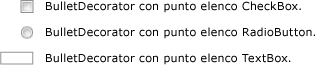

# BulletDecorator
<xref:System.Windows.Controls.Primitives.BulletDecorator> ha due proprietà di contenuto: <xref:System.Windows.Controls.Primitives.BulletDecorator.Bullet%2A> e <xref:System.Windows.Controls.Decorator.Child%2A>.  La proprietà <xref:System.Windows.Controls.Primitives.BulletDecorator.Bullet%2A> definisce l'oggetto <xref:System.Windows.UIElement> da utilizzare come punto elenco.  La proprietà <xref:System.Windows.Controls.Decorator.Child%2A> definisce un oggetto <xref:System.Windows.UIElement> che viene allineato visivamente con il punto elenco.  
  
 Nella figura seguente vengono illustrati esempi di controlli che utilizzano <xref:System.Windows.Controls.Primitives.BulletDecorator>.  
  
   
  
## Riferimenti  
 <xref:System.Windows.Controls.Primitives.BulletDecorator>