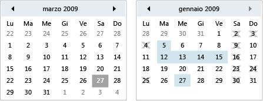

# Calendar
Un calendario consente a un utente di selezionare una data mediante una rappresentazione visiva del calendario.  
  
 Un controllo <xref:System.Windows.Controls.Calendar> può essere utilizzato in modo autonomo o come parte a discesa di un controllo <xref:System.Windows.Controls.DatePicker>.  Per ulteriori informazioni, vedere <xref:System.Windows.Controls.DatePicker>.  
  
 Nell'illustrazione riportata di seguito vengono mostrati due controlli <xref:System.Windows.Controls.Calendar>, uno con selezioni e date con blackout e uno senza.  
  
   
Controlli calendario  
  
 Nella tabella riportata di seguito vengono fornite le informazioni sulle attività che di solito sono associate a <xref:System.Windows.Controls.Calendar>.  
  
|Task|Implementazione|  
|----------|---------------------|  
|Specificare date che non possono essere selezionate.|Utilizzare la proprietà <xref:System.Windows.Controls.Calendar.BlackoutDates%2A>.|  
|Visualizzare un mese, un intero anno o un decennio tramite <xref:System.Windows.Controls.Calendar>.|Impostare la proprietà <xref:System.Windows.Controls.Calendar.DisplayMode%2A> su Mese, Anno o Decennio.|  
|Specificare se l'utente può selezionare una data, un intervallo di date o più intervalli di date.|Utilizzare <xref:System.Windows.Controls.Calendar.SelectionMode%2A>.|  
|Specificare l'intervallo di date che viene visualizzato da <xref:System.Windows.Controls.Calendar>.|Utilizzare le proprietà <xref:System.Windows.Controls.Calendar.DisplayDateStart%2A> e <xref:System.Windows.Controls.Calendar.DisplayDateEnd%2A>.|  
|Specificare se la data corrente è evidenziata.|Utilizzare la proprietà <xref:System.Windows.Controls.Calendar.IsTodayHighlighted%2A>.  Per impostazione predefinita, il valore di <xref:System.Windows.Controls.Calendar.IsTodayHighlighted%2A> è `true`.|  
|Modificare la dimensione di <xref:System.Windows.Controls.Calendar>.|Utilizzare un oggetto <xref:System.Windows.Controls.Viewbox> o impostare la proprietà <xref:System.Windows.FrameworkElement.LayoutTransform%2A> su un oggetto <xref:System.Windows.Media.ScaleTransform>.  Si noti che se si impostano le proprietà <xref:System.Windows.FrameworkElement.Width%2A> e <xref:System.Windows.FrameworkElement.Height%2A> di <xref:System.Windows.Controls.Calendar>, le dimensioni del calendario effettivo non vengono modificate.|  
  
 È possibile navigare all'interno del controllo <xref:System.Windows.Controls.Calendar> mediante il mouse o la tastiera.  Nella tabella seguente vengono descritte le operazioni di navigazione tramite tastiera.  
  
|Combinazione di tasti|<xref:System.Windows.Controls.Calendar.DisplayMode%2A>|Azione|  
|---------------------------|-----------------------------------------------------------------------------------------------------------------------------------------------------------|------------|  
|FRECCIA|<xref:System.Windows.Controls.CalendarMode>|Modifica la proprietà <xref:System.Windows.Controls.Calendar.SelectedDate%2A> se la proprietà <xref:System.Windows.Controls.Calendar.SelectionMode%2A> non è impostata su <xref:System.Windows.Controls.CalendarSelectionMode>.|  
|FRECCIA|<xref:System.Windows.Controls.CalendarMode>|Modifica il mese della proprietà <xref:System.Windows.Controls.Calendar.DisplayDate%2A>.  Si noti che <xref:System.Windows.Controls.Calendar.SelectedDate%2A> non cambia.|  
|FRECCIA|<xref:System.Windows.Controls.CalendarMode>|Modifica l'anno di <xref:System.Windows.Controls.Calendar.DisplayDate%2A>.  Si noti che <xref:System.Windows.Controls.Calendar.SelectedDate%2A> non cambia.|  
|MAIUSC\+FRECCIA|<xref:System.Windows.Controls.CalendarMode>|Se la proprietà <xref:System.Windows.Controls.Calendar.SelectionMode%2A> non è impostata su <xref:System.Windows.Controls.CalendarSelectionMode> o <xref:System.Windows.Controls.CalendarSelectionMode>, estende l'intervallo di date selezionate.|  
|HOME|<xref:System.Windows.Controls.CalendarMode>|Imposta <xref:System.Windows.Controls.Calendar.SelectedDate%2A> sul primo giorno del mese corrente.|  
|HOME|<xref:System.Windows.Controls.CalendarMode>|Imposta il mese di <xref:System.Windows.Controls.Calendar.DisplayDate%2A> sul primo mese dell'anno.  La proprietà <xref:System.Windows.Controls.Calendar.SelectedDate%2A> non viene modificata.|  
|HOME|<xref:System.Windows.Controls.CalendarMode>|Imposta l'anno di <xref:System.Windows.Controls.Calendar.DisplayDate%2A> sul primo anno del decennio.  La proprietà <xref:System.Windows.Controls.Calendar.SelectedDate%2A> non viene modificata.|  
|FINE|<xref:System.Windows.Controls.CalendarMode>|Imposta <xref:System.Windows.Controls.Calendar.SelectedDate%2A> sull'ultimo giorno del mese corrente.|  
|FINE|<xref:System.Windows.Controls.CalendarMode>|Imposta il mese di <xref:System.Windows.Controls.Calendar.DisplayDate%2A> sull'ultimo mese dell'anno.  La proprietà <xref:System.Windows.Controls.Calendar.SelectedDate%2A> non viene modificata.|  
|FINE|<xref:System.Windows.Controls.CalendarMode>|Imposta l'anno di <xref:System.Windows.Controls.Calendar.DisplayDate%2A> sull'ultimo anno del decennio.  La proprietà <xref:System.Windows.Controls.Calendar.SelectedDate%2A> non viene modificata.|  
|CTRL\+FRECCIA SU|Uno|Consente di passare <xref:System.Windows.Controls.Calendar.DisplayMode%2A> al valore successivo superiore.  Se la proprietà <xref:System.Windows.Controls.Calendar.DisplayMode%2A> è già impostata su <xref:System.Windows.Controls.CalendarMode>, non verrà eseguita alcuna azione.|  
|CTRL\+freccia GIÙ|Uno|Consente di passare <xref:System.Windows.Controls.Calendar.DisplayMode%2A> al valore successivo inferiore.  Se la proprietà <xref:System.Windows.Controls.Calendar.DisplayMode%2A> è già impostata su <xref:System.Windows.Controls.CalendarMode>, non verrà eseguita alcuna azione.|  
|BARRA SPAZIATRICE o INVIO|<xref:System.Windows.Controls.CalendarMode> o <xref:System.Windows.Controls.CalendarMode>|Consente di passare <xref:System.Windows.Controls.Calendar.DisplayMode%2A> a <xref:System.Windows.Controls.CalendarMode> o <xref:System.Windows.Controls.CalendarMode> rappresentati dall'elemento con stato attivo.|  
  
## Vedere anche  
 [Controlli](../../../../docs/framework/wpf/controls/index.md)   
 [Applicazione di stili e modelli](../../../../docs/framework/wpf/controls/styling-and-templating.md)