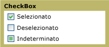

# CheckBox
È possibile utilizzare un oggetto <xref:System.Windows.Controls.CheckBox> nell'[!INCLUDE[TLA#tla_ui](../../../../includes/tlasharptla-ui-md.md)] dell'applicazione per rappresentare le opzioni che un utente può selezionare o deselezionare.  È possibile utilizzare una sola casella di controllo oppure raggruppare due o più caselle di controllo.  
  
 Nell'immagine riportata di seguito vengono mostrati i diversi stati di un oggetto <xref:System.Windows.Controls.CheckBox>.  
  
   
Controlli CheckBox in stati diversi  
  
## Riferimenti  
 <xref:System.Windows.Controls.CheckBox>  
 <xref:System.Windows.Controls.RadioButton>  
 <xref:System.Windows.Controls.Primitives.ButtonBase>  
 <xref:System.Windows.Controls.Primitives.RepeatButton>  
  
## Sezioni correlate