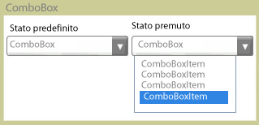

# ComboBox
Il controllo <xref:System.Windows.Controls.ComboBox> fornisce agli utenti un elenco di opzioni.  L'elenco viene mostrato e nascosto a seconda che il controllo sia esteso o compresso.  Nello stato predefinito l'elenco è compresso, per cui viene visualizzata una sola opzione.  L'utente fa clic su un pulsante per vedere l'elenco completo delle opzioni.  
  
 Nella figura seguente viene mostrato un oggetto <xref:System.Windows.Controls.ComboBox> nei diversi stati.  
  
   
Compresso ed esteso  
  
## In questa sezione  
 [How to: Get a ComboBoxItem](http://msdn.microsoft.com/it-it/8a0d2622-64b6-41fc-bf80-9669a1eacb53)  
  
## Riferimenti  
 <xref:System.Windows.Controls.ComboBox>