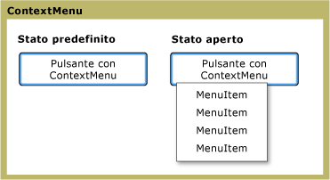

# ContextMenu
<xref:System.Windows.Controls.ContextMenu> consente a un controllo di visualizzare <xref:System.Windows.Controls.Menu> specifico al contesto del controllo.  In genere, <xref:System.Windows.Controls.ContextMenu> viene esposto in [!INCLUDE[TLA#tla_ui](../../../../includes/tlasharptla-ui-md.md)] tramite il pulsante destro del mouse o tramite il pulsante del menu della tastiera.  
  
 Nella figura riportata di seguito viene illustrato <xref:System.Windows.Controls.ContextMenu> in due stati diversi: lo stato predefinito e lo stato aperto.  Nello stato predefinito, il controllo è compresso.  Quando il pulsante destro del mouse viene premuto sull'elemento padre del menu, il controllo si espande e vengono visualizzate le voci di menu.  
  
   
ContextMenu in stati diversi  
  
## In questa sezione  
 [Cenni preliminari sull'oggetto ContextMenu](../../../../docs/framework/wpf/controls/contextmenu-overview.md)  
  
## Riferimenti  
 <xref:System.Windows.Controls.ContextMenu>  
  
## Sezioni correlate