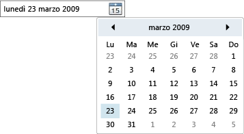

# DatePicker
Il controllo <xref:System.Windows.Controls.DatePicker> consente all'utente di selezionare una data digitandola in un campo di testo o utilizzando un controllo <xref:System.Windows.Controls.Calendar> a discesa.  
  
 Nell'immagine riportata di seguito viene illustrato un oggetto <xref:System.Windows.Controls.DatePicker>.  
  
   
Controllo DatePicker  
  
 Molte proprietà del controllo <xref:System.Windows.Controls.DatePicker> sono per la gestione dell'oggetto <xref:System.Windows.Controls.Calendar> incorporato e funzionano esattamente come la proprietà equivalente in <xref:System.Windows.Controls.Calendar>.  In particolare, le proprietà <xref:System.Windows.Controls.DatePicker.IsTodayHighlighted%2A?displayProperty=fullName>, <xref:System.Windows.Controls.DatePicker.FirstDayOfWeek%2A?displayProperty=fullName>, <xref:System.Windows.Controls.DatePicker.BlackoutDates%2A?displayProperty=fullName>, <xref:System.Windows.Controls.DatePicker.DisplayDateStart%2A?displayProperty=fullName>, <xref:System.Windows.Controls.DatePicker.DisplayDateEnd%2A?displayProperty=fullName>, <xref:System.Windows.Controls.DatePicker.DisplayDate%2A?displayProperty=fullName> e <xref:System.Windows.Controls.DatePicker.SelectedDate%2A?displayProperty=fullName> funzionano esattamente come le corrispondenti proprietà di <xref:System.Windows.Controls.Calendar>.  Per ulteriori informazioni, vedere <xref:System.Windows.Controls.Calendar>.  
  
 Gli utenti possono digitare una data direttamente in un campo di testo che imposta la proprietà <xref:System.Windows.Controls.DatePicker.Text%2A>.  Se <xref:System.Windows.Controls.DatePicker> non è in grado di convertire la stringa immessa in una data valida viene generato l'evento <xref:System.Windows.Controls.DatePicker.DateValidationError>.  Per impostazione predefinita viene generata un'eccezione, ma un gestore eventi per <xref:System.Windows.Controls.DatePicker.DateValidationError> può impostare la proprietà <xref:System.Windows.Controls.DatePickerDateValidationErrorEventArgs.ThrowException%2A> su `false` ed evitare così la generazione dell'eccezione.  
  
## Vedere anche  
 [Controlli](../../../../docs/framework/wpf/controls/index.md)   
 [Applicazione di stili e modelli](../../../../docs/framework/wpf/controls/styling-and-templating.md)