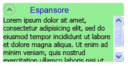

# Cenni preliminari sul controllo Expander
Il controllo <xref:System.Windows.Controls.Expander> consente di fornire contenuto in un'area espandibile dall'aspetto di una finestra e che include un'intestazione.  
  
   
  
   
## Creazione di un controllo Expander semplice  
 Nell'esempio seguente viene illustrato come creare un controllo <xref:System.Windows.Controls.Expander> semplice.  Viene creato un controllo <xref:System.Windows.Controls.Expander> simile a quello riportato nell'illustrazione precedente.  
  
 [!code-xml[ExpanderExample#2](../../../../samples/snippets/csharp/VS_Snippets_Wpf/ExpanderExample/CSharp/Page1.xaml#2)]  
  
 Le proprietà <xref:System.Windows.Controls.ContentControl.Content%2A> e <xref:System.Windows.Controls.HeaderedContentControl.Header%2A> di un controllo <xref:System.Windows.Controls.Expander> possono anche contenere contenuto complesso, ad esempio oggetti <xref:System.Windows.Controls.RadioButton> e <xref:System.Windows.Controls.Image>.  
  
   
## Impostazione della direzione dell'area del contenuto espandibile  
 È possibile impostare l'area del contenuto di un controllo <xref:System.Windows.Controls.Expander> in modo che si espanda in una di quattro direzioni \(<xref:System.Windows.Controls.ExpandDirection>, <xref:System.Windows.Controls.ExpandDirection>, <xref:System.Windows.Controls.ExpandDirection> o <xref:System.Windows.Controls.ExpandDirection>\) tramite la proprietà <xref:System.Windows.Controls.ExpandDirection>.  Quando l'area del contenuto è compressa, vengono visualizzati solo l'oggetto <xref:System.Windows.Controls.Expander><xref:System.Windows.Controls.HeaderedContentControl.Header%2A> e il relativo interruttore.  Come interruttore per espandere o comprimere l'area del contenuto viene utilizzato un controllo <xref:System.Windows.Controls.Button> che visualizza una freccia direzionale.  Quando è espanso, il controllo <xref:System.Windows.Controls.Expander> tenta di visualizzare tutto il contenuto in un'area simile a una finestra.  
  
   
## Controllo delle dimensioni di un controllo Expander in un pannello  
 Se un controllo <xref:System.Windows.Controls.Expander> si trova all'interno di un controllo di layout che eredita da <xref:System.Windows.Controls.Panel>, ad esempio <xref:System.Windows.Controls.StackPanel>, non specificare una proprietà <xref:System.Windows.FrameworkElement.Height%2A> per il controllo <xref:System.Windows.Controls.Expander> quando la proprietà <xref:System.Windows.Controls.Expander.ExpandDirection%2A> è impostata su <xref:System.Windows.Controls.ExpandDirection> o su <xref:System.Windows.Controls.ExpandDirection>.  Analogamente, non specificare una proprietà <xref:System.Windows.FrameworkElement.Width%2A> per il controllo <xref:System.Windows.Controls.Expander> quando la proprietà <xref:System.Windows.Controls.Expander.ExpandDirection%2A> è impostata su <xref:System.Windows.Controls.ExpandDirection> o su <xref:System.Windows.Controls.ExpandDirection>.  
  
 Quando si imposta una dimensione per un controllo <xref:System.Windows.Controls.Expander> nella direzione in cui viene visualizzato il contenuto espanso, <xref:System.Windows.Controls.Expander> assume il controllo dell'area utilizzata dal contenuto e visualizza un bordo che la circonda.  Il bordo viene visualizzato anche quando il contenuto è compresso.  Per impostare le dimensioni dell'area del contenuto espansa, impostare le dimensioni sul contenuto del controllo <xref:System.Windows.Controls.Expander> o, se si desidera la funzionalità di scorrimento, sul controllo <xref:System.Windows.Controls.ScrollViewer> che racchiude il contenuto.  
  
 Quando un controllo <xref:System.Windows.Controls.Expander> è l'ultimo elemento di un oggetto <xref:System.Windows.Controls.DockPanel>, in [!INCLUDE[TLA#tla_winclient](../../../../includes/tlasharptla-winclient-md.md)] le dimensioni di <xref:System.Windows.Controls.Expander> vengono automaticamente impostate in modo che siano uguali all'area rimanente dell'oggetto <xref:System.Windows.Controls.DockPanel>.  Per evitare questo comportamento predefinito, impostare su `false` la proprietà <xref:System.Windows.Controls.DockPanel.LastChildFill%2A> per l'oggetto <xref:System.Windows.Controls.DockPanel> o assicurarsi che il controllo <xref:System.Windows.Controls.Expander> non sia l'ultimo elemento di un oggetto <xref:System.Windows.Controls.DockPanel>.  
  
   
## Creazione di contenuto scorrevole  
 Se il contenuto è troppo esteso per le dimensioni dell'area, è possibile eseguire il wrapping del contenuto di un controllo <xref:System.Windows.Controls.Expander> in un controllo <xref:System.Windows.Controls.ScrollViewer> per fornire contenuto scorrevole.  Il controllo <xref:System.Windows.Controls.Expander> non fornisce automaticamente funzionalità di scorrimento.  Nell'illustrazione seguente viene mostrato un controllo <xref:System.Windows.Controls.Expander> che contiene un controllo <xref:System.Windows.Controls.ScrollViewer>.  
  
 **Controllo Expander in un controllo ScrollViewer**  
  
   
  
 Quando si inserisce un controllo <xref:System.Windows.Controls.Expander> in un controllo <xref:System.Windows.Controls.ScrollViewer>, impostare la proprietà della dimensione di <xref:System.Windows.Controls.ScrollViewer> che corrisponde alla direzione in cui si apre il contenuto del controllo <xref:System.Windows.Controls.Expander> sulle dimensioni dell'area del contenuto del controllo <xref:System.Windows.Controls.Expander>.  Ad esempio, se si imposta la proprietà <xref:System.Windows.Controls.Expander.ExpandDirection%2A> per il controllo <xref:System.Windows.Controls.Expander> su <xref:System.Windows.Controls.ExpandDirection> \(l'area del contenuto si apre verso il basso\), impostare la proprietà <xref:System.Windows.FrameworkElement.Height%2A> del controllo <xref:System.Windows.Controls.ScrollViewer> sull'altezza richiesta per l'area del contenuto.  Se invece la dimensione dell'altezza viene impostata sul controllo stesso, <xref:System.Windows.Controls.ScrollViewer> non riconosce questa impostazione e pertanto non fornisce contenuto scorrevole.  
  
 Nell'esempio seguente viene illustrato come creare un controllo <xref:System.Windows.Controls.Expander> che include contenuto complesso e che contiene un controllo <xref:System.Windows.Controls.ScrollViewer>.  Viene creato un controllo <xref:System.Windows.Controls.Expander> simile a quello dell'illustrazione riportata all'inizio di questa sezione.  
  
 [!code-csharp[ExpanderRichContent#1](../../../../samples/snippets/csharp/VS_Snippets_Wpf/ExpanderRichContent/CSharp/Window1.xaml.cs#1)]
 [!code-vb[ExpanderRichContent#1](../../../../samples/snippets/visualbasic/VS_Snippets_Wpf/ExpanderRichContent/VisualBasic/Window1.xaml.vb#1)]
 [!code-xml[ExpanderRichContent#1](../../../../samples/snippets/csharp/VS_Snippets_Wpf/ExpanderRichContent/CSharp/Window1.xaml#1)]  
  
   
## Utilizzo delle proprietà di allineamento  
 Per allineare il contenuto, è possibile impostare le proprietà <xref:System.Windows.Controls.Control.HorizontalContentAlignment%2A> e <xref:System.Windows.Controls.Control.VerticalContentAlignment%2A> per il controllo <xref:System.Windows.Controls.Expander>.  Quando si impostano queste proprietà, l'allineamento si applica all'intestazione e anche al contenuto espanso.  
  
## Vedere anche  
 <xref:System.Windows.Controls.Expander>   
 <xref:System.Windows.Controls.ExpandDirection>   
 [Procedure relative](../../../../docs/framework/wpf/controls/expander-how-to-topics.md)