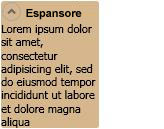

# Expander
Un oggetto <xref:System.Windows.Controls.Expander> consente a un utente di visualizzare un'intestazione e di espanderla per vedere ulteriori dettagli o di comprimere una sezione a livello di intestazione.  
  
 Nella figura seguente viene fornito un esempio di questo controllo nella posizione espansa.  
  
   
Controllo Expander  
  
## In questa sezione  
 [Cenni preliminari sul controllo Expander](../../../../docs/framework/wpf/controls/expander-overview.md)  
 [Procedure relative](../../../../docs/framework/wpf/controls/expander-how-to-topics.md)  
  
## Riferimenti  
 <xref:System.Windows.Controls.Expander>  
  
## Sezioni correlate