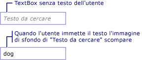

# Procedura: aggiungere una filigrana a un oggetto TextBox
Nell'esempio seguente viene mostrato come migliorare la possibilità di utilizzo di un oggetto <xref:System.Windows.Controls.TextBox> visualizzando un'immagine di sfondo esplicativa all'interno di un oggetto <xref:System.Windows.Controls.TextBox> fino a quando l'utente immette un testo; a quel punto l'immagine viene rimossa.  Inoltre, l'immagine di sfondo viene ripristinata nuovamente se l'utente rimuove l'input.  Vedere l'illustrazione di seguito.  
  
   
  
> [!NOTE]
>  La ragione per la quale in questo esempio viene utilizzata un'immagine di sfondo piuttosto che modificare semplicemente la proprietà <xref:System.Windows.Controls.TextBox.Text%2A> dell'oggetto <xref:System.Windows.Controls.TextBox> sta nel fatto che un'immagine di sfondo non interferisce con l'associazione dati.  
  
## Esempio  
 [!code-xml[TextBoxMiscSnippets_snip#TextBoxBackgroundExampleWholePage](../../../../samples/snippets/csharp/VS_Snippets_Wpf/TextBoxMiscSnippets_snip/csharp/textbox_with_background_image.xaml#textboxbackgroundexamplewholepage)]  
  
 [!code-csharp[TextBoxMiscSnippets_snip#TextBoxBackgroundCodeExampleWholePage](../../../../samples/snippets/csharp/VS_Snippets_Wpf/TextBoxMiscSnippets_snip/csharp/textbox_with_background_image.xaml.cs#textboxbackgroundcodeexamplewholepage)]
 [!code-vb[TextBoxMiscSnippets_snip#TextBoxBackgroundCodeExampleWholePage](../../../../samples/snippets/visualbasic/VS_Snippets_Wpf/TextBoxMiscSnippets_snip/visualbasic/textbox_with_background_image.xaml.vb#textboxbackgroundcodeexamplewholepage)]  
  
## Vedere anche  
 [Cenni preliminari sulla classe TextBox](../../../../docs/framework/wpf/controls/textbox-overview.md)   
 [Cenni generali sul controllo RichTextBox](../../../../docs/framework/wpf/controls/richtextbox-overview.md)