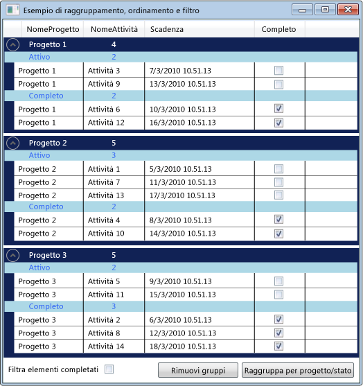

# Procedura: raggruppare, ordinare e filtrare dati nel controllo DataGrid
Può risultare spesso utile ottenere visualizzazioni diverse dei dati in un controllo <xref:System.Windows.Controls.DataGrid> raggruppandoli, ordinandoli e filtrandoli.  Per raggruppare, ordinare e filtrare i dati in un oggetto <xref:System.Windows.Controls.DataGrid>, è necessario associarli a un oggetto <xref:System.Windows.Data.CollectionView> che supporti queste funzioni.  È possibile quindi utilizzare i dati nell'oggetto <xref:System.Windows.Data.CollectionView> senza incidere sui dati di origine.  Le modifiche apportate alla visualizzazione di raccolte si riflettono nell'interfaccia utente di <xref:System.Windows.Controls.DataGrid>.  
  
 La classe <xref:System.Windows.Data.CollectionView> offre funzionalità di raggruppamento e ordinamento per un'origine dati che implementa l'interfaccia di <xref:System.Collections.IEnumerable>.  La classe <xref:System.Windows.Data.CollectionViewSource> consente di impostare le proprietà di un oggetto <xref:System.Windows.Data.CollectionView> da XAML.  
  
 In questo esempio, una raccolta di oggetti `Task` è associato a un oggetto <xref:System.Windows.Data.CollectionViewSource>.  <xref:System.Windows.Data.CollectionViewSource> viene utilizzato come <xref:System.Windows.Controls.ItemsControl.ItemsSource%2A> per il controllo <xref:System.Windows.Controls.DataGrid>.  Il raggruppamento, l'ordinamento e il filtraggio vengono eseguiti sulla classe <xref:System.Windows.Data.CollectionViewSource> e visualizzati nell'Interfaccia utente di <xref:System.Windows.Controls.DataGrid>.  
  
   
Dati raggruppati in un oggetto DataGrid  
  
## Utilizzo di un oggetto CollectionViewSource come ItemsSource  
 Per raggruppare, ordinare e filtrare dati in un controllo <xref:System.Windows.Controls.DataGrid>, associare l'oggetto <xref:System.Windows.Controls.DataGrid> a un oggetto <xref:System.Windows.Data.CollectionView> che supporti queste funzioni.  In questo esempio il controllo <xref:System.Windows.Controls.DataGrid> viene associato a una classe <xref:System.Windows.Data.CollectionViewSource> che offre queste funzioni per un <xref:System.Collections.Generic.List%601> di oggetti `Task`.  
  
#### Per associare un oggetto DataGrid a un oggetto CollectionViewSource  
  
1.  Creare una raccolta dati che implementi l'interfaccia di <xref:System.Collections.IEnumerable>.  
  
     Se si utilizza <xref:System.Collections.Generic.List%601> per la creazione della raccolta, è necessario creare una nuova classe che eredita da <xref:System.Collections.Generic.List%601> invece di creare un'istanza di <xref:System.Collections.Generic.List%601>.  Ciò consente l'associazione di dati alla raccolta in XAML.  
  
    > [!NOTE]
    >  è necessario che gli oggetti della raccolta implementino l'interfaccia modificata di <xref:System.ComponentModel.INotifyPropertyChanged> e l'interfaccia di <xref:System.ComponentModel.IEditableObject> affinché <xref:System.Windows.Controls.DataGrid> risponda correttamente alla modifica delle proprietà.  Per ulteriori informazioni, vedere [Implementare la notifica di modifiche alle proprietà](../../../../docs/framework/wpf/data/how-to-implement-property-change-notification.md).  
  
     [!code-csharp[DataGrid_GroupSortFilter#101](../../../../samples/snippets/csharp/VS_Snippets_Wpf/DataGrid_GroupSortFilter/CS/MainWindow.xaml.cs#101)]
     [!code-vb[DataGrid_GroupSortFilter#101](../../../../samples/snippets/visualbasic/VS_Snippets_Wpf/DataGrid_GroupSortFilter/VB/MainWindow.xaml.vb#101)]  
  
2.  In XAML, creare un'istanza della classe di raccolta e impostare la [Direttiva x:Key](../../../../docs/framework/xaml-services/x-key-directive.md).  
  
3.  In XAML, creare un'istanza della classe <xref:System.Windows.Data.CollectionViewSource>, impostare la [Direttiva x:Key](../../../../docs/framework/xaml-services/x-key-directive.md) e impostare l'istanza della classe di raccolte come <xref:System.Windows.Data.CollectionViewSource.Source%2A>.  
  
     [!code-xml[DataGrid_GroupSortFilter#201](../../../../samples/snippets/csharp/VS_Snippets_Wpf/DataGrid_GroupSortFilter/CS/WindowSnips1.xaml#201)]  
  
4.  Creare un'istanza della classe <xref:System.Windows.Controls.DataGrid> e impostare la proprietà <xref:System.Windows.Controls.ItemsControl.ItemsSource%2A> su <xref:System.Windows.Data.CollectionViewSource>.  
  
     [!code-xml[DataGrid_GroupSortFilter#002](../../../../samples/snippets/csharp/VS_Snippets_Wpf/DataGrid_GroupSortFilter/CS/MainWindow.xaml#002)]  
  
5.  Per accedere a <xref:System.Windows.Data.CollectionViewSource> dal codice, utilizzare il metodo <xref:System.Windows.Data.CollectionViewSource.GetDefaultView%2A> per ottenere un riferimento a <xref:System.Windows.Data.CollectionViewSource>.  
  
     [!code-csharp[DataGrid_GroupSortFilter#102](../../../../samples/snippets/csharp/VS_Snippets_Wpf/DataGrid_GroupSortFilter/CS/MainWindow.xaml.cs#102)]
     [!code-vb[DataGrid_GroupSortFilter#102](../../../../samples/snippets/visualbasic/VS_Snippets_Wpf/DataGrid_GroupSortFilter/VB/MainWindow.xaml.vb#102)]  
  
## Raggruppamento di elementi in un controllo DataGrid  
 Per specificare la modalità di raggruppamento degli elementi in un controllo <xref:System.Windows.Controls.DataGrid>, si utilizza il tipo <xref:System.Windows.Data.PropertyGroupDescription> per raggruppare gli elementi nella visualizzazione di origine.  
  
#### Per raggruppare gli elementi in un oggetto DataGrid mediante XAML  
  
1.  Creare un oggetto <xref:System.Windows.Data.PropertyGroupDescription> che specifichi la proprietà in base alla quale raggruppare gli elementi.  È possibile specificare la proprietà in XAML o nel codice.  
  
    1.  In XAML, impostare <xref:System.Windows.Data.PropertyGroupDescription.PropertyName%2A> sul nome della proprietà in base alla quale raggruppare gli elementi.  
  
    2.  Nel codice, passare al costruttore il nome della proprietà in base alla quale raggruppare gli elementi.  
  
2.  Aggiungere <xref:System.Windows.Data.PropertyGroupDescription> alla raccolta <xref:System.Windows.Data.CollectionViewSource.GroupDescriptions%2A?displayProperty=fullName>.  
  
3.  Aggiungere ulteriori istanze di <xref:System.Windows.Data.PropertyGroupDescription> alla raccolta <xref:System.Windows.Data.CollectionViewSource.GroupDescriptions%2A> per aggiungere altri livelli di raggruppamento.  
  
     [!code-xml[DataGrid_GroupSortFilter#012](../../../../samples/snippets/csharp/VS_Snippets_Wpf/DataGrid_GroupSortFilter/CS/MainWindow.xaml#012)]  
  
     [!code-csharp[DataGrid_GroupSortFilter#112](../../../../samples/snippets/csharp/VS_Snippets_Wpf/DataGrid_GroupSortFilter/CS/MainWindow.xaml.cs#112)]
     [!code-vb[DataGrid_GroupSortFilter#112](../../../../samples/snippets/visualbasic/VS_Snippets_Wpf/DataGrid_GroupSortFilter/VB/MainWindow.xaml.vb#112)]  
  
4.  Per rimuovere un gruppo, rimuovere l'oggetto <xref:System.Windows.Data.PropertyGroupDescription> dalla raccolta <xref:System.Windows.Data.CollectionViewSource.GroupDescriptions%2A>.  
  
5.  Per rimuovere tutti i gruppi, chiamare il metodo <xref:System.Collections.ObjectModel.Collection%601.Clear%2A> della raccolta <xref:System.Windows.Data.CollectionViewSource.GroupDescriptions%2A>.  
  
     [!code-csharp[DataGrid_GroupSortFilter#114](../../../../samples/snippets/csharp/VS_Snippets_Wpf/DataGrid_GroupSortFilter/CS/MainWindow.xaml.cs#114)]
     [!code-vb[DataGrid_GroupSortFilter#114](../../../../samples/snippets/visualbasic/VS_Snippets_Wpf/DataGrid_GroupSortFilter/VB/MainWindow.xaml.vb#114)]  
  
 Quando gli elementi vengono raggruppati in <xref:System.Windows.Controls.DataGrid>, è possibile definire un oggetto <xref:System.Windows.Controls.GroupStyle> che specifichi l'aspetto di ogni gruppo.  Applicare l'oggetto <xref:System.Windows.Controls.GroupStyle> aggiungendolo alla raccolta <xref:System.Windows.Controls.ItemsControl.GroupStyle%2A> di DataGrid.  Se sono presenti più livelli del raggruppamento, è possibile applicare stili diversi a ogni livello.  Gli stili vengono applicati nell'ordine con cui vengono definiti.  Se ad esempio si definiscono due stili, il primo verrà applicato ai gruppi di righe di livello superiore,  mentre il secondo verrà applicato a tutti i gruppi di righe del secondo livello e dei livelli successivi.  L'oggetto <xref:System.Windows.FrameworkElement.DataContext%2A> di <xref:System.Windows.Controls.GroupStyle> è l'oggetto <xref:System.Windows.Data.CollectionViewGroup> che il gruppo rappresenta.  
  
#### Per modificare l'aspetto delle intestazioni dei gruppi di righe  
  
1.  Creare un oggetto <xref:System.Windows.Controls.GroupStyle> che definisca l'aspetto del gruppo di righe.  
  
2.  Inserire <xref:System.Windows.Controls.GroupStyle> nei tag di `<DataGrid.GroupStyle>`.  
  
     [!code-xml[DataGrid_GroupSortFilter#003](../../../../samples/snippets/csharp/VS_Snippets_Wpf/DataGrid_GroupSortFilter/CS/MainWindow.xaml#003)]  
  
## Ordinamento di elementi in un controllo DataGrid  
 Per specificare la modalità di ordinamento degli elementi in un controllo <xref:System.Windows.Controls.DataGrid>, si utilizza il tipo <xref:System.ComponentModel.SortDescription> per ordinare gli elementi nella visualizzazione di origine.  
  
#### Per ordinare gli elementi in un controllo DataGrid  
  
1.  Creare un oggetto <xref:System.ComponentModel.SortDescription> che specifichi la proprietà in base alla quale ordinare gli elementi.  È possibile specificare la proprietà in XAML o nel codice.  
  
    1.  In XAML, impostare <xref:System.ComponentModel.SortDescription.PropertyName%2A> sul nome della proprietà in base alla quale ordinare gli elementi.  
  
    2.  Nel codice, passare il nome della proprietà in base alla quale ordinare gli elementi e l'oggetto <xref:System.ComponentModel.ListSortDirection> al costruttore.  
  
2.  Aggiungere l'oggetto <xref:System.ComponentModel.SortDescription> alla raccolta <xref:System.Windows.Data.CollectionViewSource.SortDescriptions%2A?displayProperty=fullName>.  
  
3.  Aggiungere ulteriori istanze di <xref:System.ComponentModel.SortDescription> alla raccolta <xref:System.Windows.Data.CollectionViewSource.SortDescriptions%2A> per ordinare gli elementi in base a proprietà aggiuntive.  
  
     [!code-xml[DataGrid_GroupSortFilter#011](../../../../samples/snippets/csharp/VS_Snippets_Wpf/DataGrid_GroupSortFilter/CS/MainWindow.xaml#011)]  
  
     [!code-csharp[DataGrid_GroupSortFilter#211](../../../../samples/snippets/csharp/VS_Snippets_Wpf/DataGrid_GroupSortFilter/CS/WindowSnips1.xaml.cs#211)]
     [!code-vb[DataGrid_GroupSortFilter#211](../../../../samples/snippets/visualbasic/VS_Snippets_Wpf/DataGrid_GroupSortFilter/VB/MainWindow.xaml.vb#211)]  
  
## Filtraggio di elementi in un controllo DataGrid  
 Per filtrare gli elementi in un oggetto <xref:System.Windows.Controls.DataGrid> mediante un oggetto <xref:System.Windows.Data.CollectionViewSource>, fornire la logica di filtro nel gestore per l'evento <xref:System.Windows.Data.CollectionViewSource.Filter?displayProperty=fullName>.  
  
#### Per filtrare gli elementi in un controllo DataGrid  
  
1.  Aggiungere un gestore per l'evento <xref:System.Windows.Data.CollectionViewSource.Filter?displayProperty=fullName>.  
  
2.  Nel gestore dell'evento <xref:System.Windows.Data.CollectionViewSource.Filter> definire la logica di filtro.  
  
     Il filtro verrà applicato ad ogni aggiornamento della visualizzazione.  
  
     [!code-xml[DataGrid_GroupSortFilter#013](../../../../samples/snippets/csharp/VS_Snippets_Wpf/DataGrid_GroupSortFilter/CS/MainWindow.xaml#013)]  
  
     [!code-csharp[DataGrid_GroupSortFilter#113](../../../../samples/snippets/csharp/VS_Snippets_Wpf/DataGrid_GroupSortFilter/CS/MainWindow.xaml.cs#113)]
     [!code-vb[DataGrid_GroupSortFilter#113](../../../../samples/snippets/visualbasic/VS_Snippets_Wpf/DataGrid_GroupSortFilter/VB/MainWindow.xaml.vb#113)]  
  
 In alternativa, è possibile filtrare gli elementi in un oggetto <xref:System.Windows.Controls.DataGrid> creando un metodo che fornisca la logica di filtro e impostando la proprietà <xref:System.Windows.Data.CollectionView.Filter%2A?displayProperty=fullName> per applicare il filtro.  Per un esempio di questo metodo, vedere [Filtrare i dati di una visualizzazione](../../../../docs/framework/wpf/data/how-to-filter-data-in-a-view.md).  
  
## Esempio  
 Nell'esempio seguente vengono mostrati il raggruppamento, l'ordinamento e il filtraggio dei dati `Task` in un oggetto <xref:System.Windows.Data.CollectionViewSource> e la visualizzazione dei dati `Task` raggruppati, ordinati e filtrati in un oggetto <xref:System.Windows.Controls.DataGrid>.  <xref:System.Windows.Data.CollectionViewSource> viene utilizzato come <xref:System.Windows.Controls.ItemsControl.ItemsSource%2A> per il controllo <xref:System.Windows.Controls.DataGrid>.  Il raggruppamento, l'ordinamento e il filtraggio vengono eseguiti sulla classe <xref:System.Windows.Data.CollectionViewSource> e visualizzati nell'Interfaccia utente di <xref:System.Windows.Controls.DataGrid>.  
  
 Per testare questo esempio, sarà necessario modificare il nome di DGGroupSortFilterExample in modo che corrisponda al nome del proprio progetto.  Se si utilizza Visual Basic, sarà necessario modificare il nome della classe per <xref:System.Windows.Window> come indicato di seguito.  
  
 `<Window x:Class="MainWindow"`  
  
 [!code-xml[DataGrid_GroupSortFilter#000](../../../../samples/snippets/csharp/VS_Snippets_Wpf/DataGrid_GroupSortFilter/CS/MainWindow.xaml#000)]  
  
 [!code-csharp[DataGrid_GroupSortFilter#100](../../../../samples/snippets/csharp/VS_Snippets_Wpf/DataGrid_GroupSortFilter/CS/MainWindow.xaml.cs#100)]
 [!code-vb[DataGrid_GroupSortFilter#100](../../../../samples/snippets/visualbasic/VS_Snippets_Wpf/DataGrid_GroupSortFilter/VB/MainWindow.xaml.vb#100)]  
  
## Compilazione del codice  
  
## Programmazione efficiente  
  
## Sicurezza di .NET Framework  
  
## Vedere anche  
 [Cenni preliminari sull'associazione dati](../../../../docs/framework/wpf/data/data-binding-overview.md)   
 [Creare ed eseguire l'associazione a un oggetto ObservableCollection](../../../../docs/framework/wpf/data/how-to-create-and-bind-to-an-observablecollection.md)   
 [Filtrare i dati di una visualizzazione](../../../../docs/framework/wpf/data/how-to-filter-data-in-a-view.md)   
 [Ordinare i dati in una visualizzazione](../../../../docs/framework/wpf/data/how-to-sort-data-in-a-view.md)   
 [Ordinare e raggruppare dati tramite una visualizzazione in XAML](../../../../docs/framework/wpf/data/how-to-sort-and-group-data-using-a-view-in-xaml.md)