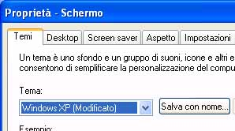

# Etichetta
I controlli <xref:System.Windows.Controls.Label> di solito forniscono informazioni nell'[!INCLUDE[TLA#tla_ui](../../../../includes/tlasharptla-ui-md.md)].  Gli oggetti <xref:System.Windows.Controls.Label> hanno sempre contenuto solo testo, ma poiché l'oggetto <xref:System.Windows.Controls.Label> fornito con [!INCLUDE[TLA#tla_winclient](../../../../includes/tlasharptla-winclient-md.md)] è un oggetto <xref:System.Windows.Controls.ContentControl>, può contenere testo o un oggetto <xref:System.Windows.UIElement>.  
  
 Un oggetto <xref:System.Windows.Controls.Label> fornisce supporto funzionale e visivo per i tasti di scelta.  Viene spesso utilizzato per abilitare l'accesso rapido della tastiera a controlli quali <xref:System.Windows.Controls.TextBox>.  Per assegnare <xref:System.Windows.Controls.Label> a <xref:System.Windows.Controls.Control>, impostare la proprietà <xref:System.Windows.Controls.Label.Target%2A?displayProperty=fullName> al controllo che deve ricevere lo stato attivo quando l'utente preme il tasto di scelta.  
  
 Nella figura riportata di seguito viene illustrato un oggetto <xref:System.Windows.Controls.Label> "Themes" che ha come destinazione un oggetto <xref:System.Windows.Controls.ComboBox>.  Quando l'utente preme ALT\+T, <xref:System.Windows.Controls.ComboBox> riceve lo stato attivo.  Per ulteriori informazioni, vedere [How to: Set the Target Property of a Label](http://msdn.microsoft.com/it-it/b24c6977-ebcb-4855-a9bb-3fd4435af8f8).  
  
   
  
## In questa sezione  
 [How to: Set the Target Property of a Label](http://msdn.microsoft.com/it-it/b24c6977-ebcb-4855-a9bb-3fd4435af8f8)  
  
## Riferimenti  
 <xref:System.Windows.Controls.Label>