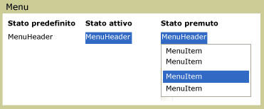

# Menu
<xref:System.Windows.Controls.Menu> è un controllo che consente l'organizzazione gerarchica di elementi associati a comandi e gestori eventi.  Ciascun oggetto <xref:System.Windows.Controls.Menu> può contenere più controlli <xref:System.Windows.Controls.MenuItem>.  Ciascun oggetto <xref:System.Windows.Controls.MenuItem> può richiamare un comando o un gestore eventi `Click`.  <xref:System.Windows.Controls.MenuItem> può inoltre disporre di più elementi <xref:System.Windows.Controls.MenuItem> come elementi figlio, creando un sottomenu.  
  
 Nella figura riportata di seguito vengono illustrati tre stati diversi di un controllo di menu.  Lo stato predefinito si verifica quando nessun dispositivo, ad esempio un puntatore del mouse, si trova su <xref:System.Windows.Controls.Menu>.  Lo stato attivo si verifica quando il puntatore del mouse è posizionato su <xref:System.Windows.Controls.Menu>, mentre lo stato premuto si verifica quando si preme su un pulsante del mouse su <xref:System.Windows.Controls.Menu>.  
  
   
Menu in stati diversi  
  
## In questa sezione  
 [Cenni preliminari sulla classe Menu](../../../../docs/framework/wpf/controls/menu-overview.md)  
  
## Riferimenti  
 <xref:System.Windows.Controls.Menu>  
 <xref:System.Windows.Controls.MenuItem>  
 <xref:System.Windows.Controls.Primitives.MenuBase>  
 <xref:System.Windows.Controls.ContextMenu>  
  
## Sezioni correlate