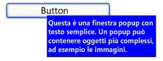

# Popup
Nel controllo <xref:System.Windows.Controls.Primitives.Popup> viene visualizzato il contenuto in una finestra separata mobile rispetto alla finestra dell’applicazione corrente.  
  
 Nell'immagine riportata di seguito viene illustrato un controllo <xref:System.Windows.Controls.Primitives.Popup> posizionato rispetto a <xref:System.Windows.Controls.Button> che è il relativo elemento padre.  
  
   
  
## In questa sezione  
 [Cenni preliminari sul controllo Popup](../../../../docs/framework/wpf/controls/popup-overview.md)  
 [Comportamento del controllo Popup in relazione al posizionamento](../../../../docs/framework/wpf/controls/popup-placement-behavior.md)  
 [Procedure relative](../../../../docs/framework/wpf/controls/popup-how-to-topics.md)  
  
## Riferimenti  
 <xref:System.Windows.Controls.Primitives.Popup>  
  
## Sezioni correlate